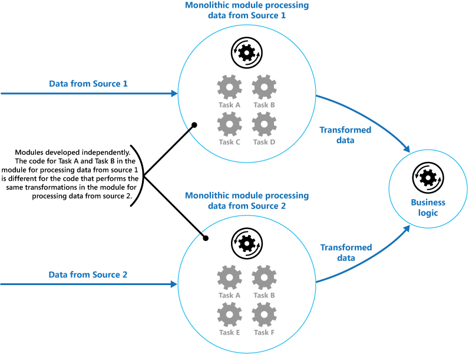
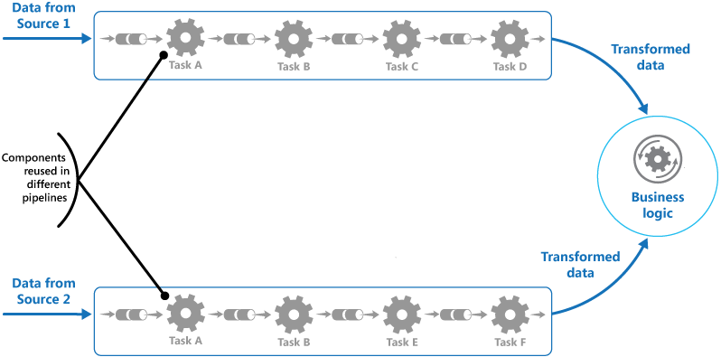
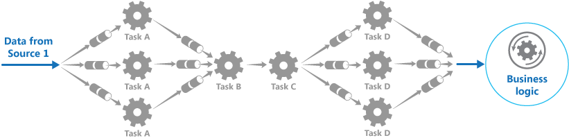
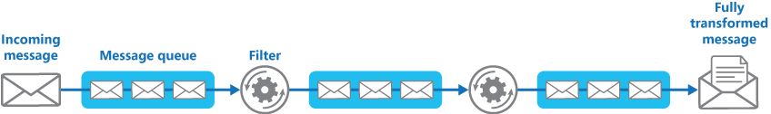

   
# Pipes and Filters

Decompose a task that performs complex processing into a series of separate elements that can be reused. This can improve performance, scalability, and reusability by allowing task elements that perform the processing to be deployed and scaled independently.

## Context and problem

An applications is required to perform a variety of tasks of varying complexity on the information that it processes. A straightforward but inflexible approach to implementing an application is to perform this processing as a monolithic module. However, this approach is likely to reduce the opportunities for refactoring the code, optimizing it, or reusing it if parts of the same processing are required elsewhere within the application. 

The figure illustrates the issues with processing data using the monolithic approach. An application receives and processes data from two sources. The data from each source is processed by a separate module that performs a series of tasks to transform this data, before passing the result to the business logic of the application. 

 

Some of the tasks that the monolithic modules perform are functionally very similar, but the modules have been designed separately. The code that implements the tasks is closely coupled in a module, and has been developed with little or no thought given to reuse or scalability. 

However, the processing tasks performed by each module, or the deployment requirements for each task, could change as business requirements are updated. Some tasks might be compute intensive and could benefit from running on powerful hardware, while others might not require such expensive resources. Also, additional processing might be required in the future, or the order in which the tasks performed by the processing could change. A solution is required that addresses these issues, and increases the possibilities for code reuse. 

## Solution

Break down the processing required for each stream into a set of separate components (or filters), each performing a single task. By standardizing the format of the data that each component receives and sends, these filters can be combined together into a pipeline. This helps to avoid duplicating code, and makes it easy to remove, replace, or integrate additional components if the processing requirements change. The next figure shows a solution implemented using pipes and filters.

 


The time it takes to process a single request depends on the speed of the slowest filter in the pipeline. One or more filters could be a bottleneck, especially if a large number of requests appear in a stream from a particular data source. A key advantage of the pipeline structure is that it provides opportunities for running parallel instances of slow filters, enabling the system to spread the load and improve throughput. 

The filters that make up a pipeline can run on different machines, enabling them to be scaled independently and take advantage of the elasticity that many cloud environments provide. A filter that is computationally intensive can run on high performance hardware, while other less demanding filters can be hosted on less expensive commodity hardware. The filters don't even have to be in the same data center or geographical location, which allows each element in a pipeline to run in an environment that is close to the resources it requires.  The next figure shows an example applied to the pipeline for the data from Source 1. 



If the input and output of a filter are structured as a stream, it's possible to perform the processing for each filter in parallel. The first filter in the pipeline can start its work and output its results, which are passed directly on to the next filter in the sequence before the first filter has completed its work.

Another benefit is the resiliency that this model can provide. If a filter fails or the machine it's running on is no longer available, the pipeline can reschedule the work that the filter was performing and direct this work to another instance of the component. Failure of a single filter doesn't necessarily result in failure of the entire pipeline.

Using the Pipes and Filters pattern in conjunction with the [Compensating Transaction pattern](compensating-transaction.md) is an alternative approach to implementing distributed transactions. A distributed transaction can be broken down into separate, compensable tasks, each of which can be implemented by using a filter that also implements the Compensating Transaction pattern. The filters in a pipeline can be implemented as separate hosted tasks running close to the data that they maintain.

## Issues and considerations

You should consider the following points when deciding how to implement this pattern:
- **Complexity**. The increased flexibility that this pattern provides can also introduce complexity, especially if the filters in a pipeline are distributed across different servers. 

- **Reliability**. Use an infrastructure that ensures that data flowing between filters in a pipeline won't be lost. 

- **Idempotency**. If a filter in a pipeline fails after receiving a message and the work is rescheduled to another instance of the filter, part of the work might have already been completed. If this work updates some aspect of the global state (such as information stored in a database), the same update could be repeated. A similar issue might occur if a filter fails after posting its results to the next filter in the pipeline, but before indicating that it's completed its work successfully. In these cases, the same work could be repeated by another instance of the filter, causing the same results to be posted twice. This could result in subsequent filters in the pipeline processing the same data twice. Therefore filters in a pipeline should be designed to be idempotent. For more information see [Idempotency Patterns](http://blog.jonathanoliver.com/idempotency-patterns/) on Jonathan Oliver’s blog.

- **Repeated messages**. If a filter in a pipeline fails after posting a message to the next stage of the pipeline, another instance of the filter might be run, and it'll post a copy of the same message to the pipeline. This could cause two instances of the same message to be passed to the next filter. To avoid this, the pipeline should detect and eliminate duplicate messages.

    >  If you're implementing the pipeline by using message queues (such as Microsoft Azure Service Bus queues), the message queuing infrastructure might provide automatic duplicate message detection and removal.  

- **Context and state**. In a pipeline, each filter essentially runs in isolation and shouldn't make any assumptions about how it was invoked. This means that each filter should be provided with sufficient context to perform its work. This context could include a large amount of state information. 

## When to use this pattern

Use this pattern when:
- The processing required by an application can easily be broken down into a set of independent steps.

- The processing steps performed by an application have different scalability requirements.

    >  It's possible to group filters that should scale together in the same process. For more information, see the [Compute Resource Consolidation pattern](compute-resource-consolidation.md). 

- Flexibility is required to allow reordering of the processing steps performed by an application, or the capability to add and remove steps.

- The system can benefit from distributing the processing for steps across different servers.

- A reliable solution is required that minimizes the effects of failure in a step while data is being processed. 

This pattern might not be useful when:
- The processing steps performed by an application aren't independent, or they have to be performed together as part of the same transaction.

- The amount of context or state information required by a step makes this approach inefficient. It might be possible to persist state information to a database instead, but don't use this strategy if the additional load on the database causes excessive contention.

## Example

You can use a sequence of message queues to provide the infrastructure required to implement a pipeline. An initial message queue receives unprocessed messages. A component implemented as a filter task listens for a message on this queue, performs its work, and then posts the transformed message to the next queue in the sequence. Another filter task can listen for messages on this queue, process them, post the results to another queue, and so on until the fully transformed data appears in the final message in the queue. The next figure illustrates implementing a pipeline using message queues.




If you're building a solution on Azure you can use Service Bus queues to provide a reliable and scalable queuing mechanism. The `ServiceBusPipeFilter` class shown below in C# demonstrates how you can implement a filter that receives input messages from a queue, processes these messages, and posts the results to another queue.

>  The `ServiceBusPipeFilter` class is defined in the PipesAndFilters.Shared project available from [GitHub](https://github.com/mspnp/cloud-design-patterns/tree/master/samples/pipes-and-filters).

```csharp
public class ServiceBusPipeFilter
{
  ...
  private readonly string inQueuePath;
  private readonly string outQueuePath;
  ...
  private QueueClient inQueue;
  private QueueClient outQueue;
  ...

  public ServiceBusPipeFilter(..., string inQueuePath, string outQueuePath = null)
  {
     ...
     this.inQueuePath = inQueuePath;
     this.outQueuePath = outQueuePath;
  }

  public void Start()
  {
    ...
    // Create the outbound filter queue if it doesn't exist.
    ...
    this.outQueue = QueueClient.CreateFromConnectionString(...);
    
    ...
    // Create the inbound and outbound queue clients.
    this.inQueue = QueueClient.CreateFromConnectionString(...);
  }

  public void OnPipeFilterMessageAsync(
    Func<BrokeredMessage, Task<BrokeredMessage>> asyncFilterTask, ...) 
  {
    ...

    this.inQueue.OnMessageAsync(
      async (msg) =>
    {
      ...
      // Process the filter and send the output to the 
      // next queue in the pipeline.
      var outMessage = await asyncFilterTask(msg);

      // Send the message from the filter processor 
      // to the next queue in the pipeline.
      if (outQueue != null)
      {
        await outQueue.SendAsync(outMessage);
      }

      // Note: There's a chance that the same message could be sent twice 
      // or that a message gets processed by an upstream or downstream 
      // filter at the same time.
      // This would happen in a situation where processing of a message was
      // completed, it was sent to the next pipe/queue, and then failed 
      // to complete when using the PeekLock method.
      // Idempotent message processing and concurrency should be considered 
      // in a real-world implementation.
    },
    options);
  }

  public async Task Close(TimeSpan timespan)
  {
    // Pause the processing threads.
    this.pauseProcessingEvent.Reset();

    // There's no clean approach for waiting for the threads to complete
    // the processing. This example simply stops any new processing, waits
    // for the existing thread to complete, then closes the message pump 
    // and finally returns.
    Thread.Sleep(timespan);

    this.inQueue.Close();
    ...
  }

  ...
}
```

The `Start` method in the `ServiceBusPipeFilter` class connects to a pair of input and output queues, and the `Close` method disconnects from the input queue. The `OnPipeFilterMessageAsync` method performs the actual processing of messages, the `asyncFilterTask` parameter to this method specifies the processing to be performed. The `OnPipeFilterMessageAsync` method waits for incoming messages on the input queue, runs the code specified by the `asyncFilterTask` parameter over each message as it arrives, and posts the results to the output queue. The queues themselves are specified by the constructor. 

The sample solution implements filters in a set of worker roles. Each worker role can be scaled independently, depending on the complexity of the business processing that it performs or the resources required for processing. Additionally, multiple instances of each worker role can be run in parallel to improve throughput. 

The following code shows an Azure worker role named `PipeFilterARoleEntry`, defined in the PipeFilterA project in the sample solution. 

```csharp
public class PipeFilterARoleEntry : RoleEntryPoint
{
  ...
  private ServiceBusPipeFilter pipeFilterA;

  public override bool OnStart()
  {
    ...
    this.pipeFilterA = new ServiceBusPipeFilter(
      ...,
      Constants.QueueAPath,
      Constants.QueueBPath);

    this.pipeFilterA.Start();
    ...
  }

  public override void Run()
  {
    this.pipeFilterA.OnPipeFilterMessageAsync(async (msg) =>
    {
      // Clone the message and update it.
      // Properties set by the broker (Deliver count, enqueue time, ...) 
      // aren't cloned and must be copied over if required.
      var newMsg = msg.Clone();
      
      await Task.Delay(500); // DOING WORK

      Trace.TraceInformation("Filter A processed message:{0} at {1}", 
        msg.MessageId, DateTime.UtcNow);

      newMsg.Properties.Add(Constants.FilterAMessageKey, "Complete");

      return newMsg;
    });

    ...
  }

  ...
}
```

This role contains a `ServiceBusPipeFilter` object. The `OnStart` method in the role connects to the queues for receiving input messages and posting output messages (the names of the queues are defined in the `Constants` class). The `Run` method invokes the `OnPipeFilterMessagesAsync` method to perform some processing on each message that's received (in this example, the processing is simulated by waiting for a short period of time). When processing is complete, a new message is constructed containing the results (in this case, the input message has a custom property added), and this message is posted to the output queue.

The sample code contains another worker role named `PipeFilterBRoleEntry` in the PipeFilterB project. This role is similar to `PipeFilterARoleEntry` except that it performs different processing in the `Run` method. In the example solution, these two roles are combined to construct a pipeline, the output queue for the `PipeFilterARoleEntry` role is the input queue for the `PipeFilterBRoleEntry` role.

The sample solution also provides two additional roles named `InitialSenderRoleEntry` (in the InitialSender project) and `FinalReceiverRoleEntry` (in the FinalReceiver project). The `InitialSenderRoleEntry` role provides the initial message in the pipeline. The `OnStart` method connects to a single queue and the `Run` method posts a method to this queue. This queue is the input queue used by the `PipeFilterARoleEntry` role, so posting a message to it causes the message to be received and processed by the `PipeFilterARoleEntry` role. The processed message then passes through the `PipeFilterBRoleEntry` role.

The input queue for the `FinalReceiveRoleEntry` role is the output queue for the `PipeFilterBRoleEntry` role. The `Run` method in the `FinalReceiveRoleEntry` role, shown below, receives the message and performs some final processing. Then it writes the values of the custom properties added by the filters in the pipeline to the trace output.

```csharp
public class FinalReceiverRoleEntry : RoleEntryPoint
{
  ...
  // Final queue/pipe in the pipeline to process data from.
  private ServiceBusPipeFilter queueFinal;

  public override bool OnStart()
  {
    ...
    // Set up the queue.
    this.queueFinal = new ServiceBusPipeFilter(...,Constants.QueueFinalPath);
    this.queueFinal.Start();
    ...
  }

  public override void Run()
  {
    this.queueFinal.OnPipeFilterMessageAsync(
      async (msg) =>
      {
        await Task.Delay(500); // DOING WORK

        // The pipeline message was received.
        Trace.TraceInformation(
          "Pipeline Message Complete - FilterA:{0} FilterB:{1}",
          msg.Properties[Constants.FilterAMessageKey],
          msg.Properties[Constants.FilterBMessageKey]);

        return null;
      });
    ...
  }

  ...
}
```

##Related patterns and guidance

The following patterns and guidance might also be relevant when implementing this pattern:
- A sample that demonstrates this pattern is available on [GitHub](https://github.com/mspnp/cloud-design-patterns/tree/master/samples/pipes-and-filters).
- [Competing Consumers pattern](competing-consumers.md). A pipeline can contain multiple instances of one or more filters. This approach is useful for running parallel instances of slow filters, enabling the system to spread the load and improve throughput. Each instance of a filter will compete for input with the other instances, two instances of a filter shouldn't be able to process the same data. Provides an explanation of this approach.
- [Compute Resource Consolidation pattern](compute-resource-consolidation.md). It might be possible to group filters that should scale together into the same process. Provides more information about the benefits and tradeoffs of this strategy.
- [Compensating Transaction pattern](compensating-transaction.md). A filter can be implemented as an operation that can be reversed, or that has a compensating operation that restores the state to a previous version in the event of a failure. Explains how this can be implemented to maintain or achieve eventual consistency. 
- [Idempotency Patterns](http://blog.jonathanoliver.com/idempotency-patterns/) on Jonathan Oliver’s blog. 
