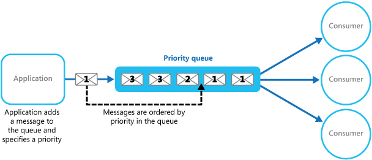
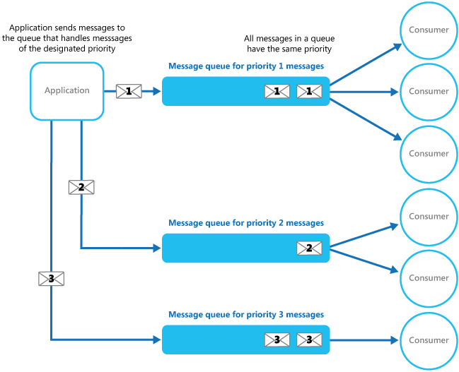
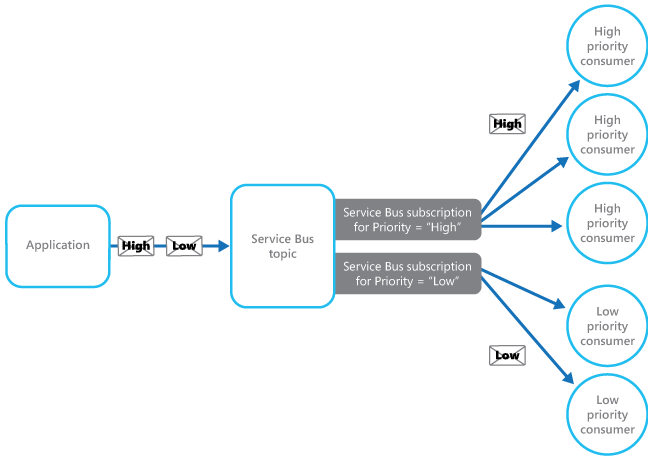

# Priority Queue

Prioritize requests sent to services so that requests with a higher priority are received and processed more quickly than those with a lower priority. This pattern is useful in applications that offer different service level guarantees to individual clients.

## Context and Problem

Applications can delegate specific tasks to other services, for example, to perform background processing or to integrate with other applications or services. In the cloud, a message queue is typically used to delegate tasks to background processing. In many cases the order requests are received in by a service isn't important. In some cases, though, it's necessary to prioritize specific requests. These requests should be processed earlier than lower priority requests that were sent previously by the application.

## Solution
A queue is usually a first-in, first-out (FIFO) structure, and consumers typically receive messages in the same order that they were posted to the queue. However, some message queues support priority messaging. The application posting a message can assign a priority and the messages in the queue are automatically reordered so that those with a higher priority will be received before those with a lower priority. The figure illustrates a queue with priority messaging.



>  Most message queue implementations support multiple consumers (following the [Competing Consumers pattern](https://msdn.microsoft.com/library/dn568101.aspx)), and the number of consumer processes can be scaled up or down depending on demand.

In systems that don't support priority-based message queues, an alternative solution is to maintain a separate queue for each priority. The application is responsible for posting messages to the appropriate queue. Each queue can have a separate pool of consumers. Higher priority queues can have a larger pool of consumers running on faster hardware than lower priority queues. The next figure illustrates using separate message queues for each priority.




A variation on this strategy is to have a single pool of consumers that check for messages on high priority queues first, and only then start to fetch messages from lower priority queues. There are some semantic differences between a solution that uses a single pool of consumer processes (either with a single queue that supports messages with different priorities or with multiple queues that each handle messages of a single priority), and a solution that uses multiple queues with a separate pool for each queue.

In the single pool approach, higher priority messages are always received and processed before lower priority messages. In theory, messages that have a very low priority could be continually superseded and might never be processed. In the multiple pool approach, lower priority messages will always be processed, just not as quickly as those of a higher priority (depending on the relative size of the pools and the resources that they have available).

Using a priority queuing mechanism can provide the following advantages:

- It allows applications to meet business requirements that require prioritization of availability or performance, such as offering different levels of service to specific groups of customers.

- It can help to minimize operational costs. In the single queue approach, you can scale back the number of consumers if necessary. High priority messages will still be processed first (although possibly more slowly), and lower priority messages might be delayed for longer. If you've implemented the multiple message queue approach with separate pools of consumers for each queue, you can reduce the pool of consumers for lower priority queues, or even suspend processing for some very low priority queues by stopping all the consumers that listen for messages on those queues.

- The multiple message queue approach can help maximize application performance and scalability by partitioning messages based on processing requirements. For example, vital tasks can be prioritized to be handled by receivers that run immediately while less important background tasks can be handled by receivers that are scheduled to run at less busy periods.

## Issues and Considerations

Consider the following points when deciding how to implement this pattern:

Define the priorities in the context of the solution. For example, high priority could mean that messages should be processed within ten seconds. Identify the requirements for handling high priority items, and the other resources that should be allocated to meet these criteria.

Decide if all high priority items must be processed before any lower priority items. If the messages are being processed by a single pool of consumers, you have to provide a mechanism that can preempt and suspend a task that's handling a low priority message if a higher priority message becomes available.

In the multiple queue approach, when using a single pool of consumer processes that listen on all queues rather than a dedicated consumer pool for each queue, the consumer must apply an algorithm that ensures it always services messages from higher priority queues before those from lower priority queues.

Monitor the processing speed on high and low priority queues to ensure that messages in these queues are processed at the expected rates.

If you need to guarantee that low priority messages will be processed, it's necessary to implement the multiple message queue approach with multiple pools of consumers. Alternatively, in a queue that supports message prioritization, it's possible to dynamically increase the priority of a queued message as it ages. However, this approach depends on the message queue providing this feature.

Using a separate queue for each message priority works best for systems that have a small number of well-defined priorities.

Message priorities can be determined logically by the system. For example, rather than having explicit high and low priority messages, they could be designated as “fee paying customer,” or “non-fee paying customer.” Depending on your business model, your system can allocate more resources to processing messages from fee paying customers than non-fee paying ones.

There might be a financial and processing cost associated with checking a queue for a message (some commercial messaging systems charge a small fee each time a message is posted or retrieved, and each time a queue is queried for messages). This cost increases when checking multiple queues.

It's possible to dynamically adjust the size of a pool of consumers based on the length of the queue that the pool is servicing. For more information, see the [Autoscaling Guidance](https://msdn.microsoft.com/library/dn589774.aspx).

## When to use this pattern

This pattern is useful in scenarios where:

- The system must handle multiple tasks that have different priorities.

- Different users or tenants should be served with different priority.

## Example

Microsoft Azure doesn't provide a queuing mechanism that natively supports automatic prioritization of messages through sorting. However, it does provide Azure Service Bus topics and subscriptions that support a queuing mechanism that provides message filtering, together with a wide range of flexible capabilities that make it ideal for use in most priority queue implementations.

An Azure solution can implement a Service Bus topic an application can post messages to, in the same way as a queue. Messages can contain metadata in the form of application-defined custom properties. Service Bus subscriptions can be associated with the topic, and these subscriptions can filter messages based on their properties. When an application sends a message to a topic, the message is directed to the appropriate subscription where it can be read by a consumer. Consumer processes can retrieve messages from a subscription using the same semantics as a message queue (a subscription is a logical queue). The following figure illustrates implementing a priority queue with Azure Service Bus topics and subscriptions.




In the figure above, the application creates several messages and assigns a custom property called `Priority` in each message with a value, either `High` or `Low`. The application posts these messages to a topic. The topic has two associated subscriptions that both filter messages by examining the `Priority` property. One subscription accepts messages where the `Priority` property is set to `High`, and the other accepts messages where the `Priority` property is set to `Low`. A pool of consumers reads messages from each subscription. The high priority subscription has a larger pool, and these consumers might be running on more powerful computers with more resources available than the consumers in the low priority pool.

Note that there's nothing special about the designation of high and low priority messages in this example. They're simply labels specified as properties in each message, and are used to direct messages to a specific subscription. If additional priorities are required, it's relatively easy to create further subscriptions and pools of consumer processes to handle these priorities.

The PriorityQueue solution available on [GitHub](https://github.com/mspnp/cloud-design-patterns/tree/master/priority-queue) contains an implementation of this approach. This solution contains two worker role projects named `PriorityQueue.High` and `PriorityQueue.Low`. These worker roles inherit from the `PriorityWorkerRole` class that contains the functionality for connecting to a specified subscription in the `OnStart` method.

The `PriorityQueue.High` and `PriorityQueue.Low` worker roles connect to different subscriptions, defined by their configuration settings. An administrator can configure different numbers of each role to be run. Typically there'll be more instances of the `PriorityQueue.High` worker role than the `PriorityQueue.Low` worker role.

The `Run` method in the `PriorityWorkerRole` class arranges for the virtual `ProcessMessage` method (also defined in the `PriorityWorkerRole` class) to be run for each message received on the queue. The following code shows the `Run` and `ProcessMessage` methods. The `QueueManager` class, defined in the PriorityQueue.Shared project, provides helper methods for using Azure Service Bus queues.

```csharp
public class PriorityWorkerRole : RoleEntryPoint
{
  private QueueManager queueManager;
  ...

  public override void Run()
  {
    // Start listening for messages on the subscription.
    var subscriptionName = CloudConfigurationManager.GetSetting("SubscriptionName");
    this.queueManager.ReceiveMessages(subscriptionName, this.ProcessMessage);
    ...;
  }
  ...

  protected virtual async Task ProcessMessage(BrokeredMessage message)
  {
    // Simulating processing.
    await Task.Delay(TimeSpan.FromSeconds(2));
  }
}
```
The `PriorityQueue.High` and `PriorityQueue.Low` worker roles both override the default functionality of the `ProcessMessage` method. The code below shows the `ProcessMessage` method for the `PriorityQueue.High` worker role.

```csharp
protected override async Task ProcessMessage(BrokeredMessage message)
{
  // Simulate message processing for High priority messages.
  await base.ProcessMessage(message);
  Trace.TraceInformation("High priority message processed by " +
    RoleEnvironment.CurrentRoleInstance.Id + " MessageId: " + message.MessageId);
}
```

When an application posts messages to the topic associated with the subscriptions used by the `PriorityQueue.High` and `PriorityQueue.Low` worker roles, it specifies the priority by using the `Priority` custom property, as shown in the following code example. This code (implemented in the `WorkerRole` class in the PriorityQueue.Sender project), uses the `SendBatchAsync` helper method of the `QueueManager` class to post messages to a topic in batches.

```csharp
// Send a low priority batch. 
var lowMessages = new List<BrokeredMessage>();

for (int i = 0; i < 10; i++)
{
  var message = new BrokeredMessage() { MessageId = Guid.NewGuid().ToString() };
  message.Properties["Priority"] = Priority.Low;
  lowMessages.Add(message);
}

this.queueManager.SendBatchAsync(lowMessages).Wait();
...

// Send a high priority batch.
var highMessages = new List<BrokeredMessage>();

for (int i = 0; i < 10; i++)
{
  var message = new BrokeredMessage() { MessageId = Guid.NewGuid().ToString() };
  message.Properties["Priority"] = Priority.High;
  highMessages.Add(message);
}

this.queueManager.SendBatchAsync(highMessages).Wait();
```

## Related patterns and guidance

The following patterns and guidance might also be relevant when implementing this pattern:

- A sample that demonstrates this pattern is available on [GitHub](https://github.com/mspnp/cloud-design-patterns/tree/master/priority-queue).

- [Asynchronous Messaging Primer](https://msdn.microsoft.com/library/dn589781.aspx). A consumer service that processes a request might need to send a reply to the instance of the application that posted the request. Provides information on the strategies that you can use to implement request/response messaging.

- [Competing Consumers pattern](competing-consumers.md). To increase the throughput of the queues, it’s possible to have multiple consumers that listen on the same queue, and process the tasks in parallel. These consumers will compete for messages, but only one should be able to process each message. Provides more information on the benefits and tradeoffs of implementing this approach.

- [Throttling pattern](throttling.md). You can implement throttling by using queues. Priority messaging can be used to ensure that requests from critical applications, or applications being run by high-value customers, are given priority over requests from less important applications.

- [Autoscaling Guidance](https://msdn.microsoft.com/library/dn589774.aspx). It might be possible to scale the size of the pool of consumer processes handling a queue depending on the length of the queue. This strategy can help to improve performance, especially for pools handling high priority messages.

- [Enterprise Integration Patterns with Service Bus](http://abhishekrlal.com/2013/01/11/enterprise-integration-patterns-with-service-bus-part-2/) on Abhishek Lal’s blog.

