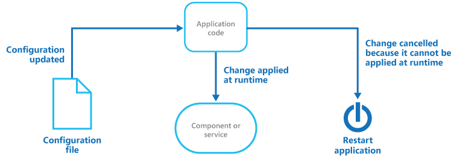

   
# Runtime Reconfiguration

Design an application so that it can be reconfigured without requiring redeployment or restarting the application. This helps to maintain availability and minimize downtime. 

## Context and problem

A primary goal for applications such as commercial and business websites is to minimize downtime and interruption to customers and users. Sometimes it's necessary to reconfigure the application to change specific behavior or settings while it's deployed and in use. Therefore, it's an advantage for the application to be designed to allow these configuration changes to be applied while it's running, and for the components of the application to detect the changes and apply them as soon as possible.

Examples of the kinds of configuration changes to be applied might be adjusting the granularity of logging to assist in debugging a problem with the application, swapping connection strings to use a different data store, or turning on or off specific sections or functionality of the application.

## Solution

The solution for implementing this pattern depends on the features available in the application hosting environment. Typically, the application code will respond to one or more events that are raised by the hosting infrastructure when it detects a change to the application configuration. This is usually the result of uploading a new configuration file, or in response to changes in the configuration through the administration portal or by accessing an API.

Code that handles the configuration change events can examine the changes and apply them to the components of the application. These components have to detect and react to the changes, and so the values they use will usually be exposed as writable properties or methods that the code in the event handler can set to new values or execute. From this point, the components should use the new values so that the required changes to the application behavior occur.

If it isn't possible for the components to apply the changes at runtime, it'll be necessary to restart the application so that these changes are applied when the application starts up again. In some hosting environments it's possible to detect these types of changes, and indicate to the environment that the application must be restarted. In other cases it might be necessary to implement code that analyses the setting changes and forces an application restart when necessary.

The figure shows an overview of this pattern.




Most environments expose events raised in response to configuration changes. In those that don't, it will be necessary to have a polling mechanism that regularly checks for changes to the configuration and applies these changes. It might also be necessary to restart the application if the changes can't be applied at runtime. For example, it's possible to compare the date and time of a configuration file at preset intervals, and run code to apply the changes when a newer version is found. Another approach is to incorporate a control in the administration UI of the application, or expose a secured endpoint that can be accessed from outside the application, that executes code that reads and applies the updated configuration. 

Alternatively, the application can react to some other change in the environment. For example, occurrences of a specific runtime error might change the logging configuration to automatically collect additional information, or the code could use the current date to read and apply a theme that reflects the season or a special event. 

## Issues and considerations

Consider the following points when deciding how to implement this pattern:

The configuration settings must be stored outside of the deployed application so they can be updated without requiring the entire package to be redeployed. Typically, the settings are stored in a configuration file, or in an external repository such as a database or online storage. Access to the runtime configuration mechanism should be strictly controlled, as well as strictly audited when used.

If the hosting infrastructure doesn't automatically detect configuration change events, and expose these events to the application code, you must implement an alternative mechanism to detect and apply the changes. This can be through a polling mechanism, or by exposing an interactive control or endpoint that initiates the update process. 

If you need to implement a polling mechanism, consider how often checks for updates to the configuration should take place. A long polling interval means that changes might not be applied for some time. A short interval might adversely affect operation by absorbing available compute and I/O resources.

If there's more than one instance of the application, additional factors should be considered, depending on how changes are detected. If changes are detected automatically through events raised by the hosting infrastructure, they might not be detected by all application instances at the same time. This means that some instances will be using the original configuration for a period while others will use the new settings. If the update is detected through a polling mechanism, this must communicate the change to all instances in order to maintain consistency.

Some configuration changes require the application to be restarted, or even require the hosting server to be rebooted. You must identify these types of configuration settings and perform the appropriate action for each one. For example, a change that requires the application be restarted might do this automatically, or it might be the responsibility of the administrator to initiate the restart when the application isn't under excessive load and other instances of the application can handle the load. 

Plan for a staged rollout of updates and confirm they're successful, and that the updated application instances are performing correctly, before applying the update to all instances. This can prevent a total outage of the application should an error occur. Where the update requires a restart or a reboot of the application, particularly where the application has a significant start up or warm up time, use a staged rollout to prevent multiple instances being offline at the same time.

Consider how you'll roll back configuration changes that cause issues, or that result in failure of the application. For example, it should be possible to roll back a change immediately instead of waiting for a polling interval to detect the change. 

Consider how the location of the configuration settings might affect application performance. For example, handle any errors that might occur if the external store is unavailable when the application starts, or when configuration changes are applied. You can do this using a default configuration or by caching the settings locally on the server and reusing these values while retrying access to the remote data store.

Caching can help to reduce delays if a component needs to repeatedly access configuration settings. However, when the configuration changes, the application code has to invalidate the cached settings, and the component must use the updated settings. 

## When to use this pattern

This pattern is useful for:

- Applications that have to avoid all unnecessary downtime, while still being able to apply changes to the application configuration.

- Environments that expose events raised automatically when the main configuration changes. Typically this is when a new configuration file is detected, or when changes are made to an existing configuration file. 

- Applications where the configuration changes often and the changes can be applied to components without requiring the application to be restarted, or without requiring the hosting server to be rebooted.

This pattern might not be useful if the runtime components are designed so they can only be configured at initialization time, and the effort of updating those components can't be justified in comparison to restarting the application and enduring a short downtime. 

## Example

Microsoft Azure Cloud Services roles detect and expose two events that are raised when the hosting environment detects a change to the ServiceConfiguration.cscfg files:

- **RoleEnvironment.Changing**. This event is raised after a configuration change is detected, but before it's applied to the application. You can handle the event to query the changes and to cancel the runtime reconfiguration. If you cancel the change, the web or worker role will be restarted automatically so that the new configuration is used by the application.
- **RoleEnvironment.Changed**. This event is raised after the application configuration has been applied. You can handle the event to query the changes that were applied.

When you cancel a change in the `RoleEnvironment.Changing` event you're indicating to Azure that a new setting can't be applied while the application is running, and that it must be restarted in order to use the new value. Effectively, you'll cancel a change only if your application or component can't react to the change at runtime, and requires a restart in order to use the new value.

>  For more information, see [RoleEnvironment.Changing Event](https://msdn.microsoft.com/library/azure/microsoft.windowsazure.serviceruntime.roleenvironment.changing.aspx). 

To handle the `RoleEnvironment.Changing` and `RoleEnvironment.Changed` events you typically add a custom handler to the event. For example, the following code from the `Global.asax.cs` class (in the Runtime Reconfiguration solution available from [GitHub](https://github.com/mspnp/cloud-design-patterns/tree/master/samples/runtime-reconfiguration)) shows how to add a custom function named `RoleEnvironment_Changed` to the event handler chain. This is from the Global.asax.cs file of the example.

>  The examples for this pattern are in the RuntimeReconfiguration.Web project of the RuntimeReconfiguration solution. 

```csharp
protected void Application_Start(object sender, EventArgs e)
{
  ConfigureFromSetting(CustomSettingName);
  RoleEnvironment.Changed += this.RoleEnvironment_Changed;
}
```

In a web or worker role you can use similar code in the `OnStart` event handler of the role to handle the `RoleEnvironment.Changing` event. This is from the WebRole.cs file of the example.

```csharp
public override bool OnStart()
{
  // Add the trace listener. The web role process isn't configured by web.config.
  Trace.Listeners.Add(new DiagnosticMonitorTraceListener());

  RoleEnvironment.Changing +=   this.RoleEnvironment_Changing;
  return base.OnStart();
}
```

Be aware that, in the case of web roles, the `OnStart` event handler runs in a separate process from the web application process. This is why you typically handle the `RoleEnvironment.Changed` event handler in the Global.asax file so that you can update the runtime configuration of your web application, and the `RoleEnvironment.Changing` event in the role. In the case of a worker role, you can subscribe to both the `RoleEnvironment.Changing` and `RoleEnvironment.Changed` events in the `OnStart` event handler.

>  You can store custom configuration settings in the service configuration file, in a custom configuration file, in a database such as Azure SQL Database or SQL Server in a Virtual Machine, or in Azure blob or table storage. You'll need to create code that can access the custom configuration settings and apply these to the application&mdash;typically by setting the properties of components in the application.  

For example, the following custom function reads the value of a setting from the Azure service configuration file and then applies it to the current instance of a runtime component named `SomeRuntimeComponent`. This is from the Global.asax.cs file of the example.

>  Some configuration settings, such as those for Windows Identity Framework, can't be stored in the Azure service configuration file and must be in the App.config or Web.config file. 

```csharp
private static void ConfigureFromSetting(string settingName)
{
  var value = RoleEnvironment.GetConfigurationSettingValue(settingName);
  SomeRuntimeComponent.Instance.CurrentValue = value;
}
```

In Azure, some configuration changes are detected and applied automatically. This includes the configuration of the Azure diagnostics system in the Diagnostics.wadcfg file that specifies the types of information to collect and how to persist the log files. Therefore, it's only necessary to write code that handles the custom settings you add to the service configuration file. Your code should either:

- Apply the custom settings from an updated configuration to the appropriate components of your application at runtime so that their behavior reflects the new configuration.

- Cancel the change to tell Azure that the new value can't be applied at runtime, and that the application must be restarted in order for the change to be applied. 

For example, the following code shows how you can use the `RoleEnvironment.Changing` event to cancel the update for all settings except the ones that can be applied at runtime without requiring a restart. This example allows a change to the "CustomSetting" to be applied at runtime without restarting the application. The component that uses this setting will be able to read the new value and change its behavior accordingly at runtime. Any other change to the configuration will automatically cause the web or worker role to restart. 

```csharp
private void RoleEnvironment_Changing(object sender,
                               RoleEnvironmentChangingEventArgs e)
{
  var changedSettings = e.Changes.OfType<RoleEnvironmentConfigurationSettingChange>()
                                 .Select(c => c.ConfigurationSettingName).ToList();
  Trace.TraceInformation("Changing notification. Settings being changed: "
                         + string.Join(", ", changedSettings));

  if (changedSettings
    .Any(settingName => !string.Equals(settingName, CustomSettingName,
                               StringComparison.Ordinal)))
  {
    Trace.TraceInformation("Cancelling dynamic configuration change (restarting).");

    // Setting this to true will restart the role gracefully. If Cancel isn't 
    // set to true, and the change isn't handled by the application, the 
    // application won't use the new value until it's restarted (either 
    // manually or for some other reason).
    e.Cancel = true; 
  }
  Else
  {
    Trace.TraceInformation("Handling configuration change without restarting. ");
  }
}
```

>  This approach demonstrates good practice because it ensures that a change to any setting that the application code isn't aware of (and so can't be sure it can be applied at runtime) will cause a restart. If any one of the changes is cancelled, the role will be restarted.  

Updates that aren't cancelled in the `RoleEnvironment.Changing` event handler can then be detected and applied to the application components after the new configuration has been accepted by the Azure framework. For example, the following code in the `Global.asax` file of the example solution handles the `RoleEnvironment.Changed` event. It examines each configuration setting and, when it finds the “CustomSetting”, calls a function that applies the new setting to the appropriate component in the application. 

```csharp
private void RoleEnvironment_Changed(object sender, 
                               RoleEnvironmentChangedEventArgs e)
{
  Trace.TraceInformation("Updating instance with new configuration settings.");

  foreach (var settingChange in
           e.Changes.OfType<RoleEnvironmentConfigurationSettingChange>())
  {
    if (string.Equals(settingChange.ConfigurationSettingName, 
                      CustomSettingName, 
                      StringComparison.Ordinal))
    {
      // Execute a function to update the configuration of the component.
      ConfigureFromSetting(CustomSettingName );
    }
  }
}
```

Note that if you fail to cancel a configuration change, but don't apply the new value to your application component, then the change won't take effect until the next time that the application is restarted. This can lead to unpredictable behavior, particularly if the hosting role instance is restarted automatically by Azure as part of its regular maintenance operations&mdash;at which point the new setting value will be applied.

## Related patterns and guidance

- A sample that demonstrates this pattern is available on [GitHub](https://github.com/mspnp/cloud-design-patterns/tree/master/samples/runtime-reconfiguration).
- Moving configuration information out of the application deployment package to a centralized location can provide easier management and control of configuration data, and allows sharing of configuration data across applications and application instances. For more information, see [External Configuration Store pattern](external-configuration-store.md). 
