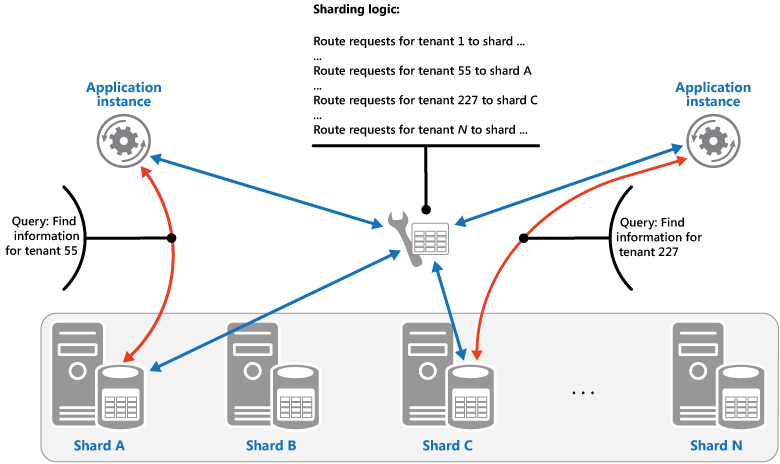
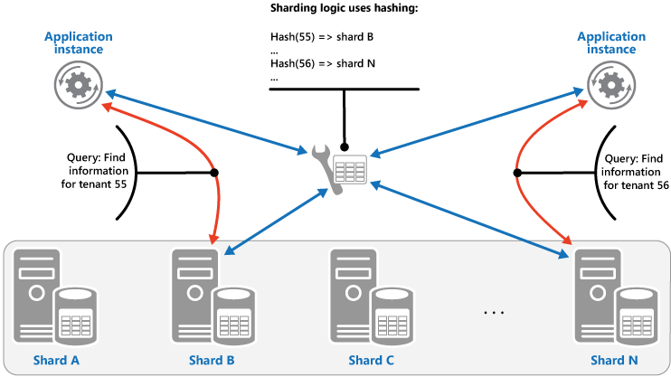

   
# Sharding 

Divide a data store into a set of horizontal partitions or shards. This can improve scalability when storing and accessing large volumes of data.

## Context and problem

A data store hosted by a single server might be subject to the following limitations: 

- **Storage space**. A data store for a large-scale cloud application is expected to contain a huge volume of data that could increase significantly over time. A server typically provides only a finite amount of disk storage, but you can replace existing disks with larger ones, or add further disks to a machine as data volumes grow. However, the system will eventually reach a limit where it isn't possible to easily increase the storage capacity on a given server.

- **Computing resources**. A cloud application is required to support a large number of concurrent users, each of which run queries that retrieve information from the data store. A single server hosting the data store might not be able to provide the necessary computing power to support this load, resulting in extended response times for users and frequent failures as applications attempting to store and retrieve data time out. It might be possible to add memory or upgrade processors, but the system will reach a limit when it isn't possible to increase the compute resources any further.

- **Network bandwidth**. Ultimately, the performance of a data store running on a single server is governed by the rate the server can receive requests and send replies. It's possible that the volume of network traffic might exceed the capacity of the network used to connect to the server, resulting in failed requests.

- **Geography**. It might be necessary to store data generated by specific users in the same region as those users for legal, compliance, or performance reasons, or to reduce latency of data access. If the users are dispersed across different countries or regions, it might not be possible to store the entire data for the application in a single data store.

Scaling vertically by adding more disk capacity, processing power, memory, and network connections can postpone the effects of some of these limitations, but it's likely to only be a temporary solution. A commercial cloud application capable of supporting large numbers of users and high volumes of data must be able to scale almost indefinitely, so vertical scaling isn't necessarily the best solution. 

## Solution

Divide the data store into horizontal partitions or shards. Each shard has the same schema, but holds its own distinct subset of the data. A shard is a data store in its own right (it can contain the data for many entities of different types), running on a server acting as a storage node. 

This pattern has the following benefits: 

- You can scale the system out by adding further shards running on additional storage nodes.

- A system can use off-the-shelf hardware rather than specialized and expensive computers for each storage node.

- You can reduce contention and improve performance by balancing the workload across shards.

- In the cloud, shards can be located physically close to the users that'll access the data.

When dividing a data store up into shards, decide which data should be placed in each shard. A shard typically contains items that fall within a specified range determined by one or more attributes of the data. These attributes form the shard key (sometimes referred to as the partition key). The shard key should be static. It shouldn't be based on data that might change.

Sharding physically organizes the data. When an application stores and retrieves data, the sharding logic directs the application to the appropriate shard. This sharding logic can be implemented as part of the data access code in the application, or it could be implemented by the data storage system if it transparently supports sharding. 

Abstracting the physical location of the data in the sharding logic provides a high level of control over which shards contain which data. It also enables data to migrate between shards without reworking the business logic of an application if the data in the shards need to be redistributed later (for example, if the shards become unbalanced). The tradeoff is the additional data access overhead required in determining the location of each data item as it's retrieved.

To ensure optimal performance and scalability, it's important to split the data in a way that's appropriate for the types of queries that the application performs. In many cases, it's unlikely that the sharding scheme will exactly match the requirements of every query. For example, in a multi-tenant system an application might need to retrieve tenant data using the tenant ID, but it might also need to look up this data based on some other attribute such as the tenant’s name or location. To handle these situations, implement a sharding strategy with a shard key that supports the most commonly performed queries. 

If queries regularly retrieve data using a combination of attribute values, you can likely define a composite shard key by linking attributes together. Alternatively, use a pattern such as [Index Table](index-table.md) to provide fast lookup to data based on attributes that aren't covered by the shard key. 

## Sharding strategies 

Three strategies are commonly used when selecting the shard key and deciding how to distribute data across shards. Note that there doesn't have to be a one-to-one correspondence between shards and the servers that host them&mdash;a single server can host multiple shards. The strategies are: 

**The Lookup strategy**. In this strategy the sharding logic implements a map that routes a request for data to the shard that contains that data using the shard key. In a multi-tenant application all the data for a tenant might be stored together in a shard using the tenant ID as the shard key. Multiple tenants might share the same shard, but the data for a single tenant won't be spread across multiple shards. The figure illustrates harding tenant data based on tenant IDs.

   

     
   The mapping between the shard key and the physical storage can be based on physical shards where each shard key maps to a physical partition. Alternatively, a more flexible technique for rebalancing shards is virtual partitioning, where shard keys map to the same number of virtual shards, which in turn map to fewer physical partitions. In this approach, an application locates data using a shard key that refers to a virtual shard, and the system transparently maps virtual shards to physical partitions. The mapping between a virtual shard and a physical partition can change without requiring the application code be modified to use a different set of shard keys.

**The Range strategy**. This strategy groups related items together in the same shard, and orders them by shard key&mdash;the shard keys are sequential. It's useful for applications that frequently retrieve sets of items using range queries (queries that return a set of data items for a shard key that falls within a given range). For example, if an application regularly needs to find all orders placed in a given month, this data can be retrieved more quickly if all orders for a month are stored in date and time order in the same shard. If each order was stored in a different shard, they'd have to be fetched individually by performing a large number of point queries (queries that return a single data item). The next figure illustrates storing sequential sets (ranges) of data in shard.

   

In this example, the shard key is a composite key containing the order month as the most significant element, followed by the order day and the time. The data for orders is naturally sorted when new orders are created and added to a shard. Some data stores support two-part shard keys containing a partition key element that identifies the shard and a row key that uniquely identifies an item in the shard. Data is usually held in row key order in the shard. Items that are subject to range queries and need to be grouped together can use a shard key that has the same value for the partition key but a unique value for the row key.

**The Hash strategy**. The purpose of this strategy is to reduce the chance of hotspots (shards that receive a disproportionate amount of load). It distributes the data across the shards in a way that achieves a balance between the size of each shard and the average load that each shard will encounter. The sharding logic computes the shard to store an item in based on a hash of one or more attributes of the data. The chosen hashing function should distribute data evenly across the shards, possibly by introducing some random element into the computation. The next figure illustrates sharding tenant data based on a hash of tenant IDs.

   

To understand the advantage of the Hash strategy over other sharding strategies, consider how a multi-tenant application that enrolls new tenants sequentially might assign the tenants to shards in the data store. When using the Range strategy, the data for tenants 1 to n will all be stored in shard A, the data for tenants n+1 to m will all be stored in shard B, and so on. If the most recently registered tenants are also the most active, most data activity will occur in a small number of shards, which could cause hotspots. In contrast, the Hash strategy allocates tenants to shards based on a hash of their tenant ID. This means that sequential tenants are most likely to be allocated to different shards, which will distribute the load across them. The previous figure shows this for tenants 55 and 56.

The three sharding strategies have the following advantages and considerations:

- **Lookup**. This offers more control over the way that shards are configured and used. Using virtual shards reduces the impact when rebalancing data because new physical partitions can be added to even out the workload. The mapping between a virtual shard and the physical partitions that implement the shard can be modified without affecting application code that uses a shard key to store and retrieve data. Looking up shard locations can impose an additional overhead.
 
- **Range**. This is easy to implement and works well with range queries because they can often fetch multiple data items from a single shard in a single operation. This strategy offers easier data management. For example, if users in the same region are in the same shard, updates can be scheduled in each time zone based on the local load and demand pattern. However, this strategy doesn't provide optimal balancing between shards. Rebalancing shards is difficult and might not resolve the problem of uneven load if the majority of activity is for adjacent shard keys.
 
- **Hash**. This strategy offers a better chance of more even data and load distribution. Request routing can be accomplished directly by using the hash function. There's no need to maintain a map. Note that computing the hash might impose an additional overhead. Also, rebalancing shards is difficult.
 
Most common sharding systems implement one of the approaches described above, but you should also consider the business requirements of your applications and their patterns of data usage. For example, in a multi-tenant application:

- You can shard data based on workload. You could segregate the data for highly volatile tenants in separate shards. The speed of data access for other tenants might be improved as a result.

- You can shard data based on the location of tenants. You can take the data for tenants in a specific geographic region offline for backup and maintenance during off-peak hours in that region, while the data for tenants in other regions remains online and accessible during their business hours. 

- High-value tenants could be assigned their own private, high performing, lightly loaded shards, whereas lower-value tenants might be expected to share more densely-packed, busy shards.

- The data for tenants that need a high degree of data isolation and privacy can be stored on a completely separate server.

## Scaling and data movement operations 

Each of the sharding strategies implies different capabilities and levels of complexity for managing scale in, scale out, data movement, and maintaining state. 

The Lookup strategy permits scaling and data movement operations to be carried out at the user level, either online or offline. The technique is to suspend some or all user activity (perhaps during off-peak periods), move the data to the new virtual partition or physical shard, change the mappings, invalidate or refresh any caches that hold this data, and then allow user activity to resume. Often this type of operation can be centrally managed. The Lookup strategy requires state to be highly cacheable and replica friendly.

The Range strategy imposes some limitations on scaling and data movement operations, which must typically be carried out when a part or all of the data store is offline because the data must be split and merged across the shards. Moving the data to rebalance shards might not resolve the problem of uneven load if the majority of activity is for adjacent shard keys or data identifiers that are within the same range. The Range strategy might also require some state to be maintained in order to map ranges to the physical partitions.

The Hash strategy makes scaling and data movement operations more complex because the partition keys are hashes of the shard keys or data identifiers. The new location of each shard must be determined from the hash function, or the function modified to provide the correct mappings. However, the Hash strategy doesn't require maintenance of state. 

## Issues and considerations

Consider the following points when deciding how to implement this pattern: 

- Sharding is complementary to other forms of partitioning, such as vertical partitioning and functional partitioning. For example, a single shard can contain entities that have been partitioned vertically, and a functional partition can be implemented as multiple shards. For more information about partitioning, see the [Data Partitioning Guidance](https://msdn.microsoft.com/library/dn589795.aspx).

- Keep shards balanced so they all handle a similar volume of I/O. As data is inserted and deleted, it's necessary to periodically rebalance the shards to guarantee an even distribution and to reduce the chance of hotspots. Rebalancing can be an expensive operation. To reduce the necessity of rebalancing, plan for growth by ensuring that each shard contains sufficient free space to handle the expected volume of changes. You should also develop strategies and scripts you can use to quickly rebalance shards if this becomes necessary.

- Use stable data for the shard key. If the shard key changes, the corresponding data item might have to move between shards, increasing the amount of work performed by update operations. For this reason, avoid basing the shard key on potentially volatile information. Instead, look for attributes that are invariant or that naturally form a key.

- Ensure that shard keys are unique. For example, avoid using autoincrementing fields as the shard key. Is some systems, autoincremented fields can't be coordinated across shards, possibly resulting in items in different shards having the same shard key.

    >  Autoincremented values in other fields that are not shard keys can also cause problems. For example, if you use autoincremented fields to generate unique IDs, then two different items located in different shards might be assigned the same ID. 

- It might not be possible to design a shard key that matches the requirements of every possible query against the data. Shard the data to support the most frequently performed queries, and if necessary create secondary index tables to support queries that retrieve data using criteria based on attributes that aren't part of the shard key. For more information, see the [Index Table pattern](index-table.md).

- Queries that access only a single shard are more efficient than those that retrieve data from multiple shards, so avoid implementing a sharding system that results in applications performing large numbers of queries that join data held in different shards. Remember that a single shard can contain the data for multiple types of entities. Consider denormalizing your data to keep related entities that are commonly queried together (such as the details of customers and the orders that they have placed) in the same shard to reduce the number of separate reads that an application performs. 

    >  If an entity in one shard references an entity stored in another shard, include the shard key for the second entity as part of the schema for the first entity. This can help to improve the performance of queries that reference related data across shards. 

- If an application must perform queries that retrieve data from multiple shards, it might be possible to fetch this data by using parallel tasks. Examples include fan-out queries, where data from multiple shards is retrieved in parallel and then aggregated into a single result. However, this approach inevitably adds some complexity to the data access logic of a solution. 

- For many applications, creating a larger number of small shards can be more efficient than having a small number of large shards because they can offer increased opportunities for load balancing. This can also be useful if you anticipate the need to migrate shards from one physical location to another. Moving a small shard is quicker than moving a large one.

- Make sure the resources available to each shard storage node are sufficient to handle the scalability requirements in terms of data size and throughput. For more information, see the section “Designing Partitions for Scalability” in the [Data Partitioning Guidance](https://msdn.microsoft.com/library/dn589795.aspx).

- Consider replicating reference data to all shards. If an operation that retrieves data from a shard also references static or slow-moving data as part of the same query, add this data to the shard. The application can then fetch all of the data for the query easily, without having to make an additional round trip to a separate data store. 

    >  If reference data held in multiple shards changes, the system must synchronize these changes across all shards. The system can experience a degree of inconsistency while this synchronization occurs. If you do this, you should design your applications to be able to handle it. 

- It can be difficult to maintain referential integrity and consistency between shards, so you should minimize operations that affect data in multiple shards. If an application must modify data across shards, evaluate whether complete data consistency is actually required. Instead, a common approach in the cloud is to implement eventual consistency. The data in each partition is updated separately, and the application logic must take responsibility for ensuring that the updates all complete successfully, as well as handling the inconsistencies that can arise from querying data while an eventually consistent operation is running. For more information about implementing eventual consistency, see the [Data Consistency Primer](https://msdn.microsoft.com/library/dn589800.aspx).

- Configuring and managing a large number of shards can be a challenge. Tasks such as monitoring, backing up, checking for consistency, and logging or auditing must be accomplished on multiple shards and servers, possibly held in multiple locations. These tasks are likely to be implemented using scripts or other automation solutions, but that might not completely eliminate the additional administrative requirements. 

- Shards can be geolocated so that the data that they contain is close to the instances of an application that use it. This approach can considerably improve performance, but requires additional consideration for tasks that must access multiple shards in different locations. 

## When to use this pattern

Use this pattern when a data store is likely to need to scale beyond the resources available to a single storage node, or to improve performance by reducing contention in a data store.

>  The primary focus of sharding is to improve the performance and scalability of a system, but as a by-product it can also improve availability due to how the data is divided into separate partitions. A failure in one partition doesn't necessarily prevent an application from accessing data held in other partitions, and an operator can perform maintenance or recovery of one or more partitions without making the entire data for an application inaccessible. For more information, see the [Data Partitioning Guidance](https://msdn.microsoft.com/library/dn589795.aspx). 

## Example

The following example in C# uses a set of SQL Server databases acting as shards. Each database holds a subset of the data used by an application. The application retrieves data that's distributed across the shards using its own sharding logic (this is an example of a fan-out query). The details of the data that's located in each shard is returned by a method called `GetShards`. This method returns an enumerable list of `ShardInformation` objects, where the `ShardInformation` type contains an identifier for each shard and the SQL Server connection string that an application should use to connect to the shard (the connection strings aren't shown in the code example).

```csharp
private IEnumerable<ShardInformation> GetShards()
{
  // This retrieves the connection information from a shard store 
  // (commonly a root database).
  return new[]
  {
    new ShardInformation
    {
      Id = 1,
      ConnectionString = ...
    },
    new ShardInformation
    {
      Id = 2,
      ConnectionString = ...
    }
  };
}
```

The code below shows how the application uses the list of `ShardInformation` objects to perform a query that fetches data from each shard in parallel. The details of the query aren't shown, but in this example the data that's retrieved contains a string that could hold information such as the name of a customer if the shards contain the details of customers. The results are aggregated into a `ConcurrentBag` collection for processing by the application.

```csharp
// Retrieve the shards as a ShardInformation[] instance. 
var shards = GetShards();

var results = new ConcurrentBag<string>();

// Execute the query against each shard in the shard list.
// This list would typically be retrieved from configuration 
// or from a root/master shard store.
Parallel.ForEach(shards, shard =>
{
  // NOTE: Transient fault handling isn't included, 
  // but should be incorporated when used in a real world application.
  using (var con = new SqlConnection(shard.ConnectionString))
  {
    con.Open();
    var cmd = new SqlCommand("SELECT ... FROM ...", con);

    Trace.TraceInformation("Executing command against shard: {0}", shard.Id);
                    
    var reader = cmd.ExecuteReader();
    // Read the results in to a thread-safe data structure.
    while (reader.Read())
    {
      results.Add(reader.GetString(0));
    }
  }
});

Trace.TraceInformation("Fanout query complete - Record Count: {0}", 
                        results.Count);
```

## Related patterns and guidance

The following patterns and guidance might also be relevant when implementing this pattern:
- [Data Consistency Primer](https://msdn.microsoft.com/library/dn589800.aspx). It might be necessary to maintain consistency for data distributed across different shards. Summarizes the issues surrounding maintaining consistency over distributed data, and describes the benefits and tradeoffs of different consistency models. 
- [Data Partitioning Guidance](https://msdn.microsoft.com/library/dn589795.aspx). Sharding a data store can introduce a range of additional issues. Describes these issues in relation to partitioning data stores in the cloud to improve scalability, reduce contention, and optimize performance.
- [Index Table pattern](index-table.md). Sometimes it isn't possible to completely support queries just through the design of the shard key. Enables an application to quickly retrieve data from a large data store by specifying a key other than the shard key.
- [Materialized View pattern](materialized-view.md). To maintain the performance of some query operations, it's useful to create materialized views that aggregate and summarize data, especially if this summary data is based on information that's distributed across shards. Describes how to generate and populate these views. 
- [Shard Lessons](http://www.addsimplicity.com/adding_simplicity_an_engi/2008/08/shard-lessons.html) on the Adding Simplicity blog.
- [Database Sharding](http://dbshards.com/database-sharding/) on the CodeFutures web site. 
- [Scalability Strategies Primer: Database Sharding](http://blog.maxindelicato.com/2008/12/scalability-strategies-primer-database-sharding.html) on Max Indelicato's blog.
- [Building Scalable Databases: Pros and Cons of Various Database Sharding Schemes](http://www.25hoursaday.com/weblog/2009/01/16/BuildingScalableDatabasesProsAndConsOfVariousDatabaseShardingSchemes.aspx) on Dare Obasanjo's blog.
