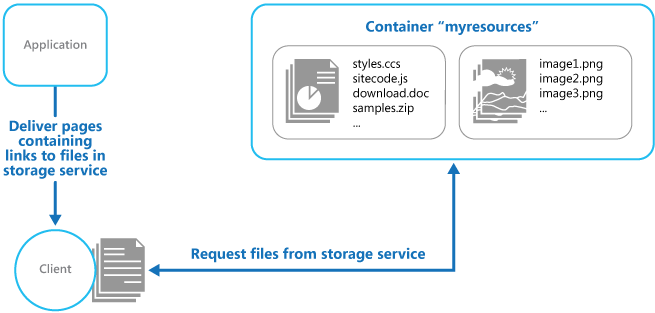

   
# Static Content Hosting

Deploy static content to a cloud-based storage service that can deliver them directly to the client. This can reduce the need for potentially expensive compute instances.

## Context and problem

Web applications typically include some elements of static content. This static content might include HTML pages and other resources such as images and documents that are available to the client, either as part of an HTML page (such as inline images, style sheets, and client-side JavaScript files) or as separate downloads (such as PDF documents). 

Although web servers are well tuned to optimize requests through efficient dynamic page code execution and output caching, they still have to handle requests to download static content. This consumes processing cycles that could often be put to better use. 

## Solution

In most cloud hosting environments it's possible to minimize the need for compute instances (for example, use a smaller instance or fewer instances),by locating some of an application’s resources and static pages in a storage service. The cost for cloud-hosted storage is typically much less than for compute instances.

When hosting some parts of an application in a storage service, the main considerations are related to deployment of the application and to securing resources that aren't intended to be available to anonymous users. 

## Issues and considerations

Consider the following points when deciding how to implement this pattern:

- The hosted storage service must expose an HTTP endpoint that users can access to download the static resources. Some storage services also support HTTPS, so it's possible to host resources in storage services that require SSL. 

- For maximum performance and availability, consider using a content delivery network (CDN) to cache the contents of the storage container in multiple datacenters around the world. However, you'll likely have to pay for using the CDN.

- Storage accounts are often georeplicated by default to provide resiliency against events that might affect a datacenter. This means that the IP address might change, but the URL will remain the same. 

- When some content is located in a storage account and other content is in a hosted compute instance it becomes more challenging to deploy an application and to update it. You might have to perform separate deployments, and version the application and content to manage it more easily&mdash;especially when the static content includes script files or UI components. However, if only static resources have to be updated, they can simply be uploaded to the storage account without needing to redeploy the application package.

- Storage services might not support the use of custom domain names. In this case it's necessary to specify the full URL of the resources in links because they'll be in a different domain from the dynamically-generated content containing the links.

- The storage containers must be configured for public read access, but it's vital to ensure that they aren't configured for public write access to prevent users being able to upload content. Consider using a valet key or token to control access to resources that shouldn't be available anonymously&mdash;see the [Valet Key pattern](valet-key.md) for more information.

## When to use this pattern

This pattern is useful for:

- Minimizing the hosting cost for websites and applications that contain some static resources.

- Minimizing the hosting cost for websites that consist of only static content and resources. Depending on the capabilities of the hosting provider’s storage system, it might be possible to entirely host a fully static website in a storage account. 

- Exposing static resources and content for applications running in other hosting environments or on-premises servers. 

- Locating content in more than one geographical area using a content delivery network that caches the contents of the storage account in multiple datacenters around the world. 

- Monitoring costs and bandwidth usage. Using a separate storage account for some or all of the static content allows the costs to be more easily separated from hosting and runtime costs. 

This pattern might not be useful in the following situations:

- The application needs to perform some processing on the static content before delivering it to the client. For example, it might be necessary to add a timestamp to a document. 

- The volume of static content is very small. The overhead of retrieving this content from separate storage can outweigh the cost benefit of separating it out from the compute resource.

## Example

Static content located in Azure Blob storage can be accessed directly by a web browser. Azure provides an HTTP-based interface over storage that can be publicly exposed to clients. For example, content in an Azure Blob storage container is exposed using a URL with the following form:

`http://[ storage-account-name ].blob.core.windows.net/[ container-name ]/[ file-name ]` 


When uploading the content it's necessary to create one or more blob containers to hold the files and documents. Note that the default permission for a new container is Private, and you must change this to Public to allow clients to access the contents. If it's necessary to protect the content from anonymous access, you can implement the [Valet Key pattern](valet-key.md) so users must present a valid token to download the resources.

>  [Blob Service Concepts](https://msdn.microsoft.com/library/azure/dd179376.aspx) has information about blob storage, and the ways that you can access and use it.  

The links in each page will specify the URL of the resource and the client will access it directly from the storage service. The figure illustrates delivering static parts of an application directly from a storage service.




The links in the pages delivered to the client must specify the full URL of the blob container and resource. For example, a page that contains a link to an image in a public container might contain the following HTML.

```html

```
>  If the resources are protected by using a valet key, such as an Azure shared access signature, this signature must be included in the URLs in the links.

A solution named StaticContentHosting that demonstrates using external storage for static resources is available from [GitHub](https://github.com/mspnp/cloud-design-patterns/tree/master/samples/static-content-hosting). The StaticContentHosting.Cloud project contains configuration files that specify the storage account and container that holds the static content.

```xml
<Setting name="StaticContent.StorageConnectionString" 
         value="UseDevelopmentStorage=true" />
<Setting name="StaticContent.Container" value="static-content" />
```

The `Settings` class in the file Settings.cs of the StaticContentHosting.Web project contains methods to extract these values and build a string value containing the cloud storage account container URL. 

```csharp
public class Settings
{
  public static string StaticContentStorageConnectionString {
    get
    {
      return RoleEnvironment.GetConfigurationSettingValue(
                              "StaticContent.StorageConnectionString");
    }
  }

  public static string StaticContentContainer
  {
    get
    {
      return RoleEnvironment.GetConfigurationSettingValue("StaticContent.Container");
    }
  }

  public static string StaticContentBaseUrl
  {
    get
    {
      var account = CloudStorageAccount.Parse(StaticContentStorageConnectionString);

      return string.Format("{0}/{1}", account.BlobEndpoint.ToString().TrimEnd('/'),
                                      StaticContentContainer.TrimStart('/'));
    }
  }
}
```

The `StaticContentUrlHtmlHelper` class in the file StaticContentUrlHtmlHelper.cs exposes a method named `StaticContentUrl` that generates a URL containing the path to the cloud storage account if the URL passed to it starts with the ASP.NET root path character (~). 

```csharp
public static class StaticContentUrlHtmlHelper
{
  public static string StaticContentUrl(this HtmlHelper helper, string contentPath)
  {
    if (contentPath.StartsWith("~"))
    {
      contentPath = contentPath.Substring(1);
    }

    contentPath = string.Format("{0}/{1}", Settings.StaticContentBaseUrl.TrimEnd('/'),
                                contentPath.TrimStart('/'));

    var url = new UrlHelper(helper.ViewContext.RequestContext);

    return url.Content(contentPath);
  }
}
```

The file Index.cshtml in the Views\Home folder contains an image element that uses the `StaticContentUrl` method to create the URL for its `src` attribute.

```html

```

## Related patterns and guidance

- A sample that demonstrates this pattern is available on [GitHub](https://github.com/mspnp/cloud-design-patterns/tree/master/samples/static-content-hosting).
- [Valet Key pattern](valet-key.md). If the target resources aren't supposed to be available to anonymous users it's necessary to implement security over the store that holds the static content. Describes how to use a token or key that provides clients with restricted direct access to a specific resource or service such as a cloud-hosted storage service.
- [An efficient way of deploying a static web site on Azure](http://www.infosysblogs.com/microsoft/2010/06/an_efficient_way_of_deploying.html) on the Infosys blog.
- [Blob Service Concepts](https://msdn.microsoft.com/library/azure/dd179376.aspx)
