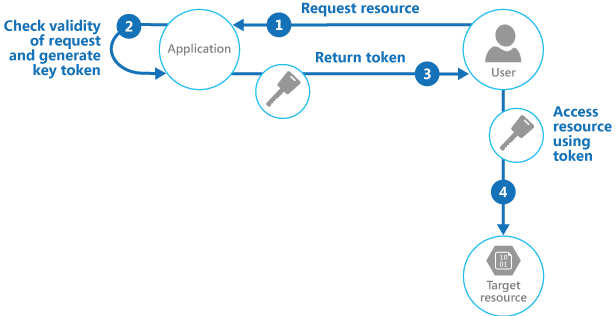

   
# Valet Key

Use a token that provides clients with restricted direct access to a specific resource, in order to offload data transfer from the application. This is particularly useful in applications that use cloud-hosted storage systems or queues, and can minimize cost and maximize scalability and performance.

## Context and problem

Client programs and web browsers often need to read and write files or data streams to and from an application’s storage. Typically, the application will handle the movement of the data&emdash;either by fetching it from storage and streaming it to the client, or by reading the uploaded stream from the client and storing it in the data store. However, this approach absorbs valuable resources such as compute, memory, and bandwidth. 

Data stores have the ability to handle upload and download of data directly, without requiring that the application perform any processing to move this data. But, this typically requires the client to have access to the security credentials for the store. This can be a useful technique to minimize data transfer costs and the requirement to scale out the application, and to maximize performance. It means, though, that the application is no longer able to manage the security of the data. After the client has a connection to the data store for direct access, the application can't act as the gatekeeper. It's no longer in control of the process and can't prevent subsequent uploads or downloads from the data store.

This isn't a realistic approach in distributed systems that need to serve untrusted clients. Instead, applications must be able to securely control access to data in a granular way, but still reduce the load on the server by setting up this connection and then allowing the client to communicate directly with the data store to perform the required read or write operations.

## Solution

You need to resolve the problem of controlling access to a data store where the store can't manage authentication and authorization of clients. One typical solution is to restrict access to the data store’s public connection and provide the client with a key or token that the data store can validate.

This key or token is usually referred to as a valet key. It provides time-limited access to specific resources and allows only predefined operations such as reading and writing to storage or queues, or uploading and downloading in a web browser. Applications can create and issue valet keys to client devices and web browsers quickly and easily, allowing clients to perform the required operations without requiring the application to directly handle the data transfer. This removes the processing overhead, and the impact on performance and scalability, from the application and the server.

The client uses this token to access a specific resource in the data store for only a specific period, and with specific restrictions on access permissions, as shown in the figure. After the specified period, the key becomes invalid and won't allow access to the resource.

  

It's also possible to configure a key that has other dependencies, such as the scope of the data. For example, depending on the data store capabilities, the key can specify a complete table in a data store, or only specific rows in a table. In cloud storage systems the key can specify a container, or just a specific item within a container. 

The key can also be invalidated by the application. This is a useful approach if the client notifies the server that the data transfer operation is complete. The server can then invalidate that key to prevent further.

Using this pattern can simplify managing access to resources because there's no requirement to create and authenticate a user, grant permissions, and then remove the user again. It also makes it easy to limit the location, the permission, and the validity period&mdash;all by simply generating a key at runtime. The important factors are to limit the validity period, and especially the location of the resource, as tightly as possible so that the recipient can only use it for the intended purpose. 

## Issues and considerations

Consider the following points when deciding how to implement this pattern:

**Manage the validity status and period of the key**. If leaked or compromised, the key effectively unlocks the target item and makes it available for malicious use during the validity period. A key can usually be revoked or disabled, depending on how it was issued. Server-side policies can be changed or, the server key it was signed with can be invalidated. Specify a short validity period to minimize the risk of allowing unauthorized operations to take place against the data store. However, if the validity period is too short, the client might not be able to complete the operation before the key expires. Allow authorized users to renew the key before the validity period expires if multiple accesses to the protected resource are required.

**Control the level of access the key will provide**. Typically, the key should allow the user to only perform the actions necessary to complete the operation, such as read-only access if the client shouldn't be able to upload data to the data store. For file uploads, it's common to specify a key that provides write-only permission, as well as the location and the validity period. It's critical to accurately specify the resource or the set of resources to which the key applies. 

**Consider how to control users’ behavior**. Implementing this pattern means some loss of control over the resources users are granted access to. The level of control that can be exerted is limited by the capabilities of the policies and permissions available for the service or the target data store. For example, it's usually not possible to create a key that limits the size of the data to be written to storage, or the number of times the key can be used to access a file. This can result in huge unexpected costs for data transfer, even when used by the intended client, and might be caused by an error in the code that causes repeated upload or download. To limit the number of times a file can be uploaded, where possible, force the client to notify the application when one operation has completed. For example, some data stores raise events the application code can use to monitor operations and control user behavior. However, it's hard to enforce quotas for individual users in a multi-tenant scenario where the same key is used by all the users from one tenant.

**Validate, and optionally sanitize, all uploaded data**. A malicious user that gains access to the key could upload data designed to compromise the system. Alternatively, authorized users might upload data that's invalid and, when processed, could result in an error or system failure. To protect against this, ensure that all uploaded data is validated and checked for malicious content before use. 

**Audit all operations**. Many key-based mechanisms can log operations such as uploads, downloads, and failures. These logs can usually be incorporated into an audit process, and also used for billing if the user is charged based on file size or data volume. Use the logs to detect authentication failures that might be caused by issues with the key provider, or accidental removal of a stored access policy.

**Deliver the key securely**. It can be embedded in a URL that the user activates in a web page, or it can be used in a server redirection operation so that the download occurs automatically. Always use HTTPS to deliver the key over a secure channel.

**Protect sensitive data in transit**. Sensitive data delivered through the application will usually take place using SSL or TLS, and this should be enforced for clients accessing the data store directly.

Other issues to be aware of when implementing this pattern are:

- If the client doesn't, or can't, notify the server of completion of the operation, and the only limit is the expiration period of the key, the application won't be able to perform auditing operations such as counting the number of uploads or downloads, or preventing multiple uploads or downloads. 

- The flexibility of key policies that can be generated might be limited. For example, some mechanisms only allow the use of a timed expiration period. Others aren't able to specify a sufficient granularity of read/write permissions. 

- If the start time for the key or token validity period is specified, ensure that it's a little earlier than the current server time to allow for client clocks that might be slightly out of synchronization. The default, if not specified, is usually the current server time.

- The URL containing the key will be recorded in server log files. While the key will typically have expired before the log files are used for analysis, ensure that you limit access to them. If log data is transmitted to a monitoring system or stored in another location, consider implementing a delay to prevent leakage of keys until after their validity period has expired. 

- If the client code runs in a web browser, the browser might need to support cross-origin resource sharing (CORS) to enable code that executes within the web browser to access data in a different domain from the one that served the page. Some older browsers and some data stores don't support CORS, and code that runs in these browsers might be able to use a valet key to provide access to data in a different domain, such as a cloud storage account.

## When to use this pattern

This pattern is useful for the following situations:

- To minimize resource loading and maximize performance and scalability. Using a valet key doesn't require the resource to be locked, no remote server call is required, there's no limit on the number of valet keys that can be issued, and it avoids a single point of failure resulting from performing the data transfer through the application code. Creating a valet key is typically a simple cryptographic operation of signing a string with a key.

- To minimize operational cost. Enabling direct access to stores and queues is resource and cost efficient, can result in fewer network round trips, and might allow for a reduction in the number of compute resources required.

- When clients regularly upload or download data, particularly where there's a large volume or when each operation involves large files.

- When the application has limited compute resources available, either due to hosting limitations or cost considerations. In this scenario, the pattern is even more helpful if there are many concurrent data uploads or downloads because it relieves the application from handling the data transfer.

- When the data is stored in a remote data store or a different datacenter. If the application was required to act as a gatekeeper, there might be a charge for the additional bandwidth of transferring the data between datacenters, or across public or private networks between the client and the application, and then between the application and the data store. 

This pattern might not be useful in the following situations:

- If the application must perform some task on the data before it's stored or before it's sent to the client. For example, if the application needs to perform validation, log access success, or execute a transformation on the data. However, some data stores and clients are able to negotiate and carry out simple transformations such as compression and decompression (for example, a web browser can usually handle GZip formats). 

- If the design of an existing application makes it difficult to incorporate the pattern. Using this pattern typically requires a different architectural approach for delivering and receiving data. 

- If it's necessary to maintain audit trails or control the number of times a data transfer operation is executed, and the valet key mechanism in use doesn't support notifications that the server can use to manage these operations. 

- If it's necessary to limit the size of the data, especially during upload operations. The only solution to this is for the application to check the data size after the operation is complete, or check the size of uploads after a specified period or on a scheduled basis.

## Example

Azure supports shared access signatures on Azure Storage for granular access control to data in blobs, tables, and queues, and for Service Bus queues and topics. A shared access signature token can be configured to provide specific access rights such as read, write, update, and delete to a specific table; a key range within a table; a queue; a blob; or a blob container. The validity can be a specified time period or with no time limit.

Azure shared access signatures also support server-stored access policies that can be associated with a specific resource such as a table or blob. This feature provides additional control and flexibility compared to application-generated shared access signature tokens, and should be used whenever possible. Settings defined in a server-stored policy can be changed and are reflected in the token without requiring a new token to be issued, but settings defined in the token can't be changed without issuing a new token. This approach also makes it possible to revoke a valid shared access signature token before it's expired.

>  For more information see [Introducing Table SAS (Shared Access Signature), Queue SAS and update to Blob SAS](https://blogs.msdn.microsoft.com/windowsazurestorage/2012/06/12/introducing-table-sas-shared-access-signature-queue-sas-and-update-to-blob-sas/) and [Using Shared Access Signatures](https://azure.microsoft.com/documentation/articles/storage-dotnet-shared-access-signature-part-1/) on MSDN. 

The following code shows how to create a shared access signature token that's valid for five minutes. The `GetSharedAccessReferenceForUpload` method returns a shared access signatures token that can be used to upload a file to Azure Blob Storage. 

```csharp
public class ValuesController : ApiController
{
  private readonly CloudStorageAccount account;
  private readonly string blobContainer;
  ...
  /// <summary>
  /// Return a limited access key that allows the caller to upload a file 
  /// to this specific destination for a defined period of time.
  /// </summary>
  private StorageEntitySas GetSharedAccessReferenceForUpload(string blobName)
  {
    var blobClient = this.account.CreateCloudBlobClient();
    var container = blobClient.GetContainerReference(this.blobContainer);

    var blob = container.GetBlockBlobReference(blobName);

    var policy = new SharedAccessBlobPolicy
    {
      Permissions = SharedAccessBlobPermissions.Write,

      // Specify a start time five minutes earlier to allow for client clock skew.
      SharedAccessStartTime = DateTime.UtcNow.AddMinutes(-5),

      // Specify a validity period of five minutes starting from now. 
      SharedAccessExpiryTime = DateTime.UtcNow.AddMinutes(5)
    };

    // Create the signature. 
    var sas = blob.GetSharedAccessSignature(policy);

    return new StorageEntitySas
    {
      BlobUri = blob.Uri,
      Credentials = sas,
      Name = blobName
    };
  }

  public struct StorageEntitySas
  {
    public string Credentials;
    public Uri BlobUri;
    public string Name;
  }
}
```

>  The complete sample is available in the ValetKey solution available for download from [GitHub](https://github.com/mspnp/cloud-design-patterns/tree/master/samples/valet-key). The ValetKey.Web project in this solution contains a web application that includes the `ValuesController` class shown above. A sample client application that uses this web application to retrieve a shared access signatures key and upload a file to blob storage is available in the ValetKey.Client project. 

## Next steps

The following patterns and guidance might also be relevant when implementing this pattern:
- A sample that demonstrates this pattern is available on [GitHub](https://github.com/mspnp/cloud-design-patterns/tree/master/samples/valet-key).
- [Gatekeeper pattern](gatekeeper.md). This pattern can be used in conjunction with the Valet Key pattern to protect applications and services by using a dedicated host instance that acts as a broker between clients and the application or service. The gatekeeper validates and sanitizes requests, and passes requests and data between the client and the application. Can provide an additional layer of security, and reduce the attack surface of the system.
- [Static Content Hosting pattern](static-content-hosting.md). Describes how to deploy static resources to a cloud-based storage service that can deliver these resources directly to the client to reduce the requirement for expensive compute instances. Where the resources aren't intended to be publicly available, the Valet Key pattern can be used to secure them.
- [Introducing Table SAS (Shared Access Signature), Queue SAS and update to Blob SAS](https://blogs.msdn.microsoft.com/windowsazurestorage/2012/06/12/introducing-table-sas-shared-access-signature-queue-sas-and-update-to-blob-sas/)
- [Using Shared Access Signatures](https://azure.microsoft.com/documentation/articles/storage-dotnet-shared-access-signature-part-1/)
- [Shared Access Signature Authentication with Service Bus](https://azure.microsoft.com/documentation/articles/service-bus-shared-access-signature-authentication/)
