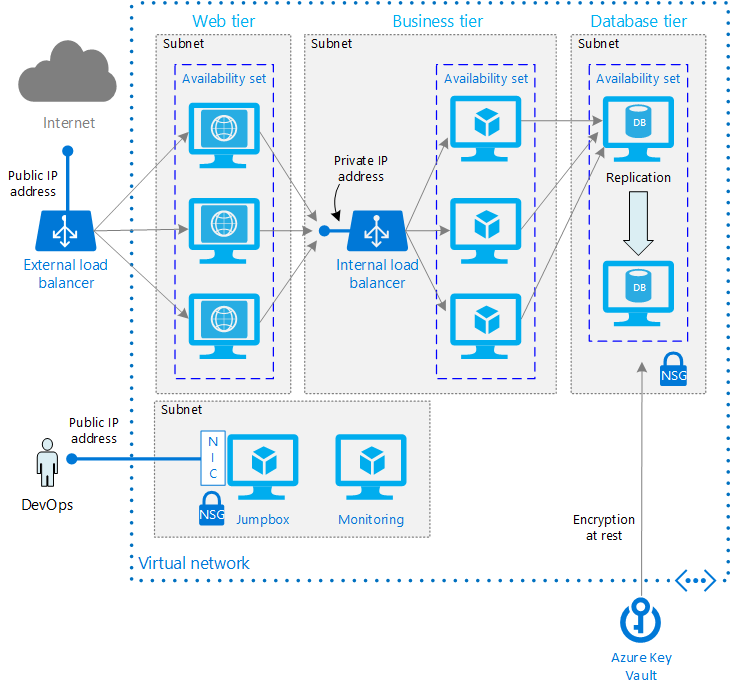

<properties
   pageTitle="Running Windows VMs for an N-tier architecture | Reference Architecture | Microsoft Azure"
   description="How to implement a multi-tier architecture on Azure, paying particular attention to availability, security, scalability, and manageability security."
   services=""
   documentationCenter="na"
   authors="mikewasson"
   manager="roshar"
   editor=""
   tags=""/>

<tags
   ms.service="guidance"
   ms.devlang="na"
   ms.topic="article"
   ms.tgt_pltfrm="na"
   ms.workload="na"
   ms.date="05/16/2016"
   ms.author="mikewasson"/>

# Running Windows VMs for an N-tier architecture on Azure

[AZURE.INCLUDE [pnp-header](../../includes/guidance-pnp-header-include.md)]

This article outlines a set of proven practices for running Windows VMs for an application with a N-tier architecture.

There are variations of N-tier architectures. For the most part, the differences shouldn't matter for the purposes of these recommendations. This article assumes a typical 3-tier web app:

- **Web tier.** Handles incoming HTTP requests. Responses are returned through this tier.

- **Business tier.** Implements business processes and other functional logic for the system.

-  **Data tier.** Provides persistent data storage.

> [AZURE.NOTE] Azure has two different deployment models: [Resource Manager][resource-manager-overview] and classic. This article uses Resource Manager, which Microsoft recommends for new deployments.

## Architecture diagram

The following diagram builds on the topology shown in [Running multiple Windows VMs on Azure][multi-vm].



- **Availability Sets.** Create an [Availability Set][azure-availability-sets] for each tier, and provision at least two VMs in each tier. This approach is required to reach the availability [SLA][vm-sla] for VMs.

- **Subnets.** Create a separate subnet for each tier. Specify the address range and subnet mask using [CIDR] notation. 

- **Load balancers.** Use an [Internet-facing load balancer][load-balancer-external] to distribute incoming Internet traffic to the web tier, and an [internal load balancer][load-balancer-internal] to distribute network traffic from the web tier to the business tier.

- **Jumpbox**. A _jumpbox_, also called a [bastion host], is a VM on the network that administrators use to connect to the other VMs. The jumpbox has an NSG that allows remote desktop (RDP) only from whitelisted public IP addresses.

- **Monitoring**. Monitoring software sush as [Nagios], [Zabbix], or [Icinga] can give you insight into response time, VM uptime, and the overall health of your system. Install the monitoring software on a VM that's placed in a separate management subnet.

- **NSGs**. Use [network security groups][nsg] (NSGs) to restrict network traffic within the VNet. For example, in the 3-tier architecture shown here, the data tier does not accept traffic from the web front end, only from the business tier and the management subnet.

- **Key Vault**. Use [Azure Key Vault][azure-key-vault] to manage encryption keys, for encrypting data at rest.

## Network recommendations

### VNet / Subnets

- When you create the VNet, allocate enough address space for the subnets you will need. Specify the address range and subnet mask using [CIDR] notation. Use an address space that falls within the standard [private IP address blocks][private-ip-space], which are 10.0.0.0/8, 172.16.0.0/12, and 192.168.0.0/16.

- Don't pick an address range that overlaps with your on-premise network, in case you need to set up a gateway between the VNet and your on-premise network later. Once you create the VNet, you can't change the address range.

- Design subnets with functionality and security requirements in mind. All VMs within the same tier or role should go into the same subnet, which can be a security boundary. Specify the address space for the subnet in CIDR notation. For example, '10.0.0.0/24' creates a range of 256 IP addresses. (VMs can use 251 of these; five are reserved. For more information, see the [Virtual Network FAQ][vnet faq].) Make sure the address ranges don't overlap across subnets.

### Load balancers

- The external load balancer distributes Internet traffic to the web tier. Create a public IP address for this load balancer. Example:

    ```text
    azure network public-ip create --name pip1 --location westus --resource-group rg1
    azure network lb create --name lb1 --location --location westus --resource-group rg1
    azure network lb frontend-ip create --name lb1-frontend --lb-name lb1 --public-ip-name pip1 --resource-group rg1
    ```

    For more information, see [Get started creating an Internet facing load balancer using Azure CLI][load-balancer-external-cli]

- The internal load balancer distributes network traffic from the web tier to the business tier. To give this load balancer a private IP address, create a frontend IP configuration and associate it with the subnet for the business tier. Example:

    ```text
    azure network lb create --name lb2 --location --location westus --resource-group rg1
    azure network lb frontend-ip create --name lb2-frontend --lb-name lb2 --subnet-name subnet1
        --subnet-vnet-name vnet1 --resource-group rg1
    ```

    For more information, see [Get started creating an internal load balancer using the Azure CLI][load-balancer-internal-cli].

### Jumpbox

- Use a small VM size for the jumpbox, such as Standard A1. T

- The jumpbox belongs to the same VNet as the other VMs, and connects to them through their private IP addresses.

- Place the jumpbox in a separate management subnet, and create a [public IP address] for the jumpbox.

- To secure the jumpbox, create an NSG and apply it to jumpbox subnet. Add an NSG rule that allows remote desktop (RDP) only from a whitelisted set of public IP addresses.

    The NSG can be attached either to the subnet or to the jumpbox NIC. In this case, we recommend attaching it to the NIC, so RDP traffic is permitted only to the jumpbox, even if you add other VMs to the same subnet.

## Availability

- Put each tier or VM role into a separate availability set. Don't put VMs from different tiers into the same availability set. 

- At the data tier, having multiple VMs does not automatically translate into a highly available database. For a relational database, you will typically need to use replication and failover to achieve high availability. The business tier will connect to a primary database, and if that VM goes down, the application fails over to a secondary database, either manually or automatically.

> [AZURE.NOTE] For SQL Server, we recommend using [AlwaysOn Availability Groups][sql-alwayson]. For more information, see  

## Security

- Encrypt data at rest. Use [Azure Key Vault][azure-key-vault] to manage the database encryption keys. Key Vault can store encryption keys in hardware security modules (HSMs). For more information, see [Configure Azure Key Vault Integration for SQL Server on Azure VMs][sql-keyvault] It's also recommended to store application secrets, such as database connection strings, in Key Vault.

- Do not allow RDP access from the public Internet to the VMs that run the application workload. Instead, all RDP access to these VMs must come through the jumpbox. An administrator logs into the jumpbox, and then logs into the other VM from the jumpbox. The jumpbox allows RDP traffic from the Internet, but only from known, whitelisted IP addresses.

- Use NSG rules to restrict traffic between tiers. For example, in the 3-tier architecture shown above, the web tier does not communicate directly with the data tier. To enforce this, the data tier should block incoming traffic from the web tier subnet.  

  1. Create an NSG and associate it to the data tier subnet. 

  1. Add a rule that denies all inbound traffic from the VNet. (Use the `VIRTUAL_NETWORK` tag in the rule.) 

  2. Add a rule with a higher priority that allows inbound traffic from the business tier subnet. This rule overrides the previous rule, and allows the business tier to talk to the data tier.

  3. Add a rule that allows inbound traffic from within the data tier subnet itself. This rule allows communication between VMs in the data tier, which is needed for database replication and failover.

  4. Add a rule that allows RDP traffic from the jumpbox subnet. This rule lets administrators connect to the data tier from the jumpbox.

  > [AZURE.NOTE] An NSG has [default rules][nsg-rules] that allow any inbound traffic from within the VNet. These rules can't be deleted, but you can override them by creating higher-priority rules.


## Scalability

The load balancers distribute network traffic to the web and business tiers. Scale horizontally by adding new VM instances. Note that you can scale the web and business tiers independently, based on load. To reduce possible complications caused by the need to maintain client affinity, the VMs in the web tier should be stateless. The VMs hosting the business logic should also be stateless.

## Manageability

Simplify management of the entire system by using centralized administration tools such as [Azure Automation][azure-administration], [Microsoft Operations Management Suite][operations-management-suite], [Chef][chef], or [Puppet][puppet]. These tools can consolidate diagnostic and health information captured from multiple VMs to provide an overall view of the system.

## Example deployment script

The following Windows batch script deploys the architecure shown in the previous diagram. The script requires version 0.9.20 or later of the [Azure Command-Line Interface (CLI)][azure-cli].

The script uses the naming conventions described in [Recommended Naming Conventions for Azure Resources][naming conventions].

One of the script parameters is the IP address range to whitelist for the jumpbox. You can specify a range using CIDR notation, or a single IP address.

```bat
@ECHO OFF
SETLOCAL

:::::::::::::::::::::::::::::::::::::::::::::::::::::::::::::::::::::::::::::::

IF "%4"=="" (
    ECHO Usage: %0 subscription-id admin-address-whitelist-CIDR-format admin-password appname
    ECHO   For example: %0 xxxxxxxx-xxxx-xxxx-xxxx-xxxxxxxxxxxx nnn.nnn.nnn.nnn/mm pwd app1
    EXIT /B
    )

:: Explicitly set the subscription to avoid confusion as to which subscription
:: is active/default

SET SUBSCRIPTION=%1
SET ADMIN_ADDRESS_PREFIX=%2
SET PASSWORD=%3
SET APP_NAME=%4

:::::::::::::::::::::::::::::::::::::::::::::::::::::::::::::::::::::::::::::::
:: Set up variables for deploying resources to Azure.
:: Change these variables for your own deployment

:: The APP_NAME variable must not exceed 4 characters in size.
:: If it does the 15 character size limitation of the VM name may be exceeded.

SET LOCATION=centralus
SET ENVIRONMENT=dev
SET USERNAME=testuser

SET NUM_VM_INSTANCES_WEB_TIER=3
SET NUM_VM_INSTANCES_BIZ_TIER=3
SET NUM_VM_INSTANCES_DB_TIER=2
SET NUM_VM_INSTANCES_MANAGE_TIER=1

SET VNET_IP_RANGE=10.0.0.0/16
SET WEB_SUBNET_IP_RANGE=10.0.0.0/24
SET BIZ_SUBNET_IP_RANGE=10.0.1.0/24
SET DB_SUBNET_IP_RANGE=10.0.2.0/24
SET MANAGE_SUBNET_IP_RANGE=10.0.3.0/24

:: Set IP address of Internal Load Balancer in the high end of subnet's IP range
:: to keep separate from IP addresses assigned to VM's that start at the low end.
SET BIZ_ILB_IP=10.0.1.250

SET REMOTE_ACCESS_PORT=3389

:: For Windows, use the following command to get the list of URNs:
:: azure vm image list %LOCATION% MicrosoftWindowsServer WindowsServer 2012-R2-Datacenter
SET WINDOWS_BASE_IMAGE=MicrosoftWindowsServer:WindowsServer:2012-R2-Datacenter:4.0.20160126

:: For a list of VM sizes see: https://azure.microsoft.com/en-us/documentation/articles/virtual-machines-size-specs/
:: To see the VM sizes available in a region:
:: 	azure vm sizes --location <<location>>
SET VM_SIZE=Standard_DS1

:: Set up the names of things using recommended conventions
SET RESOURCE_GROUP=%APP_NAME%-%ENVIRONMENT%-rg
SET VNET_NAME=%APP_NAME%-vnet
SET PUBLIC_IP_NAME=%APP_NAME%-pip
SET DIAGNOSTICS_STORAGE=%APP_NAME:-=%diag
SET JUMPBOX_PUBLIC_IP_NAME=%APP_NAME%-jumpbox-pip
SET JUMPBOX_NIC_NAME=%APP_NAME%-manage-vm1-nic1

:: Set up the postfix variables attached to most CLI commands
SET POSTFIX=--resource-group %RESOURCE_GROUP% --subscription %SUBSCRIPTION%

CALL azure config mode arm

::::::::::::::::::::::::::::::::::::::::::::::::::::::::::::::::::::::::::
:: Create root level resources

:: Create the enclosing resource group
CALL :CallCLI azure group create --name %RESOURCE_GROUP% --location %LOCATION% ^
  --subscription %SUBSCRIPTION%

:: Create the virtual network
CALL :CallCLI azure network vnet create --address-prefixes %VNET_IP_RANGE% ^
  --name %VNET_NAME% --location %LOCATION% %POSTFIX%

:: Create the storage account for diagnostics logs
CALL :CallCLI azure storage account create --type LRS --location %LOCATION% %POSTFIX% ^
  %DIAGNOSTICS_STORAGE%

:: Create the public IP address (dynamic)
CALL :CallCLI azure network public-ip create --name %PUBLIC_IP_NAME% ^
  --location %LOCATION% %POSTFIX%

:: Create the jumpbox public IP address (dynamic)
CALL :CallCLI azure network public-ip create --name %JUMPBOX_PUBLIC_IP_NAME% ^
  --location %LOCATION% %POSTFIX%


::::::::::::::::::::::::::::::::::::::::::::::::::::::::::::::::::::::::::
:: Create the web tier
:: Web tier has a public IP, load balancer, availability set, and three VMs

SET LB_NAME=%APP_NAME%-web-lb
SET SUBNET_NAME=%APP_NAME%-web-subnet
SET AVAILSET_NAME=%APP_NAME%-web-as
SET USING_AVAILSET=true

:: Create web tier (public) load balancer
CALL :CallCLI azure network lb create --name %LB_NAME% --location %LOCATION% %POSTFIX%

:: Create the subnet
CALL :CallCLI azure network vnet subnet create --vnet-name %VNET_NAME% ^
  --address-prefix %WEB_SUBNET_IP_RANGE% --name %SUBNET_NAME% %POSTFIX%

:: Create the availability sets
CALL :CallCLI azure availset create --name %AVAILSET_NAME% --location %LOCATION% %POSTFIX%

:: Create the load balancer frontend-ip using the public IP address
CALL :CallCLI azure network lb frontend-ip create --name %LB_NAME%-frontend% ^
  --lb-name %LB_NAME% --public-ip-name %PUBLIC_IP_NAME% %POSTFIX%

CALL :CreateCommonLBResources %LB_NAME%

:: Create VMs and per-VM resources
FOR /L %%I IN (1,1,%NUM_VM_INSTANCES_WEB_TIER%) DO CALL :CreateVM %%I web %SUBNET_NAME% %USING_AVAILSET% %LB_NAME%


::::::::::::::::::::::::::::::::::::::::::::::::::::::::::::::::::::::::::
:: Create the business tier
:: Business tier has an internal load balancer, availability set, and three VMs

SET LB_NAME=%APP_NAME%-biz-lb
SET SUBNET_NAME=%APP_NAME%-biz-subnet
SET AVAILSET_NAME=%APP_NAME%-biz-as
SET USING_AVAILSET=true

:: Create the business tier internal load balancer
CALL :CallCLI azure network lb create --name %LB_NAME% --location %LOCATION% %POSTFIX%

:: Create the subnet
CALL :CallCLI azure network vnet subnet create --vnet-name %VNET_NAME% ^
  --address-prefix %BIZ_SUBNET_IP_RANGE% --name %SUBNET_NAME% %POSTFIX%

:: Create the availability sets
CALL :CallCLI azure availset create --name %AVAILSET_NAME% --location %LOCATION% %POSTFIX%

:: Create the load balancer frontend-ip using a private IP address and subnet
CALL :CallCLI azure network lb frontend-ip create --name %LB_NAME%-frontend ^
  --lb-name %LB_NAME% --private-ip-address %BIZ_ILB_IP% --subnet-name %SUBNET_NAME% ^
  --subnet-vnet-name %VNET_NAME% %POSTFIX%

CALL :CreateCommonLBResources %LB_NAME%

:: Create VMs and per-VM resources
FOR /L %%I IN (1,1,%NUM_VM_INSTANCES_BIZ_TIER%) DO CALL :CreateVM %%I biz %SUBNET_NAME% %USING_AVAILSET% %LB_NAME%


::::::::::::::::::::::::::::::::::::::::::::::::::::::::::::::::::::::::::
:: Create the database tier
:: Database tier has no load balancer, an availability set, and two VMs.

SET SUBNET_NAME=%APP_NAME%-db-subnet
SET AVAILSET_NAME=%APP_NAME%-db-as
SET USING_AVAILSET=true

:: Create the subnet
CALL :CallCLI azure network vnet subnet create --vnet-name %VNET_NAME% ^
  --address-prefix %DB_SUBNET_IP_RANGE% --name %SUBNET_NAME% %POSTFIX%

:: Create the availability sets
CALL :CallCLI azure availset create --name %AVAILSET_NAME% --location %LOCATION% %POSTFIX%

:: Create VMs and per-VM resources
FOR /L %%I IN (1,1,%NUM_VM_INSTANCES_DB_TIER%) DO CALL :CreateVM %%I db %SUBNET_NAME% %USING_AVAILSET%


::::::::::::::::::::::::::::::::::::::::::::::::::::::::::::::::::::::::::
:: Create the management subnet
:: Management subnet has no load balancer, no availability set, and one VM (jumpbox)

SET SUBNET_NAME=%APP_NAME%-manage-subnet
SET USING_AVAILSET=false

:: Create the subnet
CALL :CallCLI azure network vnet subnet create --vnet-name %VNET_NAME% ^
  --address-prefix %MANAGE_SUBNET_IP_RANGE% --name %SUBNET_NAME% %POSTFIX%

:: Create VMs and per-VM resources
FOR /L %%I IN (1,1,%NUM_VM_INSTANCES_MANAGE_TIER%) DO CALL :CreateVM %%I manage %SUBNET_NAME% %USING_AVAILSET%


::::::::::::::::::::::::::::::::::::::::::::::::::::::::::::::::::::::::::
:: Network Security Group Rules

:: The Jump box NSG rule allows inbound remote access traffic from admin-address-prefix script parameter.
:: To view the provisioned NSG rules, go to the portal (portal.azure.com) and view the
:: Inbound and Outbound rules for the NSG.
:: NSGs have default rules that are also visible through the portal.

SET MANAGE_NSG_NAME=%APP_NAME%-manage-nsg

CALL :CallCLI azure network nsg create --name %MANAGE_NSG_NAME% ^
  --location %LOCATION% %POSTFIX%

CALL :CallCLI azure network nsg rule create --nsg-name %MANAGE_NSG_NAME% ^
  --name admin-rdp-allow ^
	--access Allow --protocol Tcp --direction Inbound --priority 100 ^
	--source-address-prefix %ADMIN_ADDRESS_PREFIX% --source-port-range * ^
	--destination-address-prefix * --destination-port-range %REMOTE_ACCESS_PORT% %POSTFIX%

:: Associate the NSG rule with the jumpbox NIC
CALL :CallCLI azure network nic set --name %JUMPBOX_NIC_NAME% ^
	--network-security-group-name %MANAGE_NSG_NAME% %POSTFIX%

:: Make Jump Box publically accessible
CALL :CallCLI azure network nic set --name %JUMPBOX_NIC_NAME% ^
  --public-ip-name %JUMPBOX_PUBLIC_IP_NAME% %POSTFIX%


:: DB Tier NSG rule

SET DB_TIER_NSG_NAME=%APP_NAME%-db-nsg

CALL :CallCLI azure network nsg create --name %DB_TIER_NSG_NAME% ^
  --location %LOCATION% %POSTFIX%

:: Allow inbound traffic from business tier subnet to the DB tier
CALL :CallCLI azure network nsg rule create --nsg-name %DB_TIER_NSG_NAME% ^
  --name biz-allow ^
	--access Allow --protocol * --direction Inbound --priority 100 ^
	--source-address-prefix %BIZ_SUBNET_IP_RANGE% --source-port-range * ^
	--destination-address-prefix * --destination-port-range * %POSTFIX%

:: Allow inbound remote access traffic from management subnet
CALL :CallCLI azure network nsg rule create --nsg-name %DB_TIER_NSG_NAME% ^
  --name manage-rdp-allow ^
	--access Allow --protocol Tcp --direction Inbound --priority 200 ^
	--source-address-prefix %MANAGE_SUBNET_IP_RANGE% --source-port-range * ^
	--destination-address-prefix * --destination-port-range %REMOTE_ACCESS_PORT% %POSTFIX%

:: Deny all other inbound traffic from within vnet
CALL :CallCLI azure network nsg rule create --nsg-name %DB_TIER_NSG_NAME% ^
  --name vnet-deny ^
	--access Deny --protocol * --direction Inbound --priority 1000 ^
	--source-address-prefix VirtualNetwork --source-port-range * ^
	--destination-address-prefix * --destination-port-range * %POSTFIX%

:: Associate the NSG rule with the subnet
CALL :CallCLI azure network vnet subnet set --vnet-name %VNET_NAME% ^
  --name %APP_NAME%-db-subnet ^
	--network-security-group-name %DB_TIER_NSG_NAME% %POSTFIX%

::::::::::::::::::::::::::::::::::::::::::::::::::::::::::::::::::::::::::
CALL :CreateUDR
::::::::::::::::::::::::::::::::::::::::::::::::::::::::::::::::::::::::::

GOTO :eof

::::::::::::::::::::::::::::::::::::::::::::::::::::::::::::::::::::::::::
::::::::::::::::::::::::::::::::::::::::::::::::::::::::::::::::::::::::::
:: Subroutine to create load balancer resouces: back-end address pool, health probe, and rule

:CreateCommonLBResources

SET LB_NAME=%1
SET LB_FRONTEND_NAME=%LB_NAME%-frontend
SET LB_BACKEND_NAME=%LB_NAME%-backend-pool
SET LB_PROBE_NAME=%LB_NAME%-probe

ECHO Creating resources for load balancer: %LB_NAME%

:: Create LB back-end address pool
CALL :CallCLI azure network lb address-pool create --name %LB_BACKEND_NAME% ^
  --lb-name %LB_NAME% %POSTFIX%

:: Create a health probe for an HTTP endpoint
CALL :CallCLI azure network lb probe create --name %LB_PROBE_NAME% ^
  --lb-name %LB_NAME% --port 80 --interval 5 --count 2 --protocol http --path / %POSTFIX%

:: Create a load balancer rule for HTTP
CALL :CallCLI azure network lb rule create --name %LB_NAME%-rule-http --protocol tcp ^
  --lb-name %LB_NAME% --frontend-port 80 --backend-port 80 --frontend-ip-name ^
  %LB_FRONTEND_NAME% --probe-name %LB_PROBE_NAME% %POSTFIX%

GOTO :eof


::::::::::::::::::::::::::::::::::::::::::::::::::::::::::::::::::::::::::
:: Subroutine to create the VMs and per-VM resources

:CreateVm

SET TIER_NAME=%2
SET SUBNET_NAME=%3
SET NEEDS_AVAILABILITY_SET=%4
SET LB_NAME=%5

ECHO Creating VM %1 in the %TIER_NAME% tier, in subnet %SUBNET_NAME%.
ECHO NEEDS_AVAILABILITY_SET="%NEEDS_AVAILABILITY_SET%" and LB_NAME="%LB_NAME%"

SET AVAILSET_NAME=%APP_NAME%-%TIER_NAME%-as
SET VM_NAME=%APP_NAME%-%TIER_NAME%-vm%1
SET NIC_NAME=%VM_NAME%-nic1
SET VHD_STORAGE=%VM_NAME:-=%st1
SET /a RDP_PORT=50001 + %1

:: Create NIC for VM1
CALL :CallCLI azure network nic create --name %NIC_NAME% --subnet-name %SUBNET_NAME% ^
  --subnet-vnet-name %VNET_NAME% --location %LOCATION% %POSTFIX%

IF NOT "%LB_NAME%"=="" (
	:: Add NIC to back-end address pool
	SET LB_BACKEND_NAME=%LB_NAME%-backend-pool
	CALL :CallCLI azure network nic address-pool create --name %NIC_NAME% ^
    --lb-name %LB_NAME% --lb-address-pool-name %LB_BACKEND_NAME% %POSTFIX%
)

:: Create the storage account for the OS VHD
CALL :CallCLI azure storage account create --type PLRS --location %LOCATION% ^
 %VHD_STORAGE% %POSTFIX%

:: Create the VM
IF "%NEEDS_AVAILABILITY_SET%"=="true" (
  CALL :CallCLI azure vm create --name %VM_NAME% --os-type Windows --image-urn ^
    %WINDOWS_BASE_IMAGE% --vm-size %VM_SIZE% --vnet-subnet-name %SUBNET_NAME% ^
    --nic-name %NIC_NAME% --vnet-name %VNET_NAME% --storage-account-name ^
    %VHD_STORAGE% --os-disk-vhd "%VM_NAME%-osdisk.vhd" --admin-username ^
    "%USERNAME%" --admin-password "%PASSWORD%" --boot-diagnostics-storage-uri ^
    "https://%DIAGNOSTICS_STORAGE%.blob.core.windows.net/" --availset-name ^
    %AVAILSET_NAME% --location %LOCATION% %POSTFIX%
) ELSE (
  CALL :CallCLI azure vm create --name %VM_NAME% --os-type Windows --image-urn ^
    %WINDOWS_BASE_IMAGE% --vm-size %VM_SIZE% --vnet-subnet-name %SUBNET_NAME% ^
    --nic-name %NIC_NAME% --vnet-name %VNET_NAME% --storage-account-name ^
    %VHD_STORAGE% --os-disk-vhd "%VM_NAME%-osdisk.vhd" --admin-username ^
    "%USERNAME%" --admin-password "%PASSWORD%" --boot-diagnostics-storage-uri ^
    "https://%DIAGNOSTICS_STORAGE%.blob.core.windows.net/" ^
    --location %LOCATION% %POSTFIX%
)

:: Attach a data disk
CALL :CallCLI azure vm disk attach-new --vm-name %VM_NAME% --size-in-gb 128 --vhd-name ^
  %VM_NAME%-data1.vhd --storage-account-name %VHD_STORAGE% %POSTFIX%

goto :eof


:CallCLI
SETLOCAL
CALL %*
IF %ERRORLEVEL% NEQ 0 (
    Echo Error executing CLI Command: %*
    
    REM This command executes in the main script context so we can exit the whole script on an error
    (GOTO) 2> NUL & GOTO :eof
)
GOTO :eof

::::::::::::::::::::::::::::::::::::::::::::::::::::::::::::::::::::::::::
::::::::::::::::::::::::::::::::::::::::::::::::::::::::::::::::::::::::::
:CreateUDR
:::::::::::::::::::::::::::::::::::::::
SET APP_WEB_SUBNET_NAME=%APP_NAME%-web-subnet
SET APP_BIZ_SUBNET_NAME=%APP_NAME%-biz-subnet
SET APP_DB_SUBNET_NAME=%APP_NAME%-db-subnet
SET APP_DMZ_SUBNET_NAME=%APP_NAME%-dmz-subnet
SET APP_DMZ_SUBNET_NIC_NAME=%APP_NAME%-dmz-subnet-nic
SET APP_DMZ_WEB_NIC_NAME=%APP_NAME%-dmz-web-nic
SET APP_DMZ_BIZ_NIC_NAME=%APP_NAME%-dmz-biz-nic
SET APP_DMZ_DB_NIC_NAME=%APP_NAME%-dmz-db-nic
SET DMZ_SUBNET_IP_RANGE=10.0.4.0/24
SET VIRTUAL_APPLIANCE_IP=10.0.4.4
SET DMZ_NSA_PIP_NAME=nsa-pip
SET VIRTUAL_APPLIANCE_VM=%APP_NAME%-dmz-vm
SET APP_DMZ_AVAILSET_NAME=%APP_NAME%-dmz-as
SET VIRTUAL_APPLIANCE_VM_SIZE=Standard_A4
SET APP_WEB_UDR=%APP_NAME%-web-udr
SET APP_BIZ_UDR=%APP_NAME%-biz-udr
SET APP_WEB_TO_BIZ_RT=%APP_NAME%-web-to-biz-rt
SET APP_BIZ_TO_WEB_RT=%APP_NAME%-biz-to-web-rt

:: Create DMZ Subnet
CALL :CallCLI azure network vnet subnet create ^
  --name %APP_DMZ_SUBNET_NAME% ^
  --address-prefix %DMZ_SUBNET_IP_RANGE% ^
  --vnet-name %VNET_NAME% ^
  --resource-group %RESOURCE_GROUP% ^
  --subscription %SUBSCRIPTION%

:: Create NSA PIP
CALL :CallCLI azure network public-ip create ^
  --name %DMZ_NSA_PIP_NAME% ^
  --location %LOCATION% ^
  --resource-group %RESOURCE_GROUP%

:: Create public NIC for dmz and connect to dmz subnet, 
:: and set enable-ip-forwarding to true
CALL :CallCLI azure network nic create ^
  --name %APP_DMZ_SUBNET_NIC_NAME% ^
  --public-ip-name %DMZ_NSA_PIP_NAME% ^
  --subnet-vnet-name %VNET_NAME% ^
  --subnet-name %APP_DMZ_SUBNET_NAME% ^
  --enable-ip-forwarding true ^
  --location %LOCATION% ^
  %POSTFIX%

:: Create NICs for connecting jump box to web tier VMs
CALL :CallCLI azure network nic create ^
  --name %APP_DMZ_WEB_NIC_NAME% ^
  --subnet-vnet-name %VNET_NAME% ^
  --subnet-name %APP_WEB_SUBNET_NAME% ^
  --enable-ip-forwarding true ^
  --location %LOCATION% ^
  --resource-group %RESOURCE_GROUP%
 
:: Create NICs for connecting jump box to biz tier VMs
CALL :CallCLI azure network nic create ^
  --name %APP_DMZ_BIZ_NIC_NAME% ^
  --subnet-vnet-name %VNET_NAME% ^
  --subnet-name %APP_BIZ_SUBNET_NAME% ^
  --enable-ip-forwarding true ^
  --location %LOCATION% ^
  --resource-group %RESOURCE_GROUP%

:: Create NICs for connecting jump box to db tier VMs
CALL :CallCLI azure network nic create ^
  --name %APP_DMZ_DB_NIC_NAME% ^
  --subnet-vnet-name %VNET_NAME% ^
  --subnet-name %APP_DB_SUBNET_NAME% ^
  --enable-ip-forwarding true ^
  --location %LOCATION% ^
  --resource-group %RESOURCE_GROUP%


:: Create the availability sets
CALL :CallCLI azure availset create ^
  --name %APP_DMZ_AVAILSET_NAME% ^
  --location %LOCATION% ^
  %POSTFIX%

:: Use the following command to get the updated list of Ubuntu URNs:
:: azure vm image list %LOCATION% canonical 
::SET UBUNTU_IMAGE=canonical:UbuntuServer:16.04.0-LTS:16.04.201604203
::SET USE_LINUX=FALSE
::IF "%USE_LINUX%" == "TRUE" (
::  CALL :CallCLI azure vm create ^
:: --name %VIRTUAL_APPLIANCE_VM% ^
::  --os-type Linux ^
::  --image-urn %UBUNTU_IMAGE% ^
::  --vm-size %VIRTUAL_APPLIANCE_VM_SIZE% ^
::  --vnet-subnet-name %APP_DMZ_SUBNET_NAME% ^
::  --nic-name %APP_DMZ_SUBNET_NIC_NAME% ^
::  --vnet-name %VNET_NAME% ^
::  --os-disk-vhd "%VIRTUAL_APPLIANCE_VM%-osdisk.vhd" ^
::  --admin-username "%USERNAME%" ^
::  --admin-password "%PASSWORD%" ^
::  --boot-diagnostics-storage-uri "https://%DIAGNOSTICS_STORAGE%.blob.core.windows.net/" ^
::  --availset-name %APP_DMZ_AVAILSET_NAME% ^
::  --location %LOCATION% ^
::  %POSTFIX%

::  --nic-names %APP_DMZ_SUBNET_NIC_NAME%,%APP_DMZ_WEB_NIC_NAME%,%APP_DMZ_BIZ_NIC_NAME%,%APP_DMZ_DB_NIC_NAME% ^
::) ELSE (

  CALL :CallCLI azure vm create ^
  --name %VIRTUAL_APPLIANCE_VM% ^
  --os-type Windows ^
  --image-urn %WINDOWS_BASE_IMAGE% ^
  --vm-size %VIRTUAL_APPLIANCE_VM_SIZE% ^
  --vnet-subnet-name %APP_DMZ_SUBNET_NAME% ^
  --nic-names %APP_DMZ_SUBNET_NIC_NAME%,%APP_DMZ_WEB_NIC_NAME%,%APP_DMZ_BIZ_NIC_NAME%,%APP_DMZ_DB_NIC_NAME% ^
  --vnet-name %VNET_NAME% ^
  --os-disk-vhd "%VIRTUAL_APPLIANCE_VM%-osdisk.vhd" ^
  --admin-username "%USERNAME%" ^
  --admin-password "%PASSWORD%" ^
  --boot-diagnostics-storage-uri "https://%DIAGNOSTICS_STORAGE%.blob.core.windows.net/" ^
  --availset-name %APP_DMZ_AVAILSET_NAME% ^
  --location %LOCATION% ^
  %POSTFIX%
::)
GOTO :eof
 
:: Create UDR in web subnet
CALL :CallCLI azure network route-table create ^
  --name %APP_WEB_UDR% ^
  --location %LOCATION% ^
  %POSTFIX%

CALL :CallCLI azure network route-table route create ^
  --name %APP_WEB_TO_BIZ_RT% ^
  --route-table-name %APP_WEB_UDR% ^
  --address-prefix %BIZ_SUBNET_IP_RANGE% ^
  --next-hop-type VirtualAppliance ^
  --next-hop-ip-address %VIRTUAL_APPLIANCE_IP% ^
  --resource-group %RESOURCE_GROUP%

CALL :CallCLI azure network vnet subnet set ^
  --name %APP_NAME%-web-subnet ^
  --vnet-name %VNET_NAME% ^
  --route-table-name %APP_WEB_UDR% ^
  --resource-group %RESOURCE_GROUP% 

:: Create UDR in biz subnet

CALL :CallCLI azure network route-table create ^
  --name %APP_BIZ_UDR% ^
  --location %LOCATION% ^
  %POSTFIX%

CALL :CallCLI azure network route-table route create ^
  --name %APP_BIZ_TO_WEB_RT% ^
  --route-table-name %APP_BIZ_UDR% ^
  --address-prefix %WEB_SUBNET_IP_RANGE% ^
  --next-hop-type VirtualAppliance ^
  --next-hop-ip-address %VIRTUAL_APPLIANCE_IP% ^
  --resource-group %RESOURCE_GROUP% 

CALL :CallCLI azure network vnet subnet set ^
  --name %APP_NAME%-biz-subnet ^
  --vnet-name %VNET_NAME% ^
  --route-table-name %APP_BIZ_UDR% ^
  --resource-group %RESOURCE_GROUP% 

GOTO :eof

:: End of :CreateUDR
::::::::::::::::::::::::::::::::::::::::::::::::::::::::::::::::::::::::::
::::::::::::::::::::::::::::::::::::::::::::::::::::::::::::::::::::::::::
```

## Next steps

- This article shows a basic N-tier architecture. For some additional considerations about reliability, see [Azure reference architecture: Virtual datacenter][n-tier].

<!-- links -->

[azure-administration]: ../automation/automation-intro.md
[azure-audit-logs]: ../resource-group-audit.md
[azure-availability-sets]: ../virtual-machines/virtual-machines-windows-manage-availability.md#configure-each-application-tier-into-separate-availability-sets
[azure-cli]: ../virtual-machines-command-line-tools.md
[azure-key-vault]: https://azure.microsoft.com/services/key-vault.md
[azure-load-balancer]: ../load-balancer/load-balancer-overview.md
[bastion host]: https://en.wikipedia.org/wiki/Bastion_host
[cidr]: https://en.wikipedia.org/wiki/Classless_Inter-Domain_Routing
[chef]: https://www.chef.io/solutions/azure/
[load-balancer-external]: ../load-balancer/load-balancer-internet-overview.md
[load-balancer-external-cli]: ../load-balancer/load-balancer-get-started-internet-arm-cli.md
[load-balancer-internal]: ../load-balancer/load-balancer-internal-overview.md
[load-balancer-internal-cli]: ../load-balancer/load-balancer-get-started-ilb-arm-cli.md
[multi-vm]: guidance-compute-multi-vm.md
[n-tier]: guidance-compute-n-tier-vm.md
[naming conventions]: guidance-naming-conventions.md
[nsg]: ../virtual-network/virtual-networks-nsg.md
[nsg-rules]: ../best-practices-resource-manager-security.md#network-security-groups
[operations-management-suite]: https://www.microsoft.com/en-us/server-cloud/operations-management-suite/overview.aspx
[private-ip-space]: https://en.wikipedia.org/wiki/Private_network#Private_IPv4_address_spaces
[public IP address]: ../virtual-network/virtual-network-ip-addresses-overview-arm.md
[puppet]: https://puppetlabs.com/blog/managing-azure-virtual-machines-puppet
[resource-manager-overview]: ../resource-group-overview.md
[sql-alwayson]: https://msdn.microsoft.com/en-us/library/hh510230.aspx
[sql-keyvault]: ../virtual-machines/virtual-machines-windows-ps-sql-keyvault.md
[vm-planned-maintenance]: ../virtual-machines/virtual-machines-windows-planned-maintenance.md
[vm-sla]: https://azure.microsoft.com/en-us/support/legal/sla/virtual-machines/v1_0/
[vnet faq]: ../virtual-network/virtual-networks-faq.md
[Nagios]: https://www.nagios.org/
[Zabbix]: http://www.zabbix.com/
[Icinga]: http://www.icinga.org/

