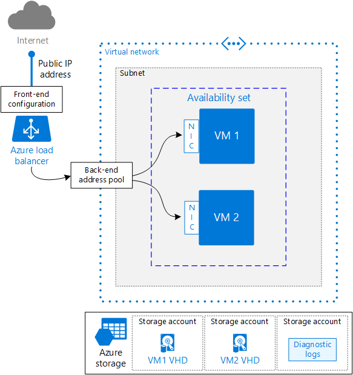

<properties
   pageTitle="Running multiple Windows VMs | Azure reference architecture"
   description="How to run multiple VM instances on Azure for scalability, resiliency, manageability, and security."
   services=""
   documentationCenter="na"
   authors="mikewasson"
   manager="roshar"
   editor=""
   tags=""/>

<tags
   ms.service="guidance"
   ms.devlang="na"
   ms.topic="article"
   ms.tgt_pltfrm="na"
   ms.workload="na"
   ms.date="05/16/2016"
   ms.author="mikewasson"/>

# Running multiple Windows VMs on Azure 

This article outlines a set of proven practices for running multiple virtual machine (VM) instances in an availability set, to improve availability and scalability.   

In this architecture, the workload is distributed across the VM instances. There is a single public IP address, and Internet traffic is distributed to the VMs using a load balancer. This architecture can be used for a single-tier app, such as a stateless web app or storage cluster. It is also a building block for N-tier applications. 

This article builds on [Running a Single Windows VM on Azure][single vm]. The recommendations in that article also apply to this architecture.

> [AZURE.NOTE] Azure has two different deployment models: [Resource Manager][resource-manager-overview] and classic. This article uses Resource Manager, which Microsoft recommends for new deployments.


## Architecture diagram



- **Availability Set.** Put the VMs into an [Availability Set][availability set]. This makes the VMs eligible for the [SLA][vm-sla] for virtual machines. For the SLA to apply, you need a minimum of two VMs in the same availability set.

- **VNet**. Every VM in Azure is deployed into a virtual network (VNet), which is further divided into **subnets**. For this scenario, place the VMs on the same subnet.

- **Azure Load Balancer.** Use an Internet-facing [load balancer] to distribute incoming Internet requests to the VM instances. The load balancer includes some related resources:

    - **Public IP address.** A public IP address is needed for the load balancer to receive Internet traffic.
    - **Front-end configuration.** Associates the public IP address with the load balancer.
    - **Back-end address pool.** Contains the network interfaces (NICs) for the VMs that will receive the incoming traffic.

- **Load balancer rules** are used to distribute network traffic among all the VMs in the back-end address pool. For example, to enable HTTP traffic, create a rule that maps port 80 from the front-end configuration to port 80 on the back-end address pool. When the load balancer receives a request on port 80 of the public IP address, it will route the request to port 80 on one of the NICs in the back-end address pool.

- **NAT rules** are used to route traffic to a specific VM. For example, to enable remote desktop (RDP) to the VMs, create a separate NAT rule for each VM. Each rule should map a distinct port number to port 3389, which is the default port for RDP. (For example, use port 50001 for "VM1", port 50002 for "VM2", and so on.) Assign the NAT rules to the NICs on the VMs.

- **Network interfaces (NICs)**. Provision a NIC for each VM. The NIC provides network connectivity to the VM. Associate the NIC with the subnet and also with the back-end address pool of the load balancer.

- **Storage.** Create separate Azure storage accounts for each VM to hold the VHDs, in order to avoid hitting the [IOPS limits][vm-disk-limits] for storage accounts. Create one storage account for diagnostic logs. That account can be shared by all the VMs.

## Scalability

The load balancer takes incoming network requests and distributes them across the NICs in the back-end address pool. To scale horizontally, add more VM instances to the Availability Set (or deallocate VMs to scale down). 

For example, suppose you're running a web server. You would add a load balancer rule for port 80 and/or port 443 (for SSL). When a client sends an HTTP request, the load balancer picks a back-end IP address by using a [hashing algorithm][load balancer hashing] that includes the source IP address. In that way, client requests are distributed across all the VMs. 

> [AZURE.TIP] When you add a new VM to an Availability Set, make sure to create a NIC for the VM, and add the NIC to the back-end address pool on the load balancer. Otherwise, Internet traffic won't be routed to the new VM.

Each Azure Subscription has default limits in place, including a maximum number of VMs per region. You can increase the limit by filing a support request. For more information, see [Azure subscription and service limits, quotas, and constraints][subscription-limits].  

## Availability

The Availability Set makes your app more resilient to both planned and unplanned maintenance events.

- _Planned maintenance_ occurs when Microsoft updates the underlying platform. Sometimes, that causes VMs to be restarted. Azure makes sure the VMs in an Availability Set are not restarted all at the same time, so at least one is kept running while others are restarting.

- _Unplanned maintenance_ happens if there is a hardware failure. Azure makes sure that VMs within an Availability Set are provisioned across more than one server rack. This helps to reduce the impact of hardware failures, network outages, power interruptions, and so on.

For more information, see [Manage the availability of virtual machines][availability set]. The following video also has a good overview of Availability Sets: [How Do I Configure an Availability Set to Scale VMs][availability set ch9]. 

> [AZURE.WARNING]  Make sure to configure the Availability Set when you provision the VM. Currently, there is no way to add a Resource Manager VM to an Availability Set after the VM is provisioned.

The load balancer uses [health probes] to monitor the availability of VM instances. If a probe cannot reach an instance within a timeout period, the load balancer stops sending traffic to that VM. However, the load balancer will continue to probe, and if the VM becomes available again, the load balancer resumes sending traffic to that VM.

Here are some recommendations on load balancer health probes:

- Probes can test either HTTP or TCP.  If your VMs run an HTTP server (IIS, nginx, Node.js app, etc), create an HTTP probe. Otherwise create a TCP probe.

- For an HTTP probe, specify the path to the HTTP endpoint. The probe checks for an HTTP 200 response from this path. Use a path that best represents the health of the VM instance. This can be the root path ("/"), or you might implement a specific health-monitoring endpoint that has some custom logic. The endpoint must allow anonymous HTTP requests.

- The probe is sent from a [known][health-probe-ip] IP address, 168.63.129.16. Make sure you don't block traffic to or from this IP in any firewall policies or network security group (NSG) rules.

- Use [health probe logs][health probe log] to view the status of the health probes. Enable logging in the Azure portal for each load balancer. Logs are written to Azure blob storage. The logs show how many VMs on the back-end are not receiving network traffic due to failed probe responses.

## Manageability

With multiple VMs, it becomes important to automate processes, so they are reliable and repeatable. You can use [Azure Automation][azure-automation] to automate deployment, OS patching, and other tasks. Azure Automation is an automation service that runs on Azure, and is based on Windows PowerShell. Example automation scripts are available at the [Runbook Gallery] on TechNet.

## Security

Virtual networks are a traffic isolation boundary in Azure. VMs in one VNet cannot communicate directly to VMs in a different VNet. VMs within the same VNet can communicate, unless you create [network security groups][nsg] (NSGs) to restrict traffic. For more information, see [Microsoft cloud services and network security][network-security].

For incoming Internet traffic, the load balancer rules define which traffic can reach the back end. However, load balancer rules don't support IP whitelisting, so if you want to whitelist certain public IP addresses, add an NSG to the subnet.

## Example deployment script

The following Windows batch script deploys the architecture shown in the previous diagram. The script requires version 0.9.20 or later of the [Azure Command-Line Interface (CLI)][azure-cli]. 

The script uses the naming conventions described in [Recommended Naming Conventions for Azure Resources][naming conventions]. It was tested against version 0.9.20 of the Azure CLI.

```bat
ECHO OFF
SETLOCAL

:::::::::::::::::::::::::::::::::::::::::::::::::::::::::::::::::::::::::::::::
:: Set up variables for deploying resources to Azure.
:: Change these variables for your own deployment.

:: The APP_NAME variable must not exceed 4 characters in size.
:: If it does the 15 character size limitation of the VM name may be exceeded.
SET APP_NAME=app1
SET LOCATION=eastus2
SET ENVIRONMENT=dev
SET USERNAME=testuser
SET NUM_VM_INSTANCES=2

:: For Windows, use the following command to get the list of URNs:
:: azure vm image list %LOCATION% MicrosoftWindowsServer WindowsServer 2012-R2-Datacenter
SET WINDOWS_BASE_IMAGE=MicrosoftWindowsServer:WindowsServer:2012-R2-Datacenter:4.0.20160126

:: For a list of VM sizes see: 
::   https://azure.microsoft.com/documentation/articles/virtual-machines-size-specs/
:: To see the VM sizes available in a region:
:: 	azure vm sizes --location <location>
SET VM_SIZE=Standard_DS1

:::::::::::::::::::::::::::::::::::::::::::::::::::::::::::::::::::::::::::::::

IF "%~2"=="" (
    ECHO Usage: %0 subscription-id admin-password
    EXIT /B
    )

:: Explicitly set the subscription to avoid confusion as to which subscription
:: is active/default
SET SUBSCRIPTION=%1
SET PASSWORD=%2

:: Set up the names of things using recommended conventions
SET RESOURCE_GROUP=%APP_NAME%-%ENVIRONMENT%-rg
SET AVAILSET_NAME=%APP_NAME%-as

SET LB_NAME=%APP_NAME%-lb
SET LB_FRONTEND_NAME=%LB_NAME%-frontend
SET LB_BACKEND_NAME=%LB_NAME%-backend-pool
SET LB_PROBE_NAME=%LB_NAME%-probe
SET IP_NAME=%APP_NAME%-pip
SET SUBNET_NAME=%APP_NAME%-subnet
SET VNET_NAME=%APP_NAME%-vnet
SET DIAGNOSTICS_STORAGE=%APP_NAME:-=%diag

:: Set up the postfix variables attached to most CLI commands
SET POSTFIX=--resource-group %RESOURCE_GROUP% --subscription %SUBSCRIPTION%

CALL azure config mode arm

::::::::::::::::::::::::::::::::::::::::::::::::::::::::::::::::::::::::::
:: Create resources

:: Create the enclosing resource group
CALL azure group create --name %RESOURCE_GROUP% --location %LOCATION% ^
  --subscription %SUBSCRIPTION%

:: Create the availability set
CALL azure availset create --name %AVAILSET_NAME% --location %LOCATION% %POSTFIX%

:: Create the VNet
CALL azure network vnet create --address-prefixes 10.0.0.0/16 ^
  --name %VNET_NAME% --location %LOCATION% %POSTFIX%

:: Create the subnet
CALL azure network vnet subnet create --vnet-name %VNET_NAME% --address-prefix ^
  10.0.0.0/24 --name %SUBNET_NAME% %POSTFIX%

:: Create the public IP address (dynamic)
CALL azure network public-ip create --name %IP_NAME% --location %LOCATION% %POSTFIX%

:: Create the storage account for diagnostics logs
CALL azure storage account create --type LRS --location %LOCATION% %POSTFIX% ^
  %DIAGNOSTICS_STORAGE%

::::::::::::::::::::::::::::::::::::::::::::::::::::::::::::::::::::::::::
:: Load balancer

:: Create the load balancer
CALL azure network lb create --name %LB_NAME% --location %LOCATION% %POSTFIX%

:: Create LB front-end and associate it with the public IP address
CALL azure network lb frontend-ip create --name %LB_FRONTEND_NAME% --lb-name ^
  %LB_NAME% --public-ip-name %IP_NAME% %POSTFIX%

:: Create LB back-end address pool
CALL azure network lb address-pool create --name %LB_BACKEND_NAME% --lb-name ^
  %LB_NAME% %POSTFIX%

:: Create a health probe for an HTTP endpoint
CALL azure network lb probe create --name %LB_PROBE_NAME% --lb-name %LB_NAME% ^
  --port 80 --interval 5 --count 2 --protocol http --path / %POSTFIX%

:: Create a load balancer rule for HTTP
CALL azure network lb rule create --name %LB_NAME%-rule-http --protocol tcp ^
  --lb-name %LB_NAME% --frontend-port 80 --backend-port 80 --frontend-ip-name ^
  %LB_FRONTEND_NAME% --probe-name %LB_PROBE_NAME% %POSTFIX%

::::::::::::::::::::::::::::::::::::::::::::::::::::::::::::::::::::::::::
:: Create VMs and per-VM resources
FOR /L %%I IN (1,1,%NUM_VM_INSTANCES%) DO CALL :CreateVM %%I

GOTO :eof

::::::::::::::::::::::::::::::::::::::::::::::::::::::::::::::::::::::::::
:: Subroutine to create the VMs and per-VM resources

:CreateVm

ECHO Creating VM %1

SET VM_NAME=%APP_NAME%-vm%1
SET NIC_NAME=%VM_NAME%-nic1
SET VHD_STORAGE=%VM_NAME:-=%st1
SET /a RDP_PORT=50000 + %1

:: Create NIC for VM1
CALL azure network nic create --name %NIC_NAME% --subnet-name %SUBNET_NAME% ^
  --subnet-vnet-name %VNET_NAME% --location %LOCATION% %POSTFIX%

:: Add NIC to back-end address pool
CALL azure network nic address-pool create --name %NIC_NAME% --lb-name %LB_NAME% ^
  --lb-address-pool-name %LB_BACKEND_NAME% %POSTFIX%

:: Create NAT rule for RDP
CALL azure network lb inbound-nat-rule create --name rdp-vm%1 --frontend-port ^
  %RDP_PORT% --backend-port 3389 --lb-name %LB_NAME% --frontend-ip-name ^
  %LB_FRONTEND_NAME% %POSTFIX%

:: Add NAT rule to the NIC
CALL azure network nic inbound-nat-rule add --name %NIC_NAME% --lb-name ^
  %LB_NAME% --lb-inbound-nat-rule-name rdp-vm%1 %POSTFIX%

:: Create the storage account for the OS VHD
CALL azure storage account create --type PLRS --location %LOCATION% ^
 %VHD_STORAGE% %POSTFIX%

:: Create the VM
CALL azure vm create --name %VM_NAME% --os-type Windows --image-urn ^
  %WINDOWS_BASE_IMAGE% --vm-size %VM_SIZE% --vnet-subnet-name %SUBNET_NAME% ^
  --nic-name %NIC_NAME% --vnet-name %VNET_NAME% --storage-account-name ^
  %VHD_STORAGE% --os-disk-vhd "%VM_NAME%-osdisk.vhd" --admin-username ^
  "%USERNAME%" --admin-password "%PASSWORD%" --boot-diagnostics-storage-uri ^
  "https://%DIAGNOSTICS_STORAGE%.blob.core.windows.net/" --availset-name ^
  %AVAILSET_NAME% --location %LOCATION% %POSTFIX%

:: Attach a data disk
CALL azure vm disk attach-new --vm-name %VM_NAME% --size-in-gb 128 --vhd-name ^
  %VM_NAME%-data1.vhd --storage-account-name %VHD_STORAGE% %POSTFIX%

goto :eof
```

## Next steps

- With a single tier, you have most of the building blocks needed for a multi-tier deployment. For more information, see [Running Windows VMs for an N-tier architecture on Azure][3-tier-blueprint].

<!-- Links -->
[3-tier-blueprint]: guidance-compute-3-tier-vm.md
[availability set]: ../virtual-machines/virtual-machines-windows-manage-availability.md
[availability set ch9]: https://channel9.msdn.com/Series/Microsoft-Azure-Fundamentals-Virtual-Machines/08
[azure-automation]: https://azure.microsoft.com/en-us/documentation/services/automation/
[azure-cli]: ../virtual-machines-command-line-tools.md
[bastion host]: https://en.wikipedia.org/wiki/Bastion_host
[health probe log]: ../load-balancer/load-balancer-monitor-log.md
[health probes]: ../load-balancer/load-balancer-overview.md#service-monitoring
[health-probe-ip]: ../virtual-network/virtual-networks-nsg.md#special-rules
[load balancer]: ../load-balancer/load-balancer-get-started-internet-arm-cli.md
[load balancer hashing]: ../load-balancer/load-balancer-overview.md#hash-based-distribution
[naming conventions]: guidance-naming-conventions.md
[network-security]: ../best-practices-network-security.md
[nsg]: ../virtual-network/virtual-networks-nsg.md
[resource-manager-overview]: ../resource-group-overview.md 
[Runbook Gallery]: ../automation/automation-runbook-gallery.md#runbooks-in-runbook-gallery
[single vm]: guidance-compute-single-vm.md
[subscription-limits]: ../azure-subscription-service-limits.md
[vm-disk-limits]: ../azure-subscription-service-limits.md#virtual-machine-disk-limits
[vm-sla]: https://azure.microsoft.com/en-us/support/legal/sla/virtual-machines/v1_0/
