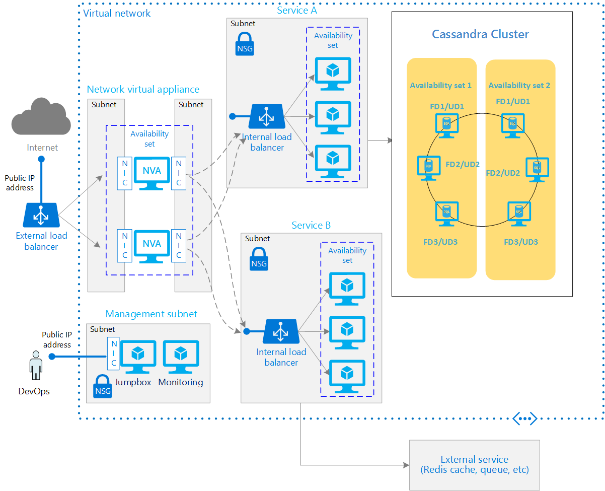

<properties
   pageTitle="Adding reliability to an N-tier architecture on Azure | Microsoft Azure"
   description="How to run Windows VMs for an N-tier architecture in Microsoft Azure."
   services=""
   documentationCenter="na"
   authors="mikewasson"
   manager="roshar"
   editor=""
   tags=""/>

<tags
   ms.service="guidance"
   ms.devlang="na"
   ms.topic="article"
   ms.tgt_pltfrm="na"
   ms.workload="na"
   ms.date="06/06/2016"
   ms.author="mikewasson"/>

# Adding reliability to an N-tier architecture on Azure

[AZURE.INCLUDE [pnp-header](../../includes/guidance-pnp-header-include.md)]

This article outlines a set of proven practices for running a reliable N-tier architecture on Linux virtual machines (VMs) in Microsoft Azure. This article builds on [Running VMs for an N-tier architecture on Azure][blueprints-3-tier]. In this article, we include additional components that can increase the reliability of the application:

- A network virtual appliance for greater network security.
- Cassandra no sql database deployed in availability set for high availability in the data tier.

> [AZURE.NOTE] Azure has two different deployment models: [Resource Manager][resource-manager-overview] and classic. This article uses Resource Manager, which Microsoft recommends for new deployments.

## Architecture diagram

This article is focused on VM and network infrastructure, not application design. The following diagram shows an abstraction of an N-tier application:

This diagram builds on the architecture shown in [Running Linux VMs for an N-tier architecture on Azure][blueprints-3-tier], adding the following components:

- **Network virtual appliance**. Provides firewall and other network functionality.

- **Cassandra noSql database on availability set**. Provides high availability at the data tier, by enabling replication and failover.

The application consists of two services, labeled A and B. For example, they might be web apps or web APIs. Client requests are routed either to service A or to service B, depending on the content of the request (for example, the URL path). Service A writes to Cassandra database. Service B sends data to an external service, such as Redis cache or a message queue, which is outside the scope of this article.

These general characteristics imply some high-level requirements for the system:

- Intelligent load balancing, to route requests based on URLs or message content. (Layer-7 load balancing.)
- Logging and monitoring of network traffic.
- Network packet inspection.
- Multiple storage technologies might be used.

## Network virtual appliance

A network virtual appliance (NVA) is a VM running software that performs network functionality. Typical features of an NVA include:

- Firewall.
- Traffic optimization, such as WAN optimization.
- Packet inspection.
- SSL offloading.
- Layer 7 load balancing.
- Logging and reporting

For high availability, place two or more NVAs in an availability set. Use an external load balancer to distribute incoming Internet requests across the instances.

For security, the NVA should have two separate NICs, placed in different subnets. One NIC is for Internet traffic, and the other is for network traffic to the other subnets within the VNet. Configure IP forwarding on the appliance to forward Internet traffic from the front-end NIC to the back-end NIC. Note that some NVA do not support multiple NICs.

> [AZURE.NOTE] This article doesn't cover how to configure the NVA, which depends on the particular appliance.

## Network recommendations

- Generally, put each service or app tier into its own subnet, and set NSGs on each subnet. For more information about designing VNets and subnets, see [Plan and design Azure Virtual Networks][plan-network].

- In the configuration shown here, network traffic within the VNet (between VMs) is _not_ routed through the network virtual appliance. If you need network traffic within the VNet to go through the appliance &mdash; for example, for compliance reasons &mdash; create user defined routes (UDRs) to route the traffic. For more information, see [What are User Defined Routes and IP Forwarding?][udr].

- Use [network security groups][nsg] (NSGs) to isolate subnets. For example, in the previous diagram, the NSG for service A allows network traffic only from the NVA and the management subnet. Of course, the details will depend on your application.

## Deployment of Cassandra in Rack Aware configuration for High availability

Cassandra replicas can be placed in different racks to ensure that multiple replicas are not lost due to a hardware failure or upgrade reboot of the VM in the region. Optionally for resiliency the cassandra cluster can be configured in different availability sets to increase resiliency by increasing the fault domain.

- This configuration provides High availability in an event of a portion of a physical data center to fail.

- this configuration provides High availability in an event of upgrade the VM.

- The deployment configuration provides with 3 fault domaings and 18 upgrade domains.

For more information on running Cassandra in Azure refer to [cassandra-in-azure].

- A public IP address is assigned to each node and the cluster communication is done using the azure backbone infrastructure providing for high throughput and low cost, inc case the configuration needs to be expanded to another data center.

- The cluster using public IPs for nodes would still be sufficiently secure and at the same time be able to take advantage of much better bandwidth available with the Microsoft private backbone for communications across regions.

- All the nodes are protected with appropriate firewalls /NSG configurations allowing traffic to and from for only only known hosts (including client app nodes & other cluster nodes)

- All client-node, node-node communications are encrypted/SSL.

- Traffic and communication between nodes can be secured applying NSG rules. Cassandra uses different ports for communication, opscenter, sparks etc. For port usage in Cassandra refer to [cassandra-ports]

## Next steps

- If you need higher availability than the SLAs provide, replicate the application across two datacenters and use Azure Traffic Manager for failover. For more information, see [Running VMs in multiple datacenters on Azure for high availability][multi-dc].    

- To learn more about setting up a DMZ with a virtual appliance, see [Virtual appliance scenario][virtual-appliance-scenario].

<!-- links -->
[cassandra-in-azure]: https://academy.datastax.com/resources/deployment-guide-azure
[cassandra-consistency]: http://docs.datastax.com/en/cassandra/2.0/cassandra/dml/dml_config_consistency_c.html
[cassandra-replication]: http://www.planetcassandra.org/data-replication-in-nosql-databases-explained/
[cassandra-consistency-usage]: https://medium.com/@foundev/cassandra-how-many-nodes-are-talked-to-with-quorum-also-should-i-use-it-98074e75d7d5#.b4pb4alb2
[cassandra-ports]: http://docs.datastax.com/en/latest-dse/datastax_enterprise/sec/secConfFirePort.html
[azure-cli]: ../virtual-machines-command-line-tools.md
[blueprints-3-tier]: guidance-compute-3-tier-vm.md
[multi-dc]: guidance-compute-multiple-datacenters.md
[nsg]: ../virtual-network/virtual-networks-nsg.md
[plan-network]: ../virtual-network/virtual-network-vnet-plan-design-arm.md
[resource-manager-overview]: ../resource-group-overview.md
[udr]: ../virtual-network/virtual-networks-udr-overview.md
[virtual-appliance-scenario]: ../virtual-network/virtual-network-scenario-udr-gw-nva.md
