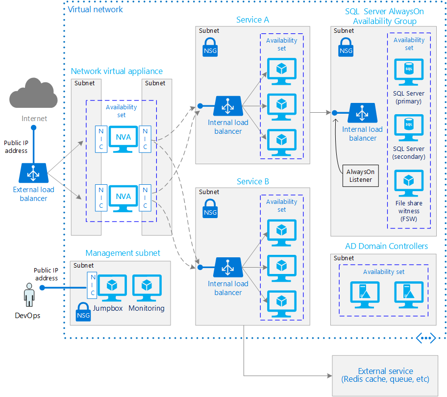

<properties
   pageTitle="Adding reliability to an N-tier architecture on Azure | Microsoft Azure"
   description="How to run Windows VMs for an N-tier architecture in Microsoft Azure."
   services=""
   documentationCenter="na"
   authors="mikewasson"
   manager="roshar"
   editor=""
   tags=""/>

<tags
   ms.service="guidance"
   ms.devlang="na"
   ms.topic="article"
   ms.tgt_pltfrm="na"
   ms.workload="na"
   ms.date="07/12/2016"
   ms.author="mikewasson"/>

# Adding reliability to an N-tier architecture on Azure 

[AZURE.INCLUDE [pnp-header](../../includes/guidance-pnp-header-include.md)]

> [AZURE.SELECTOR]
- [Adding reliability to an N-tier architecture (Linux)](guidance-compute-n-tier-vm-linux.md)
- [Adding reliability to an N-tier architecture (Windows)](guidance-compute-n-tier-vm.md)

This article outlines a set of proven practices for running a reliable N-tier architecture on Windows virtual machines (VMs) in Microsoft Azure. This article builds on [Running VMs for an N-tier architecture on Azure][blueprints-3-tier]. In this article, we include additional components that can increase the reliability of the application:

- A network virtual appliance for greater network security.

- SQL Server AlwaysOn Availability Groups for high availability in the data tier.

> [AZURE.NOTE] Azure has two different deployment models: [Resource Manager][resource-manager-overview] and classic. This article uses Resource Manager, which Microsoft recommends for new deployments.

## Architecture diagram

This article is focused on VM and network infrastructure, not application design. The following diagram shows an abstraction of an N-tier application: 



This diagram builds on the architecture shown in [Running Windows VMs for an N-tier architecture on Azure][blueprints-3-tier], adding the following components:

- **Network virtual appliance (NVA)**. A VM running software that performs network security functionality. Typical features provided by an NVA include:

	- Firewall.

	- Traffic optimization, such as WAN optimization.

	- Packet inspection.

	- SSL offloading.

	- Layer 7 load balancing.

	- Logging and reporting.

- **SQL Server AlwaysOn Availability Group**. Provides high availability at the data tier, by enabling replication and failover.

The application consists of two services, labeled A and B. For example, they might be web apps or web APIs. Client requests are routed either to service A or to service B, depending on the content of the request (for example, the URL path). Service A writes to a SQL database. Service B sends data to an external service, such as Redis cache or a message queue, which is outside the scope of this article.

These general characteristics imply some high-level requirements for the system:

- Intelligent load balancing, to route requests based on URLs or message content. (Layer-7 load balancing.)

- Logging and monitoring of network traffic.

- Network packet inspection.

- Multiple storage technologies might be used.

## Recommendations

### Network virtual appliance

- For high availability, place two or more NVAs in an availability set. Use an external load balancer to distribute incoming Internet requests across the instances.

- For security, the NVA should have two separate NICs, placed in different subnets. One NIC is for Internet traffic, and the other is for network traffic to the other subnets within the VNet. Configure IP forwarding on the appliance to forward Internet traffic from the front-end NIC to the back-end NIC. Note that some NVA do not support multiple NICs.

	> [AZURE.NOTE] This article doesn't cover how to configure the NVA, which depends on the particular appliance.

### VNet / Subnets

- Generally, put each service or app tier into its own subnet, and set NSGs on each subnet. For more information about designing VNets and subnets, see [Plan and design Azure Virtual Networks][plan-network].

- In the configuration shown here, network traffic within the VNet (between VMs) is _not_ routed through the network virtual appliance. If you need network traffic within the VNet to go through the appliance &mdash; for example, for compliance reasons &mdash; create user defined routes (UDRs) to route the traffic. For more information, see [What are User Defined Routes and IP Forwarding?][udr].

- Use [network security groups][nsg] (NSGs) to isolate subnets. For example, in the previous diagram, the NSG for service A allows network traffic only from the NVA and the management subnet. Of course, the details will depend on your application.

### SQL Server AlwaysOn Availability Groups

We recommend [AlwaysOn Availability Groups][sql-alwayson-ag] for SQL Server high availability. AlwaysOn Availability Groups require a domain controller. All nodes in the Availability Group must be in the same AD domain.

Other tiers connect to the database through an [availability group listener][sql-alwayson-ag-listeners]. The listener enables a SQL client to connect without knowing the name of the physical instance of SQL Server. VMs that access the database must be joined to the domain. The client (in this case, another tier) uses DNS to resolve the listener's virtual network name into IP addresses.

Configure SQL Server AlwaysOn as follows:

- Create a Windows Server Failover Clustering (WSFC) cluster and a SQL Server AlwaysOn availability group. For more information, see [Getting Started with AlwaysOn Availability Groups][sql-alwayson-getting-started].

- Create an internal load balancer with a static private IP address.

- Create an availability group listener, and map the listener's DNS name to the IP address of an internal load balancer. 

- Create a load balancer rule for the SQL Server listening port (TCP port 1433 by default). The load balancer rule must enable _floating IP_, also called Direct Server Return. This causes the VM to reply directly to the client, which enables a direct connection to the primary replica.

    > [AZURE.NOTE] When floating IP is enabled, the front-end port number must be the same as the back-end port number in the load balancer rule.


When a SQL client tries to connect, the load balancer routes the connection request to the replica that is the current primary. If there is a failover to another replica, the load balancer automatically routes subsequent requests to the new primary replica. For more information, see [Configure load balancer for SQL always on][sql-alwayson-ilb].

During a failover, existing client connections are closed. After the failover completes, new connections will be routed to the new primary replica.

If your app makes significantly more reads than writes, you can offload some of the read-only queries to a secondary replica. See [Using a Listener to Connect to a Read-Only Secondary Replica (Read-Only Routing)][sql-alwayson-read-only-routing].

Test your deployment by [forcing a manual failover][sql-always-on-force-failover].

## Availability considerations

If you need higher availability than the [Azure SLAs for VMs][VM-SLAs] provide, replicate the application across two datacenters and use Azure Traffic Manager for failover. For more information, see [Running VMs in multiple datacenters on Azure for high availability][multi-dc].   

## Solution Deployment

<!--JS - MAY NEED TO REVISIT THIS SECTION ONCE THE NEW ARM TEMPLATES FOR THIS BLUEPRINT ARE AVAILABLE-->

The following Windows batch script creates the N-tier deployment shown in the previous diagram. The script requires version 0.9.20 or later of the [Azure Command-Line Interface (CLI)][azure-cli]. 

The script is designed to work with the SQL Server AlwaysOn Cluster template in the Azure marketplace. You will deploy the this template from the Azure portal, and then run the script. The script executes Azure CLI commands to deploy additional resources.

1. From the Azure portal, deploy the "SQL Server AlwaysOn Cluster" template.  

2. Open the script and edit the folllowing variables to match the values that you used to deploy the template:

    - `USERNAME`: Administrator user name

    - `RESOURCE_GROUP`: Resource group name

    - `LOCATION`: Location

    - `VNET_NAME`: VNET name

    - `SQL_SUBNET_NAME`: SQL Server subnet name

2. Run the script. Pass in your Azure subscription ID, the administrator password, and the IP addresses to whitelist for the jumpbox. For the IP address, you can specify a range using CIDR notation, or a single IP address.

The script does not install the software for the network virtual appliance.

```bat
@ECHO OFF
SETLOCAL ENABLEEXTENSIONS
SETLOCAL ENABLEDELAYEDEXPANSION
SET me=%~n0


:::::::::::::::::::::::::::::::::::::::::::::::::::::::::::::::::::::::::::::::
:: The following variables MUST match the template parameters that you provide 
:: when you deploy the SQL Server AlwaysOn Cluster template. 

::  Administrator user name
SET USERNAME=testuser
:: Resource group
SET RESOURCE_GROUP=app1-dev-rg
:: Location
SET LOCATION=westus
:: Virtual network name
SET VNET_NAME=autohaVNET
:: SQL Server subnet name
SET SQL_SUBNET_NAME=subnet-2

:::::::::::::::::::::::::::::::::::::::::::::::::::::::::::::::::::::::::::::::

	
:::::::::::::::::::::::::::::::::::::::::::::::::::::::::::::::::::::::::::::::
:: Set up variables for deploying resources to Azure.
:: Change these variables for your own deployment as needed.

:: The APP_NAME variable must not exceed 4 characters in size.
:: If it does the 15 character size limitation of the VM name may be exceeded.
SET APP_NAME=app1
SET ENVIRONMENT=dev

SET NUM_VM_INSTANCES_SERVICE_TIER_1=3
SET NUM_VM_INSTANCES_SERVICE_TIER_2=3
SET NUM_VM_INSTANCES_DMZ_TIER=2
SET NUM_VM_INSTANCES_MANAGE_TIER=1

:: Set IP range for various subnets using CIDR-format
SET VNET_IP_RANGE=10.0.0.0/16
SET SERVICE_SUBNET_IP_RANGE_1=10.0.2.0/24
SET SERVICE_SUBNET_IP_RANGE_2=10.0.3.0/24
SET MANAGE_SUBNET_IP_RANGE=10.0.4.0/26

:: DMZ has multiple NIC VMs with each NIC in separate subnet
SET DMZ_SUBNET_IP_RANGE_1=10.0.5.0/26
SET DMZ_SUBNET_IP_RANGE_2=10.0.6.0/26

:: Number of service tiers to create
SET SERVICE_TIER_COUNT=2

:: Set IP address of Internal Load Balancer in the high end of subnet's IP range
:: to keep separate from IP addresses assigned to VM's that start at the low end.
SET SERVICE_ILB_IP_1=10.0.2.250
SET SERVICE_ILB_IP_2=10.0.3.250

:: Remote access port for the RDP rule
SET REMOTE_ACCESS_PORT=3389

:: For Windows, use the following command to get the list of URNs:
:: azure vm image list %LOCATION% MicrosoftWindowsServer WindowsServer 2012-R2-Datacenter
SET WINDOWS_BASE_IMAGE=MicrosoftWindowsServer:WindowsServer:2012-R2-Datacenter:4.0.20160126

:: Changing the image to Linux since FW appliances are available for OSS only as of now
:: azure vm image list %LOCATION% canonical ubuntuserver 14.04.3-LTS
SET APPLIANCE_BASE_IMAGE=canonical:ubuntuserver:14.04.3-LTS:14.04.201602171

:: For a list of VM sizes see: https://azure.microsoft.com/en-us/documentation/articles/virtual-machines-size-specs/
:: To see the VM sizes available in a region:
:: 	azure vm sizes --location <<location>>
SET VM_SIZE=Standard_DS1

:: For DMZ we need VMs with multiple NICs, therefore using the minimum supported size for 2 NICs
SET DMZ_VM_SIZE=Standard_DS2

:: Validate command line arguments
IF "%~3"=="" (
    ECHO Usage: %me% subscription-id admin-address-whitelist-CIDR-format admin-password
    ECHO 	For example: %me% xxxxxxxx-xxxx-xxxx-xxxx-xxxxxxxxxxxx nnn.nnn.nnn.nnn/mm pwd
    EXIT /B
	)

:: Explicitly set the subscription to avoid confusion as to which subscription
:: is active/default
SET SUBSCRIPTION=%1
SET ADMIN_ADDRESS_PREFIX=%2
SET PASSWORD=%3

:: Set up the names of things using recommended conventions. 
SET PUBLIC_IP_NAME=%APP_NAME%-pip
SET DIAGNOSTICS_STORAGE=%APP_NAME:-=%diag
SET JUMPBOX_PUBLIC_IP_NAME=%APP_NAME%-jumpbox-pip
SET JUMPBOX_NIC_NAME=%APP_NAME%-mgt-vm1-nic1

:: Make sure we are in ARM mode
CALL azure config mode arm

:: AlwaysOn template creates a public load balancer that we do not need.
SET SQL_RDP_LB_NAME=rdpLoadBalancer

:: Set up the postfix variables attached to most CLI commands
SET POSTFIX=--resource-group %RESOURCE_GROUP% --subscription %SUBSCRIPTION%

::::::::::::::::::::::::::::::::::::::::::::::::::::::::::::::::::::::::::
:: Create root level resources

:: Create the storage account for diagnostics logs
CALL :CallCLI azure storage account create --type LRS --location %LOCATION% %POSTFIX% %DIAGNOSTICS_STORAGE%

:: Create the jumpbox public IP address (dynamic)
CALL :CallCLI azure network public-ip create --name %JUMPBOX_PUBLIC_IP_NAME% --location %LOCATION% %POSTFIX%


::::::::::::::::::::::::::::::::::::::::::::::::::::::::::::::::::::::::::
:: Create multiple service tiers including subnets and other resources

FOR /L %%I IN (1,1,%SERVICE_TIER_COUNT%) DO CALL :CreateServiceTier %%I svc%%I


::::::::::::::::::::::::::::::::::::::::::::::::::::::::::::::::::::::::::
:: Create the management tier including subnet and other resources
:: Management subnet has no load balancer, no availability set, and two VMs

SET SUBNET_NAME=%APP_NAME%-mgt-subnet
SET USING_AVAILSET=false

:: Create the subnet
CALL :CallCLI azure network vnet subnet create --vnet-name %VNET_NAME% --address-prefix ^
  %MANAGE_SUBNET_IP_RANGE% --name %SUBNET_NAME% %POSTFIX%

:: Create VMs and per-VM resources
FOR /L %%I IN (1,1,%NUM_VM_INSTANCES_MANAGE_TIER%) DO CALL :CreateVM %%I mgt %SUBNET_NAME% %USING_AVAILSET%


::::::::::::::::::::::::::::::::::::::::::::::::::::::::::::::::::::::::::
:: Create the DMZ tier
:: DMZ tier has external load balancer, two subnets, an availability set and two Fortinet VMs

SET LB_NAME=%APP_NAME%-dmz-lb
SET SUBNET_FRONTEND_NAME=%APP_NAME%-dmz-fe-subnet
SET SUBNET_BACKEND_NAME=%APP_NAME%-dmz-be-subnet
SET AVAILSET_NAME=%APP_NAME%-dmz-as
SET LB_DOMAIN_NAME=%APP_NAME%%ENVIRONMENT%lb
SET USING_AVAILSET=true

:: Create the DMZ tier external load balancer
CALL :CallCLI azure network lb create --name %LB_NAME% --location %LOCATION% %POSTFIX%

:: Create the frontend subnet
CALL :CallCLI azure network vnet subnet create --vnet-name %VNET_NAME% --address-prefix ^
  %DMZ_SUBNET_IP_RANGE_1% --name %SUBNET_FRONTEND_NAME% %POSTFIX%
  
:: Create the backend subnet
CALL :CallCLI azure network vnet subnet create --vnet-name %VNET_NAME% --address-prefix ^
  %DMZ_SUBNET_IP_RANGE_2% --name %SUBNET_BACKEND_NAME% %POSTFIX%

:: Create the availability sets
CALL :CallCLI azure availset create --name %AVAILSET_NAME% --location %LOCATION% %POSTFIX%

:: Create a public IP address
CALL :CallCLI azure network public-ip create --name %PUBLIC_IP_NAME% --domain-name-label ^
  %LB_DOMAIN_NAME% --idle-timeout 4 --location %LOCATION% %POSTFIX%

:: Create the load balancer frontend-ip using a public IP address and subnet
CALL :CallCLI azure network lb frontend-ip create --name %LB_NAME%-frontend --lb-name ^
  %LB_NAME% --public-ip-name %PUBLIC_IP_NAME% --subnet-name %SUBNET_FRONTEND_NAME% %POSTFIX%

CALL :CreateCommonLBResources %LB_NAME%

:: Create VMs and per-VM resources
FOR /L %%I IN (1,1,%NUM_VM_INSTANCES_DMZ_TIER%) DO CALL :CreateNaVM %%I dmz %SUBNET_FRONTEND_NAME% %SUBNET_BACKEND_NAME% %USING_AVAILSET% %LB_NAME%


::::::::::::::::::::::::::::::::::::::::::::::::::::::::::::::::::::::::::
:: Network Security Group Rules

:: The Jump box NSG rule allows inbound remote access traffic from admin-address-prefix script parameter.
:: To view the provisioned NSG rules, go to the portal (portal.azure.com) and view the
:: Inbound and Outbound rules for the NSG.
:: Don't forget that there are default rules that are also visible through the portal.		

:: Jumpbox NSG rules

SET MANAGE_NSG_NAME=%APP_NAME%-mgt-nsg					

CALL :CallCLI azure network nsg create --name %MANAGE_NSG_NAME% --location %LOCATION% %POSTFIX%
CALL :CallCLI azure network nsg rule create --nsg-name %MANAGE_NSG_NAME% --name admin-rdp-allow ^
	--access Allow --protocol Tcp --direction Inbound --priority 100 ^
	--source-address-prefix %ADMIN_ADDRESS_PREFIX% --source-port-range * ^
	--destination-address-prefix * --destination-port-range %REMOTE_ACCESS_PORT% %POSTFIX%

:: Associate the NSG rule with the jumpbox NIC
CALL :CallCLI azure network nic set --name %JUMPBOX_NIC_NAME% ^
	--network-security-group-name %MANAGE_NSG_NAME% %POSTFIX%

:: Make Jump Box publically accessible
CALL :CallCLI azure network nic set --name %JUMPBOX_NIC_NAME% --public-ip-name %JUMPBOX_PUBLIC_IP_NAME% %POSTFIX%
	
:: SQL AlwaysOn AG tier NSG rules

:: No NSG is created in SQL AlwaysOn deployment since it uses rdp load balancer
SET SQL_TIER_NSG_NAME=%APP_NAME%-sql-nsg

:: Delete the existing rdp load balancer in SQL tier since not needed
CALL :CallCLI azure network lb delete --name %SQL_RDP_LB_NAME% --quiet %POSTFIX%

CALL :CallCLI azure network nsg create --name %SQL_TIER_NSG_NAME% --location %LOCATION% %POSTFIX%

:: Allow inbound traffic from service tier subnet to the SQL tier
CALL azure network nsg rule create --nsg-name %SQL_TIER_NSG_NAME% --name svc-allow ^
	--access Allow --protocol * --direction Inbound --priority 100 ^
	--source-address-prefix %SERVICE_SUBNET_IP_RANGE_1% --source-port-range * ^
	--destination-address-prefix * --destination-port-range * %POSTFIX%	

:: Allow inbound remote access traffic from management subnet
CALL :CallCLI azure network nsg rule create --nsg-name %SQL_TIER_NSG_NAME% --name manage-rdp-allow ^
	--access Allow --protocol Tcp --direction Inbound --priority 200 ^
	--source-address-prefix %MANAGE_SUBNET_IP_RANGE% --source-port-range * ^
	--destination-address-prefix * --destination-port-range %REMOTE_ACCESS_PORT% %POSTFIX%

:: Deny all other inbound traffic from within vnet
CALL :CallCLI azure network nsg rule create --nsg-name %SQL_TIER_NSG_NAME% --name vnet-deny ^
	--access Deny --protocol * --direction Inbound --priority 1000 ^
	--source-address-prefix VirtualNetwork --source-port-range * ^
	--destination-address-prefix * --destination-port-range * %POSTFIX%

:: Associate the NSG rule with the subnet
CALL :CallCLI azure network vnet subnet set --vnet-name %VNET_NAME% --name %SQL_SUBNET_NAME% ^
	--network-security-group-name %SQL_TIER_NSG_NAME% %POSTFIX%	
	
GOTO :eof

:::::::::::::::::::::::::::::::::::::::::::::::::::::::::::::::::::::::::
:: Subroutine to create the service tier
:: Service tier has an internal load balancer, availability set, and three VMs

:CreateServiceTier

SET LB_NAME=%APP_NAME%-%2-lb
SET SUBNET_NAME=%APP_NAME%-%2-subnet
SET AVAILSET_NAME=%APP_NAME%-%2-as
SET USING_AVAILSET=true

:: Set a temporary variable to service tier subnet IP range number and use the actual
:: value to setup SUBNET_IP_RANGE
SET SUBNET_IP_RANGE=SERVICE_SUBNET_IP_RANGE_%1
REM for /f "delims=" %%J in ('call echo %%TEMP_SUBNET_VAR%%') do set @SUBNET_IP_RANGE=%%J

:: Set a temporary variable to service tier ILB IP number and use the actual
:: value to setup ILB IP
SET SERVICE_ILB_IP=SERVICE_ILB_IP_%1
REM for /f "delims=" %%K in ('call echo %%TEMP_ILB_VAR%%') do set @SERVICE_ILB_IP=%%K

ECHO Creating resources for service tier: %2

:: Create the service tier internal load balancer
CALL :CallCLI azure network lb create --name %LB_NAME% --location %LOCATION% %POSTFIX%

:: Create the subnet
CALL :CallCLI azure network vnet subnet create --vnet-name %VNET_NAME% --address-prefix ^
  !%SUBNET_IP_RANGE%! --name %SUBNET_NAME% %POSTFIX%

:: Create the availability sets
CALL :CallCLI azure availset create --name %AVAILSET_NAME% --location %LOCATION% %POSTFIX%

:: Create the load balancer frontend-ip using a private IP address and subnet
CALL :CallCLI azure network lb frontend-ip create --name %LB_NAME%-frontend --lb-name ^
  %LB_NAME% --private-ip-address !%SERVICE_ILB_IP%! --subnet-name %SUBNET_NAME% ^
  --subnet-vnet-name %VNET_NAME% %POSTFIX%

:: Service tier NSG rules

SET SERVICE_TIER_NSG_NAME=%APP_NAME%-%2-nsg

CALL :CallCLI azure network nsg create --name %SERVICE_TIER_NSG_NAME% --location %LOCATION% %POSTFIX%

:: Allow inbound traffic from DMZ tier backend subnet to the service tier
CALL :CallCLI azure network nsg rule create --nsg-name %SERVICE_TIER_NSG_NAME% --name dmz-allow ^
	--access Allow --protocol * --direction Inbound --priority 100 ^
	--source-address-prefix %DMZ_SUBNET_IP_RANGE_2% --source-port-range * ^
	--destination-address-prefix * --destination-port-range * %POSTFIX%

:: Allow inbound remote access traffic from management subnet
CALL :CallCLI azure network nsg rule create --nsg-name %SERVICE_TIER_NSG_NAME% --name manage-rdp-allow ^
	--access Allow --protocol Tcp --direction Inbound --priority 200 ^
	--source-address-prefix %MANAGE_SUBNET_IP_RANGE% --source-port-range * ^
	--destination-address-prefix * --destination-port-range %REMOTE_ACCESS_PORT% %POSTFIX%

:: Deny all other inbound traffic from within vnet
CALL :CallCLI azure network nsg rule create --nsg-name %SERVICE_TIER_NSG_NAME% --name vnet-deny ^
	--access Deny --protocol * --direction Inbound --priority 1000 ^
	--source-address-prefix VirtualNetwork --source-port-range * ^
	--destination-address-prefix * --destination-port-range * %POSTFIX%

:: Associate the NSG rule with the subnet
CALL :CallCLI azure network vnet subnet set --vnet-name %VNET_NAME% --name %SUBNET_NAME% ^
	--network-security-group-name %SERVICE_TIER_NSG_NAME% %POSTFIX%									
  
CALL :CreateCommonLBResources %LB_NAME%

:: Set a temporary variable to number of VMs in service tier and use the actual
:: value to call VM creation subroutine
SET NUM_VM_INSTANCES_SERVICE_TIER=NUM_VM_INSTANCES_SERVICE_TIER_%1
REM for /f "delims=" %%J in ('call echo %%TEMP_VM_VAR%%') do set @NUM_VM_INSTANCES_SERVICE_TIER=%%J

:: Create VMs and per-VM resources
FOR /L %%I IN (1,1,!%NUM_VM_INSTANCES_SERVICE_TIER%!) DO CALL :CreateVM %%I %2 %SUBNET_NAME% %USING_AVAILSET% %LB_NAME%

GOTO :eof


::::::::::::::::::::::::::::::::::::::::::::::::::::::::::::::::::::::::::
:: Subroutine to create load balancer resouces: back-end address pool, health probe, and rule

:CreateCommonLBResources

SET LB_NAME=%1
SET LB_FRONTEND_NAME=%LB_NAME%-frontend
SET LB_BACKEND_NAME=%LB_NAME%-backend-pool
SET LB_PROBE_NAME=%LB_NAME%-probe

ECHO Creating resources for load balancer: %LB_NAME%

:: Create LB back-end address pool
CALL :CallCLI azure network lb address-pool create --name %LB_BACKEND_NAME% --lb-name ^
  %LB_NAME% %POSTFIX%

:: Create a health probe for an HTTP endpoint
CALL :CallCLI azure network lb probe create --name %LB_PROBE_NAME% --lb-name %LB_NAME% ^
  --port 80 --interval 5 --count 2 --protocol http --path / %POSTFIX%

:: Create a load balancer rule for HTTP
CALL :CallCLI azure network lb rule create --name %LB_NAME%-rule-http --protocol tcp ^
  --lb-name %LB_NAME% --frontend-port 80 --backend-port 80 --frontend-ip-name ^
  %LB_FRONTEND_NAME% --probe-name %LB_PROBE_NAME% %POSTFIX%

GOTO :eof  


::::::::::::::::::::::::::::::::::::::::::::::::::::::::::::::::::::::::::
:: Subroutine to create the VMs and per-VM resources

:CreateVm

SET TIER_NAME=%2
SET SUBNET_NAME=%3
SET NEEDS_AVAILABILITY_SET=%4
SET LB_NAME=%5

ECHO Creating VM %1 in the %TIER_NAME% tier, in subnet %SUBNET_NAME%.
ECHO NEEDS_AVAILABILITY_SET="%NEEDS_AVAILABILITY_SET%" and LB_NAME="%LB_NAME%"

SET AVAILSET_NAME=%APP_NAME%-%TIER_NAME%-as
SET VM_NAME=%APP_NAME%-%TIER_NAME%-vm%1
SET NIC_NAME=%VM_NAME%-nic1
SET VHD_STORAGE=%VM_NAME:-=%st1
SET /a RDP_PORT=50001 + %1

SET LB_FRONTEND_NAME=%LB_NAME%-frontend
SET LB_BACKEND_NAME=%LB_NAME%-backend-pool

:: Create NIC for VM1
CALL :CallCLI azure network nic create --name %NIC_NAME% --subnet-name %SUBNET_NAME% ^
  --subnet-vnet-name %VNET_NAME% --location %LOCATION% %POSTFIX%

IF NOT "%LB_NAME%"=="" (
	:: Add NIC to back-end address pool
	SET LB_BACKEND_NAME=%LB_NAME%-backend-pool
	CALL azure network nic address-pool create --name %NIC_NAME% --lb-name %LB_NAME% ^
	  --lb-address-pool-name %LB_BACKEND_NAME% %POSTFIX%
)  
  
:: Create the storage account for the OS VHD
CALL :CallCLI azure storage account create --type PLRS --location %LOCATION% ^
 %VHD_STORAGE% %POSTFIX%

SET AVAILSET_SCRIPT=
IF "%NEEDS_AVAILABILITY_SET%"=="true" (
	SET AVAILSET_SCRIPT=--availset-name %AVAILSET_NAME%
)

:: Create the VM
CALL :CallCLI azure vm create --name %VM_NAME% --os-type Windows --image-urn ^
    %WINDOWS_BASE_IMAGE% --vm-size %VM_SIZE% --vnet-subnet-name %SUBNET_NAME% ^
    --nic-name %NIC_NAME% --vnet-name %VNET_NAME% --storage-account-name ^
    %VHD_STORAGE% --os-disk-vhd "%VM_NAME%-osdisk.vhd" --admin-username ^
    "%USERNAME%" --admin-password "%PASSWORD%" --boot-diagnostics-storage-uri ^
    "https://%DIAGNOSTICS_STORAGE%.blob.core.windows.net/" --location %LOCATION% ^
	%AVAILSET_SCRIPT% %POSTFIX%

:: Attach a data disk
CALL :CallCLI azure vm disk attach-new --vm-name %VM_NAME% --size-in-gb 128 --vhd-name ^
  %VM_NAME%-data1.vhd --storage-account-name %VHD_STORAGE% %POSTFIX%

goto :eof


::::::::::::::::::::::::::::::::::::::::::::::::::::::::::::::::::::::::::
:: Subroutine to create NA VMs and per-VM resources

:CreateNaVm

SET TIER_NAME=%2
SET SUBNET_FRONTEND_NAME=%3
SET SUBNET_BACKEND_NAME=%4
SET NEEDS_AVAILABILITY_SET=%5
SET LB_NAME=%6

ECHO Creating VM %1 in the %TIER_NAME% tier, in subnet %SUBNET_NAME%.
ECHO NEEDS_AVAILABILITY_SET="%NEEDS_AVAILABILITY_SET%" and LB_NAME="%LB_NAME%"

SET AVAILSET_NAME=%APP_NAME%-%TIER_NAME%-as
SET VM_NAME=%APP_NAME%-%TIER_NAME%-vm%1
SET NIC_NAME_1=%VM_NAME%-nic1
SET NIC_NAME_2=%VM_NAME%-nic2

SET VHD_STORAGE=%VM_NAME:-=%st1
SET /a RDP_PORT=50001 + %1

SET LB_FRONTEND_NAME=%LB_NAME%-frontend
SET LB_BACKEND_NAME=%LB_NAME%-backend-pool

:: Create first NIC for VM1
CALL :CallCLI azure network nic create --name %NIC_NAME_1% --subnet-name %SUBNET_FRONTEND_NAME% ^
  --subnet-vnet-name %VNET_NAME% --location %LOCATION% %POSTFIX%

:: Create second NIC for VM1
CALL :CallCLI azure network nic create --name %NIC_NAME_2% --subnet-name %SUBNET_BACKEND_NAME% ^
  --subnet-vnet-name %VNET_NAME% --location %LOCATION% %POSTFIX%

IF NOT "%LB_NAME%"=="" (
	:: Add first NIC to back-end address pool
	SET LB_BACKEND_NAME=%LB_NAME%-backend-pool
	CALL azure network nic address-pool create --name %NIC_NAME_1% --lb-name %LB_NAME% ^
	  --lb-address-pool-name %LB_BACKEND_NAME% %POSTFIX%
)  

:: Create the storage account for the OS VHD
CALL :CallCLI azure storage account create --type PLRS --location %LOCATION% ^
 %VHD_STORAGE% %POSTFIX%


SET AVAILSET_SCRIPT=
IF "%NEEDS_AVAILABILITY_SET%"=="true" (
	SET AVAILSET_SCRIPT=--availset-name %AVAILSET_NAME%
)
:: Create the VM
CALL :CallCLI azure vm create --name %VM_NAME% --os-type Linux --image-urn ^
  %APPLIANCE_BASE_IMAGE% --vm-size %DMZ_VM_SIZE% --nic-names %NIC_NAME_1%,%NIC_NAME_2% ^
  --vnet-name %VNET_NAME% --storage-account-name ^
  %VHD_STORAGE% --os-disk-vhd "%VM_NAME%-osdisk.vhd" --admin-username ^
  "%USERNAME%" --admin-password "%PASSWORD%" --boot-diagnostics-storage-uri ^
  "https://%DIAGNOSTICS_STORAGE%.blob.core.windows.net/" --location %LOCATION% ^
  %AVAILSET_SCRIPT% %POSTFIX%

:: Attach a data disk
CALL :CallCLI azure vm disk attach-new --vm-name %VM_NAME% --size-in-gb 128 --vhd-name ^
  %VM_NAME%-data1.vhd --storage-account-name %VHD_STORAGE% %POSTFIX%

GOTO :eof

::::::::::::::::::::::::::::::::::::::::::::::::::::::::::::::::::::::::::::::::
:: Subroutine to facilitate error handling

:CallCLI
SETLOCAL
CALL %*
IF %ERRORLEVEL% NEQ 0 (
    Echo Error executing CLI Command: %*
    
	REM This command executes in the main script context so we can exit the whole script on an error
    (GOTO) 2> NUL & GOTO :eof
)
GOTO :eof
```

## Next steps

- To learn more about setting up a DMZ with a virtual appliance, see [Virtual appliance scenario][virtual-appliance-scenario].

- For more information about using Traffic Manager to handle failover, see [Running VMs in multiple datacenters on Azure for high availability][multi-dc].

<!-- links -->

[azure-cli]: ../virtual-machines-command-line-tools.md
[blueprints-3-tier]: guidance-compute-3-tier-vm.md
[multi-dc]: guidance-compute-multiple-datacenters.md
[nsg]: ../virtual-network/virtual-networks-nsg.md
[plan-network]: ../virtual-network/virtual-network-vnet-plan-design-arm.md
[resource-manager-overview]: ../resource-group-overview.md
[sql-alwayson-ag]: https://msdn.microsoft.com/en-us/library/hh510230.aspx
[sql-alwayson-ag-listeners]: https://msdn.microsoft.com/en-us/library/hh213417.aspx
[sql-always-on-force-failover]: https://msdn.microsoft.com/en-us/library/ff877957.aspx
[sql-alwayson-getting-started]: https://msdn.microsoft.com/en-us/library/gg509118.aspx
[sql-alwayson-ilb]: https://blogs.msdn.microsoft.com/igorpag/2016/01/25/configure-an-ilb-listener-for-sql-server-alwayson-availability-groups-in-azure-arm/
[sql-alwayson-read-only-routing]: https://technet.microsoft.com/en-us/library/hh213417.aspx#ConnectToSecondary
[sql-alwayson-arm-template]: https://azure.microsoft.com/en-us/documentation/templates/sql-server-2014-alwayson-dsc/
[udr]: ../virtual-network/virtual-networks-udr-overview.md
[virtual-appliance-scenario]: ../virtual-network/virtual-network-scenario-udr-gw-nva.md
[VM-SLAs]: https://azure.microsoft.com/support/legal/sla/virtual-machines/v1_1/
