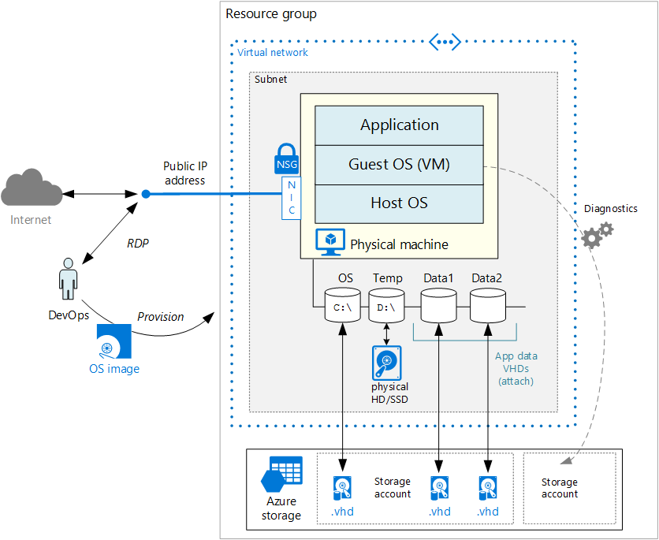

<properties
   pageTitle=" Running a single VM (Windows) | Blueprint | Microsoft Azure"
   description="How to run a single VM on Azure, paying attention to scalability, resiliency, manageability, and security."
   services=""
   documentationCenter="na"
   authors="mikewasson"
   manager="roshar"
   editor=""
   tags=""/>

<tags
   ms.service="guidance"
   ms.devlang="na"
   ms.topic="article"
   ms.tgt_pltfrm="na"
   ms.workload="na"
   ms.date="04/19/2016"
   ms.author="mikewasson"/>

# Running a Single Windows VM on Azure

This article outlines a set of proven practices for running a single Windows VM on Azure, paying attention to scalability, availability, manageability, and security.  

> [AZURE.WARNING] There is no up-time SLA for single VMs on Azure. Use this configuration for development and test, but not as a production deployment.

Azure has two different deployment models: [Resource Manager][resource-manager-overview] and classic. This article uses Resource Manager, which Microsoft recommends for new deployments.

Provisioning a single VM in Azure involves more moving parts than the core VM itself. There are compute, networking, and storage elements.  



- **Resource group.** Create a [resource group][resource-manager-overview] to hold the resources for this VM. A _resource group_ is a container that holds related resources.

- **VM**. You can provision a VM from a list of published images or from a VHD file that you upload to Azure blob storage.

- **OS disk.** The OS disk is a VHD stored in [Azure storage][azure-storage]. That means it persists even if the host machine goes down.

- **Temporary disk.** The VM is created with a temporary disk (the `D:` drive on Windows). This disk is stored on a physical drive on the host machine. It is _not_ saved in Azure storage, and might go away during reboots and other VM lifecycle events. Use this disk only for temporary data, such as page or swap files.

- **Data disks.** A [data disk][data-disk] is a persistent VHD used for application data. Data disks are stored in Azure storage, like the OS disk.

- **Virtual network (VNet) and subnet.** Every VM in Azure is deployed into a virtual network (VNet), which is further divided into subnets.

- **Public IP address.** A public IP address is needed to communicate with the VM&mdash;for example over remote desktop (RDP).

- **Network interface (NIC)**. The NIC enables the VM to communicate with the virtual network.

- **Network security group (NSG)**. The [NSG][nsg] is used to allow/deny network traffic to the subnet. The default NSG rules disallow all incoming Internet traffic.

    You can associate an NSG with an individual NIC or with a subnet. If you associate it with a subnet, the NSG rules apply to all VMs in that subnet. In this case, there is just one VM in the subnet.

    > [AZURE.NOTE] Microsoft recommends NSGs over Access Control Lists (ACLs).

- **Diagnostics.** Diagnostic logging is crucial for managing and troubleshooting the VM.

## VM recommendations

- When moving an existing workload to Azure, choose the [VM size][virtual-machine-sizes] that most closely matches your on-premise servers. We recommend the DS- and GS-series, which can use Premium Storage for I/O intensive workloads.

- When you provision the VM and other resources, you must specify a location. Generally, choose a location closest to your internal users or customers. However, not all VM sizes may be available in all locations. For details, see [Services by region][services-by-region]. To list the VM sizes available in a given location, run the following Azure CLI command:

    ```
    azure vm sizes --location <location>
    ```

- For information about choosing a published VM image, see [Navigate and select Azure virtual machine images][select-vm-image].

## Disk and storage recommendations

- For best disk I/O performance, we recommend [Premium Storage][premium-storage], which stores data on solid state drives (SSDs). Cost is based on the size of the provisioned disk. IOPS and throughput (i.e., data transfer rate) also depend on disk size, so when you provision a disk, consider all three factors (capacity, IOPS, and throughput). 

- Add one or more data disks. When you create a new VHD, it is unformatted. Log into the VM to format the disk.

- If you have a large number of data disks, be aware of the total I/O limits of the storage account. For more information, see [Virtual Machine Disk Limits][vm-disk-limits].

- For best performance, create a separate storage account to hold diagnostic logs. A standard locally redundant storage (LRS) account is sufficient for diagnostic logs.

- When possible, install applications on a data disk, not the OS disk. However, some legacy applications might need to install components on the C: drive. In that case, you can [resize the OS disk][resize-os-disk] using PowerShell.

## Network recommendations

- For a single VM, create one VNet with one subnet. Also create an NSG and public IP address.

- The public IP address can be dynamic or static. The default is dynamic.

    - Reserve a [static IP address][static-ip] if you need a fixed IP address that won't change &mdash; for example, if you need to create an A record in DNS, or need the IP address to be whitelisted.

    - You can also create a fully qualified domain name (FQDN) for the IP address. You can then register a [CNAME record][cname-record] in DNS that points to the FQDN. For more information, see [Create a Fully Qualified Domain Name in the Azure portal][fqdn].

- Allocate a NIC and associate it with the IP address, subnet, and NSG.

- The default NSG rules do not allow RDP. To enable RDP, add a rule to the NSG that allows inbound traffic to TCP port 3389.

## Scalability

You can scale a VM up or down by changing the VM size. In some cases, you will need to deallocate the VM first. This can happen if the new size is not available on the hardware cluster that is hosting the VM. For more information, see [Resize virtual machines].

To resize a VM:

1. Run the following CLI command. This command lists the VM sizes that are available on the hardware cluster where the VM is hosted.

    ```text
    azure vm sizes -g <resource-group> --vm-name <vm-name>
    ```

2. If the desired size is listed, run the following command to resize the VM.

    ```text
    azure vm set -g <resource-group> --vm-size <new-vm-size>
        --boot-diagnostics-storage-uri <storage-account-uri> <vm-name>
    ```

    The VM will restart during this process. After the restart, your existing OS and data disks will be remapped, but anything on the temporary disk will be lost.

    The `--boot-diagnostics-storage-uri` option enables [boot diagnostics][boot-diagnostics] to log any errors related to startup.

3. Otherwise, if the desired size is not listed, run the following commands to deallocate the VM, resize it, and then restart the VM.

    ```text
    azure vm deallocate -g <resource-group> <vm-name>
    azure vm set -g <resource-group> --vm-size <new-vm-size>
        --boot-diagnostics-storage-uri <storage-account-uri> <vm-name>
    azure vm start -g <resource-group> <vm-name>
    ```

   > [AZURE.WARNING] Deallocating the VM also releases any dynamic IP addresses assigned to the VM. The OS and data disks are not affected.

## Availability

- There is no availability SLA for single VMs. To achieve an SLA around availability, you must deploy multiple VMs into an availability set.

- Your VM may be affected by [planned maintenance][planned-maintenance] or [unplanned maintenance][manage-vm-availability]. You can use [VM reboot logs][reboot-logs] to determine whether a VM reboot was caused by planned maintenance.

- Do not put a single VM into an availability set. Virtual machines in this configuration do not qualify for a SLA guarantee and will face downtime during Azure planned maintenance events. (You will get an email notification before a planned maintenance event.)

- VHDs are backed by [Azure Storage][azure-storage], which is replicated for durability and availability.

- To protect against accidental data loss during normal operations (e.g., because of user error), you should also implement point-in-time backups, using [blob snapshots][blob-snapshot] or another tool.

## Manageability

- **Resource groups.** Put tightly coupled resources that share the same life cycle into a same [resource group][resource-manager-overview]. Resource groups allow you to deploy and monitor resources as a group, and roll up billing costs by resource group. You can also delete resources as a set, which is very useful for test deployments. (Deploy a set of resources to a test resource group, and then delete it when you're done.)

    - Give resources meaningful names. That makes it easier to locate a specific resource and understand its role. See [Recommended Naming Conventions for Azure Resources][naming conventions].

- **VM diagnostics.** Run the following CLI command to enable diagnostics:

    ```text
    azure vm enable-diag <resource-group> <vm-name>
    ```

    This command enables basic health metrics, diagnostics infrastructure logs, and boot diagnostics. For more information, see [Enable monitoring and diagnostics][enable-monitoring].

    Use the [Azure Log Collection][log-collector] extension to collect Azure platform logs and upload them to Azure storage.

- **Stopping a VM.** Azure makes a distinction between "Stopped" and "De-allocated" states. You are charged when the VM status is "Stopped". You are not charged when the VM de-allocated.

    Use the following CLI command to de-allocate a VM:

    ```text
    azure vm deallocate <resource-group> <vm-name>
    ```

    Note: The **Stop** button in the Azure portal also deallocates the VM. However, if you shut down from inside Windows (via RDP), the VM is stopped but _not_ de-allocated, so you will still be charged.

- **Deleting a VM.** If you delete a VM, the VHDs are not deleted. That means you can safely delete the VM without losing data. However, you will still be charged for storage. To delete the VHD, delete the file from [blob storage][blob-storage].


## Security

- Use [Azure Security Center][security-center] to get a central view of the security state of your Azure resources. Security Center monitors potential security issues such as system updates, antimalware, and endpoint ACLs, and provides a comprehensive picture of the security health of your deployment. **Note:** At the time of writing, Security Center is still in preview.

    - Security Center is configured per Azure subscription. Enable security data collection as described in [Use Security Center].
    - Once data collection is enabled, Security Center automatically scans any VMs created under that subscription.

- **Patch management.** If enabled, Security Center checks whether security and critical updates are missing. Use [Group Policy settings][group-policy] on the VM to enable automatic system updates.

- **Antimalware.** If enabled, Security Center checks whether antimalware software is installed. You can also use Security Center to install antimalware software from inside the Azure Portal.

- Use [role-based access control][rbac] (RBAC) to define which members of your DevOps team can manage the Azure resources (VM, network, etc) that you deploy.

- Use [Azure Disk Encryption][disk-encryption] to encrypt the OS and data disks. **Note:** At the time of writing, Azure Disk Encryption is still in preview.

## Troubleshooting

- To reset the local admin password, run the `vm reset-access` Azure CLI command.

    ```text
    azure vm reset-access -u <user> -p <new-password> <resource-group> <vm-name>
    ```

- If your VM gets into a non-bootable state, use [Boot Diagnostics][boot-diagnostics] to diagnose boot failures.

- Look at [audit logs][audit-logs] to see provisioning actions and other VM events.

## Example deployment script

The following Windows batch script executes the [Azure CLI][azure-cli] commands to deploy a single VM instance and the related network and storage resources, as shown in the previous diagram.

The script uses the naming conventions described in [Recommended Naming Conventions for Azure Resources][naming conventions].

```bat
ECHO OFF
SETLOCAL

:::::::::::::::::::::::::::::::::::::::::::::::::::::::::::::::::::::::::::::::
:: Set up variables for deploying resources to Azure.
:: Change these variables for your own deployment.

:: The APP_NAME variable must not exceed 4 characters in size.
:: If it does the 15 character size limitation of the VM name may be exceeded.

SET APP_NAME=app1
SET LOCATION=eastus2
SET ENVIRONMENT=dev
SET USERNAME=testuser


:: For Windows, use the following command to get the list of URNs:
:: azure vm image list %LOCATION% MicrosoftWindowsServer WindowsServer 2012-R2-Datacenter
SET WINDOWS_BASE_IMAGE=MicrosoftWindowsServer:WindowsServer:2012-R2-Datacenter:4.0.20160126

:: For a list of VM sizes see:
::   https://azure.microsoft.com/documentation/articles/virtual-machines-size-specs/
:: To see the VM sizes available in a region:
:: 	azure vm sizes --location <location>
SET VM_SIZE=Standard_DS1

:::::::::::::::::::::::::::::::::::::::::::::::::::::::::::::::::::::::::::::::

IF "%2"=="" (
    ECHO Usage: %0 subscription-id admin-password
    EXIT /B
    )

:: Explicitly set the subscription to avoid confusion as to which subscription
:: is active/default
SET SUBSCRIPTION=%1
SET PASSWORD=%2

:: Set up the names of things using recommended conventions
SET RESOURCE_GROUP=%APP_NAME%-%ENVIRONMENT%-rg
SET VM_NAME=%APP_NAME%-vm0

SET IP_NAME=%APP_NAME%-pip
SET NIC_NAME=%VM_NAME%-0nic
SET NSG_NAME=%APP_NAME%-nsg
SET SUBNET_NAME=%APP_NAME%-subnet
SET VNET_NAME=%APP_NAME%-vnet
SET VHD_STORAGE=%VM_NAME:-=%st0
SET DIAGNOSTICS_STORAGE=%VM_NAME:-=%diag

:: Set up the postfix variables attached to most CLI commands
SET POSTFIX=--resource-group %RESOURCE_GROUP% --subscription %SUBSCRIPTION%

CALL azure config mode arm

::::::::::::::::::::::::::::::::::::::::::::::::::::::::::::::::::::::::::
:: Create resources

:: Create the enclosing resource group
CALL azure group create --name %RESOURCE_GROUP% --location %LOCATION% ^
  --subscription %SUBSCRIPTION%

:: Create the VNet
CALL azure network vnet create --address-prefixes 172.17.0.0/16 ^
  --name %VNET_NAME% --location %LOCATION% %POSTFIX%

:: Create the network security group
CALL azure network nsg create --name %NSG_NAME% --location %LOCATION% %POSTFIX%

:: Create the subnet
CALL azure network vnet subnet create --vnet-name %VNET_NAME% --address-prefix ^
  172.17.0.0/24 --name %SUBNET_NAME% --network-security-group-name %NSG_NAME% ^
  %POSTFIX%

:: Create the public IP address (dynamic)
CALL azure network public-ip create --name %IP_NAME% --location %LOCATION% %POSTFIX%

:: Create the NIC
CALL azure network nic create --public-ip-name %IP_NAME% --subnet-name ^
  %SUBNET_NAME% --subnet-vnet-name %VNET_NAME%  --name %NIC_NAME% --location ^
  %LOCATION% %POSTFIX%

:: Create the storage account for the OS VHD
CALL azure storage account create --type PLRS --location %LOCATION% %POSTFIX% ^
  %VHD_STORAGE%

:: Create the storage account for diagnostics logs
CALL azure storage account create --type LRS --location %LOCATION% %POSTFIX% ^
  %DIAGNOSTICS_STORAGE%

:: Create the VM
CALL azure vm create --name %VM_NAME% --os-type Windows --image-urn ^
  %WINDOWS_BASE_IMAGE% --vm-size %VM_SIZE%   --vnet-subnet-name %SUBNET_NAME% ^
  --vnet-name %VNET_NAME% --nic-name %NIC_NAME% --storage-account-name ^
  %VHD_STORAGE% --os-disk-vhd "%VM_NAME%-osdisk.vhd" --admin-username ^
  "%USERNAME%" --admin-password "%PASSWORD%" --boot-diagnostics-storage-uri ^
  "https://%DIAGNOSTICS_STORAGE%.blob.core.windows.net/" --location %LOCATION% ^
  %POSTFIX%

:: Attach a data disk
CALL azure vm disk attach-new --vm-name %VM_NAME% --size-in-gb 128 --vhd-name ^
  data1.vhd --storage-account-name %VHD_STORAGE% %POSTFIX%

:: Allow RDP
CALL azure network nsg rule create --nsg-name %NSG_NAME% --direction Inbound ^
  --protocol Tcp --destination-port-range 3389 --source-port-range * ^
  --priority 100 --access Allow RDPAllow %POSTFIX%
```

## Next steps

In order for the [SLA for Virtual Machines][vm-sla] to apply, you must deploy two or more instances in an Availability Set. For more information, see [Running multiple Windows VM instances on Azure (single tier, Internet-facing)][multi-vm]

<!-- links -->

[arm-templates]: ../virtual-machines/virtual-machines-windows-cli-deploy-templates.md
[audit-logs]: https://azure.microsoft.com/en-us/blog/analyze-azure-audit-logs-in-powerbi-more/
[azure-cli]: ../virtual-machines-command-line-tools.md
[azure-storage]: ../storage/storage-introduction.md
[blob-snapshot]: ../storage/storage-blob-snapshots.md
[blob-storage]: ../storage/storage-introduction.md
[boot-diagnostics]: https://azure.microsoft.com/en-us/blog/boot-diagnostics-for-virtual-machines-v2/
[cname-record]: https://en.wikipedia.org/wiki/CNAME_record
[data-disk]: ../virtual-machines/virtual-machines-windows-about-disks-vhds.md
[disk-encryption]: ../azure-security-disk-encryption.md
[enable-monitoring]: ../azure-portal/insights-how-to-use-diagnostics.md
[fqdn]: ../virtual-machines/virtual-machines-windows-portal-create-fqdn.md
[group-policy]: https://technet.microsoft.com/en-us/library/dn595129.aspx
[log-collector]: https://azure.microsoft.com/en-us/blog/simplifying-virtual-machine-troubleshooting-using-azure-log-collector/
[manage-vm-availability]: ../virtual-machines/virtual-machines-windows-manage-availability.md
[multi-vm]: guidance-compute-multi-vm.md
[naming conventions]: guidance-naming-conventions.md
[nsg]: ../virtual-network/virtual-networks-nsg.md
[planned-maintenance]: ../virtual-machines/virtual-machines-windows-planned-maintenance.md
[premium-storage]: ../storage/storage-premium-storage.md
[rbac]: ../active-directory/role-based-access-control-configure.md
[reboot-logs]: https://azure.microsoft.com/en-us/blog/viewing-vm-reboot-logs/
[resize-os-disk]: ../virtual-machines/virtual-machines-windows-expand-os-disk.md
[Resize-VHD]: https://technet.microsoft.com/en-us/library/hh848535.aspx
[Resize virtual machines]: https://azure.microsoft.com/en-us/blog/resize-virtual-machines/
[resource-manager-overview]: ../resource-group-overview.md
[security-center]: https://azure.microsoft.com/en-us/services/security-center/
[select-vm-image]: ../virtual-machines/virtual-machines-windows-cli-ps-findimage.md
[services-by-region]: https://azure.microsoft.com/en-us/regions/#services
[static-ip]: ../virtual-network/virtual-networks-reserved-public-ip.md
[storage-price]: https://azure.microsoft.com/pricing/details/storage/
[Use Security Center]: ../security-center/security-center-get-started.md#use-security-center
[virtual-machine-sizes]: ../virtual-machines/virtual-machines-windows-sizes.md
[vm-disk-limits]: ../azure-subscription-service-limits.md#virtual-machine-disk-limits
[vm-sla]: https://azure.microsoft.com/en-us/support/legal/sla/virtual-machines/v1_0/
