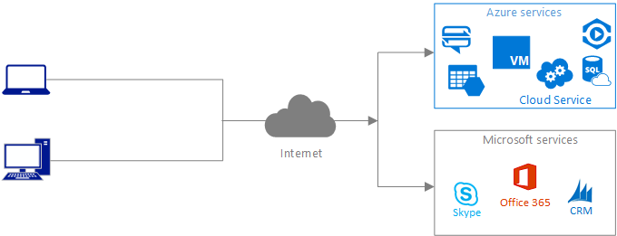
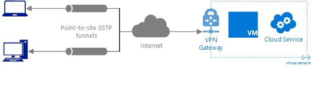
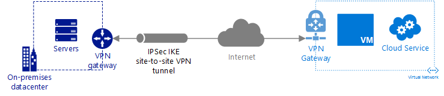
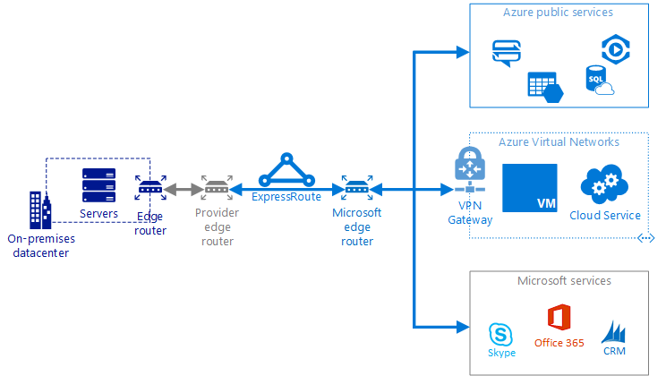

# Connecting your on-premises network to Azure
Microsoft provides several types of cloud services. While you can connect to all the services over the public Internet, you can also connect to some of the services using a virtual private network (VPN) tunnel over the Internet or over a direct, private connection to Microsoft. This article helps you determine which connectivity option will best meet your needs based on the types of Microsoft cloud services that you consume. Most organizations utilize multiple connection types described below.

## Connecting over the public Internet
This connection type provides access to Microsoft cloud services directly over the Internet, as shown below.

This connection is typically the first type used for connecting to Microsoft cloud services. The table below lists pros and cons of this connection type.

| **Benefits** | **Considerations** |
| --- | --- |
| Requires no modification to your on-premises network as long as all client devices have unlimited access to all IP addresses and ports on the Internet. |Though traffic is often encrypted using HTTPS, it can be intercepted in transit since it traverses the public Internet. |
| Can connect to all Microsoft cloud services exposed to the public Internet. |Unpredictable latency because the connection traverses the Internet. |
| Uses your existing Internet connection. | |
| Doesn't require management of any connectivity devices. | |

This connection has no connectivity or bandwidth costs since you use your existing Internet connection.

## Connecting with a point-to-site connection
This connection type provides access to some Microsoft cloud services through a Secure Socket Tunneling Protocol (SSTP) tunnel over the Internet, as shown below.

The connection is made over your existing Internet connection, but requires use of an Azure VPN Gateway. The table below lists pros and cons of this connection type.

| **Benefits** | **Considerations** |
| --- | --- |
| Requires no modification to your on-premises network as long as all client devices have unlimited access to all IP addresses and ports on the Internet. |Though traffic is encrypted using IPSec, it can be intercepted in transit since it traverses the public Internet. |
| Uses your existing Internet connection. |Unpredictable latency because the connection traverses the Internet. |
| Throughput up to 200 Mb/s per gateway. |Requires creation and management of separate connections between each device on your on-premises network and each gateway each device needs to connect to. |
| Can be used to connect to Azure services that can be connected to an Azure Virtual Networks (VNet) such as Azure Virtual Machines and Azure Cloud Services. |Requires minimal ongoing administration of an Azure VPN Gateway. |
| Cannot be used to connect to Microsoft Office 365 or Dynamics CRM Online. | |
| Cannot be used to connect to Azure services that cannot be connected to a VNet. | |

Learn more about the [VPN Gateway](../vpn-gateway/vpn-gateway-about-vpngateways.md) service, its [pricing](https://azure.microsoft.com/pricing/details/vpn-gateway), and outbound data transfer [pricing](https://azure.microsoft.com/pricing/details/data-transfers).

## Connecting with a site-to-site connection
This connection type provides access to some Microsoft cloud services through an IPSec tunnel over the Internet, as shown below.

The connection is made over your existing Internet connection, but requires use of an Azure VPN Gateway with its associated pricing and outbound data transfer pricing. The table below lists pros and cons of this connection type.

| **Benefits** | **Considerations** |
| --- | --- |
| All devices on your on-premises network can communicate with Azure services connected to a VNet so there’s no need to configure individual connections for each device. |Though traffic is encrypted using IPSec, it can be intercepted in transit since it traverses the public Internet. |
| Uses your existing Internet connection. |Unpredictable latency because the connection traverses the Internet. |
| Can be used to connect to Azure services that can be connected to a VNet such as Virtual Machines and Cloud Services. |Must configure and manage a validated VPN device* on-premises. |
| Throughput up to 200 Mb/s per gateway. |Requires minimal ongoing administration of an Azure VPN Gateway. |
| Can force outbound traffic initiated from cloud virtual machines through the on-premises network for inspection and logging using user-defined routes or the Border Gateway Protocol (BGP)**. |Cannot be used to connect to Microsoft Office 365 or Dynamics CRM Online. |
| Cannot be used to connect to Azure services that cannot be connected to a VNet. | |
| If you use services that initiate connections back to on-premises devices and your security policies require it, you may need a firewall between the on-premises network and Azure. | |

* *View a list of [validated VPN devices](../vpn-gateway/vpn-gateway-about-vpn-devices.md#devicetable).
* **Learn more about using [user-defined routes](../vpn-gateway/vpn-gateway-forced-tunneling-rm.md) or [BGP](../vpn-gateway/vpn-gateway-bgp-overview.md) to force routing from Azure VNets to an on-premises device.

## Connecting with a dedicated private connection
This connection type provides access to all Microsoft cloud services over a dedicated private connection to Microsoft that does not traverse the Internet, as shown below.

The connection requires use of the ExpressRoute service and a connection to a connectivity provider. The table below lists pros and cons of this connection type.

| **Benefits** | **Considerations** |
| --- | --- |
| Traffic cannot be intercepted in transit over the public Internet since a dedicated connection through a service provider is used. |Requires on-premises router management. |
| Bandwidth up to 10 Gb/s per ExpressRoute circuit and throughput up to 2 Gb/s to each gateway. |Requires a dedicated connection to a connectivity provider. |
| Predictable latency because it’s a dedicated connection to Microsoft that does not traverse the Internet. |May require minimal ongoing administration of one or more Azure VPN Gateways (if connecting the circuit to VNets). |
| Does not require encrypted communication, though you can encrypt the traffic, if desired. |If you're using cloud services that initiate connections back to on-premises devices, you may need a firewall between the on-premises network and Azure. |
| Can directly connect to all Microsoft cloud services, with a few exceptions*. |Requires network address translation (NAT) of on-premises IP addresses entering the Microsoft data centers for services that can't be connected to a VNet.** |
| Can force outbound traffic initiated from cloud virtual machines through the on-premises network for inspection and logging using BGP. | |

* *View a [list of services](../expressroute/expressroute-faqs.md#supported-services) that cannot be used with ExpressRoute. Your Azure subscription must be approved to connect to Office 365.  See the [Azure ExpressRoute for Office 365](https://support.office.com/article/Azure-ExpressRoute-for-Office-365-6d2534a2-c19c-4a99-be5e-33a0cee5d3bd?ui=en-US&rs=en-US&ad=US&fromAR=1) article for details.
* **Learn more about ExpressRoute [NAT](../expressroute/expressroute-nat.md) requirements.

Learn more about [ExpressRoute](../expressroute/expressroute-introduction.md), its associated [pricing](https://azure.microsoft.com/pricing/details/expressroute), and [connectivity providers](../expressroute/expressroute-locations.md#locations).

## Additional considerations
* Several of the options above have various maximum limits they can support for VNet connections, gateway connections, and other criteria. It’s recommended that you review the Azure [networking limits](../azure-subscription-service-limits.md#networking-limits) to understand if any of them impact the connectivity types you choose to use.
* If you plan to connect a gateway from a site-to-site VPN connection to the same VNet as an ExpressRoute gateway, you should familiarize yourself with important constraints first. See the [Configure ExpressRoute and Site-to-Site coexisting connections](../expressroute/expressroute-howto-coexist-resource-manager.md#limits-and-limitations) article for more details.

## Next steps
The resources below explain how to implement the connection types covered in this article.

* [Implement a point-to-site connection](../vpn-gateway/vpn-gateway-howto-point-to-site-rm-ps.md)
* [Implement a site-to-site connection](guidance-hybrid-network-vpn.md)
* [Implement a dedicated private connection](guidance-hybrid-network-expressroute.md)
* [Implement a dedicated private connection with a site-to-site connection for high availability](guidance-hybrid-network-expressroute-vpn-failover.md)
