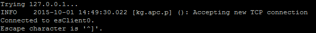
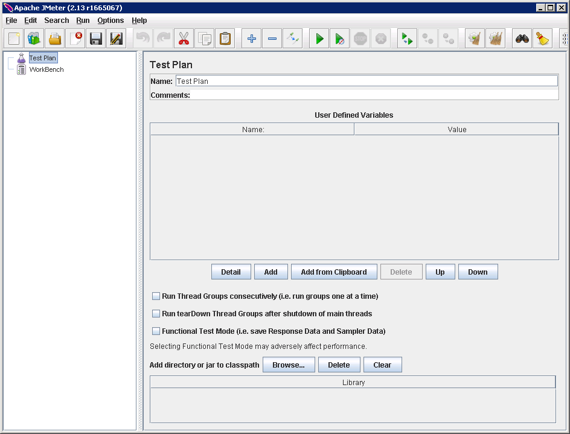
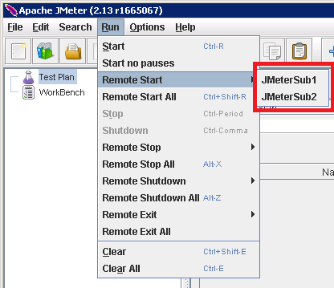
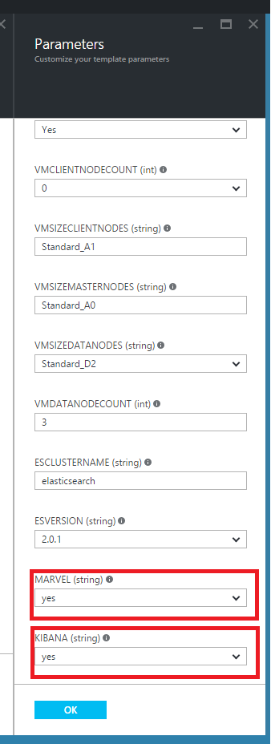
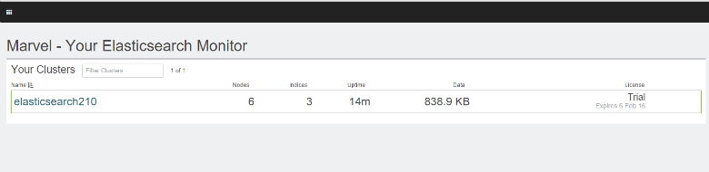
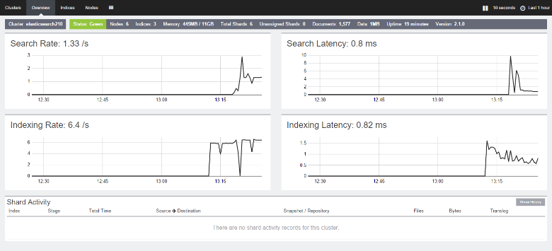

<properties
   pageTitle="Creating a performance testing environment for Elasticsearch | Microsoft Azure"
   description="How to set up an environment for testing the performance of an Elasticsearch cluster."
   services=""
   documentationCenter="na"
   authors="dragon119"
   manager="bennage"
   editor=""
   tags=""/>

<tags
   ms.service="guidance"
   ms.devlang="na"
   ms.topic="article"
   ms.tgt_pltfrm="na"
   ms.workload="na"
   ms.date="05/18/2016"
   ms.author="masashin"/>
   
# Creating a performance testing environment for Elasticsearch on Azure

[AZURE.INCLUDE [pnp-header](../../includes/guidance-pnp-header-include.md)]

This article is [part of a series](guidance-elasticsearch.md). 

This document describes how to set up an environment for testing the performance of an Elasticsearch 
cluster. This configuration was used to test the performance of data ingestion and query workloads, 
as described in [Tuning Data Ingestion Performance for Elasticsearch on Azure][].

The performance testing process used [Apache JMeter](http://jmeter.apache.org/), with the 
[Standard Set](http://jmeter-plugins.org/wiki/StandardSet/) of plugins installed in a master/subordinate 
configuration using a set of dedicated VMs (not part of the Elasticsearch cluster) specifically configured 
for the purpose. 

The [PerfMon Server Agent](http://jmeter-plugins.org/wiki/PerfMonAgent/) was installed on each 
Elasticsearch node. The following sections provide instructions for recreating the test environment to 
enable you to conduct your own performance testing with JMeter. These instructions assume that you have 
already created an Elasticsearch cluster with nodes connected using an Azure virtual network. 

Note that the test environment also runs as a set of Azure VMs managed by using a single Azure 
resource group.

[Marvel](https://www.elastic.co/products/marvel) was also installed and configured to enable the 
internal aspects of the Elasticsearch cluster to be monitored and analyzed more easily; 
if the JMeter statistics showed a peak or trough in performance, information available through Marvel 
can be invaluable to help determine the cause of the fluctuations.

The following image shows the structure of the entire system. 


Note the following points:

- The JMeter Master VM runs Windows Server to provide the GUI environment for the JMeter console. 
The JMeter Master VM provides the GUI (the *jmeter* application) to enable a tester to create tests, 
run tests, and visualize the results. This VM coordinates with the JMeter Server VMs which actually 
send the requests that constitute the tests.

- The JMeter Subordinate VMs run Ubuntu Server (Linux); there is no GUI requirement for these VMs. 
The JMeter Server VMs run the JMeter Server software (the *jmeter-server* application) to send 
requests to the Elasticsearch cluster.

- Dedicated client nodes were not used, although dedicated master nodes were.

- The number of data nodes in the cluster can vary, depending on the scenario being tested.

- All nodes in the Elasticsearch cluster run Marvel to observe performance at runtime, and the 
JMeter Server Agent to collect monitoring data for later analysis.

- When testing Elasticsearch 2.0.0 and later, one of the data nodes also runs Kibana; this is 
required by the version of Marvel that runs on Elasticsearch 2.0.0 and later.

## Creating an Azure Resource Group for the Virtual Machines

The JMeter Master needs to be able to connect directly to each of the nodes in the Elasticsearch cluster 
to gather performance data. If the JMeter VNet is distinct from the Elasticsearch cluster VNet, then this
entails configuring each Elasticsearch node with a public IP address. If this is a problem with your 
Elasticsearch configuration, then consider implementing the JMeter VMs in the same VNet as the 
Elasticsearch cluster by using the same resource group, in which case you can omit this first procedure.

First, [create a resource group](../resource-group-template-deploy-portal.md). 
This document assumes that your resource group is named *JMeterPerformanceTest*. If you wish to run the 
JMeter VMs in the same VNet as the Elasticsearch cluster, use the same resource group as that cluster 
instead of creating a new one.

## Creating the JMeter Master Virtual Machine

Next [create a Windows VM](../virtual-machines/virtual-machines-windows-hero-tutorial.md) using the 
*Windows Server 2008 R2 SP1* image.  We recommend selecting a VM size with sufficient cores and memory 
to run the performance tests. Ideally this will be a machine with at least 2 cores and 3.5GB of RAM 
(A2 Standard or bigger).

<!-- TODO add info on why disabling diagnostics is positive -->

We recommend that you disable the diagnostics. When creating the VM in the portal, this is done on the 
*Settings* bladein the *Monitoring* section under *Diagnostics*. Leave the other settings at their 
default values.

Verify that the VM and all the associated resources have been created successfully by 
[examining the resource group](../azure-portal/resource-group-portal.md#manage-resource-groups) in the portal. 
The resources listed should consist of a VM, a network security group, and a public IP address all with 
the same name, and network interface and storage account with names based on that of the VM.

## Creating the JMeter Subordinate Virtual Machines

Now [create a Linux VM](../virtual-machines/virtual-machines-linux-quick-create-portal.md) using the 
*Ubuntu Server 14.04 LTS* image.  As with the JMeter Master VM, select a VM size with sufficient cores 
and memory to run the performance tests. Ideally this will be a machine with at least 2 cores, and at 
least 3.5GB of RAM (Standard A2 or bigger).

Again, we recommend that you disable the diagnostics.

You can create as many Subordinate VMs as you wish.

## Installing JMeter Server on the JMeter Subordinate VMs

The JMeter Subordinate VMs are running Linux and by default you cannot connect to them by opening a 
remote desktop connection (RDP). Instead, you can 
[use PuTTY to open a command line window](../virtual-machines/virtual-machines-linux-classic-log-on.md) on each VM.

Once you've connected to one of the Subordinate VMs, we'll use bash to setup JMeter.

First, install the Java Runtime Environment required to run JMeter.

```bash
sudo add-apt-repository ppa:webupd8team/java
sudo apt-get update
sudo apt-get install oracle-java8-installer
```

Now, download the JMeter software packaged as a zip file.

```bash
wget http://apache.mirror.anlx.net/jmeter/binaries/apache-jmeter-2.13.zip
```

Install the unzip command, then use it to expand the JMeter software. The software is copied to a folder 
named **apache-jmeter-2.13**.

```bash
sudo apt-get install unzip
unzip apache-jmeter-2.13.zip
```

Change to the *bin* directory holding the JMeter executables, and make the *jmeter-server* and 
*jmeter* programs executable.

```bash
cd apache-jmeter-2.13/bin
chmod u+x jmeter-server
chmod u+x jmeter
```

Now, we need to edit the file `jmeter.properties` located in the current folder (use the text 
editor with which you are most familiar, such as *vi* or *vim*). Locate the following lines:

```yaml
...
client.rmi.localport=0
...
server.rmi.localport=4000
...
```

Uncomment (remove the leading \## characters) and modify these lines as shown below, then save the 
file and close the editor:

```yaml
...
client.rmi.localport=4441
...
server.rmi.localport=4440
```

Now, run the following commands to open port 4441 to incoming TCP traffic (this is the port you on 
which you have just configured *jmeter-server* to listen):

```bash
sudo iptables -A INPUT -m state --state NEW -m tcp -p tcp --dport 4441 -j ACCEPT
```

Download a zip file containing the standard collection of plugins for JMeter (these plugins provide 
performance monitoring counters) and then unzip the file. Unzipping the file in this location places 
the plugins in the correct folder.

If you are prompted to replace the LICENSE file, type A (for all):

```bash
wget http://jmeter-plugins.org/downloads/file/JMeterPlugins-Standard-1.3.0.zip
unzip JMeterPlugins-Standard-1.3.0.zip
```

Use `nohup` to launch the JMeter Server in the background. It should respond by displaying a 
process ID and a message indicating that it has created a remote object and is ready to start 
receiving commands.  Run the following command in the ~/apache-jmeter-2.13/bin directory. 

```bash
nohup jmeter-server &
```

> [AZURE.NOTE] If the VM is shutdown then the JMeter Server program is terminated. You will need to 
> connect to the VM and restart it again manually. Alternatively, you can configure the system to run 
> the *jmeter-server* command automatically on startup by adding the following commands to the 
> `/etc/rc.local` file (before the *exit 0* command):

```bash
sudo -u <username> bash << eoc
cd /home/<username>/apache-jmeter-2.13/bin
nohup ./jmeter-server &
eoc
```

Replace `<username>` with your login name.

You may find it useful to keep the terminal window open so that you can monitor the progress of the 
JMeter Server while testing is in progress.

You will need to repeat these steps for each JMeter Subordinate VM.

## Installing the JMeter Server Agent on the Elasticsearch Nodes

This procedure assumes that you have login access to the Elasticsearch nodes. If you have created the
cluster by using the ARM template, you can connect to each node through the Jump Box VM, as illustrated 
in the [Azure Production Topology](guidance-elasticsearch-running-on-azure.md#elasticsearch-topologies) section. You can connect to the Jump Box 
by using PuTTY as well. 

From there, you can use the *ssh* command to log in to each of the nodes in the Elasticsearch cluster.

Log in to one of the Elasticsearch nodes as an administrator.  At the bash command prompt, enter the 
following commands to create a folder for holding the JMeter Server Agent and move to that folder:

```bash
mkdir server-agent
cd server-agent
```

Run the following commands to install the *unzip* command (if it is not already installed), 
download the JMeter Server Agent software, and unzip it:

```bash
sudo apt-get install unzip
wget http://jmeter-plugins.org/downloads/file/ServerAgent-2.2.1.zip
unzip ServerAgent-2.2.1.zip
```
 
Run the following command to configure the firewall and enable TCP traffic to pass through 
port 4444 (this is the port used by the JMeter Server Agent):

```bash
sudo iptables -A INPUT -m state --state NEW -m tcp -p tcp --dport 4444 -j ACCEPT
```

Run the following command to start the JMeter Server Agent in the background:

```bash
nohup ./startAgent.sh &
```

The JMeter Server Agent should respond with messages indicating that it has started and is 
listening on port 4444.  Press Enter to obtain a command prompt, and then run the following command. 
Replace `<nodename>` with the name of your node. If you are not sure of the name of your node, you can 
find it by running the `hostname` command:

```bash
telnet <nodename> 4444
```

This command opens a telnet connection to port 4444 on your local machine. You can use this 
connection to verify that the JMeter Server Agent is running correctly.

If the JMeter Server Agent is not running, you will receive the response 

`*telnet: Unable to connect to remote host: Connection refused*.`

If the JMeter Server Agent is running and port 4444 has been configured correctly, you should see 
the following response:



> [AZURE.NOTE] The telnet session does not provide any sort of prompt once it has connected.

In the telnet session, type the following command:

``` 
test
```

If the JMeter Server Agent is configured and listening correctly, it should indicate that it 
received the command and respond with the message *Yep*.

> [AZURE.NOTE] You can type in other commands to obtain performance monitoring data. For example, 
> the command `metric-single:cpu:idle` will give you the current proportion of the time that the CPU 
> is idle (this is a snapshot). For a complete list of commands, visit the 
> [PerfMon Server Agent](http://jmeter-plugins.org/wiki/PerfMonAgent/) page.

In the telnet session, type the following command to quit the session and return to the bash 
command prompt:

``` 
exit
```

> [AZURE.NOTE] As with the JMeter Subordinate VMs, if you log out, or if this machine is shutdown 
> and restarted then the JMeter Server Agent will need to be restarted manually by using the 
> `startAgent.sh` command. If you want the JMeter Server Agent to start automatically, add the 
> following command to the end of the `/etc/rc.local` file, before the *exit 0* command. 
> Replace `<username>` with your login name:

```bash
sudo -u <username> bash << eoc
cd /home/<username>/server-agent
nohup ./startAgent.sh &
eoc
```

Replace `<username>` with your login name.

You can now either repeat this entire process for every other node in the Elasticsearch cluster, or 
you can use the `scp` command to copy the server-agent folder and contents to every 
other node and use the `ssh` command start the JMeter Server Agent as shown below. 
Replace `<username>` with your username, and `<nodename>` with the name of the node to which you 
wish to copy and run the software (you may be asked to provide your password as you run each command):

```bash
scp -r \~/server-agent <username>@<nodename>:\~
ssh <nodename> sudo iptables -A INPUT -m state --state NEW -m tcp -p tcp --dport 4444 -j ACCEPT
ssh <nodename> -n -f 'nohup \~/server-agent/startAgent.sh'
```

## Installing and Configuring JMeter on the JMeter Master VM

In the Azure portal, click *Resource groups*.  In the *Resource groups* blade, click the resource group 
containing the JMeter Master and Subordinate VMs.  In the *Resource group* blade, click the JMeter Master VM.
In the virtual machine blade, in the toolbar, click *Connect*. Open the RDP file when prompted by the web 
browser. Windows creates a remote desktop connection to your VM.  Enter the username and password for the VM when prompted.

In the VM, using Internet Explorer, move to the [Download Java for Windows](http://www.java.com/en/download/ie_manual.jsp) 
page. Follow the instructions to download and run the Java installer.

In the web browser, navigate to the [Download Apache JMeter](http://jmeter.apache.org/download_jmeter.cgi) 
page and download the zip containing the most recent binary. Save the zip in a convenient location on your VM.

Move to the [Custom JMeter Plugins](http://jmeter-plugins.org/) site and download the Standard Set of plugins. 
Save the zip in the same folder as the JMeter download from the previous step.

In Windows Explorer, move to the folder containing the apache-jmeter-*xx* zip file (where *xx* is the 
current version of JMeter) and then extract the files into the current folder (the zip will create a 
sub-folder called apache-jmeter-*xxx*).

Extract the files in the JMeterPlugins-Standard-*yyy*.zip file (where *yyy* is the current version of 
the plugins) into the apache-jmeter-*xxx* folder. This will add the plugins to the correct folder for 
JMeter (you can safely merge the lib folders, and overwrite the license and readme files if prompted).

Move to the apache-jmeter-*xxx*/bin folder and edit the jmeter.properties file using Notepad.  In the 
`jmeter.properties` file, find the section labelled *Remote hosts and RMI configuration*.  In this 
section of the file, find the following line:

```yaml
remote_hosts=127.0.0.1
```

Change this line and replace the IP address 127.0.0.1 with a comma separated list of IP addresses or 
host names for each of the JMeter Subordinate servers. For example:

```yaml
remote_hosts=JMeterSub1,JMeterSub2
```

Find the following line, then remove the `#` character at the start of this line, and modify the value 
of the client.rmi.localport settings from:

```yaml
#client.rmi.localport=0
```

to:

```yaml
client.rmi.localport=4440
```

Save the file and close Notepad.

In the Windows toolbar, click *Start*, click *Administrative Tools*, and then click 
*Windows Firewall with Advanced Security*.  In the *Windows Firewall with Advanced Security* window, 
in the left-hand pane, right-click *Inbound Rules*, and then click *New Rule*.

In the *New Inbound Rule* *Wizard*, on the *Rule Type* page, select *Port* and then click *Next*.  On 
the *Protocols and Ports* page, select *TCP*, select *Specific local ports*, in the text box type 
`4440-4444`, and then click *Next*.  On the *Action* page, select *Allow the connection* and then 
click *Next*.  On the *Profile* page, leave all options checked and then click *Next*.  On the *Name* 
page, in the *Name* text box type *JMeter*, and then click *Finish*.  Close the  
*Windows Firewall with Advanced Security* window.

In Windows Explorer, in the apache-jmeter-*xx*/bin folder, double-click the *jmeter* Windows batch 
file to start the GUI. The user interface should appear:



In the menu bar, click *Run*, click *Remote Start*, and verify that the two JMeter Subordinate 
machines are listed:



You are now ready to commence performance testing.

## Installing and Configuring Marvel

The Elasticsearch Quickstart Template for Azure will install and configure the appropriate version of 
Marvel automatically if you set the MARVEL and KIBANA parameters to true when building the cluster:



If you are adding Marvel to an existing cluster you need to perform the installation manually, and the process is different depending on whether you are using Elasticsearch version 1.7.x or 2.x, as described in the following procedures.

### Installing Marvel with Elasticsearch 1.73 or Earlier

If you are using Elasticsearch 1.7.3 or earlier, perform the following steps *on every node* in the 
cluster:

- Log in to the node and move to the Elasticsearch home directory.  On Linux, the typical home directory
is `/usr/share/elasticsearch`.

-  Run the following command to download and install the Marvel plugin for Elasticsearch:

```bash
sudo bin/plugin -i elasticsearch/marvel/latest
```

- Stop and restart Elasticsearch on the node:

```bash
sudo service elasticsearch restart
```

- To verify that Marvel was installed correctly, open a web browser and move to the 
URL `http://<server>:9200/_plugin/marvel`. Replace `<server>` with the name or IP address of 
any Elasticsearch server in the cluster.  Verify that a page similar to that shown below appears:


### Installing Marvel with Elasticsearch 2.0.0 or Later

If you are using Elasticsearch 2.0.0 or later, perform the following tasks *on every node* in the cluster:

Log in to the node and move to the Elasticsearch home directory (typically `/usr/share/elasticsearch`)  Run 
the following commands to download and install the Marvel plugin for Elasticsearch:

```bash
sudo bin/plugin install license
sudo bin/plugin install marvel-agent
```

Stop and restart Elasticsearch on the node:

```bash
sudo service elasticsearch restart
```

In the following procedure, replace `<kibana-version>` with 4.2.2 if you are using Elasticsearch 2.0.0 
or Elasticsearch 2.0.1, or with 4.3.1 if you are using Elasticsearch 2.1.0 or later.  Replace 
`<marvel-version>` with 2.0.0 if you are using Elasticsearch 2.0.0 or Elasticsearch 2.0.1, or 
with 2.1.0 if you are using Elasticsearch 2.1.0 or later.  Perform the following tasks *on one node* 
in the cluster:

Log in to the node and download the appropriate build of Kibana for your version of Elasticsearch 
from the [Elasticsearch download web site](https://www.elastic.co/downloads/past-releases), then extract
the package:

```bash
wget https://download.elastic.co/kibana/kibana/kibana-<kibana-version>-linux-x64.tar.gz
tar xvzf kibana-<kibana-version>-linux-x64.tar.gz
```

Open port 5601 to accept incoming requests:

```bash
sudo iptables -A INPUT -m state --state NEW -m tcp -p tcp --dport 5601 -j ACCEPT
```

Move to the kibana config folder (`kibana-<kibana-version>-linux-x64/config`), edit the `kibana.yml` 
file, and add the following line. Replace `<server>` with the name or IP address of an Elasticsearch 
server in the cluster:

```yaml
elasticsearch.url: "http://<server>:9200"
```

Move to the kibana bin folder (`kibana-<kibana-version>-linux-x64/bin`), and run the following 
command to integrate the Marvel plugin into Kibana:

```bash
sudo ./kibana plugin --install elasticsearch/marvel/<marvel-version>
```

Start Kibana:

```bash
sudo nohup ./kibana &
```

To verify the Marvel installation, open a web browser and move to the URL 
`http://<server>:5601/app/marvel`. Replace `<server>` with the name or IP address 
of the server running Kibana.

Verify that a page similar to that shown below appears (the name of your cluster will likely 
vary from that shown in the image).



Click the link that corresponds to your cluster (elasticsearch210 in the image above). A page 
similar to that shown below should appear:



[Tuning Data Ingestion Performance for Elasticsearch on Azure]: guidance-elasticsearch-tuning-data-ingestion-performance.md
