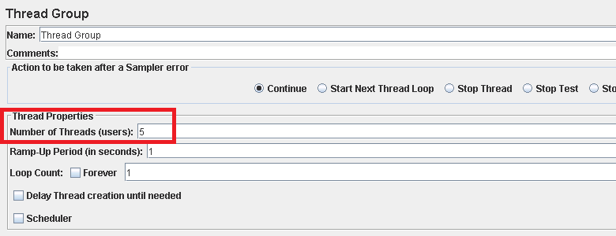
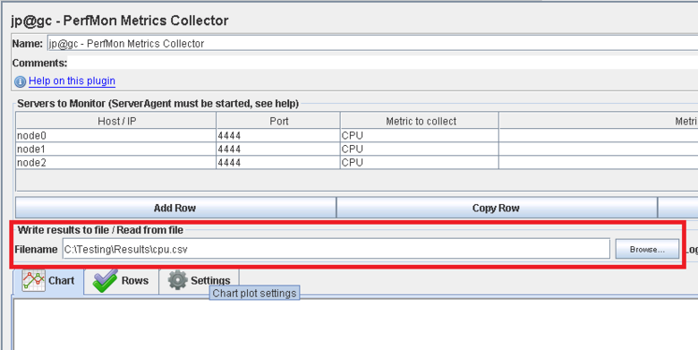
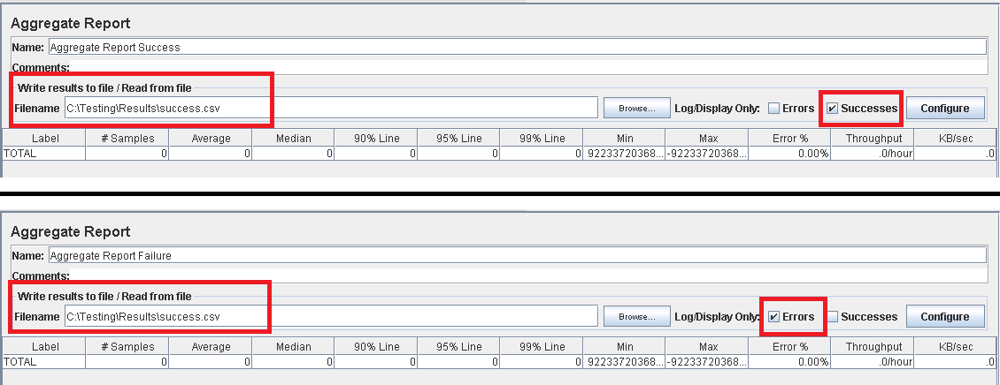
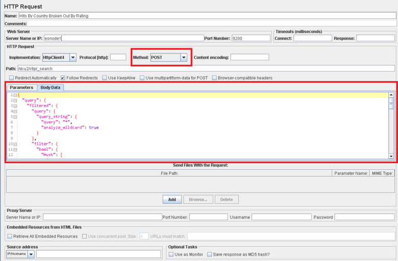

<properties
   pageTitle="Implementing a JMeter test plan for Elasticsearch | Microsoft Azure"
   description="How to run performance tests for Elasticsearch with JMeter."
   services=""
   documentationCenter="na"
   authors="dragon119"
   manager="bennage"
   editor=""
   tags=""/>

<tags
   ms.service="guidance"
   ms.devlang="na"
   ms.topic="article"
   ms.tgt_pltfrm="na"
   ms.workload="na"
   ms.date="07/21/2016"
   ms.author="masashin" />
   
# Implementing a JMeter test plan for Elasticsearch

[AZURE.INCLUDE [pnp-header](../../includes/guidance-pnp-header-include.md)]

This article is [part of a series](guidance-elasticsearch.md). 

The performance tests conducted against Elasticsearch were implemented by using JMeter test plans 
together with Java code incorporated as a JUnit test for performing tasks such as uploading data into 
the cluster. The test plans and JUnit code are described in [Tuning Data Ingestion Performance for Elasticsearch on Azure][], and 
[Tuning Data Aggregation and Query Performance for Elasticsearch on Azure][].

The purpose of this document is to summarize the key experience gained from constructing and running 
these test plans. The [JMeter Best Practices](http://jmeter.apache.org/usermanual/best-practices.html) 
page on the Apache JMeter website contains more generalized advice on using JMeter effectively.

## Implementing a JMeter Test Plan

The following list summarizes the items you should consider when creating a JMeter test plan:

- Create a separate thread group for each test you wish to perform. A test can comprise multiple steps, 
comprising logic controllers, timers, pre- and post-processors, samplers, and listeners.

- Avoid creating too many threads in a thread group. An excessive number of threads will cause 
JMeter to fail with "Out of memory" exceptions. It is better to add more JMeter subordinate servers 
each running a smaller number of threads than attempt to run a large number of threads on a single 
JMeter server.



- To assess the performance of the cluster, incorporate the 
[Perfmon Metrics Collector](http://jmeter-plugins.org/wiki/PerfMon/) plugin into the test plan; 
this is a JMeter listener that is available as one of the standard JMeter standard plugins. 
Save the raw performance data to a set of files in CSV format and process them when the test is complete. 
This is more efficient and imposes less strain on JMeter than attempting to process the data as it is 
captured. 

You can use a tool such Excel to import the data and generate a range of graphs for analytical purposes.



You should consider capturing the following information:

- CPU utilization for every node in the Elasticsearch cluster.

- The number of bytes read per second from disk for every node.

- If possible, the percentage of CPU time spent waiting for I/O to be performed on each node. 
This is not always possible for Windows VMs, but for Linux you can create a custom metric (an EXEC metric) 
that runs the following shell command to invoke *vmstat* on a node:

```Shell
sh:-c:vmstat 1 5 | awk 'BEGIN { line=0;total=0;}{line=line+1;if(line&gt;1){total=total+\$16;}}END{print total/4}'
```

Field 16 in the output from *vmstat* contains the CPU time spent waiting for I/O. For more information 
about how this statement works, see the [vmstat command](http://linuxcommand.org/man_pages/vmstat8.html).

- The number of bytes sent and received across the network to each node.

- Use separate Aggregate Report listeners to record the performance and frequency of successful and 
failed operations. Capture success and failure data to different files.



- Keep each JMeter test case as simple as possible to enable you to directly correlate performance 
with specific test actions. For test cases that require complex logic, consider encapsulating 
this logic in a JUnit test and use the JUnit Request sampler in JMeter to run the test.

- Use the HTTP Request sampler to perform HTTP operations, such as GET, POST, PUT or DELETE. 
For example, you can run Elasticsearch searches by using a POST query and providing the query 
details in the *Body Data* box:



- For ease of repeatability and reuse, parameterize test JMeter test plans. You can then use 
scripting to automate the running of test plans.

## Implementing a JUnit Test

You can incorporate complex code into a JMeter test plan by creating one or more JUnit tests. 
You can write a JUnit test by using a Java IDE such as Eclipse. [Deploying a JMeter JUnit Sampler for Testing Elasticsearch Performance][]
provides information on how to set up an appropriate development environment.

The following list summarizes some best practices you should follow when writing the code for a 
JUnit test:

- Use the test class constructor to pass initialization parameters into the test. JMeter can use a 
constructor that takes a single string argument. In the constructor, parse this argument into its 
individual elements, as shown by the following code example:

```Java
private String hostName = "";
private String indexName = "";
private String typeName = "";
private int port = 0;
private String clusterName = "";
private int itemsPerBatch = 0;

/\* JUnit test class constructor \*/
public ElasticsearchLoadTest2(String params) {
	/* params is a string containing a set of comma separated values for:
		hostName
		indexName
		typeName
		port
		clustername
		itemsPerBatch
	*/

    /* Parse the parameter string into an array of string items */
	String delims = "\[ \]\*,\[ \]\*"; // comma surrounded by zero or more spaces
	String\[\] items = params.split(delims);

    /* Note: Parameter validation code omitted */

	/* Use the parameters to populate variables used by the test */
	hostName = items[0];
	indexName = items[1];
	typeName = items[2];
	port = Integer.parseInt(items[3]);
	clusterName = items[4];
	itemsPerBatch = Integer.parseInt(items[5]);

	if(itemsPerBatch == 0)
		itemsPerBatch = 1000;
}
```

- Avoid expensive or I/O operations in the constructor or setup test class, because they execute 
each time the JUnit test runs (the same JUnit test can run many thousands of times for each 
performance test executed from JMeter).

- Consider using one-time setup for expensive test case initialization.

- If the test requires a large number of input parameters, store test configuration information
in a separate configuration file and pass the location of this file into the constructor.

- Avoid hard coding file paths in the load test code. These can cause failures due to differences 
between operating systems such as Windows and Linux.

- Use assertions to indicate failures in JUnit test methods so that you can track them with 
JMeter and use them as a business metrics. If possible, pass back information concerning the cause 
of the failure, as shown in bold in the following code example:

```Java
@Test
public void bulkInsertTest() throws IOException {
	...
	BulkResponse bulkResponse = bulkRequest.execute().actionGet();
	assertFalse(
		bulkResponse.buildFailureMessage(), bulkResponse.hasFailures());
		...
}
```

[Running Elasticsearch on Azure]: guidance-elasticsearch-running-on-azure.md
[Tuning Data Ingestion Performance for Elasticsearch on Azure]: guidance-elasticsearch-tuning-data-ingestion-performance.md
[Deploying a JMeter JUnit Sampler for Testing Elasticsearch Performance]: guidance-elasticsearch-deploying-jmeter-junit-sampler.md
[Tuning Data Aggregation and Query Performance for Elasticsearch on Azure]: guidance-elasticsearch-tuning-data-aggregation-and-query-performance.md
