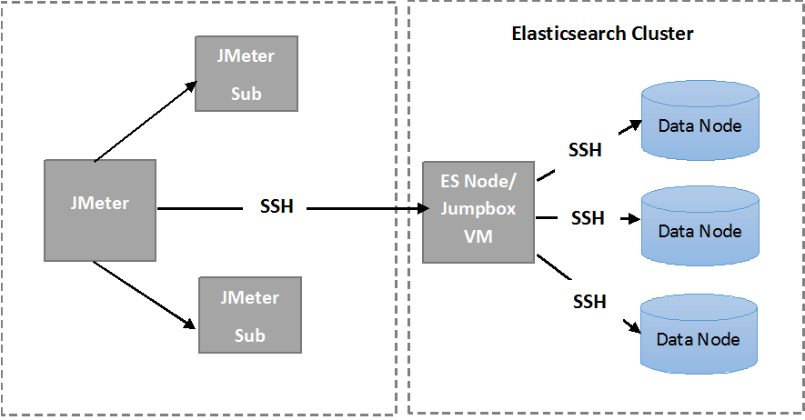
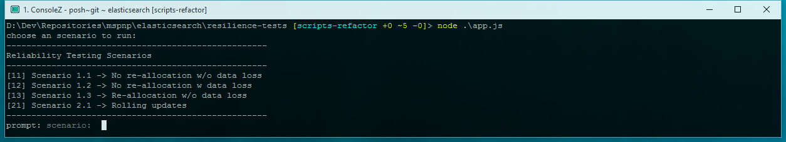

<properties
   pageTitle="Running the automated Elasticsearch resiliency tests | Microsoft Azure"
   description="Description of how you can run the resiliency tests in your own environment."
   services=""
   documentationCenter="na"
   authors="dragon119"
   manager="bennage"
   editor=""
   tags=""/>

<tags
   ms.service="guidance"
   ms.devlang="na"
   ms.topic="article"
   ms.tgt_pltfrm="na"
   ms.workload="na"
   ms.date="09/22/2016"
   ms.author="masashin"/>

# Running the automated Elasticsearch resiliency tests

[AZURE.INCLUDE [pnp-header](../../includes/guidance-pnp-header-include.md)]

This article is [part of a series](guidance-elasticsearch.md).

In [Configuring resilience and recovery on Elasticsearch on Azure][elasticsearch-resilience-recovery], we described a series of tests that were performed against a sample Elasticsearch cluster to determine how well the system responded to some common forms of failure and how well it recovered. The tests were scripted to enable them to be run in an automated manner. This document describes how you can repeat the tests in your own environment. 

The following scenarios were tested:

- **Node failure and restart with no data loss**. A data node is stopped and restarted after 5 minutes.
Elasticsearch was configured not to reallocate missing shards in this interval, so no additional I/O
is incurred in moving shards around. When the node restarts, the recovery process brings the shards
on that node back up to date.

- **Node failure with catastrophic data loss**. A data node is stopped and the data that it holds
is erased to simulate catastrophic disk failure. The node is then restarted (after 5 minutes),
effectively acting as a replacement for the original node. The recovery process requires
rebuilding the missing data for this node, and may involve relocating shards held on other nodes.

- **Node failure and restart with no data loss, but with shard reallocation**. A data node is
stopped and the shards that it holds are reallocated to other nodes. The node is then restarted
and more reallocation occurs to rebalance the cluster.

- **Rolling updates**. Each node in the cluster is stopped and restarted after a short interval
to simulate machines being rebooted after a software update. Only one node is stopped at any one time.
Shards are not reallocated while a node is down.

## Prerequisites

The automated tests require the following items:

- An Elasticsearch cluster.

- A JMeter environment setup as described by the [performance testing guidance]. 

- The following additions installed on the JMeter master VM only.

    - Java Runtime 7.

    - Nodejs 4.x.x or later.

    - The Git command line tools.

## How the scripts work

The test scripts are intended to run on the JMeter Master VM. When you select a test to run, the scripts
perform the following sequence of operations:

1.  Start a JMeter test plan passing the parameters that you have specified.

2.  Copy a script that performs the operations required by the test to a specified VM in the cluster. This can be any VM that has a public IP address, or the *Jumpbox* VM if you have built the cluster using the [Azure Elasticsearch quickstart template](https://github.com/Azure/azure-quickstart-templates/tree/master/elasticsearch).

3.  Run the script on the VM (or Jumpbox).

The following image shows the structure of the test environment and Elasticsearch cluster. Note that the test scripts use secure shell (SSH) to connect to each node in the cluster to perform various Elasticsearch operations such as stopping or restarting a node.



## Setting up the JMeter tests

Before running the resilience tests you should compile and deploy the JUnit tests located in the resiliency/jmeter/tests folder. These tests are referenced by the JMeter test plan. For more information, see the procedure "Importing an existing JUnit test project into Eclipse" in [Deploying a JMeter JUnit sampler for testing Elasticsearch performance][].

There are two versions of the JUnit tests held in the following folders:

- **Elasticsearch17.** The project in this folder generates the file Elasticsearch17.jar. Use this
JAR for testing Elasticsearch versions 1.7.x

- **Elasticsearch20**. The project in this folder generates the file Elasticsearch20.jar. Use this
JAR for testing Elasticsearch version 2.0.0 and later

Copy the appropriate JAR file along with the rest of the dependencies to your JMeter machines. The
process is described by the procedure "Deploying a JUnit test to JMeter" in [Deploying a JMeter JUnit sampler for testing Elasticsearch performance].

## Configuring VM security for each node

The test scripts require an authentication certificate be installed on each Elasticsearch node
in the cluster. This enables the scripts to run automatically without prompting for a username or
password as they connect to the various VMs.

Start by logging in to one of the nodes in the Elasticsearch cluster (or the Jumpbox VM) and then
run the following command to generate an authentication key:

```Shell
ssh-keygen -t rsa
```

While connected to the Elasticsearch node (or Jumpbox), run the following commands for every node in
he Elasticsearch cluster. Replace `<username>` with the name of a valid user on each VM, and
replace `<nodename>` with the DNS name or IP address of the VM hosting the Elasticsearch node.
Note that you will be prompted for the password of the user when running these commands.
For more information see [SSH login without password](http://www.linuxproblem.org/art_9.html):

```Shell
ssh <username>@<nodename> mkdir -p .ssh (
cat .ssh/id\_rsa.pub | ssh <username>*@<nodename> 'cat &gt;&gt; .ssh/authorized\_keys'
```

## Downloading and configuring the test scripts

The test scripts are provided in a Git repository. Use the following procedure to download and
configure the scripts.

On the JMeter master machine where you will run the tests, open a Git desktop window (Git Bash)
and clone the repository that contains the scripts, as follows:

```Shell
git clone https://github.com/mspnp/azure-guidance.git
```

Move to the resiliency-tests folder and run the following command to install the dependencies required
to run the tests:

```Shell
npm install
```

If the JMeter master is running on Windows, download [Plink](http://www.chiark.greenend.org.uk/~sgtatham/putty/download.html), which is a command-line interface to the PuTTY Telnet client. Copy the Plink executable to the resiliency-tests/lib folder.

If the JMeter master is running on Linux, you don’t need to download Plink but you will need to
configure password-less SSH between the JMeter master and the Elasticsearch node or Jumpbox
you used by following the steps outlined in the procedure "Configuring VM security for each node." 

Edit the following configuration parameters in the `config.js` file to match your test
environment and Elasticsearch cluster. These parameters are common to all of the tests:

| Name | Description | Default Value |
| ---- | ----------- | ------------- |
| `jmeterPath` | Local path where JMeter is located. | `C:/apache-jmeter-2.13` |
| `resultsPath` | Relative directory where the script dumps the result. | `results` |
| `verbose` | Indicates whether the script outputs in verbose mode or not. | `true` |
| `remote` | Indicates whether the JMeter tests run locally or on the remote servers. | `true` |
| `cluster.clusterName` | The name of the Elasticsearch cluster. | `elasticsearch` |
| `cluster.jumpboxIp`         | The IP address of the Jumpbox machine.                 |-|
| `cluster.username`          | The admin user you created while deploying the cluster. |-|
| `cluster.password`          | The password for the admin user.                        |-|
| `cluster.loadBalancer.ip`   | The IP address of the Elasticsearch load balancer.    |-|
| `cluster.loadBalancer.url`  | Base URL of the load balancer.                          |-|

## Running the tests

Move to the resiliency-tests folder and run the following command:

```Shell
node app.js
```

The following menu should appear:



Enter the number of the scenario you want to run: `11`, `12`, `13` or `21`. 

Once you select a scenario, the test will run automatically. The results are stored as a set of comma-separated value (CSV) files in a folder created under the results directory. Each run has its own results folder.
You can use Excel to analyze and graph this data.

[Running Elasticsearch on Azure]: guidance-elasticsearch-running-on-azure.md
[Tuning Data Ingestion Performance for Elasticsearch on Azure]: guidance-elasticsearch-tuning-data-ingestion-performance.md
[performance testing guidance]: guidance-elasticsearch-creating-performance-testing-environment.md
[JMeter guidance]: guidance-elasticsearch-implementing-jmeter.md
[Considerations for JMeter]: guidance-elasticsearch-deploying-jmeter-junit-sampler.md
[Query aggregation and performance]: guidance-elasticsearch-query-aggregation-performance.md
[elasticsearch-resilience-recovery]: guidance-elasticsearch-configuring-resilience-and-recovery.md
[Resilience and Recovery Testing]: guidance-elasticsearch-running-automated-resilience-tests.md
[Deploying a JMeter JUnit Sampler for Testing Elasticsearch Performance]: guidance-elasticsearch-deploying-jmeter-junit-sampler.md
