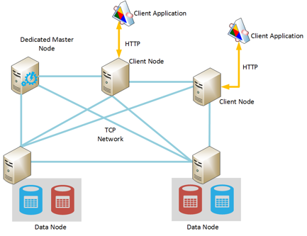
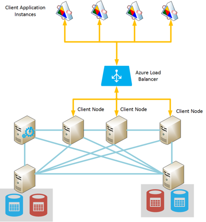
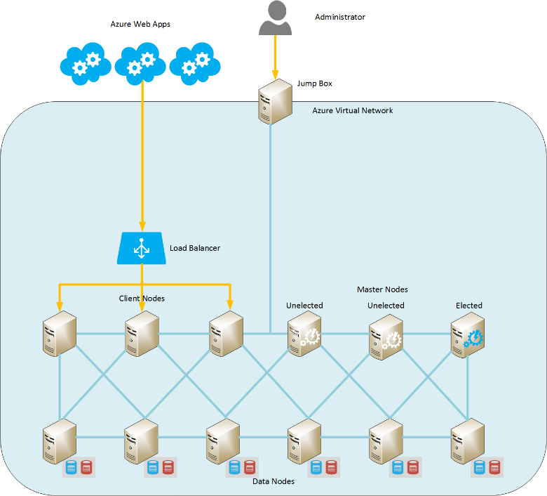
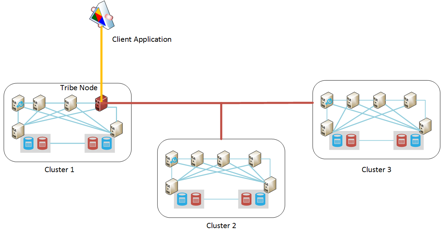
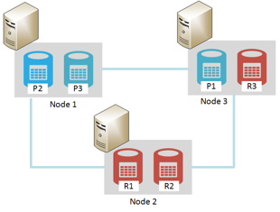

<properties
   pageTitle="Running Elasticsearch on Azure | Microsoft Azure"
   description="How to install, configure, and run Elasticsearch on Azure."
   services=""
   documentationCenter="na"
   authors="dragon119"
   manager="bennage"
   editor=""
   tags=""/>

<tags
   ms.service="guidance"
   ms.devlang="na"
   ms.topic="article"
   ms.tgt_pltfrm="na"
   ms.workload="na"
   ms.date="09/22/2016"
   ms.author="masashin"/>

# Running Elasticsearch on Azure

[AZURE.INCLUDE [pnp-header](../../includes/guidance-pnp-header-include.md)]

This article is [part of a series](guidance-elasticsearch.md). 

## Overview

This document provides a brief introduction to the general structure of Elasticsearch and then 
describes how you can implement an Elasticsearch cluster using Azure. It touches on best 
practices for deploying an Elasticsearch cluster, concentrating on the various functional performance 
and management requirements of your system, and considering how your requirements should drive the
configuration and topology that you select.

> [AZURE.NOTE] This guidance assumes some basic familiarity with [Elasticsearch][].

## The structure of Elasticsearch 

Elasticsearch is a document database highly optimized to act as a search engine. Documents are 
serialized in JSON format. Data is held in indexes, implemented by using [Apache Lucene][], although 
the details are abstracted from view and it is not necessary to fully understand Lucene in order to use
Elasticsearch.

### Clusters, nodes, indexes, and shards

Elasticsearch implements a clustered architecture that uses sharding to distribute data across 
multiple nodes, and replication to provide high availability. Documents are stored in indexes. The user can specify which fields in a document are used to uniquely identify it within an index, or the system can generate a key field and values automatically. The index is used to physically organize documents and is the principal means for locating documents. 

An index contains a set of shards. Documents are evenly dispersed across shards using a hashing 
mechanism based on the index key values and the number of shards in the index. 

Indexes can be replicated. In this case each shard in the index is copied. Elasticsearch ensures that
each original shard for an index (referred to as a “primary shard”) and its replica always reside on
different nodes. When a document is added or modified, all write operations are performed on the primary shard first and
then at each replica. 

The figure below shows the essential aspects of an Elasticsearch cluster containing three nodes. An 
index has been created that consists of two primary shards with two replicas for each shard (six shards
in all).


*A simple Elasticsearch cluster containing two primary nodes and two sets of replicas*

In this cluster, primary shard 1 and primary shard 2 are located on separate nodes to help balance the
load across them. The replicas are similarly distributed. If a single node fails, the remaining nodes
have sufficient information to enable the system to continue functioning. If necessary, Elasticsearch
will promote a replica shard to become a primary shard if the corresponding primary shard is unavailable.

### Node roles

The nodes in an Elasticsearch cluster can perform the following roles:

- A **data node** which can hold one or more shards that contain index data.

- A **client node** that does not hold index data but that handles incoming requests made by client
 applications to the appropriate data node.
 
- A **master node** that does not hold index data but that performs cluster management operations, such
as maintaining and distributing routing information around the cluster (the list of which nodes contain
which shards), determining which nodes are available, relocating shards as nodes appear and disappear,
and coordinating recovery after node failure. Multiple nodes can be configured as masters, but only
one will actually be elected to perform the master functions. If this node fails, another election
takes place and one of the other eligible master nodes will be elected and take over.

> [AZURE.NOTE] The elected master node is critical to the well-being of the cluster. The other nodes 
> ping it regularly to ensure that it is still available. If the elected master node is also acting as 
> a data node, there is a chance that the node can become busy and fail to respond to these pings. In
> this situation, the master is deemed to have failed and one of the other master nodes is elected in its
> place. 

 The figure below shows a topology containing a mixture of dedicated master, client, and data nodes in an Elasticsearch cluster.



*An Elasticsearch cluster showing different types of nodes*

### Costs and benefits of using client nodes

When an application submits a query to an Elasticsearch cluster, the node to which the application
connects is responsible for directing the query process. The node forwards the request to each data node
and gathers the results, returning the accumulated information to the application. If a query involves
aggregations and other computations, the node to which the application connects performs the necessary
operations after retrieving the data from each of the other nodes. This scatter/gather process can
consume considerable processing and memory resources.

Using dedicated client nodes to perform these tasks allows data nodes to focus on managing and storing
data. The result is that many scenarios that involve complex queries and aggregations can benefit from
using dedicated client nodes. However, the impact of using dedicated client nodes will likely vary
depending on your scenario, workload, and cluster size. 

> [AZURE.NOTE] Refer to [Tuning Data Aggregation and Query Performance for Elasticsearch on Azure][] for more information on the tuning process.

### Connecting to a cluster

Elasticsearch exposes a series of REST APIs for building client applications and sending requests to a
cluster. If you are developing applications using the .NET Framework, two higher levels APIs are
available – [Elasticsearch.Net & NEST][].

If you are building client applications using Java, you can use the [Node Client API][] to create client
nodes dynamically and add them to the cluster. Creating client nodes dynamically is convenient if your
system uses a relatively small number of long-lived connections. Client nodes created by using the Node
API are provided with the cluster routing map (the details of which nodes contain which shards) by the
master node. This information enables the Java application to connect directly to the appropriate nodes
when indexing or querying data, reducing the number of hops that may be necessary when using other APIs.

The cost of this approach is the overhead of enrolling the client node into the cluster. If a large
number of client nodes appear and disappear quickly, the impact of maintaining and distributing the
cluster routing map can become significant.

The figure below shows a configuration that uses a load balancer to route requests to a set of client nodes, although the same strategy can be used to connect directly to data nodes if client nodes are not used.



*Client application instances connecting to an Elasticsearch cluster through the Azure Load Balancer*

> [AZURE.NOTE] You can use the [Azure Load Balancer][] to expose the cluster to the public Internet, or
> you can use an [internal load balancer][] if the client applications and cluster are contained entirely
> within the same private virtual network (VNet).

### Node discovery

Elasticsearch is based on peer-to-peer communications, so discovering other nodes in a cluster is an
important part in the lifecycle of a node. Node discovery enables new data nodes to be added dynamically
to a cluster, which in turn allows the cluster to scale out transparently. Additionally, if a data node
fails to respond to communications requests from other nodes, a master node can decide that the data node
has failed and take the necessary steps to reallocate the shards that it was holding to other operational
data nodes.

Elasticsearch node discovery is handled by using a discovery module. The discovery module is a plugin
that can be switched to use a different discovery mechanism. The default discovery module ([Zen][])
causes a node to issue ping requests to find other nodes on the same network. If other nodes respond,
they gossip to exchange information. A master node can then distribute shards to the new node (if it is a
data node) and rebalance the cluster. The Zen discovery module also handles the master election process and the protocol for detecting node failure.

Additionally, if you are running Elasticsearch nodes as Azure virtual
machines (VMs), multicast messaging is not supported. For this reasons, you should configure the Zen
discovery to use unicast messaging and provide a list of valid contact nodes in the elasticsearch.yml
configuration file.

If you are hosting an Elasticsearch cluster within an Azure virtual network, you can specify that the private
DHCP-assigned IP addressed given to each VM in the cluster should remain allocated (static). You can
configure Zen discovery unicast messaging using these static IP addresses. If you are using VMs with
dynamic IP addresses, keep in mind that if a VM stops and restarts it could be allocated a new IP address
making discovery more difficult. To handle this scenario, you can swap the Zen discovery module for the
[Azure Cloud Plugin][]. This plugin uses the Azure API to implement the discovery mechanism, which is
based on Azure subscription information.

> [AZURE.NOTE] The current version of the Azure Cloud Plugin requires you to install the management
> certificate for your Azure subscription in the Java keystore on the Elasticsearch node, and provide the
> location and credentials for accessing the keystore in the elasticsearch.yml file. This file is held in
> clear text, so it is vitally important that you ensure this file is only accessible by the account
> running the Elasticsearch service. 
> 
> Additionally, this approach may not be compatible with Azure Resource Manager deployments. For
> these reasons, it is recommended that you use static IP addresses for master nodes, and use these nodes
> to implement Zen discovery unicast messaging across the cluster. In the following configuration 
> (taken from the elasticsearch.yml file for a sample data node), the host IP addresses reference
> master nodes in the cluster:

```yaml
discovery.zen.ping.multicast.enabled: false  
discovery.zen.ping.unicast.hosts: ["10.0.0.10","10.0.0.11","10.0.0.12"]
```

## General system guidelines

Elasticsearch can run on a variety of computers, ranging from a single laptop to a cluster of high-end
servers. However, the more resources in terms of memory, computing power, and fast disks that are
available the better the performance. The following sections summarize the basic hardware and software
requirements for running Elasticsearch.

### Memory requirements 

Elasticsearch attempts to store data in-memory for speed. A production server hosting a node for a
typical enterprise or moderate-sized commercial deployment on Azure should have between 14GB and 28GB of
RAM (D3 or D4 VMs). **Spread the load across more nodes rather than creating nodes with more memory**
(Experiments have shown that using larger nodes with more memory can cause extended recovery times in the
event of a failure.) However, although creating clusters with a very large number of small nodes can
increase availability and throughput, it also escalates the effort involved in managing and maintaining
such a system.

**Allocate 50% of the available memory on a server to the Elasticsearch heap**. If you are using Linux set
the ES_HEAP_SIZE environment variable before running Elasticsearch. Alternatively, if you are using
Windows or Linux, you can specify memory size in the `Xmx` and `Xms` parameters when you start
Elasticseach. Set both of these parameters to the same value to avoid the Java Virtual Machine (JVM)
resizing the heap at runtime. However, **do not allocate more than 30GB**. Use the remaining memory for the operating system file cache.

> [AZURE.NOTE] Elasticsearch utilizes the Lucene library to create and manage indexes. Lucene structures
> use a disk-based format, and caching these structures in the file system cache will greatly enhance
> performance.

Note that the maximum optimal heap size for Java on a 64 bit machine is just above 30GB. Above this size
Java switches to using an extended mechanism for referencing objects on the heap, which increases the
memory requirements for each object and reduces performance. 

The default Java garbage collector (Concurrent Mark and Sweep) may also perform sub-optimally if the heap
size is above 30GB. It is not currently recommended to switch to a different garbage collector as
Elasticsearch and Lucene have only been tested against the default.

Do not overcommit memory as swapping main memory to disk will severely impact performance. If possible,
disable swapping completely (the details depend on the operating system). If this is not possible then
enable the *mlockall* setting in the Elasticsearch configuration file (elasticsearch.yml) as follows:

```yaml
bootstrap.mlockall: true
```

This configuration setting causes the JVM to lock its memory and prevents it being swapped out by the operating system.

### Disk and file system requirements

Use data disks backed by premium storage for storing shards. Disks should be sized to hold the maximum
amount of data anticipated in your shards, although it is possible to add further disks later. You can
extend a shard across multiple disks on a node.

> [AZURE.NOTE] Elasticsearch compresses the data for stored fields by using the LZ4 algorithm, and in
> Elasticsearch 2.0 onwards you can change the compression type. You can switch the compression algorithm
> to DEFLATE as used by the *zip* and *gzip* utilities. This compression technique can be more resource
> intensive, but you should consider using it for archived log data. This approach 
> can help to reduce index size.

It is not essential that all nodes in a cluster have the same disk layout and capacity. However, a node
with a very large disk capacity compared to other nodes in a cluster will attract more data and will
require increased processing power to handle this data. Consequently the node can become "hot" compared
to other nodes, and this can, in turn, affect performance.

If possible, use RAID 0 (striping). Other forms of RAID that implement parity and mirroring are 
unnecessary as Elasticsearch provides its own high availablility solution in the form of replicas.

> [AZURE.NOTE] Prior to Elasticsearch 2.0.0, you could also implement striping at the software level by
> specifying multiple directories in the *path.data* configuration setting. In Elasticsearch 2.0.0, this
> form of striping is no longer supported. Instead, different shards may be allocated to different paths,
> but all of the files in a single shard will be written to the same path. If you require striping, you
> should stripe data at the operating system or hardware level. 

To maximize storage throughput, each **VM should have a dedicated premium storage account**.

The Lucene library can use a large number of files to store index data, and Elasticsearch can open a
significant number of sockets for communicating between nodes and with clients. Make sure that the
operating system is configured to support an adequate number of open file descriptors (up to 64000 if
sufficient memory is available). Note that the default configuration for many Linux distributions limits
the number of open file descriptors to 1024, which is much too small.

Elasticsearch uses a combination of memory mapped (mmap) I/O and Java New I/O (NIO) to optimize
concurrent access to data files and indexes. If you are using Linux, you should configure the operating
system to ensure that there is sufficient virtual memory available with space for 256K memory map areas.

> [AZURE.NOTE] Many Linux distributions default to using the completely fair queuing (CFQ) scheduler when
> arranging to write data to disk. This scheduler is not optimized for SSDs. Consider reconfiguring the
> operating system to use either the NOOP scheduler or the deadline scheduler, both of which are more
> effective for SSDs.

### CPU requirements

Azure VMs are available in a variety of CPU configurations, supporting between 1 and 32 cores. For a 
data node, a good starting point is a standard DS-series VM, and select either the DS3 (4
cores) or D4 (8 cores) SKUs. The DS3 also provides 14GB of RAM, while the DS4 includes 28GB. 

The GS-series (for premium storage) and G-series (for standard storage) use Xeon E5 V3 processors which may be useful for workloads that are heavily compute-intensive, such as large-scale aggregations. For the latest information, visit [Sizes for virtual machines][].

### Network requirements

Elasticsearch requires a network bandwidth of between 1 and 10Gbps, depending on the size and volatility
of the clusters that it implements. Elasticsearch migrates shards between nodes as more nodes are added
to a cluster. Elasticsearch assumes that the communication time between all nodes is roughly equivalent
and does not consider the relative locations of shards held on those nodes. Additionally, replication can
incur significant network I/O between shards. For these reasons, **avoid creating clusters on nodes that
are in different regions**.

### Software Requirements

You can run Elasticsearch on Windows or on Linux. The Elasticsearch service is deployed as a Java jar
library and has dependencies on other Java libraries that are included in the Elasticsearch package. You
must install the Java 7 (update 55 or later) or Java 8 (update 20 or later) JVM to run Elasticsearch.

> [AZURE.NOTE] Other than the *Xmx* and *Xms* memory parameters (specified as command line options to 
> the Elasticsearch engine – see [Memory requirements][]) do not modify the default JVM configuration
> settings. Elasticsearch has been designed using the defaults; changing them can cause Elasticsearch to
> become detuned and perform poorly.

### Deploying Elasticsearch on Azure

Although it is not difficult to deploy a single instance of Elasticsearch, creating a number of nodes and
installing and configuring Elasticsearch on each one can be a time consuming and error-prone process. If
you are considering running Elasticsearch on Azure VMs, you have three options that can help to reduce the
chances of errors.

- Using the Azure Resource Manager [template](https://azure.microsoft.com/marketplace/partners/elastic/elasticsearchelasticsearch/) in Azure marketplace. This template is created by Elastic. It allows you to add commercial enhancements such as Shield, Marvel, Watcher, and so on.

- Using the Azure quickstart [template](https://github.com/Azure/azure-quickstart-templates/tree/master/elasticsearch) to build the cluster. This template can create a cluster based on Windows Server 2012 or Ubuntu Linux 14.0.4. It allows you to use experimental features such as Azure File Storage. This template is used for the research and testing tasks in this document.

- Using scripts that can be automated or run unattended. Scripts that can create and deploy an Elasticsearch cluster are available on the [GitHub repository][elasticsearch-scripts]

## Cluster and node sizing and scalability 

Elasticsearch enables a number of deployment topologies, designed to support differing requirements and levels of scale. This section discusses some common topologies, and describes the considerations for implementing clusters based on these topologies.

### Elasticsearch topologies

The figure below illustrates a starting point for designing an Elasticsearch topology for Azure:



*Suggested starting point for building an Elasticsearch cluster with Azure*

This topology contains six data nodes together with three client nodes and three master nodes (only one master node is elected, the other two are available for election should the elected master fail.) Each node is implemented as a separate VM. Azure web applications are directed to client nodes via a load balancer. 

In this example, all nodes and the web applications reside in the same virtual network which effectively isolates them from the outside world. If the cluster needs to be available externally (possibly as part of a hybrid solution incorporating on-premises clients), then you can use the Azure Load Balancer to provide a public IP address, but you will need to take additional security precautions to prevent unauthorized access to the cluster. 

The optional "Jump Box" is a VM that is only available to administrators. This VM has a network connection to the virtual network, but also an outward facing network connection to permit administrator logon from an external network (this logon should be protected by using a strong password or certificate). An administrator can log on to the Jump Box, and then connect from there directly to any of the nodes in the cluster. 

Alternative approaches include using a site-to-site VPN between an organization and the virtual network, or using [ExpressRoute][] circuits to connect to the virtual network. These mechanisms permit administrative access to the cluster without exposing the cluster to the public internet.

To maintain VM availability, the data nodes are grouped into the same Azure availability set. Similarly, the client nodes are held in another availability set and the master nodes are stored in a third availability set.

This topology is relatively easy to scale out, simply add more nodes of the appropriate type and ensure that they are configured with the same cluster name in the elasticsearch.yml file. Client nodes also need to be added to the backend pool for the Azure load balancer.

**Geo-locating clusters**

**Don’t spread nodes in a cluster across regions as this can impact the performance of inter-node communication** (see [Network requirements][]). Geo-locating data close to users in different regions requires creating multiple clusters. In this situation, you need to consider how (or even whether) to synchronize clusters. Possible solutions include:

[Tribe nodes][] are similar to a client node except that it can participate in multiple Elasticsearch
clusters and view them all as one big cluster. Data is still managed locally by each cluster (updates are
not propagated across cluster boundaries), but all data is visible. A tribe node can query, create, and
manage documents in any cluster. 

The primary restrictions are that a tribe node cannot be used to create a new index, and index names must
be unique across all clusters. Therefore it is important that you consider how indexes will be named when
you design clusters intended to be accessed from tribe nodes.

Using this mechanism, each cluster can contain the data that is most likely to be accessed by local
client applications, but these clients can still access and modify remote data although with possible
extended latency. The figure below shows an example of this topology. The tribe node in Cluster 1 is
highlighted; the other clusters can also have tribe nodes although these are not shown on the diagram:



*A client application accessing multiple clusters through a tribe node*

In this example, the client application connects to the tribe node in Cluster 1 (co-located in the same region), but this node is configured to be able to access Cluster 2 and Cluster 3, which might be located in different regions. The client application can send requests that retrieve or modify data in any of the clusters.

> [AZURE.NOTE] Tribe nodes require multicast discovery to connect to clusters, which may present a
> security concern. See the section [Node discovery][] for more details.

- Implementing geo-replication between clusters. In this approach, changes made at each cluster are
propagated in near real-time to clusters located in other data centers. Third-party plugins are available
for Elasticsearch that support this functionality, such as the [PubNub Changes Plugin][].

- Using the [Elasticsearch Snapshot and Restore module][]. If the data is very slow-moving and is
modified only by a single cluster, you can consider using snapshots to take a periodic copy of the data
and then restore these snapshots in other clusters (snapshots can be stored in Azure Blob Storage if you
have installed the [Azure Cloud Plugin][]). However, this solution does not work well for rapidly
changing data or if data can be changed in more than one cluster.

**Small-scale topologies**

Large-scale topologies comprising clusters of dedicated master, client, and data nodes might not be
appropriate for every scenario. If you are building a small-scale production or development system,
consider the 3-node cluster shown in the figure below.

Client applications connect directly to any available data node in the cluster. The cluster contains
three shards labelled P1-P3 (to allow for growth) plus replicas labelled R1-R3. Using three nodes allows
Elasticsearch to distribute the shards and replicas so that if any single node fails no data will be lost.



*A 3-node cluster with 3 shards and replicas*

If you are running a development installation on a standalone machine you can configure a cluster with a
single node that acts as master, client, and data storage. Alternatively, you can start multiple nodes
running as a cluster on the same computer by starting more than one instance of Elasticsearch. The figure
below shows an example.


*A development configuration running multiple Elasticsearch nodes on the same machine*

Note that neither of these standalone configurations are recommended for a production environment as
they can cause contention unless your development machine has a significant amount of memory and several
fast disks. Additionally, they do not provide any high availability guarantees. If the machine fails, all
nodes are lost.

### Scaling a cluster and data nodes

Elasticsearch can scale in two dimensions: vertically (using bigger, more powerful machines) and
horizontally (spreading the load across machines).

**Scaling Elasticsearch data nodes vertically**

If you are hosting an Elasticsearch cluster by using Azure VMs, each node can correspond to a VM. The
limit of vertical scalability for a node is largely governed by the SKU of the VM and the overall
restrictions applied to individual storage accounts and Azure subscriptions. 

The page [Azure subscription and service limits, quotas, and constraints](../azure-subscription-service-limits.md) 
describes these limits in detail, but as far as building an Elasticsearch cluster is concerned, the items
in the following list are the most pertinent. 

- Each storage account is restricted to 20,000 IOPS. Each VM in the cluster should leverage a 
dedicated (preferably premium) storage account.

- The number of data nodes in a virtual network. If you are not using the Azure Resource Manager, there is a
limit of 2048 VM instances per virtual network. While this should prove sufficient for many cases, if you have a
very large configuration with thousands of nodes this could be a limitation.

- Number of storage accounts per subscription per region. You can create up to 100 storage accounts per
Azure subscription in each region. Storage accounts are used to hold virtual disks, and each storage
account has a limit of 500TB of space.

- Number of cores per subscription. The default limit is 20 cores per subscription, but this can be increased up to 10,000 cores by requesting a limit increase through a support ticket. 

- The amount of memory per VM size. Smaller size VMs have limited amounts of memory available (D1
machines have 3.5GB, and D2 machines have 7GB). These machines might not be suitable for scenarios that
require Elasticsearch to cache significant amounts of data to achieve good performance (aggregating data,
or analyzing a large number of documents during data ingestion, for example).

- The maximum number of disks per VM size. This restriction can limit the size and performance of a
cluster. Fewer disks means that less data can be held, and performance can be reduced by having fewer
disks available for striping.

- The number of update domains / fault domains per availability set. If you create VMs using the Azure Resource Manager,
each availability set can be allocated up to 3 fault domains and 20 update domains. This limitation can
impact the resilience of a large cluster that is subjected to frequent rolling updates.

Additionally, you should probably not consider using VMs with more than 64GB of memory. As described in
the section [Memory requirements][], you should not allocate more than 30GB of RAM on each VM to the JVM
and allow the operating system to utilize the remaining memory for I/O buffering.

With these restrictions in mind, you should always spread the virtual disks for the VMs in a cluster
across storage accounts to reduce the chances of I/O throttling. In a very large cluster, you may need to
redesign your logical infrastructure and split it into separate functional partitions. For example, you
might need to split the cluster across subscriptions, although this process can lead to further
complications because of the need to connect virtual networks.

**Scaling an Elasticsearch cluster horizontally**

Internally within Elasticsearch, the limit of horizontal scalability is determined by the number of
shards defined for each index. Initially, many shards can be allocated to the same node in a cluster, but
as the volume of data grows additional nodes can be added and shards can be distributed across these
nodes. In theory, only when the number of nodes reaches the number of shards will the system cease to
scale horizontally.

As with vertical scaling, there are some issues that you should consider when contemplating implementing
horizontal scaling, including:

- The maximum number of VMs that you can connect in an Azure virtual network. This can limit the horizontal
scalability for a very large cluster. You can create a cluster of nodes that spans more than one virtual network to
circumvent this limit, but this approach can lead to reduced performance due to the lack of locality of
each node with its peers.

- The number of disks per VM Size. Different series and SKUs support different numbers of attached disks.
Additionally, you can also consider using the ephemeral storage included with the VM to provide a limited
amount of faster data storage, although there are resiliency and recovery implications that you should
consider (see [Configuring resilience and recovery on Elasticsearch on Azure][elasticsearch-resilience-recovery] for
more information). The D-series, DS-series, Dv2-series, and GS-series of VMs use SSDs for ephemeral
storage.

You could consider using [Virtual Machine Scale Sets][vmss] to start and stop VMs as demands dictates. However, this approach might not be
appropriate for an Elasticsearch cluster for the following reasons:

- This approach is best suited for stateless VMs. Each time you add or remove a node from an
Elasticsearch cluster, shards are reallocated to balance the load, and this process can generate
considerable volumes of network traffic and disk I/O and can severely impact data ingestion rates. You
must assess whether this overhead is worth the benefit of the additional processing and memory resources
that become available by dynamically starting more VMs.

- VM startup does not happen instantaneously, and it may take several minutes before additional VMs
become available or they are shut down. Scaling in this way should only be used to handle sustained
changes in demand.

- After scaling out, do you actually need to consider scaling back? Removing a VM from an Elasticsearch
cluster can be a resource intensive process requiring that Elasticsearch recovers the shards and replicas
that are located on that VM and recreates them on one or more of the remaining nodes. Removing several
VMs at the same time could compromise the integrity of the cluster, making recovery difficult. Furthermore,
many Elasticsearch implementations grow over time, but the nature of the data is such that it tends not
to shrink in volume. It is possible to delete documents manually, and documents can also be configured
with a TTL (time to live) after which they expire and get removed, but in most cases it is likely that
 the space previously allocated will be quickly reused by new or modified documents. Fragmentation within
 an index might occur when documents are removed or changed, in which case you can use the Elasticsearch
 HTTP [Optimize][] API (Elasticsearch 2.0.0 and earlier) or the [Force Merge][] API (Elasticsearch 2.1.0
 and later) to perform defragmentation.

### Determining the number of shards for an index

The number of nodes in a cluster can vary over time, but the number of shards in an index is fixed once
the index has been created. To add or remove shards requires reindexing the data – a process of creating
a new index with the required number of shards and then copying the data from the old index to the new
(you can use aliases to insulate users from the fact that data has been reindexed – see [Tuning data aggregation and query performance for Elasticsearch on Azure][] for more details).
Therefore, it is important to determine the number of shards that you are likely to require in advance of creating the first index in your cluster. You can perform the following steps to establish this number:

- Create a single-node cluster using the same hardware configuration that you intend to deploy in
production.

- Create an index that matches the structure that you plan to use in production. Give this index a single
shard and no replicas.

- Add a specific quantity of realistic production data to the index.

- Perform typical queries, aggregations, and other workloads against the index and measure the throughput
and response time.

- If the throughput and response time are within acceptable limits, then repeat the process from step 3
(add more data).

- When you appear to have reached the capacity of the shard (response times and throughput start becoming
unacceptable), make a note of the volume of documents.

- Extrapolate from the capacity of a single shard to the anticipated number of documents in production to
calculate the required number of shards (you should include some margin of error in these calculations as
extrapolation is not a precise science).

> [AZURE.NOTE] Remember that each shard is implemented as a Lucene index that consumes memory, CPU power,
> and file handles. The more shards you have, the more of these resources you will require.

Additionally, creating more shards may increase scalability (depending on your workloads and scenario)
and can increase data ingestion throughput, but it might reduce the efficiency of many queries. By
default, a query will interrogate every shard used by an index (you can use [custom routing][] to modify
this behavior if you know which shards the data you require is located on). 

Following this process can only generate an estimate for the number of shards, and the volume of
documents expected in production might not be known. In this case, you should determine the initial
volume (as above) and the predicted growth rate. Create an appropriate number of shards that can handle
the growth of data for the period until you are willing to reindex the database. 

Other strategies used for scenarios such as event management and logging include using rolling indexes.
Create a new index for the data ingested each day and access this index through an alias that is switched
daily to point to the most recent index. This approach enables you to more easily age-out old data (you
can delete indexes containing information that is no longer required) and keeps the volume of data
manageable.

Keep in mind that the number of nodes does not have to match the number of shards. For example, if you
create 50 shards, you can spread them across 10 nodes initially, and then add more nodes to scale the
system out as the volume of work increases. Avoid creating an exceptionally large number of shards on a
small number of nodes (1000 shards spread across 2 nodes, for example). Although the system could
theoretically scale to 1000 nodes with this configuration, running 500 shards on a single node risks
crippling the performance of the node.

> [AZURE.NOTE] For systems that are data-ingestion heavy, consider using a prime number of shards. The
> default algorithm that Elasticsearch uses for routing documents to shards produces a more even spread
> in this case.

### Security

By default, Elasticsearch implements minimal security and does not provide any means of authentication
and authorization. These aspects require configuring the underlying operating system and network, and
using plugins and third-party utilities. Examples include [Shield][], and [Search Guard][].

> [AZURE.NOTE] Shield is a plugin provided by Elastic for user authentication, data encryption,
> role-based access control, IP filtering, and auditing. It may be necessary to configure the underlying
> operating system to implement further security measures, such as disk encryption.

In a production system, you should consider how to:

- Prevent unauthorized access to the cluster.
- Identify and authenticate users.
- Authorize the operations that authenticated users can perform.
- Protect the cluster from rogue or damaging operations.
- Protect the data from unauthorized access.
- Meet regulatory requirements for commercial data security (if appropriate).

### Securing access to the cluster

Elasticsearch is a network service. The nodes in an Elasticsearch cluster listen for incoming client requests using HTTP, and communicate with each other using a TCP channel. You should take steps to prevent unauthorized clients or services from being able to send requests over both the HTTP and TCP paths. Consider the following items. 

- Define network security groups to limit the inbound and outbound network traffic for a virtual network or VM to
specific ports only.

- Change the default ports used for client web access (9200) and programmatic network access (9300). Use
a firewall to protect each node from malicious Internet traffic.

- Depending on the location and connectivity of clients, place the cluster on a private subnet with no
direct access to the Internet. If the cluster must be exposed outside the subnet, route all requests
through a bastion server or proxy sufficiently hardened to protect the cluster.

If you must provide direct access to nodes, use an [nginx](http://nginx.org/en/) proxy server configure and
HTTPS authentication.

> [AZURE.NOTE] Using a proxy server such as nginx, you can also restrict access to functionality. For
> example, you can configure nginx to only allow requests to the \_search endpoint if you need to prevent
> clients from performing other operations.

If you require more comprehensive network access security, use the Shield or Search Guard plugins.

### Identifying and authenticating users

All requests made by clients to the cluster should be authenticated. Additionally, you should prevent
unauthorized nodes from joining the cluster as these can provide a backdoor into the system that bypasses
authentication.

Elasticsearch plugins are available that can perform different types of authentication, including:

- **HTTP basic authentication**. Usernames and passwords are included in each request. All requests must be
encrypted by using SSL/TLS or an equivalent level of protection.

- **LDAP and Active Directory integration**. This approach requires that clients are assigned roles
in LDAP or AD groups.

- **Native authentication**. Uses identities defined within the Elasticsearch cluster itself.

- **TLS authentication**. Use TLS authentication within a cluster to authenticate all nodes.

- **IP filtering**. Use IP filtering to prevent clients from unauthorized subnets from connecting, and also preventing nodes from these subnets joining the cluster.

### Authorizing client requests

Authorization depends on the Elasticsearch plugin used to provide this service. For example, a plugin that provides basic authentication typically provides features that define the level of authentication, whereas a plugin that uses LDAP or AD will typically associate clients with roles, and then assign access rights to those roles. When using any plugin, you should consider the following points:

- Do you need to restrict the operations that a client can perform? For example, should a client be able
to monitor the status of the cluster, or create and delete indexes?

- Should the client be restricted to specific indexes? This is useful in a multitenant : No hyphen per style guide.>>situation where
tenants may be assigned their own specific set of indexes, and these indexes should be inaccessible to
other tenants.

- Should the client by able to read and write data to an index? A client may be able to perform searches
that retrieve data using an index but must be prevented from adding or deleting data from that index, for
example.

Currently, most security plugins scope operations to the cluster or index level, and not to subsets of 
documents within indexes. This is for efficiency reasons. It is therefore not easy to limit requests to
specific documents within a single index. If you require this level of granularity, save documents in
separate indexes and use aliases that group indexes together. 

For example, in a personnel system, if user A requires access to all documents that contain information
about employees in department X, user B requires access to all documents that contain information about
employees in department Y, and user C requires access to all documents that contain information about
employees in both departments, create two indexes (for department X and department Y), and an alias that
references both indexes. Grant user A read access to the first index, grant user B read access to the
second index, and grant user C read access to both indexes through the alias. For more information, see
[Faking Index per User with Aliases][].

### Protecting the cluster

The cluster can become vulnerable to misuse if it is not protected carefully. 

**Disable dynamic query scripting in Elasticsearch** queries as they can lead to security vulnerabilities. Use native scripts in preference to query scripting; a native script is an Elasticsearch plugin written in Java and compiled into a JAR file.

Dynamic query scripting is now disabled by default; do not reenable it unless you have a very good reason to do so.

**Avoid exposing query-string searches to users** as this type of searching allows users to perform
resource-intensive queries unhindered. These searches could severely impact the performance of the
cluster and can render the system open to DOS attacks. Additionally, query-string searching can expose
potentially private information.

**Prevent operations from consuming a lot of memory** as these can cause out-of-memory exceptions
resulting in Elasticsearch failing on a node. Long-running resource intensive operations can also be used
to implement DOS attacks. Examples include:

Avoid Search requests that attempt to load very large fields into memory (if a query sorts, scripts, or facets on these fields), such as:

- Searches that query multiple indexes at the same time.

- Searches that retrieve a large number of fields. These searches can exhaust memory by causing a vast amount of field data to be cached. By default, the field data cache is unlimited in size, but you can set the [indices.fielddata.cache.*](https://www.elastic.co/guide/en/elasticsearch/reference/current/modules-fielddata.html) properties in the elasticsearch.yml configuration file to limit the resources available. You can also configure the [field data circuit breaker][] to help prevent the cached data from a single field from exhausting memory, and the [request circuit breaker][] to stop individual queries from monopolizing memory. The cost of setting these parameters is the increased likelihood of some queries failing or timing out.
 
> [AZURE.NOTE] Using [Doc Values][] can reduce the memory requirements of indexes by saving field data to
> disk rather than loading it into memory. This can help to reduce the chances of memory exhaustion on a
> node but with a reduction in speed.

> Elasticsearch always assumes that it has enough memory to perform its current workload. If
> this is not the case, then the Elasticsearch service can crash. Elasticsearch provides endpoints that
> return information about resource usage (the HTTP [cat APIs][]), and you should monitor this
> information carefully.

**Waiting for too long to flush an in-progress memory segment**. This can exhaust in-memory buffer space.
If necessary, [configure the translog][] to reduce the thresholds at which data is flushed to disk.

**Creating indexes with large amounts of metadata**. An index that contains documents with a large
variation in field names can consume a lot of memory. For more information, see [Mapping Explosion][].
  
The definition of a long-running or query intensive operation is highly scenario-specific. The workload typically expected by one cluster might have a completely different profile from the workload on another. Determining which operations are unacceptable requires significant research and testing of your applications.

Be proactive, detect and stop malicious activities before they cause significant damage or data loss.
Consider using a security monitoring and notification system that can quickly detect unusual patterns of
data access and raise alerts when, for example, user login requests fail, unexpected nodes join or leave
the cluster, or operations are taking longer than expected. Tools that can perform these tasks include
Elasticearch [Watcher][].

### Protecting the data

You can protect data inflight by using SSL/TLS, but Elasticsearch does not provide any built-in form of
data encryption for information that is stored on disk. Remember that this information is held in
ordinary disk files, and any user with access to these files may be able to compromise the data that they
hold, for example by copying them to their own cluster. Consider the following points:

- Protect the files used by Elasticsearch to hold the data. Do not allow arbitrary read or write access
to identities other than the Elasticsearch service.

- Encrypt the data held in these files by using an encrypting file system.

> [AZURE.NOTE] Azure now supports disk encryption for Linux and Windows VMs. For more information, see
> [Azure Disk Encryption for Windows and Linux IaaS VMs Preview][].

### Meeting regulatory requirements

Regulatory requirements are primarily concerned with auditing operations to maintain a history of events,
and ensuring the privacy of these operations to help prevent them being monitored (and replayed) by an
external agency. In particular, you should consider how to:

- Track all requests (successful or not), and all attempts to access the system.

- Encrypt communications made by clients to the cluster as well as node-to-node communications performed
by the cluster. You should implement SSL/TLS for all cluster communications. Elasticsearch also supports
pluggable ciphers if your organization has requirements distinct from those available through SSL/TLS.

- Store all audit data securely. The volume of audit information can grow very rapidly and must be
protected robustly to prevent tampering of audit information.

- Safely archive audit data.

### Monitoring

Monitoring is important both at the operating system level and at the Elasticsearch level.

You can perform monitoring at the operating system level using operating-system specific tools. Under
Windows, this includes items such as Performance Monitor with the appropriate performance counters, while
under Linux you can use tools such as *vmstat*, *iostat*, and *top*. The key items to monitor at the
operating system level include CPU utilization, disk I/O volumes, disk I/O wait times, and network traffic.
In a well-tuned Elasticsearch cluster, CPU utilization by the Elasticsearch process should be high, and
disk I/O wait times should be minimal.

At the software level, you should monitor the throughput and response times of requests, together with
the details of requests that fail. Elasticsearch provides a number of APIs that you can use to examine
the performance of different aspects of a cluster. The two most important APIs are *_cluster/health* and
*_nodes/stats*. The *_cluster/health* API can be used to provide a snapshot of the overall health of the
cluster, as well as providing detailed information for each index, as shown in the following example:

`GET _cluster/health?level=indices`

The example output shown below was generated using this API:

```json
{
    "cluster_name": "elasticsearch",
    "status": "green",
    "timed_out": false,
    "number_of_nodes": 6,
    "number_of_data_nodes": 3,
    "active_primary_shards": 10,
    "active_shards": 20,
    "relocating_shards": 0,
    "initializing_shards": 0,
    "unassigned_shards": 0,
    "delayed_unassigned_shards": 0,
    "number_of_pending_tasks": 0,
    "number_of_in_flight_fetch": 0,
    "indices": {
        "systwo": {
            "status": "green",
            "number_of_shards": 5,
            "number_of_replicas": 1,
            "active_primary_shards": 5,
            "active_shards": 10,
            "relocating_shards": 0,
            "initializing_shards": 0,
            "unassigned_shards": 0
        },
        "sysfour": {
            "status": "green",
            "number_of_shards": 5,
            "number_of_replicas": 1,
            "active_primary_shards": 5,
            "active_shards": 10,
            "relocating_shards": 0,
            "initializing_shards": 0,
            "unassigned_shards": 0
        }
    }
}
```

This cluster contains two indexes named *systwo* and *sysfour*. Key statistics to monitor for each index are the status, active_shards, and unassigned_shards. The status should be green, the number of active_shards should reflect the number_of_shards and number_of_replicas, and unassigned_shards should be zero. 

If the status is red, then part of the index is missing or has become corrupt. You can verify this if the *active_shards* setting is less than *number_of_shards* - (*number_of_replicas* + 1) and unassigned_shards is non-zero. Note that a status of yellow indicates that an index is in a transitional state, either as the result of adding more replicas or shards being relocated. The status should switch to green when the transition has completed. 

If it stays yellow for an extended period or changes to red, you should look to see whether any significant I/O events (such as a disk or network failure) have occurred at the operating system level.

The \_nodes/stats API emits extensive information about each node in the cluster:

`GET _nodes/stats`

The output generated includes details about how indexes are stored on each node (including the sizes and
numbers of documents), time spent performing indexing, querying, searching, merging, caching,
operating system and process information, statistics about the JVM (including garbage collection
performance), and thread pools. For more information, see [Monitoring Individual Nodes][].

If a significant proportion of Elasticsearch requests are failing with *EsRejectedExecutionException*
error messages, then Elasticsearch is failing to keep up with the work being sent its way. In this
situation, you need to identify the bottleneck that is causing Elasticsearch to fall behind. Consider the
following items:

- If the bottleneck is due to a resource constraint, such as insufficient memory allocated to the JVM
causing an excessive number of garbage collections, then consider allocating additional resources (in
this case, configure the JVM to use more memory, up to 50% of the available storage on the node – see
[Memory requirements][]).

- If the cluster is showing large I/O wait times and the merge statistics gathered for an index by using
the \_node/stats API contain large values then the index is write-heavy. Revisit the points raised in [Optimizing resources for indexing operations](guidance-elasticsearch-tuning-data-ingestion-performance.md#optimizing-resources-for-indexing-operations) to
tune indexing performance.

- Throttle client applications that are performing data ingestion operations and determine the effect
that this has on performance. If this approach shows significant improvement, then consider either
retaining the throttle, or scaling out by spreading the load for write-heavy indexes across more nodes.
For more information, see [Tuning data ingestion performance for Elasticsearch on Azure][].

- If the searching statistics for an index indicate that queries are taking a long time then consider how
the queries are optimized. Note that you can use the *query_time_in_millis* and *query_total* values reported by the search statistics to calculate a rough guide to query efficiency; the equation *query_time_in_millis* / *query_total* will give you an average time for each query.

### Tools for monitoring Elasticsearch

A variety of tools are available for performing everyday monitoring of Elasticsearch in production. These
tools typically use the underlying Elasticsearch APIs to gather information and present the details in a
manner that is easier to observe than the raw data. Common examples include [Elasticsearch-Head][],
[Bigdesk][], [Kopf][], and [Marvel][].

Elasticsearch-Head, Bigdesk, and Kopf run as plugins for the Elasticsearch software. More recent versions
of Marvel can run independently, but require [Kibana][] to provide a data capture and hosting
environment. The advantage of using Marvel with Kibana is that you can implement monitoring in a separate
environment from the Elasticsearch cluster, enabling you to explore problems with Elasticsearch that
might not be possible if the monitoring tools run as part of the Elasticsearch software. For example, if
Elasticsearch repeatedly fails or is running very slowly, tools that run as Elasticsearch plugins will
also be affected, making monitoring and diagnosis more difficult.

At the operating system level, you can use tools such as the Log Analytics feature of [Azure Operations Management Suite][] or [Azure Diagnostics with the Azure Portal][] to capture performance data for VMs
hosting Elasticsearch nodes. Another approach is to use [Logstash][] to capture performance and log data,
store this information in a separate Elasticsearch cluster (don't use the same cluster that you are using
 or your application), and then use Kibana to visualize the data. For more information, see [Microsoft Azure Diagnostics with ELK][].

### Tools for testing Elasticsearch performance

Other tools are available if you are benchmarking Elasticsearch or subjecting a cluster to performance
testing. These tools are intended to be used in a development or test environment rather than production.
A frequently-used example is [Apache JMeter][].

JMeter was used to perform benchmarking and other load tests described in documents related to this
guidance. [Creating a performance testing environment for Elasticsearch on Azure][] describes in detail how JMeter was configured and used.

[Running Elasticsearch on Azure]: guidance-elasticsearch-running-on-azure.md
[Tuning Data Ingestion Performance for Elasticsearch on Azure]: guidance-elasticsearch-tuning-data-ingestion-performance.md
[Creating a Performance Testing Environment for Elasticsearch on Azure]: guidance-elasticsearch-creating-performance-testing-environment.md
[Implementing a JMeter Test Plan for Elasticsearch]: guidance-elasticsearch-implementing-jmeter-test-plan.md
[Deploying a JMeter JUnit Sampler for Testing Elasticsearch Performance]: guidance-elasticsearch-deploying-jmeter-junit-sampler.md
[Tuning Data Aggregation and Query Performance for Elasticsearch on Azure]: guidance-elasticsearch-tuning-data-aggregation-and-query-performance.md
[Configuring Resilience and Recovery on Elasticsearch on Azure]: guidance-elasticsearch-configuring-resilience-and-recovery.md
[Running the Automated Elasticsearch Resiliency Tests]: guidance-elasticsearch-configuring-resilience-and-recovery

[Apache JMeter]: http://jmeter.apache.org/
[Apache Lucene]: https://lucene.apache.org/
[Azure Disk Encryption for Windows and Linux IaaS VMs Preview]: ../azure-security-disk-encryption.md
[Azure Load Balancer]: ../load-balancer/load-balancer-overview.md
[ExpressRoute]: ../expressroute/expressroute-introduction.md
[internal load balancer]:  ../load-balancer/load-balancer-internal-overview.md
[Sizes for Virtual Machines]: ../virtual-machines/virtual-machines-linux-sizes.md

[Memory Requirements]: #memory-requirements
[Network Requirements]: #network-requirements
[Node Discovery]: #node-discovery
[Query Tuning]: #query-tuning

[elasticsearch-scripts]: https://github.com/mspnp/azure-guidance/tree/master/scripts/ps
[A Highly Available Cloud Storage Service with Strong Consistency]: http://blogs.msdn.com/b/windowsazurestorage/archive/2011/11/20/windows-azure-storage-a-highly-available-cloud-storage-service-with-strong-consistency.aspx
[Azure Cloud Plugin]: https://www.elastic.co/blog/azure-cloud-plugin-for-elasticsearch
[Azure Diagnostics with the Azure Portal]: https://azure.microsoft.com/blog/windows-azure-virtual-machine-monitoring-with-wad-extension/
[Azure Operations Management Suite]: https://www.microsoft.com/server-cloud/operations-management-suite/overview.aspx
[Azure Quickstart Templates]: https://azure.microsoft.com/documentation/templates/
[Bigdesk]: http://bigdesk.org/
[cat APIs]: https://www.elastic.co/guide/en/elasticsearch/reference/1.7/cat.html
[configure the translog]: https://www.elastic.co/guide/en/elasticsearch/reference/current/index-modules-translog.html
[custom routing]: https://www.elastic.co/guide/en/elasticsearch/reference/current/mapping-routing-field.html
[Doc Values]: https://www.elastic.co/guide/en/elasticsearch/guide/current/doc-values.html
[Elasticsearch]: https://www.elastic.co/products/elasticsearch
[Elasticsearch-Head]: https://mobz.github.io/elasticsearch-head/
[Elasticsearch.Net & NEST]: http://nest.azurewebsites.net/
[elasticsearch-resilience-recovery]: guidance-elasticsearch-configuring-resilience-and-recovery.md
[Elasticsearch Snapshot and Restore module]: https://www.elastic.co/guide/en/elasticsearch/reference/current/modules-snapshots.html
[Faking Index per User with Aliases]: https://www.elastic.co/guide/en/elasticsearch/guide/current/faking-it.html
[field data circuit breaker]: https://www.elastic.co/guide/en/elasticsearch/reference/current/circuit-breaker.html#fielddata-circuit-breaker
[Force Merge]: https://www.elastic.co/guide/en/elasticsearch/reference/2.1/indices-forcemerge.html
[gossiping]: https://en.wikipedia.org/wiki/Gossip_protocol
[Kibana]: https://www.elastic.co/downloads/kibana
[Kopf]: https://github.com/lmenezes/elasticsearch-kopf
[Logstash]: https://www.elastic.co/products/logstash
[Mapping Explosion]: https://www.elastic.co/blog/found-crash-elasticsearch#mapping-explosion
[Marvel]: https://www.elastic.co/products/marvel
[Microsoft Azure Diagnostics with ELK]: http://aka.ms/AzureDiagnosticsElk
[Monitoring Individual Nodes]: https://www.elastic.co/guide/en/elasticsearch/guide/current/_monitoring_individual_nodes.html#_monitoring_individual_nodes
[nginx]: http://nginx.org/en/
[Node Client API]: https://www.elastic.co/guide/en/elasticsearch/client/java-api/current/client.html
[Optimize]: https://www.elastic.co/guide/en/elasticsearch/reference/1.7/indices-optimize.html
[PubNub Changes Plugin]: http://www.pubnub.com/blog/quick-start-realtime-geo-replication-for-elasticsearch/
[request circuit breaker]: https://www.elastic.co/guide/en/elasticsearch/reference/current/circuit-breaker.html#request-circuit-breaker
[Search Guard]: https://github.com/floragunncom/search-guard
[Shield]: https://www.elastic.co/products/shield
[Transport Client API]: https://www.elastic.co/guide/en/elasticsearch/client/java-api/current/transport-client.html
[tribe nodes]: https://www.elastic.co/blog/tribe-node
[vmss]: https://azure.microsoft.com/documentation/services/virtual-machine-scale-sets/
[Watcher]: https://www.elastic.co/products/watcher
[Zen]: https://www.elastic.co/guide/en/elasticsearch/reference/current/modules-discovery-zen.html
