<properties
   pageTitle="Tuning data aggregation and query performance with Elasticsearch on Azure | Microsoft Azure"
   description="A summary of considerations when optimizing query and search performance for Elasticsearch."
   services=""
   documentationCenter="na"
   authors="dragon119"
   manager="bennage"
   editor=""
   tags=""/>

<tags
   ms.service="guidance"
   ms.devlang="na"
   ms.topic="article"
   ms.tgt_pltfrm="na"
   ms.workload="na"
   ms.date="07/21/2016"
   ms.author="masashin"/>
   
# Tuning data aggregation and query performance with Elasticsearch on Azure

[AZURE.INCLUDE [pnp-header](../../includes/guidance-pnp-header-include.md)]

This article is [part of a series](guidance-elasticsearch.md). 

A primary reason for using Elasticsearch is to support searches through data. Users should be able to quickly locate the information for which they are looking. Additionally, the system must enable users to ask questions of the data, seek correlations, and come to conclusions that can drive business decisions; this processing is what differentiates data from information.

This document summarizes options that you can consider when determining the best way to optimize your system for query and search performance.

All performance recommendations depend largely on the scenarios that apply to your situation, the volume of data that you are indexing, and the rate at which applications and users query your data. You should carefully test the results of any change in configuration or indexing structure using your own data and workloads to assess the benefits to your specific scenarios. To this end, this document also describes a number of benchmarks that were performed for one specific scenario implemented by using different configurations. You can adapt the approach taken to assess the performance of your own systems. The details of these tests are described in the [appendix](#appendix-the-query-and-aggregation-performance-test).

## Index and Query Performance Considerations

This section describes some common factors that you should think about when designing indexes that need to support fast querying and searching.

### Storing Multiple Types in an Index

An Elasticsearch index can contain multiple types. It may be better to avoid this approach and create a separate index for each type. Consider the following points:

- Different types might specify different analyzers, and it is not always clear which analyzer Elasticsearch should use if a query is performed at the index level rather than at the type level. See [Avoiding Type Gotchas](https://www.elastic.co/guide/en/elasticsearch/guide/current/mapping.html#_avoiding_type_gotchas) for details.

- Shards for indexes that hold multiple types will likely be bigger than those for indexes that contain a single type. The bigger a shard, the more effort is required by Elasticsearch to filter data when performing queries.

- If there is a significant mismatch between data volumes for the types, information for one type can become sparsely distributed across many shards reducing the efficiency of searches that retrieve this data.

    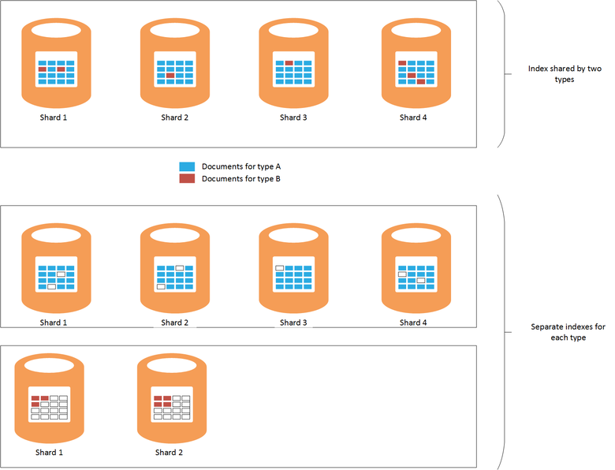

    ***Figure 1. The effects of sharing an index between types***

    Figure 1 depicts this scenario. In the upper part of the diagram, the same index is shared by documents of type A and type B. There are many more documents of type A than type B. Searches for type A will involve querying all four shards. The lower part of the diagram shows the effect if separate indexes are created for each type. In this case, searches for type A will only require accessing two shards.

- Small shards can be more evenly distributed than large shards, making it easier for Elasticsearch to spread the load across nodes.

- Different types might have different retention periods. It can be difficult to archive old data that shares shards with active data.


However, under some circumstances sharing an index across types can be efficient if:

- Searches regularly span types held in the same index.

- The types only have a small number of documents each; maintaining a separate set of shards for each type can become a significant overhead in this case.


### Optimizing Index Types

An Elasticsearch index contains a copy of the original JSON documents that were used to populate it. This information is held in the [*\_source*](https://www.elastic.co/guide/en/elasticsearch/reference/current/mapping-source-field.html#mapping-source-field) field of each indexed item. This data is not searchable, but by default is returned by *get* and *search* requests. However, this field incurs overhead and occupies storage, making shards larger and increasing the volume of I/O performed. You can disable the *\_source* field on a per type basis:

```http
PUT my_index
{
  "mappings": {
    "my_type": {
      "_source": {
        "enabled": false
      }
    }
  }
}
```
Disabling this field also removes the ability to perform the following operations:

- Updating data in the index by using the *update* API.

- Performing searches that return highlighted data.

- Re-indexing from one Elasticsearch index directly to another.

- Changing mappings or analysis settings.

- Debugging queries by viewing the original document.


### Re-indexing Data

The number of shards available to an index ultimately determines the capacity of the index. You can take an initial (and informed) guess at how many shards will be required, but you should always consider your document re-indexing strategy up front. In many cases, re-indexing may be an intended task as data grows; you may not want to allocate a large number of shards to an index initially, for the sake of search optimization, but allocate new shards as the volume of data expands. In other cases re-indexing might need to be performed on a more ad-hoc basis if your estimates about data volume growth simply prove to be inaccurate.

> [AZURE.NOTE] Re-indexing might not be necessary for data that ages quickly. In this case, an application might create a new index for each period of time. Examples include performance logs or audit data which could be stored in a fresh index each day.

<!-- -->

Re-indexing effectively involves creating a new index from the data in an old one, and then removing the old index. If an index is large, this process can take time, and you may need to ensure that the data remains searchable during this period. For this reason, you should create an [alias for each index](https://www.elastic.co/guide/en/elasticsearch/reference/current/indices-aliases.html), and queries should retrieve data through these aliases. While re-indexing, keep the alias pointing at the old index, and then switch it to reference the new index once re-indexing is complete. This approach is also useful for accessing time-based data which creates a new index each day; to access the current data use an alias that rolls over to the new index as it is created.

### Managing Mappings

Elasticsearch uses mappings to determine how to interpret the data that occurs in each field in a document. Each type has its own mapping, which effectively defines a schema for that type. Elasticsearch uses this information to generate inverted indexes for each field in the documents in a type. In any document, each field has a datatype (such as *string*, *date*, or *long*) and a value. You can specify the mappings for an index when the index is first created, or they can be inferred by Elasticsearch when new documents are added to a type. However, consider the following points:

- Mappings generated dynamically can cause errors depending on how fields are interpreted when documents are added to an index. For example, document 1 could contain a field A that holds a number and causes Elasticsearch to add a mapping that specifies that this field is a *long*. If a subsequent document is added in which field A contains non-numeric data, then it will fail. In this case, field A should probably have been interpreted as a string when the first document was added. Specifying this mapping when the index is created can help to prevent such problems.

- Design your documents to avoid generating excessively large mappings as this can add significant overhead when performing searches, consume lots of memory, and also cause queries to fail to find data. Adopt a consistent naming convention for fields in documents that share the same type. For example, don't use field names such as "first_name", "FirstName", and "forename" in different documents; use the same field name in each document. Additionally, do not attempt to use values as keys (this is a common approach in Column-Family databases, but can cause inefficiencies and failures with Elasticsearch.) For more information, see [Mapping Explosion](https://www.elastic.co/blog/found-crash-elasticsearch#mapping-explosion).

- Use *not_analyzed* to avoid tokenization where appropriate. For example, if a document contains a string field named *data* that holds the value "ABC-DEF" then you might attempt to perform a search for all documents that match this value as follows:

  ```http
  GET /myindex/mydata/_search
  {
    "query" : {
      "filtered" : {
        "filter" : {
          "term" : {
            "data" : "ABC-DEF"
          }
        }
      }
    }
  }
  ```

 However, this search will fail to return the expected results due to the way in which the string ABC-DEF is tokenized when it is indexed; it will be effectively split into two tokens, ABC and DEF, by the hyphen. This feature is designed to support full text searching, but if you want the string to be interpreted as a single atomic item you should disable tokenization when the document is added to the index. You can use a mapping such as this:

  ```http
  PUT /myindex
  {
    "mappings" : {
      "mydata" : {
        "properties" : {
          "data" : {
            "type" : "string",
            "index" : "not_analyzed"
          }
        }
      }
    }
  }
  ```

  For more information, see [Finding Exact Values](https://www.elastic.co/guide/en/elasticsearch/guide/current/_finding_exact_values.html#_term_filter_with_text).


### Using Doc Values

Many queries and aggregations require that data is sorted as part of the search operation. Sorting requires being able to map one or more terms to a list of documents. To assist in this process, Elasticsearch can load all of the values for a field used as a sort key into memory. This information is known as *fielddata*. The intent is that caching fielddata in memory incurs less I/O and might be faster than repeatedly reading the same data from disk. However, if a field has high cardinality then storing the fielddata in memory can consume a lot of heap space, possibly impacting the ability to perform other concurrent operations, or even exhausting storage causing Elasticsearch to fail.

As an alternative approach, Elasticsearch also supports *doc values*. A doc value is similar to an item of in-memory fielddata except that it is stored on disk and created when data is stored in an index (fielddata is constructed dynamically when a query is performed.) Doc values do not consume heap space, and so are useful for queries that sort or aggregate data across fields that can contain a very large number of unique values. Additionally, the reduced pressure on the heap can help to offset the performance differences between retrieving data from disk and reading from memory; garbage collection is likely to occur less often, and other concurrent operations that utilize memory are less likely to be effected.

You enable or disable doc values on a per-property basis in an index using the *doc_values* attribute, as shown by the following example:

```http
PUT /myindex
{
  "mappings" : {
    "mydata" : {
      "properties" : {
        "data" : {
          ...
          "doc_values": true
        }
      }
    }
  }
}
```
> [AZURE.NOTE] Doc values are enabled by default with Elasticsearch version 2.0.0 onwards.

The exact impact of using doc values is likely to be highly specific to your own data and query scenarios, so be prepared to conduct performance testing to establish their usefulness. You should also note that doc values do not work with analyzed string fields. For more information, see [Doc Values](https://www.elastic.co/guide/en/elasticsearch/guide/current/doc-values.html#doc-values).

### Using Replicas to Reduce Query Contention

A common strategy to boost the performance of queries is to create many replicas of each index. Data retrieval operations can be satisfied by fetching data from a replica. However, this strategy can severely impact the performance of data ingestion operations, so it needs to be used with care in scenarios that involve mixed workloads. Additionally, this strategy is only of benefit if replicas are distributed across nodes and do not compete for resources with primary shards that are part of the same index. Remember that it is possible to increase or decrease the number of replicas for an index dynamically.

### Using the Shard Request Cache

Elasticsearch can cache the local data requested by queries on each shard in memory. This enables searches that retrieve the same data to run more quickly; data can be read from memory rather than disk storage. Caching data in this way can therefore improve the performance of some search operations, at the cost of reducing the memory available to other tasks being performed concurrently. There is also the risk that data served from the cache is outdated. The data in the cache is only invalidated when the shard is refreshed and the data has changed; the frequency of refreshes is governed by the value of the *refresh_interval* setting of the index.

The request caching for an index is disabled by default, but you can enable it as follows:

```http
PUT /myindex/_settings
{
  "index.requests.cache.enable": true
}
```

The shard request cache is most suitable for information that remains relatively static, such as historical or logging data.

### Using Client Nodes

All queries are processed by the node that first receives the request. This node sends further requests to all other nodes containing shards for the indices being queried, and then accumulates the results for returning the response. If a query involves aggregating data or performing complex computations, the initial node is responsible for performing the appropriate processing. If your system has to support a relatively small number of complex queries, consider creating a pool of client nodes to alleviate the load from the data nodes. Conversely, if your system has to handle a large number of simple queries, then submit these requests direct to the data nodes, and use a load balancer to distribute the requests evenly.

### Tuning Queries

The following points summarize tips for maximizing the performance of Elasticsearch queries:

- Avoid queries that involve wild cards wherever possible.

- If the same field is subject to full-text searching and exact matching, then consider storing the data for the field in analyzed and non-analyzed forms. Perform full-text searches against the analyzed field, and exact matches against the non-analyzed field.

- Only return the data necessary. If you have large documents, but an application only requires information held in a subset of the fields, then return this subset from queries rather than entire documents. This strategy can reduce the network bandwidth requirements of the cluster.

- Wherever possible, use filters instead of queries when searching for data. A filter simply determines whether a document matches a given criterion whereas a query also calculates how close a match a document is (scoring). Internally, the values generated by a filter are stored as a bitmap indicating match/no-match for each document, and they can be cached by Elasticsearch. If the same filter criterion occurs subsequently, the bitmap can be retrieved from cache and used to quickly fetch the matching documents. For more information, see [Internal Filter Operation](https://www.elastic.co/guide/en/elasticsearch/guide/current/_finding_exact_values.html#_internal_filter_operation).

- Use *bool* filters for performing static comparisons, and only use *and*, *or*, and *not* filters for dynamically calculated filters, such as those that involve scripting or the *geo-\** filters.

- If a query combines *bool* filters with *and*, *or*, or *not* with *geo-** filters, place the *and*/*or*/*not geo-** filters last so that they operate on the smallest data set possible.

    Similarly, use a *post_filter* to run expensive filter operations. These filters will be performed last.

- Use aggregations rather than facets. Avoid calculating aggregates that are analyzed or that have many possible values.

    > **Note**: Facets have been removed in Elasticsearch version 2.0.0.

- Use the *cardinality* aggregation in preference to the *value_count* aggregation unless your application requires an exact count of matching items. An exact count can become quickly outdated, and many applications only require a reasonable approximation.

- Avoid scripting. Scripts in queries and filters can be expensive and the results are not cached. Long-running scripts can consume search threads indefinitely, causing subsequent requests to be queued. If the queue fills up, further requests will be rejected.

## Testing and Analyzing Aggregation and Search Performance

This section describes the results of a series of tests that were performed against varying cluster and index configurations. Two types of tests were performed, as follows:

- **The *ingestion and query* test**. This test started with an empty index which was populated as the test proceeded by performing bulk insert operations (each operation added 1000 documents). At the same time, a number of queries designed to search for documents added during the preceding 15 minute period and generate aggregations were repeated at 5 second intervals. This test was typically allowed to run for 24 hours, to reproduce the effects of a challenging workload comprising large-scale data ingestion with near real-time queries.

- **The *query-only* test**. This test is similar to the *ingestion and query* test except that the ingestion part is omitted, and the index on each node is pre-populated with 100 million documents. An amended set of queries is performed; the time element limiting documents to those added in the last 15 minutes was removed as the data was now static. The tests ran for 90 minutes; there is less time needed to establish a performance pattern due to the fixed amount of data.

---

Each document in the index had the same schema. This table summarizes the fields in the schema:

Name                          | Type         | Notes |
  ----------------------------- | ------------ | -------------------------------------------------------- |
  Organization                  | String      | The test generates 200 unique organizations. |
  CustomField1 - CustomField5   |String       |These are five string fields which are set to the empty string.|
  DateTimeRecievedUtc           |Timestamp    |The date and time at which the document was added.|
  Host                          |String       |This field is set to the empty string.|
  HttpMethod                    |String       |This field is set to one of the following values: "POST","GET","PUT".|
  HttpReferrer                  |String       |This field is set to the empty string.|
  HttpRequest                   |String       |This field is populated with random text between 10 and 200 characters in length.|
  HttpUserAgent                 |String       |This field is set to the empty string.|
  HttpVersion                   |String       |This field is set to the empty string.|
  OrganizationName              |String       |This field is set to the same value as the Organization field.|
  SourceIp                      |IP           |This field contains an IP address indicating the "origin" of the data. |
   SourceIpAreaCode              |Long         |This field is set to 0.|
  SourceIpAsnNr                 |String       |This field is set to "AS\#\#\#\#\#".|
  SourceIpBase10                |Long         |This field is set to 500.|
  SourceIpCountryCode           |String       |This field contains a 2-character country code. |
  SourceIpCity                  |String       |This field contains a string identifying a city in a country. |
  SourceIpLatitude              |Double       |This field contains a random value.|
  SourceIpLongitude             |Double       |This field contains a random value.|
  SourceIpMetroCode             |Long         |This field is set to 0.|
  SourceIpPostalCode            |String       |This field is set to the empty string.|
  SourceLatLong                 |Geo point   |This field is set to a random geo point.|
  SourcePort                    |String       |This field is populated with the string representation of a random number|
  TargetIp                      |IP           |This is populated with a random IP address in the range 0.0.100.100 to 255.9.100.100|
  SourcedFrom                   |String       |This field is set to the string "MonitoringCollector".|
  TargetPort                    |String       |This field is populated with the string representation of a random number|
  Rating                        |String       |This field is populated with one of 20 different string values selected at random.|
  UseHumanReadableDateTimes     |Boolean      |This field is set to false.|
 
The following queries were performed as a batch by each iteration of the tests. The names in italics are used to refer to these queries in the remainder of this document. Note that the time criterion (documents added in the last 15 minutes) was omitted from the *query-only* tests:

- How many documents with each *Rating* value have been entered in the last 15 minutes (*Count By Rating*)?

- How many documents have been added in each 5 minute interval during the last 15 minutes (*Count Over Time*)?

- How many documents of each *Rating* value have been added for each country in the last 15 minutes (*Hits By Country*)?

- Which 15 organizations occur most frequently in documents added in the last 15 minutes (*Top 15 Organizations*)?

- How many different organizations occur in documents added in the last 15 minutes (*Unique Count Organizations*)?

- How many documents have been added in the last 15 minutes (*Total Hits Count*)?

- How many different *SourceIp* values occur in documents added in the last 15 minutes (*Unique IP Count*)?


The definition of the index and the details of the queries are outlined in the [appendix](#appendix-the-query-and-aggregation-performance-test).

The tests were designed to understand the effects of the following variables:

- **Disk type**. Tests were performed on a 6-node cluster of D4 VMs using standard storage (HDDs) and repeated on a 6-node cluster of DS4 VMs using premium storage (SSDs).

- **Machine size - scaling up**. Tests were performed on a 6-node cluster comprising DS3 VMs (designated as the *small* cluster), repeated on a cluster of DS4 VMs (the *medium* cluster), and repeated again on a cluster of DS14 machines (the *large* cluster). The following table summarizes the key characteristics of each VM SKU:

 Cluster | VM SKU        | Number of Cores | Number of Data Disks | RAM (GB) |
---------|---------------|-----------------|----------------------|----------|
 Small   | Standard DS3  | 4               | 8                    | 14       |
 Medium  | Standard DS4  | 8               | 16                   | 28       |
 Large   | Standard DS14 | 16              | 32                   | 112      |

- **Cluster size - scaling out**. Tests were performed on clusters of DS14 VMs comprising 1, 3, and 6 nodes.

- **Number of index replicas**. Tests were performed using indexes configured with 1 and 2 replicas.

- **Doc values**. Initially the tests were performed with the index setting *doc_values* set to *true* (the default value). Selected tests were repeated with *doc_values* set to *false*.

- **Caching**. Tests were conducted with the shard request cache enabled on the index.

- **Number of shards**. Tests were repeated using varying numbers of shards to establish whether queries ran more efficiently across indexes containing fewer, larger shards or more, smaller shards.


## Performance Results - Disk Type

Disk performance was evaluated by running the *ingestion and query* test on the 6-node cluster of D4 VMs (using HDDs), and on the 6-node cluster of DS4 VMs (using SSDs). The configuration of Elasticsearch in both clusters was the same. The data was spread across 16 disks on each node, and each node had 14GB of RAM allocated to the JVM running Elasticsearch; the remaining memory (also 14GB) was left for operating system use. Each test ran for 24 hours. This period was selected to enable the effects of the increasing volume of data to become apparent and to allow the system to stabilize. The table below summarizes the results, highlighting the response times of the various operations that comprised the test.

 Cluster | Operation/Query            | Average Response Time (ms) |
---------|----------------------------|----------------------------|
 D4      | Ingestion                  | 978                        |
         | Count By Rating            | 103                        |
         | Count Over Time            | 134                        |
         | Hits By Country            | 199                        |
         | Top 15 Organizations       | 137                        |
         | Unique Count Organizations | 139                        |
         | Unique IP Count            | 510                        |
         | Total Hits Counts          | 89
 DS4     | Ingestion                  | 511                        |
         | Count By Rating            | 187                        |
         | Count Over Time            | 411                        |
         | Hits By Country            | 402                        |
         | Top 15 Organizations       | 307                        |
         | Unique Count Organizations | 320                        |
         | Unique IP Count            | 841                        |
         | Total Hits Counts          | 236                        |

At first glance, it would appear that the DS4 cluster performed queries less well than the D4 cluster, at times doubling (or worse) the response time. This does not tell the whole story though. The next table shows the number of ingestion operations performed by each cluster (remember that each operation loads 1000 documents):

 Cluster | \# Ingestion Operations |
---------|-------------------------|
 D4      | 264769                  |
 DS4     | 503157                  |

The DS4 cluster was able to load nearly twice as much data than the D4 cluster during the test. Therefore, when analyzing the response times for each operation, you also need to consider how many documents each query has to scan, and how many documents are returned. These are dynamic figures as the volume of documents in the index is continually growing. You cannot simply divide 503137 by 264769 (the number of ingestion operations performed by each cluster) and then multiply the result by the average response time for each query performed by the D4 cluster to give a comparative information as this ignores the amount of I/O being performed concurrently by the ingestion operation. Instead, you should measure the physical amount of data being written to and read from disk as the test proceeds. The JMeter test plan captures this information for each node. The summarized results are:

 Cluster | Average bytes written/read by each operation |
---------|----------------------------------------------|
 D4      | 13471557                                     |
 DS4     | 24643470                                     |

This data shows that the DS4 cluster was able to sustain an I/O rate approximately 1.8 times that of the D4 cluster. Given that, apart from nature of the disks, all other resources are the same, the difference must be due to using SSDs rather HDDs.

To help justify this conclusion, the following graphs illustrate the how the I/O was performed over time by each cluster:

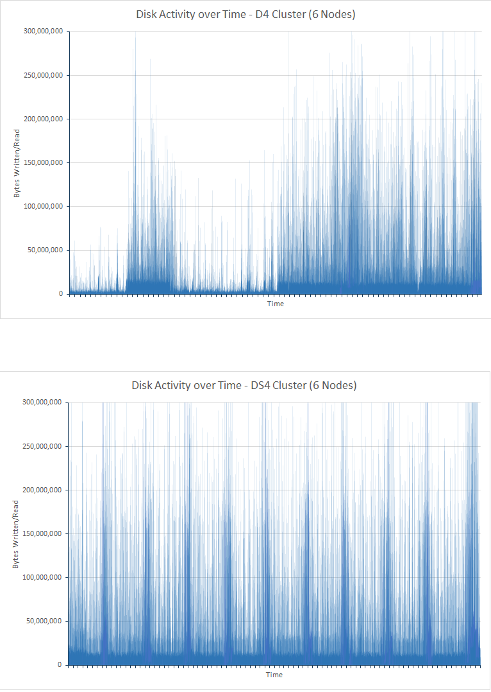

<!-- -->

***Figure 2. Disk activity for the D4 and DS4 clusters***

The graph for the D4 cluster shows significant variation, especially during the first half of the test. This was likely due to throttling to reduce the I/O rate. In the initial stages of the test, the queries are able to run quickly as there is little data to analyze. The disks in the D4 cluster are therefore likely to be operating close to their IOPS capacity, although each I/O operation might not be returning much data. The DS4 cluster is able to support a higher IOPS rate and does not suffer the same degree of throttling; the I/O rates are more regular. To support this theory, the next pair of graphs show how the CPU was blocked by disk I/O over time (the disk wait times shown in the graphs are the proportion of the time that the CPU spent waiting for I/O):

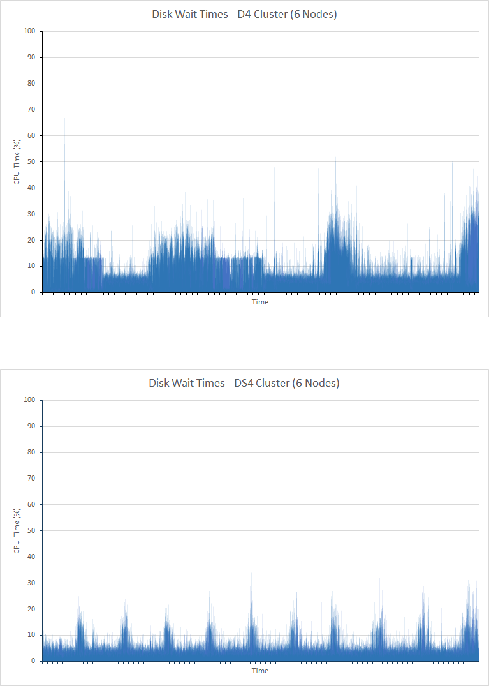

***Figure 3. CPU disk I/O wait times for the D4 and DS4 clusters***

It is important to understand that there are two predominant reasons for I/O operations to block the CPU:

- The I/O subsystem could be reading or writing data to or from disk.

- The I/O subsystem could be throttled by the host environment. Azure disks implemented by using HDDs have a maximum throughput of 500 IOPS, and SSDs have a maximum throughput of 5000 IOPS.


For the D4 cluster, the amount of time spent waiting for I/O during the first half of the test correlates closely in an inverted manner with the graph showing the I/O rates; periods of low I/O correspond to periods of significant time the CPU spends blocked; this indicates that I/O is being throttled. As more data is added to the cluster the situation changes, and in the second half of the test peaks in I/O wait times correspond with peaks in I/O throughput. At this point, the CPU is blocked while performing real I/O. Again, with the DS4 cluster, the time spent waiting for I/O is much more even, and each peak matches an equivalent peak in I/O performance rather than a trough; this implies that there is little or no throttling occurring.

There is one other factor to consider. During the test, the D4 cluster generated 10584 ingestion errors, and 21 query errors. The test on the DS4 cluster produced no errors.

## Performance Results - Scaling Up

Scale-up testing was performed by running tests against 6-node clusters of DS3, DS4, and DS14 VMs. These SKUS were selected because a DS4 VM provides twice as many CPU cores and memory as a DS3, and a DS14 machine doubles the CPU resources again while providing four times the amount of memory. The table below compares the key aspects of each SKU:

 SKU  | \#CPU Cores | Memory (GB) | Max Disk IOPS | Max Bandwidth (MB/s)|
------|-------------|-------------|---------------|--------------|
 DS3  | 4           | 14          | 12,800| 128 |
 DS4  | 8           | 28          | 25,600| 256 |
 DS14 | 16          | 112         | 50,000| 512 |

The following table summarizes the results of running the tests on the small (DS3), medium (DS4), and large (DS14) clusters. Each VM used SSDs to hold the data. Each test ran for 24 hours:

> **Note**: The table reports the number of successful requests for each type of query (failures are not included). The number of requests attempted for each type of query is roughly the same during a run of the test. This is because the JMeter test plan executes a single occurrence of each query (Count By Rating, Count Over Time, Hits By Country, Top 15 Organizations, Unique Count Organizations, Unique IP Count, and Total Hits Counts) together in a single unit known as a *test transaction* (this transaction is independent of the task that performs the ingestion operation, which is run by a separate thread). Each iteration of the test plan performs a single test transaction. The number of test transactions completed is therefore a measure of the response time of the slowest query in each transaction.

| Cluster      | Operation/Query            | Number of Requests | Average Response Time (ms) |
|--------------|----------------------------|--------------------|----------------------------|
| Small (DS3)  | Ingestion                  | 207284             | 3328                       |
|              | Count By Rating            | 18444              | 268                        |
|              | Count Over Time            | 18444              | 340                        |
|              | Hits By Country            | 18445              | 404                        |
|              | Top 15 Organizations       | 18439              | 323                        |
|              | Unique Count Organizations | 18437              | 338                        |
|              | Unique IP Count            | 18442              | 468                        |
|              | Total Hits Counts          | 18428              | 294   
|||||
| Medium (DS4) | Ingestion                  | 503157             | 511                        |
|              | Count By Rating            | 6958               | 187                        |
|              | Count Over Time            | 6958               | 411                        |
|              | Hits By Country            | 6958               | 402                        |
|              | Top 15 Organizations       | 6958               | 307                        |
|              | Unique Count Organizations | 6956               | 320                        |
|              | Unique IP Count            | 6955               | 841                        |
|              | Total Hits Counts          | 6958               | 236                        |
|||||
| Large (DS14) | Ingestion                  | 502714             | 511                        |
|              | Count By Rating            | 7041               | 201                        |
|              | Count Over Time            | 7040               | 298                        |
|              | Hits By Country            | 7039               | 363                        |
|              | Top 15 Organizations       | 7038               | 244                        |
|              | Unique Count Organizations | 7037               | 283                        |
|              | Unique IP Count            | 7037               | 681                        |
|              | Total Hits Counts          | 7038               | 200                        |

These figures show that, for this test, the performance of the DS4 and DS14 cluster were reasonably similar. The response times for the query operations for the DS3 cluster also appear to compare favorably initially, and the number of query operations performed is far in excess of the values for the DS4 and DS14 cluster. However, one should also take strong notice of the ingestion rate and the consequent number of documents being searched. In the DS3 cluster ingestion is far more constrained, and by the end of the test the database only contained about 40% of the documents read in by each of the other two clusters. This is could be due to the processing resources, network, and disk bandwidth available to a DS3 VM compared to a DS4 or DS14 VM. Given that a DS4 VM has twice as many resources available as a DS3 VM, and a DS14 has twice (four times for memory) the resources of a DS4 VM, one question remains: Why is the difference in ingestion rates between the DS4 and DS14 clusters significantly less than that which occurs between the DS3 and DS4 clusters? This could be due to the network utilization and bandwidth limits of Azure VMs. The graphs below show this data for all three clusters:

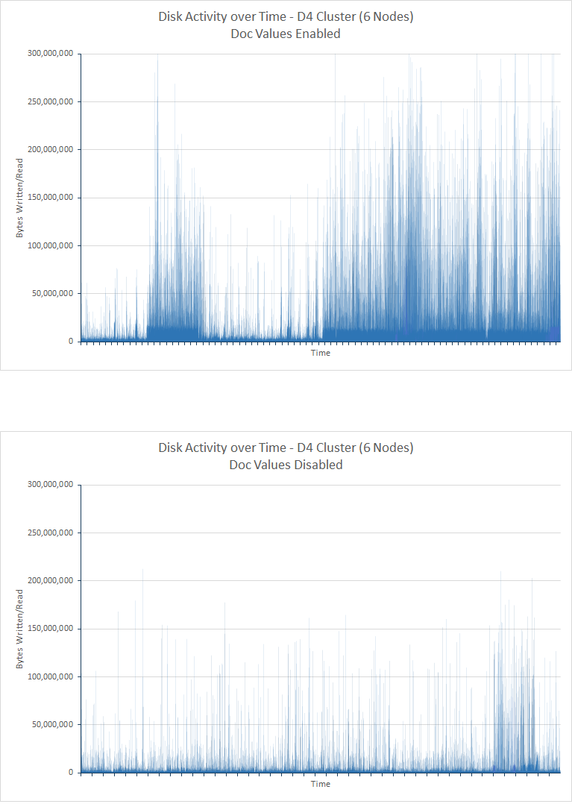

***Figure 4. Network utilization for the DS3, DS4, and DS14 clusters performing the *ingestion and query* test***

<!-- -->

The limits of available network bandwidth with Azure VMs are not published and can vary, but the fact that network activity appears to have levelled off at an average of around 2.75GBps for both the DS4 and DS14 tests suggests that such a limit has been reached and has become the primary factor in restricting throughput. In the case of the DS3 cluster, the network activity was considerably lower so the lower performance is more likely due to constraints in the availability of other resources.

To isolate the effects of the ingestion operations and illustrate how query performance varies as nodes scale up, a set of query-only tests was performed using the same nodes. The following table summarizes the results obtained on each cluster:

> [AZURE.NOTE] You should not compare the performance and number of requests executed by queries in *query-only* test with those run by the *ingestion and query* test. This is because the queries have been modified and the volume of documents involved is different.

| Cluster      | Operation/Query            | Number of Requests | Average Response Time (ms) |
|--------------|----------------------------|--------------------|----------------------------|
| Small (DS3)  | Count By Rating            | 464                | 11758                      |
|              | Count Over Time            | 464                | 14699                      |
|              | Hits By Country            | 463                | 14075                      |
|              | Top 15 Organizations       | 464                | 11856                      |
|              | Unique Count Organizations | 462                | 12314                      |
|              | Unique IP Count            | 461                | 19898                      |
|              | Total Hits Counts          | 462                | 8882  
|||||
| Medium (DS4) | Count By Rating            | 1045               | 4489                       |
|              | Count Over Time            | 1045               | 7292                       |
|              | Hits By Country            | 1053               | 7564                       |
|              | Top 15 Organizations       | 1055               | 5066                       |
|              | Unique Count Organizations | 1051               | 5231                       |
|              | Unique IP Count            | 1051               | 9228                       |
|              | Total Hits Counts          | 1051               | 2180                       |
|||||
| Large (DS14) | Count By Rating            | 1842               | 1927                       |
|              | Count Over Time            | 1839               | 4483                       |
|              | Hits By Country            | 1838               | 4761                       |
|              | Top 15 Organizations       | 1842               | 2117                       |
|              | Unique Count Organizations | 1837               | 2393                       |
|              | Unique IP Count            | 1837               | 7159                       |
|              | Total Hits Counts          | 1837               | 642                        |

This time, the trends in the average response times across the different clusters is clearer. Network utilization is well below the 2.75GBps required earlier by the DS4 and DS14 clusters (which probably saturated the network in the ingestion and query tests), and the 1.5GBps for the DS3 cluster. In fact, it is closer to 200MBps in all cases as shown by the graphs below:


***Figure 5. Network utilization for the DS3, DS4 and DS14 clusters performing the *query-only* test***

The limiting factor in the DS3 and DS4 clusters now appears to be CPU utilization, which is close to 100% for much of the time. In the DS14 cluster the CPU usage averages just over 80%. This is still high, but clearly highlights the advantages of having more CPU cores available. The following image depicts the CPU usage patterns for the DS3, DS4, and DS14 clusters.

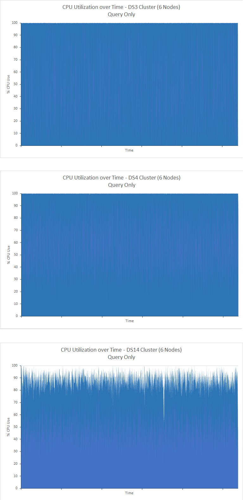

***Figure 6. CPU utilization for the DS3 and DS14 clusters performing the *query-only* test***

## Performance Results - Scaling Out

To illustrate how the system scales out with the number of nodes, tests were run using DS14 clusters comprising 1, 3, and 6 nodes. This time, only the *query-only* test was performed, using 100 million documents and running for 90 minutes:

> [AZURE.NOTE] For detailed information on how scaling out can affect the behavior of data ingestion operations, see the document [Maximizing Data Ingestion Performance with Elasticsearch on Azure](https://github.com/mspnp/azure-guidance/blob/master/Elasticsearch-Data-Ingestion-Performance.md).

| Cluster | Operation/Query            | Number of Requests | Average Response Time (ms) |
|---------|----------------------------|--------------------|----------------------------|
| 1 Node  | Count By Rating            | 288                | 6216                       |
|         | Count Over Time            | 288                | 28933                      |
|         | Hits By Country            | 288                | 29455                      |
|         | Top 15 Organizations       | 288                | 9058                       |
|         | Unique Count Organizations | 287                | 19916                      |
|         | Unique IP Count            | 284                | 54203                      |
|         | Total Hits Counts          | 287                | 3333                       |
|||||
| 3 Nodes | Count By Rating            | 1194               | 3427                       |
|         | Count Over Time            | 1194               | 5381                       |
|         | Hits By Country            | 1191               | 6840                       |
|         | Top 15 Organizations       | 1196               | 3819                       |
|         | Unique Count Organizations | 1190               | 2938                       |
|         | Unique IP Count            | 1189               | 12516                      |
|         | Total Hits Counts          | 1191               | 1272                       |
|||||
| 6 Nodes | Count By Rating            | 1842               | 1927                       |
|         | Count Over Time            | 1839               | 4483                       |
|         | Hits By Country            | 1838               | 4761                       |
|         | Top 15 Organizations       | 1842               | 2117                       |
|         | Unique Count Organizations | 1837               | 2393                       |
|         | Unique IP Count            | 1837               | 7159                       |
|         | Total Hits Counts          | 1837               | 642                        |

The number of nodes makes a significant difference in the query performance of the cluster, although in a non-linear manner; the 3 node cluster completes approximately 4 times as many queries as the single node cluster, while the 6 node cluster handles 6 times as many. To help explain this non-linearity, the following graphs show how the CPU was being consumed by the three clusters:

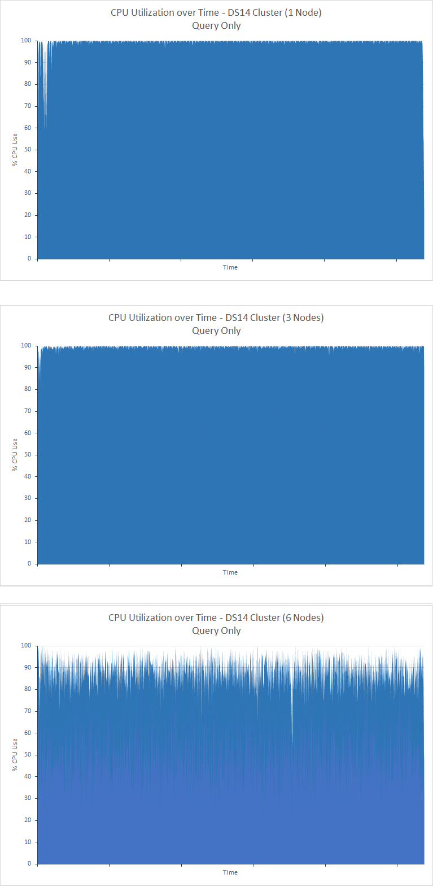

***Figure 7. CPU utilization for the 1, 3, and 6-node clusters performing the *query-only* test***

The single-node and 3-node clusters are CPU-bound, while although CPU utilization is high in the 6-node cluster there is spare processing capacity available. In this case, other factors are likely to be limiting the throughput. This could be confirmed by testing with 9 and 12 nodes, which would likely show further spare processing capacity.

The data in the table above also shows how the average response times for the queries vary. This is the item that that is most informative when testing how a system scales for specific types of query; some searches are clearly far more efficient when spanning more nodes than others. This could be due to the ratio between the number of nodes and the number of documents in the cluster increasing; each cluster contained 100 million documents. When performing searches that involve aggregating data, Elasticsearch will process and buffer the data retrieved as part of the aggregation process in memory on each node. If there are more nodes, there is less data to retrieve, buffer, and process on each node.

## Performance Results - Number of Replicas

The *ingestion and query* tests were run against an index with a single replica. The tests were repeated on the 6-node DS4 and DS14 clusters using an index configured with two replicas. All tests ran for 24 hours. The table below shows the comparative results for one and two replicas:

| Cluster | Operation/Query            | Average Response Time (ms) - 1 Replica | Average Response Time (ms) - 2 Replicas | % Difference in Response Time |
|---------|----------------------------|----------------------------------------|-----------------------------------------|-------------------------------|
| DS4     | Ingestion                  | 511                                    | 655                                     | +28%                          |
|         | Count By Rating            | 187                                    | 168                                     | -10%                          |
|         | Count Over Time            | 411                                    | 309                                     | -25%                          |
|         | Hits By Country            | 402                                    | 562                                     | +40%                          |
|         | Top 15 Organizations       | 307                                    | 366                                     | +19%                          |
|         | Unique Count Organizations | 320                                    | 378                                     | +18%                          |
|         | Unique IP Count            | 841                                    | 987                                     | +17%                          |
|         | Total Hits Counts          | 236                                    | 236                                     | +0%                           |
||||||
| DS14    | Ingestion                  | 511                                    | 618                                     | +21%                          |
|         | Count By Rating            | 201                                    | 275                                     | +37%                          |
|         | Count Over Time            | 298                                    | 466                                     | +56%                          |
|         | Hits By Country            | 363                                    | 529                                     | +46%                          |
|         | Top 15 Organizations       | 244                                    | 407                                     | +67%                          |
|         | Unique Count Organizations | 283                                    | 403                                     | +42%                          |
|         | Unique IP Count            | 681                                    | 823                                     | +21%                          |
|         | Total Hits Counts          | 200                                    | 221                                     | +11%                          |

The ingestion rate decreased as the number of replicas increased. This should be expected as Elasticsearch is writing more copies of each document, generating additional disk I/O.  This is reflected by the graphs for the DS14 cluster for indexes with 1 and 2 replicas shown in the image below. In the case of the index with 1 replica, the average I/O rate was 16896573 bytes/second. For the index with 2 replicas, the average I/O rate was 33986843 bytes/second; just over twice as many.


***Figure 8. Disk I/O rates for nodes with 1 and 2 replicas performing the *ingestion and query* test***

| Cluster | Query                      | Average Response Time (ms) - 1 Replica | Average Response Time (ms) - 2 Replicas |
|---------|----------------------------|----------------------------------------|-----------------------------------------|
| DS4     | Count By Rating            | 4489                                   | 4079                                    |
|         | Count Over Time            | 7292                                   | 6697                                    |
|         | Hits By Country            | 7564                                   | 7173                                    |
|         | Top 15 Organizations       | 5066                                   | 4650                                    |
|         | Unique Count Organizations | 5231                                   | 4691                                    |
|         | Unique IP Count            | 9228                                   | 8752                                    |
|         | Total Hits Counts          | 2180                                   | 1909                                    |
|||||
| DS14    | Count By Rating            | 1927                                   | 2330                                    |
|         | Count Over Time            | 4483                                   | 4381                                    |
|         | Hits By Country            | 4761                                   | 5341                                    |
|         | Top 15 Organizations       | 2117                                   | 2560                                    |
|         | Unique Count Organizations | 2393                                   | 2546                                    |
|         | Unique IP Count            | 7159                                   | 7048                                    |
|         | Total Hits Counts          | 642                                    | 708                                     |

These results show an improvement in average response time for the DS4 cluster, but an increase for the DS14 cluster. To help interpret these results, you should also consider the number of queries performed by each test:

| Cluster | Query                      | Number Performed - 1 Replica | Number Performed - 2 Replicas |
|---------|----------------------------|------------------------------|-------------------------------|
| DS4     | Count By Rating            | 1054                         | 1141                          |
|         | Count Over Time            | 1054                         | 1139                          |
|         | Hits By Country            | 1053                         | 1138                          |
|         | Top 15 Organizations       | 1055                         | 1141                          |
|         | Unique Count Organizations | 1051                         | 1136                          |
|         | Unique IP Count            | 1051                         | 1135                          |
|         | Total Hits Counts          | 1051                         | 1136                          |
|||||
| DS14    | Count By Rating            | 1842                         | 1718                          |
|         | Count Over Time            | 1839                         | 1716                          |
|         | Hits By Country            | 1838                         | 1714                          |
|         | Top 15 Organizations       | 1842                         | 1718                          |
|         | Unique Count Organizations | 1837                         | 1712                          |
|         | Unique IP Count            | 1837                         | 1712                          |
|         | Total Hits Counts          | 1837                         | 1712                          |

This data shows that the number of queries performed by the DS4 cluster increased in-line with the decrease in average response time, but again the converse is true of the DS14 cluster. One significant factor is that the CPU utilization of the DS4 cluster in the 1-replica and 2-replica tests was unevenly spread; some nodes exhibited close to 100% utilization while others had spare processing capacity. The improvement in performance is most likely due to the increased ability to distribute processing across the nodes of the cluster. The following image shows the variation in CPU processing between the most lightly and heavily used VMs (nodes 4 and 3):

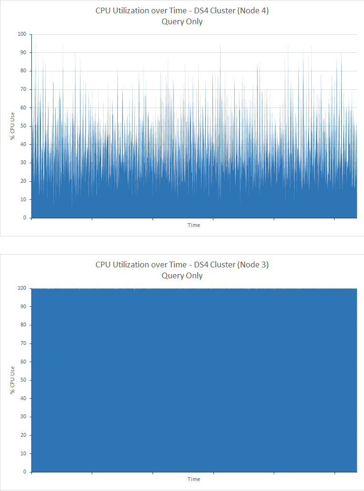

***Figure 9. CPU utilization for the least-used and most-used nodes in the DS4 cluster performing the *query-only* test***

For the DS14 cluster this was not the case. CPU utilization for both tests was lower across all nodes, and the availability of a second replica became less of an advantage and more of an overhead:

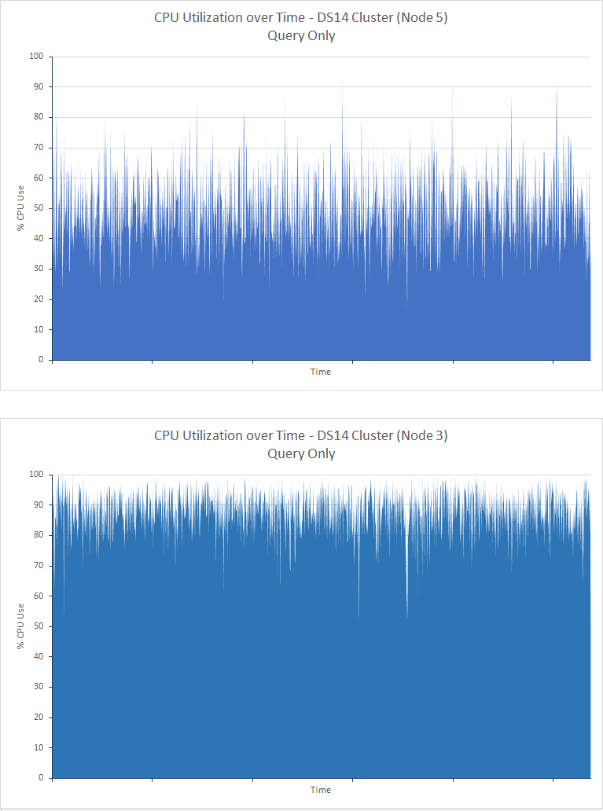

***Figure 10. CPU utilization for the least-used and most-used nodes in the DS14 cluster performing the *query-only* test***

These results show the need to benchmark your system carefully when deciding whether to use multiple replicas. You should always have at least one replica of each index (unless you are willing to risk losing data if a node fails), but additional replicas can impose a burden on the system for little benefit, depending on your workloads and the hardware resources available to the cluster.

## Performance Results - Doc Values

The *ingestion and query* tests were conducted with doc values enabled, causing Elasticsearch to store data used for sorting fields on disk. The tests were repeated with doc values disabled, so Elasticsearch constructed fielddata dynamically and cached it in memory. All tests ran for 24 hours. The table below compares the response times for tests run against clusters of 6 nodes built using D4, DS4, and DS14 VMs (the D4 cluster uses regular hard disks, while the DS4 and DS14 clusters use SSDs).

| Cluster | Operation/Query            | Average Response Time (ms) - Doc Values Enabled | Average Response Time (ms) - Doc Values Disabled | % Difference in Response Time |
|---------|----------------------------|-------------------------------------------------|--------------------------------------------------|-------------------------------|
| D4      | Ingestion                  | 978                                             | 835                                              | -15%                          |
|         | Count By Rating            | 103                                             | 132                                              | +28%                          |
|         | Count Over Time            | 134                                             | 189                                              | +41%                          |
|         | Hits By Country            | 199                                             | 259                                              | +30%                          |
|         | Top 15 Organizations       | 137                                             | 184                                              | +34%                          |
|         | Unique Count Organizations | 139                                             | 197                                              | +42%                          |
|         | Unique IP Count            | 510                                             | 604                                              | +18%                          |
|         | Total Hits Counts          | 89                                              | 134                                              | +51%                          |
||||||
| DS4     | Ingestion                  | 511                                             | 581                                              | +14%                          |
|         | Count By Rating            | 187                                             | 190                                              | +2%                           |
|         | Count Over Time            | 411                                             | 409                                              | -0.5%                         |
|         | Hits By Country            | 402                                             | 414                                              | +3%                           |
|         | Top 15 Organizations       | 307                                             | 284                                              | -7%                           |
|         | Unique Count Organizations | 320                                             | 313                                              | -2%                           |
|         | Unique IP Count            | 841                                             | 955                                              | +14%                          |
|         | Total Hits Counts          | 236                                             | 281                                              | +19%                          |
||||||
| DS14    | Ingestion                  | 511                                             | 571                                              | +12%                          |
|         | Count By Rating            | 201                                             | 232                                              | +15%                          |
|         | Count Over Time            | 298                                             | 341                                              | +14%                          |
|         | Hits By Country            | 363                                             | 457                                              | +26%                          |
|         | Top 15 Organizations       | 244                                             | 338                                              | +39%                          |
|         | Unique Count Organizations | 283                                             | 350                                              | +24%                          |
|         | Unique IP Count            | 681                                             | 909                                              | +33%                          |
|         | Total Hits Counts          | 200                                             | 245                                              | +23%                          |

The next table compares the number of ingestion operations performed by the tests:

| Cluster | \# Ingestion Operations - Doc Values Enabled | \# Ingestion Operations - Doc Values Disabled | % Difference in \# Ingestion Operations |
|---------|----------------------------------------------|-----------------------------------------------|-----------------------------------------|
| D4      | 264769                                       | 408690                                        | +54%                                    |
| DS4     | 503137                                       | 578237                                        | +15%                                    |
| DS14    | 502714                                       | 586472                                        | +17%                                    |

The improved ingestion rates occur with doc values disabled as less data is being written to disk as documents are inserted. The improved performance is especially noticeable with the D4 VM using HDDs to store data. In this case, the response time for ingestion operations also decreased by 15% (see the first table in this section). This could be due to the reduced pressure on the HDDs which were likely running close to their IOPS limits in the test with doc values enabled; see the Disk Type test for more information. The following graph compares the I/O performance of the D4 VMs with doc values enabled (values held on disk) and doc values disabled (values held in memory):


***Figure 11. Disk activity for the D4 cluster with doc values enabled and disabled***

In contrast, the ingestion values for the VMs using SSDs show a small increase in the number of documents but also an increase in the response time of the ingestion operations. With one or two small exceptions, the query response times were also worse. The SSDs are less likely to be running close to their IOPS limits with doc values enabled, so changes in performance are more likely due to increased processing activity and the overhead of managing the JVM heap. This is evident by comparing the CPU utilization with doc values enabled and disabled. The next graph highlights this data for the DS4 cluster, where most of the CPU utilization moves from the 30%-40% band with doc values enabled, to the 40%-50% band with doc values disabled (the DS14 cluster showed a similar trend):

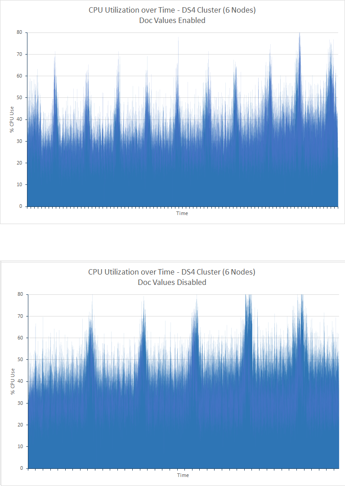

***Figure 12. CPU utilization for the DS4 cluster with doc values enabled and disabled***

To distinguish the effects that doc values on query performance from data ingestion, pairs of query-only tests were performed for the DS4 and DS14 clusters with doc values enabled and disabled. The table below summarizes the results of these tests:

| Cluster | Operation/Query            | Average Response Time (ms) - Doc Values Enabled | Average Response Time (ms) - Doc Values Disabled | % Difference in Response Time |
|---------|----------------------------|-------------------------------------------------|--------------------------------------------------|-------------------------------|
| DS4     | Count By Rating            | 4489                                            | 3736                                             | -16%                          |
|         | Count Over Time            | 7293                                            | 5459                                             | -25%                          |
|         | Hits By Country            | 7564                                            | 5930                                             | -22%                          |
|         | Top 15 Organizations       | 5066                                            | 3874                                             | -14%                          |
|         | Unique Count Organizations | 5231                                            | 4483                                             | -2%                           |
|         | Unique IP Count            | 9228                                            | 9474                                             | +3%                           |
|         | Total Hits Counts          | 2180                                            | 1218                                             | -44%                          |
||||||
| DS14    | Count By Rating            | 1927                                            | 2144                                             | +11%                          |
|         | Count Over Time            | 4483                                            | 4337                                             | -3%                           |
|         | Hits By Country            | 4761                                            | 4840                                             | +2%                           |
|         | Top 15 Organizations       | 2117                                            | 2302                                             | +9%                           |
|         | Unique Count Organizations | 2393                                            | 2497                                             | +4%                           |
|         | Unique IP Count            | 7159                                            | 7639                                             | +7%                           |
|         | Total Hits Counts          | 642                                             | 633                                              | -1%                           |

Remember that, with Elasticsearch 2.0 onwards, doc values are enabled by default. In the tests covering the DS4 cluster, disabling doc values appears to have a positive effect overall, whereas the converse is generally true for the DS14 cluster (the two cases where performance is better with doc values disabled are very marginal).

For the DS4 cluster, CPU utilization in both cases was close to 100% for the duration of both tests indicating that the cluster was CPU-bound. However, the number of queries processed decreased from 7369 to 5894 (20%) ? see the table below. Remember that if doc values are disabled Elasticsearch will dynamically generate fielddata in memory, and this consumes CPU power. This configuration has reduced the rate of disk I/O but increased stress on CPUs already running close to their maximum capabilities, so in this case queries are faster with doc values disabled but there are fewer of them.

In the DS14 tests with and without doc values CPU activity was high, but not 100%. The number of queries performed was slightly higher (approximately 4%) in tests with doc values enabled:

| Cluster | Query                      | Number Performed - Doc Values Enabled | Number Performed - Doc Values Disabled |
|---------|----------------------------|---------------------------------------|----------------------------------------|
| DS4     | Count By Rating            | 1054                                  | 845                                    |
|         | Count Over Time            | 1054                                  | 844                                    |
|         | Hits By Country            | 1053                                  | 842                                    |
|         | Top 15 Organizations       | 1055                                  | 846                                    |
|         | Unique Count Organizations | 1051                                  | 839                                    |
|         | Unique IP Count            | 1051                                  | 839                                    |
|         | Total Hits Counts          | 1051                                  | 839  
|||||                                  |
| DS14    | Count By Rating            | 1772                                  | 1842                                   |
|         | Count Over Time            | 1772                                  | 1839                                   |
|         | Hits By Country            | 1770                                  | 1838                                   |
|         | Top 15 Organizations       | 1773                                  | 1842                                   |
|         | Unique Count Organizations | 1769                                  | 1837                                   |
|         | Unique IP Count            | 1768                                  | 1837                                   |
|         | Total Hits Counts          | 1769                                  | 1837                                   |

## Performance Results - Shard Request Cache

To demonstrate how the caching index data in the memory of each node can impact performance, the *query and ingestion* test was conducted on a DS4 and a DS14 6-node cluster with index caching enabled - see the section [Using the Shard Request Cache](#using-the-shard-request-cache) for more information. The results were compared to those generated by the earlier tests using the same index but with index caching disabled. The table below summarizes the results. Note that the data has been curtailed to cover only the first 90 minutes of the test; at this point the comparative trend was apparent and continuing the test would probably have not yielded any additional insights:

| Cluster | Operation/Query            | Average Response Time (ms) - Index Cache Disabled | Average Response Time (ms) - Index Cache Enabled | % Difference in Response Time |
|---------|----------------------------|---------------------------------------------------|--------------------------------------------------|-------------------------------|
| DS4     | Ingestion                  | 504                                               | 3260                                             | +547%                         |
|         | Count By Rating            | 218                                               | 273                                              | +25%                          |
|         | Count Over Time            | 450                                               | 314                                              | -30%                          |
|         | Hits By Country            | 447                                               | 397                                              | -11%                          |
|         | Top 15 Organizations       | 342                                               | 317                                              | -7%                           |
|         | Unique Count Organizations | 370                                               | 324                                              | -12%%                         |
|         | Unique IP Count            | 760                                               | 355                                              | -53%                          |
|         | Total Hits Counts          | 258                                               | 291                                              | +12%                          |
||||||
| DS14    | Ingestion                  | 503                                               | 3365                                             | +569%                         |
|         | Count By Rating            | 234                                               | 262                                              | +12%                          |
|         | Count Over Time            | 357                                               | 298                                              | -17%                          |
|         | Hits By Country            | 416                                               | 383                                              | -8%                           |
|         | Top 15 Organizations       | 272                                               | 324                                              | -7%                           |
|         | Unique Count Organizations | 330                                               | 321                                              | -3%                           |
|         | Unique IP Count            | 674                                               | 352                                              | -48%                          |
|         | Total Hits Counts          | 227                                               | 292                                              | +29%                          |

This data shows two points of interest:

-  Data ingestion rates appear to be greatly diminished by enabling index caching, and

-  Index caching does not necessarily improve the response time of all types of query, and can have an adverse effect on certain aggregate operations such as those performed by the Count By Rating and Total Hits Counts queries.
 

To understand why the system exhibits this behavior, you should consider the number of queries successfully performed in each case during the test runs. The following table summarizes this data:

| Cluster | Operation/Query            | # of Operations/Queries - Index Cache Disabled | # of Operations/Queries - Index Cache Enabled |
|---------|----------------------------|-------------------------------------------------|------------------------------------------------|
| DS4     | Ingestion                  | 38611                                           | 13232                                          |
|         | Count By Rating            | 524                                             | 18704                                          |
|         | Count Over Time            | 523                                             | 18703                                          |
|         | Hits By Country            | 522                                             | 18702                                          |
|         | Top 15 Organizations       | 521                                             | 18706                                          |
|         | Unique Count Organizations | 521                                             | 18700                                          |
|         | Unique IP Count            | 521                                             | 18699                                          |
|         | Total Hits Counts          | 521                                             | 18701  
||||                                        |
| DS14    | Ingestion                  | 38769                                           | 12835                                          |
|         | Count By Rating            | 528                                             | 19239                                          |
|         | Count Over Time            | 528                                             | 19239                                          |
|         | Hits By Country            | 528                                             | 19238                                          |
|         | Top 15 Organizations       | 527                                             | 19240                                          |
|         | Unique Count Organizations | 524                                             | 19234                                          |
|         | Unique IP Count            | 524                                             | 19234                                          |
|         | Total Hits Counts          | 527                                             | 19236                                          |

You can see that although the ingestion rate when caching was enabled was approximately 1/3 of that when caching was disabled, the number of queries performed increased by a factor of 34. Queries no longer incur as much disk I/O and did not have to compete for disk resources. This is reflected by the graphs in figure 13 below which compare the I/O activity for all four cases:

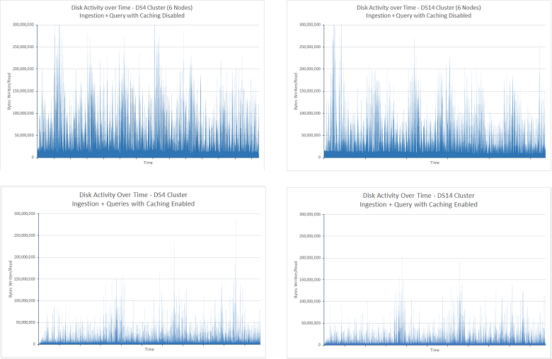

***Figure 13. Disk I/O activity for the *ingestion and query* test with index caching disabled and enabled***

The decrease in disk I/O also meant that the CPU spent less time waiting for I/O to complete. This is highlighted by figure 14:

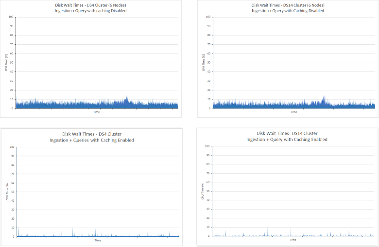

***Figure 14.CPU time spent waiting for disk I/O to complete for the *ingestion and query* test with index caching disabled and enabled***

The reduction in disk I/O meant that Elasticsearch could spend a much greater proportion of its time servicing queries from data held in memory. This increased CPU utilization, which becomes apparent if you look at the CPU utilization for all four cases. The graphs below show how CPU use was more sustained with caching enabled:

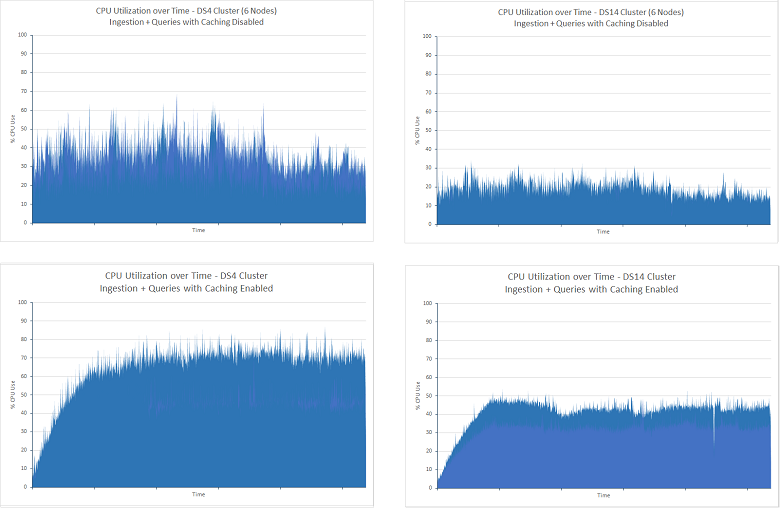

***Figure 15. CPU utilization for the *ingestion and query* test with index caching disabled and enabled***

The volume of network I/O in both scenarios for the duration of the tests was broadly similar. The tests without caching showed a gradual degradation during the test period, but the longer, 24 hour runs of these tests showed that this statistic levelled off at approximately 2.75GBps. The image below shows this data for the DS4 clusters (the data for the DS14 clusters was very similar):

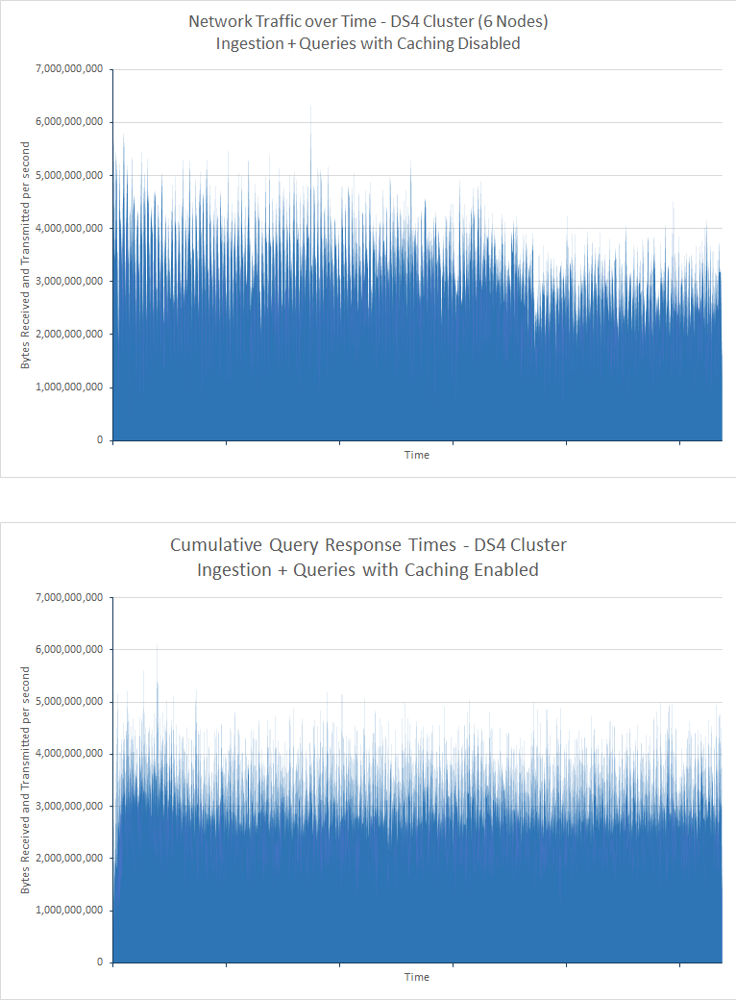

***Figure 16. Network traffic volumes for the *ingestion and query* test with index caching disabled and enabled***

As described in the [Scaling Up](#performance-results-scaling-up) test, the restrictions to network bandwidth with Azure VMs are not published and can vary, but the moderate levels of CPU and disk activity suggests that network utilization may be the limiting factor in this scenario.

Caching is more naturally suited to scenarios where data changes infrequently. To highlight the impact of caching in this scenario, the *query-only* tests were performed with caching enabled. The results are shown below (these tests ran for 90 minute, and the indexes under test contained 100 million documents):

| Cluster | Query                      | Average Response Time (ms) | # of Queries Performed |
|---------|----------------------------|----------------------------|-------------------------|
|         |                            | **Cache Disabled**         | **Cache Enabled**       |
| DS4     | Count By Rating            | 4489                       | 210                     |
|         | Count Over Time            | 7292                       | 211                     |
|         | Hits By Country            | 7564                       | 231                     |
|         | Top 15 Organizations       | 5066                       | 211                     |
|         | Unique Count Organizations | 5231                       | 211                     |
|         | Unique IP Count            | 9228                       | 218                     |
|         | Total Hits Counts          | 2180                       | 210  
||||                   |
| DS14    | Count By Rating            | 1927                       | 211                     |
|         | Count Over Time            | 4483                       | 219                     |
|         | Hits By Country            | 4761                       | 236                     |
|         | Top 15 Organizations       | 2117                       | 212                     |
|         | Unique Count Organizations | 2393                       | 212                     |
|         | Unique IP Count            | 7159                       | 220                     |
|         | Total Hits Counts          | 642                        | 211                     |

The variance in the performance of the non-cached tests is due to the difference in resources available between the DS4 and DS14 VMs. In both cases of the cached test the average response time dropped significantly as data was being retrieved directly from memory. It is also worth noting that the response times for the cached DS4 and DS14 cluster tests were very similar despite the disparity with the non-cached results. There is also very little difference between the response times for each query within each test; they all take approximately 220ms. The disk I/O rates and CPU utilization for both clusters were very low as once all the data is in memory little I/O or processing is required. The network I/O rate was similar to that of the uncached tests, confirming that network bandwidth may be a limiting factor in this test. The following graphs present this information for the DS4 cluster. The profile of the DS14 cluster was very similar:

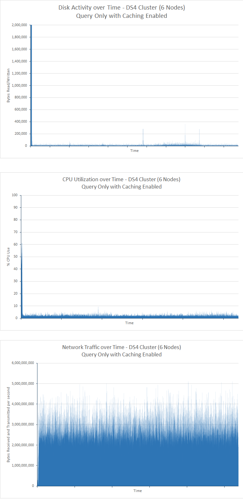

***Figure 17. Disk I/O, CPU utilization, and network utilization for the *query-only* test with index caching enabled***

The figures in the table above suggest that using the DS14 architecture shows little benefit over using the DS4. In fact, the number of samples generated by the DS14 cluster was about 5% below that of the DS4 cluster, but this could also be due to network restrictions which can vary slightly over time.

## Performance Results - Number of Shards

The purpose of this test was to determine whether the number of shards created for an index has any bearing on the query performance of that index.

Separate tests conducted previously showed that the shard configuration of an index can impact the rate of data ingestion. These tests are described in the document [Maximizing Data Ingestion Performance with Elasticsearch on Azure](https://github.com/mspnp/azure-guidance/blob/master/Elasticsearch-Data-Ingestion-Performance.md). The tests conducted to ascertain query performance followed a similar methodology, but were restricted to a 6-node cluster running on DS14 hardware. This approach helps to minimize the number of variables, so any differences in performance should be due to the volume of shards.

The *query-only* test was conducted on copies of the same index configured with 7, 13, 23, 37, and 61 primary shards. The index contained 100 million documents and had a single replica, doubling the number of shards across the cluster. Each test ran for 90 minutes. The following table summarizes the results. The average response time shown is the response time for the JMeter test transaction that encompasses the complete set of queries performed by each iteration of the test. See the note in the section [Performance Results - Scaling Up](#performance-results-scaling-up) for more information:

| Number of Shards          | Shard Layout (shards per node, including replicas) | Number of Queries Performed | Avg Response Time (ms) |
|---------------------------|----------------------------------------------------|-----------------------------|------------------------|
| 7 (14 including replicas) | 3-2-2-2-2-3                                        | 7461                        | 40524                  |
| 13 (26)                   | 5-4-5-4-4-4                                        | 7369                        | 41055                  |
| 23 (46)                   | 7-8-8-7-8-8                                        | 14193                       | 21283                  |
| 37 (74)                   | 13-12-12-13-12-12                                  | 13399                       | 22506                  |
| 61 (122)                  | 20-21-20-20-21-20                                  | 14743                       | 20445                  |

These results indicate that there is a significant difference in performance between the 13(26) shard cluster and the 23(46) shard cluster; throughput nearly doubles and response times halve. This is most likely due to the configuration of the VMs and the structures that Elasticsearch uses to process search requests. Search requests are queued, and each search request is handled by a single search thread. The number of search threads created by an Elasticsearch node is a function of the number of processors available on the machine hosting the node. The results suggest that with only 4 or 5 shards on a node, processing resources are not being fully utilized. This is supported by looking at the CPU utilization while running this test. The following image is a snapshot taken from Marvel while performing the 13(26) shard test:

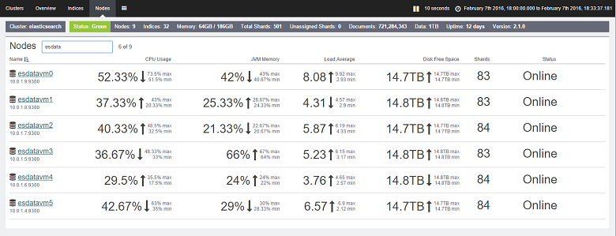

***Figure 18. CPU utilization for the *query-only* test on the 7(14) shard cluster***

Compare these figures with those of the 23(46) shard test:

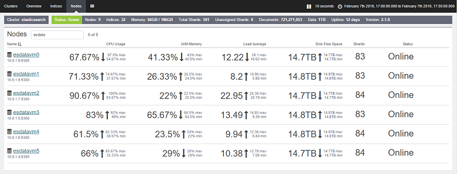

***Figure 19. CPU utilization for the *query-only* test on the 23(46) shard cluster***

In the 23(46) shard test, CPU utilization was far higher. Each node contains 7 or 8 shards. The DS14 architecture provides 16 processors, and Elasticsearch is better able to exploit this number of cores with the additional shards. The figures in the table above suggest that increasing the number of shards beyond this point may improve performance slightly, but you should offset these figures against the additional overhead of maintaining a high volume of shards. The sweet spot for these tests implies that the optimal number of shards per node is half the number of processor cores available on each node. However, remember that these results were achieved when only running queries. If your system imports data, you should also consider how sharding can impact the performance of data ingestion operations. For further information on this aspect refer to the document [Maximizing Data Ingestion Performance with Elasticsearch on Azure](https://github.com/mspnp/azure-guidance/blob/master/Elasticsearch-Data-Ingestion-Performance.md).

## Summary

Elasticsearch provides many options that you can use to structure indexes and tune them to support large-scale query operations. This document has summarized some common configurations and techniques that you can use to tune your database for query purposes. However, you should recognize that there is a tradeoff between optimizing a database to support fast retrieval as opposed to supporting high-volume data ingestion. Sometimes what is good for querying can have a detrimental impact on insert operations and vice versa. In a system that is exposed to mixed workloads, you need to assess where the balance lies and adjust the system parameters accordingly.

Additionally, the applicability of different configurations and techniques can vary depending on the structure of the data and the limitations (or otherwise) of the hardware on which the system is constructed. Many of the tests shown in this document illustrate how the selection of the hardware platform can impact throughput, and also how some strategies can be beneficial in certain cases but detrimental in others. The important point is to understand the options available and then perform rigorous benchmarking using your own data to determine the most optimal combination.

Finally, remember that an Elasticsearch database is not necessarily a static item. It will likely grow over time, and the strategies used to structure the data may need to be revised regularly. For example, it may be necessary to scale-up, scale-out, or re-index data with additional shards. As the system increases in size and complexity, be prepared to continually test performance to ensure that you are still meeting any SLAs guaranteed to your customers.

## Appendix: The Query and Aggregation Performance Test

This appendix describes the performance test performed against the Elasticsearch cluster. The tests were run by using JMeter running on a separate set of VMs. Details the configuration of the test environment are described in the document How-To: Create a Performance Testing Environment for Elasticsearch. To perform your own testing, you can create your own JMeter test plan manually following the guidance in this appendix, or you can use the automated test scripts available separately. See the document How-To: Run the Automated Elasticsearch Query Tests for further information.

The data query workload performed the set of queries described below while performing a large-scale upload of documents at the same time (the data was uploaded by using a JUnit test, following the same approach for the data ingestion tests described in the document [Maximizing Data Ingestion Performance with Elasticsearch on Azure](https://github.com/mspnp/azure-guidance/blob/master/Elasticsearch-Data-Ingestion-Performance.md).) The purpose of this workload was to simulate a production environment where new data is constantly being added while searches are performed. The queries were structured to retrieve only the most recent data from documents added in the last 15 minutes.

Each document was stored in a single index named *idx*, and had the type *doc*. You can use the following HTTP request to create the index. The *number_of_replicas* and *number_of_shards* settings varied from the values shown below in many of the tests. Additionally, for the tests that used fielddata rather than doc values, each property was annotated with the attribute *"doc_values" : false*.

> **Important**. The index was dropped and recreated prior to each test run.

``` http
PUT /idx
{  
    "settings" : {
        "number_of_replicas": 1,
        "refresh_interval": "30s",
        "number_of_shards": "5",
        "index.translog.durability": "async"    
    },
    "doc": {
        "mappings": {
            "event": {
                "_all": {
                    "enabled": false
                },
                "_timestamp": {
                    "enabled": true,
                    "store": true,
                    "format": "date_time"
                },
                "properties": {
                    "Organization": {
                        "type": "string",
                        "index": "not_analyzed"
                    },
                    "CustomField1": {
                        "type": "string",
                        "index": "not_analyzed"
                    },
                    "CustomField2": {
                        "type": "string",
                        "index": "not_analyzed"
                    },
                    "CustomField3": {
                        "type": "string",
                        "index": "not_analyzed"
                    },
                    "CustomField4": {
                        "type": "string",
                        "index": "not_analyzed"
                    },
                    "CustomField5": {
                        "type": "string",
                        "index": "not_analyzed"
                    },
                    "DateTimeReceivedUtc": {
                        "type": "date",
                        "format": "dateOptionalTime"
                    },
                    "Host": {
                        "type": "string",
                        "index": "not_analyzed"
                    },
                    "HttpMethod": {
                        "type": "string",
                        "index": "not_analyzed"
                    },
                    "HttpReferrer": {
                        "type": "string",
                        "index": "not_analyzed"
                    },
                    "HttpRequest": {
                        "type": "string",
                        "index": "not_analyzed"
                    },
                    "HttpUserAgent": {
                        "type": "string",
                        "index": "not_analyzed"
                    },
                    "HttpVersion": {
                        "type": "string",
                        "index": "not_analyzed"
                    },
                    "OrganizationName": {
                        "type": "string",
                        "index": "not_analyzed"
                    },
                    "SourceIp": {
                        "type": "ip"
                    },
                    "SourceIpAreaCode": {
                        "type": "long"
                    },
                    "SourceIpAsnNr": {
                        "type": "string",
                        "index": "not_analyzed"
                    },
                    "SourceIpBase10": {
                        "type": "long"
                    },
                    "SourceIpCity": {
                        "type": "string",
                        "index": "not_analyzed"
                    },
                    "SourceIpCountryCode": {
                        "type": "string",
                        "index": "not_analyzed"
                    },
                    "SourceIpLatitude": {
                        "type": "double"
                    },
                    "SourceIpLongitude": {
                        "type": "double"
                    },
                    "SourceIpMetroCode": {
                        "type": "long"
                    },
                    "SourceIpPostalCode": {
                        "type": "string",
                        "index": "not_analyzed"
                    },
                    "SourceIpRegion": {
                        "type": "string",
                        "index": "not_analyzed"
                    },
                    "SourceLatLong": {
                        "type": "geo_point",
                        "doc_values": true,
                        "lat_lon": true,
                        "geohash": true
                    },
                    "SourcePort": {
                        "type": "string",
                        "index": "not_analyzed"
                    },
                    "SourcedFrom": {
                        "type": "string",
                        "index": "not_analyzed"
                    },
                    "TargetIp": {
                        "type": "ip"
                    },
                    "TargetPort": {
                        "type": "string",
                        "index": "not_analyzed"
                    },
                    "Rating": {
                        "type": "string",
                        "index": "not_analyzed"
                    },
                    "UseHumanReadableDateTimes": {
                        "type": "boolean"
                    }
                }
            }
        }
    }
}
```

The following queries were performed by the test:
* How many documents with each Rating value have been entered in the last 15 minutes?

  ```http
  GET /idx/doc/_search
  {
    "query": {
      "bool": {
        "must": [
          {
            "range": {
              "DateTimeReceivedUtc": {
                "gte": "now-15m",
                "lte": "now"
              }
            }
          }
        ],
        "must_not": [],
        "should": []
      }
    },
    "from": 0,
    "size": 0,
    "aggs": {
      "2": {
        "terms": {
          "field": "Rating",
          "size": 5,
          "order": {
            "_count": "desc"
          }
        }
      }
    }
  }
  ```

* How many documents have been added in each 5 minute interval during the last 15 minutes?

  ```http
  GET /idx/doc/_search
  {
    "query": {
      "bool": {
        "must": [
          {
            "range": {
              "DateTimeReceivedUtc": {
                "gte": "now-15m",
                "lte": "now"
              }
            }
          }
        ],
        "must_not": [],
        "should": []
      }
    },
    "from": 0,
    "size": 0,
    "sort": [],
    "aggs": {
      "2": {
        "date_histogram": {
          "field": "DateTimeReceivedUtc",
          "interval": "5m",
          "time_zone": "America/Los_Angeles",
          "min_doc_count": 1,
          "extended_bounds": {
            "min": "now-15m",
            "max": "now"
          }
        }
      }
    }
  }
  ```

* How many documents of each Rating value have been added for each country in the last 15 minutes?

  ```HTTP
  GET /idx/doc/_search
  {
    "query": {
      "filtered": {
        "query": {
          "query_string": {
            "query": "*",
            "analyze_wildcard": true
          }
        },
        "filter": {
          "bool": {
            "must": [
              {
                "query": {
                  "query_string": {
                    "query": "*",
                    "analyze_wildcard": true
                  }
                }
              },
              {
                "range": {
                  "DateTimeReceivedUtc": {
                    "gte": "now-15m",
                    "lte": "now"
                  }
                }
              }
            ],
            "must_not": []
          }
        }
      }
    },
    "size": 0,
    "aggs": {
      "2": {
        "terms": {
          "field": "Rating",
          "size": 5,
          "order": {
            "_count": "desc"
          }
        },
        "aggs": {
          "3": {
            "terms": {
              "field": "SourceIpCountryCode",
              "size": 15,
              "order": {
                "_count": "desc"
              }
            }
          }
        }
      }
    }
  }
  ```

* Which 15 organizations occur most frequently in documents added in the last 15 minutes?

  ```http
  GET /idx/doc/_search
  {
    "query": {
      "filtered": {
        "query": {
          "query_string": {
            "query": "*",
            "analyze_wildcard": true
          }
        },
        "filter": {
          "bool": {
            "must": [
              {
                "query": {
                  "query_string": {
                    "query": "*",
                    "analyze_wildcard": true
                  }
                }
              },
              {
                "range": {
                  "DateTimeReceivedUtc": {
                    "gte": "now-15m",
                    "lte": "now"
                  }
                }
              }
            ],
            "must_not": []
          }
        }
      }
    },
    "size": 0,
    "aggs": {
      "2": {
        "terms": {
          "field": "Organization",
          "size": 15,
          "order": {
            "_count": "desc"
          }
        }
      }
    }
  }
  ```

* How many different organizations occur in documents added in the last 15 minutes?

  ```http
  GET /idx/doc/_search
  {
    "query": {
      "filtered": {
        "query": {
          "query_string": {
            "query": "*",
            "analyze_wildcard": true
          }
        },
        "filter": {
          "bool": {
            "must": [
              {
                "query": {
                  "query_string": {
                    "query": "*",
                    "analyze_wildcard": true
                  }
                }
              },
              {
                "range": {
                  "DateTimeReceivedUtc": {
                    "gte": "now-15m",
                    "lte": "now"
                  }
                }
              }
            ],
            "must_not": []
          }
        }
      }
    },
    "size": 0,
    "aggs": {
      "2": {
        "cardinality": {
          "field": "Organization"
        }
      }
    }
  }
  ```

* How many documents have been added in the last 15 minutes?

  ```http
  GET /idx/doc/_search
  {
    "query": {
      "filtered": {
        "query": {
          "query_string": {
            "query": "*",
            "analyze_wildcard": true
          }
        },
        "filter": {
          "bool": {
            "must": [
              {
                "query": {
                  "query_string": {
                    "analyze_wildcard": true,
                    "query": "*"
                  }
                }
              },
              {
                "range": {
                  "DateTimeReceivedUtc": {
                    "gte": "now-15m",
                    "lte": "now"
                  }
                }
              }
            ],
            "must_not": []
          }
        }
      }
    },
    "size": 0,
    "aggs": {}
  }
  ```

* How many different SourceIp values occur in documents added in the last 15 minutes?

  ```http
  GET /idx/doc/_search
  {
    "query": {
      "filtered": {
        "query": {
          "query_string": {
            "query": "*",
            "analyze_wildcard": true
          }
        },
        "filter": {
          "bool": {
            "must": [
              {
                "query": {
                  "query_string": {
                    "query": "*",
                    "analyze_wildcard": true
                  }
                }
              },
              {
                "range": {
                  "DateTimeReceivedUtc": {
                    "gte": "now-15m",
                    "lte": "now"
                  }
                }
              }
            ],
            "must_not": []
          }
        }
      }
    },
    "size": 0,
    "aggs": {
      "2": {
        "cardinality": {
          "field": "SourceIp"
        }
      }
    }
  }
  ```
