<properties
   pageTitle="Tuning data ingestion performance for Elasticsearch on Azure | Microsoft Azure"
   description="How to maximize data ingestion performance with Elasticsearch on Azure."
   services=""
   documentationCenter="na"
   authors="dragon119"
   manager="bennage"
   editor=""
   tags=""/>

<tags
   ms.service="guidance"
   ms.devlang="na"
   ms.topic="article"
   ms.tgt_pltfrm="na"
   ms.workload="na"
   ms.date="07/21/2016"
   ms.author="masashin"/>

# Tuning data ingestion performance for Elasticsearch on Azure

[AZURE.INCLUDE [pnp-header](../../includes/guidance-pnp-header-include.md)]

This article is [part of a series](guidance-elasticsearch.md). 

## Overview

An important aspect when creating any search database is to determine the best way to structure the
system to ingest searchable data quickly and efficiently. The considerations surrounding this requirement
concern not only the choice of infrastructure on which you implement the system, but also the various
optimizations that you can use to help ensure that the system can keep up with the expected levels of
data influx. 

This document describes the deployment and configuration options that you should consider
for implementing an Elasticsearch cluster that expects a high rate of data ingestion. To provide solid
data for illustrative purposes, this document also shows the results of benchmarking various
configurations using a simple high-volume data ingestion workload. The details of the workload are
described in the [Appendix](#appendix-the-bulk-load-data-ingestion-performance-test) at the end of this
document.

The purpose of the benchmarks was not to generate absolute performance figures for running Elasticsearch
or even to recommend a particular topology, but rather to illustrate methods that you can use for
assessing performance, sizing data nodes, and implementing clusters that can meet your own performance
requirements. 

When sizing your own systems, it is important to test performance thoroughly based on your
own workloads. Gather telemetry that enables you to obtain information about the optimal hardware
configuration to use, and the horizontal scaling factors that you should consider. In particular, you
should:

- Consider the overall size of the payload sent and not just the number of items in each bulk insert
request. A smaller number of large bulk items in each request could be more optimal than a larger number,
depending on the resource available to process each request.

You can monitor the effects of varying the bulk insert request by using Marvel, using the
*readbytes*/*writebytes* I/O counters with JMeter, and operating system tools such as *iostat* and
*vmstat* on Ubuntu.

- Conduct performance testing and gather telemetry to measure CPU processing and I/O wait times, disk
latency, throughput and response times. This information can help to identify potential bottlenecks and
assess the costs and benefits of using premium storage. Bear in mind that CPU and disk utilization might
not be even across all nodes depending on the way in which shards and replicas are distributed across the
cluster (some nodes can contain more shards than others).

- Consider how the number of concurrent requests for your workload will be distributed across the cluster
and assess the impact of using different numbers of nodes to handle this workload.

- Consider how workloads might grow as the business expands. Assess the impact of this growth on the
costs of the VMs and storage used by the nodes.

- Recognize that using a cluster with a larger number of nodes with regular disks might be more
economical if your scenario requires a high number of requests and the disk infrastructure maintains
throughput that satisfies your SLAS. However, increasing the number of nodes can introduce overhead in
the form of additional inter-node communications and synchronization.

- Understand that a higher number of cores per node may generate more disk traffic as more documents can
be processed. In this case, measure disk utilization to assess whether the I/O subsystem might become a
bottleneck and determine the benefits of using premium storage.

- Test and analyze the trade-offs with higher number of nodes with fewer cores versus fewer nodes with
more cores. Bear in mind that the increasing the number of replicas escalates the demands on the cluster
and may require you to add nodes.

- Consider that using ephemeral disks might require that indexes have to be recovered more frequently.

- Measure storage volume usage to assess capacity and underutilization of storage. For example, in our
scenario we stored 1.5 billion documents using 350GB storage.

- Measure the transfer rates for your workloads and consider how close you are likely to get to the total
I/O rate transfer limit for any given storage account in which you have created virtual disks.

## Node and Index Design

In a system that must support large-scale data ingestion, you ask the following questions:

- **Is the data fast-moving or relatively static?** The more dynamic the data, the greater the
maintenance overhead for Elasticsearch. If the data is replicated, each replica is maintained
synchronously. Fast-moving data that has only a limited lifespan or that can easily be reconstructed
might benefit from disabling replication altogether. This option is considered further in the section
[Tuning Large-Scale Data Ingestion.](#tuning-large-scale-data-ingestion)

- **How up-to-date do you require the data discovered by searching to be?** To maintain performance,
Elasticsearch buffers as much data in memory as it can. This means that not all changes are immediately
available for search requests. The process by which Elasticsearch persists changes and makes them visible
is described online in the document [Making Changes Persistent](https://www.elastic.co/guide/en/elasticsearch/guide/current/translog.html#translog). 

    The rate at which data becomes visible is governed by the *refresh\_interval* setting of the relevant
index. By default, this interval is set at 1 second. However, not every situation requires refreshes to
occur this quickly. For example, indexes recording log data might need to cope with a rapid and continual
influx of information which needs to be ingested quickly, but does not require the information to be
immediately available for querying. In this case, consider reducing the frequency of refreshes. This
feature is also described in the section [Tuning Large-Scale Data Ingestion.](#tuning-large-scale-data-ingestion)

- **How quickly is the data likely to grow?** Index capacity is determined by the number of shards
specified when the index is created. To allow for growth, specify an adequate number of shards (the
default is five). If the index is initially created on a single node, all five shards will be located on
that node, but as the volume of data grows additional nodes can be added and Elasticsearch will
dynamically distribute shards across nodes. However, each shard has an overhead; all searches in an index
will query all shards, so creating a large number of shards for a small amount of data can slow data
retrievals (avoid the [Kagillion shards](https://www.elastic.co/guide/en/elasticsearch/guide/current/kagillion-shards.html) scenario).

    Some workloads (such as logging) might create a new index each day, and if you observe that the number of
shards is insufficient for the volume of data, you should change it prior to creating the next index
(existing indexes will be unaffected). If you must distribute existing data across more shards, then one
option is to reindex the information; create a new index with the appropriate configuration and copy the
data into it. This process can be made transparent to applications by using [index aliases](https://www.elastic.co/guide/en/elasticsearch/reference/current/indices-aliases.html).

- **Does data need to be partitioned between users in a multitenancy scenario?** You can create separate
indexes for each user, but this can be expensive if each user only has a moderate amount of data. Instead,
consider creating [shared indexes](https://www.elastic.co/guide/en/elasticsearch/guide/current/shared-index.html) and use [aliases based on filters](https://www.elastic.co/guide/en/elasticsearch/guide/current/faking-it.html) to direct requests 
to the per-user data. To keep the data for a user together in the same shard, override the default
routing configuration for the index and route data based on some identifying attribute of the user.

- **Is data long or short-lived?** If you are using a set of Azure VMs to implement an Elasticsearch
cluster, you can store ephemeral data on a local resource system disk rather than an attached drive.
Using a VM SKU that utilizes an SSD for the resource disk can improve I/O performance. However, any
information held on the resource disk is temporary and may be lost if the VM restarts (see the section
When Will the Data on a Temporary Drive Be Lost in the document [Understanding the temporary drive on Microsoft Azure Virtual Machines](http://blogs.msdn.com/b/mast/archive/2013/12/07/understanding-the-temporary-drive-on-windows-azure-virtual-machines.aspx) for more details). If you need to retain data between restarts, create data disks to hold this information and attach them to the VM.

- **How active is the data?** Azure VHDs are subject to throttling if the amount of read/write activity
exceeds specified parameters (currently 500 IOPS for a disk attached to a Standard Tier VM, and 5000 IOPs
for a Premium Storage disk). 

    To reduce the chances of throttling and increase I/O performance, consider creating multiple data disks
for each VM and configure Elasticsearch to stripe data across these disks as described in the [Disk and File System Requirements](guidance-elasticsearch-running-on-azure.md#disk-and-file-system-requirements).

    You should select a hardware configuration that helps to minimize the number of disk I/O
read operations by ensuring that sufficient memory is available to cache frequently accessed data. This
is described in [Memory Requirements](guidance-elasticsearch-running-on-azure.md#memory-requirements) section of the document Running Elasticsearch on Azure.

- **What type of workload will each node need to support?** Elasticsearch benefits from having memory
available in which to cache data (in the form of the file system cache) and for the JVM heap as described
in the [Memory Requirements](guidance-elasticsearch-running-on-azure.md#memory-requirements) section of the document Running Elasticsearch on Azure. 

    The amount of memory, number of CPU cores, and quantity of available disks are set by the
SKU of the virtual machine. For more information, see the [Virtual Machines Pricing](http://azure.microsoft.com/pricing/details/virtual-machines/) page on the Azure website.

### Virtual Machine Options

You can provision VMs in Azure using a number of different SKUs. The resources available to an Azure VM
depend on SKU selected. Each SKU offers a different mix of cores, memory, and storage. You need to select
an appropriate size of VM that will handle the expected workload but that will also prove cost-effective.
Start with a configuration that will meet your current requirements (perform benchmarking to test, as
described later in this document). You can scale a cluster later by adding more VMs running Elasticsearch
nodes.

The page [Sizes for Virtual Machines](../virtual-machines/virtual-machines-linux-sizes.md) on the Azure web site documents the
various options and SKUs available for VMs.

You should match the size and resources of a VM to the role that nodes running on the VM will perform.

For a data node:

- Allocate up to 30 GB or 50% of the available RAM memory to the Java heap, whichever is the lower. Leave
the remainder to the operating system to use for caching files. If you are using Linux, you can specify
the amount of memory to allocate to the Java heap by setting the ES\_HEAP\_SIZE environment variable
before running Elasticsearch. Alternatively, if you are using Windows or Linux, you can stipulate memory
size with the *Xmx* and *Xms* parameters when you start Elasticsearch.

    Depending on the workload, fewer large VMs may not be as effective for performance as using a larger
number of moderately sized VMs; you should conduct tests that can measure the tradeoffs between the
additional network traffic and maintenance involved versus the costs of increasing the number of cores
available and the reduced disk contention on each node.

- Use premium storage for storing Elasticsearch data. This is discussed in more detail in the [Storage Options](#storage-options) section.

- Use multiple disks (of the same size) and stripe data across these disks. The SKU of your VMs will dictate the maximum number of data disks that you can attach. For more information, see [Disk and File System Requirements](guidance-elasticsearch-running-on-azure.md#disk-and-file-system-requirements).

- Use a multi-core CPU SKU; at least 2 cores, preferably 4 or more. 

For a client node:

- Do not allocate disk storage for Elasticsearch data; dedicated clients do not store data on disk.

- Ensure that adequate memory is available to handle workloads. Bulk insert requests are read into memory
prior to the data being sent to the various data nodes, and the results of aggregations and queries are
accumulated in memory before being returned to the client application. Benchmark your own workloads and
monitor memory use by using a tool such as Marvel or the [JVM information](https://www.elastic.co/guide/en/elasticsearch/guide/current/_monitoring_individual_nodes.html#_jvm_section) returned by using the *node/stats* API (`GET _nodes/stats`) to assess the optimal requirements.  In particular, monitor the *heap\_used\_percent* metric for each node and aim to keep the
heap size below 75% of the space available.

- Ensure that sufficient CPU cores are available to receive and process the expected volume of requests.
Requests are queued as they are received prior to processing, and the volume of items that can be queued
is a function of the number of CPU cores on each node. You can monitor the queue lengths by using the
data in the [Threadpool information](https://www.elastic.co/guide/en/elasticsearch/guide/current/_monitoring_individual_nodes.html#_threadpool_section) returned by using the node/stats API. 

    If the *rejected* count for a queue indicates that requests are being refused, then this indicates
    that the cluster is starting to bottleneck. This may be due to CPU bandwidth, but may also be due to
    other factors such as lack of memory or slow I/O performance, so use this information in conjunction
    with other statistics to help determine the root cause.

    Client nodes may or may not be necessary, depending on your workloads. Data ingestion workloads tend
    not to benefit from using dedicated clients, whereas some searches and aggregations can run more
    quickly; be prepared to benchmark your own scenarios.

    Client nodes are primarily useful for applications that use the Transport Client API to connect to
    the cluster. You can also use the Node Client API, which dynamically creates a dedicated client for
    the application, using the resources of the application host environment. If your applications use
    the Node Client API, then it may not be necessary for your cluster to contain preconfigured dedicated
    client nodes. 
    
    However, be aware that a node created using the Client Node API is a first-class member
    of the cluster and as such participates in the network chatter with other nodes; frequently starting
    and stopping client nodes can create unnecessary noise across the entire cluster.

For a master node:

- Do not allocate disk storage for Elasticsearch data; dedicated master nodes do not store data on disk.

- CPU requirements should be minimal.

- Memory requirements depend on the size of the cluster. Information about the state of the cluster is 
retained in memory. For small clusters the amount of memory required is minimal, but for a large, highly
active cluster where indexes are being created frequently and shards moving around, the amount of state
information can grow appreciably. Monitor the JVM heap size to determine whether you need to add more
memory.

> [AZURE.NOTE]  For cluster reliability, always create multiple master nodes to and configure the
> remaining nodes to avoid the possibility of a split brain from occurring. Ideally, there should be an
> odd number of master nodes. This topic is described in more detail in the document [Configuring Resilience and Recovery on Elasticsearch on Azure][].

### Storage Options

There are a number of storage options available on Azure VMs with different trade-offs affecting cost, performance, availability, and recovery that you need to consider carefully.

Note that you should store Elasticsearch data on dedicated data disks.  This will help to reduce
contention with the operating system and ensure that large volumes of Elasticsearch I/O do not compete
with operating system functions for I/O resources.

Azure disks are subject to performance constraints. If you find that a cluster undergoes periodic bursts
of activity then I/O requests may be throttled. To help prevent this, tune your design to balance the
document size in Elasticsearch against the volume of requests likely to be received by each disk.

Disks based on standard storage support a maximum request rate of 500 IOPS whereas disks based on premium
storage can operate at up to 5,000 IOPS, depending on data disks sizes. Premium storage disks are only available for the DS and GS
series of VMs. Maximum disk IOPS rates for [Azure VMs are documented online](../virtual-machines/virtual-machines-linux-sizes.md). Consider that performance on premium storage will be determined also by the VM size together with disk size allocation. Premium storage performance is documented (storage-premium-storage/)

**Persistent Data Disks**

Persistent data disks are VHDs that are backed by Azure Storage. If the VM needs to be recreated after a
major failure, existing VHDs can be easily attached to the new VM. VHDs can be created based on standard
storage (spinning media) or premium storage (SSDs). If you wish to use SSDs you must create VMs using the
DS series or better. DS machines cost the same as the equivalent D-series VMs, but you are charged extra
for using premium storage.

In cases where the maximum transfer rate per disk is insufficient to support the expected workload,
consider either creating multiple data disks and allow Elasticsearch to [stripe data across these disks](guidance-elasticsearch-running-on-azure.md#disk-and-file-system-requirements), or implement system level [RAID 0 striping using virtual disks](../virtual-machines/virtual-machines-linux-configure-raid.md).

> [AZURE.NOTE] Experience within Microsoft has shown that using RAID 0 is particularly beneficial for
> smoothing out the I/O effects of *spiky* workloads that generate frequent bursts of activity.

Use premium locally redundant (or locally redundant for low-end or QA workloads) storage for the 
storage account holding the disks; replicating across geographies and zones is not required for
Elasticsearch HA.

**Ephemeral Disks**

Using persistent disks based on SSDs requires creating VMs that support premium storage. This has a price
implication. Using the local ephemeral disk to hold Elasticsearch data can be a cost effective solution
for moderately sized nodes requiring up to approximately 800GB of storage. On the Standard-D series of
VMs, ephemeral disks are implemented using SSDs which provide far greater performance and much lower
latency than ordinary disks

When using Elasticsearch, the performance can be equivalent to using premium storage without incurring
the cost – see the section [Addressing Disk Latency Issues](#addressing-disk-latency-issues) for more
information.

The size of the VM limits the amount of space available in ephemeral storage as described by the document
[D-Series Performance Expectations](https://azure.microsoft.com/blog/d-series-performance-expectations/).

For example, a Standard\_D1 VM provides 50GB of ephemeral storage, a Standard\_D2 VM has 100GB of ephemeral storage, and a Standard\_D14 VM provides 800GB of ephemeral space. For clusters where nodes only require this amount of space, using a D-series VM with ephemeral storage can be cost effective.

You must balance the increased throughput available with ephemeral storage against the time and costs
involved in recovering this data after a machine restart. The contents of the ephemeral disk are lost if
the VM is moved to a different host server, if the host is updated, or if the host experiences a hardware
failure. If the data itself has a limited lifespan then this data loss might be tolerable. For
longer-lived data, it may be possible to rebuild an index or recover the missing information from a
backup. It is possible to minimize the potential for loss by using replicas held on other VMs.

> [AZURE.NOTE] Do not use a **single** VM to hold critical production data. If the node fails,
> all of the data is unavailable. For critical information, ensure that data is replicated on at least
> one other node.

**Azure Files**

The [Azure File Service](http://blogs.msdn.com/b/windowsazurestorage/archive/2014/05/12/introducing-microsoft-azure-file-service.aspx) provides shared file access using Azure Storage. You can create file shares which you can then mount on Azure VMs. Multiple VMs can mount the same file share, enabling them to access the same data.

For performance reasons, it is not recommended that you use file shares for holding Elasticsearch data that does not need to be shared across nodes; regular data disks are more suited to this purpose. File shares can be used for creating Elasticsearch [shadow replica indexes](https://www.elastic.co/guide/en/elasticsearch/reference/current/indices-shadow-replicas.html). However, this feature is currently experimental and should not be implemented in a production environment at this time. For this reason, shadow indexes are not considered further in this guidance.

**Network Options**

Azure implements a shared networking scheme. VMs utilizing the same hardware racks compete for network resources. Therefore available network bandwidth can vary according to the time of day and the daily cycle of work running on VMs sharing the same physical network infrastructure. You have little control over these factors. It is important to understand that network performance is likely to fluctuate over time, so set user expectations accordingly.

## Scaling-Up Nodes to Support Large-Scale Data Ingestion

You can build Elasticsearch clusters using reasonably moderate hardware, and then scale up or scale out
as the volume of data grows and the number of requests increases. With Azure, you scale-up by running on
bigger and more expensive VMs, or you can scale-out by using additional smaller and cheaper VMs. 

You might also perform a combination of both strategies. There is no one-size-fits-all solution for all
scenarios, so to assess the best approach for any given situation you need to be prepared to undertake a
series performance tests.

This section is concerned with the scale-up approach; scaling out is discussed in the section
[Scaling-Out: Conclusions](#scaling-out-conclusions).
This section describes the results of a series of benchmarks that were performed against a set of
Elasticsearch clusters comprising VMs with varying sizes. The clusters were designated as small, medium,
and large. The following table summarizes the resources allocated to the VMs in each cluster.

| Cluster | VM SKU      | Number of Cores | Number of Data Disks | RAM  |
|---------|-------------|-----------------|----------------------|------|
| Small   | Standard D2 | 2               | 4                    | 7GB  |
| Medium  | Standard D3 | 4               | 8                    | 14GB |
| Large   | Standard D4 | 8               | 16                   | 28GB |

Each Elasticsearch cluster contained 3 data nodes. These data nodes handled client requests as well as
handling data processing; separate client nodes were not used because they offered little benefit to the
data ingestion scenario used by the tests. The cluster also contained three master nodes, one of which
was elected by Elasticsearch to coordinate the cluster.

The tests were performed using Elasticsearch 1.7.3. The tests were initially performed on clusters
running Ubuntu Linux 14.0.4, and then repeated using Windows Server 2012. The details of the workload
performed by the tests are described in the [Appendix](#appendix-the-bulk-load-data-ingestion-performance-test).

### Data Ingestion Performance – Ubuntu Linux 14.0.4

The following table summarizes the overall results of running the tests for two hours for each configuration:

| Configuration | \#Samples | Average Response Time (ms) | Throughput (Operations/s) |
|---------------|-----------|----------------------------|---------------------------|
| Small         | 67057     | 636                        | 9.3                       |
| Medium        | 123482    | 692                        | 17.2                      |
| Large         | 197085    | 839                        | 27.4                      |

The throughput and number of samples processed for the three configurations are in the approximate ratio
1:2:3. However, the resources available in terms of memory, CPU cores, and disks have the ratio 1:2:4. It
was felt to be worth investigating the low-level performance details of the nodes in the cluster to
assess why this might be the case. This information can help to determine whether there are limits to
scaling-up and when it may be better to consider scaling-out.

### Determining Limiting Factors: Network Utilization

Elasticsearch is dependent on having sufficient network bandwidth to support the influx of client
requests as well as the synchronization information that flows between nodes in the cluster. As
highlighted earlier, you have limited control over the bandwidth availability which depends on many
variables such as the datacenter in use, and the current network load of other VMs sharing the same
network infrastructure. However, it is still worth examining the network activity for each cluster if
only to verify that the volume of traffic is not excessive. The graph below shows a comparison of the
network traffic received by node 2 in each of the clusters (the volumes for the other nodes in each
cluster was very similar).

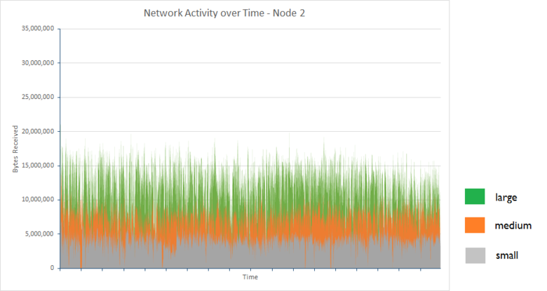

The average bytes received per second for node 2 in each cluster configuration over the two-hour period
were as follows:

| Configuration | Average Number of Bytes Received/sec |
|---------------|--------------------------------------|
| Small         | 3993640.3                          |
| Medium        | 7311689.9                          |
| Large         | 11893874.2                          |

The tests were conducted while the system was running in **steady state**. In situations where index
rebalancing or node recovering is occurring, data transmissions between nodes holding primary and replica
shards can generate significant network traffic. The effects of this process are described more in the
document [Configuring Resilience and Recovery on Elasticsearch on Azure][].

### Determining Limiting Factors: CPU Utilization

The rate at which requests are handled is at least partially governed by the available processing
capacity. Elasticsearch accepts bulk insert requests on the bulk insert queue. Each node has a set of
bulk insert queues determined by the number of available processors. By default, there is one queue for
each processor and each queue can hold up to 50 outstanding requests before they will start to be
rejected. 

Applications should send requests at a rate which does not cause the queues to overspill. The
number of items in each queue at any one time is going to be a function of the rate at which requests are
sent by client applications and the rate at which these same requests are retrieved and processed by
Elasticsearch. For this reason, one important statistic captured concerns the error rate summarized in
the following table.

| Configuration | Total Samples | \# Errors | Error Rate |
|---------------|---------------|-----------|------------|
| Small         | 67057         | 0         | 0.00%      |
| Medium        | 123483        | 1         | 0.0008%    |
| Large         | 200702        | 3617      | 1.8 %      |

Each of these errors was caused by the following Java exception:

```
org.elasticsearch.action.support.replication.TransportShardReplicationOperationAction$PrimaryPhase$1@75a30c1b]; ]
[219]: index [systembase], type [logs], id [AVEAioKb2TRSNcPa_8YG], message [RemoteTransportException[[esdatavm2][inet[/10.0.1.5:9300]][indices:data/write/bulk[s]]]; nested: EsRejectedExecutionException[rejected execution (queue capacity 50)
```

Increasing the number of queues and/or the length of each queue might reduce the number of errors, but
this approach can only cope with bursts of short duration. Doing this while running a sustained series of
data ingestion tasks will simply delay the point at which errors start occurring. Furthermore, this
change will not improve the throughput and will likely harm the response time of client applications as
requests will be queued for longer before being processed.

The default index structure of 5 shards with 1 replica (10 shards in all), results in a modest imbalance
in load between the nodes in a cluster; two nodes will contain three shards while the other node will contain four. The busiest node is most likely to be the item that restricts throughput the most, hence
the reason that this node has been selected in each case.

The following set of graphs illustrate the CPU utilization for the busiest node in each cluster.


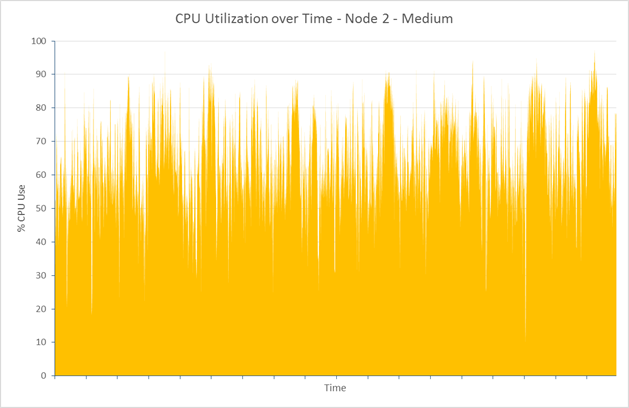

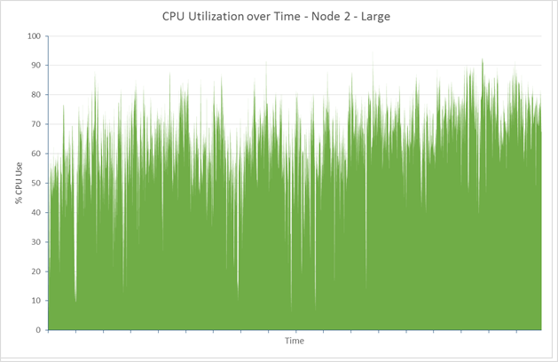

For the small, medium, and large clusters, the average CPU utilization for these nodes was 75.01%,
64.93%., and 64.64%. Rarely does utilization actually hit 100%, and utilization drops as the size of the
nodes and the available CPU power available increases. CPU power is therefore unlikely to be a factor
limiting the performance of the large cluster.

### Determining Limiting Factors: Memory

Memory use is another important aspect that can influence performance. For the tests, Elasticsearch was allocated 50% of the available memory; this is in line with [documented recommendations](https://www.elastic.co/guide/en/elasticsearch/guide/current/heap-sizing.html#_give_half_your_memory_to_lucene). While the tests were running, the JVM was monitored for excess garbage collection activity (an indication of lack of heap memory). In all cases, the heap size was stable and the JVM exhibited low garbage collection activity. The screenshot below shows a snapshot of Marvel, highlighting the key JVM statistics for a short period while the test was running on the large cluster.

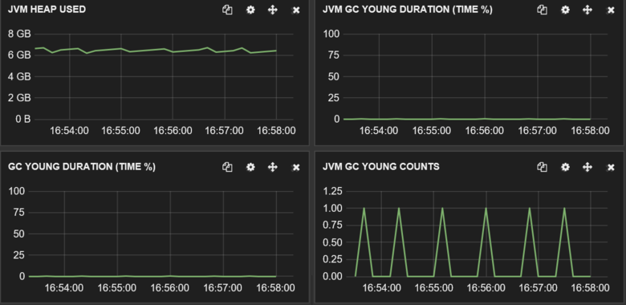

***JVM memory and garbage collection activity on the large cluster.***

### Determining Limiting Factors: Disk I/O Rates

The remaining physical feature on the server side that might constrain performance is the performance of the disk I/O subsystem. The graph below compares the disk activity in terms of bytes written for the busiest nodes in each cluster.

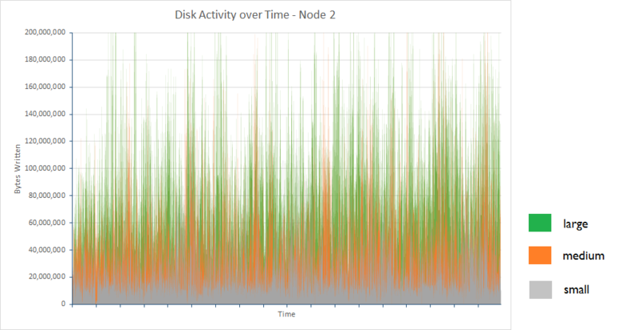

The following table shows the average bytes written per second for node 2 in each cluster configuration over the two-hour period:

| Configuration | Average Number of Bytes Written/sec |
|---------------|-------------------------------------|
| Small         | 25502361.94                         |
| Medium        | 48856124.5                          |
| Large         | 88137675.46                         |

The volume of data written increases with the number of requests being processed by a cluster, but the I/O rates are within the limits of Azure storage (disks created by using Azure storage can support a sustained rates 10s to 100s of MB/s, depending on whether Standard or Premium storage is used). Examining the amount of time spent waiting for disk I/O helps to explain why the disk throughput is well below the theoretical maximum. The graphs and table below show these statistics for the same three nodes:

> [AZURE.NOTE] The disk wait time is measured by monitoring the percentage of CPU time during which 
> processors are blocked waiting for I/O operations to complete.

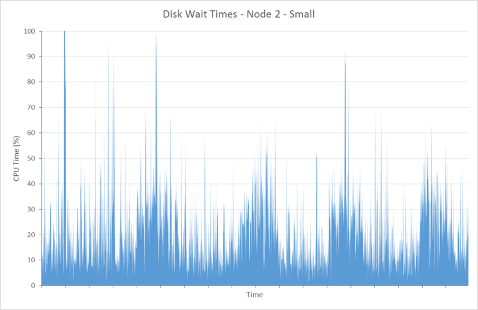

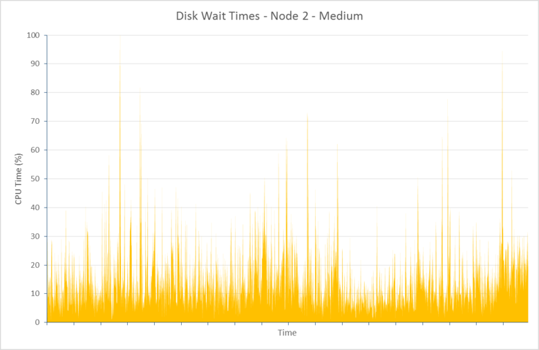

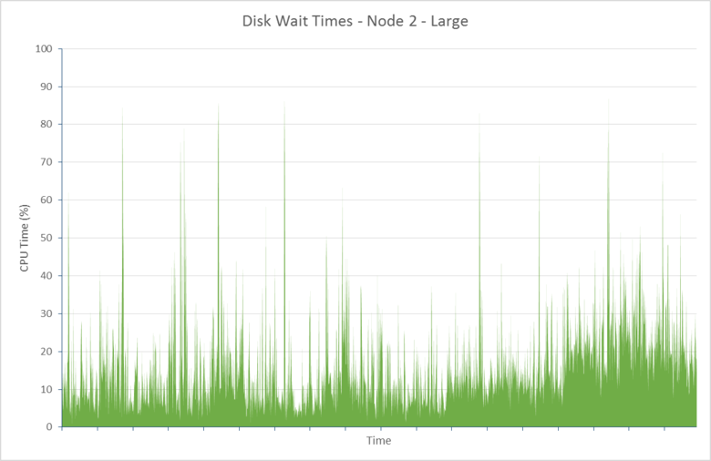

| Configuration | Average Disk Wait CPU Time (%) |
|---------------|--------------------------------|
| Small         | 21.04                          |
| Medium        | 14.48                          |
| Large         | 15.84                          |

This data indicates that a significant proportion of CPU time (between nearly 16% and 21%) is spent waiting for disk I/O to complete. This is restricting the ability of Elasticsearch to process requests and store data.

During the test run, the large cluster inserted in excess of **five hundred million documents**. Allowing the test to continue showed that wait times increased significantly when the database contained over six hundred million documents. The reasons for this behavior were not fully investigated, but may be due to disk fragmentation causing increased disk latency. 

Increasing the size of the cluster over more nodes might help to alleviate the effects of this behavior. In extreme cases it may be necessary to defragment a disk which is showing excessive I/O times. However, defragmenting a large disk might take a considerable time (possibly more than 48 hours for a 2TB VHD drive), and simply reformatting the drive and allowing Elasticsearch to recover the missing data from replica shards could be a more cost-effective approach.

### Addressing Disk Latency Issues

The tests were initially performed using VMs configured with standard disks. A standard disk is based on spinning media and as a result is subject to rotational latency and other bottlenecks that can constrain I/O rates. Azure provides also premium storage in which disks are created using SSD devices. These devices have no rotational latency and as a result should provide improved I/O speeds. 

The table below compares the results of replacing standard disks with premium disks in the large cluster (the Standard D4 VMs in the large cluster were replaced with Standard DS4 VMs; the number of cores, memory and disks was the same in both cases, the only difference being that the DS4 VMs used SSDs).

| Configuration    | \#Samples | Average Response Time (ms) | Throughput (Operations/s) |
|------------------|-----------|----------------------------|---------------------------|
| Large - Standard | 197085    | 839                        | 27.4                      |
| Large - Premium  | 255985    | 581                        | 35.6                      |

Response times were noticeably better, resulting in an average throughput much closer to 4x that of the small cluster. This is more in line with the resources available on a Standard DS4 VM. Average CPU utilization on the busiest node in the cluster (node 1 in this case) increased as it spent less time waiting for I/O to complete:

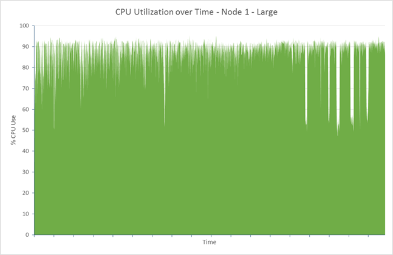

The reduction in disk wait time becomes apparent when you consider the following graph, which shows that for the busiest node this statistic dropped to around 1% on average:

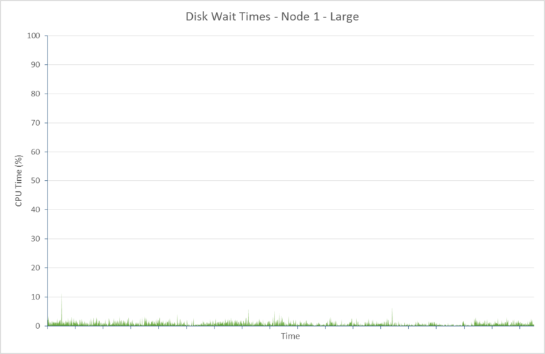

There is a price to pay for this improvement, however. The number of ingestion errors increased by a factor of 10 to 35797 (12.3%). Again, most of these errors were the result of the bulk insert queue overflowing. Given that the hardware now appears to be running close to capacity, it may be necessary to either add more nodes or throttle back the rate of bulk inserts to reduce the volume of errors. These issues are discussed later in this document.

### Testing with Ephemeral Storage

The same tests were repeated on a cluster of D4 VMs using ephemeral storage. On D4 VMs, ephemeral storage is implemented as a single 400GB SSD. The number of samples processed, response time, and throughput were all very similar to the figures reported for the cluster based on DS14 VMs with premium storage.

| Configuration                     | \#Samples | Average Response Time (ms) | Throughput (Operations/s) |
|-----------------------------------|-----------|----------------------------|---------------------------|
| Large - Premium                   | 255985    | 581                        | 35.6                      |
| Large – Standard (Ephemeral disk) | 255626    | 585                        | 35.5                      |

The error rate was also similar (33862 failures out of 289488 requests in total – 11.7%).

The following graphs show the CPU utilization and disk wait statistics for the busiest node in the cluster (node 2 this time):

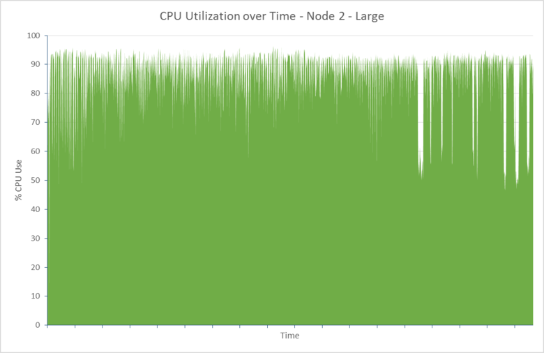

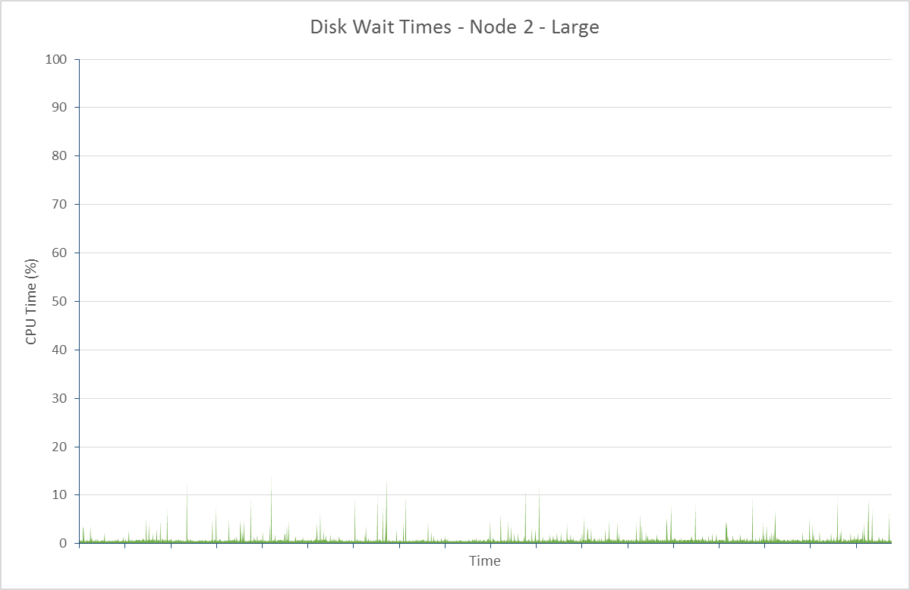

In this case, in performance terms alone, using ephemeral storage could be considered a more cost-effective solution than using premium storage.

### Data Ingestion Performance – Windows Server 2012

The same tests were repeated using a set of Elasticsearch clusters with nodes running Windows Server 2012. The purposes of these tests was to establish what effects, if any, the choice of operating system might have on cluster performance.

To illustrate the scalability of Elasticsearch on Windows, the following table shows the throughput and response times achieved for the small, medium, and large cluster configurations. Note that these tests were all performed with Elasticsearch configured to use SSD ephemeral storage, as the tests with Ubuntu had shown that disk latency was likely to be a critical factor in achieving maximum performance:

| Configuration | \#Samples | Average Response Time (ms) | Throughput (Operations/s) |
|---------------|-----------|----------------------------|---------------------------|
| Small         | 90295     | 476                        | 12.5                      |
| Medium        | 169243    | 508                        | 23.5                      |
| Large         | 257115    | 613                        | 35.6                      |

These results indicate how Elasticsearch scales with VM size and available resources on Windows.

The following tables compares the results for the large cluster on Ubuntu and Windows:

| Operating System | \#Samples | Average Response Time (ms) | Throughput (Operations/s) | Error Rate (%) |
|------------------|-----------|----------------------------|---------------------------|----------------|
| Ubuntu           | 255626    | 585                        | 35.5                      | 11.7           |
| Windows          | 257115    | 613                        | 35.6                      | 7.2            |

The throughput was consistent with that for the large Ubuntu clusters, although the response time was slightly higher this may be accounted for by the lower error rate (errors are reported more quickly than successful operations, so have a lower response time).

The CPU utilization reported by the Windows monitoring tools was marginally higher than that of Ubuntu. However, you should treat direct comparisons of measurements such as these across operating systems with extreme caution due to the way in which different operating systems report these statistics. Additionally, information on disk latency in terms of CPU time spent waiting for I/O is not available in the same way as it is for Ubuntu. The important point is that CPU utilization was high, indicating that time spent waiting for I/O was low:

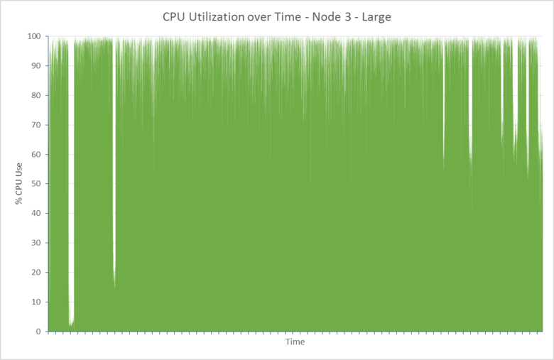

### Scaling-Up: Conclusions

Elasticsearch performance for a well-tuned cluster is likely to be equivalent on Windows and Ubuntu, and that it scales-up in a similar pattern on both operating systems. For best performance, **use premium storage for holding Elasticsearch data**.

## Scaling Out Clusters to Support Large-Scale Data Ingestion

Scaling out is the complimentary approach to scaling up investigated in the previous section. An important feature of Elasticsearch is the inherent horizontal scalability built into the software. Increasing the size of a cluster is simply a matter of adding more nodes. You do not need to perform any manual operations to redistribute indexes or shards as these tasks are handled automatically, although there are a number of configuration options available that you can use to influence this process. 

Adding more nodes helps to improve performance by spreading the load across more machinery. As you add more nodes, you may also need to consider reindexing data to increase the number of shards available. You can pre-empt this process to some extent by creating indexes that have more shards than there are available nodes initially. When further nodes are added, the shards can be distributed.

Besides taking advantage of the horizontal scalability of Elasticsearch, there are other reasons for implementing indexes that have more shards than nodes. Each shard is implemented as a separate data structure (a [Lucene](https://lucene.apache.org/) index), and has its own internal mechanisms for maintaining consistency and handling concurrency. Creating multiple shards helps to increase parallelism within a node and can improve performance. 

However, maintaining performance while scaling is a balancing act. The more nodes and shards a cluster contains, the more effort is required to synchronize the work performed by the cluster, which can decrease throughput. For any given workload there will be a sweet spot that maximizes ingestion performance while minimizing the maintenance overhead. This sweet spot will be heavily dependent on the nature of the workload and the cluster; specifically, the volume, size, and content of the documents, the rate at which ingestion occurs, and the hardware on which the system runs.  

This section summarizes the results of investigations into sizing clusters intended to support the workload used by the performance tests described previously. The same test was performed on clusters with VMs based on the large VM size (Standard D4 with 8 CPU cores, 16 data disks, and 28GB of RAM) running Ubuntu Linux 14.0.4, but configured with different numbers of nodes and shards. The results are not intended to be definitive as they apply only to one specific scenario, but they can act as a good starting point to help you to analyze the horizontal scalability of your clusters, and generate numbers for the optimal ratio of shards to nodes that best meet your own requirements.

### Baseline Results – 3 Nodes

To obtain a baseline figure, the data ingestion performance test was run against a 3 node cluster with 5 shards and 1 replica. This is the default configuration for an Elasticsearch index. In this configuration, Elasticsearch distributes 2 primary shards to 2 of the nodes, and the remaining primary shard is stored on the third node. The table below summarizes the throughput in terms of bulk ingestion operations per second, and the number of documents that were successfully stored by the test.

> [AZURE.NOTE] In the tables that follow in this section, the distribution of the primary shards is presented as a number for each node separated by dashes. For example, the 5-shard 3-node layout is described as 2-2-1. The layout of replica shards is not included; they will follow a similar scheme to the primary shards.

| Configuration | \# Documents | Throughput (Operations/sec) | Shard Layout |
|---------------|--------------|-----------------------------|--------------|
| 5 shards      | 200560412    | 27.86                       | 2-2-1        |

### 6-Node Results

The test was repeated on a 6 node cluster. The purpose of these tests was to try and ascertain more precisely the effects of storing more than one shard on a node.

| Configuration | \# Documents | Throughput (Operations/sec) | Shard Layout |
|---------------|--------------|-----------------------------|--------------|
| 4 shards      | 227360412    | 31.58                       | 1-1-0-1-1-0  |
| 7 shards      | 268013252    | 37.22                       | 2-1-1-1-1-1  |
| 10 shards     | 258065854    | 35.84                       | 1-2-2-2-1-2  |
| 11 shards     | 279788157    | 38.86                       | 2-2-2-1-2-2  |
| 12 shards     | 257628504    | 35.78                       | 2-2-2-2-2-2  |
| 13 shards     | 300126822    | 41.68                       | 2-2-2-2-2-3  |

These results appear to indicate the following trends:

* More shards per node improves throughput. With the small number of shards per node created for these tests, this phenomenon was expected, for reasons described earlier.

* An odd number of shards gives better performance than an even number. The reasons for this are less clear, but it *may* be that the routing algorithm that Elasticsearch uses is better able to distribute the data across shards in this case, leading to a more even load per node.

To test these hypotheses, several further tests were performed with larger numbers of shards. On verbal advice from Elasticsearch, it was decided to use a prime number of shards for each test as these give a reasonable distribution of odd numbers for the range in question.

| Configuration | \# Documents | Throughput (Operations/sec) | Shard Layout      |
|---------------|--------------|-----------------------------|-------------------|
| 23 shards     | 312844185    | 43.45                       | 4-4-4-3-4-4       |
| 31 shards     | 309930777    | 43.05                       | 5-5-5-5-6-5       |
| 43 shards     | 316357076    | 43.94                       | 8-7-7-7-7-7       |
| 61 shards     | 305072556    | 42.37                       | 10-11-10-10-10-10 |
| 91 shards     | 291073519    | 40.43                       | 15-15-16-15-15-15 |
| 119 shards    | 273596325    | 38.00                       | 20-20-20-20-20-19 |

These results suggested that a tipping point was reached at around 23 shards. After this point, increasing the number of shards caused a small degradation in performance (the throughput for 43 shards is possibly an anomaly).

### 9-Node Results

The tests were repeated using a cluster of 9 nodes, again using a prime number of shards.

| Configuration | \# Documents | Throughput (Operations/sec) | Shard Layout               |
|---------------|--------------|-----------------------------|----------------------------|
| 17 shards     | 325165364    | 45.16                       | 2-2-2-2-2-2-2-2-1          |
| 19 shards     | 331272619    | 46.01                       | 2-2-2-2-2-2-2-2-3          |
| 29 shards     | 349682551    | 48.57                       | 3-3-3-4-3-3-3-4-3          |
| 37 shards     | 352764546    | 49.00                       | 4-4-4-4-4-4-4-4-5          |
| 47 shards     | 343684074    | 47.73                       | 5-5-5-6-5-5-5-6-5          |
| 89 shards     | 336248667    | 46.70                       | 10-10-10-10-10-10-10-10-9  |
| 181 shards    | 297919131    | 41.38                       | 20-20-20-20-20-20-20-20-21 |

These results showed a similar pattern, with a tipping point around 37 shards.

### Scaling-Out: Conclusions

Using a crude extrapolation, the results of the 6-node and 9-node tests indicated that, for this specific scenario, the ideal number of shards to maximize performance was 4n+/-1, where n is the number of nodes. This *may* be a function of the number of bulk insert threads available, which in turn is dependent on the number of CPU cores, the rationale being as follows (see [Multidocument Patterns](https://www.elastic.co/guide/en/elasticsearch/guide/current/distrib-multi-doc.html#distrib-multi-doc) for details):

- Each bulk insert request sent by the client application is received by a single data node.

- The data node builds a new bulk insert request for each primary shard affected by the original request and forwards them to the other nodes, in parallel.

- As each primary shard is written, another request is sent to each replica for that shard. The primary shard waits for the request sent to the replica to complete before finishing.

By default, Elasticsearch creates one bulk insert thread for each available CPU core in a VM. In the case of the D4 VMs used by this test, each CPU contained 8 cores, so 8 bulk insert threads were created. The index used spanned 4 (in one case 5) primary shards on each node, but there were also 4 (5) replicas on each node. Inserting data into these shards and replicas could consume up to 8 threads on each node per request, matching the number available. Increasing or reducing the number of shards might cause threading inefficiencies as threads are possibly left unoccupied or requests are queued. However, without further experimentation this is just a theory and it is not possible to be definitive.

The tests also illustrated one other important point. In this scenario, increasing the number of nodes can improve data ingestion throughput, but the results do not necessarily scale linearly. Conducting further tests with 12 and 15 node clusters could show the point at which scale-out brings little additional benefit. If this number of nodes provides insufficient storage space, it may be necessary to return to the scale-up strategy and start using more or bigger disks based on premium storage.

> [AZURE.IMPORTANT] Do not take the ratio 4n+/-1 as a magic formula that will always work for every cluster. If you have fewer or more CPU cores available, the optimal shard configuration could be different. The findings were based on a specific workload that only did data ingestion. For workloads that also include a mix of queries and aggregations the results could be very diverse.

> Furthermore, the data ingestion workload utilized a single index. In many situations, the data is likely to be spread across multiple indexes leading to different patterns or resource use.

> The important point of this exercise is to understand the method used rather than the results obtained. You should be prepared to perform your own scalability assessment based on your own workloads to obtain information that is most applicable to your own scenario.

## Tuning Large-Scale Data Ingestion

Elasticsearch is highly configurable, with many switches and settings that you can use to optimize the performance for specific use-cases and scenarios. This section describes some common examples. Be aware that the flexibility that Elasticsearch provides in this respect comes with a warning; it is very easy to detune Elasticsearch and make performance worse. When tuning, only make one change at a time, and always measure the effects of any changes to ensure that they are not detrimental to your system.

### Optimizing Resources for Indexing Operations

The following list describes some points you should consider when tuning an Elasticsearch cluster to support large-scale data ingestion. The first two items are most likely to have an immediately discernable effect on performance while the remainder are more marginal, depending on the workload:

*  New documents added to an index only become visible to searches when the index is refreshed. Refreshing an index is an expensive operation, so it is only performed periodically rather than as each document is created. The default refresh interval is 1 second. If you are performing bulk operations, you should consider temporarily disabling index refreshes; set the index *refresh\_interval* to -1.

	```http
	PUT /my_busy_index
	{
		"settings" : {
			"refresh_interval": -1
		}
	}
	```

	Trigger a refresh manually by using the [*\_refresh*](https://www.elastic.co/guide/en/elasticsearch/reference/current/indices-refresh.html) API at the end of the operation to make the data visible. See [Bulk Indexing Usage](https://www.elastic.co/guide/en/elasticsearch/reference/current/indices-update-settings.html#bulk) for more information. Further details on the [impact of changing the refresh interval on data ingestion](#the-impact-of-changing-the-index-refresh-interval-on-data-ingestion-performance) are described later.

* If an index is replicated, each indexing operation (document create, update, or delete) is repeated on the replica shards as they occur in the primary shard. Consider disabling replication during bulk import operations and then re-enable it when the import is complete:

    ```http
	PUT /my_busy_index
	{
		"settings" : {
			"number_of_replicas": 0
		}
	}
	```

	When you re-enable replication, Elasticsearch performs a byte-for-byte network transfer of data from the index to each replica. This is more efficient than repeating the indexing process document by document on each node. The risk is that data can be lost of the primary node fails while performing the bulk import, but recovery may simply be a matter of starting the import again. The [impact of replication on data ingestion performance](#the-impact-of-replicas-on-data-ingestion-performance) is described in more detail later.

* Elasticsearch attempts to balance the resources available between those required for querying and those required for ingesting data. As a result, it may throttle data ingestion performance (throttling events are recorded in the Elasticsearch log). This restriction is intended to prevent a large number of index segments from being created concurrently that require merging and saving to disk; a process that can monopolize resources. If your system is not currently performing queries, you can disable data ingestion throttling. This should allow indexing to maximize performance. You can disable throttling for an entire cluster as follows:

	```http
	PUT /_cluster/settings
	{
		"transient" : {
			"indices.store.throttle.type": "none"
		}
	}
	```

    Set the throttle type of the cluster back to *"merge"* when ingestion has completed. Also note that disabling throttling may lead to instability in the cluster, so ensure that you have procedures in place that can recover the cluster if necessary.

* Elasticsearch reserves a proportion of the heap memory for indexing operations; the remainder is mostly used by queries and searches. The purpose of these buffers is to reduce the number of disk I/O operations, with the aim of performing fewer, larger writes than more, smaller writes. The default proportion of heap memory allocated is 10%. If you are indexing a large volume of data then this value might be insufficient. For systems that support high-volume data ingestion, you should allow up to 512MB of memory for each active shard in the node. For example, if you are running Elasticsearch on D4 VMs (28GB RAM) and have allocated 50% of the available memory to the JVM (14GB), then 1.4GB will be available for use by indexing operations. If a node contains 3 active shards, then this configuration is probably sufficient. However, if a node contains more shards than this, consider increasing the value of the *indices.memory.index\_buffer\_size* parameter in the elasticsearch.yml configuration file. For more information, see [Performance Considerations for Elasticsearch Indexing](https://www.elastic.co/blog/performance-considerations-elasticsearch-indexing).

    Allocating more than 512MB per active shard will most likely not improve indexing performance but may actually be detrimental as less memory is available for performing other tasks. Also be aware that allocating more heap space for index buffers removes memory for other operations such as searching and aggregating data, and can slow the performance of query operations.

* Elasticsearch restricts the number of threads (the default value is 8) that can concurrently perform indexing operations in a shard. If a node only contains a small number of shards, then consider increasing the *index\_concurrency* setting for an index that is subject to a large volume of indexing operations, or is the target of a bulk insert, as follows:

	```http
	PUT /my_busy_index
	{
		"settings" : {
			"index_concurrency": 20
		}
	}
	```

* If you are performing a large number of indexing and bulk operations for a short period of time, you can increase the number of *index* and *bulk* threads available in the thread pool and extend the size of the *bulk insert* queue for each data node. This will allow more requests to be queued rather than being discarded. For more information, see [Thread Pool](https://www.elastic.co/guide/en/elasticsearch/reference/current/modules-threadpool.html). If you are performing sustained high-levels if data ingestion, then increasing the number of bulk threads is not recommended; instead create additional nodes and use sharding to distribute the indexing load across these nodes. Alternatively, consider sending bulk insert batches serially rather than in parallel as this will act as a natural throttling mechanism that can reduce the chances of the errors due to a bulk insert queue overflowing.

### The Impact of Changing the Index Refresh Interval on Data Ingestion Performance

The refresh interval governs the rate at which ingested data becomes visible to queries and aggregations, but frequent refreshes can impact the performance of data ingestion operations. The default refresh interval is 1 second. You can disable refreshing completely, but this might not be appropriate to your workload. You can experiment by trying different intervals and establishing the sweet spot that balances ingestion performance against the need to present up-to-date information.

As an example of the impact, the data ingestion performance test was repeated on an Elasticsearch cluster consisting of 7 shards spread across 3 data nodes. The index had a single replica. Each data node was based on a D4 VM (28GB RAM, 8 processor cores) using SSD-backed ephemeral storage to hold the data. Each test ran for 1 hour.

In this test, the refresh rate was set to the default value of 1 second. The following table shows the throughput and response times for this test compared to a separate run where the refresh rate was reduced to once every 30 seconds.

| Refresh Rate | \# Samples | Average Response Time – Successful Operations (ms) | Throughput – Successful Operations (Operations/s) |
|--------------|------------|----------------------------------------------------|---------------------------------------------------|
| 1 second     | 93755      | 460                                                | 26.0                                              |
| 30 seconds   | 117758     | 365                                                | 32.7                                              |

In this test, dropping the refresh rate resulted in an 18% improvement in throughput, and a 21% reduction in average response time. The following graphs generated by using Marvel illustrate the primary reason for this difference. The figures below show the index merge activity that occurred with the refresh interval set to 1 second and 30 seconds. 

Index merges are performed to prevent the number of in-memory index segments from becoming too numerous. A 1 second refresh interval generates a large number of small segments which have to be merged frequently, whereas a 30 second refresh interval generates fewer large segments which can be merged more optimally.

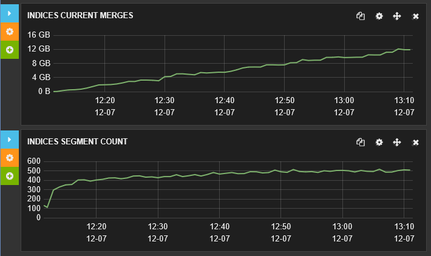

***Index merge activity for an index refresh rate of 1 second***

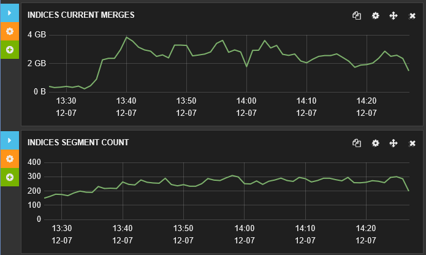

***Index merge activity for an index refresh rate of 30 seconds***

### The Impact of Replicas on Data Ingestion Performance

Replicas are an essential feature of any resilient cluster, and without using them you risk losing information if a node fails. However, replicas increase the amount of disk and network I/O being performed and can be detrimental to the rate at which data is ingested. For reasons described earlier, it may be beneficial to temporarily disable replicas for the duration of large-scale data upload operations.

Data ingestion performance tests were repeated using three configurations:

* Using a cluster with no replicas,

* Using a cluster with 1 replica, and

* Using a cluster with 2 replicas.

In all cases, the cluster comprised 7 shards spread across 3 nodes and ran on VMs configured as described in the previous set of tests. The test index used a refresh interval of 30 seconds.

The following table summarizes the response times and throughput of each test for comparison purposes:

| Configuration | \# Samples | Average Response Time – Successful Operations (ms) | Throughput – Successful Operations (Operations/s) | \# Data Ingestion errors |
|---------------|------------|----------------------------------------------------|---------------------------------------------------|--------------------------|
| 0 replicas    | 215451     | 200                                                | 59.8                                              | 0                        |
| 1 replica     | 117758     | 365                                                | 32.7                                              | 0                        |
| 2 replicas    | 94218      | 453                                                | 26.1                                              | 194262                   |


The decline in performance as the number of replicas increases is clear, but you should also notice the large volume of data ingestion errors in the third test. The messages generated by these errors indicated that they were due to the bulk insert queue overflowing causing requests to be rejected. These rejections occurred very quickly, hence the large number.

> [AZURE.NOTE] The results of the third test highlight the importance of using an intelligent retry strategy when transient errors such as this occur—back off for a short period to allow the bulk insert queue to drain before reattempting to repeat the bulk insert operation.

The next sets of graphs compare the response times during the tests. In each case the first graph shows the overall response times, while the second graph zooms in on the response times for the fastest operations (note that the scale of the first graph is ten times that of the second). You can see how the profile of the response times varies across the three tests.

With no replicas, most operations took between 75ms and 750ms, with the quickest response times around 25ms:

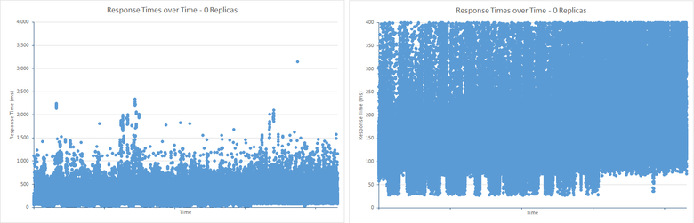

With 1 replica the most populated operational response time was in the range 125ms to 1250ms. The quickest responses took approximately 75ms, although there were fewer of these quick responses than in the 0 replicas case. There were also far more responses that took significantly longer than the most common cases, in excess of 1250ms:

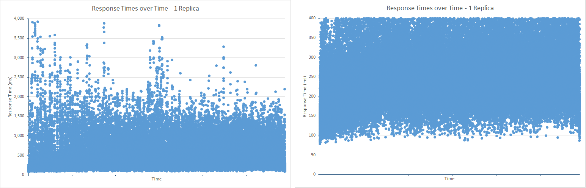

With 2 replicas, the most populated response time range was 200ms to 1500ms, but there were far fewer results below the minimum range than in the 1 replica test. However, the pattern of results above the upper limit were very similar to that of the 1 replica test. This is most likely due to the effects of the bulk insert queue overflowing (exceeding a queue length of 50 requests). The additional work required to maintain 2 replicas causes the queue to overflow more frequently, preventing ingestion operations from having excessive response times; operations are rejected quickly rather than taking a lengthy period of time, possibly causing timeout exceptions or impacting the responsiveness of client applications (this is the purpose of the bulk insert queue mechanism):

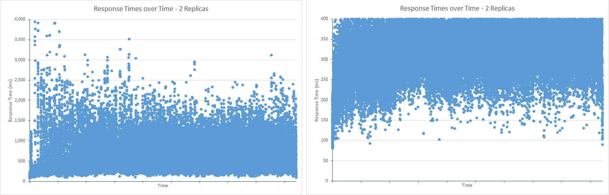

<span id="_The_Impact_of_1" class="anchor"><span id="_Impact_of_Increasing" class="anchor"></span></span>Using Marvel, you can see the effect of the number of replicas on the bulk index queue. The figure below shows the data from Marvel which depicts how the bulk insert queue filled during the test. The average queue length was around 40 requests, but periodic bursts caused it to overflow and requests were rejected as a result:


***Bulk index queue size and number of requests rejected with 2 replicas.***

You should compare this with the figure below which shows the results for a single replica. The Elasticsearch engine was able to process requests quickly enough to keep the average queue length at around 25, and at no point did the queue length exceed 50 requests so no work was rejected.

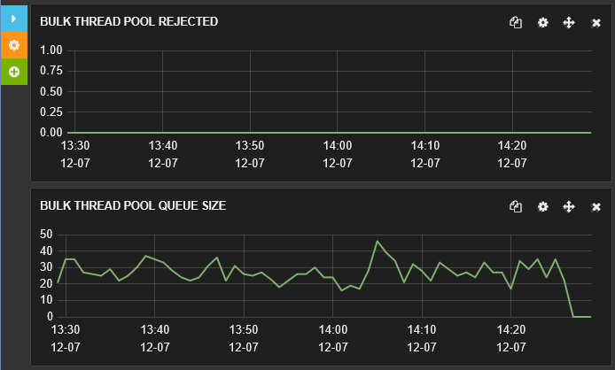

***Bulk index queue size and number of requests rejected with 1 replica.***

## Best Practices for Clients Sending Data to Elasticsearch

Many aspects of performance are concerned not only internally within the system but with how the system is used by client applications. Elasticsearch provides many features that can be utilized by the data ingestion process; generating unique identifiers for documents, performing document analysis, and even using scripting to transform the data as it is stored are some examples. However, these functions all add to the load on the Elasticsearch engine, and in many cases can be performed more efficiently by client applications prior to transmission. 

> [AZURE.NOTE] This list of best practices is primarily concerned with ingesting new data rather modifying existing data already stored in an index. Ingestion workloads are performed as append operations by Elasticsearch whereas data modifications are performed as delete/append operations. This is because documents in an index are immutable, so modifying a document involves replacing the entire document with a new version. You can either perform an HTTP PUT request to overwrite an existing document, or you can use the Elasticsearch *update* API which abstracts a query to fetch an existing document, merges the changes, and then performs a PUT to store the new document.

Additionally, consider implementing the following practices where appropriate:

* Disable text analysis for index fields that do not need to be analyzed. Analysis involves tokenizing text to enable queries that can search for specific terms. However, it can be a CPU-intensive task, so be selective. If you are using Elasticsearch to store log data it, might be useful to tokenize the detailed log messages to allow complex searches. Other fields, such as those containing error codes or identifiers should probably not be tokenized (how frequently are you likely to request the details of all messages whose error code contains a "3", for example?) The following code disable analysis for the *name* and *hostip* fields in the *logs* type of the *systembase* index:

	```http
	PUT /systembase
	{
		"settings" : {
			...
		},
		"logs" : {
			...
			"name": {
				"type": "string",
				"index" : "not_analyzed"
			},
			"hostip": {
				"type": "string",
				"index" : "not_analyzed"
			},
			...
		}
	}
	```

* Disable the *_all* field of an index if it is not required. The *\_all* field concatenates the values of the other fields in the document for analysis and indexing. It is useful for performing queries that can match against any field in a document. If clients are expected to match against named fields, then enabling *\_all* simply incurs CPU and storage overhead. The following example shows how to disable the *\_all* field for the *logs* type in the *systembase* index.

	```http
	PUT /systembase
	{
		"settings" : {
			...
		},
		"logs" : {
			"_all": {
				"enabled" : false
			},
			...,
		...
		}
	}
	```

    Note that you can create a selective version of *\_all* that only contains information from specific fields. For more information, see [Disabling the \_all Field](https://www.elastic.co/guide/en/elasticsearch/reference/current/mapping-all-field.html#disabling-all-field).

* Avoid dynamic mappings in indexes. Dynamic mapping is a powerful feature, but adding new fields to an existing index requires coordinating changes to the index structure across nodes which can temporarily cause the index to be locked. Dynamic mapping can also lead to an explosion in the number of fields and the consequent volume of index metadata if not used carefully. In turn, this results in increased storage requirements and I/O, both for ingesting data and when performing queries. Both of these issues will impact performance. Consider disabling dynamic mapping and define your index structures explicitly. For more information, see [Dynamic Field Mapping](https://www.elastic.co/guide/en/elasticsearch/reference/current/dynamic-field-mapping.html#dynamic-field-mapping).

* Understand how to balance the workload to meet conflicting requirements. You should always consider that data ingestion can have a significant impact on the performance of other concurrent operations, such as users performing queries. Data ingestion might be subject to sudden bursts, and if the system attempts to consume all the data arriving immediately the influx could cause query rates to slow down to a trickle. Elasticsearch tries to prevent this situation from occurring by regulating the rate at which it will process ingestion requests through the bulk insert queue (refer to the section [Determining Limiting Factors – CPU Utilization](#determining-limiting-factors-cpu-utilization) for further information), but this mechanism should really be treated as a last resort; if your application code is not prepared to handle rejected requests then you risk losing data. Instead, consider using a pattern such as [Queue-Based Load Levelling](https://msdn.microsoft.com/library/dn589783.aspx) to control the rate at which data is passed to Elasticsearch.

* Ensure that your cluster has sufficient resources to handle the workload, especially if indexes are configured with multiple replicas.

* Use the bulk insert API to upload large batches of documents. Size bulk requests appropriately. Sometimes bigger batches are not better for performance, and can cause Elasticsearch threads and other resources to become overloaded, delaying other concurrent operations. The documents in a bulk insert batch are held in memory at the coordinating node while the operation is performed; the physical size of each batch that is more important than the document count. There is no hard and fast rule as to what constitutes the ideal batch size, although Elasticsearch documentation recommends using between 5MB and 15MB as a starting point for your own investigations. Conduct performance testing to establish the optimal batch size for your own scenarios and workload mix.

* Make sure that bulk insert requests are distributed across nodes rather than directed to a single node. Directing all requests to a single node can cause memory exhaustion as each bulk insert request being processed is stored in memory in the node. It can also increase network latency as requests are redirected to other nodes.

* Elasticsearch uses a quorum consisting of a majority of the primary and replica nodes when writing data. A write operation is not completed until the quorum reports success. This approach helps to ensure that data is not written if a majority of the nodes are unavailable due to a network partition (failure) event. Using a quorum can slow the performance of write operations. You can disable quorum-based writing by setting the *consistency* parameter to *one* when writing data. The following example adds a new document but completes as soon as the write to the primary shard has completed.

	```http
	PUT /my_index/my_data/104?consistency=one
	{
		"name": "Bert",
		"age": 23
	}
	```

	Note that as with asynchronous replication, disabling quorum-based writing can lead to inconsistencies between the primary shard and each of the replicas.

* When using quorums, Elasticsearch will wait if insufficient nodes are available before determining that a write operation should be aborted because a quorum cannot be reached. This wait period is determined by the timeout query parameter (the default is 1 minute). You can modify this setting by using the timeout query parameter. The example below creates a new document and waits for a maximum of 5 seconds for the quorum to respond before aborting:

	```http
	PUT /my_index/my_data/104?timeout=5s
	{
		"name": "Sid",
		"age": 27
	}
	```

	Elasticsearch also lets you use your own version numbers [generated externally](https://www.elastic.co/guide/en/elasticsearch/reference/current/docs-index_.html#_version_types).

* Consider disabling the *\_source* field of an index. This field contains a copy of the original JSON document that was used when a document is stored. Saving this field incurs additional storage costs and disk I/O. However, these costs may be marginal depending on the document structure, and you should also be aware that disabling the *\_source* field prevents a client from being able to perform the following operations:

	* Using the Update API to modify a document.
	* Performing on the fly highlighting when running queries.
	* Reindexing data.
	* Debugging queries and aggregations by viewing the original document.

	The following example disables the *\_source* field for the *logs* type in the *systembase* index.

  ```http
  PUT /systembase
  {
		"settings" : {
			...
		},
		"logs" : {
			"_source": {
				"enabled": false
			},
			...,
		...
		}
  }
  ```

## General Guidelines for Conducting Data Ingestion Performance Testing with Elasticsearch

The following points highlight some of the items you should consider when running performance tests with Elasticsearch and analyzing the results.

* Performance testing is necessarily time consuming and costly. At a minimum, gather statistics that measure transfer rates on disk and network, CPU utilization, CPU wait times and disk latency (if possible). This can give you fast feedback on your test effort with good return of investment.

* Leverage any scripting capabilities provided by your load testing tool to collect metrics that might not otherwise be available. For example, Linux has a plethora of reliable and good performance statistics that you can gather using utilities such as *vmstat* and *iostat*. You can use scripting with JMeter to capture this data as part of a test plan.

* Performance engineering is mostly about analyzing statistics based on reliable and repeatable data. Do not stop at a high level metrics which will not give the necessary insights. Educate yourself with the data and make performance engineering a dev ops process with a fast feedback loop. Always look at the statistics comparing trends and past results/configurations. By doing this on a regular basis you will generate data that you will understand, is repeatable with your workloads, and with which you will be able to assess the effects of changes in configuration and deployment.

* Use a tool such as Marvel to monitor cluster and node performance while testing to gain additional insights. JMeter can be effective for capturing raw data for subsequent analysis, but using Marvel can give you a real-time feel for how performance is faring and the possible causes of glitches and slow-downs. Additionally, many Load test tools do not provide visibility to the inner metrics of Elasticsearch. Use and compare indexing throughput rates, merge segment counts, GC stats and throttling times available in index statistics. Repeat this analysis on a regular basis.

* Compare your load test tool statistics with node statistics in Marvel (disk and network traffic, CPU utilization, memory and thread pool usage) to understand the correlation pattern between the figures reported by the infrastructure and specific Elasticsearch statistics.

* As a general rule consider *one node one shard* as the baseline for performance testing and assess application costs by adding nodes. However, do not depend completely on extrapolating performance based on a small number of nodes and shards. Synchronization and communication costs in the cluster can have unpredictable effects the larger the number of nodes and shards.

* Look at the shard allocation across nodes to compare the statistics. Some nodes will have fewer replicas and shards which will create an imbalance of resource utilization.

* If you are performing load testing, increase the number of threads that your test tool uses to submit work to the cluster until errors occur. For sustainable throughput testing consider maintaining your test level below an agreed *glass ceiling*. If the error rate exceeds the glass ceiling, errors will incur cost on backend resources due to recoverability. In these situations, throughput will inevitably diminish.

* To simulate how your system reacts to an unexpectedly large burst of activity, consider running tests that generate an error rate your glass ceiling with error rate. This will give you throughput figures not only in terms of capacity but also the cost of recoverability.

* Use a document count to assess your performance profile, and recycle documents following your workload patterns. Consider that as more documents are added, the performance profile might change.

* Be aware of the SLAs for IOPS and transfer rates limits for the storage you are using. Different storage types (SSD, spinning media) have different transfer rates.

* Remember that CPU performance can drop not only because of disk and network activity, but because backend applications can use locking and communication mechanisms with distributed processing that may cause underutilization of the processor.

* Run performance tests for at least two hours (not a few minutes). Indexing can affect performance in ways which may not be visible immediately. For example, JVM garbage collection statistics and indexing merges can change the performance profile over time.

* Consider how index refreshes might big impact data ingestion throughput and throttling with a cluster.

## Summary

It is important to understand how to scale your solution as the volumes of data and the number of requests increases. Elasticsearch running on Azure enables vertical and horizontal scaling; you can run on bigger VMs with more resources, and you can distribute an Elasticsearch cluster across a network of VMs. The range of options can be bewildering; is it more cost-effective to implement a cluster on a large number of small VMs, on a cluster with a small number of large VMs, or somewhere in the middle? Also, how many shards should each index contain, and what are the tradeoffs concerning data ingestion versus query performance? The way in which shards are distributed across nodes can have a significant impact on the data ingestion throughput. Using more shards can reduce the amount of internal contention that occurs within a shard, but you must balance this benefit with the overhead that using many shards can impose on a cluster. To answer these questions effectively, you should be prepared to test your system to determine the most appropriate strategy.

For data ingestion workloads, the performance of the disk I/O subsystem is a critical factor. Using SSDs can boost throughput by reducing the disk latency of write operations. If you don't need vast amounts of disk space on a node, consider using standard VMs with ephemeral storage in place of more expensive VMs that support premium storage.

## Appendix: The Bulk Load Data Ingestion Performance Test

This appendix describes the performance test performed against the Elasticsearch cluster. The tests were run by using JMeter running on a separate set of VMs. Details the configuration of the test environment are described in [Creating a Performance Testing Environment for Elasticsearch on Azure][]. To perform your own testing, you can create your own JMeter test plan manually, or you can use the automated test scripts available separately. See [Running the Automated Elasticsearch Performance Tests][] for further information.

The data ingestion workload performed a large-scale upload of documents by using the bulk insert API. The purpose of this index was to simulate a repository receiving log data representing system events for subsequent search and analysis. Each document was stored in a single index named *systembase*, and had the type *logs*. All documents had the same fixed schema described by the following table:

| Field         | Datatype            | Example                           |
|---------------|---------------------|-----------------------------------|
| @timestamp    | datetime            | 2013-12-11T08:01:45.000Z          |
| name          | string              | checkout.payment                  |
| message       | string              | Incoming request message          |
| severityCode  | integer             | 1                                 |
| severity      | string              | info                              |
| hostname      | string              | sixshot                           |
| hostip        | string (ip address) | 10.0.0.4                          |
| pid           | int                 | 123                               |
| tid           | int                 | 4325                              |
| appId         | string (uuid)       | {00000000-0000-0000-000000000000} |
| appName       | string              | mytestapp                         |
| appVersion    | string              | 0.1.0.1234                        |
| type          | int                 | 5                                 |
| subtype       | int                 | 1                                 |
| correlationId | guid                | {00000000-0000-0000-000000000000} |
| os            | string              | Linux                             |
| osVersion     | string              | 4.1.1                             |
| parameters    | [ ]                | {key:value,key:value}             |

You can use the following request to create the index. The *number\_of\_replicas*, *refresh\_interval*, and *number\_of\_shards* settings varied from the values shown below in many of the tests.

> [AZURE.IMPORTANT] The index was dropped and recreated prior to each test run.

```http
PUT /systembase
{
	"settings" : {
		"number_of_replicas": 1,
		"refresh_interval": "30s",
		"number_of_shards": "5"
	},
	"logs" : {
		"properties" : {
			"@timestamp": {
			"type": "date",
			"index" : "not_analyzed"
			},
			"name": {
				"type": "string",
				"index" : "not_analyzed"
			},
			"message": {
				"type": "string",
				"index" : "not_analyzed"
			},
			"severityCode": {
				"type": "integer",
				"index" : "not_analyzed"
			},
			"severity": {
				"type": "string",
				"index" : "not_analyzed"
			},
			"hostname": {
				"type": "string",
				"index" : "not_analyzed"
			},
			"hostip": {
				"type": "string",
				"index" : "not_analyzed"
			},
			"pid": {
				"type": "integer",
				"index" : "not_analyzed"
			},
			"tid": {
				"type": "integer",
				"index" : "not_analyzed"
			},
			"appId": {
				"type": "string",
				"index" : "not_analyzed"
			},
			"appName": {
				"type": "string",
				"index" : "not_analyzed"
			},
			"appVersion": {
				"type": "integer",
				"index" : "not_analyzed"
			},
			"type": {
				"type": "integer",
				"index" : "not_analyzed"
			},
			"subtype": {
				"type": "integer",
				"index" : "not_analyzed"
			},
			"correlationId": {
				"type": "string",
				"index" : "not_analyzed"
			},
			"os": {
				"type": "string",
				"index" : "not_analyzed"
			},
			"osVersion": {
				"type": "string",
				"index" : "not_analyzed"
			},
			"parameters": {
				"type": "string",     
				"index" : "not_analyzed"
			}
		}
	}
}
```

Each bulk insert batch comprised 1000 documents. Each document was generated based on a combination of random values for the *severityCode*, *hostname*, *hostip*, *pid*, *tid*, *appName*, *appVersion*, *type*, *subtype*, and *correlationId* fields, and a random selection of text from a fixed set of terms for the *name*, *message*, *severity*, *os*, *osVersion*, *parameters*, *data1*, and *data2* fields. The number of client application instances used to upload data was carefully selected to maximize successful input volume. Tests ran for two hours to enable the cluster to settle and reduce the influence of any temporary glitches in the overall results. In this time, some tests uploaded nearly 1.5 billion documents.

The data was generated dynamically by using a custom JUnit Request sampler that was added to a thread group in a JMeter test plan. The JUnit code was created by using the JUnit Test Case template in the Eclipse IDE.

> [AZURE.NOTE] For information on how to create a JUnit test for JMeter, see [Deploying a JMeter JUnit Sampler for Testing Elasticsearch Performance][].

The following snippet shows the Java code for testing Elasticsearch 1.7.3. Note that the JUnit test class in this example is named *ElasticsearchLoadTest2*:

```java
/* Java */
package elasticsearchtest2;

	import static org.junit.Assert.*;

	import org.junit.*;

	import java.util.*;

	import java.io.*;

	import org.elasticsearch.action.bulk.*;
	import org.elasticsearch.common.transport.*;
	import org.elasticsearch.client.transport.*;
	import org.elasticsearch.common.settings.*;
	import org.elasticsearch.common.xcontent.*;

	public class ElasticsearchLoadTest2 {

		private String [] names={"checkout","order","search","payment"};
		private String [] messages={"Incoming request from code","incoming operation succeeded with code","Operation completed time","transaction performed"};
		private String [] severity={"info","warning","transaction","verbose"};
		private String [] apps={"4D24BD62-20BF-4D74-B6DC-31313ABADB82","5D24BD62-20BF-4D74-B6DC-31313ABADB82","6D24BD62-20BF-4D74-B6DC-31313ABADB82","7D24BD62-20BF-4D74-B6DC-31313ABADB82"};

		private String hostname = "";
		private String indexstr = "";
		private String typestr = "";
		private int port = 0;
		private int itemsPerInsert = 0;
		private String clustername = "";
		private static Random rand=new Random();

		@Before
		public void setUp() throws Exception {
		}

		public ElasticsearchLoadTest2(String paras) {
		\* Paras is a string containing a set of comma separated values for:
			hostname
			indexstr
			typestr
			port
			clustername
			node
			itemsPerInsert
		*/

			// Note: No checking/validation is performed

			String delims = "[ ]*,[ ]*"; // comma surrounded by zero or more spaces
			String[] items = paras.split(delims);

			hostname = items[0];
			indexstr = items[1];
			typestr = items[2];
			port = Integer.parseInt(items[3]);
			clustername = items[4];
			itemsPerInsert = Integer.parseInt(items[5]);

			if (itemsPerInsert == 0)
				itemsPerInsert = 1000;
			}

		@After
		public void tearDown() throws Exception {
		}

		@Test
		public void BulkBigInsertTest() throws IOException {

			Settings settings = ImmutableSettings.settingsBuilder().put("cluster.name", clustername).build();

			TransportClient client;
			client = new TransportClient(settings);

			try {
				client.addTransportAddress(new InetSocketTransportAddress(hostname, port));
				BulkRequestBuilder bulkRequest = client.prepareBulk();
				Random random = new Random();
				char[] exmarks = new char[12000];
				Arrays.fill(exmarks, 'x');
				String dataString = new String(exmarks);

				for(int i=1; i &lt; itemsPerInsert; i++){
					random.nextInt(10);
					int host=random.nextInt(20);

					bulkRequest.add(client.prepareIndex(indexstr, typestr).setSource(XContentFactory.jsonBuilder().startObject()
						.field("@timestamp", new Date())
						.field("name", names[random.nextInt(names.length)])
						.field("message", messages[random.nextInt(messages.length)])
						.field("severityCode", random.nextInt(10))
						.field("severity", severity[random.nextInt(severity.length)])
						.field("hostname", "Hostname"+host)
						.field("hostip", "10.1.0."+host)
						.field("pid",random.nextInt(10))
						.field("tid",random.nextInt(10))
						.field("appId", apps[random.nextInt(apps.length)])
						.field("appName", "application" + host)
						.field("appVersion", random.nextInt(5))
						.field("type", random.nextInt(6))
						.field("subtype", random.nextInt(6))
						.field("correlationId", UUID.randomUUID().toString())
						.field("os", "linux")
						.field("osVersion", "14.1.5")
						.field("parameters", "{key:value,key:value}")
						.field("data1",dataString)
						.field("data2",dataString)
					.endObject()));
				}

				BulkResponse bulkResponse = bulkRequest.execute().actionGet();
				assertFalse(bulkResponse.hasFailures());
			}
			finally {
				client.close();
			}
		}

		@Test
		public void BulkDataInsertTest() throws IOException {
			Settings settings = ImmutableSettings.settingsBuilder().put("cluster.name", clustername).build();

			TransportClient client;
			client = new TransportClient(settings);

			try {
				client.addTransportAddress(new InetSocketTransportAddress(hostname, port));
				BulkRequestBuilder bulkRequest = client.prepareBulk();

				for(int i=1; i&lt; itemsPerInsert; i++){
					rand.nextInt(10);
					int host=rand.nextInt(20);

					bulkRequest.add(client.prepareIndex(indexstr, typestr).setSource(XContentFactory.jsonBuilder().startObject()
						.field("@timestamp", new Date())
						.field("name", names[rand.nextInt(names.length)])
						.field("message", messages[rand.nextInt(messages.length)])
						.field("severityCode", rand.nextInt(10))
						.field("severity", severity[rand.nextInt(severity.length)])
						.field("hostname", "Hostname" + host)
						.field("hostip", "10.1.0."+host)
						.field("pid",rand.nextInt(10))
						.field("tid",rand.nextInt(10))
						.field("appId", apps[rand.nextInt(apps.length)])
						.field("appName", "application"+host)
						.field("appVersion", rand.nextInt(5))
						.field("type", rand.nextInt(6))
						.field("subtype", rand.nextInt(6))
						.field("correlationId", UUID.randomUUID().toString())
						.field("os", "linux")
						.field("osVersion", "14.1.5")
						.field("parameters", "{key:value,key:value}")
					.endObject()));
				}

				BulkResponse bulkResponse = bulkRequest.execute().actionGet();
				assertFalse(bulkResponse.hasFailures());
			}
			finally {
				client.close();
			}
		}
	}
```

The private *String* arrays *names*, *messages*, *severity*, and *apps* contain a small set of values from which items are selected at random. The remaining data items for each document are generated at runtime.

The constructor that takes the *String* parameter is invoked from JMeter, and the values passed in the string are specified as part of the JUnit Request sampler configuration. For this JUnit test, the *String* parameter is expected to contain the following information:

* **Hostname**. This is the name or IP address of the Azure load balancer. The load balancer attempts to distribute the request across the data nodes in the cluster. If you are not using a load balancer you can specify the address of a node in the cluster, but all requests will be directed to that node which might result in it becoming a bottleneck.

* **Indexstr**. This is the name of the index into which the data generated by the JUnit test is added If you created the index as described above, this value should be *systembase*.

* **Typestr**. This is the type in the index in which the data is stored. If you created the index as described above, this value should be *logs*.

* **Port**. This is the port to connect to on the host. In most cases this should be set to 9300 (the port used by Elasticsearch to listen for client API requests; port 9200 is only used for HTTP requests).

* **Clustername**. This is the name of the Elasticsearch cluster containing the index.

* **ItemsPerInsert**. This is a numeric parameter indicating the number of documents to add in each bulk insert batch. The default batch size is 1000.

You specify the data for the constructor string in the JUnit Request page used to configure the JUnit sampler in JMeter. The following image shows an example:

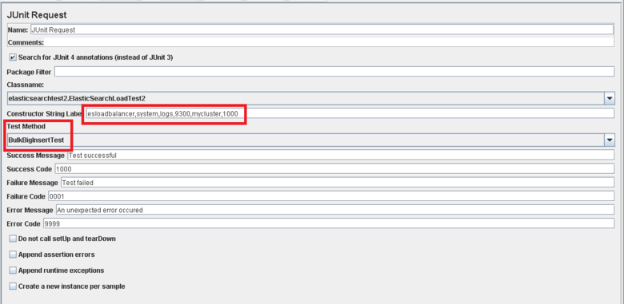

The *BulkInsertTest* and *BigBulkInsertTest* methods perform the actual work of generating and uploading the data. Both methods are very similar; they connect to the Elasticsearch cluster and then create a batch of documents (as determined by the *ItemsPerInsert* constructor string parameter). The documents are added to the index by using the Elasticsearch Bulk API. The difference between the two methods is that the *data1* and *data2* string fields in each document are omitted from the upload in the *BulkInsertTest* method, but are filled in with strings of 12000 characters in the *BigBulkInsertTest* method. Note that you select which of these methods to run using the *Test Method* box in the JUnit Request page in JMeter (highlighted in the previous figure).

> [AZURE.NOTE] The sample code presented here uses the Elasticsearch 1.7.3 Transport Client library. If you are using Elasticsearch 2.0.0 or later, you must use the appropriate library for the version selected. For more information about the Elasticsearch 2.0.0 Transport Client library, see the [Transport Client](https://www.elastic.co/guide/en/elasticsearch/client/java-api/2.0/transport-client.html) page on the Elasticsearch website.

[Configuring Resilience and Recovery on Elasticsearch on Azure]: guidance-elasticsearch-configuring-resilience-and-recovery.md
[Creating a Performance Testing Environment for Elasticsearch on Azure]: guidance-elasticsearch-creating-performance-testing-environment.md
[Running the Automated Elasticsearch Performance Tests]: guidance-elasticsearch-running-automated-performance-tests.md
[Deploying a JMeter JUnit Sampler for Testing Elasticsearch Performance]: guidance-elasticsearch-deploying-jmeter-junit-sampler.md
