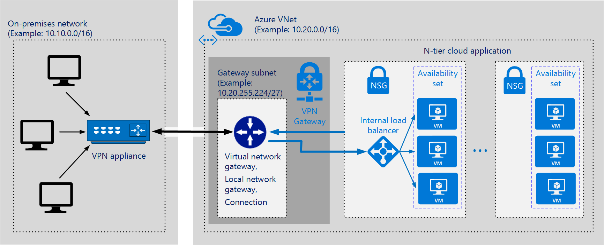

<properties
   pageTitle="Implementing a Hybrid Network Architecture with Azure and On-premises ExpressRoute with VPN failover | Blueprint | Microsoft Azure"
   description="How to implement a secure site-to-site network architecture that spans an Azure virtual network and an on-premises network connected by using ExpressRoute with VPN failover."
   services=""
   documentationCenter="na"
   authors="RohitSharma-pnp"
   manager="christb"
   editor=""
   tags=""/>

<tags
   ms.service="guidance"
   ms.devlang="na"
   ms.topic="article"
   ms.tgt_pltfrm="na"
   ms.workload="na"
   ms.date="04/20/2016"
   ms.author="roshar"/>

# Implementing a Hybrid Network Architecture with Azure and On-premises ExpressRoute with VPN failover

This article outlines a set of practices for extending an on-premises network onto Azure using ExpressRoute with a site-to-site virtual private network (VPN) as a failover connection. The traffic flows between the on-premises network and an Azure Virtual Network (VNet) through an ExpressRoute
connection by default.  If there is a loss of connectivity through the ExpressRoute connection, traffic will be routed through an IPSec VPN tunnel. This architecture is suitable for hybrid applications with the following characteristics:

- Parts of the application run on-premises while others run in Azure.

- It is beneficial to trade slightly extended latency for the flexibility and processing power of the cloud.

- The extended network constitutes a closed system. There is no direct path from the Internet to the Azure VNet.

- Users connect to the on-premises network to use the services hosted in Azure. The bridge between the on-premises network and the services running in Azure is transparent to users.

Examples of scenarios that fit this profile include:

- Line-of-business applications used within an organization, where part of the functionality has been migrated to the cloud.

- Development/test/lab workloads.

> [AZURE.NOTE] Azure has two different deployment models: [Resource Manager][resource-manager-overview] and classic. This blueprint uses Resource Manager, which Microsoft recommends for new deployments.

The following diagram highlights the components in this architecture:



- **On-premises network.** This is a network of computers and devices, connected through a private local-area network running within an organization.

- **VPN appliance.** This is a device or service that provides external connectivity to the on-premises network. The VPN appliance may be a hardware device, or it can be a software solution such as the Routing and Remote Access Service (RRAS) in Windows Server 2012. 

    > [AZURE.NOTE] For a list of supported VPN appliances and information on configuring selected VPN appliances for connecting to an Azure VPN Gateway, see the instructions for the appropriate device in the [list of VPN devices supported by Azure][vpn-appliance].

- **N-tier cloud application.** This is the application hosted in Azure. It might include multiple tiers, with multiple subnets connected through Azure load balancers. The traffic in each subnet may be subject to rules defined by using [Azure Network Security Groups (NSGs)][azure-network-security-group]. For more information, see [Getting started with Microsoft Azure security][getting-started-with-azure-security].

    > [AZURE.NOTE] This article describes the cloud application as a single entity. See [Implementing a Multi-tier Architecture on Azure][implementing-a-multi-tier-architecture-on-Azure] for detailed information.

- **[Virtual network (VNet)][azure-virtual-network].** The cloud application and the Azure VPN Gateway are placed into the same VNet.

- **[Azure VPN Gateway][azure-vpn-gateway].** The VPN gateway enables the VNet to connect to the VPN appliance in the on-premises network. The VPN gateway is configured to accept requests from the on-premises network only through the VPN appliance. For more information, see [Connect an on-premises network to a Microsoft Azure virtual network][connect-to-an-Azure-vnet].

- **Gateway subnet.** The Azure VPN Gateway is held in its own subnet, which is subject to various requirements.

- **Internal load balancer.** Network traffic from the VPN Gateway is routed to the cloud application through an internal load balancer. The load balancer is located in the front-end subnet of the application.

- **Virtual network gateway.** This is a resource that provides a virtual VPN appliance for the VNet. It is responsible for routing traffic from the on-premises network to the VNet.

- **Local network gateway.** This is an abstraction of the on-premises VPN appliance. Network traffic from the cloud application to the on-premises network is routed through this gateway.

- **Connection.** The connection has properties that specify the connection type (IPSec) and the key shared with the on-premises VPN appliance to encrypt traffic.

## Implementing this architecture

> [AZURE.NOTE] The process outlined below assumes that you already have the on-premises network, and that you have installed a VPN appliance on-premises.

The following high-level steps outline a process for implementing this architecture:

- Obtain and provision an ExpressRoute circuit from one of the supported service providers.  See [Implementing a Hybrid Network Architecture with Azure ExpressRoute][implementing-expressroute]

- Get the public IP address of the VPN appliance through which network requests are routed. If you are using RRAS, this will be the IP address of the machine running the RRAS service.

- Create an Azure VNet. The address space of the VNet must not overlap with the on-premises network. For example, the diagram above uses the address space 10.20.0.0/16 for the VNet.

- Create a separate subnet named _GatewaySubnet_, with an address range of /27. Avoid placing this subnet in the middle of the address space. A good practice is to set the address space for the gateway subnet at the upper end of the VNet address space. The example shown in the diagram uses 10.20.255.224/27.

- Allocate a public IP address for the ExpressRoute virtual network gateway.

- Create the ExpressRoute virtual network gateway for the VNet and assign it the newly allocated public IP address.

	> [AZURE.NOTE] The ExpressRoute virtual network gateway must be a standard or high-performance gateway to support this architecture.

- Create an ExpressRoute connection between the ExpressRoute virtual network gateway and the ExpressRoute circuit.

- Allocate a public IP address for the Site-to-Site virtual network gateway

- Create the Site-to-Site (Vpn) virtual network gateway for the VNet and assign it the newly allocated public IP address.

    > [AZURE.NOTE] The Site-to-Site virtual network gateway must be a standard or high-performance, route-based gateway to support this architecture.

- Create a local network gateway. Specify the public IP address of the on-premises VPN appliance, and the address space of the on-premises network.

- Create a Site-to-Site connection for the virtual network gateway and the local network gateway. Select the Site-to-Site (IPSec) connection type, and specify the shared key.

	Site-to-site encryption with the Azure VPN Gateway is based on the IPSec protocol, using pre-shared keys for authentication. The key is specified when the Azure VPN Gateway is configured. The same key must be provided to the VPN appliance running on-premises. Other authentication mechanisms are not currently supported.

- Open any ports required by the cloud application in the on-premises network.

- Create an internal load balancer to handle the on-premises network traffic.

- Test the configuration to verify that:

    - TODO <!--Fill in this section once we figure out how to test-->
	- The on-premises VPN appliance correctly routes traffic to the cloud application through the Azure VPN Gateway.

	- The VNet correctly routes traffic back to the on-premises network.

	- Prohibited traffic in both directions is blocked correctly.

## Availability

- For ExpressRoute availability recommendations, see the [Availability][availability-expressroute] section of the [Implementing a Hybrid Network Architecture with Azure ExpressRoute][guidance-expressroute] guidance

- For VPN security recommendations, see the [Availability][availability-vpn] section of the [Implementing a Hybrid Network Architecture with Azure and On-premises VPN][guidance-vpn] guidance

## Security

- For ExpressRoute security recommendations, see the [Security][security-expressroute] section of the [Implementing a Hybrid Network Architecture with Azure ExpressRoute][guidance-expressroute] guidance

- For VPN security recommendations, see the [Security][security-vpn] section of the [Implementing a Hybrid Network Architecture with Azure and On-premises VPN][guidance-vpn] guidance

## Scalability

- For ExpressRoute scalability recommendations, see the [Scalability][scalability-expressroute] section of the [Implementing a Hybrid Network Architecture with Azure ExpressRoute][guidance-expressroute] guidance

- For VPN scalability recommendations, see the [Scalability][scalability-vpn] section of the [Implementing a Hybrid Network Architecture with Azure and On-premises VPN][guidance-vpn] guidance

## Monitoring and manageability

- For ExpressRoute monitoring recommendations, see the [Monitoring][monitoring-expressroute] section of the [Implementing a Hybrid Network Architecture with Azure ExpressRoute][guidance-expressroute] guidance

- For VPN monitoring recommendations, see the [Monitoring and manageability][monitoring-vpn] section of the [Implementing a Hybrid Network Architecture with Azure and On-premises VPN][guidance-vpn] guidance

## Troubleshooting

- For ExpressRoute troubleshooting recommendations, see the [Troubleshooting][troubleshooting-expressroute] section of the [Implementing a Hybrid Network Architecture with Azure ExpressRoute][guidance-expressroute] guidance

- For VPN troubleshooting recommendations, see the [Troubleshooting][troubleshooting-vpn] section of the [Implementing a Hybrid Network Architecture with Azure and On-premises VPN][guidance-vpn] guidance

## Azure PowerShell commands

The script in this section uses [Azure PowerShell][azure-powershell] commands to connect an on-premises network to an Azure VNet by using an Azure VPN Gateway. Requests are routed to VMs in the VNet through an internal load balancer. Running these commands results in the structure shown in the previous diagrams.

This script assumes that you have:

- Created and [prepared your on-premises network][create-on-prem-network] with an address space of 10.10.0.0/16.

- Installed and configured an on-premises VPN device with a public IP address. This example uses a fictitious IP address of 40.50.60.70.

```text
Put PowerShell here!
```

## <a name="next-steps"></a>Next steps

- We need links!

<!-- links -->

[er-vpn-limits-and-limitations]: ./expressroute/expressroute-how-to-coexist-resource-manager.md#limits-and-limitations
[guidance-expressroute]: ./guidance-hybrid-network-expressroute.md
[guidance-vpn]: ./guidance-hybrid-network-vpn.md
[implementing-expressroute]: ./guidance-hybrid-network-expressroute.md#implementing-this-architecture
[security-expressroute]: ./guidance-hybrid-network-expressroute.md#security
[security-vpn]: ./guidance-hybrid-network-vpn.md#security
[scalability-expressroute]: ./guidance-hybrid-network-expressroute.md#scalability
[scalability-vpn]: ./guidance-hybrid-network-vpn.md#scalability
[monitoring-expressroute]: ./guidance-hybrid-network-expressroute.md#monitoring
[monitoring-vpn]: ./guidance-hybrid-network-vpn.md#monitoring-and-manageability
[troubleshooting-expressroute]: ./guidance-hybrid-network-expressroute.md#troubleshooting
[troubleshooting-vpn]: ./guidance-hybrid-network-vpn.md#troubleshooting
[availability-expressroute]: ./guidance-hybrid-network-expressroute.md#availability
[availability-vpn]: ./guidance-hybrid-network-vpn.md#availability

[resource-manager-overview]: ../resource-group-overview.md
[vpn-appliance]: ../vpn-gateway/vpn-gateway-about-vpn-devices.md
[getting-started-with-azure-security]: ./../azure-security-getting-started.md
[implementing-a-multi-tier-architecture-on-Azure]: ./iaas-multi-tier.md
[azure-vpn-gateway]: https://azure.microsoft.com/services/vpn-gateway/
[connect-to-an-Azure-vnet]: https://technet.microsoft.com/library/dn786406.aspx
[create-on-prem-network]: https://technet.microsoft.com/library/dn786406.aspx#routing
[azure-powershell]: ../powershell-azure-resource-manager.md

