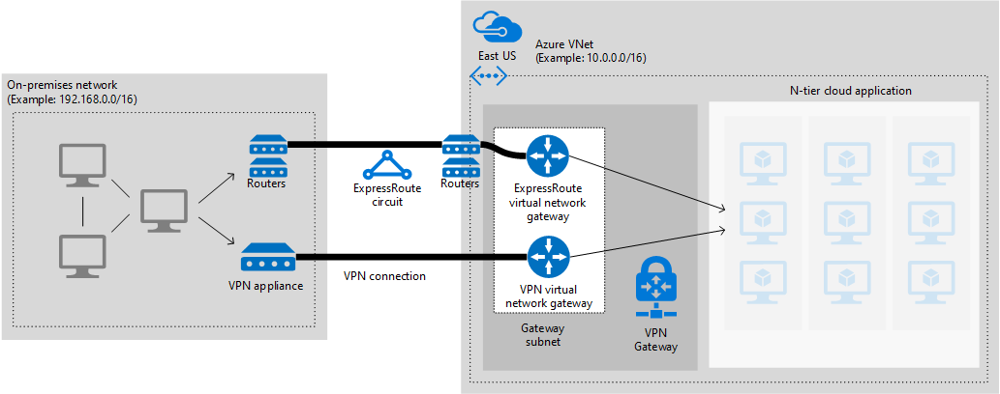

<properties
   pageTitle="Implementing a highly available hybrid network architecture in Azure by using failover between ExpressRoute and VPN gateway | Blueprint | Microsoft Azure"
   description="How to implement a secure site-to-site network architecture that spans an Azure virtual network and an on-premises network connected by using ExpressRoute with VPN gateway failover."
   services="guidance"
   documentationCenter="na"
   authors="telmosampaio"
   manager="christb"
   editor=""
   tags=""/>

<tags
   ms.service="guidance"
   ms.devlang="na"
   ms.topic="article"
   ms.tgt_pltfrm="na"
   ms.workload="na"
   ms.date="04/26/2016"
   ms.author="telmos"/>

# Azure blueprints: Implementing a highly available hybrid network architecture in Azure by using failover between ExpressRoute and VPN gateway

This article describes best practices for connecting an on-premises network to virtual networks on Azure by using ExpressRoute, with a site-to-site virtual private network (VPN) as a failover connection. The traffic flows between the on-premises network and an Azure virtual network (VNet) through an ExpressRoute connection.  If there is a loss of connectivity in the ExpressRoute circuit, traffic will be routed through an IPSec VPN tunnel. 

> [AZURE.NOTE] Azure has two different deployment models: [Resource Manager][resource-manager-overview] and classic. This blueprint uses Resource Manager, which Microsoft recommends for new deployments.

Typical use cases for this architecture include:

- Hybrid applications where workloads are distributed between an on-premises network and Azure.
- Applications running large-scale, mission-critical workloads that require a high degree of scalability.
- Large-scale backup and restore facilities for data that must be saved off-site.
- Handling Big Data workloads.
- Using Azure as a disaster-recovery site.

## Architecture blueprint

The following diagram highlights the important components in this architecture:



- **Azure Virtual Networks (VNets).** Each VNet resides in a single Azure region, and can host multiple application tiers. Application tiers can be segmented using subnets in each VNet  and/or network security groups (NSGs). 

- **On-premises corporate network.** This is a network of computers and devices, connected through a private local-area network running within an organization.

- **ExpressRoute circuit.** This is a layer 2 or layer 3 circuit supplied by the connectivity provider that joins the on-premises network with Azure through the edge routers. The circuit uses the hardware infrastructure managed by the connectivity provider.

- **VPN appliance.** This is a device or service that provides external connectivity to the on-premises network. The VPN appliance may be a hardware device, or it can be a software solution such as the Routing and Remote Access Service (RRAS) in Windows Server 2012. 

    > [AZURE.NOTE] For a list of supported VPN appliances and information on configuring selected VPN appliances for connecting to an Azure VPN Gateway, see the instructions for the appropriate device in the [list of VPN devices supported by Azure][vpn-appliance].

- **[Azure VPN Gateway][azure-vpn-gateway].** The VPN gateway enables the VNet to connect to the VPN appliance in the on-premises network. The VPN gateway is configured to accept requests from the on-premises network only through the VPN appliance. For more information, see [Connect an on-premises network to a Microsoft Azure virtual network][connect-to-an-Azure-vnet].

- **Gateway subnet.** The Azure VPN Gateway is held in its own subnet, which is subject to various requirements.

- **Internal load balancer.** Network traffic from the VPN Gateway is routed to the cloud application through an internal load balancer. The load balancer is located in the front-end subnet of the application.

- **Virtual network gateway.** This is a resource that provides a virtual VPN appliance for the VNet. It is responsible for routing traffic from the on-premises network to the VNet.

- **Local network gateway.** This is an abstraction of the on-premises VPN appliance. Network traffic from the cloud application to the on-premises network is routed through this gateway.

- **Connection.** The connection has properties that specify the connection type (IPSec) and the key shared with the on-premises VPN appliance to encrypt traffic.

- **N-tier cloud application.** This is the application hosted in Azure. It might include multiple tiers, with multiple subnets connected through Azure load balancers. The traffic in each subnet may be subject to rules defined by using [Azure Network Security Groups (NSGs)][azure-network-security-group]. For more information, see [Getting started with Microsoft Azure security][getting-started-with-azure-security].

    > [AZURE.NOTE] This article describes the cloud application as a single entity. See [Implementing a Multi-tier Architecture on Azure][implementing-a-multi-tier-architecture-on-Azure] for detailed information.

## Implementing this architecture

The following high-level steps outline a process for implementing this architecture. Detailed examples using Azure PowerShell commands are describe [later in this document][script]. Note that this process assumes that you have already created a VNet for hosting the cloud application, that you have created the on-premises network, that your on-premises network has a VPN appliance, and that your organization has met the [ExpressRoute prerequisite requirements][expressroute-prereq] for connecting to Azure.

1. If you already have a VPN gateway in your Azure VNet remove the VPN gateway, as shown below.
```powershell
Remove-AzureRmVirtualNetworkGateway -Name <yourgatewayname> -ResourceGroupName <yourresourcegroup>
```
2. Make sure your **GatewaySubnet** has a /27 mask. If it does not, remove the existing subnet as shown below.
```powershell
$vnet = Get-AzureRmVirtualNetworkGateway -Name <yourvnetname> -ResourceGroupName <yourresourcegroup> 
Remove-AzureRmVirtualNetworkSubnetConfig -Name GatewaySubnet -VirtualNetwork $vnet
```
3. If needed, add a **GatewaySubnet** that has a /27 mask or larger, as shown below.
```powershell
$vnet = Get-AzureRmVirtualNetworkGateway -Name <yourvnetname> -ResourceGroupName <yourresourcegroup>
Add-AzureRmVirtualNetworkSubnetConfig -Name "GatewaySubnet" -VirtualNetwork $vnet -AddressPrefix "10.200.255.224/27"
$vnet = Set-AzureRmVirtualNetwork -VirtualNetwork $vnet
```
4. Follow the instructions in [Implementing a hybrid network architecture with Azure ExpressRoute][implementing-expressroute] to establish your ExpressRoute connection.

5. Follow the instructions in [Implementing a hybrid network architecture with Azure and On-premises VPN][implementing-vpn] to establish your VPN gateway connection.

## Testing your solution

Once the connections are established, test the environment as following:

1. Make sure you can connect from your on-premises network to your Azure VNet.
2. Remove the ExpressRoute connection.
```powershell
Remove-AzureRmVirtualNetworkGatewayConnection -ResourceGroupName <yourresourcegroup> -Name <yourERconnection>
```
3. Verify that the you can still connect from your on-premises network to your Azure VNet.
4. Reestablish the ExpressRoute connection.
```powershell
New-AzureRmVirtualNetworkGatewayConnection -ResourceGroupName <yourresourcegroup> -Name <yourERconnection> -ConnectionType ExpressRoute -VirtualNetworkGateway1 <gateway1> -VirtualNetworkGateway2 <gateway2> -LocalNetworkGateway2 <localgw1> -SharedKey <sharedKey>
```

## Availability, Security, Scalability, Monitoring, and Troubleshooting

For ExpressRoute recommendations, see the appropriate section of the [Implementing a Hybrid Network Architecture with Azure ExpressRoute][guidance-expressroute] guidance.

For Site-to-Site VPN recommendations, see the appropriate section of the [Implementing a Hybrid Network Architecture with Azure and On-premises VPN][guidance-vpn] guidance.

## Deploying the sample solution

The Azure PowerShell commands in this section show how to connect an on-premises network to an Azure VNet by using an ExpressRoute connection, and a VPN gateway. This script assumes that you're using a layer 3 ExpressRoute connection.

To use the script below, execute the following steps:

1. Copy the [sample script][script] and paste it into a new file.
2. Save the file as a .ps1 file.
3. Open a PowerShell command shell.
4. Run the script with the necessary parameters to create a VNet in Azure, as shown below.

	```powershell
	.\<<scriptfilename>>.ps1 -SubscriptionId <<subscription-id>> -BaseName <<prefix-for-resources>> -Location <<azure-location>> -CreateVNet -VnetAddressPrefix <<vnetaddressprefix>> -GatewaySubnetAddressPrefix <<gatewaysubnetaddressprefix>>
	```
5. 5.Contact your provider with your circuit `ServiceKey` and wait for the circuit to be provisioned
6. Run the script with the necessary parameters to create the ExpressRoute circuit in Azure, as shown below.

	```powershell
	.\<<scriptfilename>>.ps1 -SubscriptionId <<subscription-id>> -BaseName <<prefix-for-resources>> -Location <<azure-location>> -ExpressRouteSkuTier <<expressroutetier>> -ExpressRouteSkuFamily <<expressroutefamily>> -ExpressRouteServiceProviderName <<expressrouteprovider>> -ExpressRoutePeeringLocation <<expressroutepeeringlocation>> -ExpressRouteBandwidth <<expressroutebandwidth>>
	```

7. Run the script with the necessary parameters to create the ExpressRoute gateway in Azure, as shown below.

	```powershell
	.\<<scriptfilename>>.ps1 -SubscriptionId <<subscription-id>> -BaseName <<prefix-for-resources>> -Location <<azure-location>> -CreateERGateway
	```

8. Run the script with the necessary parameters to create the VPN gateway in Azure, as shown below.

	```powershell
	.\<<scriptfilename>>.ps1 -SubscriptionId <<subscription-id>> -BaseName <<prefix-for-resources>> -Location <<azure-location>> -CreateVNetGateway -OnPremisesPublicIpAddress <<onpremvpnapplianceipaddress>> -OnPremisesAddressPrefix <<azurevnetaddressprefix>>

## Sample solution script

The deployment steps above use the following sample script.

```powershell
param(
    [parameter(Mandatory=$true)]
    [ValidateScript({
        try {
            [System.Guid]::Parse($_) | Out-Null
            $true
        }
        catch {
            $false
        }
    })]
    [string]$SubscriptionId,

    [Parameter(Mandatory=$false)]
    [string]$BaseName = "hybrid-vpn-er",

    [Parameter(Mandatory=$false)]
    [string]$Location = "Central US",

    [Parameter(Mandatory=$true, ParameterSetName="CreateVNet")]
    [switch]$CreateVNet,
    
    [Parameter(Mandatory=$false, ParameterSetName="CreateVNet")]
    [string]$VnetAddressPrefix = "10.20.0.0/16",

    [Parameter(Mandatory=$false, ParameterSetName="CreateVNet")]
    [string]$GatewaySubnetAddressPrefix = "10.20.255.224/27",

    [Parameter(Mandatory=$false, ParameterSetName="CreateVNet")]
    [string]$InternalSubnetAddressPrefix = "10.20.1.0/24",

    [Parameter(Mandatory=$false, ParameterSetName="CreateERCircuit")]
    [ValidateSet("Premium", "Standard")]
    [string]$ExpressRouteSkuTier = "Standard",

    [Parameter(Mandatory=$false, ParameterSetName="CreateERCircuit")]
    [ValidateSet("MeteredData", "UnlimitedData")]
    [string]$ExpressRouteSkuFamily = "MeteredData",

    [Parameter(Mandatory=$true, ParameterSetName="CreateERCircuit")]
    [string]$ExpressRouteServiceProviderName,

    [Parameter(Mandatory=$true, ParameterSetName="CreateERCircuit")]
    [string]$ExpressRoutePeeringLocation,

    [Parameter(Mandatory=$true, ParameterSetName="CreateERCircuit")]
    [string]$ExpressRouteBandwidth,

    [Parameter(Mandatory=$false, ParameterSetName="CreateERGateway")]
    [switch]$CreateERGateway,

    [Parameter(Mandatory=$false, ParameterSetName="CreateVNetGateway")]
    [switch]$CreateVNetGateway,

    [Parameter(Mandatory=$false, ParameterSetName="CreateVNetGateway")]
    [string]$OnPremisesPublicIpAddress = "40.50.60.70",

    [Parameter(Mandatory=$false, ParameterSetName="CreateVNetGateway")]
    [string]$OnPremisesAddressPrefix = "192.168.0.0/16"
)

$resourceGroup = "$BaseName-rg"
$vnetName = "$BaseName-vnet"
$internalSubnetName = "$BaseName-internal-subnet"
$expressRouteCircuitName = "$BaseName-erc"

$erGatewayPublicIpAddressName = "$BaseName-er-pip"
$vpnGatewayPublicIpAddressName = "$BaseName-vpn-pip"

$erVnetGatewayName = "$BaseName-er-vgw"
$vpnVnetGatewayName = "$BaseName-vpn-vgw"

$erVpnConnectionName = "$BaseName-er-conn"
$vpnVpnConnectionName = "$BaseName-vpn-conn"

$vpnLocalGatewayName = "$BaseName-vpn-lgw"

Login-AzureRmAccount
Select-AzureRmSubscription -SubscriptionId $SubscriptionId

switch($PSCmdlet.ParameterSetName) {
    "CreateERCircuit" {
        New-AzureRmResourceGroup -Name $resourceGroup -Location $Location
        New-AzureRmExpressRouteCircuit -Name $expressRouteCircuitName `
            -ResourceGroupName $resourceGroup -Location $Location -SkuTier $ExpressRouteSkuTier `
            -SkuFamily $ExpressRouteSkuFamily -ServiceProviderName $ExpressRouteServiceProviderName `
            -PeeringLocation $ExpressRoutePeeringLocation -BandwidthInMbps $ExpressRouteBandwidth
    }
    "CreateVNetGateway" {
        New-AzureRmPublicIpAddress -Name $vpnGatewayPublicIpAddressName -ResourceGroupName $resourceGroup `
            -Location $Location -AllocationMethod Dynamic | Tee-Object -Variable vpnGatewayPublicIpAddress | Out-Host

        $gatewaySubnetConfig = Get-AzureRmVirtualNetworkSubnetConfig -VirtualNetwork $vnet -Name GatewaySubnet

        $vpnGatewayIpConfig = New-AzureRmVirtualNetworkGatewayIpConfig -Name "vpn-gw-ipconfig" `
            -SubnetId $gatewaySubnetConfig.Id -PublicIpAddressId $vpnGatewayPublicIpAddress.Id
        New-AzureRmVirtualNetworkGateway -Name $vpnVnetGatewayName `
            -ResourceGroupName $resourceGroup -Location $Location -IpConfigurations $vpnGatewayIpConfig `
            -GatewayType Vpn -GatewaySku Standard -VpnType RouteBased | Tee-Object -Variable vpnVnetGateway | Out-Host
        $vpnLocalGateway = New-AzureRmLocalNetworkGateway -Name $vpnLocalGatewayName `
            -ResourceGroupName $resourceGroup -Location $Location -GatewayIpAddress $OnPremisesPublicIpAddress `
            -AddressPrefix $OnPremisesAddressPrefix
        New-AzureRmVirtualNetworkGatewayConnection -Name $vpnVpnConnectionName `
            -ResourceGroupName $resourceGroup -Location $Location -VirtualNetworkGateway1 $vpnVnetGateway `
            -LocalNetworkGateway2 $vpnLocalGateway -ConnectionType IPsec
    }
    "CreateERGateway" {
        New-AzureRmPublicIpAddress -Name $erGatewayPublicIpAddressName -ResourceGroupName $resourceGroup `
            -Location $Location -AllocationMethod Dynamic | Tee-Object -Variable erGatewayPublicIpAddress | Out-Host
		$vnet = Get-AzureRmVirtualNetwork -ResourceGroupName $resourceGroup -Name $vnetName     

        $gatewaySubnetConfig = Get-AzureRmVirtualNetworkSubnetConfig -VirtualNetwork $vnet -Name GatewaySubnet

        $erGatewayIpConfig = New-AzureRmVirtualNetworkGatewayIpConfig -Name "er-gw-ipconfig" `
            -SubnetId $gatewaySubnetConfig.Id -PublicIpAddressId $erGatewayPublicIpAddress.Id
        New-AzureRmVirtualNetworkGateway -Name $erVnetGatewayName `
            -ResourceGroupName $resourceGroup -Location $Location -IpConfigurations $erGatewayIpConfig `
            -GatewayType ExpressRoute -GatewaySku Standard | Tee-Object -Variable erVnetGateway | Out-Host

        $erVnetGateway = Get-AzureRmVirtualNetworkGateway -Name $erVnetGatewayName -ResourceGroupName $resourceGroup

        $expressRouteCircuit = Get-AzureRmExpressRouteCircuit -Name $expressRouteCircuitName `
            -ResourceGroupName $resourceGroup
        New-AzureRmVirtualNetworkGatewayConnection -Name $erVpnConnectionName `
            -ResourceGroupName $resourceGroup -Location $Location -VirtualNetworkGateway1 $erVnetGateway `
            -PeerId $expressRouteCircuit.Id -ConnectionType ExpressRoute | Tee-Object vpnConnection | Out-Host
    }
    "CreateVNet" {
        $gatewaySubnetConfig = New-AzureRmVirtualNetworkSubnetConfig -Name "GatewaySubnet" `
            -AddressPrefix $GatewaySubnetAddressPrefix
        $internalSubnetConfig = New-AzureRmVirtualNetworkSubnetConfig -Name $internalSubnetName `
            -AddressPrefix $InternalSubnetAddressPrefix
        New-AzureRmVirtualNetwork -Name $vnetName -ResourceGroupName $resourceGroup `
            -Location $Location -AddressPrefix $VnetAddressPrefix `
            -Subnet $gatewaySubnetConfig, $internalSubnetConfig | Tee-Object -Variable vnet | Out-Host
    }
}
```

<!-- links -->

[resource-manager-overview]: ../resource-group-overview.md
[vpn-appliance]: ../vpn-gateway/vpn-gateway-about-vpn-devices.md
[azure-vpn-gateway]: ../vpn-gateway/vpn-gateway-about-vpngateways.md
[connect-to-an-Azure-vnet]: https://technet.microsoft.com/library/dn786406.aspx
[https://technet.microsoft.com/library/dn786406.aspx]: ../virtual-networks/virtual-networks-nsg.md
[getting-started-with-azure-security]: ./../azure-security-getting-started.md
[implementing-a-multi-tier-architecture-on-Azure]: ./iaas-multi-tier.md
[script]: #sample-solution-script
[expressroute-prereq]: ../expressroute/expressroute-prerequisites
[implementing-expressroute]: ./guidance-hybrid-network-expressroute.md#implementing-this-architecture
[implementing-vpn]: ./guidance-hybrid-network-vpn.md#implementing-this-architecture
[guidance-expressroute]: ./guidance-hybrid-network-expressroute.md
[guidance-vpn]: ./guidance-hybrid-network-vpn.md
