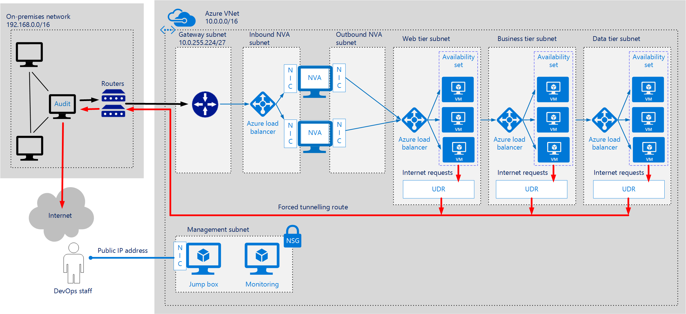
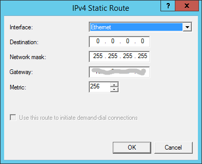

<properties
   pageTitle="Azure Architecture Reference - IaaS: Implementing a secure hybrid network architecture in Azure | Microsoft Azure"
   description="How to implement a secure hybrid network architecture in Azure."
   services="guidance,vpn-gateway,expressroute,load-balancer,virtual-network"
   documentationCenter="na"
   authors="JohnPWSharp"
   manager="masashin"
   editor=""
   tags="azure-resource-manager"/>

<tags
   ms.service="guidance"
   ms.devlang="na"
   ms.topic="article"
   ms.tgt_pltfrm="na"
   ms.workload="na"
   ms.date="05/10/2016"
   ms.author="johns@contentmaster.com"/>

# Implementing a secure hybrid network architecture in Azure

![INCLUDE FOR BRANDING]

This article describes best practices for implementing a secure hybrid network the extends your on-premises network to Azure. In this reference architecture, you will learn how to use user defined routes (UDRs) to route incoming traffic on a virtual network to a set of highly available network virtual appliances. These appliances can run different types of security software, such as firewalls, packet inspection, among others. You will also learn how to enable forced tunneling, to have all outgoing traffic to the Internet be routed to your on-premises data center. This architecture uses a connection to your on-premises datacenter using either a [VPN gateway][ra-vpn], or [ExpressRoute][ra-expressroute] connection. 

> [AZURE.NOTE] Azure has two different deployment models: [Resource Manager][resource-manager-overview] and classic. This reference architecture uses Resource Manager, which Microsoft recommends for new deployments.

Typical use cases for this architecture include:

- Hybrid applications where workloads run partly on-premises and partly in Azure.

- Infrastructure that requires a more granular control over traffic coming into Azure from an on-premises datacenter.

- Auditing outgoing traffic from the VNet. On-premises components can inspect and log all Internet requests. This is often a regulatory requirement of many commercial systems and can help to prevent public disclosure of private information.

## Architecture diagram

The following diagram highlights the important components in this architecture:



- **On-premises network.** This is a network of computers and devices, connected through a private local-area network running within an organization.

- **Network security appliance (NSA).** This is an on-premises appliance that inspects requests intended for the Internet. All outbound Internet requests are directed through this device.

- **Azure virtual network (VNet).** The VNet hosts the application and other resources running in the cloud.

- **Gateway.** The gateway provides the connectivity between routers in the on-premises network and the VNet. 

- **Network virtual appliance (NVA).** An NVA is a generic term for a virtual appliance that might perform tasks such as acting as a firewall, implementing access security, WAN optimization (including network compression), custom routing, or a variety of other operations. The NVA receives requests from the inbound NVA network. The NVA can validate these requests and, if they are acceptable, it can forward them to the Web tier through the outbound NVA subnet.

- **Web tier, business tier, and data tier subnets.** These are subnets hosting the VMs and services that implement an example 3-tier application running in the cloud; see [Implementing a multi-tier architecture on Azure][implementing-a-multi-tier-architecture-on-Azure] for more details. You can deploy an internal load balancer in each tier to improve scalability. The traffic in each subnet may be subject to rules defined by using [Azure Network Security Groups][azure-network-security-group](NSGs) to limit the source of requests and the destinations of any results. In this example, NSGs are also designed to block outbound traffic heading for the Internet from the web and data access tiers (only the business tier is allowed to submit Internet requests). 

    > [AZURE.NOTE] This article describes the cloud application as a single entity. See [Implementing a Multi-tier Architecture on Azure][implementing-a-multi-tier-architecture-on-Azure] for detailed information.

- **User-defined routes (UDR).** The gateway subnet contains a UDR that ensures that all application traffic from the on-premises network is routed through the NVAs.

	Additionally, each of the application subnets defines one or more custom (user-defined) routes for redirecting or blocking Internet requests made by VMs running in that subnet. In this example, the UDR for the business tier redirects requests back through the on-premises network for auditing. If the request is permitted, it can be forwarded to the Internet. The UDRs for the web and data access tier prevent outbound Internet requests by discarding them. This technique provides an additional layer of security above those of the NSGs for these tiers.

    > [AZURE.NOTE] Any response received as a result of the request will return directly to the originator in the Business tier subnet and will not pass through on-premises network.

- **Management subnet.** This subnet contains VMs that implement management and monitoring capabilities for the components running in the VNet. The monitoring VM captures log and performance data from the virtual hardware in the cloud. The jump box enables authorized DevOps staff to log in, configure, and manage the network through an external IP address.

## Recommendations

This section provides a list of recommendations based on the essential components required to implement the basic architecture. You may have additional or differing requirements from those described here. You can use the items in this section as a starting point for customizing your own system.

### Resource group recommendations

Create each subnet and its resources (including VMs) in a separate resource group. This approach enables you to control access to these resources in each resource group by using [Role-Based Access Control (RBAC)][rbac]. Using RBAC enables you to grant varying levels of control over different resource groups to individual members of groups of DevOps staff.

### Virtual network gateway recommendations

Access to the VNet is through a virtual network gateway. You can use an [Azure VPN gateway][guidance-vpn-gateway] or an [Azure ExpressRoute gateway][guidance-expressroute] to connect to the on-premises network. The gateway requires its own subnet named `GatewaySubnet`. Create this subnet with an address range of /27. This address range gives you the flexibility to establish the connection using ExpressRoute. It is recommended to use this range even if you are only currently using a VPN connection as it gives you the flexibility to upgrade later without disrupting the address structure of your network. Avoid placing the gateway subnet in the middle of the address space. A good practice is to set the address space for the gateway subnet at the upper end of the VNet address space.

### NVA recommendations

The NVA provides protection for traffic arriving from the on-premises network. Route all traffic received from the Azure gateway through the NVA. The Azure Marketplace provides many NVAs available from third-party vendors, including:

- [Barracuda Web Application Firewall][barracuda-waf] and [Barracuda NextGen Firewall][barracuda-nf]

- [Cohesive VNS3 Firewall/Router/VPN][vns3]

- [Fortinet FortiGate-VM][fortinet]

- [SecureSphere Web Application Firewall][securesphere]

- [DenyAll Web Application Firewall][denyall]

- *Others? - TBD*

You can also create an NVA by using your own custom VMs; this is the approach taken by the sample templates that implement this architecture.

The following list summarizes best practices for configuring an NVA

- If you are implementing the NVA as a custom Azure VM, enable IP forwarding to enable traffic intended for the web tier application subnet to be received by the VM through the inbound NVA subnet. You can use the following command to enable IP forwarding for a NIC:

	```powershell
	azure network nic set -g <<resource-group>> -n <<nva-inbound-nic-name>> -f true
	```

- Configure the NVA to inspect all requests intended for the web tier application subnet, and only permit access to traffic if it is appropriate to do so. The steps for performing this task will vary, depending on the NVA and your security requirements. 

	> [AZURE.NOTE] The NVA created by sample template simply forwards requests to the web tier of the application, but you can add custom logic that examines requests and decides whether it is safe or appropriate to allow them through.

- Ensure that inbound traffic cannot bypass the NVA. To do this, add a UDR to the gateway subnet that directs all requests made to the application arriving through the gateway to the NVA. The following example shows a UDR that forces requests intended for the web tier through the NVA:

    ```powershell
    <# Create a new route table: #>
    azure network route-table route create -a 10.0.3.0/24 -y VirtualAppliance -p 10.0.1.5 <<resource-group>> <<route-table-name>> <<route-name>>

    <# Add a route for the web tier application subnet (10.0.3.0/24) to the route table that directs requests through the NVA load balancer: #>
    azure network route-table route create -a 10.0.3.0/24 -y VirtualAppliance -p 10.0.1.5 <<resource-group>> <<route-table-name>> <<route-name>>

    <# Associate the route table with the gateway subnet: #>
    azure network vnet subnet set -r <<route-table-name>> <<resource-group>> <<vnet-name>> GatewaySubnet
    ```

- Always verify that UDR routing operates as expected by using a tool such as [tracert][tracert] to trace the request path from on-premises to VMs in the web tier of the application.

    ```
    Example?
    ```

- To maximize scalability, create a pool (availability set) of NVA devices and use a load balancer to distribute requests received through the virtual network gateway across this pool. This strategy enables you to quickly start and stop NVAs to maintain performance, according to the load. Point the UDR that directs requests to the NVAs to this load balancer.

### NSG recommendations

The gateway subnet exposes a public IP address for handling the connection to the on-premises network. There is a risk that this endpoint could be be used as a point of attack. Additionally, if any of the application tiers are compromised, unauthorized traffic could enter from there as well, enabling an invader to reconfigure your NVA. Create a network security group (NSG) for the inbound NVA subnet and define rules that block all traffic that has not originated from the on-premises network (192.168.0.0/16 in the [Architecture diagram][architecture]). The sample template creates rules similar to these:

	
```powershell
azure network nsg create <<resource-group>> nva-nsg <<location>>

azure network vnet subnet set --network-security-group-name nva-nsg <<resource-group>> <<vnet-name>> <<inbound-nva-subnet-name>>

azure network nsg rule create --protocol * --source-address-prefix 192.168.0.0/16 --source-port-range * --destination-port-range * --access Allow --priority 200 --direction Inbound <<resource-group>> nva-nsg allow-traffic-from-on-prem

azure network nsg rule create --protocol * --source-address-prefix * --source-port-range * --destination-port-range * --access Deny --priority 300 --direction Inbound <<resource-group>> nva-nsg deny-other-traffic
```

Create NSGs for each application tier subnet with rules to permit or deny access to network traffic, according to the security requirements of the application. NSGs can also provide a second level of protection against inbound traffic bypassing the NVA if the NVA is misconfigured or disabled. For example, the web tier subnet shown in the [Architecture blueprint][architecture] diagram defines an NSG with rules that block all requests other than those for port 80 that have been received from the on-premises network (192.168.0.0/16). The sample template implements this NSG:

```powershell
azure network nsg create <<resource-group>> web-tier-nsg <<location>>

azure network vnet subnet set --network-security-group-name web-tier-nsg <<resource-group>> <<vnet-name>> <<vnet-web-tier-subnet-name>>

azure network nsg rule create --protocol * --source-address-prefix 192.168.0.0/16 --source-port-range * --destination-port-range 80 --access Allow --priority 200 --direction Inbound <<resource-group>> web-tier-nsg allow-http-traffic-from-on-prem

azure network nsg rule create --protocol * --source-address-prefix * --source-port-range * --destination-port-range * --access Deny --priority 300 --direction Inbound <<resource-group>> web-tier-nsg deny-other-traffic
```

Similarly, create NSG rules for the other tiers that block all traffic except for that received from specified tiers on specific ports. For example, the  NSG for the business tier subnet in the sample template (10.0.4.0/24) contains rules that block all requests other than those for port 80 that have been received from the web tier subnet (10.0.3.0/24):

```powershell
azure network nsg create <<resource-group>> business-tier-nsg <<location>>

azure network vnet subnet set --network-security-group-name business-tier-nsg <<resource-group>> <<vnet-name>> <<vnet-business-tier-subnet-name>>

azure network nsg rule create --protocol * --source-address-prefix 10.0.3.0/24 --source-port-range * --destination-port-range 80 --access Allow --priority 200 --direction Inbound <<resource-group>> business-tier-nsg allow-http-traffic-from-web-tier

azure network nsg rule create --protocol * --source-address-prefix * --source-port-range * --destination-port-range * --access Deny --priority 300 --direction Inbound <<resource-group>> business-tier-nsg deny-other-traffic
```

### Internet access recommendations

Control outbound traffic from the web, business, and data access tiers to prevent accidental disclosure of confidential information. In the sample template, the web and data access tiers are prevented from sending information directly to the Internet by using NSG rules that block such requests:

```powershell
TBD - show NSG rule
```

Additionally, UDRs for these tiers cause traffic routed to the Internet to be dropped. This provides an additional layer of security:

```powershell
TBD - show UDR
```

The business tier is allowed access to the Internet, but you should ensure that all such traffic is force-tunnelled through the on-premises network (as described in the [Recommendations][recommendations] section) so that it can be audited.

Verify that the traffic is tunnelled correctly. If you are using a VPN connection with the Routing and Remote Access Service on an on-premises server, use a tool such as [WireShark][wireshark] on this server to verify that Internet traffic from the VNet is being forwarded through this server. **TBD - SHOW WHAT TO LOOK FOR, WITH IMAGE**

Configure the on-premises network security appliance to direct force-tunnelled traffic to the Internet. This process will vary according to the device used to implement the appliance. For example, if you are using the Routing and Remote Access Service, you can add a static route as follows:



> [AZURE.NOTE] For detailed information and examples on implementing forced tunnelling, see [Configure forced tunneling using PowerShell and Azure Resource Manager][azure-forced-tunnelling].

### Management subnet recommendations

The management subnet comprises servers that contain the management and monitoring software. Only DevOps staff should have access to this subnet.

Do not expose this subnet to the outside world. For example, do not create a public IP address for the Jump box. Instead, only allow DevOps staff access through the gateway from the on-premises network. The NSG for this subnet must enforce this rule.

Do not force DevOps requests through the NVA; the UDR that intercepts application traffic and redirects it to the NVA should not capture traffic for the management subnet. This is to help prevent lockout, where a poorly configured NVA blocks all administrative requests, making it impossible for DevOps staff to reconfigure the system.

## Solution components
<!-- [TELMO] This topic will describe how each component, or set of components for this architecture will be configured, from a ARM template or script perspective. We will fill these in next week.  -->

**TBD**

## Availability

If you are using Azure ExpressRoute to provide the connectivity between the VNet and the on-premises network, [configure a VPN gateway to provide failover][vpn-failover] if the ExpressRoute connection becomes unavailable.

For specific information on maintaining availability for VPN and ExpressRoute connections, see the articles [Implementing a Hybrid Network Architecture with Azure and On-premises VPN][guidance-vpn-gateway] and [Implementing a hybrid network architecture with Azure ExpressRoute][guidance-expressroute].

## Security

This architecture applies security at several points. The recommendations and solution components listed earlier describe the basic solution which you can customize according to your own requirements. However, you should bear in mind the points described in the following sections.

> [AZURE.NOTE] For more extensive information, examples, and scenarios about managing network security with Azure, see [Microsoft cloud services and network security][clouds-services-network-security]. For detailed information about protecting resources in the cloud, see [Getting started with Microsoft Azure security][getting-started-with-azure-security]. For additional details on addressing security concerns across an Azure gateway connection, see [Implementing a Hybrid Network Architecture with Azure and On-premises VPN][guidance-vpn-gateway] and [Implementing a hybrid network architecture with Azure ExpressRoute][guidance-expressroute].

### Routing through the NVA

In the example shown in the diagram in the [Architecture diagram][architecture], all requests for the application are directed through the NVA by using a UDR that routes them through the NVA. This UDR is applied to the gateway subnet. You can add more routes to the UDR, but ensure that you do not inadvertently create routes that enable application requests to bypass the NVA or that block administrative traffic intended for the management subnet.

### Blocking/passing traffic to the application tiers

The example architecture uses NSG rules in the business tier to block all traffic that has not originated from the web tier. The data access tier uses NSG rules to block requests that have not been sent by the business tier. If necessary, you can modify these constraints, but be aware of the security concerns of doing so. For example, consider whether it is wise to allow direct access from the on-premises network to the data access tier as this could allow a user to modify data in an uncontrolled manner, possibly bypassing any security constraints implemented by the web or business tiers.

### DevOps access

DevOps staff access the system through the jump box in the management subnet. You can control the operations that they can perform on each of the tiers by using [RBAC][rbac]. Assign roles to DevOps staff carefully, and only grant the necessary privileges. If possible, audit all administrative operations to keep a record of how the configuration has changed over time (and who changed it), and to enable any configuration changes to be undone if necessary.

Apply NSG rules to to the management subnet to limit the sources of traffic that can gain access. Only permit requests that have originated from the on-premises network.

## Scalability

Implement a pool of NVA devices (using an availability set), and use a load balancer to direct requests from the on-premises network to this pool. This will help to prevent the NVA becoming a bottleneck and improve scalability, although this strategy might not be effective to handle unexpected bursts. Monitor the throughput of the NVA devices over time, and be prepared to add further NVA devices to the pool if the workload shows an increasing trend. Adopt the same strategy for each of the subnets holding the application tiers.

> [AZURE.NOTE] You can customize the sample templates provided for this architecture to change the number of NVA devices and VMs created in each pool.

If you are creating a custom NVA incorporating your own code, make sure that any security checks performed are stateless and do not depend on the same client revisiting the same NVA for each request.

> [AZURE.NOTE] The articles [Implementing a Hybrid Network Architecture with Azure and On-premises VPN][guidance-vpn-gateway] and [Implementing a hybrid network architecture with Azure ExpressRoute][guidance-expressroute] describe issues surrounding the scalability of Azure gateways. ExpressRoute provides a much higher network bandwidth and lower latency than a VPN connection, but the cost is higher and the configuration effort greater.

## Monitoring

Use the resources in the management subnet to connect to the VMs in the system and perform monitoring. The example in the [Architecture blueprint][architecture] section depicts a jump box which provides access to DevOps staff, and a separate monitoring server. Depending on the size of the network, the jump box and monitoring server could be combined into a single machine, or monitoring functions could be spread across several VMs.

If each tier in the system is protected by using NSG rules, it may also be necessary to open port 3389 (for RDP access), port 22 (for SSH access), or any other ports used by management and monitoring tools to enable requests from the data management subnet.

If you are using ExpressRoute to provide the connectivity between your on-premises datacenter and Azure, use the [Azure Connectivity Toolkit (AzureCT)][azurect] to monitor and troubleshoot connection issues.

> [AZURE.NOTE] You can find additional information specifically aimed at monitoring and managing VPN and ExpressRoute connections in the articles The articles [Implementing a Hybrid Network Architecture with Azure and On-premises VPN][guidance-vpn-gateway] and [Implementing a hybrid network architecture with Azure ExpressRoute][guidance-expressroute].

## Troubleshooting

**TBD**

> [AZURE.NOTE] You can find specific information about troubleshooting VPN and ExpressRoute connections in the articles [Implementing a Hybrid Network Architecture with Azure and On-premises VPN][guidance-vpn-gateway] and [Implementing a hybrid network architecture with Azure ExpressRoute][guidance-expressroute].
> 
## Deploying the sample solution

The Azure PowerShell commands in this section show how to **... << TBD >**.

To use the script below, execute the following steps:

1. Copy the [sample script][script] and paste it into a new file.
2. Save the file as a .ps1 file.
3. Open a PowerShell command shell.
4. **... << TBD >>**

## Sample solution script

The deployment steps above use the following sample script.

```powershell
TBD
```

## Next steps

<!-- links -->

[resource-manager-overview]: ../resource-group-overview.md
[guidance-vpn-gateway]: ../guidance-hybrid-network-vpn.md
[script]: #sample-solution-script
[implementing-a-multi-tier-architecture-on-Azure]: ./iaas-multi-tier.md
[guidance-expressroute]: ./guidance-hybrid-network-expressroute.md
[connect-to-an-Azure-vnet]: https://technet.microsoft.com/library/dn786406.aspx
[azure-network-security-group]: ../virtual-network/virtual-networks-nsg.md
[getting-started-with-azure-security]: ./../azure-security-getting-started.md
[azure-forced-tunnelling]: https://azure.microsoft.com/en-gb/documentation/articles/vpn-gateway-forced-tunneling-rm/
[clouds-services-network-security]: https://azure.microsoft.com/documentation/articles/best-practices-network-security/
[rbac]: https://azure.microsoft.com/documentation/articles/role-based-access-control-configure/
[architecture]: #architecture_blueprint
[security]: #security
[recommendations]: #recommendations
[azurect]: https://github.com/Azure/NetworkMonitoring/tree/master/AzureCT
[tracert]: https://technet.microsoft.com/library/cc940128.aspx
[barracuda-waf]: https://azure.microsoft.com/marketplace/partners/barracudanetworks/waf/
[barracuda-nf]: https://azure.microsoft.com/marketplace/partners/barracudanetworks/barracuda-ng-firewall/
[vns3]: https://azure.microsoft.com/marketplace/partners/cohesive/cohesiveft-vns3-for-azure/
[fortinet]: https://azure.microsoft.com/marketplace/partners/fortinet/fortinet-fortigate-singlevmfortigate-singlevm/
[securesphere]: https://azure.microsoft.com/marketplace/partners/imperva/securesphere-waf-for-azr/
[denyall]: https://azure.microsoft.com/marketplace/partners/denyall/denyall-web-application-firewall/
[vpn-failover]: ../guidance-hybrid-network-expressroute-vpn-failover.md
[wireshark]: https://www.wireshark.org/
