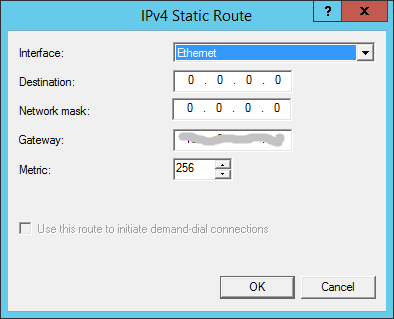
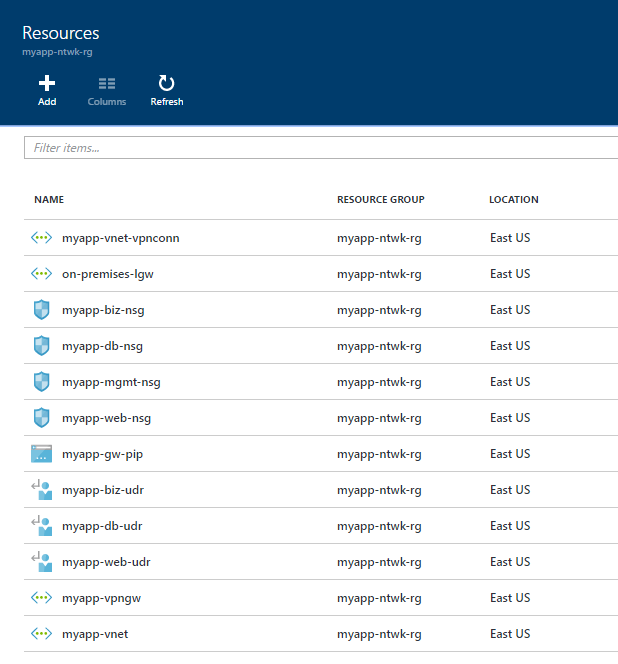
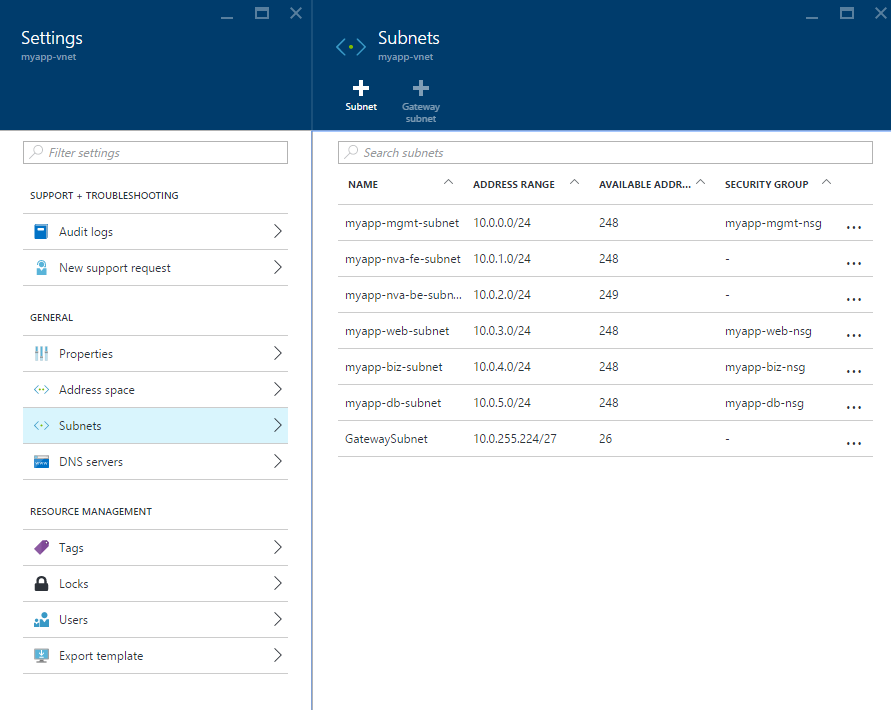
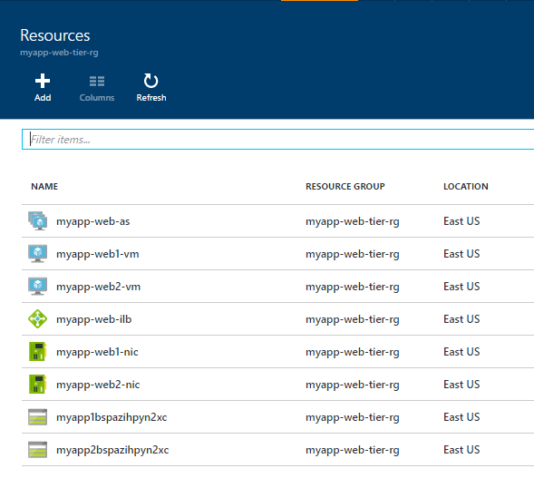
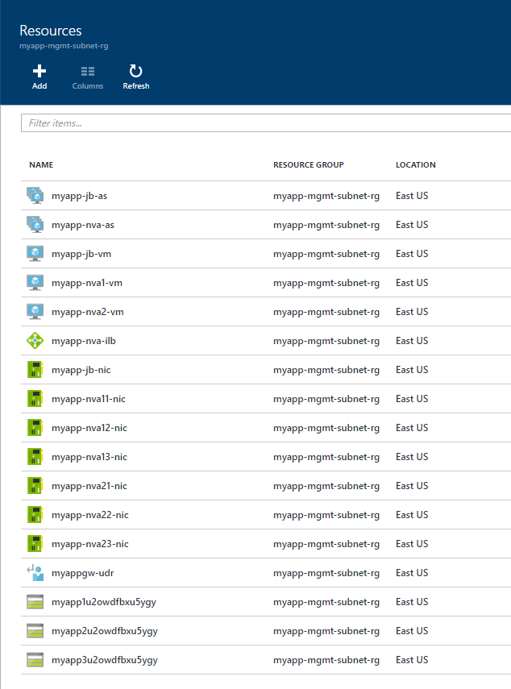

<properties
   pageTitle="Azure Architecture Reference - IaaS: Implementing a secure hybrid network architecture in Azure | Microsoft Azure"
   description="How to implement a secure hybrid network architecture in Azure."
   services="guidance,vpn-gateway,expressroute,load-balancer,virtual-network"
   documentationCenter="na"
   authors="telmosampaio"
   manager="masashin"
   editor=""
   tags="azure-resource-manager"/>

<tags
   ms.service="guidance"
   ms.devlang="na"
   ms.topic="article"
   ms.tgt_pltfrm="na"
   ms.workload="na"
   ms.date="05/17/2016"
   ms.author="telmos"/>

# Implementing a secure hybrid network architecture in Azure

[AZURE.INCLUDE [pnp-RA-branding](../../includes/guidance-pnp-include.md)]

This article describes best practices for implementing a secure hybrid network the extends your on-premises network to Azure. In this reference architecture, you will learn how to use user defined routes (UDRs) to route incoming traffic on a virtual network to a set of highly available network virtual appliances. These appliances can run different types of security software, such as firewalls, packet inspection, among others. You will also learn how to enable forced tunneling, to have all outgoing traffic to the Internet be routed to your on-premises data center. This architecture uses a connection to your on-premises datacenter using either a [VPN gateway][ra-vpn], or [ExpressRoute][ra-expressroute] connection.

> [AZURE.NOTE] Azure has two different deployment models: [Resource Manager][resource-manager-overview] and classic. This reference architecture uses Resource Manager, which Microsoft recommends for new deployments.

Typical use cases for this architecture include:

- Hybrid applications where workloads run partly on-premises and partly in Azure.

- Infrastructure that requires a more granular control over traffic coming into Azure from an on-premises datacenter.

- Auditing outgoing traffic from the VNet. On-premises components can inspect and log all Internet requests. This is often a regulatory requirement of many commercial systems and can help to prevent public disclosure of private information.

## Architecture diagram

The following diagram highlights the important components in this architecture:


- **On-premises network.** This is a network of computers and devices, connected through a private local-area network running within an organization.

- **Network security appliance (NSA).** This is an on-premises appliance that inspects requests intended for the Internet. All outbound Internet requests are directed through this device.

- **Azure virtual network (VNet).** The VNet hosts the application and other resources running in the cloud.

- **Gateway.** The gateway provides the connectivity between routers in the on-premises network and the VNet.

- **Network virtual appliance (NVA).** An NVA is a generic term for a virtual appliance that might perform tasks such as acting as a firewall, WAN optimization (including network compression), custom routing, or a variety of other operations. The NVA receives requests from the inbound NVA network. The NVA can validate these requests and, if they are acceptable, it can forward them to the web tier through the outbound NVA subnet.

- **Web tier, business tier, and data tier subnets.** These are subnets hosting the VMs and services that implement an example 3-tier application running in the cloud; see [Implementing a multi-tier architecture on Azure][implementing-a-multi-tier-architecture-on-Azure] for more details. 

    > [AZURE.NOTE] This article describes the cloud application as a single entity. See [Implementing a Multi-tier Architecture on Azure][implementing-a-multi-tier-architecture-on-Azure] for detailed information.

- **User-defined routes (UDR).** You can use UDRs to define how traffic flows within Azure. The gateway subnet contains a UDR that ensures that all application traffic from the on-premises network is routed through the NVAs. Traffic intended for the management subnet is allowed to bypass the NVAs.

	Additionally, each of the application subnets uses UDRs for redirecting Internet requests made by VMs running in that subnet. In this example, the UDRs for the web, business, and data access tiers redirect requests back through the on-premises network for auditing. If the request is permitted, it can be forwarded to the Internet.

    > [AZURE.NOTE] Any response received as a result of the request will return directly to the originator in the Business tier subnet and will not pass through on-premises network.

- **Management subnet.** This subnet contains VMs that implement management and monitoring capabilities for the components running in the VNet. The monitoring VM captures log and performance data from the virtual hardware in the cloud. The jump box enables authorized DevOps staff to log in, configure, and manage the network.

## Recommendations

This section provides a list of recommendations based on the essential components required to implement the basic architecture. These recommendations cover:

- The use of resource groups,

- Role-based access control for resource groups,

- Virtual network gateway configuration,

- NVA configuration,

- Defining NSGs and NSG rules,

- Implementing forced tunneling, and

- Controlling access to the management subnet.

You may have additional or differing requirements from those described here. You can use the items in this section as a starting point for customizing your own system.

### Resource group recommendations

Use resource groups to enable the separation of responsibility for different sets of DevOps staff. For example, staff who can control the gateway subnet could be a different set from the staff that maintain the web tier, or staff that control access to the business logic or data used by the application. This approach enables you to control access to these resources in each resource group by using [Role-Based Access Control (RBAC)][rbac]. Specifically, consider creating:

- A resource group for the VNet. This resource group should include the subnets (excluding the VMs), NSGs, UDRs, and the gateway resources for connecting to the on-premises network.

- A resource group containing the VMs for the NVAs (including the load balancer), the jump box and other management VMs, and the UDR for the gateway subnet that forces all traffic through the NVAs.

- Resource groups for each application tier, containing the load balancer and VMs for each tier. Note that this resource group should not include the subnets for each tier; the VNet resource group contains these resources as they are managed separately from the VMs within them.

> [AZURE.NOTE] For more information, see [Best practices for designing Azure Resource Manager templates][arm-template-best-practices].

### RBAC recommendations

Within a resource group, create separate RBAC roles for DevOps staff who can create and administer VMs, and centralized IT administrators who can manage the network (assign a public IP address to a network interface, change NSG rules on the network, create VPN connections, and so on). Segregating staff across roles in this way allows an IT administrator to change NSG rules and assign public IP addresses to VMs. DevOps staff will be unable to perform these tasks, but can manage VMs. To implement this scheme:

- The DevOps staff role should include the Virtual Machine Contributor role and Storage account contributor role (to enable system administrators to create and attach disks to VMs), as well as the Reader role on the resource group. For example:

    ```powershell
    azure role assignment create -o "Virtual Machine Contributor" -c /subscriptions/nnnnnnnn-nnnn-nnnn-nnnn-nnnnnnnnnnnn/resourceGroups/my-rg --signInName devops@contoso.com

    azure role assignment create -o "Storage Account Contributor" -c /subscriptions/nnnnnnnn-nnnn-nnnn-nnnn-nnnnnnnnnnnn/resourceGroups/my-rg --signInName devops@contoso.com

    azure role assignment create -o "Reader" -c /subscriptions/nnnnnnnn-nnnn-nnnn-nnnn-nnnnnnnnnnnn/resourceGroups/my-rg --signInName devops@contoso.com
    ```

- The IT administrators role should include the Network Contributor role and Reader role on the resource group. For example:

    ```powershell
    azure role assignment create -o "Network Contributor" -c /subscriptions/nnnnnnnn-nnnn-nnnn-nnnn-nnnnnnnnnnnn/resourceGroups/my-rg --signInName itadmin@contoso.com

    azure role assignment create -o "Reader" -c /subscriptions/nnnnnnnn-nnnn-nnnn-nnnn-nnnnnnnnnnnn/resourceGroups/my-rg --signInName itadmin@contoso.com
    ```

### Virtual network gateway recommendations

Access to the VNet is through a virtual network gateway. You can use an [Azure VPN gateway][guidance-vpn-gateway] or an [Azure ExpressRoute gateway][guidance-expressroute] to connect to the on-premises network. The gateway requires its own subnet named `GatewaySubnet`. 

<!--
TBD: Link this to the new VPN doc recommendation once it is published.
-->

### NVA recommendations

NVAs can provide different services for managing and monitoring network traffic. This reference architecture uses the NVA to manage traffic coming from on-premises to Azure. To do so, you must route all traffic received from the Azure gateway through the NVA. The Azure Marketplace provides many NVAs available from third-party vendors, including:

- [Barracuda Web Application Firewall][barracuda-waf] and [Barracuda NextGen Firewall][barracuda-nf]

- [Cohesive VNS3 Firewall/Router/VPN][vns3]

- [Fortinet FortiGate-VM][fortinet]

- [SecureSphere Web Application Firewall][securesphere]

- [DenyAll Web Application Firewall][denyall]

You can also create an NVA by using your own custom VMs; this is the approach taken by the sample script and templates used to implement this reference architecture.

Enable IP forwarding on any NICs used by the NVAs for routing traffic (the sample template implements this setting). If you are creating your own VMs manually, use the following command to enable IP forwarding for a NIC:

```powershell
azure network nic set -g <<resource-group>> -n <<nva-inbound-nic-name>> -f true
```

Configure the NVA to inspect all requests intended for the web tier application subnet, and permit traffic to pass through only if it is appropriate to do so. This will most likely involve installing additional services and software on the NVA. The steps for performing this task will vary depending on the NVA and your security requirements.

> [AZURE.NOTE] By default, the configuration created by the sample script enables routing through the NVA by configuring each NVA VM as a simple Linux router. Inbound traffic arrives on network interface *eth0*, and outbound traffic is dispatched through network interface *eth1*. You can customize the NVA VMs to add security elements such as firewalls and content-based traffic filtering.

Ensure that inbound traffic *heading for the application* cannot bypass the NVA. However, traffic directed towards the management subnet *should not pass through the NVA*. To do this, add a UDR to the gateway subnet that directs all requests made to the application arriving through the gateway to the NVA. The following example shows UDRs that enables management traffic to pass directly to the management subnet, but forces requests intended for the application through the NVA:

```powershell
<# Create a new route table: #>
azure network route-table create <<resource-group>> <<route-table-name>> <<location>>

<# Add a route for for management traffic (10.0.0.0/24) to the route table. This route allows traffic to bypass the NVA: #>
azure network route-table route create -a 10.0.0.0/24 -y VNETLocal <<resource-group>> <<route-table-name>> <<route-name>>

<# Add a route for all other traffic (10.0.0.0/16) to the route table that directs requests through the NVA load balancer: #>
azure network route-table route create -a 10.0.0.0/16 -y VirtualAppliance -p 10.0.1.254 <<resource-group>> <<route-table-name>> <<route-name>>

<# Associate the route table with the gateway subnet: #>
azure network vnet subnet set -r <<route-table-name>> <<resource-group>> <<vnet-name>> GatewaySubnet
```

To maximize scalability, create a pool (availability set) of NVA devices and use a load balancer to distribute requests received through the virtual network gateway across this pool. This strategy enables you to quickly start and stop NVAs to maintain performance, according to the load. Point the UDR that directs requests to the NVAs to this load balancer.

### NSG recommendations

The VPN gateway exposes a public IP address for handling the connection to the on-premises network. There is a risk that this endpoint could be used as a point of attack. Additionally, if any of the application tiers are compromised, unauthorized traffic could enter from there as well, enabling an invader to reconfigure your NVA. Create a network security group (NSG) for the inbound NVA subnet and define rules that block all traffic that has not originated from the on-premises network (192.168.0.0/16 in the [Architecture diagram][architecture]). You can create rules similar to these:

```powershell
azure network nsg create <<resource-group>> nva-nsg <<location>>

azure network vnet subnet set --network-security-group-name nva-nsg <<resource-group>> <<vnet-name>> <<inbound-nva-subnet-name>>

azure network nsg rule create --protocol * --source-address-prefix 192.168.0.0/16 --source-port-range * --destination-port-range * --access Allow --priority 100 --direction Inbound <<resource-group>> nva-nsg allow-on-prem

azure network nsg rule create --protocol * --source-address-prefix * --source-port-range * --destination-port-range * --access Deny --priority 120 --direction Inbound <<resource-group>> nva-nsg deny-other-traffic
```

Create NSGs for each application tier subnet with rules to permit or deny access to network traffic, according to the security requirements of the application. NSGs can also provide a second level of protection against inbound traffic bypassing the NVA if the NVA is misconfigured or disabled. For example, the web tier subnet shown in the [Architecture diagram][architecture] diagram defines an NSG with rules that block all requests other than those for port 80 that have been received from the on-premises network (192.168.0.0/16) or the VNet. The sample script implements this NSG:

```powershell
azure network nsg create <<resource-group>> myapp-web-nsg <<location>>

azure network vnet subnet set --network-security-group-name myapp-web-nsg <<resource-group>> <<vnet-name>> <<vnet-web-tier-subnet-name>>

azure network nsg rule create --protocol * --source-address-prefix 192.168.0.0/16 --source-port-range * --destination-port-range 80 --access Allow --priority 100 --direction Inbound <<resource-group>> myapp-web-nsg on-prem-allow

azure network nsg rule create --protocol * --source-address-prefix 10.0.0.0/16 --source-port-range * --destination-port-range 80 --access Allow --priority 110 --direction Inbound <<resource-group>> myapp-web-nsg vnet-allow

azure network nsg rule create --protocol * --source-address-prefix * --source-port-range * --destination-port-range * --access Deny --priority 130 --direction Inbound <<resource-group>> myapp-web-nsg vnet-deny
```

Similarly, create NSG rules for the other tiers that block all traffic except for that received from specified tiers on specific ports. For example, the  NSG for the business tier subnet in the sample script (10.0.4.0/24) contains rules that block all requests other than those that have been received from the web tier subnet (10.0.3.0/24):

```powershell
azure network nsg create <<resource-group>> myapp-biz-nsg <<location>>

azure network vnet subnet set --network-security-group-name myapp-biz-nsg <<resource-group>> <<vnet-name>> <<vnet-business-tier-subnet-name>>

azure network nsg rule create --protocol * --source-address-prefix 10.0.3.0/24 --source-port-range * --destination-port-range 80 --access Allow --priority 100 --direction Inbound <<resource-group>> myapp-biz-nsg web-allow

azure network nsg rule create --protocol * --source-address-prefix * --source-port-range * --destination-port-range * --access Deny --priority 120 --direction Inbound <<resource-group>> myapp-biz-nsg vnet-deny
```

### Internet access recommendations

Control outbound traffic from the web, business, and data access tiers to prevent accidental disclosure of confidential information. In the example architecture, the web, business, and data access tiers are permitted access to the Internet, but all such traffic is force-tunnelled through the on-premises network (as described in the [Recommendations][recommendations] section) so that it can be audited and controlled.

> [AZURE.NOTE] Do not completely block Internet traffic from the web, business and application tiers as this will prevent these tiers from recording Azure diagnostic information, which requires that components have access to an Azure storage account. Reading and writing storage account information requires access to the Internet.

The following snippet illustrates how you can create a UDR that provides forced tunneling for the business tier:

```powershell
<# Create a new route table: #>
azure network route-table create <<resource-group>> <<route-table-name>> <<location>>

<# Add a route that traps Internet-bound traffic: #>
azure network route-table route create -a 0.0.0.0/0 -y VirtualNetworkGateway <<resource-group>> <<route-table-name>> <<route-name>>

<# Associate the route table with the business tier subnet: #>
azure network vnet subnet set -r <<route-table-name>> <<resource-group>> <<vnet-name>> <<business-tier-subnet-name>>
```

Verify that the traffic is tunnelled correctly. If you are using a VPN connection with the Routing and Remote Access Service on an on-premises server, use a tool such as [WireShark][wireshark] on this server to verify that Internet traffic from the VNet is being forwarded through this server.

Configure the on-premises network security appliance to direct force-tunnelled traffic to the Internet. This process will vary according to the device used to implement the appliance. For example, if you are using the Routing and Remote Access Service, you can add a static route as follows:



> [AZURE.NOTE] For detailed information and examples on implementing forced tunneling, see [Configure forced tunneling using PowerShell and Azure Resource Manager][azure-forced-tunneling].

### Management subnet recommendations

The management subnet comprises servers that contain the management and monitoring software. Only DevOps staff should have access to this subnet.

Do not expose this subnet to the outside world. For example, do not create a public IP address for the Jump box. Instead, only allow DevOps staff access through the gateway from the on-premises network. The NSG for this subnet must enforce this rule.

Do not force DevOps requests through the NVA; the UDR that intercepts application traffic and redirects it to the NVA should not capture traffic for the management subnet. This is to help prevent lockout, where a poorly configured NVA blocks all administrative requests, making it impossible for DevOps staff to reconfigure the system.

## Solution components

The solution provided for this architecture utilizes the following ARM templates:

- [azuredeploy.json][azuredeploy]. This template is specific to this architecture. It creates a resource group containing the VNet network, subnets, NSGs, and UDRs for these subnets.

- [bb-ilb-backend-http-https.json][bb-ilb-backend-http-https]. This is a generic template that creates a load balanced collection of VMs. This template is used to create the resources for the web tier, business tier, and data access tier. The template creates a resource group for each tier.

- [ibb-vm-iis.json][ibb-vm-iis] and [ibb-vm-apache.json][ibb-vm-apache]. These templates install web server software on a VM (Microsoft Internet Information Services or the Apache Web Server). The solution uses these template to configure VMs in the web tier. The selection depends on the operating system installed; Windows for IIS, and Ubuntu for Apache.

- [ibb-nvas-mgmt.json][ibb-nvas-mgmt]. This template creates the resources for the NVAs and management subnet, including the NVA VMs with load balancer, and the jump box.

- [bb-vpn-gateway-connection.json][bb-vpn-gateway-connection]. This template creates the resources for the VPN gateway; the gateway subnet, the local network gateway for accessing the on-premises network, the virtual network gateway, the gateway connection, and the UDR for routing requests to the NVA load balancer.

The solution also includes a bash script named [azuredeploy.sh][azuredeploy-script] that invokes invokes these templates in sequence and ties the results together to construct the system.

The following sections provide more details on the key resources created for this architecture by the templates.

### Creating the NVAs

The NVAs are Linux (Ubuntu) VMs. The [ibb-nvas-mgmt.json][ibb-nvas-mgmt] template invokes another generic template ([bb-vms-3nics-lbbe.json][bb-vms-3nics-lbbe]) to create these VMs. The distinguishing aspects of these VMS consist of:

- The IP forwarding configuration from the NIC on the inbound NVA subnet to the NIC on the outbound NVA subnet,

- The load balancing rules for traffic arriving from the on-premises network, and

- The UDR that forces all inbound traffic through the load balancer.

#### IP forwarding

The [ibb-nvas-mgmt.json][ibb-nvas-mgmt] template performs two tasks to implement IP forwarding:

1. The template configures IP forwarding for the two NICs when it invokes the [bb-vms-3nics-lbbe.json][bb-vms-3nics-lbbe] template:

	```
    "parameters": {
      ...
      "nic1IpForwarding": { "value": true },
      "nic2IpForwarding": { "value": true },
      ...
    }
	```

	The [bb-vms-3nics-lbbe.json][bb-vms-3nics-lbbe] template uses these parameters to set the *enableIPForwarding* property of the NICs:

	```
    {
      ...
      "type": "Microsoft.Network/networkInterfaces",
      ...
      "properties": {
        "ipConfigurations": [
          ...
        ],
        "enableIPForwarding": "[parameters('nic3IpForwarding')]"
      }
    }
	```

    This setting enables the VM to accept traffic on a NIC even if the NIC is not attached to the network to which the traffic is addressed.

2. The template runs the [nva.sh][nva-script] script on each VM after the VM has been created. This is a Linux bash script that configures the IP network driver in the operating system to forward IP requests across NICs:

	```
    #!/bin/bash
    echo net.ipv4.ip_forward=1 >> /etc/sysctl.conf
	```

It is important that both of these tasks complete successfully, otherwise traffic might not pass through the NVA and could be blocked.

#### Load balancing the NVAs

The [ibb-nvas-mgmt.json][ibb-nvas-mgmt] template creates an availability set for the VMs, and implements an internal load balancer which distributes HTTP requests sent to ports 80 and 443 across this availability set. The load balancer has a static IP address. The JSON snippet below illustrates how the template configures the load balancer. Note that in this snippet, the *ilbIpAddress* parameter contains the internal IP address of the load balancer, and the *feSubnetId* parameter is a reference to the inbound (front-end) NVA subnet. The variable *ilbBEName* refers to the pool containing the NVA VMs.

```
{
  "type": "Microsoft.Network/loadBalancers",
  ...
  "properties": {
    "frontendIPConfigurations": [
      {
        "name": "feIpConfig1",
        "properties": {
          "privateIPAllocationMethod": "Static",
          "privateIPAddress": "[parameters('ilbIpAddress')]",
          "subnet": { "id": "[parameters('feSubnetId')]" }
        }
      }
    ],
    "backendAddressPools": [ { "name": "[variables('ilbBEName')]" } ],
    "loadBalancingRules": [
      {
        "name": "http",
        "properties": {
          "frontendIPConfiguration": { "id": "[variables('ilbFEId')]" },
          "backendAddressPool": { "id": "[variables('ilbBEId')]" },
          "frontendPort": 80,
          "backendPort": 80,
          "protocol": "Tcp"
        }
      },
      {
        "name": "https",
        "properties": {
          "frontendIPConfiguration": { "id": "[variables('ilbFEId')]" },
          "backendAddressPool": { "id": "[variables('ilbBEId')]" },
          "frontendPort": 443,
          "backendPort": 443,
          "protocol": "Tcp"
        }
      }
    ]
  }
}
```

#### Routing traffic through the NVA load balancer

The UDR for the gateway subnet implements two routes, as follows:

- **toFrontEnd**. This route directs traffic intended for the VNet to the load balancer. Notice that the rule specifies that the load balancer is a virtual appliance:

- **toMgmt**. This route matches traffic intended for the management subnet and allows it to pass through, bypassing the NVA load balancer:

```
{
  "type": "Microsoft.Network/routeTables",
  ...
  "properties": {
    "routes": [
      {
        "name": "toFrontEnd",
        "properties": {
          "addressPrefix": "[parameters('vnetPrefix')]",
          "nextHopType": "VirtualAppliance",
          "nextHopIpAddress": "[parameters('ilbIpAddress')]"
        }
      },
      {
        "name": "toMgmt",
        "properties": {
          "addressPrefix": "[parameters('mgmtSubnetPrefix')]",
          "nextHopType": "VnetLocal"
        }
      }
    ]
  }
}
```

> [AZURE.NOTE] The management subnet prefix is a subset of the VNet prefix (the management subnet is a subnet of the VNet), so in theory traffic intended for the management subnet matches both routes. However, Azure applies the route with the most narrow match to the destination address in each request, so management traffic is handled by the toMgmt route.

The [bb-vpn-gateway-connection.json][bb-vpn-gateway-connection] template takes this UDR as an input parameter and applies the UDR to the Gateway subnet created for the connection to the on-premises network.

```
"parameters": {
  ...
  "udrName": {
    "type": "string",
    "defaultValue": "",
    "metadata": { "description": "Name of an optional UDR to be placed in the GatewaySubnet." }
  },
  "udrResourceGroup": {
    "type": "string",
    "defaultValue": "",
    "metadata": { "description": "Name of the resource group for the optional UDR." }
  },
  ...
```

### Configuring the VPN gateway and implementing forced tunneling

The [bb-vpn-gateway-connection.json][bb-vpn-gateway-connection] template creates the VPN gateway for connecting the VNet and the on-premises network.


#### Creating the VPN gateway

This template invokes further templates, [bb-gatewaysubnet.json][bb-gatewaysubnet] and [bb-gatewaysubnet-udr.json][bb-gatewaysubnet-udr], to actually create the subnet and associate it with the UDR. The parameters shown below are passed to these templates:

```
"parameters": {
  "vnetName": { "value": "[parameters('vnetName')]" },
  "gatewaySubnetAddressPrefix": { "value": "[parameters('gatewaySubnetAddressPrefix')]" },
  "udrName": { "value": "[parameters('udrName')]" },
  "udrResourceGroup": { "value": "[variables('udrResourceGroupValue')]" },
  "displayName": { "value": "Gateway UDR" }
}
```

The [bb-vpn-gateway-connection.json][bb-vpn-gateway-connection] template creates local network gateway, an IP address, a virtual network gateway for the VNet (in the gateway subnet) using this public IP address, and a VPN connection. The local network gateway and VPN connection do not require any specific configuration. The virtual network gateway requires a public, dynamic IP address, as shown by the following snippet:

```
{
  ...
  "type": "Microsoft.Network/publicIPAddresses",
  ...
  "properties": { "publicIPAllocationMethod": "Dynamic" }
}
```

The virtual network gateway uses the following configuration: 

```
{
  ...
  "type": "Microsoft.Network/virtualNetworkGateways",
  ...
  "properties": {
    "ipConfigurations": [
      {
        "name": "vnetGatewayConfig",
        "properties": {
          "privateIPAllocationMethod": "Dynamic",
          "subnet": { "id": "[variables('gatewaySubnetRef')]" },
          "publicIPAddress": { "id": "[resourceId('Microsoft.Network/publicIPAddresses', variables('gwPIPName'))]" }
        }
      }
    ],
    "gatewayType": "Vpn",
    "vpnType": "[parameters('vpnType')]",
    "enableBgp": "false",
    "GatewayDefaultSite": {
      "id": "[resourceId('Microsoft.Network/localNetworkGateways',variables('onPremisesLGWName'))]"
    },
    "sku": {
      "name": "Standard",
      "tier": "Standard",
      "capacity": 2
    }
  }
}
```

In this snippet, you should pay specific attention to the following properties:

- The gateway type is VPN.

- The default site for connections is the local network gateway for the on-premises network. This is the gateway through which all Internet traffic is sent.

- The SKU must be Standard (or HighPerformance) for forced tunneling to work effectively; the Basic SKU does not provide forced tunneling.

#### Implementing forced tunneling

The [azuredeploy.sh][azuredeploy] script uses the Azure CLI directly to implement forced tunneling for the web, business, and data access tiers. The script creates a route table with a default route that directs all Internet-bound traffic back through the virtual network gateway, which in turn send the traffic on to the default site (through the local network gateway connection). The script adds this route table to the subnets for the web, business, and data access tiers:

```powershell
FORCED_TUNNELING_ROUTE_TABLE_NAME=${BASE_NAME}-forced-tunneling-udr

echo
echo azure network route-table create -n ${FORCED_TUNNELING_ROUTE_TABLE_NAME}  -g ${NTWK_RESOURCE_GROUP}  -l ${LOCATION}
     azure network route-table create -n ${FORCED_TUNNELING_ROUTE_TABLE_NAME}  -g ${NTWK_RESOURCE_GROUP}  -l ${LOCATION}

echo
echo azure network route-table route create -n "DefaultRoute"  -g ${NTWK_RESOURCE_GROUP} -a "0.0.0.0/0" -y VirtualNetworkGateway -r ${FORCED_TUNNELING_ROUTE_TABLE_NAME}
     azure network route-table route create -n "DefaultRoute"  -g ${NTWK_RESOURCE_GROUP} -a "0.0.0.0/0" -y VirtualNetworkGateway -r ${FORCED_TUNNELING_ROUTE_TABLE_NAME}
echo
echo azure network vnet subnet set -n ${DEPLOYED_WEB_SUBNET_NAME} -e ${DEPLOYED_VNET_NAME} -r ${FORCED_TUNNELING_ROUTE_TABLE_NAME} -g ${RESOURCE_GROUP} 
     azure network vnet subnet set -n ${DEPLOYED_WEB_SUBNET_NAME} -e ${DEPLOYED_VNET_NAME} -r ${FORCED_TUNNELING_ROUTE_TABLE_NAME} -g ${RESOURCE_GROUP} 

echo
echo azure network vnet subnet set -n ${DEPLOYED_BIZ_SUBNET_NAME} -e ${DEPLOYED_VNET_NAME} -r ${FORCED_TUNNELING_ROUTE_TABLE_NAME} -g ${RESOURCE_GROUP} 
     azure network vnet subnet set -n ${DEPLOYED_BIZ_SUBNET_NAME} -e ${DEPLOYED_VNET_NAME} -r ${FORCED_TUNNELING_ROUTE_TABLE_NAME} -g ${RESOURCE_GROUP} 

echo
echo azure network vnet subnet set -n ${DEPLOYED_DB_SUBNET_NAME} -e ${DEPLOYED_VNET_NAME} -r ${FORCED_TUNNELING_ROUTE_TABLE_NAME} -g ${RESOURCE_GROUP} 
     azure network vnet subnet set -n ${DEPLOYED_DB_SUBNET_NAME} -e ${DEPLOYED_VNET_NAME} -r ${FORCED_TUNNELING_ROUTE_TABLE_NAME} -g ${RESOURCE_GROUP} 
```

### Creating the management subnet

The management subnet contains the jump box, and optionally other VMs that can be used to perform monitoring tasks. The example template only creates the jump box, but you can add and configure other VMs manually, according to your monitoring requirements.

#### Creating the jump box

The purpose of the jump box is to provide privileged access to DevOps staff who need to manage and configure the system. The jump box is a VM running Ubuntu. The [ibb-nvas-mgmnt.json][ibb-nvas-mgmt] template uses the [bb-bb-vm-1nic-static-private-ip.json][bb-vm-1nic-static-private-ip] to create this VM.

It is imperative to protect the jump box from access by unauthorized staff. The [azuredeploy.json][azuredeploy] template performs the following tasks to help protect the system:

- Implement an NSG with rules that prohibit access from unexpected sources.

- Configure NSG rules that permit management access to VMs in the web, business, and data access tier subnets only from the management subnet.

#### Blocking unexpected access to the management subnet

The [azuredeploy.json][azuredeploy] template creates two NSG rules named *on-prem-allow* and *vnet-deny* for the management subnet:

```
{
  "type": "Microsoft.Resources/deployments",
  "apiVersion": "2015-01-01",
  "name": "mgmt-nsg",
  "properties": {
    "mode": "Incremental",
    "templateLink": { "uri": "[variables('nsgTemplate')]" },
    "parameters": {
      "baseName": { "value": "[parameters('baseName')]" },
      "nsgNamePrefix": { "value": "mgmt" },
      "rulesNames": { "value": [ "on-prem-allow", "vnet-deny" ] },
      "rulesDirections": { "value": [ "Inbound", "Inbound" ] },
      "rulesAccess": { "value": [ "Allow", "Deny" ] },
      "rulesSourceAddressPrefixes": { "value": [ "[parameters('onpremNetPrefix')]", "*" ] },
      "rulesSourcePorts": { "value": [ "*", "*" ] },
      "rulesDestinationAddressPrefixes": { "value": [ "*", "*" ] },
      "rulesDestinationPorts": { "value": [ 3389, "*" ] },
      "rulesProtocol": { "value": [ "TCP", "*" ] }
    }
  }
}
```
<!-- TBD: We may need to review this based on refactoring -->

The on-prem-allow rule allows RDP access through port 3389 only to traffic that has originated from the on-premises network. The vnet-deny rule blocks all traffic that has originated from the VNet.

#### Permitting management access to the application subnets 

Each application subnet has NSG rules that permit incoming management traffic on port 3389 (for RDP access) and port 22 (for SSH access).

## Deploying the sample solution

The solution assumes the following prerequistes:

- You have an existing on-premises infrastructure, including a VPN server that can support IPSec connections.

- You have installed the latest version of the Azure CLI. [Follow these instructions for details][cli-install].

- If you are deploying the solution from Windows, you must install a tool that provides a bash shell, such as [git for Windows][git-for-windows].

To run the script that deploys the solution:

1. Download the [azuredeploy.sh][azuredeploy] script to your local computer.

2. Open a bash shell and move to the folder containing the azuredeploy.sh script.

3. Log in to your Azure account. In the bash shell enter the following commands:

	```powershell
    azure config mode arm
    
    azure login
	```

	Follow the instructions to connect to Azure.

4. If your account has access to multiple subscriptions, determine which subscription you wish to use to deploy the solution and run the following command. Replace *nnnnnnnn-nnnn-nnnn-nnnn-nnnnnnnnnnnn* with the subscription ID:

	```powershell
	azure account set nnnnnnnn-nnnn-nnnn-nnnn-nnnnnnnnnnnn
	```

5. Run the command `./azuredeploy.sh`. You must supply the following information as command line parameters:

	- The name of the 3-tier application infrastructure to be created. The script creates separate subnets for the Web tier, business tier, and data tier. Each tier consists of two VMs accessed through a load balancer.

	- The subscription ID of the Azure account to use. If you have multiple subscriptions, this should match the subscription ID specified in step 4. By default, the script creates nine VMs that consume 36 CPU cores although you can customize the installation to use smaller VMs. Make sure that you have sufficient quota available before continuing.

	- The shared key used by the VPN server to establish IPSec connections.

	- The IP address of the VPN server.

	- The address space of the on-premises network, in CIDR format.

	The following example shows how to run the script:

	```powershell
	./azuredeploy.sh myapp nnnnnnnn-nnnn-nnnn-nnnn-nnnnnnnnnnnn mysharedkey123 111.222.33.4 192.168.0.0/24
	```

6. Ensure that the script completes successfully. Note that it is possible to re-run the script if an error occurs; objects that have already been created will not be overwritten.

7. Browse to the Azure portal and verify that the following resource groups have been created:

	- ***myapp*-netwk-rg.** This resource group contains the network elements of the solution: the VNet that holds the subnets for the NVA, the application tiers, and the management subnet; the NSG definitions; the UDR for forced tunneling; the local gateway; the VPN gateway; the gateway public IP address; and the gateway connection, as shown below:

		

		The following image shows the subnets created in the VNet:

		


	- ***myapp*-web-subnet-rg.** This resource group contains the VMs for the Web tier grouped into an availability set (the script creates two VMs for each tier by default), storage for each VM, the network interfaces, and the load balancer for this tier:

		

	- ***myapp*-biz-subnet-rg.**. This resource group holds the VMs and resources for the business tier.

	- ***myapp*-db-subnet-rg.** This resource group holds the VMs and resources for the data access tier.

	- ***myapp*-mgmt-subnet-nva-rg.** This resource group contains the resources used by the NVA and the management subnets. The script creates two VMs (with storage) and a load balancer for the NVA, and a separate VM (with storage) for the jump box. Each NVA VM has three network interfaces (NICs). The NICs for each NVA VM are configured to permit IP forwarding. No additional software is installed on any of these VMs. This resource group also contains the UDR for the gateway subnet.

		

8. Configure the VPN appliance on the on-premises network to connect to the Azure VPN gateway. For more information, seer the article [Implementing a Hybrid Network Architecture with Azure and On-premises VPN][guidance-vpn-gateway].

### Customizing the solution

Prior to invoking each template, the [azuredeploy.sh][azuredeploy-script] script creates an inline JSON object named *PARAMETERS* which is passed to the template. The template uses the values in this object to determine how to configure the resources created by the template. Most of the parameters are populated from variables defined in the script. The example below shows the part of the script that runs the azuredeploy.json template:

```
############################################################################
## Create vNet and Subnets for mgmt, nva-fe, nva-be, web, biz, db
############################################################################
TEMPLATE_URI=https://raw.githubusercontent.com/mspnp/blueprints/master/ARMBuildingBlocks/guidance-hybrid-network-secure-vnet/Templates/azuredeploy.json
RESOURCE_GROUP=${NTWK_RESOURCE_GROUP}
ON_PREM_NET_PREFIX=${INPUT_ON_PREMISES_ADDRESS_SPACE}
VNET_PREFIX=10.0.0.0/16
VNET_MGMT_SUBNET_PREFIX=10.0.0.0/24
VNET_NVA_FE_SUBNET_PREFIX=10.0.1.0/24
VNET_NVA_BE_SUBNET_PREFIX=10.0.2.0/24
VNET_WEB_SUBNET_PREFIX=10.0.3.0/24
VNET_BIZ_SUBNET_PREFIX=10.0.4.0/24
VNET_DB_SUBNET_PREFIX=10.0.5.0/24
PARAMETERS="{\"baseName\":{\"value\":\"${BASE_NAME}\"},\"onpremNetPrefix\":{\"value\":\"${ON_PREM_NET_PREFIX}\"},\"vnetPrefix\":{\"value\":\"${VNET_PREFIX}\"},\"vnetMgmtSubnetPrefix\":{\"value\":\"${VNET_MGMT_SUBNET_PREFIX}\"},\"vnetNvaFeSubnetPrefix\":{\"value\":\"${VNET_NVA_FE_SUBNET_PREFIX}\"},\"vnetNvaBeSubnetPrefix\":{\"value\":\"${VNET_NVA_BE_SUBNET_PREFIX}\"},\"vnetWebSubnetPrefix\":{\"value\":\"${VNET_WEB_SUBNET_PREFIX}\"},\"vnetBizSubnetPrefix\":{\"value\":\"${VNET_BIZ_SUBNET_PREFIX}\"},\"vnetDbSubnetPrefix\":{\"value\":\"${VNET_DB_SUBNET_PREFIX}\"}}"

echo
echo azure group create --name ${RESOURCE_GROUP} --location ${LOCATION} --subscription ${SUBSCRIPTION}
     azure group create --name ${RESOURCE_GROUP} --location ${LOCATION} --subscription ${SUBSCRIPTION}
echo
echo azure group deployment create --template-uri ${TEMPLATE_URI} -g ${RESOURCE_GROUP} -p ${PARAMETERS}
     azure group deployment create --template-uri ${TEMPLATE_URI} -g ${RESOURCE_GROUP} -p ${PARAMETERS}
```

> [AZURE.NOTE] Change the values of the variables rather than the PARAMETERS object. If you modify the PARAMETERS object directly, or try to add or remove parameters, the template might not run correctly.

You can change these variables before running the script if you need to vary the resources created. The following sections summarize the elements of the example architecture that you can customize in this way.

#### VNet and subnet address spaces

The [azuredeploy.json][azuredeploy] template creates the network infrastructure, It takes the following parameters:

- **LOCATION**. The Azure region in which to create the resource groups used by the system. 

- **VNET_PREFIX**. The address space of the VNet to be created.

- **VNET_MGMT_SUBNET_PREFIX**. The address space of the management subnet. This subnet holds the jump box.

- **VNET_NVA_FE_SUBNET_PREFIX**. The address space exposed to the on-premises network for accessing the NVAs.

- **VNET_NVA_BE_SUBNET_PREFIX**. The address space used by the NVAs for forwarding requests to the web tier.

- **VNET_WEB_SUBNET_PREFIX**, **VNET_BIZ_SUBNET_PREFIX**, and **VNET_DB_SUBNET_PREFIX**. The address spaces of the web tier, business tier, and data access tier.

Note that the subnet address spaces must be valid within the address space of the VNet.

#### VM configuration for the application tiers

The [bb-ilb-backend-http-https.json][bb-ilb-backend-http-https] template creates the VMs and resources for each application tier. The script runs this template once for each tier. This template accepts these parameters:

- **ADMIN_USER_NAME**. The name of the admin account on the VMs. This can vary between tiers.

- **ADMIN_PASSWORD**. The password for the admin account. This can vary between tiers.

- **OS_TYPE**. The operating system to install on the VMs. This can be Windows or Ubuntu. The operating system can be different on each tier.

- **NUMBER_VMS**. The number of VMs to create in the availability set for this tier. Each tier can have a different number of VMs.

The following variables specify the IP addresses used by the load balancers for each tier:

- **WEB_ILB_IP_ADDRESS** This is the IP address of the load balancer in front of the web tier VMs. It must lie within the address space specified by the VNET_NVA_WEB_SUBNET_PREFIX variable.

- **BIZ_ILB_IP_ADDRESS**. This is the IP address of the load balancer in front of the business tier VMs. It must lie within the address space specified by the VNET_NVA_BIZ_SUBNET_PREFIX variable.

- **DB_ILB_IP_ADDRESS**. This is the IP address of the load balancer in front of the data access tier VMs. It must lie within the address space specified by the VNET_DB_WEB_SUBNET_PREFIX variable.

#### NVA and jump box configuration

The [ibb-nvas.mgmt.json][ibb-nvas-mgmt] template creates the NVAs and jump box.

You can set the following parameters:

- **MGMT_JUMPBOX_IP_ADDRESS**. The IP address of the jump box. It must lie within the address space specified by the VNET_MGMT_SUBNET_PREFIX variable.

- **NVA_FE_ILB_IP_ADDRESS** The IP address of the load balancer in front of the NVA VMs. It must lie within the address space specified by the VNET_NVA_FE_SUBNET_PREFIX variable.

- **VNET_GATEWAY_SUBNET_ADDRESS_PREFIX**. The address space to be used by the VPN gateway. To allow for future expansion, it should provide up to 32 addresses (/27). It is good practice to position this address space at the top of the available address space for the VNet.

- **ADMIN_USER_NAME**. The name of the admin account on the VMs. This can vary between tiers.

- **ADMIN_PASSWORD**. The password for the admin account. This can vary between tiers.

- **VM_SIZE**. The size of the VMs. The default is Standard_DS3.

- **JUMPBOX_OS_TYPE**. The operating system to install on the jump box (Windows or Ubuntu). Note that the NVA VMs always run Ubuntu.

#### VPN gateway configuration

There are no configurable parameters for the [bb-vpn-gateway-connection.json][bb-vpn-gateway-connection] template. This template depends on the values specified elsewhere in the script, so changing parameter values may cause this template to fail.

## Availability considerations

If you are using Azure ExpressRoute to provide the connectivity between the VNet and the on-premises network, [configure a VPN gateway to provide failover][vpn-failover] if the ExpressRoute connection becomes unavailable.

For specific information on maintaining availability for VPN and ExpressRoute connections, see the articles [Implementing a Hybrid Network Architecture with Azure and On-premises VPN][guidance-vpn-gateway] and [Implementing a hybrid network architecture with Azure ExpressRoute][guidance-expressroute].

## Security considerations

This architecture applies security at several points. The recommendations and solution components listed earlier describe the basic solution which you can customize according to your own requirements. However, you should bear in mind the points described in the following sections.

> [AZURE.NOTE] For more extensive information, examples, and scenarios about managing network security with Azure, see [Microsoft cloud services and network security][clouds-services-network-security]. For detailed information about protecting resources in the cloud, see [Getting started with Microsoft Azure security][getting-started-with-azure-security]. For additional details on addressing security concerns across an Azure gateway connection, see [Implementing a Hybrid Network Architecture with Azure and On-premises VPN][guidance-vpn-gateway] and [Implementing a hybrid network architecture with Azure ExpressRoute][guidance-expressroute].

### Routing through the NVA

In the example shown in the diagram in the [Architecture diagram][architecture], all requests for the application are directed through the NVA by using a UDR that routes them through the NVA. This UDR is applied to the gateway subnet. You can add more routes to the UDR, but ensure that you do not inadvertently create routes that enable application requests to bypass the NVA or that block administrative traffic intended for the management subnet.

The load balancer in front of the NVAs also acts as a security device. Only traffic that matches the ports specified by load balancing rules can pass through. By default, the example architecture only enables HTTP (port 80) and HTTPS (port 443) requests. You can add further rules to allow traffic through other ports, but document all changes and be prepared to monitor the requests flowing through these ports.

### Blocking/passing traffic to the application tiers

The example architecture uses NSG rules in the business tier to block all traffic that has not originated from the web tier. The data access tier uses NSG rules to block requests that have not been sent by the business tier. If necessary, you can modify these constraints, but be aware of the security concerns of doing so. For example, consider whether it is wise to allow direct access from the on-premises network to the data access tier as this could allow a user to modify data in an uncontrolled manner, possibly bypassing any security constraints or business rules implemented by the web or business tiers.

### DevOps access

DevOps staff access the system through the jump box in the management subnet. You can control the operations that they can perform on each of the tiers by using [RBAC][rbac]; see [RBAC recommendations][rbac-recommendations] for details. Assign roles to DevOps staff carefully, and only grant the necessary privileges. If possible, audit all administrative operations to keep a record of how the configuration has changed over time (and who changed it), and to enable any configuration changes to be undone if necessary.

Apply NSG rules to to the management subnet to limit the sources of traffic that can gain access. Only permit requests that have originated from the on-premises network.

## Scalability considerations

Implement a pool of NVA devices (using an availability set), and use a load balancer to direct requests from the on-premises network to this pool. This will help to prevent the NVA becoming a bottleneck and improve scalability, although this strategy might not be effective to handle unexpected bursts. Monitor the throughput of the NVA devices over time, and be prepared to add further NVA devices to the pool if the workload shows an increasing trend. Adopt the same strategy for each of the subnets holding the application tiers.

If you are creating a custom NVA incorporating your own code, make sure that any security checks performed are stateless and do not depend on the same client revisiting the same NVA for each request.

A VPN gateway supports sustained throughput of up to 100 Mbps for the Basic and Standard SKUs. The High Performance SKU provides up to 200 Mbps. For higher bandwidths, consider upgrading to an ExpressRoute gateway. ExpressRoute gives you up to 2000 Mbps bandwidth with lower latency than a VPN connection, but requires increased expenditure and a greater configuration effort.

> [AZURE.NOTE] The articles [Implementing a Hybrid Network Architecture with Azure and On-premises VPN][guidance-vpn-gateway] and [Implementing a hybrid network architecture with Azure ExpressRoute][guidance-expressroute] describe issues surrounding the scalability of Azure gateways. 

## Monitoring considerations

Use the resources in the management subnet to connect to the VMs in the system and perform monitoring. The example in the [Architecture blueprint][architecture] section depicts a jump box which provides access to DevOps staff, and a separate monitoring server. Depending on the size of the network, the jump box and monitoring server could be combined into a single machine, or monitoring functions could be spread across several VMs.

If each tier in the system is protected by using NSG rules, it may also be necessary to open port 3389 (for RDP access), port 22 (for SSH access), or any other ports used by management and monitoring tools to enable requests from the data management subnet (the sample template implements these rules by default).

If you are using ExpressRoute to provide the connectivity between your on-premises datacenter and Azure, use the [Azure Connectivity Toolkit (AzureCT)][azurect] to monitor and troubleshoot connection issues.

> [AZURE.NOTE] You can find additional information specifically aimed at monitoring and managing VPN and ExpressRoute connections in the articles The articles [Implementing a Hybrid Network Architecture with Azure and On-premises VPN][guidance-vpn-gateway] and [Implementing a hybrid network architecture with Azure ExpressRoute][guidance-expressroute].

## Next steps

<!-- links -->

[resource-manager-overview]: ../resource-group-overview.md
[guidance-vpn-gateway]: ./guidance-hybrid-network-vpn.md
[script]: #sample-solution-script
[implementing-a-multi-tier-architecture-on-Azure]: ./guidance-compute-3-tier-vm.md
[guidance-expressroute]: ./guidance-hybrid-network-expressroute.md
[connect-to-an-Azure-vnet]: https://technet.microsoft.com/library/dn786406.aspx
[azure-network-security-group]: ../virtual-network/virtual-networks-nsg.md
[getting-started-with-azure-security]: ./../azure-security-getting-started.md
[azure-forced-tunneling]: https://azure.microsoft.com/en-gb/documentation/articles/vpn-gateway-forced-tunneling-rm/
[clouds-services-network-security]: https://azure.microsoft.com/documentation/articles/best-practices-network-security/
[rbac]: https://azure.microsoft.com/documentation/articles/role-based-access-control-configure/
[architecture]: #architecture_blueprint
[security]: #security
[recommendations]: #recommendations
[azurect]: https://github.com/Azure/NetworkMonitoring/tree/master/AzureCT
[barracuda-waf]: https://azure.microsoft.com/marketplace/partners/barracudanetworks/waf/
[barracuda-nf]: https://azure.microsoft.com/marketplace/partners/barracudanetworks/barracuda-ng-firewall/
[vns3]: https://azure.microsoft.com/marketplace/partners/cohesive/cohesiveft-vns3-for-azure/
[fortinet]: https://azure.microsoft.com/marketplace/partners/fortinet/fortinet-fortigate-singlevmfortigate-singlevm/
[securesphere]: https://azure.microsoft.com/marketplace/partners/imperva/securesphere-waf-for-azr/
[denyall]: https://azure.microsoft.com/marketplace/partners/denyall/denyall-web-application-firewall/
[vpn-failover]: ./guidance-hybrid-network-expressroute-vpn-failover.md
[wireshark]: https://www.wireshark.org/
[rbac-recommendations]: #rbac_recommendations
[azuredeploy-script]: https://github.com/mspnp/blueprints/blob/master/ARMBuildingBlocks/guidance-hybrid-network-secure-vnet/Scripts/azuredeploy.sh
[azuredeploy]: https://github.com/mspnp/blueprints/blob/master/ARMBuildingBlocks/ARMBuildingBlocks/guidance-hybrid-network-secure-vnet/Templates/azuredeploy.json
[bb-ilb-backend-http-https]: https://github.com/mspnp/blueprints/blob/master/ARMBuildingBlocks/ARMBuildingBlocks/ARMBuildingBlocks/Templates/bb-ilb-backend-http-https.json
[ibb-vm-iis]: https://github.com/mspnp/blueprints/blob/master/ARMBuildingBlocks/ARMBuildingBlocks/ARMBuildingBlocks/Templates/ibb-vm-iis.json
[ibb-vm-apache]: https://github.com/mspnp/blueprints/blob/master/ARMBuildingBlocks/ARMBuildingBlocks/ARMBuildingBlocks/Templates/ibb-vm-apache.json
[ibb-nvas-mgmt]: https://github.com/mspnp/blueprints/blob/master/ARMBuildingBlocks/ARMBuildingBlocks/ARMBuildingBlocks/Templates/ibb-nvas-mgmt.json
[bb-vpn-gateway-connection]: https://github.com/mspnp/blueprints/blob/master/ARMBuildingBlocks/ARMBuildingBlocks/ARMBuildingBlocks/Templates/bb-vpn-gateway-connection.json
[deploying]: ##deploying-the-sample-solution
[gateway-resources]: ##gateway-resources
[bb-vms-3nics-lbbe]: https://github.com/mspnp/blueprints/blob/master/ARMBuildingBlocks/ARMBuildingBlocks/ARMBuildingBlocks/Templates/bb-vms-3nics-lbbe.json
[bb-vm-1nic-static-private-ip]: https://github.com/mspnp/blueprints/blob/master/ARMBuildingBlocks/ARMBuildingBlocks/ARMBuildingBlocks/Templates/bb-vm-1nic-static-private-ip.json
[bb-gatewaysubnet]: https://github.com/mspnp/blueprints/blob/master/ARMBuildingBlocks/ARMBuildingBlocks/ARMBuildingBlocks/Templates/bb-gatewaysubnet.json
[bb-gatewaysubnet-udr]: https://github.com/mspnp/blueprints/blob/master/ARMBuildingBlocks/ARMBuildingBlocks/ARMBuildingBlocks/Templates/bb-gatewaysubnet-udr.json
[cli-install]: https://azure.microsoft.com/documentation/articles/xplat-cli-install
[git-for-windows]: https://git-for-windows.github.io
[arm-template-best-practices]: https://azure.microsoft.com/documentation/articles/best-practices-resource-manager-design-templates/
[nva-script]: https://github.com/mspnp/blueprints/blob/master/ARMBuildingBlocks/ARMBuildingBlocks/ARMBuildingBlocks/Scripts/nva.sh
[ra-vpn]: ./guidance-hybrid-network-vpn.md
[ra-expressroute]: ./guidance-hybrid-network-expressroute.md
[ibb-nvas-mgmnt] https://github.com/mspnp/blueprints/blob/master/ARMBuildingBlocks/ARMBuildingBlocks/Templates/ibb-nvas-mgmt.json


