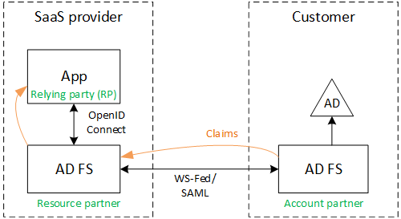
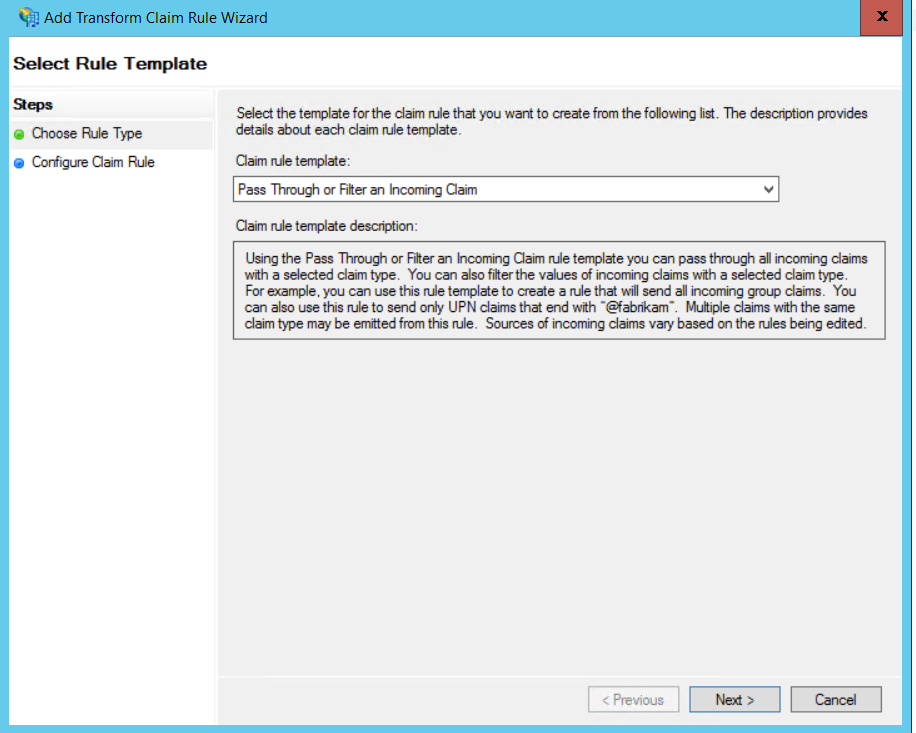
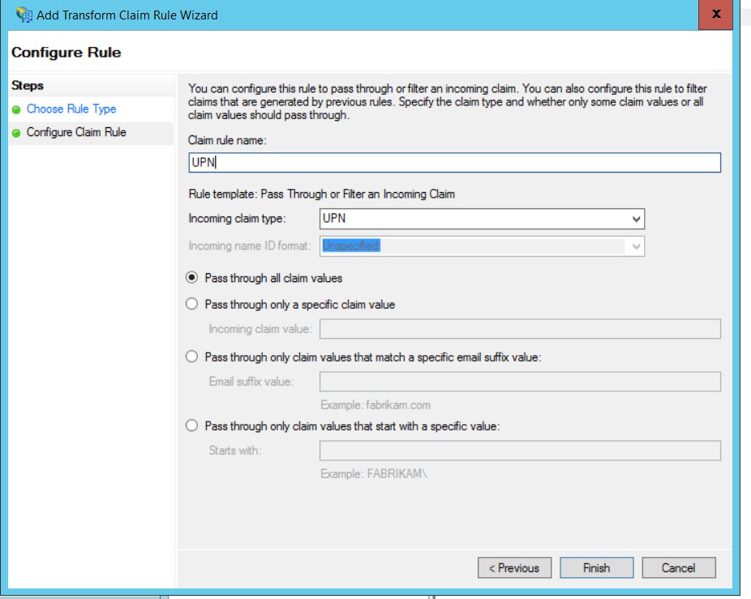
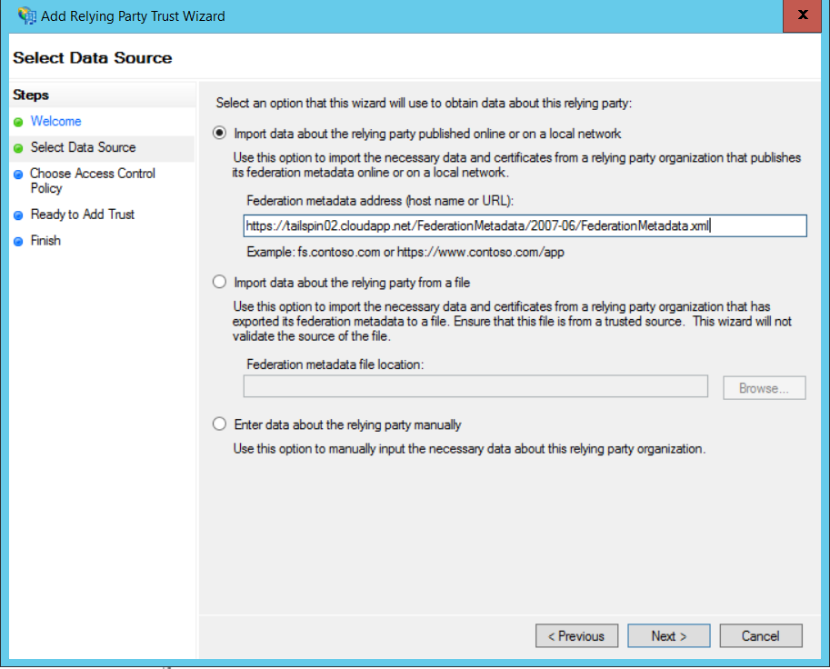
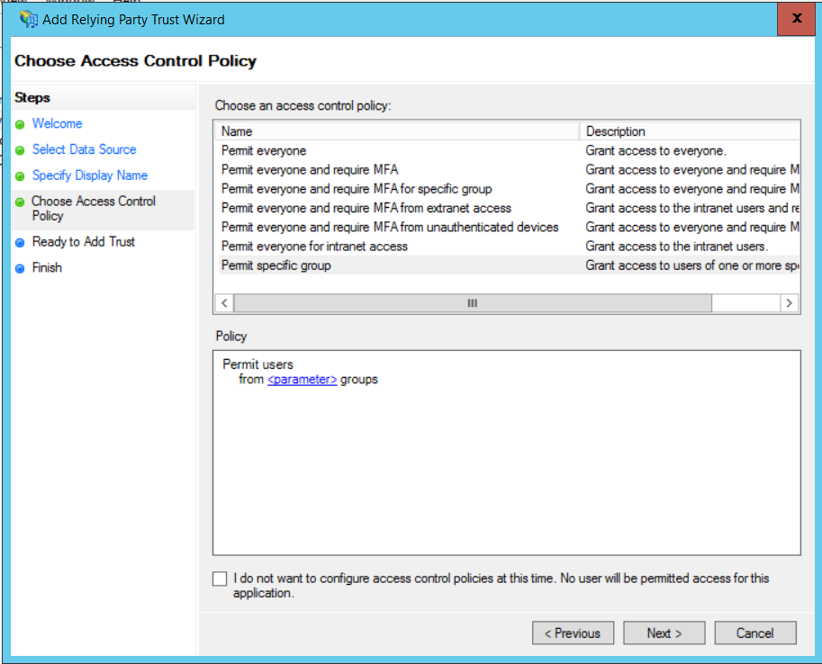
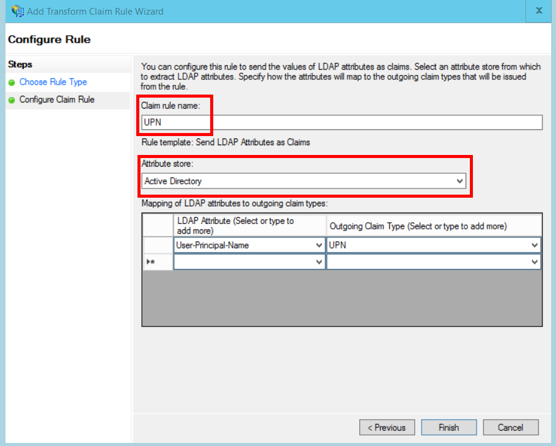
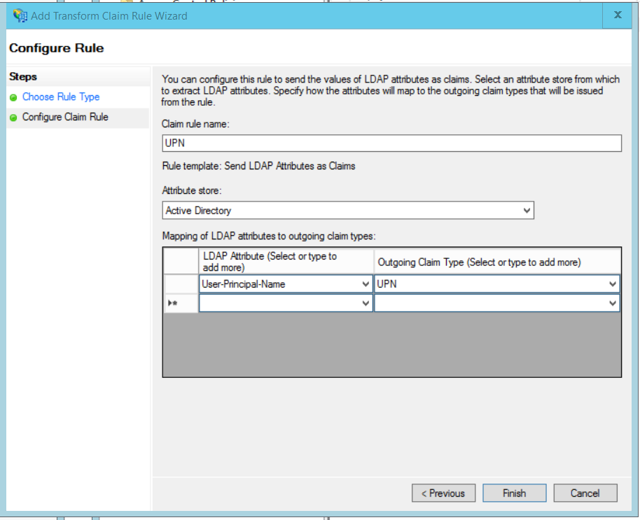

<properties
   pageTitle="Federating with a customer's AD FS | Microsoft Azure"
   description="How to federate with a customer's AD FS in a multitenant application"
   services=""
   documentationCenter="na"
   authors="JohnPWSharp"
   manager="roshar"
   editor=""
   tags=""/>

<tags
   ms.service="guidance"
   ms.devlang="dotnet"
   ms.topic="article"
   ms.tgt_pltfrm="na"
   ms.workload="na"
   ms.date="06/02/2016"
   ms.author="v-josha"/>

# Federating with a customer's AD FS for multitenant apps in Azure

[AZURE.INCLUDE [pnp-header](../../includes/guidance-pnp-header-include.md)]

This article is [part of a series]. There is also a complete [sample application] that accompanies this series.

This article describes how a multi-tenant SaaS application can support authentication via Active Directory Federation Services (AD FS), in order to federate with a customer's AD FS.

## Overview

Azure Active Directory (Azure AD) makes it easy to sign in users from Azure AD tenants, including Office365 and Dynamics CRM Online customers. But what about customers who use on-premise Active Directory on a corporate intranet?

One option is for these customers to sync their on-premise AD with Azure AD, using [Azure AD Connect]. However, some customers may be unable to use this approach, due to corporate IT policy or other reasons. In that case, another option is to federate through Active Directory Federation Services (AD FS).

To enable this scenario:

-	The customer must have an Internet-facing AD FS farm.
-	The SaaS provider deploys their own AD FS farm.
-	The customer and the SaaS provider must set up [federation trust]. This is a manual process.

There are three main roles in the trust relation:

-	The customer's AD FS is the [account partner], responsible for authenticating users from the customer's AD, and creating security tokens with user claims.
-	The SaaS provider's AD FS is the [resource partner], which trusts the account partner and receives the user claims.
-	The application is configured as a relying party (RP) in the SaaS provider's AD FS.

	

> [AZURE.NOTE] In this article, we assume the application uses OpenID connect as the authentication protocol. Another option is to use WS-Federation.

> For OpenID Connect, the SaaS provider must use AD FS 4.0 running in Windows Server 2016, which is currently in Technical Preview. AD FS 3.0 does not support OpenID Connect.

> ASP.NET Core 1.0 does not include out-of-the-box support for WS-Federation.

For an example of using WS-Federation with ASP.NET 4, see the [active-directory-dotnet-webapp-wsfederation sample][active-directory-dotnet-webapp-wsfederation].

## Authentication flow

1.	When the user clicks "sign in", the application redirects to an OpenID Connect endpoint on the SaaS provider's AD FS.
2.	The user enters his or her organizational user name ("`alice@corp.contoso.com`"). AD FS uses home realm discovery to redirect to the customer's AD FS, where the user enters their credentials.
3.	The customer's AD FS sends user claims to the SaaS provider's AD FS, using WF-Federation (or SAML).
4.	Claims flow from AD FS to the app, using OpenID Connect. This requires a protocol transition from WS-Federation.

## Limitations

At the time of this writing, the application receives a limited set of claims in the OpenID id_token, as listed in the following table. AD FS 4.0 is in still preview, so this set might change. It is not currently possible to define additional claims:

Claim	| Description
------|-------------
aud	| Audience. The application for which the the claims were issued.
authenticationinstant	| [Authentication instant]. The time at which authentication occurred.
c_hash	| Code hash value. This is a hash of the token contents.
exp	| [Expiration time]. The time after which the token will no longer be accepted.
iat	| [Issued at]. The time when the token was issued.
iss	| Issuer. The value of this claim is always the resource partner's AD FS.
name	| User name. Example: `john@corp.fabrikam.com`.
nameidentifier | [Name identifier]. The identifier for the name of the entity for which the token was issued.
nonce	| Session nonce. A unique value generated by AD FS to help prevent replay attacks.
upn	| User principal name (UPN). Example: john@corp.fabrikam.com
pwd_exp | Password expiration period. The number of seconds until the user's password or a similar authentication secret, such as a PIN. expires.

> [AZURE.NOTE] The "iss" claim contains the AD FS of the partner (typically, this claim will identify the SaaS provider as the issuer). It does not identify the customer's AD FS. You can find the customer's domain as part of the UPN.

The rest of this article describes how to set up the trust relationship between the RP (the app) and the account partner (the customer).

## AD FS deployment

The SaaS provider can deploy AD FS either on-premise or on Azure VMs. For security and availability, the following guidelines are important:

-	Deploy at least two AD FS servers and two AD FS proxy servers to achieve the best availability of the AD FS service.
-	Domain controllers and AD FS servers should never be exposed directly to the Internet and should be in a virtual network with direct access to them.
-	Web application proxies (previously AD FS proxies) must be used to publish AD FS servers to the Internet.

To set up a similar topology in Azure requires the use of Virtual networks, NSG’s, azure VM’s and availability sets. For more details, see [Guidelines for Deploying Windows Server Active Directory on Azure Virtual Machines] (MSDN).

## Configure OpenID Connect authentication with AD FS

The SaaS provider must enable OpenID Connect between the application and AD FS. To do so, add an application group in AD FS.  You can find detailed instructions in this [blog post], under " Setting up a Web App for OpenId Connect sign in AD FS." 

Next, configure the OpenID Connect middleware. The metadata endpoint is `https://domain/adfs/.well-known/openid-configuration`, where domain is the SaaS provider's AD FS domain.

Typically you might combine this with other OpenID Connect endpoints (such as AAD). You'll need two different sign-in buttons or some other way to distinguish them, so that the user is sent to the correct authentication endpoint.

## Configure the AD FS Resource Partner

The SaaS provider must do the following for each customer that wants to connect via ADFS:

1.	Add a claims provider trust.
2.	Add claims rules.
3.	Enable home-realm discovery.

Here are the steps in more detail.

### Add the claims provider trust

1.	In Server Manager, click **Tools**, and then select **AD FS Management**.
2.	In the console tree, under **AD FS**, right click **Claims Provider Trusts**. Select **Add Claims Provider Trust**.
3.	Click **Start** to start the wizard.
4.	Select the option "Import data about the claims provider published online or on a local network". Enter the URI of the customer's federation metadata endpoint. (Example: `https://contoso.com/FederationMetadata/2007-06/FederationMetadata.xml`.) You will need to get this from the customer.
5.	Complete the wizard using the default options.

### Edit claims rules

1.	Right-click the newly added claims provider trust, and select **Edit Claims Rules**.
2.	Click **Add Rule**.
3.	Select "Pass Through or Filter an Incoming Claim" and click **Next**.
	
4.	Enter a name for the rule.
5.	Under "Incoming claim type", select **UPN**.
6.	Select "Pass through all claim values".
  
7.	Click **Finish**.
8.	Repeat steps 2 - 7, and specify **Anchor Claim Type** for the incoming claim type.
9.	Click **OK** to complete the wizard.

### Enable home-realm discovery
Run the following PowerShell script:

```
Set-ADFSClaimsProviderTrust -TargetName "name" -OrganizationalAccountSuffix @("suffix")
```

where "name" is the friendly name of the claims provider trust, and "suffix" is the UPN suffix for the customer's AD (example, "corp.fabrikam.com").

With this configuration, end users can type in their organizational account, and AD FS automatically selects the corresponding claims provider. See [Customizing the AD FS Sign-in Pages], under the section "Configure Identity Provider to use certain email suffixes".

## Configure the AD FS Account Partner

The customer must do the following:

1.	Add a relying party (RP) trust.
2.	Adds claims rules.

### Add the RP trust

1.	In Server Manager, click **Tools**, and then select **AD FS Management**.
2.	In the console tree, under **AD FS**, right click **Relying Party Trusts**. Select **Add Relying Party Trust**.
3.	Select **Claims Aware** and click **Start**.
4.	On the **Select Data Source** page, select the option "Import data about the claims provider published online or on a local network". Enter the URI of the SaaS provider's federation metadata endpoint.
  
5.	On the **Specify Display Name** page, enter any name.
6.	On the **Choose Access Control Policy** page, choose a policy. You could permit everyone in the organization, or choose a specific security group.
  
7.	Enter any parameters required in the **Policy** box.
8.	Click **Next** to complete the wizard.

### Add claims rules

1.	Right-click the newly added relying party trust, and select **Edit Claim Issuance Policy**.
2.	Click **Add Rule**.
3.	Select "Send LDAP Attributes as Claims" and click **Next**.
4.	Enter a name for the rule, such as "UPN".
5.	Under **Attribute store**, select **Active Directory**.
  
6.	In the **Mapping of LDAP attributes** section:
  -	Under **LDAP Attribute**, select **User-Principal-Name**.
  - Under **Outgoing Claim Type**, select **UPN**.
  
7.	Click **Finish**.
8.	Click **Add Rule** again.
9.	Select "Send Claims Using a Custom Rule" and click **Next**.
10.	Enter a name for the rule, such as "Anchor Claim Type".
11.	Under **Custom rule**, enter the following:

	```
    EXISTS([Type == "http://schemas.microsoft.com/ws/2014/01/identity/claims/anchorclaimtype"])=>
      issue (Type = "http://schemas.microsoft.com/ws/2014/01/identity/claims/anchorclaimtype",
             Value = "http://schemas.xmlsoap.org/ws/2005/05/identity/claims/upn");
	```

    This rule issues a claim of type `anchorclaimtype`. The claim tells the relying party to use UPN as the user's immutable ID.

12.	Click **Finish**.
13.	Click **OK** to complete the wizard.

## Next steps

- Read the next article in this series: [Using client assertion to get access tokens from Azure AD][client assertion]

<!-- Links -->
[part of a series]: guidance-multitenant-identity.md
[Azure AD Connect]: ../active-directory/active-directory-aadconnect.md
[federation trust]: https://technet.microsoft.com/library/cc770993(v=ws.11).aspx
[account partner]: https://technet.microsoft.com/library/cc731141(v=ws.11).aspx
[resource partner]: https://technet.microsoft.com/library/cc731141(v=ws.11).aspx
[Authentication instant]: https://msdn.microsoft.com/library/system.security.claims.claimtypes.authenticationinstant%28v=vs.110%29.aspx
[Expiration time]: http://tools.ietf.org/html/draft-ietf-oauth-json-web-token-25#section-4.1.4
[Issued at]: http://tools.ietf.org/html/draft-ietf-oauth-json-web-token-25#section-4.1.6
[Name identifier]: https://msdn.microsoft.com/library/system.security.claims.claimtypes.nameidentifier(v=vs.110).aspx
[Guidelines for Deploying Windows Server Active Directory on Azure Virtual Machines]: https://msdn.microsoft.com/library/azure/jj156090.aspx
[blog post]: http://www.cloudidentity.com/blog/2015/08/21/OPENID-CONNECT-WEB-SIGN-ON-WITH-ADFS-IN-WINDOWS-SERVER-2016-TP3/
[Customizing the AD FS Sign-in Pages]: https://technet.microsoft.com/library/dn280950.aspx
[sample application]: https://github.com/Azure-Samples/guidance-identity-management-for-multitenant-apps
[client assertion]: guidance-multitenant-identity-client-assertion.md
[active-directory-dotnet-webapp-wsfederation]: https://github.com/Azure-Samples/active-directory-dotnet-webapp-wsfederation
