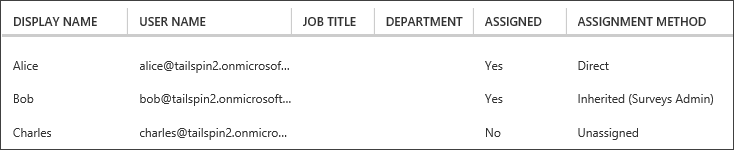

<properties
   pageTitle="Application roles | Microsoft Azure"
   description="How to perform authorization using application roles"
   services=""
   documentationCenter="na"
   authors="MikeWasson"
   manager="roshar"
   editor=""
   tags=""/>

<tags
   ms.service="guidance"
   ms.devlang="dotnet"
   ms.topic="article"
   ms.tgt_pltfrm="na"
   ms.workload="na"
   ms.date="02/16/2016"
   ms.author="mwasson"/>

#  Application roles in multitenant applications

[AZURE.INCLUDE [pnp-header](../../includes/guidance-pnp-header-include.md)]

This article is [part of a series]. There is also a complete [sample application] that accompanies this series.

Application roles are used to assign permissions to users. For example, the [Tailspin Surveys][Tailspin] application defines the following roles:

- Administrator. Can perform all CRUD operations on any survey that belongs to that tenant.
- Creator. Can create new surveys.
- Reader. Can read any surveys that belong to that tenant.

You can see that roles ultimately get translated into permissions, during [authorization]. But the first question is how to assign and manage roles. We identified three main options:

-	[Azure AD App Roles](#roles-using-azure-ad-app-roles)
-	[Azure AD security groups](#roles-using-azure-ad-security-groups)
-	[Application role manager](#roles-using-an-application-role-manager).

## Roles using Azure AD App Roles

This is the approach that we used in the Tailspin Surveys app.

In this approach, The SaaS provider defines the application roles by adding them to the application manifest. After a customer signs up, an admin for the customer's AD directory assigns users to the roles. When a user signs in, the user's assigned roles are sent as claims.

> [AZURE.NOTE] If the customer has Azure AD Premium, the admin can assign a security group to a role, and members of the group will inherit the app role. This is a convenient way to manage roles, because the group owner doesn't need to be an AD admin.

Advantages of this approach:

-	Simple programming model.
-	Roles are specific to the application. The role claims for one application are not sent to another application.
-	If the customer removes the application from their AD tenant, the roles go away.
-	The application doesn't need any extra Active Directory permissions, other than reading the user's profile.

Drawbacks:

- Customers without Azure AD Premium cannot assign security groups to roles. For these customers, all user assignments must be done by an AD administrator.
- If you have a backend web API, which is separate from the web app, then role assignments for the web app don't apply to the web API. For more discussion of this point, see [Securing a backend web API].

### Implementation

**Define the roles.** The SaaS provider declares the app roles in the [application manifest]. For example, here is the manifest entry for the Surveys app:

```
"appRoles": [
  {
    "allowedMemberTypes": [
      "User"
    ],
    "description": "Creators can create Surveys",
    "displayName": "SurveyCreator",
    "id": "1b4f816e-5eaf-48b9-8613-7923830595ad",
    "isEnabled": true,
    "value": "SurveyCreator"
  },
  {
    "allowedMemberTypes": [
      "User"
    ],
    "description": "Administrators can manage the Surveys in their tenant",
    "displayName": "SurveyAdmin",
    "id": "c20e145e-5459-4a6c-a074-b942bbd4cfe1",
    "isEnabled": true,
    "value": "SurveyAdmin"
  }
],
```

The `value`  property appears in the role claim. The `id` property is the unique identifier for the defined role. Always generate a new GUID value for `id`.

**Assign users**. When a new customer signs up, the application is registered in the customer's AD tenant. At this point, an AD admin for that tenant can assign users to roles.

> [AZURE.NOTE] As noted earlier, customers with Azure AD Premium can also assign security groups to roles.

The following screenshot from the Azure portal shows three users. Alice was assigned directly to a role. Bob inherited a role as a member of a security group named "Surveys Admin", which is assigned to a role. Charles is not assigned to any role.



> [AZURE.NOTE] Alternatively, the application can assign roles programmatically, using the Azure AD Graph API.  However, this requires the application to obtain write permissions for the customer's AD directory. An application with those permissions could do a lot of mischief &mdash; the customer is trusting the app not to mess up their directory. Many customers might be unwilling to grant this level of access.

**Get role claims**. When a user signs in, the application receives the user's assigned role(s) in a claim with type `http://schemas.microsoft.com/ws/2008/06/identity/claims/role`.  

A user can have multiple roles, or no role. In your authorization code, don't assume the user has exactly one role claim. Instead, write code that checks whether a particular claim value is present:

```csharp
if (context.User.HasClaim(ClaimTypes.Role, "Admin")) { ... }
```

## Roles using Azure AD security groups

In this approach, roles are represented as AD security groups. The application assigns permissions to users based on their security group memberships.

Advantages:

-	For customers who do not have Azure AD Premium, this approach enables the customer to use security groups to manage role assignments.

Disadvantages:

- Complexity. Because every tenant sends different group claims, the app must keep track of which security groups correspond to which application roles, for each tenant.
- If the customer removes the application from their AD tenant, the security groups are left in their AD directory.

### Implementation

In the application manifest, set the `groupMembershipClaims` property to "SecurityGroup". This is needed to get group membership claims from AAD.

```
{
   // ...
   "groupMembershipClaims": "SecurityGroup",
}
```

When a new customer signs up, the application instructs the customer to create security groups for the roles needed by the application. The customer then needs to enter the group object IDs into the application. The application stores these in a table that maps group IDs to application roles, per tenant.

> [AZURE.NOTE] Alternatively, the application could create the groups programmatically, using the Azure AD Graph API.  This would be less error prone. However, it requires the application to obtain "read and write all groups" permissions for the customer's AD directory. Many customers might be unwilling to grant this level of access.

When a user signs in:

1.	The application receives the user's groups as claims. The value of each claim is the object ID of a group.
2.	Azure AD limits the number of groups sent in the token. If the number of groups exceeds this limit, Azure AD sends a special "overage" claim. If that claim is present, the application must query the Azure AD Graph API to get all of the groups to which that user belongs. For details, see [Authorization in Cloud Applications using AD Groups], under the section titled "Groups claim overage".
3.	The application looks up the object IDs in its own database, to find the corresponding application roles to assign to the user.
4.	The application adds a custom claim value to the user principal that expresses the application role. For example: `survey_role` = "SurveyAdmin".

Authorization policies should use the custom role claim, not the group claim.

## Roles using an application role manager

With this approach, application roles are not stored in Azure AD at all. Instead, the application stores the role assignments for each user in its own DB &mdash; for example, using the **RoleManager** class in ASP.NET Identity.

Advantages:

-	The app has full control over the roles and user assignments.

Drawbacks:

- More complex, harder to maintain.
- Cannot use AD security groups to manage role assignments.
- Stores user information in the application database, where it can get out of sync with the tenant's AD directory, as users are added or removed.   

There are many existing examples for this approach. For example, see [Create an ASP.NET MVC app with auth and SQL DB and deploy to Azure App Service].

## Next steps

- Read the next article in this series: [Role-based and resource-based authorization in multitenant applications][authorization]

<!-- Links -->
[Tailspin]: guidance-multitenant-identity-tailspin.md
[part of a series]: guidance-multitenant-identity.md
[authorization]: guidance-multitenant-identity-authorize.md
[Securing a backend web API]: guidance-multitenant-identity-web-api.md
[Create an ASP.NET MVC app with auth and SQL DB and deploy to Azure App Service]: ../app-service-web/web-sites-dotnet-deploy-aspnet-mvc-app-membership-oauth-sql-database.md
[application manifest]: ../active-directory/active-directory-application-manifest.md
[sample application]: https://github.com/Azure-Samples/guidance-identity-management-for-multitenant-apps
