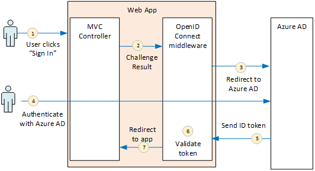
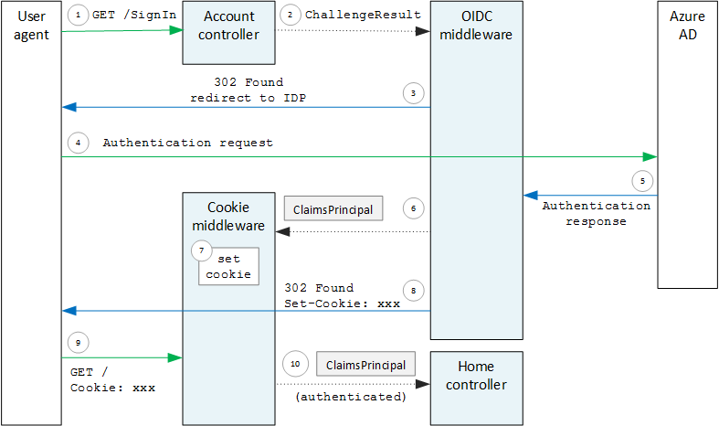

<properties
   pageTitle="Authentication in multitenant applications | Microsoft Azure"
   description="How a multitenant application can authenticate users from Azure AD"
   services=""
   documentationCenter="na"
   authors="MikeWasson"
   manager="roshar"
   editor=""
   tags=""/>

<tags
   ms.service="guidance"
   ms.devlang="dotnet"
   ms.topic="article"
   ms.tgt_pltfrm="na"
   ms.workload="na"
   ms.date="05/23/2016"
   ms.author="mwasson"/>

# Authentication in multitenant apps, using Azure AD and OpenID Connect

[AZURE.INCLUDE [pnp-header](../../includes/guidance-pnp-header-include.md)]

This article is [part of a series](guidance-multitenant-identity.md). There is also a complete [sample application] that accompanies this series.

This article describes how a multitenant application can authenticate users from Azure Active Directory (Azure AD), using OpenID Connect (OIDC) to authenticate.

## Overview

Our [reference implementation](guidance-multitenant-identity-tailspin.md) is an ASP.NET Core 1.0 application. The application uses the built-in OpenID Connect middleware to perform the OIDC authentication flow. The following diagram shows what happens when the user signs in, at a high level.



1.	The user clicks the "sign in" button in the app. This action is handled by an MVC controller.
2.	The MVC controller returns a **ChallengeResult** action.
3.	The middleware intercepts the **ChallengeResult** and creates a 302 response, which redirects the user to the Azure AD sign-in page.
4.	The user authenticates with Azure AD.
5.	Azure AD sends an ID token to the application.
6.	The middleware validates the ID token. At this point, the user is now authenticated inside the application.
7.	The middleware redirects the user back to application.

## Register the app with Azure AD

To enable OpenID Connect, the SaaS provider registers the application inside their own Azure AD tenant.

To register the application, follow the steps in [Integrating Applications with Azure Active Directory](../active-directory/active-directory-integrating-applications.md), in the section [Adding an Application](../active-directory/active-directory-integrating-applications.md#adding-an-application).

In the **Configure** page:

-	Note the client ID.
-	Under **Application is Multi-Tenant**, select **Yes**.
-	Set **Reply URL** to a URL where Azure AD will send the authentication response. You can use the base URL of your app.
  -	Note: The URL path can be anything, as long as the host name matches your deployed app.
  -	You can set multiple reply URLs. During development, you can use a `localhost` address, for running the app locally.
-	Generate a client secret: Under **keys**, click on the drop down that says **Select duration** and pick either 1 or 2 years. The key will be visible when you click **Save**. Be sure to copy the value, because it's not shown again when you reload the configuration page.

## Configure the auth middleware

This section describes how to configure the authentication middleware in ASP.NET Core 1.0 for multitenant authentication with OpenID Connect.

In your startup class, add the OpenID Connect middleware:

```csharp
app.UseOpenIdConnectAuthentication(options =>
{
    options.AutomaticAuthenticate = true;
    options.AutomaticChallenge = true;
    options.ClientId = [client ID];
    options.Authority = "https://login.microsoftonline.com/common/";
    options.CallbackPath = [callback path];
    options.PostLogoutRedirectUri = [application URI];
    options.SignInScheme = CookieAuthenticationDefaults.AuthenticationScheme;
    options.TokenValidationParameters = new TokenValidationParameters
    {
        ValidateIssuer = false
    };
    options.Events = [event callbacks];
});
```

> [AZURE.NOTE] See [Startup.cs](https://github.com/Azure-Samples/guidance-identity-management-for-multitenant-apps/blob/master/src/Tailspin.Surveys.Web/Startup.cs).

For more information about the startup class, see [Application Startup](https://docs.asp.net/en/latest/fundamentals/startup.html) in the ASP.NET Core 1.0 documentation.

Set the following middleware options:

- **ClientId**. The application's client ID, which you got when you registered the application in Azure AD.
- **Authority**. For a multitenant application, set this to `https://login.microsoftonline.com/common/`. This is the URL for the Azure AD common endpoint, which enables users from any Azure AD tenant to sign in. For more information about the common endpoint, see [this blog post](http://www.cloudidentity.com/blog/2014/08/26/the-common-endpoint-walks-like-a-tenant-talks-like-a-tenant-but-is-not-a-tenant/).
- In **TokenValidationParameters**, set **ValidateIssuer** to false. That means the app will be responsible for validating the issuer value in the ID token. (The middleware still validates the token itself.) For more information about validating the issuer, see [Issuer validation](guidance-multitenant-identity-claims.md#issuer-validation).
- **CallbackPath**. Set this equal to the path in the Reply URL that you registered in Azure AD. For example, if the reply URL is `http://contoso.com/aadsignin`, **CallbackPath** should be `aadsignin`. If you don't set this option, the default value is `signin-oidc`.
- **PostLogoutRedirectUri**. Specify a URL to redirect users after the sign out. This should be a page that allows anonymous requests &mdash; typically the home page.
- **SignInScheme**. Set this to `CookieAuthenticationDefaults.AuthenticationScheme`. This setting means that after the user is authenticated, the user claims are stored locally in a cookie. This cookie is how the user stays logged in during the browser session.
- **Events.** Event callbacks; see [Authentication events](#authentication-events).

Also add the Cookie Authentication middleware to the pipeline. This middleware is responsible for writing the user claims to a cookie, and then reading the cookie during subsequent page loads.

```csharp
app.UseCookieAuthentication(options =>
{
    options.AutomaticAuthenticate = true;
    options.AutomaticChallenge = true;
    options.AccessDeniedPath = "/Home/Forbidden";
});
```

## Initiate the authentication flow

To start the authentication flow in ASP.NET MVC, return a **ChallengeResult** from the contoller:

```csharp
[AllowAnonymous]
public IActionResult SignIn()
{
    return new ChallengeResult(
        OpenIdConnectDefaults.AuthenticationScheme,
        new AuthenticationProperties
        {
            IsPersistent = true,
            RedirectUri = Url.Action("SignInCallback", "Account")
        });
}
```

This causes the middleware to return a 302 (Found) response that redirects to the authentication endpoint.

## User login sessions

As mentioned, when the user first signs in, the Cookie Authentication middleware writes the user claims to a cookie. After that, HTTP requests are authenticated by reading the cookie.

By default, the cookie middleware writes a [session cookie][session-cookie], which gets deleted once the user closes the browser. The next time the user next visits the site, they will have to sign in again. However, if you set **IsPersistent** to true in the **ChallengeResult**, the middleware writes a persistent cookie, so the user stays logged in after closing the browser. You can configure the cookie expiration; see [Controlling cookie options][cookie-options]. Persistent cookies are more convenient for the user, but may be inappropriate for some applications (say, a banking application) where you want the user to sign in every time.

## About the OpenID Connect middleware

The OpenID Connect middleware in ASP.NET hides most of the protocol details. This section contains some notes about the implementation, that may be useful for understanding the protocol flow.

First, let's examine the authentication flow in terms of ASP.NET (ignoring the details of the OIDC protocol flow between the app and Azure AD). The following diagram shows the process.



In this diagram, there are two MVC controllers. The Account controller handles sign-in requests, and the Home controller serves up the home page.

Here is the authentication process:

1. The user clicks the "Sign in" button, and the browser sends a GET request. For example: `GET /Account/SignIn/`.
2. The account controller returns a `ChallengeResult`.
3. The OIDC middleware returns an HTTP 302 response, redirecting to Azure AD.
4. The browser sends the authentication request to Azure AD
5. The user signs in to Azure AD, and Azure AD sends back an authentication response.
6. The OIDC middleware creates a claims principal and passes it to the Cookie Authentication middleware.
7. The cookie middleware serializes the claims principal and sets a cookie.
8. The OIDC middleware redirects to the application's callback URL.
10. The browser follows the redirect, sending the cookie in the request.
11. The cookie middleware deserializes the cookie to a claims principal and sets `HttpContext.User` equal to the claims principal. The request is routed to an MVC controller.

### Authentication ticket

If authentication succeeds, the OIDC middleware creates an authentication ticket, which contains a claims principal that holds the user's claims. You can access the ticket inside the **AuthenticationValidated** or **TicketReceived** event.

> [AZURE.NOTE] Until the entire authentication flow is completed, `HttpContext.User` still holds an anonymous principal,  _not_ the authenticated user. The anonymous principal has an empty claims collection. After authentication completes and the app redirects, the cookie middleware deserializes the authentication cookie and sets `HttpContext.User` to a claims principal that represents the authenticated user.

### Authentication events

During the authentication process, the OpenID Connect middleware raises a series of events:

- **RedirectToAuthenticationEndpoint**. Called right before the middleware redirects to the authentication endpoint. You can use this event to modify the redirect URL; for example, to add request parameters. See [Adding the admin consent prompt](guidance-multitenant-identity-signup.md#adding-the-admin-consent-prompt) for an example.

- **AuthorizationResponseReceived**. Called after the middleware receives the authentication response from the identity provider (IDP), but before the middleware validates the response.  

- **AuthorizationCodeReceived**. Called with the authorization code.

- **TokenResponseReceived**. Called after the middleware gets an access token from the IDP. Applies only to authorization code flow.

- **AuthenticationValidated**. Called after the middleware validates the ID token. At this point, the application has a set of validated claims about the user. You can use this event to perform additional validation on the claims, or to transform claims. See [Working with claims](guidance-multitenant-identity-claims.md).

- **UserInformationReceived**. Called if the middleware gets the user profile from the user info endpoint. Applies only to authorization code flow, and only when `GetClaimsFromUserInfoEndpoint = true` in the middleware options.

- **TicketReceived**. Called when authentication is completed. This is the last event, assuming that authentication succeeds. After this event is handled, the user is signed into the app.

- **AuthenticationFailed**. Called if authentication fails. Use this event to handle authentication failures &mdash; for example, by redirecting to an error page.

To provide callbacks for these events, set the **Events** option on the middleware. There are two different ways to declare the event handlers: Inline with lambdas, or in a class that derives from **OpenIdConnectEvents**.

Inline with lambdas:

```csharp
app.UseOpenIdConnectAuthentication(options =>
{
    // Other options not shown.

    options.Events = new OpenIdConnectEvents
    {
        OnTicketReceived = (context) =>
        {
             // Handle event
             return Task.FromResult(0);
        },
        // other events
    }
});
```

Deriving from **OpenIdConnectEvents**:

```csharp
public class SurveyAuthenticationEvents : OpenIdConnectEvents
{
    public override Task TicketReceived(TicketReceivedContext context)
    {
        // Handle event
        return base.TicketReceived(context);
    }
    // other events
}

// In Startup.cs:
app.UseOpenIdConnectAuthentication(options =>
{
    // Other options not shown.

    options.Events = new SurveyAuthenticationEvents();
});
```

The second approach is recommended if your event callbacks have any substantial logic, so they don't clutter your startup class. Our reference implementation uses this approach; see [SurveyAuthenticationEvents.cs](https://github.com/Azure-Samples/guidance-identity-management-for-multitenant-apps/blob/master/src/Tailspin.Surveys.Web/Security/SurveyAuthenticationEvents.cs).

### OpenID connect endpoints

Azure AD supports [OpenID Connect Discovery](https://openid.net/specs/openid-connect-discovery-1_0.html), wherein the identity provider (IDP) returns a JSON metadata document from a [well-known endpoint](https://openid.net/specs/openid-connect-discovery-1_0.html#ProviderConfig). The metadata document contains information such as:

-	The URL of the authorization endpoint. This is where the app redirects to authenticate the user.
-	The URL of the "end session" endpoint, where the app goes to log out the user.
-	The URL to get the signing keys, which the client uses to validate the OIDC tokens that it gets from the IDP.

By default, the OIDC middleware knows how to fetch this metadata. Set the **Authority** option in the middleware, and the middleware constructs the URL for the metadata. (You can override the metadata URL by setting the **MetadataAddress** option.)

### OpenID connect flows

By default, the OIDC middleware uses hybrid flow with form post response mode.

-	_Hybrid flow_ means the client can get an ID token and an authorization code in the same round-trip to the authorization server.
-	_Form post reponse mode_ means the authorization server uses an HTTP POST request to send the ID token and authorization code to the app. The values are form-urlencoded (content type = "application/x-www-form-urlencoded").

When the OIDC middleware redirects to the authorization endpoint, the redirect URL includes all of the query string parameters needed by OIDC. For hybrid flow:

-	client_id. This value is set in the **ClientId** option
-	scope = "openid profile", which means it's an OIDC request and we want the user's profile.
-	response_type  = "code id_token". This specifies hybrid flow.
-	response_mode = "form_post". This specifies form post response.

To specify a different flow, set the **ResponseType** property on the options. For example:

```csharp
app.UseOpenIdConnectAuthentication(options =>
{
    options.ResponseType = "code"; // Authorization code flow

    // Other options
}
```

## Next steps

- Read the next article in this series: [Working with claims-based identities in multitenant applications][claims]


[claims]: guidance-multitenant-identity-claims.md
[cookie-options]: https://docs.asp.net/en/latest/security/authentication/cookie.html#controlling-cookie-options
[session-cookie]: https://en.wikipedia.org/wiki/HTTP_cookie#Session_cookie
[sample application]: https://github.com/Azure-Samples/guidance-identity-management-for-multitenant-apps
