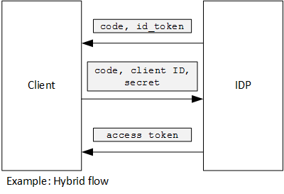

<properties
   pageTitle="Using client assertion to get access tokens from Azure AD | Microsoft Azure"
   description="How to use client assertion to get access tokens from Azure AD."
   services=""
   documentationCenter="na"
   authors="MikeWasson"
   manager="roshar"
   editor=""
   tags=""/>

<tags
   ms.service="guidance"
   ms.devlang="dotnet"
   ms.topic="article"
   ms.tgt_pltfrm="na"
   ms.workload="na"
   ms.date="05/23/2016"
   ms.author="mwasson"/>

# Using client assertion to get access tokens from Azure AD

[AZURE.INCLUDE [pnp-header](../../includes/guidance-pnp-header-include.md)]

This article is [part of a series]. There is also a complete [sample application] that accompanies this series.

## Background

When using authorization code flow or hybrid flow in OpenID Connect, the client exchanges an authorization code for an access token. During this step, the client has to authenticate itself to the server.



One way to authenticate the client is by using a client secret. That's how the [Tailspin Surveys][Surveys] application is configured by default.

Here is an example request from the client to the IDP, requesting an access token. Note the `client_secret` parameter.

```
POST https://login.microsoftonline.com/b9bd2162xxx/oauth2/token HTTP/1.1
Content-Type: application/x-www-form-urlencoded

resource=https://tailspin.onmicrosoft.com/surveys.webapi
  &client_id=87df91dc-63de-4765-8701-b59cc8bd9e11
  &client_secret=i3Bf12Dn...
  &grant_type=authorization_code
  &code=PG8wJG6Y...
```

The secret is just a string, so you have to make sure not to leak the value. The best practice is to keep the client secret out of source control. When you deploy to Azure, store the secret in an [app setting][configure-web-app].

However, anyone with access to the Azure subscription can view the app settings. Further, there is always a temptation to check secrets into source control (e.g., in deployment scripts), share them by email, and so on.

For additional security, you can use [client assertion] instead of a client secret. With client assertion, the client uses an X.509 certificate to prove the token request came from the client. The client certificate is installed on the web server. Generally, it will be easier to restrict access to the certificate, than to ensure that nobody inadvertently reveals a client secret. For more information about configuring certificates in a web app, see [Using Certificates in Azure Websites Applications][using-certs-in-websites]

Here is a token request using client assertion:

```
POST https://login.microsoftonline.com/b9bd2162xxx/oauth2/token HTTP/1.1
Content-Type: application/x-www-form-urlencoded

resource=https://tailspin.onmicrosoft.com/surveys.webapi
  &client_id=87df91dc-63de-4765-8701-b59cc8bd9e11
  &client_assertion_type=urn:ietf:params:oauth:client-assertion-type:jwt-bearer
  &client_assertion=eyJhbGci...
  &grant_type=authorization_code
  &code= PG8wJG6Y...
```

Notice that the `client_secret` parameter is no longer used. Instead, the `client_assertion` parameter contains a JWT token that was signed using the client certificate. The `client_assertion_type` parameter specifies the type of assertion &mdash; in this case, JWT token. The server validates the JWT token. If the JWT token is invalid, the token request returns an error.

> [AZURE.NOTE] X.509 certificates are not the only form of client assertion; we focus on it here because it is supported by Azure AD.

## Using client assertion in the Surveys application

This section shows how to configure the Tailspin Surveys application to use client assertion. In these steps, you will generate a self-signed certificate that is suitable for development, but not for production use.

1. Run the PowerShell script [/Scripts/Setup-KeyVault.ps1][Setup-KeyVault] as follows:

    ```
    .\Setup-KeyVault.ps -Subject [subject]
    ```

    For the `Subject` parameter, enter any name, such as "surveysapp". The script generates a self-signed certificate and stores it in the "Current User/Personal" certificate store.

2. The output from the script is a JSON fragment. Add this to the application manifest of the web app, as follows:

    1. Log into the [Azure management portal][azure-management-portal] and navigate to your Azure AD directory.

    2. Click **Applications**.

    3. Select the Surveys application.

    4.	Click **Manage Manifest** and select **Download Manifest**.

    5.	Open the manifest JSON file in a text editor. Paste the output from the script into the `keyCredentials` property. It should look similar to the following:

        ```    
        "keyCredentials": [
            {
              "type": "AsymmetricX509Cert",
              "usage": "Verify",
              "keyId": "29d4f7db-0539-455e-b708-....",
              "customKeyIdentifier": "ZEPpP/+KJe2fVDBNaPNOTDoJMac=",
              "value": "MIIDAjCCAeqgAwIBAgIQFxeRiU59eL.....
            }
          ],
         ```

    6.	Save your changes to the JSON file.

    7.	Go back to the portal. Click **Manage Manifest** > **Upload Manifest** and upload the JSON file.

3. Run the following command to get the thumbprint of the certificate.

    ```
    certutil -store -user my [subject]
    ```

    where `[subject]` is the value that you specified for Subject in the PowerShell script. The thumbprint is listed under "Cert Hash(sha1)". Remove the spaces between the hexadecimal numbers.

4. Update your app secrets. In Solution Explorer, right-click the Tailspin.Surveys.Web project and select **Manage User Secrets**. Add an entry for "Asymmetric" under "AzureAd", as shown below:

    ```
    {
      "AzureAd": {
        "ClientId": "[Surveys application client ID]",
        // "ClientSecret": "[client secret]",  << Delete this entry
        "PostLogoutRedirectUri": "https://localhost:44300/",
        "WebApiResourceId": "[App ID URI of your Survey.WebAPI application]",
        // new:
        "Asymmetric": {
          "CertificateThumbprint": "[certificate thumbprint]",  // Example: "105b2ff3bc842c53582661716db1b7cdc6b43ec9"
          "StoreName": "My",
          "StoreLocation": "CurrentUser",
          "ValidationRequired": "false"
        }
      },
      "Redis": {
        "Configuration": "[Redis connection string]"
      }
    }
    ```

    You must set `ValidationRequired` to false, because the certificate was not a signed by a root CA authority. In production, use a certificate that is signed by a CA authority and set `ValidationRequired` to true.

    Also delete the entry for `ClientSecret`, because it's not needed with client assertion.

5. In Startup.cs, locate the code that registers the `ICredentialService`. Uncomment the line that uses `CertificateCredentialService`, and comment out the line that uses `ClientCredentialService`:

    ```csharp
    // Uncomment this:
    services.AddSingleton<ICredentialService, CertificateCredentialService>();
    // Comment out this:
    //services.AddSingleton<ICredentialService, ClientCredentialService>();
    ```

At run time, the web application reads the certificate from the certificate store. The certificate must be installed on the same machine as the web app.

## Next steps

- Read the next article in this series: [Using Azure Key Vault to protect application secrets][key vault]


<!-- Links -->
[configure-web-app]: ../app-service-web/web-sites-configure.md
[azure-management-portal]: https://manage.windowsazure.com
[client assertion]: https://tools.ietf.org/html/rfc7521
[key vault]: guidance-multitenant-identity-keyvault.md
[Setup-KeyVault]: https://github.com/Azure-Samples/guidance-identity-management-for-multitenant-apps/blob/master/scripts/Setup-KeyVault.ps1
[Surveys]: guidance-multitenant-identity-tailspin.md
[using-certs-in-websites]: https://azure.microsoft.com/blog/using-certificates-in-azure-websites-applications/
[part of a series]: guidance-multitenant-identity.md
[sample application]: https://github.com/Azure-Samples/guidance-identity-management-for-multitenant-apps
