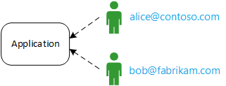
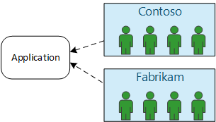
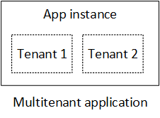
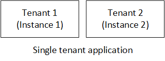
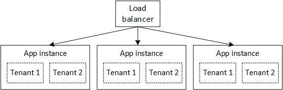

<properties
   pageTitle="Identity management for multitenant applications | Microsoft Azure"
   description="Introduction to identity management in multitenant applications"
   services=""
   documentationCenter="na"
   authors="MikeWasson"
   manager="roshar"
   editor=""
   tags=""/>

<tags
   ms.service="guidance"
   ms.devlang="dotnet"
   ms.topic="article"
   ms.tgt_pltfrm="na"
   ms.workload="na"
   ms.date="06/02/2016"
   ms.author="mwasson"/>

# Introduction to identity management for multitenant applications in Microsoft Azure

[AZURE.INCLUDE [pnp-header](../../includes/guidance-pnp-header-include.md)]

This article is [part of a series]. There is also a complete [sample application] that accompanies this series.

Let's say you're writing an enterprise SaaS application to be hosted in the cloud. Of course, the application will have users:

But those users belong to organizations:

Example: Tailspin sells subscriptions to its SaaS application. Contoso and Fabrikam sign up for the app. When Alice (`alice@contoso`) signs in, the application should know that Alice is part of Contoso.

- Alice _should_ have access to Contoso data.
- Alice _should not_ have access to Fabrikam data.

This guidance will show you how to manage user identities in a multitenant application, using [Azure Active Directory][AzureAD] (Azure AD) to handle sign-in and authentication.

## What is multitenancy?

A _tenant_ is a group of users. In a SaaS application, the tenant is a subscriber or customer of the application. _Multitenancy_ is an architecture where multiple tenants share the same physical instance of the app. Although tenants share physical resources (such as VMs or storage), each tenant gets its own logical instance of the app.

Typically, application data is shared among the users within a tenant, but not with other tenants.

Compare this architecture with a single-tenant architecture, where each tenant has a dedicated physical instance. In a single-tenant architecture, you add tenants by spinning up new instances of the app.

### Multitenancy and horizontal scaling

To achieve scale in the cloud, it’s common to add more physical instances. This is known as _horizontal scaling_ or _scaling out_. Consider a web app. To handle more traffic, you can add more server VMs and put them behind a load balancer. Each VM runs a separate physical instance of the web app.

Any request can be routed to any instance. Together, the system functions as a single logical instance. You can tear down a VM or spin up a new VM, without affecting users. In this architecture, each physical instance is multi-tenant, and you scale by adding more instances. If one instance goes down, it should not affect any tenant.

## Identity in a multitenant app

In a multitenant app, you must consider users in the context of tenants.

**Authentication**

- Users sign into the app with their organization credentials. They don't have to create new user profiles for the app.
- Users within the same organization are part of the same tenant.
- When a user signs in, the application knows which tenant the user belongs to.

**Authorization**

- When authorizing a user's actions (say, viewing a resource), the app must take into account the user's tenant.
- Users might be assigned roles within the application, such as "Admin" or "Standard User". Role assignments should be managed by the customer, not by the SaaS provider.

**Example.** Alice, an employee at Contoso, navigates to the application in her browser and clicks the “Log in” button. She is redirected to a login screen where she enters her corporate credentials (username and password). At this point, she is logged into the app as `alice@contoso.com`. The application also knows that Alice is an admin user for this application. Because she is an admin, she can see a list of all the resources that belong to Contoso. However, she cannot view Fabrikam's resources, because she is an admin only within her tenant.

In this guidance, we'll look specifically at using Azure AD for identity management.

- We assume the customer stores their user profiles in Azure AD (including Office365 and Dynamics CRM tenants)
- Customers with on-premise Active Directory (AD) can use [Azure AD Connect][ADConnect] to sync their on-premise AD with Azure AD.

If a customer with on-premise AD cannot use Azure AD Connect (due to corporate IT policy or other reasons), the SaaS provider can federate with the customer's AD through Active Directory Federation Services (AD FS). This option is described in [Federating with a customer's AD FS].

This guidance does not consider other aspects of multitenancy such as data partitioning, per-tenant configuration, and so forth.

## Next steps

- Read the next article in this series: [About the Tailspin Surveys application][tailpin]

<!-- Links -->
[ADConnect]: ../active-directory/active-directory-aadconnect.md
[AzureAD]: https://azure.microsoft.com/documentation/services/active-directory/
[part of a series]: guidance-multitenant-identity.md
[Federating with a customer's AD FS]: guidance-multitenant-identity-adfs.md
[sample application]: https://github.com/Azure-Samples/guidance-identity-management-for-multitenant-apps
[tailpin]: guidance-multitenant-identity-tailspin.md
