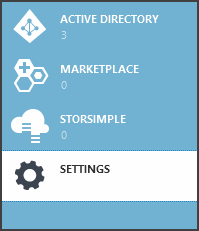
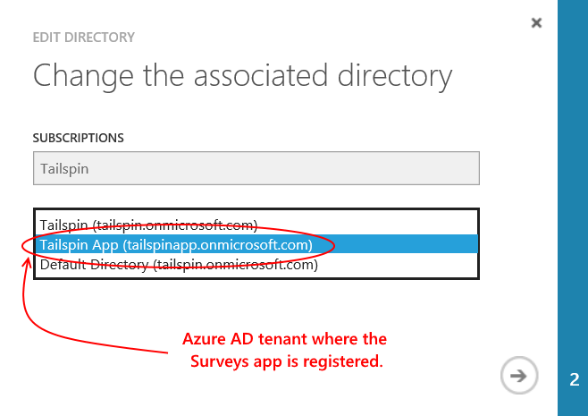
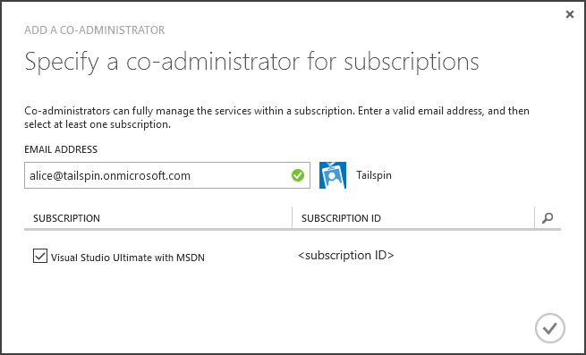
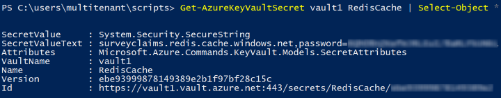

<properties
   pageTitle="Using Key Vault to protect application secrets | Microsoft Azure"
   description="How a use the Key Vault service to store application secrets"
   services=""
   documentationCenter="na"
   authors="MikeWasson"
   manager="roshar"
   editor=""
   tags=""/>

<tags
   ms.service="guidance"
   ms.devlang="dotnet"
   ms.topic="article"
   ms.tgt_pltfrm="na"
   ms.workload="na"
   ms.date="02/16/2016"
   ms.author="mwasson"/>

# Using Azure Key Vault to protect application secrets

[AZURE.INCLUDE [pnp-header](../../includes/guidance-pnp-header-include.md)]

This article is [part of a series]. There is also a complete [sample application] that accompanies this series.

## Overview

It's common to have application settings that are sensitive and must be protected, such as:

- Database connection strings
- Passwords
- Cryptographic keys

As a security best practice, you should never store these secrets in source control. It's too easy for them to leak &mdash; even if your source code repository is private. And it's not just about keeping secrets from the general public. On larger projects, you might want to restrict which developers and operators can access the production secrets. (Settings for test or development environments are different.)

A more secure option is to store these secrets in [Azure Key Vault][KeyVault]. Key Vault is a cloud-hosted service for managing cryptographic keys and other secrets. This article shows how to use Key Vault to store configuration settings for you app.

In the [Tailspin Surveys][Surveys] application, the following settings are secret:

- The database connection string.
- The Redis connection string.
- The client secret for the web application.

To store configuration secrets in Key Vault, the Surveys application implements a custom configuration provider, which hooks into the ASP.NET Core 1.0 [configuration system][configuration]. The custom provider reads configuration settings from Key Vault on startup.

The Surveys application loads configuration settings from the following places:

- The appsettings.json file
- The [user secrets store][user-secrets] (development environment only; for testing)
- The hosting environment (app settings in Azure web apps)
- Key Vault

Each of these overrides the previous one, so any settings stored in Key Vault take precedence.

> [AZURE.NOTE] By default, the Key Vault configuration provider is disabled. It's not needed for running the application locally. You would enable it in a production deployment.

> The Key Vault provider is currently not supported for .NET Core, because it requires the [Microsoft.Azure.KeyVault][Microsoft.Azure.KeyVault] package.

At startup, the application reads settings from every registered configuration provider, and uses them to populate a strongly typed options object. (For more information, see [Using Options and configuration objects][options].)

## Implementation

The [KeyVaultConfigurationProvider][KeyVaultConfigurationProvider] class is a configuration provider that plugs into the ASP.NET Core 1.0 [configuration system][configuration].

To use the `KeyVaultConfigurationProvider`, call the `AddKeyVaultSecrets` extension method in the startup class:

```csharp
    var builder = new ConfigurationBuilder()
        .SetBasePath(appEnv.ApplicationBasePath)
        .AddJsonFile("appsettings.json");

    if (env.IsDevelopment())
    {
        builder.AddUserSecrets();
    }
    builder.AddEnvironmentVariables();
    var config = builder.Build();

    // Add key vault configuration:
    builder.AddKeyVaultSecrets(config["AzureAd:ClientId"],
        config["KeyVault:Name"],
        config["AzureAd:Asymmetric:CertificateThumbprint"],
        Convert.ToBoolean(config["AzureAd:Asymmetric:ValidationRequired"]),
        loggerFactory);
```

Notice that `KeyVaultConfigurationProvider` requires some configuration settings, which need to be stored in one of the other configuration sources.

When the application starts, `KeyVaultConfigurationProvider` enumerates all of the secrets in the key vault. For each secret, it looks for a tag named 'ConfigKey'. The value of the tag is the name of the configuration setting.

> [AZURE.NOTE] [Tags][key-tags] are optional metadata stored with a key. Tags are used here because key names cannot contain colon (:) characters.

```csharp
var kvClient = new KeyVaultClient(GetTokenAsync);
var secretsResponseList = await kvClient.GetSecretsAsync(_vault, MaxSecrets, token);
foreach (var secretItem in secretsResponseList.Value)
{
    //The actual config key is stored in a tag with the Key "ConfigKey"
    // because ':' is not supported in a shared secret name by Key Vault.
    if (secretItem.Tags != null && secretItem.Tags.ContainsKey(ConfigKey))
    {
        var secret = await kvClient.GetSecretAsync(secretItem.Id, token);
        Data.Add(secret.Tags[ConfigKey], secret.Value);
    }
}
```

> [AZURE.NOTE] See [KeyVaultConfigurationProvider.cs].

## Setting up Key Vault in the Surveys app

Prerequisites:

- Install the [Azure Resource Manager Cmdlets][azure-rm-cmdlets].
- Configure the Surveys application as described in [Running the Surveys application][readme].

High-level steps:

1. Set up an admin user in the tenant.
2. Set up a client certificate.
3. Create a key vault.
4. Add configuration settings to your key vault.
5. Uncomment the code that enables key vault.
6. Update the application's user secrets.

### Set up an admin user

> [AZURE.NOTE] To create a key vault, you must use an account which can manage your Azure subscription. Also, any application that you authorize to read from the key vault must registered in the same tenant as that account.

In this step, you will make sure that you can create a key vault while signed in as a user from the tenant where the Surveys app is registered.

First, change the directory associated with your Azure subscription.

1. Log into the [Azure management portal][azure-management-portal]

2. Click **Settings**.

    

3. Select your Azure subscription.

4. Click **Edit Directory** at the bottom of the portal.

    

5. In "Change the associated directory", select the Azure AD tenant where the Surveys application is registered,

    

6. Click the arrow button and complete the dialog.

Create an admin user within the Azure AD tenant where the Surveys application is registered.

1. Log into the [Azure management portal][azure-management-portal].

2. Select the Azure AD tenant where your application is registered.

3. Click **Users** > **Add User**.

4. In the **Add User** dialog, assign the user to the Global Admin role.

Add the admin user as a co-administrator for your Azure subscription.

1. Log into the [Azure management portal][azure-management-portal].

2. Click **Settings** and select your Azure subscription.

3. Click **Administrators**

4. Click **Add** at the bottom of the portal.

5. Enter the email of the admin user that you created previously.

6. Check the checkbox for the subscription.

7. Click the checkmark button to complete the dialog.




### Set up a client certificate

1. Run the PowerShell script [/Scripts/Setup-KeyVault.ps1][Setup-KeyVault] as follows:
    ```
    .\Setup-KeyVault.ps1 -Subject <<subject>>
    ```
    For the `Subject` parameter, enter any name, such as "surveysapp". The script generates a self-signed certificate and stores it in the "Current User/Personal" certificate store.

2. The output from the script is a JSON fragment. Add this to the application manifest of the web app, as follows:

    1. Log into the [Azure management portal][azure-management-portal] and navigate to your Azure AD directory.

    2. Click **Applications**.

    3. Select the Surveys application.

    4.	Click **Manage Manifest** and select **Download Manifest**.

    5.	Open the manifest JSON file in a text editor. Paste the output from the script into the `keyCredentials` property. It should look similar to the following:
    ```
            "keyCredentials": [
                {
                  "type": "AsymmetricX509Cert",
                  "usage": "Verify",
                  "keyId": "29d4f7db-0539-455e-b708-....",
                  "customKeyIdentifier": "ZEPpP/+KJe2fVDBNaPNOTDoJMac=",
                  "value": "MIIDAjCCAeqgAwIBAgIQFxeRiU59eL.....
                }
              ],
    ```          
    6.	Save your changes to the JSON file.

    7.	Go back to the portal. Click **Manage Manifest** > **Upload Manifest** and upload the JSON file.

3. Add the same JSON fragment to the application manifest of the web API (Surveys.WebAPI).

4. Run the following command to get the thumbprint of the certificate.
    ```
    certutil -store -user my [subject]
    ```
    where `[subject]` is the value that you specified for Subject in the PowerShell script. The thumbprint is listed under "Cert Hash(sha1)". Remove the spaces between the hexadecimal numbers.

You will use the thumbprint later.

### Create a key vault

1. Run the PowerShell script [/Scripts/Setup-KeyVault.ps1][Setup-KeyVault] as follows:

    ```
    .\Setup-KeyVault.ps1 -KeyVaultName <<key vault name>> -ResourceGroupName <<resource group name>> -Location <<location>>
    ```

    When prompted for credentials, sign in as the Azure AD user that you created earlier. The script creates a new resource group, and a new key vault within that resource group.

    Note: For the -Location parameter, you can use the following PowerShell command to get a list of valid regions:

    ```
    Get-AzureRmResourceProvider -ProviderNamespace "microsoft.keyvault" | Where-Object { $_.ResourceTypes.ResourceTypeName -eq "vaults" } | Select-Object -ExpandProperty Locations
    ```

2. Run SetupKeyVault.ps again, with the following parameters:

    ```
    .\Setup-KeyVault.ps1 -KeyVaultName <<key vault name>> -ApplicationIds @("<<web app client ID>>", "<<web API client ID>>")
    ```

    where

    - key vault name = The name that you gave the key vault in the previous step.
    - web app client ID = The client ID for the Surveys web application.
    - web api client ID = The client ID for the Surveys.WebAPI application.

    Example:
    ```
    .\Setup-KeyVault.ps1 -KeyVaultName tailspinkv -ApplicationIds @("f84df9d1-91cc-4603-b662-302db51f1031", "8871a4c2-2a23-4650-8b46-0625ff3928a6")
    ```

    > [AZURE.NOTE] You can get the client IDs from the [Azure management portal][azure-management-portal]. Select the Azure AD tenant, select the application, and click **Configure**.

    This script authorizes the web app and web API to retrieve secrets from your key vault. See [Get started with Azure Key Vault][authorize-app] for more information.

### Add configuration settings to your key vault

1. Run SetupKeyVault.ps as follows::

    ```
    .\Setup-KeyVault.ps1 -KeyVaultName <<key vault name> -KeyName RedisCache -KeyValue "<<Redis DNS name>>.redis.cache.windows.net,password=<<Redis access key>>,ssl=true" -ConfigName "Redis:Configuration"
    ```
    where

    - key vault name = The name that you gave the key vault in the previous step.
    - Redis DNS name = The DNS name of your Redis cache instance.
    - Redis access key = The access key for your Redis cache instance.

    This command adds a secret to your key vault. The secret is a name/value pair plus a tag:

    -	The key name isn't used by the application, but must be unique within the Key Vault.
    -	The value is the value of the configuration option, in this case the Redis connection string.
    -	the "ConfigKey" tag holds the name of the configuration key.

2. At this point, it's a good idea to test whether you successfully stored the secrets to key vault. Run the following PowerShell command:

    ```
    Get-AzureKeyVaultSecret <<key vault name>> RedisCache | Select-Object *
    ```
    The output should show the secret value plus some metadata:

    

3. Run SetupKeyVault.ps again to add the database connection string:

    ```
    .\Setup-KeyVault.ps1 -KeyVaultName <<key vault name> -KeyName ConnectionString -KeyValue <<DB connection string>> -ConfigName "Data:SurveysConnectionString"
    ```

    where `<<DB connection string>>` is the value of the database connection string.

    For testing with the local database, copy the connection string from the Tailspin.Surveys.Web/appsettings.json file. If you do that, make sure to change the double backslash ('\\\\') into a single backslash. The double backslash is an escape character in the JSON file.

    Example:

    ```
    .\Setup-KeyVault.ps1 -KeyVaultName mykeyvault -KeyName ConnectionString -KeyValue "Server=(localdb)\MSSQLLocalDB;Database=Tailspin.SurveysDB;Trusted_Connection=True;MultipleActiveResultSets=true" -ConfigName "Data:SurveysConnectionString"
    ```

### Uncomment the code that enables Key Vault

1. Open the Tailspin.Surveys solution.

2. In [Tailspin.Surveys.Web/Startup.cs][web-startup], locate the following code block and uncomment it.

    ```csharp
    //#if DNX451
    //            _configuration = builder.Build();
    //            builder.AddKeyVaultSecrets(_configuration["AzureAd:ClientId"],
    //                _configuration["KeyVault:Name"],
    //                _configuration["AzureAd:Asymmetric:CertificateThumbprint"],
    //                Convert.ToBoolean(_configuration["AzureAd:Asymmetric:ValidationRequired"]),
    //                loggerFactory);
    //#endif
    ```

3. In [Tailspin.Surveys.WebAPI/Startup.cs][web-api-startup], locate the following code block and uncomment it.

    ```csharp
    //#if DNX451
    //            var config = builder.Build();
    //            builder.AddKeyVaultSecrets(config["AzureAd:ClientId"],
    //                config["KeyVault:Name"],
    //                config["AzureAd:Asymmetric:CertificateThumbprint"],
    //                Convert.ToBoolean(config["AzureAd:Asymmetric:ValidationRequired"]),
    //                loggerFactory);
    //#endif
    ```

4. In [Tailspin.Surveys.Web/Startup.cs][web-startup], locate the code that registers the `ICredentialService`. Uncomment the line that uses `CertificateCredentialService`, and comment out the line that uses `ClientCredentialService`:

    ```csharp
    // Uncomment this:
    services.AddSingleton<ICredentialService, CertificateCredentialService>();
    // Comment out this:
    //services.AddSingleton<ICredentialService, ClientCredentialService>();
    ```

    This change enables the web app to use [Client assertion][client-assertion] to get OAuth access tokens. With client assertion, you don't need an OAuth client secret. Alternatively, you could store the client secret in key vault. However, key vault and client assertion both use a client certificate, so if you enable key vault, it's a good practice to enable client assertion as well.

### Update the user secrets

In Solution Explorer, right-click the Tailspin.Surveys.Web project and select **Manage User Secrets**. In the secrets.json file, delete the existing JSON and paste in the following:

    ```
    {
      "AzureAd": {
        "ClientId": "[Surveys web app client ID]",
        "PostLogoutRedirectUri": "https://localhost:44300/",
        "WebApiResourceId": "[App ID URI of your Surveys.WebAPI application]",
        "Asymmetric": {
          "CertificateThumbprint": "[certificate thumbprint. Example: 105b2ff3bc842c53582661716db1b7cdc6b43ec9]",
          "StoreName": "My",
          "StoreLocation": "CurrentUser",
          "ValidationRequired": "false"
        }
      },
      "KeyVault": {
        "Name": "[key vault name]"
      }
    }
    ```

Replace the entries in [square brackets] with the correct values.

- `AzureAd:ClientId`: The client ID of the Surveys app.
- `AzureAd:WebApiResourceId`: The App ID URI that you specified when you created the Surveys.WebAPI application in Azure AD.
- `Asymmetric:CertificateThumbprint`: The certificate thumbprint that you got previously, when you created the client certificate.
- `KeyVault:Name`: The name of your key vault.

> [AZURE.NOTE] `Asymmetric:ValidationRequired` is false because the certificate that you created previously was not signed by a root certificate authority (CA). In production, use a certificate that is signed by a root CA and set `ValidationRequired` to true.

Save the updated secrets.json file.

Next, in Solution Explorer, right-click the Tailspin.Surveys.WebApi project and select **Manage User Secrets**. Delete the existing JSON and paste in the following:

```
{
  "AzureAd": {
    "ClientId": "[Surveys.WebAPI client ID]",
    "WebApiResourceId": "https://tailspin5.onmicrosoft.com/surveys.webapi",
    "Asymmetric": {
      "CertificateThumbprint": "[certificate thumbprint]",
      "StoreName": "My",
      "StoreLocation": "CurrentUser",
      "ValidationRequired": "false"
    }
  },
  "KeyVault": {
    "Name": "[key vault name]"
  }
}
```

Replace the entries in [square brackets] and save the secrets.json file.

> [AZURE.NOTE] For the web API, make sure to use the client ID for the Surveys.WebAPI application, not the Surveys application.


<!-- Links -->
[authorize-app]: ../key-vault/key-vault-get-started.md/#authorize
[azure-management-portal]: https://manage.windowsazure.com/
[azure-rm-cmdlets]: https://msdn.microsoft.com/library/mt125356.aspx
[client-assertion]: guidance-multitenant-identity-client-assertion.md
[configuration]: https://docs.asp.net/en/latest/fundamentals/configuration.html
[KeyVault]: https://azure.microsoft.com/services/key-vault/
[KeyVaultConfigurationProvider]: https://github.com/Azure-Samples/guidance-identity-management-for-multitenant-apps/blob/master/src/Tailspin.Surveys.Configuration.KeyVault/KeyVaultConfigurationProvider.cs
[key-tags]: https://msdn.microsoft.com/library/azure/dn903623.aspx#BKMK_Keytags
[Microsoft.Azure.KeyVault]: https://www.nuget.org/packages/Microsoft.Azure.KeyVault/
[options]: https://docs.asp.net/en/latest/fundamentals/configuration.html#using-options-and-configuration-objects
[readme]: https://github.com/Azure-Samples/guidance-identity-management-for-multitenant-apps/blob/master/docs/running-the-app.md
[Setup-KeyVault]: https://github.com/Azure-Samples/guidance-identity-management-for-multitenant-apps/blob/master/scripts/Setup-KeyVault.ps1
[Surveys]: guidance-multitenant-identity-tailspin.md
[user-secrets]: http://go.microsoft.com/fwlink/?LinkID=532709
[web-startup]: https://github.com/Azure-Samples/guidance-identity-management-for-multitenant-apps/blob/master/src/Tailspin.Surveys.Web/Startup.cs
[web-api-startup]: https://github.com/Azure-Samples/guidance-identity-management-for-multitenant-apps/blob/master/src/Tailspin.Surveys.WebAPI/Startup.cs
[part of a series]: guidance-multitenant-identity.md
[KeyVaultConfigurationProvider.cs]: https://github.com/Azure-Samples/guidance-identity-management-for-multitenant-apps/blob/master/src/Tailspin.Surveys.Configuration.KeyVault/KeyVaultConfigurationProvider.cs
[sample application]: https://github.com/Azure-Samples/guidance-identity-management-for-multitenant-apps
