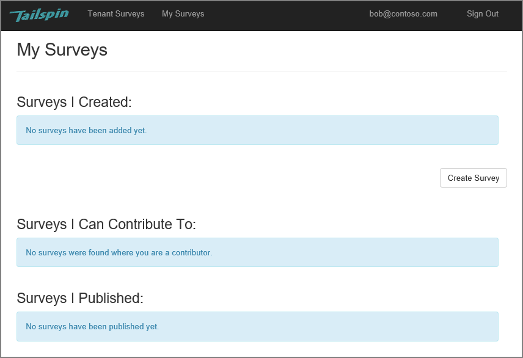
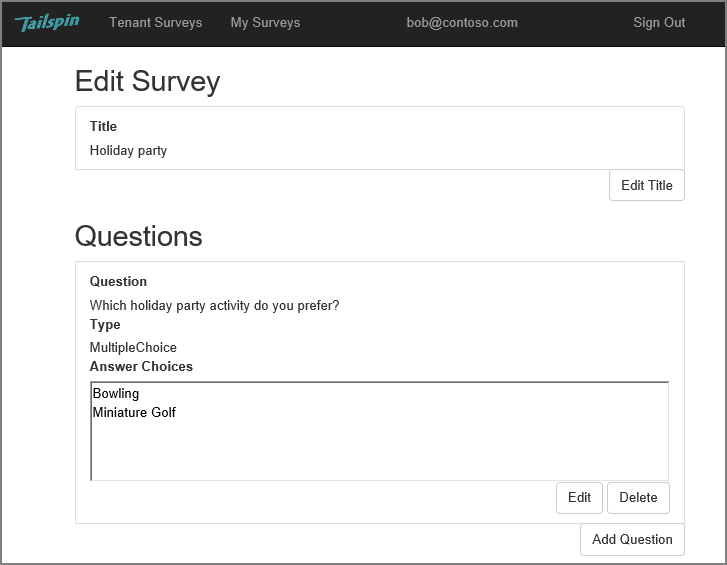
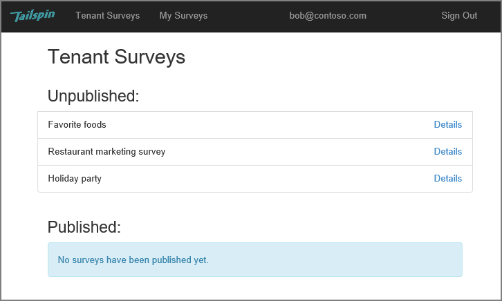
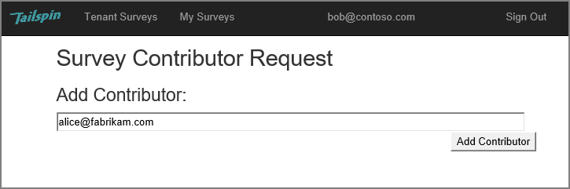
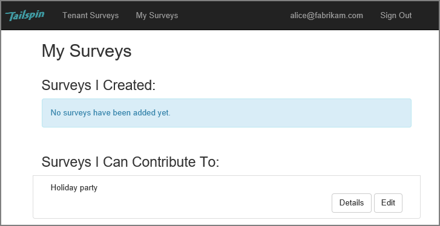
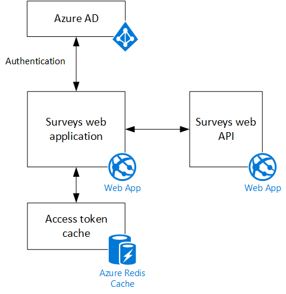

<properties
   pageTitle="About the Tailspin Surveys application | Microsoft Azure"
   description="Tailspin Surveys application overview"
   services=""
   documentationCenter="na"
   authors="MikeWasson"
   manager="roshar"
   editor=""
   tags=""/>

<tags
   ms.service="guidance"
   ms.devlang="dotnet"
   ms.topic="article"
   ms.tgt_pltfrm="na"
   ms.workload="na"
   ms.date="05/23/2016"
   ms.author="mwasson"/>

# About the Tailspin Surveys application

[AZURE.INCLUDE [pnp-header](../../includes/guidance-pnp-header-include.md)]

This article is [part of a series]. There is also a complete [sample application] that accompanies this series.

Tailspin is a fictitious company that is developing a SaaS application named Surveys. This application enables organizations to create and publish online surveys.

- An organization can sign up for the application.
- After the organization is signed up, users can sign into the application with their organizational credentials.
- Users can create, edit, and publish surveys.

> [AZURE.NOTE] To get started with the application, see [Running the Surveys application].

## Users can create, edit, and view surveys

An authenticated user can view all the surveys that he or she has created or has contributor rights to, and create new surveys. Notice that the user is signed in with his organizational identity, `bob@contoso.com`.

This screenshot shows the Edit Survey page:

Users can also view any surveys created by other users within the same tenant.

## Survey owners can invite contributors

When a user creates a survey, he or she can invite other people to be contributors on the survey. Contributors can edit the survey, but cannot delete or publish it.  

A user can add contributors from other tenants, which enables cross-tenant sharing of resources. In this screenshot, Bob (`bob@contoso.com`) is adding Alice (`alice@fabrikam.com`) as a contributor to a survey that Bob created.

When Alice logs in, she sees the survey listed under "Surveys I can contribute to".

Note that Alice signs into her own tenant, not as a guest of the Contoso tenant. Alice has contributor permissions only for that survey &mdash; she cannot view other surveys from the Contoso tenant.

## Architecture

The Surveys application consists of a web front end and a web API backend. Both are implemented using [ASP.NET Core 1.0].

The web application uses Azure Active Directory (Azure AD) to authenticate users. The web application also calls Azure AD to get OAuth 2 access tokens for the Web API. Access tokens are cached in Azure Redis Cache. The cache enables multiple instances to share the same token cache (e.g., in a server farm).

## Next steps

- Read the next article in this series: [Authentication in multitenant apps, using Azure Active Directory and OpenID Connect][authentication]

<!-- Links -->

[authentication]: guidance-multitenant-identity-authenticate.md
[part of a series]: guidance-multitenant-identity.md
[Running the Surveys application]: https://github.com/Azure-Samples/guidance-identity-management-for-multitenant-apps/blob/master/docs/running-the-app.md
[ASP.NET Core 1.0]: https://docs.asp.net/en/latest/
[sample application]: https://github.com/Azure-Samples/guidance-identity-management-for-multitenant-apps
