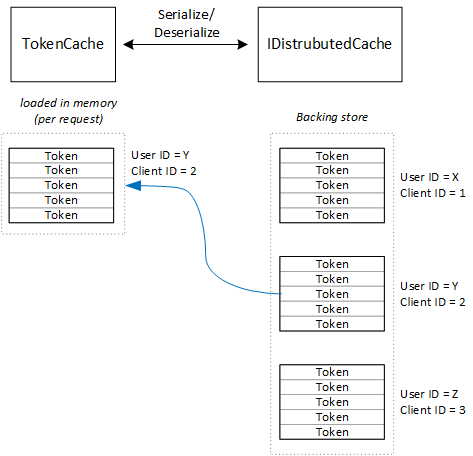

<properties
   pageTitle="Caching acess tokens in a multitenant application | Microsoft Azure"
   description="Caching access tokens used for invoking a backend Web API"
   services=""
   documentationCenter="na"
   authors="MikeWasson"
   manager="roshar"
   editor=""
   tags=""/>

<tags
   ms.service="guidance"
   ms.devlang="dotnet"
   ms.topic="article"
   ms.tgt_pltfrm="na"
   ms.workload="na"
   ms.date="02/16/2016"
   ms.author="mwasson"/>


# Caching access tokens in a multitenant application

[AZURE.INCLUDE [pnp-header](../../includes/guidance-pnp-header-include.md)]

This article is [part of a series]. There is also a complete [sample application] that accompanies this series.

It's relatively expensive to get an OAuth access token, because it requires an HTTP request to the token endpoint. Therefore, it's good to cache tokens whenever possible. The [Azure AD Authentication Library][ADAL] (ADAL)  automatically caches tokens obtained from Azure AD, including refresh tokens.

ADAL provides a default token cache implementation. However, this token cache is intended for native client apps, and is _not_ suitable for web apps:

-	It is a static instance, and not thread safe.
-	It doesn't scale to large numbers of users, because tokens from all users go into the same dictionary.
-	It can't be shared across web servers in a farm.

Instead, you should implement a custom token cache that derives from the ADAL `TokenCache` class but is suitable for a server environment and provides the desirable level of isolation between tokens for different users.

The `TokenCache` class stores a dictionary of tokens, indexed by issuer, resource, client ID, and user. A custom token cache should write this dictionary to a backing store, such as a Redis cache.

In the Tailspin Surveys application, the `DistributedTokenCache` class implements the token cache. This implementation uses the [IDistributedCache][distributed-cache] abstraction from ASP.NET Core 1.0. That way, any `IDistributedCache` implementation can be used as a backing store.

-	By default, the Surveys app uses a Redis cache.
-	For a single-instance web server, you could use the ASP.NET Core 1.0 [in-memory cache][in-memory-cache]. (This is also a good option for running the app locally during development.)

> [AZURE.NOTE] Currently the Redis cache is not supported for .NET Core.

`DistributedTokenCache` stores the cache data as key/value pairs in the backing store. The key is the user ID plus client ID, so the backing store holds separate cache data for each unique combination of user/client.



The backing store is partitioned by user. For each HTTP request, the tokens for that user are read from the backing store and loaded into the `TokenCache` dictionary. If Redis is used as the backing store, every server instance in a server farm reads/writes to the same cache, and this approach scales to many users.

## Encrypting cached tokens

Tokens are sensitive data, because they grant access to a user's resources. (Moreover, unlike a user's password, you can't just store a hash of the token.) Therefore, it's critical to protect tokens from being compromised. The Redis-backed cache is protected by a password, but if someone obtains the password, they could get all of the cached access tokens. For that reason, the `DistributedTokenCache` encrypts everything that it writes to the backing store. Encryption is done using the ASP.NET Core 1.0 [data protection][data-protection] APIs.

> [AZURE.NOTE] If you deploy to Azure Web Sites, the encryption keys are backed up to network storage and synchronized across all machines (see [Key Management][key-management]). By default, keys are not encrypted when running in Azure Web Sites, but you can [enable encryption using an X.509 certificate][x509-cert-encryption].


## DistributedTokenCache implementation

The [DistributedTokenCache][DistributedTokenCache] class derives from the ADAL [TokenCache][tokencache-class] class.

In the constructor, the `DistributedTokenCache` class creates a key for the current user and loads the cache from the backing store:

```csharp
public DistributedTokenCache(
    ClaimsPrincipal claimsPrincipal,
    IDistributedCache distributedCache,
    ILoggerFactory loggerFactory,
    IDataProtectionProvider dataProtectionProvider)
    : base()
{
    _claimsPrincipal = claimsPrincipal;
    _cacheKey = BuildCacheKey(_claimsPrincipal);
    _distributedCache = distributedCache;
    _logger = loggerFactory.CreateLogger<DistributedTokenCache>();
    _protector = dataProtectionProvider.CreateProtector(typeof(DistributedTokenCache).FullName);
    AfterAccess = AfterAccessNotification;
    LoadFromCache();
}
```

The key is created by concatenating the user ID and client ID. Both of these are taken from claims found in the user's `ClaimsPrincipal`:

```csharp
private static string BuildCacheKey(ClaimsPrincipal claimsPrincipal)
{
    string clientId = claimsPrincipal.FindFirstValue("aud", true);
    return string.Format(
        "UserId:{0}::ClientId:{1}",
        claimsPrincipal.GetObjectIdentifierValue(),
        clientId);
}
```

To load the cache data, read the serialized blob from the backing store, and call `TokenCache.Deserialize` to convert the blob into cache data.

```csharp
private void LoadFromCache()
{
    byte[] cacheData = _distributedCache.Get(_cacheKey);
    if (cacheData != null)
    {
        this.Deserialize(_protector.Unprotect(cacheData));
    }
}
```

Whenever ADAL access the cache, it fires an `AfterAccess` event. If the cache data has changed, the `HasStateChanged` property is true. In that case, update the backing store to reflect the change, and then set `HasStateChanged` to false.

```csharp
public void AfterAccessNotification(TokenCacheNotificationArgs args)
{
    if (this.HasStateChanged)
    {
        try
        {
            if (this.Count > 0)
            {
                _distributedCache.Set(_cacheKey, _protector.Protect(this.Serialize()));
            }
            else
            {
                // There are no tokens for this user/client, so remove the item from the cache.
                _distributedCache.Remove(_cacheKey);
            }
            this.HasStateChanged = false;
        }
        catch (Exception exp)
        {
            _logger.WriteToCacheFailed(exp);
            throw;
        }
    }
}
```

TokenCache sends two other events:

- `BeforeWrite`. Called immediately before ADAL writes to the cache. You can use this to implement a concurrency strategy
- `BeforeAccess`. Called immediately before ADAL reads from the cache. Here you can reload the cache to get the latest version.

In our case, we decided not to handle these two events.

- For concurrency, last write wins. That's OK, because tokens are stored independently for each user + client, so a conflict would only happen if the same user had two concurrent login sessions.
- For reading, we load the cache on every request. Requests are short lived. If the cache gets modified in that time, the next request will pick up the new value.

## Next steps

- Read the next article in this series: [Federating with a customer's AD FS for multitenant apps in Azure][adfs]

<!-- links -->
[ADAL]: https://msdn.microsoft.com/library/azure/jj573266.aspx
[adfs]: guidance-multitenant-identity-adfs.md
[data-protection]: https://docs.asp.net/en/latest/security/data-protection/index.html
[distributed-cache]: https://docs.asp.net/en/latest/fundamentals/distributed-cache.html
[DistributedTokenCache]: https://github.com/Azure-Samples/guidance-identity-management-for-multitenant-apps/blob/master/src/Tailspin.Surveys.TokenStorage/DistributedTokenCache.cs
[key-management]: https://docs.asp.net/en/latest/security/data-protection/configuration/default-settings.html
[in-memory-cache]: https://docs.asp.net/en/latest/fundamentals/caching.html
[tokencache-class]: https://msdn.microsoft.com/library/azure/microsoft.identitymodel.clients.activedirectory.tokencache.aspx
[x509-cert-encryption]: https://docs.asp.net/en/latest/security/data-protection/implementation/key-encryption-at-rest.html#x-509-certificate
[part of a series]: guidance-multitenant-identity.md
[sample application]: https://github.com/Azure-Samples/guidance-identity-management-for-multitenant-apps
