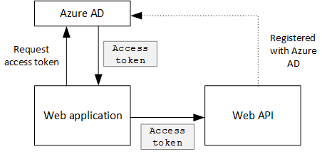
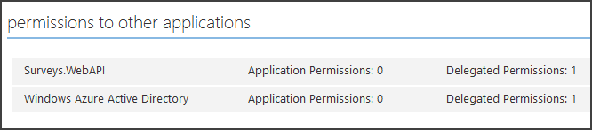

<properties
   pageTitle="Securing a backend web API in a multitenant application | Microsoft Azure"
   description="How to secure a backend web API"
   services=""
   documentationCenter="na"
   authors="MikeWasson"
   manager="roshar"
   editor=""
   tags=""/>

<tags
   ms.service="guidance"
   ms.devlang="dotnet"
   ms.topic="article"
   ms.tgt_pltfrm="na"
   ms.workload="na"
   ms.date="06/02/2016"
   ms.author="mwasson"/>

# Securing a backend web API in a multitenant application

[AZURE.INCLUDE [pnp-header](../../includes/guidance-pnp-header-include.md)]

This article is [part of a series]. There is also a complete [sample application] that accompanies this series.

The [Tailspin Surveys] application uses a backend web API to manage CRUD operations on surveys. For example, when a user clicks "My Surveys", the web application sends an HTTP request to the web API:

```
GET /users/{userId}/surveys
```

The web API returns a JSON object:

```
{
  "Published":[],
  "Own":[
    {"Id":1,"Title":"Survey 1"},
    {"Id":3,"Title":"Survey 3"},
    ],
  "Contribute": [{"Id":8,"Title":"My survey"}]
}
```

The web API does not allow anonymous requests, so the web app must authenticate itself using OAuth 2 bearer tokens.

> [AZURE.NOTE] This is a server-to-server scenario. The application does not make any AJAX calls to the API from the browser client.

There are two main approaches you can take:

- Delegated user identity. The web application authenticates with the user's identity.
- Application identity. The web application authenticates with its client ID, using OAuth2 client credential flow.

The Tailspin application implements delegated user identity. Here are the main differences:

**Delegated user identity**

- The bearer token sent to the web API contains the user identity.
- The web API makes authorization decisions based on the user identity.
- The web application needs to handle 403 (Forbidden) errors from the web API, if the user is not authorized to perform an action.
- Typically, the web application still makes some authorization decisions that affect UI, such as showing or hiding UI elements).
- The web API can potentially be used by untrusted clients, such as a JavaScript application or a native client application.

**Application identity**

- The web API does not get information about the user.
- The web API cannot perform any authorization based on the user identity. All authorization decisions are made by the web application.  
- The web API cannot be used by an untrusted client (JavaScript or native client application).
- This approach may be somewhat simpler to implement, because there is no authorization logic in the Web API.

In either approach, the web application must get an access token, which is the credential needed to call the web API.

- For delegated user identity, the token has to come from the IDP, which can issue a token on behalf of the user.

- For client credentials, an application might get the token from the IDP or host its own token server. (But don't write a token server from scratch; use a well-tested framework like [IdentityServer3].) If you authenticate with Azure AD, it's strongly recommended to get the access token from Azure AD, even with client credential flow.

The rest of this article assumes the application is authenticating with Azure AD.



## Register the web API in Azure AD

In order for Azure AD to issue a bearer token for the web API, you need to configure some things in Azure AD.

1. [Register the web API in Azure AD].

2. Add the client ID of the web app to the web API application manifest, in the `knownClientApplications` property. See [Update the application manifests].

3. [Give the web application permission to call the web API].

  In the Azure Management Portal, you can set two types of permissions: "Application Permissions" for application identity (client credential flow), or "Delegated Permissions" for delegated user identity.

  

## Getting an access token

Before calling the web API, the web application gets an access token from Azure AD. In a .NET application, use the [Azure AD Authentication Library (ADAL) for .NET][ADAL].

In the OAuth 2 authorization code flow, the application exchanges an authorization code for an access token. The following code uses ADAL to get the access token. This code is called during the `AuthorizationCodeReceived` event.

```csharp
// The OpenID Connect middleware sends this event when it gets the authorization code.   
public override async Task AuthorizationCodeReceived(AuthorizationCodeReceivedContext context)
{
    string authorizationCode = context.ProtocolMessage.Code;
    string authority = "https://login.microsoftonline.com/" + tenantID
    string resourceID = "https://tailspin.onmicrosoft.com/surveys.webapi" // App ID URI
    ClientCredential credential = new ClientCredential(clientId, clientSecret);

    AuthenticationContext authContext = new AuthenticationContext(authority, tokenCache);
    AuthenticationResult authResult = await authContext.AcquireTokenByAuthorizationCodeAsync(
        authorizationCode, new Uri(redirectUri), credential, resourceID);

    // If successful, the token is in authResult.AccessToken
}
```

Here are the various parameters that are needed:

- `authority`. Derived from the tenant ID of the signed in user. (Not the tenant ID of the SaaS provider)  
- `authorizationCode`. the auth code that you got back from the IDP.
- `clientId`. The web application's client ID.
- `clientSecret`. The web application's client secret.
- `redirectUri`. The redirect URI that you set for OpenID connect. This is where the IDP calls back with the token.
- `resourceID`. The App ID URI of the web API, which you created when you registered the web API in Azure AD
- `tokenCache`. An object that caches the access tokens. See [Token caching].

If `AcquireTokenByAuthorizationCodeAsync` succeeds, ADAL caches the token. Later, you can get the token from the cache by calling AcquireTokenSilentAsync:

```csharp
AuthenticationContext authContext = new AuthenticationContext(authority, tokenCache);
var result = await authContext.AcquireTokenSilentAsync(resourceID, credential, new UserIdentifier(userId, UserIdentifierType.UniqueId));
```

where `userId` is the user's object ID, which is found in the `http://schemas.microsoft.com/identity/claims/objectidentifier` claim.

## Using the access token to call the web API

Once you have the token, send it in the Authorization header of the HTTP requests to the web API.

```
Authorization: Bearer xxxxxxxxxx
```

The following extension method from the Surveys application sets the Authorization header on an HTTP request, using the **HttpClient** class.

```csharp
public static async Task<HttpResponseMessage> SendRequestWithBearerTokenAsync(this HttpClient httpClient, HttpMethod method, string path, object requestBody, string accessToken, CancellationToken ct)
{
    var request = new HttpRequestMessage(method, path);
    if (requestBody != null)
    {
        var json = JsonConvert.SerializeObject(requestBody, Formatting.None);
        var content = new StringContent(json, Encoding.UTF8, "application/json");
        request.Content = content;
    }

    request.Headers.Authorization = new AuthenticationHeaderValue("Bearer", accessToken);
    request.Headers.Accept.Add(new MediaTypeWithQualityHeaderValue("application/json"));

    var response = await httpClient.SendAsync(request, ct);
    return response;
}
```

> [AZURE.NOTE] See [HttpClientExtensions.cs].

## Authenticating in the web API

The web API has to authenticate the bearer token. In ASP.NET Core 1.0, you can use the [Microsoft.AspNet.Authentication.JwtBearer][JwtBearer] package. This package provides middleware that enables the application to receive OpenID Connect bearer tokens.

Register the middleware in your web API `Startup` class.

```csharp
app.UseJwtBearerAuthentication(options =>
{
    options.Audience = "[app ID URI]";
    options.Authority = "https://login.microsoftonline.com/common/";
    options.TokenValidationParameters = new TokenValidationParameters
    {
        //Instead of validating against a fixed set of known issuers, we perform custom multi-tenant validation logic
        ValidateIssuer = false,
    };
    options.Events = new SurveysJwtBearerEvents();
});
```

> [AZURE.NOTE] See [Startup.cs].

- **Audience**. Set this to the App ID URL for the web API, which you created when you registered the web API with Azure AD.
- **Authority**. For a multitenant application, set this to `https://login.microsoftonline.com/common/`.
- **TokenValidationParameters**. For a multitenant application, set **ValidateIssuer** to false. That means the application will validate the issuer.
- **Events** is a class that derives from **JwtBearerEvents**.

### Issuer validation

Validate the token issuer in the **JwtBearerEvents.ValidatedToken** event. The issuer is sent in the "iss" claim.

In the Surveys application, the web API doesn't handle [tenant sign-up]. Therefore, it just checks if the issuer is already in the application database. If not, it throws an exception, which causes authentication to fail.

```csharp
public override async Task ValidatedToken(ValidatedTokenContext context)
{
    var principal = context.AuthenticationTicket.Principal;
    var tenantManager = context.HttpContext.RequestServices.GetService<TenantManager>();
    var userManager = context.HttpContext.RequestServices.GetService<UserManager>();
    var issuerValue = principal.GetIssuerValue();
    var tenant = await tenantManager.FindByIssuerValueAsync(issuerValue);

    if (tenant == null)
    {
        // the caller was not from a trusted issuer - throw to block the authentication flow
        throw new SecurityTokenValidationException();
    }
}
```

> [AZURE.NOTE] See [SurveysJwtBearerEvents.cs].

You can also use the **ValidatedToken** event to do [claims transformation]. Remember that the claims come directly from Azure AD, so if the web application did any claims transformations, those are not reflected in the bearer token that the web API receives.

## Authorization

For a general discussion of authorization, see [Role-based and resource-based authorization][Authorization]. 

The JwtBearer middleware handles the authorization responses. For example, to restrict a controller action to authenticated users, use the **[Authorize]** atrribute and specify **JwtBearerDefaults.AuthenticationScheme** as the authentication scheme:

```csharp
[Authorize(ActiveAuthenticationSchemes = JwtBearerDefaults.AuthenticationScheme)]
```

This returns a 401 status code if the user is not authenticated.

To restrict a controller action by authorizaton policy, specify the policy name in the **[Authorize]** attribute:

```csharp
[Authorize(Policy = PolicyNames.RequireSurveyCreator)]
```

This returns a 401 status code if the user is not authenticated, and 403 if the user is authenticated but not authorized. Register the policy on startup:

```csharp
public void ConfigureServices(IServiceCollection services)
{
    services.AddAuthorization(options =>
    {
        options.AddPolicy(PolicyNames.RequireSurveyCreator,
            policy =>
            {
                policy.AddRequirements(new SurveyCreatorRequirement());
                policy.AddAuthenticationSchemes(JwtBearerDefaults.AuthenticationScheme);
            });
    });
}
```

## Next steps

- Read the next article in this series: [Caching access tokens in a multitenant application][token cache]

<!-- links -->
[ADAL]: https://msdn.microsoft.com/library/azure/jj573266.aspx
[JwtBearer]: https://www.nuget.org/packages/Microsoft.AspNet.Authentication.JwtBearer
[part of a series]: guidance-multitenant-identity.md
[Tailspin Surveys]: guidance-multitenant-identity-tailspin.md
[IdentityServer3]: https://github.com/IdentityServer/IdentityServer3
[Register the web API in Azure AD]: https://github.com/Azure-Samples/guidance-identity-management-for-multitenant-apps/blob/master/docs/running-the-app.md#register-the-surveys-web-api
[Update the application manifests]: https://github.com/Azure-Samples/guidance-identity-management-for-multitenant-apps/blob/master/docs/running-the-app.md#update-the-application-manifests
[Give the web application permission to call the web API]: https://github.com/Azure-Samples/guidance-identity-management-for-multitenant-apps/blob/master/docs/running-the-app.md#give-the-web-app-permissions-to-call-the-web-api
[Token caching]: guidance-multitenant-identity-token-cache.md
[HttpClientExtensions.cs]: https://github.com/Azure-Samples/guidance-identity-management-for-multitenant-apps/blob/master/src/Tailspin.Surveys.Common/HttpClientExtensions.cs
[Startup.cs]: https://github.com/Azure-Samples/guidance-identity-management-for-multitenant-apps/blob/master/src/Tailspin.Surveys.WebAPI/Startup.cs
[tenant sign-up]: guidance-multitenant-identity-signup.md
[SurveysJwtBearerEvents.cs]: https://github.com/Azure-Samples/guidance-identity-management-for-multitenant-apps/blob/master/src/Tailspin.Surveys.WebAPI/SurveyJwtBearerEvents.cs
[claims transformation]: guidance-multitenant-identity-claims.md#claims-transformations
[Authorization]: guidance-multitenant-identity-authorize.md
[sample application]: https://github.com/Azure-Samples/guidance-identity-management-for-multitenant-apps
[token cache]: guidance-multitenant-identity-token-cache.md
