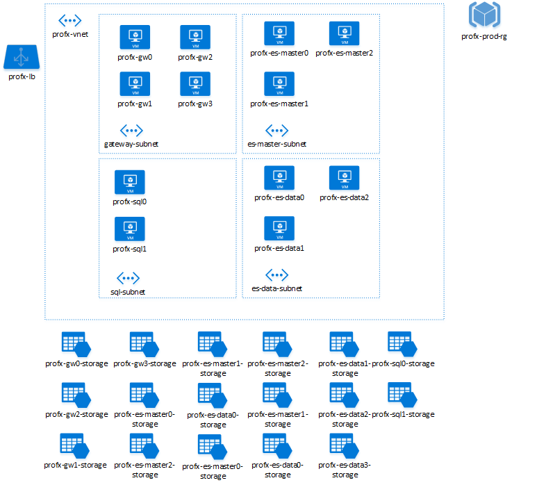

# Naming conventions

The choice of a name for any asset, service or entity in Microsoft Azure is an important choice because:

- It is difficult (though not impossible) to change that name at a later time.
- There are certain constraints and requirements that must be met when choosing a name.
- Good naming conventions can provide "at a glance" context and understanding to how and where a
service fits into the landscape or an application or larger service.

This article provides a summary of the naming rules and restrictions for Azure entities and services,
as well as providing a baseline set of recommendations for naming conventions.  These conventions are
intended to provide a starting point to then customize to the needs and standards of your own 
development process, rather than being strict guidelines.  

Ultimately, the key to success with naming conventions is establishing and following them across 
your applications and organizations, adapting them as you deploy more applications and services
across the Azure platform. 

## Subscriptions

When naming Microsoft Azure subscriptions, verbose names make understanding the context
and purpose of each subscription clear by convention.  When working in an environment which
can contain a number of subscriptions, following a common and shared naming convention across
the company can greatly improve clarity.

One common recommended pattern for naming subscriptions follows the pattern

`<Company> <Department (optional)> <Product Line (optional)> <Environment>`

- Company, in most cases, would be the same for each subscription. However, some companies may have
child companies within the organizational structure. These companies may be managed by a central IT
group, in which case, they could be differentiated by having both the parent company name (*Contoso*)
and child company name (*North Wind*).

- Department is a name within the organization where a group of individuals work. This item within
the namespace as optional. This is because some companies may not need to drill into such detail due
to their size.  

- Product line is a specific name for a product or function that is performed from within the department.
While typically optional for internal-facing services and applications, it is highly recommended to use
for public-facing services that will require easy separation and identification (such as for clear 
separation of billing records).

- Environment is the name that describes the deployment lifecycle of the applications or services,
such as Dev, QA, or Prod.

| Company | Department | Product Line or Service | Environment | Full Name  |
----------| ---------- | ----------------------- | ----------- | ---------- |
| Contoso | SocialGaming | AwesomeService | Production | Contoso SocialGaming AwesomeService Production |
| Contoso | SocialGaming | AwesomeService | Dev | Contoso SocialGaming AwesomeService Dev |
| Contoso | IT | InternalApps | Production | Contoso IT InternalApps Production |
| Contoso | IT | InternalApps | Dev | Contoso IT InternalApps Dev |

## Resource Affixes

When creating certain resources, Microsoft Azure will use some defaults to simplify management of the resources
associated to these resources.  Although this will not present problems, it may be beneficial to identify types of resources that need an affix to identify that type. In addition, clearly specify whether the affix will be at the beginning of the name (prefix) or at the end (suffix).
For instance, here are two possible names for a service hosting a calculation engine:

- SvcCalculationEngine (prefix)
- CalculationEngineSvc (suffix)

Affixes can refer to different aspects that describe the particular resources. The following table
shows some examples typically used.

| Aspect | Example | Notes |
| ------ | ------- | ----- |
| Environment | dev, prod, qa | Identifies the environment for the resource |
| Location | uw (US West), ue (US East) | Identifies the region into which the resource is deployed |
| Instance | 01, 02 | For resources that have more than one named instance (web servers, etc). |
| Product or Service | service | Identifies the product, application or service that the resource supports |
| Role | sql, web, messaging | Identifies the role of the associated resource |

When developing a specific naming convention for your company or project(s), it is importantly to
choose a common set of affixes as well as their position (suffix or prefix).

## Naming Rules and Restrictions

Each resource or service type in Azure enforces a set of naming restrictions and scope; any naming convention
or pattern must adhere to the requisite naming rules and scope.  For example, while the name of a VM maps to a DNS
name (and is thus required to be unique across all of Azure), the name of a VNET is scoped to the Resource Group that
it is created within.

In general, avoid having any special characters (`-` or `_`) as the first or last character in any name, as these will
fail most validation rules.

| Service Group | Service or Entity | Scope | Length | Casing | Valid Characters | Suggested Pattern | Example |
| ------------- | ----------------- | ----- | ------ | ------ | ---------------- | ----------------- | ------- |
| Resource Group | Resource Group | Global | 1-64 | Case insensitive | Alphanumeric, underscore, and hyphen | `<service short name>-<environment>-rg` | `profx-prod-rg` |
| Resource Group | Availability Set | Resource Group | 1-80 | Case insensitive | Alphanumeric, underscore, and hyphen | `<service-short-name>-<context>-as` | `profx-sql-as` |
| General | Tag | Associated Entity | 512 (name), 256 (value) | Case insensitive | Alphanumeric | `"key" : "value"` | `"department" : "Central IT"` |
| Storage | Storage account name | Global | 3-24 | Lower case | Alphanumeric | `<service short name><type><number>` | `awesomegamedata001` |
| Storage | Container name | Storage account | 3-63 |	Lower case | Alphanumeric and dash | `<context>` | `logs` |
| Storage | Blob name | Container | 1-1024 | Case sensitive | Any URL char | `<variable based on blob usage>` | `<variable based on blob usage>` |
| Storage | Queue name | Storage account | 3-63 | Lower case | Alphanumeric and dash | `<service short name>-<context>-<num>` | `awesomeservice-messages-001` |
| Storage | Table name | Storage account | 3-63 |Case insensitive | Alphanumeric | `<service short name>-<context>` | `awesomeservice-logs` |
| Storage | File name | Storage account | 3-63 | Lower case | Alphanumeric | `<variable based on blob usage>` | `<variable based on blob usage>` |
| Networking | Virtual Network (VNet) | Resource Group | 2-80 | Case-insensitive | Alphanumeric, dash, underscore and period | `<service short name>-[section]-vnet` | `profx-vnet` |
| Networking | Subnet | Parent VNet | 2-80 | Case-insensitive | Alphanumeric, underscore, dash, and period | `<role>-subnet` | `gateway-subnet` |
| Networking | Network Interface | TODO | TODO | Case-insensitive | Alphanumeric and dash | TODO | TODO |
| Networking | Network Security Group | TODO | TODO | Case-insensitive | Alphanumeric and dash | TODO | TODO |
| Networking | Network Security Group rule | TODO | TODO | Case-insensitive | Alphanumeric and dash | TODO | TODO |
| Networking | Public IP Address | TODO | TODO | Case-insensitive | Alphanumeric and dash | TODO | TODO
| Networking | Load Balancer | TODO | TODO | Case-insensitive | TODO | TODO | TODO
| Networking | Azure Gateway | TODO | TODO | Case-insensitive | Alphanumeric and dash | TODO | TODO
| Networking | Azure Gateway | TODO | TODO | Case-insensitive | Alphanumeric and dash | TODO | TODO
| Networking | Azure Gateway Connection | TODO | TODO | Case-insensitive | Alphanumeric and dash | TODO | TODO
| Networking | Load Balanced Rules Config | TODO | TODO | Case-insensitive | Alphanumeric and dash | TODO | TODO
| Networking | Traffic Manager Profile | TODO | TODO | Case-insensitive | Alphanumeric and dash | TODO | TODO
 	  
## Azure Resource Manager (ARM) Tagging

Aside from the name of any entity in Azure, the Azure Resource Manager supports tagging entities with arbitary
text strings to identify context and streamline automation.  For example, a tag such as "sql2014ee" could identify 
any VMs in a deployment running SQL Server 2014 Enterprise Edition for the purposes of running an automated script
against them.  Tags should be used to augment and enhance context along side of the naming conventions chosen.

> [AZURE.TIP] One other advantage of tags is that tags span resource groups, allowing you to link and correlate entities across
> disparate deployments.

Each resource or resource group can have a maximum of 15 tags. The tag name is limited to 512 characters, and the tag value is limited to 256 characters.

For more information on resource tagging, please refer to [https://azure.microsoft.com/en-us/documentation/articles/resource-group-using-tags/](https://azure.microsoft.com/en-us/documentation/articles/resource-group-using-tags/).

TODO - example of using tagging

## Tips and Gotchas

### Virtual Machines

Especially in larger topologies, carefully naming virtual machines will greatly streamline identifying the
role and purpose of each machine, as well as enabling more predictable scripting.

> [AZURE.WARNING] Note that every virtual machine in Azure has both an Azure resource name, and an operating
> system host name.  
> If the resource name and host name are different, managing these VMs may be challenging
> (for example, if the virtual machine is created from a .vhd that already contains a 
> configured operating system with a hostname), and should be avoided.

- [Naming conventions for Windows Server VMs](https://support.microsoft.com/en-us/kb/188997)

TODO - recommendations on naming VMs.

###	Storage accounts and storage entities

It possible to configure a custom domain name for accessing blob data in your Azure Storage account.
The default endpoint for the Blob service is `https://mystorage.blob.core.windows.net`.

But if you map a custom domain (such as www.contoso.com) to the blob endpoint for your storage account,
you can also access blob data in your storage account by using that domain. For example, with a custom
domain name, `http://mystorage.blob.core.windows.net/mycontainer/myblob` could be accessed as
`http://www.contoso.com/mycontainer/myblob`.

For more information about configuring this feature, please refer to [http://azure.microsoft.com/en-us/documentation/articles/storage-custom-domain-name
](http://azure.microsoft.com/en-us/documentation/articles/storage-custom-domain-name).

For more information on naming blobs, containers and tables:

- [Naming and Referencing Containers, Blobs, and Metadata](https://msdn.microsoft.com/en-us/library/dd135715.aspx)
- [Naming Queues and Metadata](https://msdn.microsoft.com/en-us/library/dd179349.aspx)
- [Naming Tables](https://msdn.microsoft.com/en-us/library/azure/dd179338.aspx)

A blob name can contain any combination of characters, but reserved URL characters must be properly
escaped. Avoid blob names that end with a period (.), a forward slash (/), or a sequence or combination
of the two. By convention, the forward slash is the **virtual** directory separator. Do not use a backward 
slash (\) in a blob name. The client APIs may allow it, but then fail to hash properly, and the 
signatures will not match.

It is not possible to modify the name of a storage account or container after it has been created.
You must delete it and create a new one if you want to use a new name.

> [AZURE.TIP] We recommend that you establish a naming convention for all storage accounts and types
before embarking on the development of a new service or application.

## Example - Deploying an N-tier service

In this example, we'll define an N-tier service configuration, consisting of front-end
IIS servers (hosted in Windows Server VMs), with SQL Server (hosted in two Windows Server VMs), 
an ElasticSearch cluster (hosted in 6 Linux VMs) and the associated storage accounts,
virtual networks, resource group and load balancer.

We'll start by defining the contextual conventions for this application:

| Entity | Convention | Description  |
| ------ | ---------- | ------------ |  
| Service Name | `profx` | The short name of the application or service being deployed |
| Environment | `prod` | This is for the production deployment (as opposed to qa, test, etc) |

From that baseline we can then map out the conventions for each of the resource types

| Resource Type | Convention Base | Example | 
| ------------- | --------------- | ------- |
| Resource Group | `servicename-rg` | `profx-rg` |
| Virtual Network | `servicename-vnet` | `profx-vnet` |
| Subnet | `role-subnet` | `sql-vnet` |
| Load Balancer | `servicename-lb` | `profx-lb` |
| Virtual Machine | `servicename-role[number]` | `profx-sql0` |
| Storage Account | `vmname-storage` | `profx-sql0-storage` |

As seen in the diagram below:

