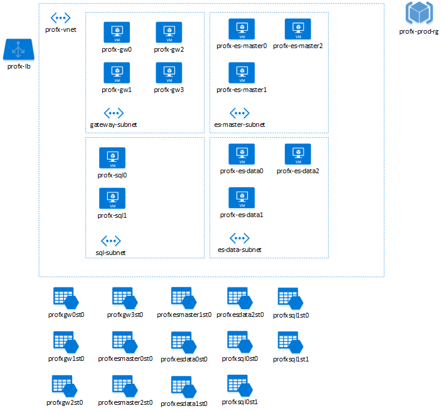

<properties
   pageTitle="Recommended naming conventions for Azure resources | Guidance | Microsoft Azure"
   description="Recommended naming conventions for Azure resources. How to name virtual machines, storage accounts, networks, virtual networks, subnets and other Azure entities"
   services=""
   documentationCenter="na"
   authors="mabsimms"
   manager="marksou"
   editor=""
   tags=""/>

<tags
   ms.service="guidance"
   ms.devlang="na"
   ms.topic="article"
   ms.tgt_pltfrm="na"
   ms.workload="na"
   ms.date="03/01/2016"
   ms.author="masimms"/>
   
# Recommended naming conventions for Azure resources

[AZURE.INCLUDE [pnp-header](../../includes/guidance-pnp-header-include.md)]

The choice of a name for any resource in Microsoft Azure is important because:

- It is difficult to change a name at a later time.
- Names must meet the requirements of their specific resource type.

Likewise, consistent naming conventions make resources easier to locate. They also assist in understanding the role of
a resource in a solution.

This article provides a summary of the naming rules and restrictions for Azure resources,
as well as providing a baseline set of recommendations for naming conventions.  You can use these recommendations 
as a starting point for your own conventions specific to your needs.  

The key to success with naming conventions is establishing and following them across your applications and organizations, 
adapting them as you deploy more applications and services across the Azure platform. 

## Naming Subscriptions

When naming Azure subscriptions, verbose names make understanding the context
and purpose of each subscription clear.  When working in an environment which
can contain a number of subscriptions, following a shared naming convention can greatly improve clarity.

A recommended pattern for naming subscriptions is:

`<Company> <Department (optional)> <Product Line (optional)> <Environment>`

- Company, in most cases, would be the same for each subscription. However, some companies may have
child companies within the organizational structure. These companies may be managed by a central IT
group, in which case, they could be differentiated by having both the parent company name (*Contoso*)
and child company name (*North Wind*).

- Department is a name within the organization where a group of individuals work. This item within
the namespace as optional. This is because some companies may not need to drill into such detail due
to their size.  

- Product line is a specific name for a product or function that is performed from within the department.
While typically optional for internal-facing services and applications, it is highly recommended to use
for public-facing services that will require easy separation and identification (such as for clear 
separation of billing records).

- Environment is the name that describes the deployment lifecycle of the applications or services,
such as Dev, QA, or Prod.

| Company | Department | Product Line or Service | Environment | Full Name  |
----------| ---------- | ----------------------- | ----------- | ---------- |
| Contoso | SocialGaming | AwesomeService | Production | Contoso SocialGaming AwesomeService Production |
| Contoso | SocialGaming | AwesomeService | Dev | Contoso SocialGaming AwesomeService Dev |
| Contoso | IT | InternalApps | Production | Contoso IT InternalApps Production |
| Contoso | IT | InternalApps | Dev | Contoso IT InternalApps Dev |

<!-- TODO; include more information about organizing subscriptions for application deployment, pods, etc -->

## Use Affixes to Avoid Ambiguity

When naming resources in Azure, it is recommended to use common prefixes or suffixes to identify the type and
context of the resource.  While all of the information about type, metadata, context, is available programatically,
leveraging common affixes simplifies visual identification.  When incorporating affixes into your naming convention,
it is important to clearly specify whether the affix will be at the beginning of the name 
(prefix) or at the end (suffix).  

For instance, here are two possible names for a service hosting a calculation engine:

- SvcCalculationEngine (prefix)
- CalculationEngineSvc (suffix)

Affixes can refer to different aspects that describe the particular resources. The following table
shows some examples typically used.

| Aspect | Example | Notes |
| ------ | ------- | ----- |
| Environment | dev, prod, qa | Identifies the environment for the resource |
| Location | uw (US West), ue (US East) | Identifies the region into which the resource is deployed |
| Instance | 01, 02 | For resources that have more than one named instance (web servers, etc). |
| Product or Service | service | Identifies the product, application or service that the resource supports |
| Role | sql, web, messaging | Identifies the role of the associated resource |

When developing a specific naming convention for your company or project(s), it is importantly to
choose a common set of affixes as well as their position (suffix or prefix).

## Naming Rules and Restrictions

Each resource or service type in Azure enforces a set of naming restrictions and scope; any naming convention
or pattern must adhere to the requisite naming rules and scope.  For example, while the name of a VM maps to a DNS
name (and is thus required to be unique across all of Azure), the name of a VNET is scoped to the Resource Group that
it is created within.

In general, avoid having any special characters (`-` or `_`) as the first or last character in any name, as these will
fail most validation rules.

| Category | Service or Entity | Scope | Length | Casing | Valid Characters | Suggested Pattern | Example |
| ------------- | ----------------- | ----- | ------ | ------ | ---------------- | ----------------- | ------- |
| Resource Group | Resource Group | Global | 1-64 | Case insensitive | Alphanumeric, underscore, and hyphen | `<service short name>-<environment>-rg` | `profx-prod-rg` |
| Resource Group | Availability Set | Resource Group | 1-80 | Case insensitive | Alphanumeric, underscore, and hyphen | `<service-short-name>-<context>-as` | `profx-sql-as` |
| General | Tag | Associated Entity | 512 (name), 256 (value) | Case insensitive | Alphanumeric | `"key" : "value"` | `"department" : "Central IT"` |
| Compute | Virtual Machine | Resource Group | 1-15 | Case insensitive | Alphanumeric, underscore, and hyphen | `<name>-<role>-<instance>` | `profx-sql-001` |
| Storage | Storage account name (data) | Global | 3-24 | Lower case | Alphanumeric | `<service short name><type><number>` | `profxdata001` |
| Storage | Storage account name (disks) | Global | 3-24 | Lower case | Alphanumeric | `<vm name without dashes>st<number>` | `profxsql001st0` |
| Storage | Container name | Storage account | 3-63 |	Lower case | Alphanumeric and dash | `<context>` | `logs` |
| Storage | Blob name | Container | 1-1024 | Case sensitive | Any URL char | `<variable based on blob usage>` | `<variable based on blob usage>` |
| Storage | Queue name | Storage account | 3-63 | Lower case | Alphanumeric and dash | `<service short name>-<context>-<num>` | `awesomeservice-messages-001` |
| Storage | Table name | Storage account | 3-63 |Case insensitive | Alphanumeric | `<service short name>-<context>` | `awesomeservice-logs` |
| Storage | File name | Storage account | 3-63 | Lower case | Alphanumeric | `<variable based on blob usage>` | `<variable based on blob usage>` |
| Networking | Virtual Network (VNet) | Resource Group | 2-80 | Case-insensitive | Alphanumeric, dash, underscore and period | `<service short name>-[section]-vnet` | `profx-vnet` |
| Networking | Subnet | Parent VNet | 2-80 | Case-insensitive | Alphanumeric, underscore, dash, and period | `<role>-subnet` | `gateway-subnet` |
| Networking | Network Interface | Resource Group | 1-80 | Case-insensitive | Alphanumeric, dash, underscore and period | `<vmname>-<num>nic` | `profx-sql1-1nic` |
| Networking | Network Security Group | Resource Group | 1-80 | Case-insensitive | Alphanumeric, dash, underscore and period | `<service short name>-<context>-nsg` | `profx-app-nsg` |
| Networking | Network Security Group Rule | Resource Group | 1-80 | Case-insensitive | Alphanumeric, dash, underscore and period | `<descriptive context>` | `sql-allow` |
| Networking | Public IP Address | Resource Group | 1-80 | Case-insensitive | Alphanumeric, dash, underscore and period | `<vm or service name>-pip` | `profx-sql1-pip` |
| Networking | Load Balancer | Resource Group | 1-80 | Case-insensitive | Alphanumeric, dash, underscore and period | `<service or role>-lb` | `profx-lb` |
| Networking | Load Balanced Rules Config | Load Balancer | 1-80 | Case-insensitive | Alphanumeric, dash, underscore and period | `descriptive context` | `http` |

<!-- TODO fill in the rest of these resources
| Networking | Azure Application Gateway | Resource Group | 1-80 | Case-insensitive | Alphanumeric, dash, underscore and period | `<service or role>-aag` | `profx-aag`
| Networking | Azure Application Gateway Connection | Azure Application Gateway | 1-80 | Case-insensitive | Alphanumeric, dash, underscore and period | `` | TODO
| Networking | Traffic Manager Profile | Resource Group | 1-80 | Case-insensitive | Alphanumeric, dash, underscore and period | TODO | TODO
-->

## Organizing Resources with Tags

The Azure Resource Manager supports tagging entities with arbitary
text strings to identify context and streamline automation.  For example, a tag such as `"sqlVersion: "sql2014ee"` could identify 
any VMs in a deployment running SQL Server 2014 Enterprise Edition for the purposes of running an automated script
against them.  Tags should be used to augment and enhance context along side of the naming conventions chosen.

> [AZURE.TIP] One other advantage of tags is that tags span resource groups, allowing you to link and correlate entities across
> disparate deployments.

Each resource or resource group can have a maximum of **15** tags. The tag name is limited to 512 characters, and the tag 
value is limited to 256 characters.

For more information on resource tagging, please refer to [Using tags to organize your Azure resources](../resource-group-using-tags.md).

Some of the common tagging use cases are:

- **Billing**; Grouping resources and associating them with billing or charge back codes.
- **Service Context Identification**; Identify groups of resources across Resource Groups for common operations and grouping
- **Access Control and Security Context**; Administrative role identification based on portfolio, system, service, app, instance, etc… 

> [AZURE.TIP] Tag early - tag often.  Better to have a baseline tagging scheme in place and adjust over time rather than having
> to retrofit after the fact.  

An example of some common tagging approaches:

| Tag Name | Key | Example | Comment |
| -------- | --- | ------- | ------- |
| Bill To / Internal Chargeback ID | billTo  | `IT-Chargeback-1234` | An internal I/O or billing code |
| Operator or Directly Responsible Individual (DRI) | managedBy | `joe@contoso.com`  | Alias or email address |
| Project Name | project-name | `myproject`  | Name of the project or product line |
| Project Version | project-version | `3.4`  | Version of the project or product line |
| Environment | environment | `<Production, Staging, QA >` | Environmental identifier | 
| Tier | tier | `Front End, Back End, Data` | Tier or role/context identification |
| Data Profile | dataProfile | `Public, Confidential, Restricted, Internal` | Sensitivity of data stored in the resource |
 
## Tips and Tricks

Depending on the type of application, certain types of resources may require additional care on naming and 
conventions.  Additional details and context around these are listed below.

### Virtual Machines

Especially in larger topologies, carefully naming virtual machines will greatly streamline identifying the
role and purpose of each machine, as well as enabling more predictable scripting.

> [AZURE.WARNING] Note that every virtual machine in Azure has both an Azure resource name, and an operating
> system host name.  
> If the resource name and host name are different, managing these VMs may be challenging
> (for example, if the virtual machine is created from a .vhd that already contains a 
> configured operating system with a hostname), and should be avoided.

- [Naming conventions for Windows Server VMs](https://support.microsoft.com/en-us/kb/188997)

<!-- TODO - recommendations on naming VMs. -->

###	Storage accounts and storage entities

There are two primary use cases for storage accounts - backing disks for VMs, and storing 
data in blobs, queues and tables.  Storage accounts used for VM disks should follow the naming
convention of associating them with the parent VM name (and with the potential need for multiple 
storage accounts for high-end VM SKUs, also leverage a number suffix).

> [AZURE.TIP] Storage accounts - whether for data or disks - should follow a naming onvention that 
> allows for multiple storage acccounts to be leveraged (i.e. always using a numeric suffix).

It possible to configure a custom domain name for accessing blob data in your Azure Storage account.
The default endpoint for the Blob service is `https://mystorage.blob.core.windows.net`.

But if you map a custom domain (such as www.contoso.com) to the blob endpoint for your storage account,
you can also access blob data in your storage account by using that domain. For example, with a custom
domain name, `http://mystorage.blob.core.windows.net/mycontainer/myblob` could be accessed as
`http://www.contoso.com/mycontainer/myblob`.

For more information about configuring this feature, please refer to [Configure a custom domain name for your Blob storage endpoint](../storage/storage-custom-domain-name.md).

For more information on naming blobs, containers and tables:

- [Naming and Referencing Containers, Blobs, and Metadata](https://msdn.microsoft.com/library/dd135715.aspx)
- [Naming Queues and Metadata](https://msdn.microsoft.com/library/dd179349.aspx)
- [Naming Tables](https://msdn.microsoft.com/library/azure/dd179338.aspx)

A blob name can contain any combination of characters, but reserved URL characters must be properly
escaped. Avoid blob names that end with a period (.), a forward slash (/), or a sequence or combination
of the two. By convention, the forward slash is the **virtual** directory separator. Do not use a backward 
slash (\) in a blob name. The client APIs may allow it, but then fail to hash properly, and the 
signatures will not match.

It is not possible to modify the name of a storage account or container after it has been created.
You must delete it and create a new one if you want to use a new name.

> [AZURE.TIP] We recommend that you establish a naming convention for all storage accounts and types
before embarking on the development of a new service or application.

## Example - Deploying an N-tier service

In this example, we'll define an N-tier service configuration, consisting of front-end
IIS servers (hosted in Windows Server VMs), with SQL Server (hosted in two Windows Server VMs), 
an ElasticSearch cluster (hosted in 6 Linux VMs) and the associated storage accounts,
virtual networks, resource group and load balancer.

We'll start by defining the contextual conventions for this application:

| Entity | Convention | Description  |
| ------ | ---------- | ------------ |  
| Service Name | `profx` | The short name of the application or service being deployed |
| Environment | `prod` | This is for the production deployment (as opposed to qa, test, etc) |

From that baseline we can then map out the conventions for each of the resource types:

| Resource Type | Convention Base | Example |
| ------------- | --------------- | ------- |
| Subscription | `<Company> <Department (optional)> <Product Line (optional)> <Environment>` | `Contoso IT InternalApps Profx Production` |
| Resource Group | `servicename-rg` | `profx-rg` |
| Virtual Network | `servicename-vnet` | `profx-vnet` |
| Subnet | `role-subnet` | `sql-vnet` |
| Load Balancer | `servicename-lb` | `profx-lb` |
| Virtual Machine | `servicename-role[number]` | `profx-sql0` |
| Storage Account | `<vmnamenodashes>st<num>` | `profxsql0st0` |

As seen in the diagram below:



## Sample - Azure CLI script for deploying the sample above

```bash
#!/bin/sh

#####################################################################
# Sample script using the Azure CLI to build out an application 
# demonstrating naming conventions.  
#
# Note; this script is not intended for production deployment, as it does 
# not create availability sets, configure network security rules, etc.
#####################################################################

# Set up variables to build out the naming conventions for deploying
# the cluster  
LOCATION=eastus2
APP_NAME=profx
ENVIRONMENT=prod
USERNAME=testuser
PASSWORD="testpass"

# Set up the tags to associate with items in the application
TAG_BILLTO="InternalApp-ProFX-12345"
TAGS="billTo=${TAG_BILLTO}"

# Explicitly set the subscription to avoid confusion as to which subscription
# is active/default
SUBSCRIPTION=3e9c25fc-55b3-4837-9bba-02b6eb204331

# Set up the names of things using recommended conventions
RESOURCE_GROUP="${APP_NAME}-${ENVIRONMENT}-rg"
VNET_NAME="${APP_NAME}-vnet"

# Set up the postfix variables attached to most CLI commands
POSTFIX="--resource-group ${RESOURCE_GROUP} --location ${LOCATION} --subscription ${SUBSCRIPTION}"

##########################################################################################
# Set up the VM conventions for Linux and Windows images

# For Windows, get the list of URN's via 
# azure vm image list ${LOCATION} MicrosoftWindowsServer WindowsServer 2012-R2-Datacenter
WINDOWS_BASE_IMAGE=MicrosoftWindowsServer:WindowsServer:2012-R2-Datacenter:4.0.20160126

# For Linux, get the list or URN's via 
# azure vm image list ${LOCATION} canonical ubuntuserver
LINUX_BASE_IMAGE=canonical:ubuntuserver:16.04.0-DAILY-LTS:16.04.201602130

#########################################################################################
## Define functions 
create_vm ()
{
    vm_name=$1
    vnet_name=$2
    subnet_name=$3
    os_type=$4
    vhd_path=$5
    vm_size=$6
    diagnostics_storage=$7

	# Create the network interface card for this VM
	azure network nic create --name "${vm_name}-0nic" --subnet-name ${subnet_name} --subnet-vnet-name ${vnet_name} \
        --tags="${TAGS}" ${POSTFIX}

	# Create the storage account for this vm's disks (premium locally redundant storage -> PLRS)
    # Note the ${var//-/} syntax to remove dashes from the vm name
    storage_account_name=${vm_name//-/}st01
	azure storage account create --type=PLRS --tags "${TAGS}" ${POSTFIX} "${storage_account_name}"

    # Map the name of the diagnostics storage account to a blob URI for boot diagnostics
    # This is (currently) required when deploying with a named premium storage account 
    diag_blob="https://${diagnostics_storage}.blob.core.windows.net/"

    # Create the VM
    azure vm create --name ${vm_name} --nic-name "${vm_name}-0nic" --os-type ${os_type} \
        --image-urn ${vhd_path} --vm-size ${vm_size} --vnet-name ${vnet_name} --vnet-subnet-name ${subnet_name} \
        --storage-account-name "${storage_account_name}" --storage-account-container-name vhds --os-disk-vhd "${vm_name}-osdisk.vhd" \
        --admin-username "${USERNAME}" --admin-password "${PASSWORD}" \
		--boot-diagnostics-storage-uri "${diag_blob}" \
        --tags="${TAGS}" ${POSTFIX} 
}

###################################################################################################
# Create resources

# Step 1 - create the enclosing resource group
azure group create --name "${RESOURCE_GROUP}" --location "${LOCATION}" --tags "${TAGS}" --subscription "${SUBSCRIPTION}"

# Step 2 - create the network security groups

# Step 3 - create the networks (VNet and subnets)
azure network vnet create --name "${VNET_NAME}" --address-prefixes="10.0.0.0/8" --tags "${TAGS}" ${POSTFIX}
# TODO - does subnet support tagging?
azure network vnet subnet create --name gateway-subnet --vnet-name "${VNET_NAME}" --address-prefix="10.0.1.0/24" --resource-group "${RESOURCE_GROUP}" --subscription ${SUBSCRIPTION}
azure network vnet subnet create --name es-master-subnet --vnet-name "${VNET_NAME}" --address-prefix="10.0.2.0/24" --resource-group "${RESOURCE_GROUP}" --subscription ${SUBSCRIPTION}
azure network vnet subnet create --name es-data-subnet --vnet-name "${VNET_NAME}" --address-prefix="10.0.3.0/24" --resource-group "${RESOURCE_GROUP}" --subscription ${SUBSCRIPTION}
azure network vnet subnet create --name sql-subnet --vnet-name "${VNET_NAME}" --address-prefix="10.0.4.0/24" --resource-group "${RESOURCE_GROUP}" --subscription ${SUBSCRIPTION}

# Step 4 - define the load balancer and network security rules
azure network lb create --name "${APP_NAME}-lb" ${POSTFIX}
# In a production deployment script, we'd create load balancer rules and 
# network security groups here

# Step 5 - create a diagnostics storage account
diagnostics_storage_account=${APP_NAME//-/}diag
azure storage account create --type=LRS --tags "${TAGS}" ${POSTFIX} "${diagnostics_storage_account}"

# Step 6.1 - Create the gateway VMs
for i in `seq 1 4`;
do
	create_vm "${APP_NAME}-gw${i}" "${APP_NAME}-vnet" "gateway-subnet" "Windows" "${WINDOWS_BASE_IMAGE}" "Standard_DS1" "${diagnostics_storage_account}" 
done    

# Step 6.2 - Create the ElasticSearch master and data VMs
for i in `seq 1 3`;
do
    create_vm "${APP_NAME}-es-master${i}" "${APP_NAME}-vnet" "es-master-subnet" "Linux" "${LINUX_BASE_IMAGE}" "Standard_DS1" "${diagnostics_storage_account}"
done
for i in `seq 1 3`;
do
    create_vm "${APP_NAME}-es-data${i}" "${APP_NAME}-vnet" "es-data-subnet" "Linux" "${LINUX_BASE_IMAGE}" "Standard_DS1" "${diagnostics_storage_account}"
done

# Step 6.3 - Create the SQL VMs
create_vm "${APP_NAME}-sql0" "${APP_NAME}-vnet" "sql-subnet" "Windows" "${WINDOWS_BASE_IMAGE}" "Standard_DS1" "${diagnostics_storage_account}"
create_vm "${APP_NAME}-sql1" "${APP_NAME}-vnet" "sql-subnet" "Windows" "${WINDOWS_BASE_IMAGE}" "Standard_DS1" "${diagnostics_storage_account}"
```
