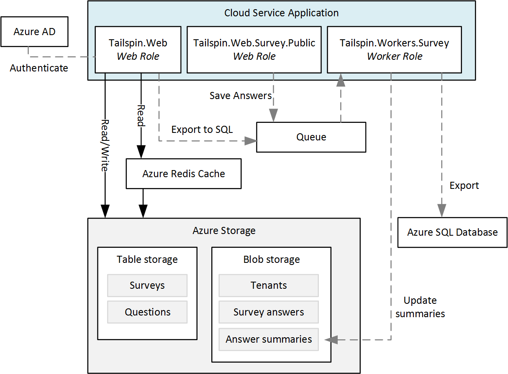
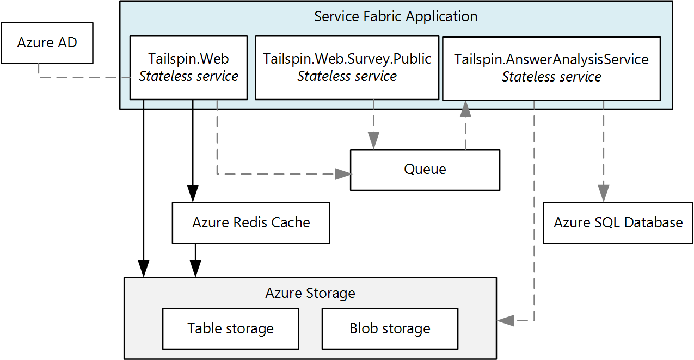
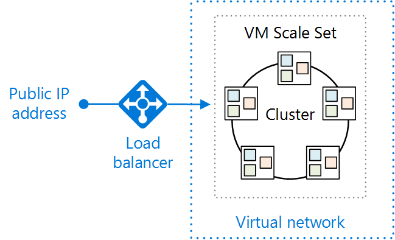
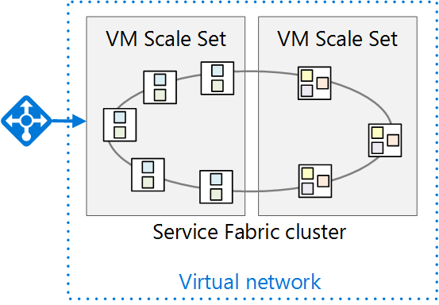

# Migrating an Azure Cloud Services application to Azure Service Fabric 

This article describes migrating an application from Azure Cloud Services to Azure Service Fabric. It focuses on architectural decisions and recommended practices. 

For this project, we started with a Cloud Services application called Surveys and ported it to Service Fabric. The goal was to migrate the application with as few changes as possible. In a later article, we will optimize the application for Service Fabric by adopting a microservices architecture.

Before reading this article, it will be useful to understand the basics of Service Fabric and microservices architectures in general. See the following articles:

- [Overview of Azure Service Fabric][sf-overview]
- [Why a microservices approach to building applications?][sf-why-microservices]


## About the Surveys application

In 2012, the patterns & practices group created an application called Surveys, for a book called [Developing Multi-tenant Applications for the Cloud][tailspin-book]. The book describes a fictitious company named Tailspin that designs and implements the Surveys application.

Surveys is a multitenant application that allows customers to create surveys. After a customer signs up for the application,  members of the customer's organization can create and publish surveys, and collect the results for analysis. The application includes a public website where people can take a survey. Read more about the original Tailspin scenario [here][tailspin-scenario].

Now Tailspin wants to move the Surveys application to a microservices architecture, using Service Fabric running on Azure. Because the application is already deployed as a Cloud Services application, Tailspin adopts a multi-phase approach:

1.	Port the cloud services to Service Fabric, while minimizing changes to the application.
2.	Optimize the application for Service Fabric, by moving to a microservices architecture.

This article describes the first phase. A later article will describe the second phase. In a real-world project, it's likely that both stages would overlap. While porting to Service Fabric, you would also start to re-architect the application into micro-services. Later you might refine the architecture further, perhaps dividing coarse-grained services into smaller services.  

The application code is available on [GitHub](https://github.com/mspnp/ServiceFabricGuidance). This repo contains both the Cloud Services application and the Service Fabric version. 

> The cloud service is an updated version of the original application from the *Developing Multi-tenant Applications* book.

## Why Microservices?

An in-depth discussion of microservices is beyond scope of this article, but here are some of the benefits that Tailspin hopes to get by moving to a microservices architecture:

- **Application upgrades**. Services can be deployed independently, so you can take an incremental approach to upgrading an application.
- **Resiliency and fault isolation**. If a service fails, other services continue to run.
- **Scalability**. Services can be scaled independently.
- **Flexibility**. Services are designed around business scenarios, not technology stacks, making it easier to migrate services to new technologies, frameworks, or data stores.
- **Agile development**. Individual services have less code than a monolithic application, making the code base easier to understand, reason about, and test.
- **Small, focused teams**. Because the application is broken down into many small services, each service can be built by a small focused team.


## Why Service Fabric?
      
Service Fabric is a good fit for a microservices architecture, because most of the features needed in a distributed system are built into Service Fabric, including:

- **Cluster management**. Service Fabric automatically handles node failover, health monitoring, and other cluster management function.
- **Horizontal scaling**. When you add nodes to a Service Fabric cluster, the application automatically scales, as services are distributed across the new nodes.
- **Service discovery**. Service Fabric provides a discovery service that can resolve the endpoint for a named service.
- **Stateless and stateful services**. Stateful services use [reliable collections][sf-reliable-collections], which can take the place of a cache or queue, and can be partitioned.
- **Application lifecycle management**. Services can be upgraded independently and without application downtime.
- **Service orchestration** across a cluster of machines.
- **Higher density** for optimizing resource consumption. A single node can host multiple services.

Service Fabric is used by various Microsoft services, including Azure SQL Database, DocumentDB, Azure Event Hubs, and others, making it a proven platform for building distributed cloud applications. 

## Comparing Cloud Services with Service Fabric

The following table summarizes some of the important differences between Cloud Services and Service Fabric applications. For a more in-depth discussion, see [Learn about the differences between Cloud Services and Service Fabric before migrating applications][sf-compare-cloud-services].

|        | Cloud Services | Service Fabric |
|--------|---------------|----------------|
| Application composition | Roles| Services |
| Density |One role instance per VM | Multiple services in a single node |
| Minimum number of nodes | 2 per role | 5 per cluster, for production deployments |
| State management | Stateless | Stateless or stateful* |
| Hosting | Azure | Cloud or on-premises |
| Web hosting | IIS** | Self-hosting |
| Deployment model | [Classic deployment model][azure-deployment-models] | [Resource Manager][azure-deployment-models]  |
| Packaging | Cloud service package files (.cspkg) | Application and service packages |
| Application update | VIP swap or rolling update | Rolling update |
| Auto-scaling | [Built-in service][cloud-service-autoscale] | VM Scale Sets for auto scale out |
| Debugging | Local emulator | Local cluster |


\* Stateful services use [reliable collections][sf-reliable-collections] to store state across replicas, so that all reads are local to the nodes in the cluster. Writes are replicated across nodes for reliability. Stateless services can have external state, using a database or other external storage.

** Worker roles can also self-host ASP.NET Web API using OWIN.

## The Surveys application on Cloud Services

The following diagram shows the architecture of the Surveys application running on Cloud Services. 



The application consists of two web roles and a worker role.

- The **Tailspin.Web** web role hosts an ASP.NET website that Tailspin customers use to create and manage surveys. Customers also use this website to sign up for the application and manage their subscriptions. Finally, Tailspin administrators can use it to see the list of tenants and manage tenant data. 

- The **Tailspin.Web.Survey.Public** web role hosts an ASP.NET website where people can take the surveys that Tailspin customers publish. 

- The **Tailspin.Workers.Survey** worker role does background processing. The web roles put work items onto a queue, and the worker role processes the items. Two background tasks are defined: Exporting survey answers to Azure SQL Database, and calculating statistics for survey answers.

In addition to Cloud Services, the Surveys application uses some other Azure services:

- **Azure Storage** to store surveys, surveys answers, and tenant information.

- **Azure Redis Cache** to cache some of the data that is stored in Azure Storage, for faster read access. 

- **Azure Active Directory** (Azure AD) to authenticate customers and Tailspin administrators.

- **Azure SQL Database** to store the survey answers for analysis. 

## Moving to Service Fabric

As mentioned, the goal of this phase was migrating to Service Fabric with the minimum necessary changes. To that end, we created stateless services corresponding to each cloud service role in the original application:



Intentionally, this architecture is very similar to the original application. However, the diagram hides some important differences. In the rest of this article, we'll explore those differences. 


## Converting the cloud service roles to services

As mentioned, we migrated each cloud service role to a Service Fabric service. Because cloud service roles are stateless, for this phase it made sense to create stateless services in Service Fabric. 

For the migration, we followed the steps outlined in [Guide to converting Web and Worker Roles to Service Fabric stateless services][sf-migration]. 

### Creating the web front-end services

In Service Fabric, a service runs inside a process created by the Service Fabric runtime. For a web front end, that means the service is not running inside IIS. Instead, the service must host a web server. This approach is called *self-hosting*, because the code that runs inside the process acts as the web server host. 

The requirement to self-host means that a Service Fabric service can't use ASP.NET MVC or ASP.NET Web Forms, because those frameworks require IIS and do not support self-hosting. Options for self-hosting include:

- [ASP.NET Core][aspnet-core], self-hosted using the [Kestrel][kestrel] web server. 
- [ASP.NET Web API][aspnet-webapi], self-hosted using [OWIN][owin].
- Third-party frameworks such as [Nancy](http://nancyfx.org/).

The original Surveys application uses ASP.NET MVC. Because ASP.NET MVC cannot be self-hosted in Service Fabric, we considered the following migration options:

- Port the web roles to ASP.NET Core, which can be self-hosted.
- Convert the web site into a single-page application (SPA) that calls a web API implemented using ASP.NET Web API. This would have required a complete redesign of the web front end.
- Keep the existing ASP.NET MVC code and deploy IIS in a Windows Server container to Service Fabric. This approach would require little or no code change. However, [container support][sf-containers] in Service Fabric is currently still in preview.

Based on these considerations, we selected the first option, porting to ASP.NET Core. To do so, we followed the steps described in [Migrating From ASP.NET MVC to ASP.NET Core MVC][aspnet-migration]. 

> [!NOTE]
> When using ASP.NET Core with Kestrel, you should place a reverse proxy in front of Kestrel to handle traffic from the Internet, for security reasons. For more information, see [Kestrel web server implementation in ASP.NET Core][kestrel]. The section [Deploying the application](#deploying-the-application) describes a recommended Azure deployment.

### HTTP listeners

In Cloud Services, a web or worker role exposes an HTTP endpoint by declaring it in the [service definition file][cloud-service-endpoints]. A web role must have at least one endpoint.

```xml
<!-- Cloud service endpoint -->
<Endpoints>
    <InputEndpoint name="HttpIn" protocol="http" port="80" />
</Endpoints>
```

Similarly, Service Fabric endpoints are declared in a service manifest: 

```xml
<!-- Service Fabric endpoint -->
<Endpoints>
    <Endpoint Protocol="http" Name="ServiceEndpoint" Type="Input" Port="8002" />
</Endpoints>
```

Unlike a cloud service role, however, Service Fabric services can be co-located within the same node. Therefore, every service must listen on a distinct port. Later in this article, we'll discuss how client requests on port 80 or port 443 get routed to the correct port for the service.

A service must explicitly create listeners for each endpoint. The reason is that Service Fabric is agnostic about communication stacks. For more information, see [Build a web service front end for your application using ASP.NET Core][sf-aspnet-core].

## Packaging and configuration

 A cloud service contains the following configuration and package files:

| File | Description |
|------|-------------|
| Service definition (.csdef) | Settings used by Azure to configure the cloud service. Defines the roles, endpoints, startup tasks, and the names of configuration settings. |
| Service configuration (.cscfg) | Per-deployment settings, including the number of role instances, endpoint port numbers, and the values of configuration settings. 
| Service package (.cspkg) | Contains the application code and configurations, and the service definition file.  |

There is one .csdef file for the entire application. You can have multiple .cscfg files for different environments, such as local, test, or production. When the service is running, you can update the .cscfg but not the .csdef. For more information, see [What is the Cloud Service model and how do I package it?][cloud-service-config]

Service Fabric has a similar division between a service *definition* and service *settings*, but the structure is more granular. To understand Service Fabric's configuration model, it helps to understand how a Service Fabric application is packaged. Here is the structure:

```
Application package
  - Service packages
    - Code package
    - Configuration package
    - Data package (optional)
```

The application package is what you deploy. It contains one or more service packages. A service package contains code, configuration, and data packages. The code package contains the binaries for the services, and the configuration package contains configuration settings. This model allows you to upgrade individual services without redeploying the entire application. It also lets you update just the configuration settings, without redeploying the code or restarting the service.

A Service Fabric application contains the following configuration files:

| File | Location | Description |
|------|----------|-------------|
| ApplicationManifest.xml | Application package | Defines the services that compose the application. |
| ServiceManifest.xml | Service package| Describes one or more services. |
| Settings.xml | Configuration package | Contains configuration settings for the services defined in the service package. |

For more information, see [Model an application in Service Fabric][sf-application-model].

To support different configuration settings for multiple environments, use the following approach, described in [Manage application parameters for multiple environments][sf-multiple-environments]:

1. Define the setting in the Setting.xml file for the service.
2. In the application manifest, define an override for the setting.
3. Put environment-specific settings into application parameter files.


## Deploying the application

Whereas Azure Cloud Services is a managed service, Service Fabric is a runtime. You can create Service Fabric clusters in many environments, including Azure and on premises. In this article, we focus on deploying to Azure. 

The following diagram shows a recommended deployment:



The Service Fabric cluster is deployed to a [VM scale set][vm-scale-sets]. Scale sets are an Azure Compute resource that can be used to deploy and manage a set of identical VMs. 

As mentioned, the Kestrel web server requires a reverse proxy for security reasons. This diagram shows [Azure Application Gateway][application-gateway], which is an Azure service that offers various layer 7 load balancing capabilities. It acts as a reverse-proxy service, terminating the client connection and forwarding requests to back-end endpoints. You might use a different reverse proxy solution, such as nginx.  

### Layer 7 routing

In the [original Surveys application](https://msdn.microsoft.com/en-us/library/hh534477.aspx#sec21), one web role listened on port 80, and the other web role listened on port 443. 

| Public site | Survey management site |
|-------------|------------------------|
| `http://tailspin.cloudapp.net` | `https://tailspin.cloudapp.net` |

Another option is to use layer 7 routing. In this approach, different URL paths get routed to different port numbers on the back end. For example, the public site might use URL paths starting with `/public/`. 

Options for layer 7 routing include:

- Use Application Gateway. 

- Use a network virtual appliance (NVA), such as nginx.

- Write a custom gateway as a stateless service.

Consider this approach if you have two or more services with public HTTP endpoints, but want them to appear as one site with a single domain name.

> One approach that we *don't* recommend is allowing external clients to send requests through the Service Fabric [reverse proxy][sf-reverse-proxy]. Although this is possible, the reverse proxy is intended for service-to-service communication. Opening it to external clients exposes *any* service running in the cluster that has an HTTP endpoint.

### Node types and placement constraints

In the deployment shown above, all the services run on all the nodes. However, you can also group services, so that certain services run only on particular nodes within the cluster. Reasons to use this approach include:

- Run some services on different VM types. For example, some services might be compute-intensive or require GPUs. You can have a mix of VM types in your Service Fabric cluster.
- Isolate front-end services from back-end services, for security reasons. All the front-end services will run on one set of nodes, and the back-end services will run on different nodes in the same cluster.
- Different scale requirements. Some services might need to run on more nodes than other services. For example, if you define front-end nodes and back-end nodes, each set can be scaled independently.

The following diagram shows a cluster that separates front-end and back-end services:



To implement this approach:

1.	When you create the cluster, define two or more node types. 
2.	For each service, use [placement constraints][sf-placement-constraints] to assign the service to a node type.

When you deploy to Azure, each node type is deployed to a separate VM scale set. The 
Service Fabric cluster spans all node types. For more information, see [The relationship between Service Fabric node types and Virtual Machine Scale Sets][sf-node-types].

> If a cluster has multiple node types, one node type is designated as the *primary* node type. Service Fabric runtime services, such as the Cluster Management Service, run on the primary node type. Provision at least 5 nodes for the primary node type in a production environment. The other node type should have at least 2 nodes.

## Configuring and managing the cluster

Clusters must be secured to prevent unauthorized users from connecting to your cluster. It is recommended to use Azure AD to authenticate clients, and X.509 certificates for node-to-node security. For more information, see [Service Fabric cluster security scenarios][sf-security].

To configure a public HTTPS endpoint, see [Specify resources in a service manifest][sf-manifest-resources].

You can scale out the application by adding VMs to the cluster. VM scale sets support auto-scaling using auto-scale rules based on performance counters. For more information, see [Scale a Service Fabric cluster in or out using auto-scale rules][sf-auto-scale].

While the cluster is running, you should collect logs from all the nodes in a central location. For more information, see [Collect logs by using Azure Diagnostics][sf-logs].   


## Conclusion

Porting the Surveys application to Service Fabric was fairly straightforward. To summarize, we did the following:

- Converted the roles to stateless services.
- Converted the web front ends to ASP.NET Core.
- Changed the packaging and configuration files to the Service Fabric model.

In addition, the deployment changed from Cloud Services to a Service Fabric cluster running in a VM Scale Set.

However, at this point the application does not get all the benefits of microservices, such as independent service deployment and versioning. To take full advantage of Service Fabric, Tailspin needs to optimize a bit further. That will be the subject of another article.


<!-- links -->

[application-gateway]: /azure/application-gateway/
[aspnet-core]: /aspnet/core/
[aspnet-webapi]: https://www.asp.net/web-api
[aspnet-migration]: /aspnet/core/migration/mvc
[aspnet-hosting]: /aspnet/core/fundamentals/hosting
[aspnet-webapi]: https://www.asp.net/web-api
[azure-deployment-models]: /azure/azure-resource-manager/resource-manager-deployment-model
[cloud-service-autoscale]: /azure/cloud-services/cloud-services-how-to-scale-portal
[cloud-service-config]: /azure/cloud-services/cloud-services-model-and-package
[cloud-service-endpoints]: /azure/cloud-services/cloud-services-enable-communication-role-instances#worker-roles-vs-web-roles
[kestrel]: https://docs.microsoft.com/aspnet/core/fundamentals/servers/kestrel
[lb-probes]: /azure/load-balancer/load-balancer-custom-probe-overview
[owin]: https://www.asp.net/aspnet/overview/owin-and-katana
[sf-application-model]: /azure/service-fabric/service-fabric-application-model
[sf-aspnet-core]: /azure/service-fabric/service-fabric-add-a-web-frontend
[sf-auto-scale]: /azure/service-fabric/service-fabric-cluster-scale-up-down
[sf-compare-cloud-services]: /azure/service-fabric/service-fabric-cloud-services-migration-differences
[sf-connect-and-communicate]: /azure/service-fabric/service-fabric-connect-and-communicate-with-services
[sf-containers]: /azure/service-fabric/service-fabric-containers-overview
[sf-logs]: /azure/service-fabric/service-fabric-diagnostics-how-to-setup-wad
[sf-manifest-resources]: /azure/service-fabric/service-fabric-service-manifest-resources
[sf-migration]: /azure/service-fabric/service-fabric-cloud-services-migration-worker-role-stateless-service
[sf-multiple-environments]: /azure/service-fabric/service-fabric-manage-multiple-environment-app-configuration
[sf-node-types]: /azure/service-fabric/service-fabric-cluster-nodetypes
[sf-overview]: /azure/service-fabric/service-fabric-overview
[sf-placement-constraints]: /azure/service-fabric/service-fabric-cluster-resource-manager-cluster-description
[sf-reliable-collections]: /azure/service-fabric/service-fabric-reliable-services-reliable-collections
[sf-reliable-services]: /azure/service-fabric/service-fabric-reliable-services-introduction
[sf-reverse-proxy]: /azure/service-fabric/service-fabric-reverseproxy
[sf-security]: /azure/service-fabric/service-fabric-cluster-security
[sf-why-microservices]: /azure/service-fabric/service-fabric-overview-microservices
[tailspin-book]: https://msdn.microsoft.com/en-us/library/ff966499.aspx
[tailspin-scenario]: https://msdn.microsoft.com/en-us/library/hh534482.aspx
[unity]: https://msdn.microsoft.com/en-us/library/ff647202.aspx
[vm-scale-sets]: /azure/virtual-machine-scale-sets/virtual-machine-scale-sets-overview
