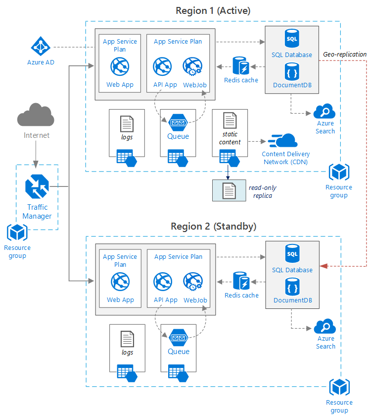

<properties
   pageTitle="Web application with high availability | Azure reference architecture | Microsoft Azure"
   description="Recommended architecture for web application with high availability, running in Microsoft Azure."
   services="app-service,app-service\web,sql-database" 
   documentationCenter="na"
   authors="mikewasson"
   manager="roshar"
   editor=""
   tags=""/>

<tags
   ms.service="guidance"
   ms.devlang="na"
   ms.topic="article"
   ms.tgt_pltfrm="na"
   ms.workload="na"
   ms.date="06/27/2016"
   ms.author="mikewasson"/>

# Azure reference architecture: Web application with high availability

[AZURE.INCLUDE [pnp-RA-branding](../../includes/guidance-pnp-header-include.md)]

This article shows a recommended architecture for a web application with high availability, running on Microsoft Azure. The architecture builds on [Azure reference architecture: Improving scalability in a web application][guidance-web-apps-scalability].

## Architecture diagram



This architecture builds on the one shown in [Improving scalability in a web application][guidance-web-apps-scalability]. The main differences are:

- **Primary and secondary regions**. This architecture uses two regions to achieve higher availability. The application is deployed to each regions. During normal operations, network traffic is routed to the primary region. But if that becomes unavailable, traffic is routed to the secondary region. For details about failover, see [Managing failover](#managing-failover-and-failback).

- **Azure Traffic Manager**. [Traffic Manager][traffic-manager] routes incoming requests to the primary region. If the application running that region becomes unavailable, Traffic Manager fails over to the secondary region. 

- **Geo-replication** of SQL Database and DocumentDB.

## Recommendations

### Regional pairing

Each Azure region is paired with another region within the same geography. In general, choose regions from the same regional pair (for example, East US 2 and Central US). Benefits of doing so include:

- If there is a broad outage, recovery of at least one region out of every pair is prioritized.
- Planned Azure system updates are rolled out to paired regions sequentially, to minimize possible downtime.
- In most cases, pairs reside within the same geography, to meet data residency requirements.

However, make sure that both regions support all of the Azure services needed for your application. See [Services by region][services-by-region]. For more information about regional pairs, see [Business continuity and disaster recovery (BCDR): Azure Paired Regions][regional-pairs].

### Resource groups

Consider placing the primary region, secondary region, and Traffic Manager into separate [resource groups][resource groups]. This lets you manage the resources deployed to each region as a single collection &mdash; you can deploy them separately, delete the deployment, and so forth. 

### Traffic Manager

**Routing.** Traffic Manager supports several [routing algorithms][tm-routing]. For the scenario described in this article, use _priority_ routing (formerly called _failover_ routing). With this setting, Traffic Manager sends all requests to the primary region, unless the endpoint for that region becomes unreachable. At that point, it automatically fails over to the secondary region. See [Configure Failover routing method][tm-configure-failover].

**Health probe.** Traffic Manager uses an HTTP (or HTTPS) probe to monitor the availability of each endpoint. The probe gives Traffic Manager a pass/fail test for failing over to the secondary region. It works by sending a request to a specified URL path. If it gets a non-200 response within a timeout period, the probe fails. After four failed requests, Traffic Manager marks the endpoint as degraded and fails over to the other endpoint. For details, see [Traffic Manager endpoint monitoring and failover][tm-monitoring].

As a best practice, create a health probe endpoint that reports the overall health of the application, and use this endpoint for the health probe. The endpoint should check critical dependencies such as the App Service apps, Storage queue, and SQL Database. Otherwise, the probe might report a "healthy" endpoint when critical parts of the application are actually failing. 

On the other hand, don't use the health probe to check lower priority services. For example, if an email service goes down, the application can switch to a second provider or just send emails later. The application probably shouldn't fail over in that situation. For more information, see [Health Endpoint Monitoring Pattern][health-endpoint-monitoring-pattern].
  
### SQL Database

Use [Active Geo-Replication][sql-replication] to create a readable secondary in a different region. You can have up to four readable secondaries. If your primary database fails, or simply needs to be taken offline, you can failover to any of your secondary databases. Active Geo-Replication can be configured for any database in any elastic database pool.

### DocumentDB

DocumentDB supports geo-replication across regions. One region is designated as writable, and the others are read-only replicas. 

If there is a regional outage, you can fail over by selecting another region to be the write region. The DocumentDB client SDK automatically sends write requests to the current write region, so you don't need to update the client configuration after a failover. For more information, see [Distribute data globally with DocumentDB][docdb-geo]. 

> [AZURE.NOTE] All of the replicas belong to the same resource group.

### Storage

For Azure Storage, use [read-access geo-redundant storage][ra-grs] (RA-GRS). With RA-GRS storage, the data is replicated to a secondary region. You have read-only access to the data in the secondary region, through a separate endpoint. If there is a regional outage or disaster, the Azure Storage team might determine to perform a geo-failover to the secondary region. There is no customer action required for this failover.

For Queue storage, create a backup queue in the secondary region. During failover, the app can use the backup queue, until the primary region becomes available again. That way, the application can still process new requests. 

## Availability considerations

A multi-region architecture can provide higher availability than deploying to a single region. If a regional outage affects the primary region, you can fail over to the secondary region. This architecture can also help if an individual subsystem of the application fails.  
     
There are several general approaches to achieving high availability across data centers:      
- Active/passive with hot standby. Traffic goes to one region, while the other waits on standby. The application is deployed and running in the secondary region. You might start with a smaller instance count in the secondary data center and then scale out as needed. 

- Active/passive with cold standby. The same, but application is not deployed until needed for failover. This approach costs less to run, but will generally have longer down time during a failure. 

- Active/active. Both regions are active, and requests are load balanced between them. If one data center becomes unavailable, it is taken out of rotation. 

This article focuses on active/passive with hot standby, using [Azure Traffic Manager][traffic-manager] to route traffic to the region. 

### Traffic Manager

Traffic Manager automatically fails over if the primary region becomes unavailable. When Traffic Manager fails over, there is a period of time when clients cannot reach the application, which can be several minutes. Two factors affect the total duration:

- The health probe must detect that the primary data center has become unreachable.

- DNS servers must update the cached DNS records for the IP address, which depends on the DNS time-to-live (TTL). The default TTL is 300 seconds (5 minutes), but you can configure this value when you create the Traffic Manager profile.

For details, see [About Traffic Manager Monitoring][tm-monitoring]. 

Traffic Manager is a possible failure point in the system. If the service fails, clients cannot access your application during the downtime. Review the [Traffic Manager SLA][tm-sla], and determine whether using Traffic Manager alone meets your business requirements for high availability. If not, consider adding another traffic management solution as a failback. If the Azure Traffic Manager service fails, change your CNAME records in DNS to point to the other traffic management service. (This step must be performed manually, and your application will be unavailable until the DNS changes are propagated.) 

### SQL Database

The recovery point objective (RPO) and estimated recovery time (ERT) for SQL Database are described [here][sql-rpo]. 

### Storage

RA-GRS Storage provides durable storage, but it's important to understand what can happen during an outage: 

- If a Storage outage occurs, there will be a period of time when you don't have write-access to the data. You can still read from the secondary endpoint during the outage.

- If a regional outage or disaster affects the primary location, and the data there cannot be recovered, the Azure Storage team may determine to perform a geo-failover to the secondary region. 

- Data replication to the secondary region is performed asynchronously. Therefore, if a geo-failover is performed, some data loss is possible, if the data can't be recovered from the primary region.

- Transient failures, such as a network outage, will not trigger a storage failover. Design your application to be resilient to transient failures. Possible mitigations:

    - Read from the secondary.

    - Temporarily switch to another storage account for new write operations (for example, to queue messages). 

    - Copy data from the secondary to another storage account.

    - Provide reduced functionality until the system fails back.

For more information, see [What to do if an Azure Storage outage occurs][storage-outage].

## Managing failover and failback

### Traffic Manager

Traffic Manager automatically fails over if the primary region becomes unavailable. By default, it will also automatically fail back, once the primary region becomes available again.

However, we recommend performing manual failback, rather than automatically failing back. Before failing back, verify that all application subsystems are healthy. Otherwise, you can create a situation where the application flips back and forth between data centers. 

To prevent automatic failback, manually lower the priority of the primary region after a failover event. For example, suppose the primary region is priority 1 and the secondary is priority 2. After a failover, set the primary region to priority 3, to prevent automatic failback. When you are ready to switch back, reset the priority back to 1.

The following commands update the priority.

**PowerShell** 

```bat
$endpoint = Get-AzureRmTrafficManagerEndpoint -Name <endpoint> -ProfileName <profile> -ResourceGroupName <resource-group> -Type AzureEndpoints
$endpoint.Priority = 3
Set-AzureRmTrafficManagerEndpoint -TrafficManagerEndpoint $endpoint
```

For more information, see [Azure Traffic Manager Cmdlets][tm-ps].

**Azure CLI**

```bat
azure network traffic-manager endpoint set --name <endpoint> --profile-name <profile> --resource-group <resource-group> --type AzureEndpoints --priority 3
```    

### SQL Database

If the primary database fails, perform a manual failover to the secondary database. See [Initiate a planned or unplanned failover for Azure SQL Database][sql-failover]. Until you fail over, the secondary database remains read-only. Also follow the steps listed in [Finalize your recovered Azure SQL Database][sql-db-finalize].


<!-- links -->

[azure-sql-db]: https://azure.microsoft.com/en-us/documentation/services/sql-database/
[docdb-geo]: ../documentdb/documentdb-distribute-data-globally.md
[guidance-web-apps-scalability]: guidance-web-apps-scalability.md
[health-endpoint-monitoring-pattern]: https://msdn.microsoft.com/library/dn589789.aspx
[ra-grs]: ../storage/storage-redundancy.md#read-access-geo-redundant-storage
[regional-pairs]: ../best-practices-availability-paired-regions.md
[resource groups]: ../resource-group-overview.md
[services-by-region]: https://azure.microsoft.com/en-us/regions/#services
[sql-db-finalize]: ../sql-database/sql-database-recovered-finalize.md
[sql-failover]: ../sql-database/sql-database-geo-replication-failover-powershell.md
[sql-replication]: ../sql-database/sql-database-geo-replication-overview.md
[sql-rpo]: ../sql-database/sql-database-business-continuity.md#sql-database-business-continuity-features
[storage-outage]: ../storage/storage-disaster-recovery-guidance.md
[tm-configure-failover]: ../traffic-manager/traffic-manager-configure-failover-routing-method.md
[tm-monitoring]: ../traffic-manager/traffic-manager-monitoring.md
[tm-ps]: https://msdn.microsoft.com/en-us/library/mt125941.aspx
[tm-routing]: ../traffic-manager/traffic-manager-routing-methods.md
[tm-sla]: https://azure.microsoft.com/en-us/support/legal/sla/traffic-manager/v1_0/
[traffic-manager]: https://azure.microsoft.com/en-us/services/traffic-manager/
