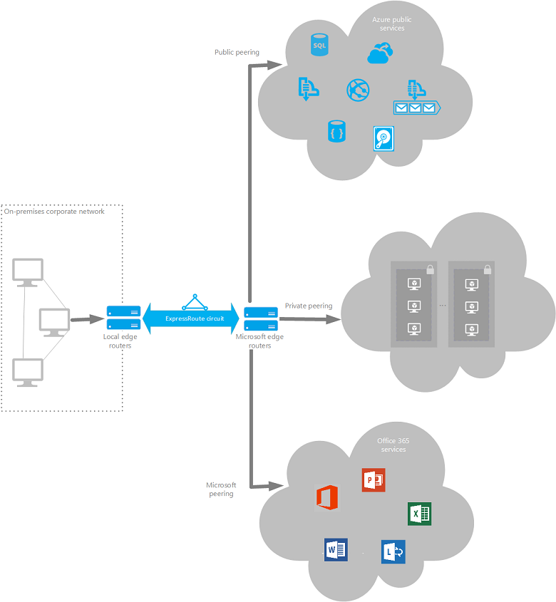
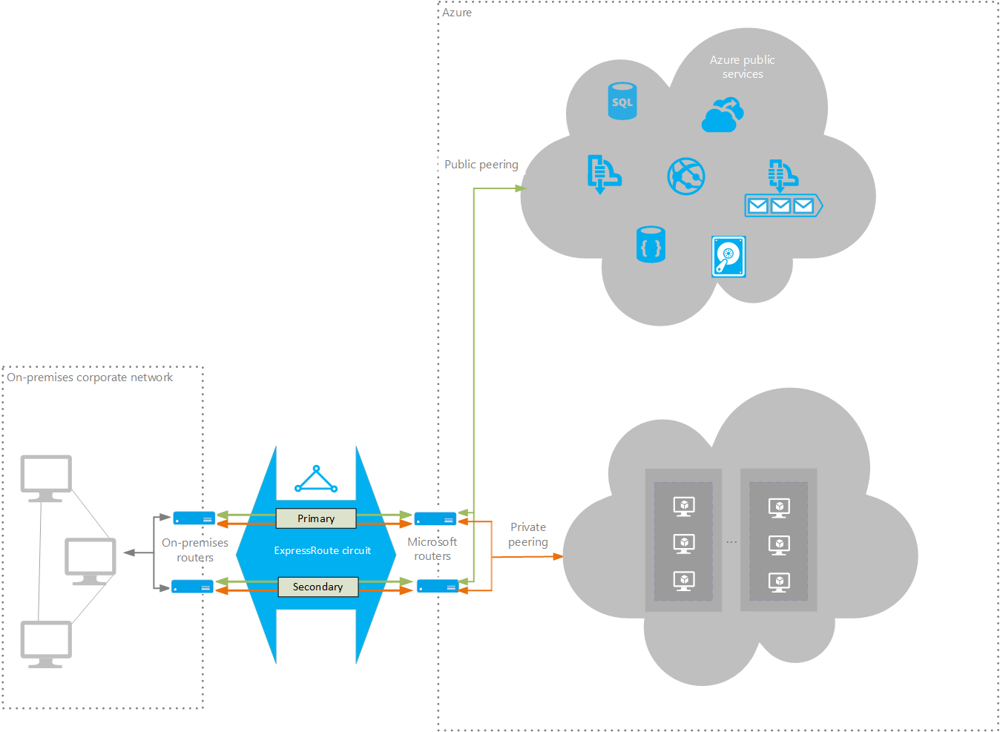
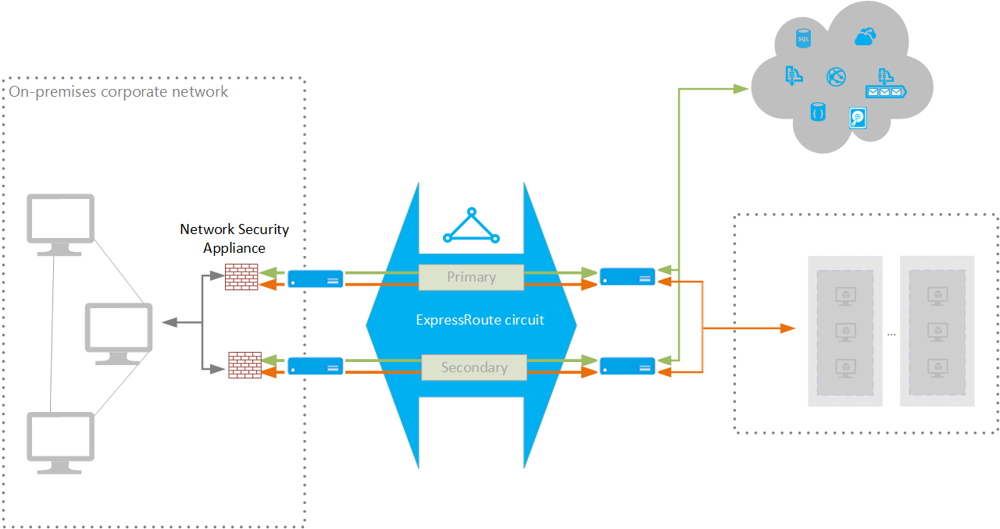

<properties
   pageTitle="Implementing a Hybrid Network Architecture with Azure ExpressRoute | Blueprint | Microsoft Azure"
   description="How to implement a secure site-to-site network architecture that spans an Azure virtual network and an on-premises network connected by using Azure ExpressRoute."
   services=""
   documentationCenter="na"
   authors="JohnPWSharp"
   manager=""
   editor=""
   tags=""/>

<tags
   ms.service="guidance"
   ms.devlang="na"
   ms.topic="article"
   ms.tgt_pltfrm="na"
   ms.workload="na"
   ms.date="03/21/2016"
   ms.author="roshar"/>

# Azure Blueprints: Implementing a Hybrid Network Architecture with Azure ExpressRoute

> [AZURE.NOTE] Azure has two different deployment models: [Resource Manager][resource-manager-overview] and classic. This blueprint uses Resource Manager, which Microsoft recommends for new deployments.

This article describes best practice for connecting an on-premises network with an Azure virtual network (VNet) running in the cloud by using Azure ExpressRoute. The networks are connected by a private circuit supplied by a third-party connectivity provider. The private circuit effectively extends your on-premises network into the cloud without passing through the Internet, giving you faster and more secure access than using a VPN gateway. ExpressRoute supports bandwidths of up to 10 Gbps (depending upon your location and connectivity provider).

> [AZURE.NOTE] A connectivity provider is a network service provider that can provide peering services with Microsoft to support direct access to Azure within a particular region. [Microsoft partners with local providers in different regions][microsoft-provider-peers].

Using ExpressRoute, you can connect to your web applications running in the cloud, and you can also access Azure services that provide a public endpoint, such as Azure storage. Additionally, you can connect directly to Office 365 services. 

Typical use-cases for this architecture include:

- Hybrid applications comprising components and services running on-premises and elements running in the cloud.

- Applications running large-scale, mission-critical workloads that require a high degree of scalability.

- Large-scale backup and restore facilities for data that must be saved off-site.

- Handling Big Data workloads.

- Using Azure as a disaster-recovery site.

> [AZURE.NOTE] The [ExpressRoute technical overview][expressroute-technical-overview] provides an introduction to ExpressRoute.

## Architecture blueprint

This architecture comprises the elements highlighted in the following diagram:



- **N-tier cloud application.** This is the cloud-based part of the system and can be arbitrarily complex, comprising multiple tiers and subnets connected by using Azure load balancers. The traffic in each subnet may be subject to rules defined by using [Azure Network Security Groups (NSGs)][azure-network-security-group]. For maximum security, each subnet should be closed to all traffic originating from outside the VNet. Connections are performed by using **private peering** utilizing addresses which are private to the VNet. Private peering is bi-directional; connections can be initiated by the cloud application or from on-premises.

> [AZURE.NOTE] This architecture treats the cloud application as a single entity which is addressed separately. See [Implementing a Multi-tier Architecture on Azure][implementing-a-multi-tier-architecture-on-Azure] for detailed information.

- **Azure public services.** These are Azure services that can be utilized within a hybrid application. These services are also available across the Internet, but accessing them via an ExpressRoute circuit makes them quicker to reach. Protection is also enhanced as traffic does not have to traverse a public network. Connections are performed by using **public peering**; traffic is routed to [IP address ranges published by Microsoft][datacenter-ip-ranges] and the ExpressRoute circuit performs a NAT translation of on-premises traffic to an endpoint in one of these ranges. Connections over a public peering can only be initiated from on-premises.

- **Office 365 services.** These are the publicly available Office 365 applications and services provided by Microsoft. Connections are performed by using **Microsoft peering**, with addresses that are either owned by your organization or supplied by your connectivity provider.

- **On-premises corporate network.** This is the network and devices, computers, and other machinery running in the corporate datacenter. This hardware supports all on-premises computing activities.

- **Provider edge routers.** These are routers that connect the on-premises network to the circuit managed by the provider.

- **Microsoft edge routers.** These are routers at a Microsoft datacenter, controlled and managed by Microsoft. These routers enable a connectivity provider to connect their circuits directly to the datacenter.

- **ExpressRoute circuit.** This is a layer 2 or layer 3 circuit supplied by the connectivity provider that joins the on-premises network with Azure through the edge routers. The circuit uses the hardware infrastructure managed by the connectivity provider.

> [AZURE.NOTE] For more information about circuits and routing, see [ExpressRoute circuits and routing domains][circuits-and-routing-domains].

## Implementing this architecture

> [AZURE.NOTE] ExpressRoute connectity providers fall into one of the following categories:
>
> - **Exchange Providers (IXP)**. These are OSI Layer 2 (*data link layer*) providers that supply virtual cross-connections to the Microsoft cloud. An IXP provides controlled access to its network switches that act as simple bridges between your on-premises networks and the cloud, giving a direct connection from LAN to LAN. The customer has to provide information to configure these bridges to route requests from one network to another. An IXP circuit can typically support a bandwidth up to 10 Gbps.
>
> - **Network Service Providers (Telco)**. These are OSI Layer 3 (*network layer*) providers that supply access to network switches that are configured by the provider to connect to Azure. These switches translate network addresses from your on-premises domain to the Microsoft domain, and route traffic between networks, often using Multiprotocol Label Switching (MPLS) or similar. Bandwidth availability through a Telco is usually up to 1 Gbps.
>
> To obtain a list of connectivity providers available at your location, use the following Azure CLI command:
> ```
> azure network express-route provider list
> ```
> For more information, see [ExpressRoute: An overview][expressroute-overview].

The following high-level steps outline a process for implementing this architecture. Detailed examples using the Azure CLI are described [later in this document](cli). Note that this process assumes that you have already created a VNet for hosting the cloud application, that you have created the on-premises network, and that your organization has met the [ExpressRoute prerequiste requirements][expressroute-prereqs] for connecting to the Azure. For more information about this process, see [ExpressRoute workflows for circuit provisioning and circuit states][ExpressRoute-provisioning]:

- [Create an ExpressRoute circuit][create-expressroute-circuit]. Use the following command:

	```
	azure network express-route circuit create -p <<connectivity-provider>> -i <<peering-location>> <<resource-group>> <<circuit-name>> <<location>>
	```

- Arrange for the ExpressRoute circuit to be provisioned.

	If your service provider is a Telco:

	- Send the `ServiceKey` for the new circuit to the service provider, together with the address of a /29 subnet that is outside the range of you on-premises network(s) and Azure VNet(s). 

		> [AZURE.NOTE] The service provider may provide an online portal for you to supply this information.

	- Wait for the provider to provision the circuit. The provider will split the /29 subnet space into multiple /30 subnets which will be used for routing. You can verify the provisioning state of a circuit by using the following CLI command:

	```
	azure network express-route circuit show <<resource-group>> <<circuit-name>>
	```

	The `Provisioning state` field in the `Service Provider` section of the output will change from `NotProvisioned` to `Provisioned` when the circuit is ready.

	If your service provider is an IXP:

	- Send the `ServiceKey` for the new circuit to the service provider.

	- Reserve several blocks of IP addresses to configure routing between your network and the Microsoft edge routers. Each peering requires two /30 subnets. For example, if you are implementing a private peering to a VNet and a public peering for accessing Azure services, you will require four /30 subnets. This is for availability purposes; one subnet provides a primary circuit while the other acts as a secondary circuit. The IP prefixes for these subnets cannot overlap with the IP prefixes used by your VNet or on-premises networks. For details, see [ExpressRoute routing requirements][expressroute-routing-requirements].

	- Wait for the provider to provision the circuit.

- Configure routing for the ExpressRoute circuit. 

	If your connectivity provider is a Telco, the provider should configure and manage routing for you; you provide the information necessary to enable the provider to implement the appropriate routes. 

	<a name="address-space></a>If your connectivity provider is an IXP, you will most likely be responsible for configuring routing yourself, using the /30 subnet addresses that you reserved. See [Create and modify routing for an ExpressRoute circuit][configure-expresroute-routing] for details. Use the following command to add a network peering for routing traffic:

	```
	TBD  - CLI equivalent of New-AzureBGPPeering cmdlet
	```

	Depending on your requirements, you may need to perform the following operations:

	- Configure private peering for connecting between on-premises services and components running in the VNet.

	- Configure public peering for connecting between on-premises services and Azure public services.

	- Configure Microsoft peering for connecting between on-premises services and Office 365 services.


- [Link your private VNet(s) in the cloud to the ExpressRoute circuit][link-vnet-to-expressroute]. Use the following command:

	```
	TBD  - CLI equivalent of New-AzureDedicatedCircuitLink cmdlet
	```

Note the following points:

- ExpressRoute uses the Border Gateway Protocol (BGP) for exchanging routing information between your network and Azure.

- You can connect multiple VNets located in different regions to the same ExpressRoute circuit as long as all VNets and the ExpressRoute circuit are located within the same continent.

## Availability recommendations

> ExpressRoute does not support router redundancy protocols such as HSRP and VRRP to implement high availability. Instead, it uses a redundant pair of BGP sessions per peering. To facilitate highly-available connections to your network, Microsoft Azure provisions you with two redundant ports on two routers (part of the Microsoft edge) in an active-active configuration.
 
- If you are using an IXP connectivity provider, deploy redundant routers in your on-premises network in an active-active configuration. Connect the primary circuit to one router, and the secondary circuit to the other. This will give you a highly available connection at both ends of the connection. This is necessary if you require the ExpressRoute SLA. See [SLA for Azure ExpressRoute][sla-for-expressroute] for details.

	The following diagram shows a configuration with redundant on-premises routers connected to the primary and secondary circuits. Each circuit handles the traffic for a public peering and a private peering (each peering is designated a pair of /30 address spaces, as described in the [previous section](#address-space)).

	

- If you are using a Telco connectivity provider, verify that it provides redundant BGP sessions that handle availability for you. 

- Configure a Site-to-Site VPN as a failover path for ExpressRoute. This is only applicable to a private peering. For Azure and Office 365 services, use the Internet as the failover path.

## Security recommendations

- To maximize security, add firewalls or network security appliances between the on-premises network and the provider edge routers. This will help to restrict the inflow of unauthorized traffic from the VNet:



- By default, Azure VMs expose endpoints used for providing login access for management purposes - RDP and Remote Powershell for Windows VMs, and SSH for Linux-based VMs. To maximize security, ensure that these endpoints are not publicly accessible as this could compromise not only the VMs but also your on-premises network. VMs should only be available using the internal IP address. These addresses can be made accessible through the ExpressRoute network, enabling on-premises DevOps staff to perform any necessary configuration or maintenance.

- If you must expose management endpoints for VMs to an external network, then use access control lists to restrict the visibility of these ports to a whitelist of IP addresses or networks.

## Scalability recommendations

> [AZURE.NOTE] ExpressRoute offers two pricing plans to customers, based on metering or unlimited data. See [ExpressRoute pricing][expressroute-pricing] for details. Charges vary according to circuit bandwidth. Available bandwidth will likely vary from provider to provider. Additionally, IXPs can offer higher bandwidth than Telcos. Use the `azure network express-route provider list` command to see the providers available in your region and the bandwidths that they offer.
>
> A single ExpressRoute circuit can support a number of peerings and VNet links. See [ExpressRoute limits][expressroute-limits] for more information.
> 
> For an extra charge, ExpressRoute Premium Add-on provides:
>
> - Up to 10,000 routes per circuit. Without ExpressRoute Premium Add-on, the limit is 4,000 routes per circuit.
>
> - Global connectivity, enabling an ExpressRoute circuit located anywhere in the world to access resources in any region rather than just regions in the same continent.
>
> - An increase in the number of VNet links per circuit from 10 to a larger limit, depending on the bandwidth of the circuit.
>

- To minimize charges, start with the smallest estimated bandwidth that you expect to require. Depending on availability, it may be possible to switch to a higher bandwidth offering from your supplier if necessary. You can change the bandwidth of an existing circuit by using the following command:

	```
	azure network express-route circuit set -b <<bandwidth-in-mbps>> <<resource-group>> <<circuit-name>>
	```

	Note that there will likely be an interruption to the network service while the bandwidth is modified. You can downgrade a circuit to a lower bandwidth if necessary.

- Start with the standard SKU of ExpressRoute, and upgrade to ExpressRoute Premium only when required. Switch the SKU by using the following command (the `<<sku>>` parameter can be `Standard` or `Premium`):

	```
	azure network express-route circuit set -e <<sku>> <<resource-group>> <<circuit-name>>
	```

	Note that, as with the bandwidth, there will likely be an interruption to the network service while the SKU is changed.

- ExpressRoute circuits are designed to allow temporary network bursts up to two times the bandwidth limit that you procured for no additional cost. However, you should determine whether your connectivity provider supports this feature before depending on it.

## Monitoring and manageability recommendations

- **TBD - Notes from TechEd 2014 (CDP-B333)**

- Audit logs for API calls

	- Circuit creation

	- Gateway creation

	- Circuit link updates

	- Authorizations and updates

- BGP session status

	- Creation

	- Config updates

- Alerts when approaching limits


## Troubleshooting

- TBD

## <a name="cli"></a>Azure CLI commands

The [Azure CLI][azure-cli] commands in this section show how to connect an on-premises network to an Azure VNet by using an Azure VPN Gateway. Requests are routed to VMs in the VNet through an internal load balancer. This script assumes that you have:

- [Created and prepared your on-premises network][create-on-prem-network] with an address space of 10.10.0.0/16.

- Installed and configured an on-premises VPN device with a public IP address. This example uses a fictitious IP address of 40.50.60.70.

- [Created an Azure VNet][create-azure-vnet] named `profx-vnet` with an address space of 10.20.0.0/16. This VNet holds subnets (called `profx-subnet1`, `profx-subnet2`, etc) holding the VMs running each tier of the cloud application and resources. The first tier of the cloud application (in `profx-subnet1`) is the web tier, and the VMs in this tier listen for requests on port 80 and port 443.

- Created an Azure resource group named `profx-prod-rg` which contains the VNet.

```
azure config mode arm

azure login

azure account set <<account-id>>
Example: azure account set ########-####-####-####-############

...
TBD

```

## Next steps

- Read the [Microsoft Azure ExpressRoute guide][expressroute-doc]

<!-- links -->

[implementing-a-multi-tier-architecture-on-Azure]: ./iaas-multi-tier.md
[microsoft-provider-peers]: https://azure.microsoft.com/documentation/articles/expressroute-locations/
[expressroute-technical-overview]: https://azure.microsoft.com/documentation/articles/expressroute-introduction/
[circuits-and-routing-domains]: https://azure.microsoft.com/documentation/articles/expressroute-circuit-peerings/
[resource-manager-overview]: ../resource-group-overview.md
[arm-templates]: ../virtual-machines/virtual-machines-deploy-rmtemplates-azure-cli.md
[azure-cli]: ../virtual-machines/virtual-machines-command-line-tools.md
[azure-portal]: ../azure-portal/resource-group-portal.md
[azure-powershell]: ../powershell-azure-resource-manager.md
[azure-virtual-network]: https://azure.microsoft.com/documentation/articles/virtual-networks-overview/
[expressroute-prereqs]: https://azure.microsoft.com/documentation/articles/expressroute-prerequisites/
[create-expressroute-circuit]: https://azure.microsoft.com/documentation/articles/expressroute-howto-circuit-arm/
[configure-expresroute-routing]: https://azure.microsoft.com/documentation/articles/expressroute-howto-routing-arm/
[sla-for-expressroute]: https://azure.microsoft.com/support/legal/sla/expressroute/v1_0/
[datacenter-ip-ranges]: http://www.microsoft.com/download/details.aspx?id=41653
[link-vnet-to-expressroute]: https://azure.microsoft.com/documentation/articles/expressroute-howto-linkvnet-arm/
[ExpressRoute-provisioning]: https://azure.microsoft.com/documentation/articles/expressroute-workflows/
[expressroute-overview]: https://azure.microsoft.com/blog/expressroute-an-overview/
[expressroute-routing-requirements]: https://azure.microsoft.com/en-gb/documentation/articles/expressroute-routing/
[create-on-prem-network]: https://technet.microsoft.com/en-us/library/dn786406.aspx
[create-azure-vnet]: https://azure.microsoft.com/documentation/articles/virtual-networks-create-vnet-classic-cli/
[expressroute-doc]: https://go.microsoft.com/fwlink/p/?LinkId=615122
[expressroute-pricing]: https://azure.microsoft.com/pricing/details/expressroute/
[expressroute-limits]: https://azure.microsoft.com/documentation/articles/azure-subscription-service-limits/#networking-limits
