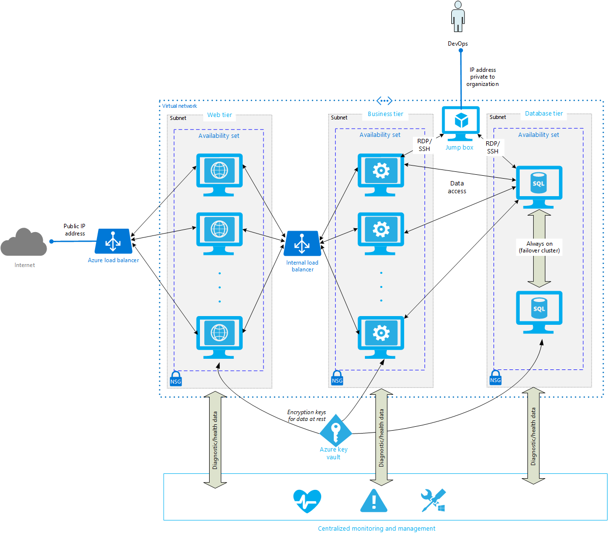

<properties
   pageTitle=" Implementing a Multi-Tier Architecture on Azure | Blueprint | Microsoft Azure"
   description="How to implement a multi-tier architecture on Azure, paying particular attention to availability, security, scalability, and manageability security."
   services=""
   documentationCenter="na"
   authors="JohnPWSharp"
   manager=""
   editor=""
   tags=""/>

<tags
   ms.service="guidance"
   ms.devlang="na"
   ms.topic="article"
   ms.tgt_pltfrm="na"
   ms.workload="na"
   ms.date="02/21/2016"
   ms.author="masashin"/>

# Azure Blueprints: Implementing a Multi-tier Architecture on Azure

This article outlines a set of proven practices for creating a multi-tier architecture on Azure, paying particular attention to availability, security, scalability, and manageability.  

> Azure has two different deployment models: [Resource Manager][resource-manager-overview] and classic. This article uses Resource Manager, which Microsoft recommends for new deployments. There are several ways to use Resource Manager, including the [Azure Portal][azure-portal], [Azure PowerShell][azure-powershell], [Azure CLI][azure-cli] commands, or [Resource Manager templates][arm-templates]. This article includes an example using the Azure CLI.

## Architecture blueprint

This architecture comprises multiple tiers, each of which is designed to handle one specific aspect of the system. Each tier should be decoupled as far as possible from the other tiers to reduce dependencies, ease management, and enable modification of components or functionality in one tier with minimal disruption in the others. The most common form of multi-tier architecture consists of:

- **Web tier.** This tier handles incoming requests and validates them. Any responses are returned through this tier. This tier also provides a security layer that helps to insulate the remaining tiers from potential threats.

- **Business tier.** This tier contains the components that implement the business processes and other functional logic for the system.

 **Database tier.** This tier provides the persistent data storage for the system, implementing one or more repositories used by the business tier.



> The following recommendations cover the multi-tier system as a whole. For additional recommendations concerning individual VMs, see the blueprint [Running a Virtual Machine (Windows) on Azure][running-a-virtual-machine-on-azure].

## Availability recommendations

- Create multiple instances of VMs in each tier and allocate a separate [Availability Set][azure-availability-sets] for each tier. This approach is required to reach the 99.95% availability SLA supported by Azure.

- The database tier should provide reliable data storage. This can be achieved by following an *always on* approach such as using multiple SQL Server database servers configured as a failover cluster. Other database management systems may provide their own reliability features. Alternatively, Azure services such as [Azure SQL Database][azure-sql-database] can be utilized in place of custom VMs to provide this tier.

> See [High availability and disaster recovery for SQL Server in Azure Virtual Machines][sql-server-cluster] For more information about SQL Server failover clustering with Azure.

## Security recommendations

- Hide all tiers from external view by running them within a perimeter network. Do not expose VMs directly to the public Internet. Only enable public access through controlled routes, such as a load balancer (see [Scalability recommendations]()).

- For further protection, each tier can run within its own subnet inside the perimeter network.

- Use [Network Security Groups](network-security-group) (NSGs) to control network traffic entering and exiting each subnet. Ensure that NSG rules permit traffic entering the subnet from the load balancers, but disallow other traffic with the exception of connections from the jump box (see below). Note that the default NSG rules prohibit all incoming Internet traffic, although connections from VMs within the same VNet are allowed, as are connections from the Azure load balancer..

> The Microsoft Azure platform uses the static, publicly routable IPv4 address 168.63.129.16 for a variety of administrative scenarios. This IP address should not be blocked by any firewalls. Azure Internal Load Balancing uses this IP address for monitoring probes from the load balancer to determine the health state for virtual machines in a load balanced set. If an NSG is used to restrict traffic to Azure virtual machines in an internally load-balanced set or is applied to a VNet subnet, ensure that a network security rule is added to allow traffic from 168.63.129.16.

- Create a *jump box* within the perimeter network to enable DevOps staff operating within the organization to access VMs in the web, business, and database tiers directly. A jump box is a VM with an IP address that is not available outside of the organization. An administrator can connect to this VM, and from there log in to VMs in any of the tiers using an RDP (Windows) or SSH (Linux) connection.

- To protect data at rest, use [Azure key vault][azure-key-vault] to store keys used to encrypt information held on VM disks and within SQL Server.

## Scalability recommendations

- Route all public requests to the web tier through an [external load balancer][azure-load-balancer]. As well as hiding VMs in the web tier from public view, this mechanism supports horizontal scalability by allowing the system to transparently provision and de-provision VM instances in the web tier as demand dictates. To reduce possible complications caused by the need to maintain client affinity the VMs in the web tier should be stateless.

- The VMs hosting the business logic should also be stateless. Validated requests from the web tier can be passed to the business tier through an [internal load balancer][azure-internal-load-balancer].

## Manageability recommendations

- Individual VMs should have diagnostics enabled to provide health and performance data.

- Simplify management of the entire system by using centralized administration tools such as [Azure Automation][azure-administration], [Microsoft Operations Management Suite][operations-management-suite], [Chef][chef], or [Puppet][puppet]. These tools can consolidate diagnostic and health information captured from multiple VMs to provide an overall view of the system.

## Troubleshooting

- Avoid creating overlapping subnets within the same VNet.

- Define NSG rules carefully to avoid unexpected conflicts.

- Examine the [audit logs](azure-audit-logs) to view provisioning actions and other events.

- OTHERS? TBD

## Azure CLI commands (example)

The [Azure CLI][azure-cli] commands in the following sections configure and deploy a multi-tier system of Azure VMs, comprising a web tier, a business tier, and a database tier, together with the related network and security resources. Parameter values in `<< >>` are placeholders.

> The commands listed in these sections do not illustrate every possible option, rather they focus on the elements that are likely to be most useful for this architecture. Additionally, the commands for creating VMs are very cursory. See [Running a Virtual Machine (Windows) on Azure](running-a-virtual-machine-on-azure) for detailed guidance on creating individual VMs and allocating VM resources.


### Creating the basic network infrastructure for the web, business, and database tiers
```
azure config mode arm

azure login

azure account set <<account-id>>
Example: azure account set ########-####-####-####-############

// Create resource group
azure group create -n <<resource-group>> -l <<location>>
Example: azure group create -n my-resource-group -l eastus

// Create VNet (16-bit CIDR block)
azure network vnet create --address-prefixes <<ip-address-mask>>/16 <<resource-group>> <<vnet-name>> <<location>>
Example: azure network vnet create --address-prefixes 20.20.0.0/16  my-resource-group my-vnet eastus

// Create subnets for each tier (24-bit non-overlapping CIDR blocks within VNet)
azure network vnet subnet create --vnet-name <<vnet-name>> --address-prefix <<ip-address-mask>>/24 <<resource-group>> <<subnet-name>>
Examples: azure network vnet subnet create --vnet-name my-vnet --address-prefix 20.20.0.0/24 my-resource-group my-web-subnet
          azure network vnet subnet create --vnet-name my-vnet --address-prefix 20.20.1.0/24 my-resource-group my-business-subnet
          azure network vnet subnet create --vnet-name my-vnet --address-prefix 20.20.2.0/24 my-resource-group my-database-subnet

// Create Network Security Groups for each subnet
azure network nsg create <<resource-group>> <<security-group-name>> <<location>>
Examples: azure network nsg create my-resource-group my-web-nsg eastus
          azure network nsg create my-resource-group my-business-nsg eastus
          azure network nsg create my-resource-group my-database-nsg eastus

// Associate NSGs with each subnet - rules can be added later to allow/deny traffic
azure network vnet subnet set -o <<security-group-name>> <<resource-group>> <<vnet-name>> <<subnet-name>>
Examples: azure network vnet subnet set -o my-web-nsg my-resource-group my-vnet my-web
          azure network vnet subnet set -o my-business-nsg my-resource-group my-vnet my-business
          azure network vnet subnet set -o my-database-nsg my-resource-group my-vnet my-database
```
### Creating the web tier
```
// Create external LB for public access to web tier
azure network lb create <<resource-group>> <<lb-name>> <<location>>
Example: azure network lb create my-resource-group my-lb eastus

// Create public IP address
azure network public-ip create <<resource-group>> <<public-ip-name>> <<location>>
Example: azure network public-ip create my-resource-group my-public-ip eastus

// Associate public IP address with LB
azure network lb frontend-ip create -i <<public-ip-name>> <<resource-group>> <<lb-name>> <<frontend-name> 
Example: azure network lb frontend-ip create  -i my-public-ip my-resource-group my-lb my-lb-frontend

// Create the backend address pool for the LB
azure network lb address-pool create <<resource-group>> <<lb-name>> <<backend-pool-name>>
Example: azure network lb address-pool create my-resource-group my-lb my-lb-backend-pool

// Create load-balancing rules for the LB backend address pool
azure network lb rule create -p <<protocol>> -f <<incoming-port>> -b <<outgoing-port>> -t <<frontend-name>> -o <<backend-pool-name>> <<resource-group>> <<lb-name>> <<lb-rule-name>> 
Example: azure network lb rule create -p tcp -f 8080 -b 8080 -t my-lb-frontend -o my-lb-backend-pool my-resource-group my-lb my-lb-rule-tcp-8080

// Create LB health probe
azure network lb probe create -p <<protocol>> -o <<probe-port>> -i <<probe-interval>> -c <<number-of-checks>> <<resource-group>> <<lb-name>> <<probe-name>>
Example: azure network lb probe create -p tcp -o 9999 -i 300 -c 4 my-resource-group my-lb my-lb-probe

// Create NICs for web tier VMs
azure network nic create -m <<vnet-name>> -k <<subnet-name>> -d <<lb-address-pool-id>> <<resource-group>> <<nic-name>> <<location>>
Examples: azure network nic create -m my-vnet -k my-web-subnet -d "/subscriptions/########-####-####-####-############/resourceGroups/my-resource-group/providers/Microsoft.Network/loadBalancers/my-lb/backendAddressPools/my-lb-backend-pool" my-resource-group my-web-nic1 eastus
          azure network nic create -m my-vnet -k my-web-subnet -d "/subscriptions/########-####-####-####-############/resourceGroups/my-resource-group/providers/Microsoft.Network/loadBalancers/my-lb/backendAddressPools/my-lb-backend-pool" my-resource-group my-web-nic2 eastus

// Create availability set for the web tier
azure availset create <<resource-group>> <<availability-set-name>> <<location>>
Example: azure availset create my-resource-group my-web-avail-set eastus

// Create web tier VMs
azure vm create [options] -f <<nic-name>> -r <<availability-set-name>> -Q <<image-urn>> <<resource-group>> <<vm-name>> <<location>> <<os-type>>
Examples: azure vm create -f my-web-nic1 -r my-web-avail-set -Q MicrosoftWindowsServer:WindowsServer:2012-R2-Datacenter:4.0.20150825 my-resource-group my-web-vm1 eastus Windows
          azure vm create -f my-web-nic2 -r my-web-avail-set -Q MicrosoftWindowsServer:WindowsServer:2012-R2-Datacenter:4.0.20150825 my-resource-group my-web-vm2 eastus Windows
```
## Creating the business tier
```
// Create internal LB for web tier access to business tier
azure network lb create <<resource-group>> <<lb-name>> <<location>>
(azure network lb create my-resource-group my-internal-lb eastus)

// Create frontend IP address in business tier subnet for internal LB
azure network lb frontend-ip create -m <<vnet-name>> -e <<subnet-name>> -a <<IP-address-in-subnet>> <<resource-group>> <<lb-name>> <<frontend-name> 
(azure network lb frontend-ip create -m my-vnet -e my-business-subnet -a 20.20.1.253 my-resource-group my-internal-lb my-internal-lb-frontend)

// Create the backend address pool for internal LB
azure network lb address-pool create <<resource-group>> <<lb-name>> <<backend-pool-name>>
(azure network lb address-pool create my-resource-group my-internal-lb my-internal-lb-backend-pool)

// Create load-balancing rules for the internal LB backend address pool
azure network lb rule create -p <<protocol>> -f <<incoming-port>> -b <<outgoing-port>> -t <<frontend-name>> -o <<backend-pool-name>> <<resource-group>> <<lb-name>> <<lb-rule-name>> 
(azure network lb rule create -p tcp -f 5000 -b 5000 -t my-internal-lb-frontend -o my-internal-lb-backend-pool my-resource-group my-internal-lb my-internal internal-lb-rule-tcp-5000)

// Create internal LB health probe
azure network lb probe create -p <<protocol>> -o <<probe-port>> -i <<probe-interval>> -c <<number-of-checks>> <<resource-group>> <<lb-name>> <<probe-name>>
(azure network lb probe create -p tcp -o 80 -i 300 -c 4 my-resource-group my-internal-lb my-internal-lb-probe)

// Create NICs for business tier VMs
azure network nic create -m <<vnet-name>> -k <<subnet-name>> -d <<lb-address-pool-id>> <<resource-group>> <<nic-name>> <<location>>
(azure network nic create -m my-vnet -k my-business-subnet -d "/subscriptions/########-####-####-####-############/resourceGroups/my-resource-group/providers/Microsoft.Network/loadBalancers/my-internal-lb/backendAddressPools/my-internal-lb-backend-pool" my-resource-group my-business-nic1 eastus)
(azure network nic create -m my-vnet -k my-business-subnet -d "/subscriptions/########-####-####-####-############/resourceGroups/my-resource-group/providers/Microsoft.Network/loadBalancers/my-internal-lb/backendAddressPools/my-internal-lb-backend-pool" my-resource-group my-business-nic2 eastus)

// Create availability set for the business tier
azure availset create <<resource-group>> <<availability-set-name>> <<location>>
(azure availset create my-resource-group my-business-avail-set eastus)

// Create business tier VMs
azure vm create [options] -f <<nic-name>> -r <<availability-set-name>> -Q <<image-urn>> <<resource-group>> <<vm-name>> <<location>> <<os-type>>
(azure vm create -f my-business-nic1 -r my-business-avail-set -Q MicrosoftWindowsServer:WindowsServer:2012-R2-Datacenter:4.0.20150825 my-resource-group my-business-vm1 eastus Windows)
(azure vm create -f my-business-nic2 -r my-business-avail-set -Q MicrosoftWindowsServer:WindowsServer:2012-R2-Datacenter:4.0.20150825 my-resource-group my-business-vm2 eastus Windows)
```
### Creating the database tier
```
// Create NICs for database tier VMs
azure network nic create -m <<vnet-name>> -k <<subnet-name>> <<resource-group>> <<nic-name>> <<location>>
(azure network nic create -m my-vnet -k my-database-subnet my-resource-group my-database-nic1 eastus)
(azure network nic create -m my-vnet -k my-database-subnet my-resource-group my-database-nic2 eastus)

// Create availability set for the database tier
azure availset create <<resource-group>> <<availability-set-name>> <<location>>
(azure availset create my-resource-group my-database-avail-set eastus)

// Create database tier VMs
azure vm create [options] -f <<nic-name>> -r <<availability-set-name>> -Q <<image-urn>> <<resource-group>> <<vm-name>> <<location>> <<os-type>>
(azure vm create -f my-database-nic1 -r my-database-avail-set -Q MicrosoftWindowsServer:WindowsServer:2012-R2-Datacenter:4.0.20150825 my-resource-group my-database-vm1 eastus Windows)
(azure vm create -f my-database-nic2 -r my-database-avail-set -Q MicrosoftWindowsServer:WindowsServer:2012-R2-Datacenter:4.0.20150825 my-resource-group my-database-vm2 eastus Windows)
```
### Creating the jump box
> These commands creat separate NICs for connecting the jump box to each of the subnets. This is to enable security separation if you need to enforce different security policies for each tier. If this separation is unnecessary, you can simply create a single NIC for the jump box and add this NIC to the VM.

```
// Create public IP address for jump box
azure network public-ip create <<resource-group>> <<public-ip-name>> <<location>>
(azure network public-ip create my-resource-group my-jumpbox-ip eastus)

// Create a subnet for the jump box (use a separate subnet from the other tiers)
azure network vnet subnet create --vnet-name <<vnet-name>> --address-prefix <<ip-address-mask>>/24 <<resource-group>> <<subnet-name>>
Examples: azure network vnet subnet create --vnet-name my-vnet --address-prefix 20.20.3.0/24 my-resource-group my-jumpbox-subnet

// Create public NIC for jump box and connect to the jump box subnet
azure network nic create -p <<public-ip-name>> -m <<vnet-name>> -k <<subnet-name>> <<resource-group>> <<nic-name>> <<location>>
(azure network nic create -p my-jumpbox-ip -m my-vnet -k my-jumpbox-subnet my-resource-group my-jumpbox-nic eastus)

// Optional - Create NICs for connecting jump box to web, database and business tier VMs (one NIC for each subnet)
azure network nic create -m <<vnet-name>> -k <<subnet-name>> <<resource-group>> <<nic-name>> <<location>>
(azure network nic create -m my-vnet -k my-web-subnet my-resource-group my-jumpbox-web-nic eastus)
(azure network nic create -m my-vnet -k my-business-subnet my-resource-group my-jumpbox-business-nic eastus)
(azure network nic create -m my-vnet -k my-database-subnet my-resource-group my-jumpbox-database-nic eastus)

// Create jump box - Must use a size that supports the appropriate number of NICs
azure vm create [options] -z <<vm-size>> -N <<nic-names>> -Q <<image-urn>> <<resource-group>> <<vm-name>> <<location>> <<os-type>>
(azure vm create -z Standard_A4 -N my-jumpbox-nic,my-jumpbox-web-nic,my-jumpbox-business-nic,my-jumpbox-database-nic -Q MicrosoftWindowsServer:WindowsServer:2012-R2-Datacenter:4.0.20150825 my-resource-group my-jumpbox-vm eastus Windows)
```

## Next steps

- [TBD]

<!-- links -->

[running-a-virtual-machine-on-azure]: ./iaas-single-vm.md
[azure-key-vault]: https://azure.microsoft.com/services/key-vault/
[network-security-group]: https://azure.microsoft.com/documentation/articles/virtual-networks-nsg/
[azure-administration]: https://azure.microsoft.com/documentation/articles/automation-intro/
[operations-management-suite]: https://www.microsoft.com/server-cloud/operations-management-suite/overview.aspx
[chef]: https://www.chef.io/solutions/azure/
[puppet]: https://puppetlabs.com/blog/managing-azure-virtual-machines-puppet
[azure-load-balancer]: https://azure.microsoft.com/documentation/articles/load-balancer-overview/
[azure-sql-database]: https://azure.microsoft.com/services/sql-database/
[azure-availability-sets]: https://azure.microsoft.com/documentation/articles/virtual-machines-manage-availability/#configure-each-application-tier-into-separate-availability-sets
[resource-manager-overview]: ../resource-group-overview.md
[arm-templates]: ../virtual-machines/virtual-machines-deploy-rmtemplates-azure-cli.md
[azure-cli]: ../virtual-machines/virtual-machines-command-line-tools.md
[azure-portal]: ../azure-portal/resource-group-portal.md
[azure-powershell]: ../powershell-azure-resource-manager.md
[azure-internal-load-balancer]: https://azure.microsoft.com/documentation/articles/load-balancer-internal-overview/
[sql-server-cluster]: https://azure.microsoft.com/documentation/articles/virtual-machines-sql-server-high-availability-and-disaster-recovery-solutions/
[azure-audit-logs]: https://azure.microsoft.com/en-gb/updates/audit-logs-in-azure-preview-portal/
