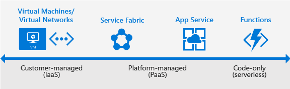

# Get started guide for Azure developers

## What is Azure?

Azure is a complete cloud platform that can host your existing applications and streamline new application development. Azure can even enhance on-premises applications. Azure integrates the cloud services that you need to develop, test, deploy, and manage your applications, all while taking advantage of the efficiencies of cloud computing.

By hosting your applications in Azure, you can start small and easily scale your application as your customer demand grows. Azure also offers the reliability that's needed for high-availability applications, even including failover between different regions. The [Azure portal](https://portal.azure.com) lets you easily manage all your Azure services. You can also manage your services programmatically by using service-specific APIs and templates.

This guide is an introduction to the Azure platform for application developers. It provides the guidance you need to start building new applications in Azure or migrating your existing applications to Azure.

## Where do I start?

With all the services that Azure offers, it can be an intimidating task to figure out which services you need to support your solution architecture. This section highlights the Azure services that developers commonly use. For a list of all Azure services, see the [Azure documentation](../../index.yml).

First, you must decide on how to host your application in Azure. Do you need to manage your entire infrastructure as a virtual machine (VM)? Can you use the platform management facilities that Azure provides? Maybe you need a serverless framework to host code execution only?

If your application needs cloud storage, Azure provides several options. You can take advantage of Azure's enterprise authentication. There are also tools for cloud-based development and monitoring, and most hosting services offer DevOps integration.

Let's look at some of the specific services we recommend your investigate for your applications.

### Application hosting

Azure provides several cloud-based compute offerings to run your application so that you don't have to worry about infrastructure details. You can easily scale up or scale out your resources as your application usage grows.

Azure offers services that support your unique application development and hosting needs. Azure provides Infrastructure as a Service (IaaS) capabilities to give you full control over your application hosting. Azure's Platform as a Service (PaaS) offerings, including Azure App Service and Azure Service Fabric, provide the fully managed services needed to power your apps. And Azure also provides true serverless hosting where all you need to do is write your code.

#### Azure App Service

For the quickest path to publishing your web-based projects, consider Azure App Service. App Service makes it easy to extend your web apps to support your mobile clients and publish easily consumed REST APIs. This platform provides authentication by using social providers, traffic-based autoscaling, testing in production, and continuous and container-based deployments.

With App Service, you can create web apps, mobile app back ends, and API apps. Because all three app types share the App Service runtime, you can host a website, support mobile clients, and expose your APIs in Azure, all from the same project or solution. To learn more about App Service, see the [App Service overview](../../app-service/overview.md).

Designed with DevOps in mind, App Service supports various tools for publishing and continuous integration deployments: GitHub webhooks, Jenkins, Azure DevOps, TeamCity, and others.

You can also migrate your existing applications to App Service by using the [Azure App Service migration assistant](https://appmigration.microsoft.com/).

> **When to use**: Use App Service when you're migrating existing web applications to Azure, and when you need a fully managed hosting platform for your web apps. You can also use App Service when you need to support mobile clients or expose REST APIs with your app.
>
> **Get started**: App Service makes it easy to create and deploy your first [web app](../../app-service/quickstart-dotnetcore.md), [mobile app](/previous-versions/azure/app-service-mobile/app-service-mobile-ios-get-started), or [RESTful API](../../app-service/app-service-web-tutorial-rest-api.md).
>
> **Try it now**: You can provision a short-lived app to try out the platform with a free Azure account. [Create your free account and build an Azure App Service app](https://tryappservice.azure.com/).

#### Azure Virtual Machines

As an IaaS provider, Azure lets you deploy to or migrate your application to either Windows or Linux virtual machines (VMs). Together with Azure Virtual Network, Azure Virtual Machines supports the deployment of Windows or Linux VMs to Azure. With VMs, you have total control over the configuration of the machine. When using VMs, you're responsible for all server software installation, configuration, maintenance, and operating system patches.

Because of the level of control that you have with VMs, you can run a wide range of server workloads on Azure that don't fit into a PaaS model. These workloads include database servers, Windows Server Active Directory, and Microsoft SharePoint. For more information, see the [Virtual Machines documentation](../../virtual-machines/index.yml) for either Linux or Windows.

> **When to use**: Use virtual machines when you want full control over your application infrastructure or to migrate on-premises application workloads to Azure without having to make changes.
>
> **Get started**: Create a [Linux VM](../../virtual-machines/linux/quick-create-portal.md) or [Windows VM](../../virtual-machines/windows/quick-create-portal.md) from the Azure portal.

#### Azure Functions (serverless)

Rather than worrying about building out and managing a whole application or the infrastructure to run your code, what if you could just write your code and have it run in response to events or on a schedule?  [Azure Functions](../../azure-functions/functions-overview.md) is a "serverless"-style offering that lets you write just the code you need. With Azure Functions, you can trigger code execution with HTTP requests, webhooks, cloud service events, or on a schedule. You can code in your development language of choice, such as C\#, F\#, Node.js, Python, or PHP. With consumption-based billing, you pay only for the time that your code executes, and Azure scales as needed.

> **When to use**: Use Azure Functions when you have code that is triggered by other Azure services, by web-based events, or on a schedule. You can also use Functions when you don't need the overhead of a complete hosted project or when you want to pay only for the time that your code runs. To learn more, see [Introduction to Azure Functions](../../azure-functions/functions-overview.md).
>
> **Get started**: See the quickstart tutorials for creating your first function at [Getting started with Azure Functions](../../azure-functions/functions-get-started.md) from the portal.

#### Azure Service Fabric

Azure Service Fabric is a distributed systems platform that makes it easy to build, package, deploy, and manage scalable and reliable microservices. It also provides comprehensive application management capabilities, such as:

* Provisioning
* Deploying
* Monitoring
* Upgrading/Patching
* Deleting

Running on a shared pool of machines, apps can start small and scale to hundreds or thousands of machines as needed.

Service Fabric supports WebAPI with Open Web Interface for .NET (OWIN) and ASP.NET Core. It provides SDKs for building services on Linux in both .NET Core and Java. To learn more about Service Fabric, see the [Service Fabric documentation](../../service-fabric/index.yml).

> **When to use:** Service Fabric is a good choice when you're creating an application or rewriting an existing application to use a microservice architecture. Use Service Fabric when you need more control over, or direct access to, the underlying infrastructure.
>
> **Get started:** [Create your first Azure Service Fabric application](../../service-fabric/service-fabric-tutorial-create-dotnet-app.md).

#### Azure Spring Cloud

Azure Spring Cloud is a serverless microservices platform that enables you to build, deploy, scale and monitor your applications in the cloud. Spring Cloud brings modern microservice patterns to Spring Boot apps, eliminating boilerplate code to help you quickly build robust Java apps. With Spring Cloud, you can:

* Leverage managed versions of Spring Cloud Service Discovery and Config Server, while we ensure those critical components are running in optimum conditions.
* Focus on building your business logic while we take care of your service runtime with security patches, compliance standards, and high availability.
* Manage application lifecycle (for example, deploy, start, stop, scale) on top of Azure Kubernetes Service.
* Easily bind connections between your apps and Azure services, such as Azure Database for MySQL and Azure Cache for Redis.
* Monitor and troubleshoot your microservices and applications using enterprise-grade unified monitoring tools that offer deep insights into application dependencies and operational telemetry.

> **When to use:** As a fully managed service, Azure Spring Cloud is a good choice when you're minimizing operational costs running Spring Boot/Spring Cloud-based microservices on Azure. 
>
> **Get started:** [Deploy your first Azure Spring Cloud application](../../spring-cloud/quickstart.md).

### Enhance your applications with Azure services

Along with application hosting, Azure provides service offerings that can enhance your application's functionality. Azure can also improve the development and maintenance of your applications, both in the cloud and on-premises.

#### Hosted storage and data access

Most applications must store data. However you decide to host your application in Azure, consider one or more of the following storage and data services:

* **Azure Cosmos DB**: A globally distributed, multi-model database service. This database enables you to elastically scale throughput and storage across any number of geographical regions with a comprehensive SLA.

  > **When to use:** When your application needs document, table, or graph databases, including MongoDB databases, with multiple well-defined consistency models.
  >
  > **Get started**: [Build a .NET console app to manage Azure Cosmos DB SQL API resources](../../cosmos-db/create-sql-api-dotnet.md). If you're a MongoDB developer, see [Build a .NET web app using Azure Cosmo DB’s API for MongoDB](../../cosmos-db/create-mongodb-dotnet.md).

* **Azure Storage**: Offers durable, highly available storage for blobs, queues, files, and other kinds of nonrelational data. Storage provides the storage foundation for VMs.

  > **When to use**: When your app stores nonrelational data, such as key-value pairs (tables), blobs, files shares, or messages (queues).
  >
  > **Get started**: Choose from one of these types of storage: [blobs](../../storage/blobs/storage-quickstart-blobs-dotnet.md), [tables](../../cosmos-db/tutorial-develop-table-dotnet.md), [queues](../../storage/queues/storage-dotnet-how-to-use-queues.md), or [files](../../storage/files/storage-dotnet-how-to-use-files.md).

* **Azure SQL Database**: An Azure-based version of the Microsoft SQL Server engine for storing relational tabular data in the cloud. SQL Database provides predictable performance, scalability with no downtime, business continuity, and data protection.

  > **When to use**: When your application requires data storage with referential integrity, transactional support, and support for TSQL queries.
  >
  > **Get started**: [Create an Azure SQL Database single database in minutes by using the Azure portal](../../azure-sql/database/single-database-create-quickstart.md).

You can use [Azure Data Factory](../../data-factory/introduction.md) to move existing on-premises data to Azure. If you aren't ready to move data to the cloud, [Hybrid Connections](../../app-service/app-service-hybrid-connections.md) in Azure App Service lets you connect your App Service app to on-premises resources. You can also connect to Azure data and storage services from your on-premises applications.

#### Docker support

Docker containers, a form of OS virtualization, let you deploy applications in a more efficient and predictable way. A containerized application works in production the same way as on your development and test systems, and you can manage containers by using standard Docker tools. You can also use your existing skills and popular open-source tools to deploy and manage container-based applications on Azure.

Azure provides several ways to use containers in your applications.

* **Azure Kubernetes Service**: Lets you create, configure, and manage a cluster of virtual machines  that are preconfigured to run containerized applications. [Learn more about Azure Kubernetes Service](../../aks/intro-kubernetes.md).

  > **When to use**: When you need to build production-ready, scalable environments that provide additional scheduling and management tools, or when you're deploying a Docker Swarm cluster.
  >
  > **Get started**: [Deploy an Azure Kubernetes Service cluster](../../aks/tutorial-kubernetes-deploy-cluster.md).

* **Docker Machine**: Lets you install and manage a Docker Engine on virtual hosts by using docker-machine commands.

  >**When to use**: When you need to quickly prototype an app by creating a single Docker host.

* **Custom Docker image for App Service**: Lets you use Docker containers from a container registry or a customer container when you deploy a web app on Linux.

  > **When to use**: When deploying a web app on Linux to a Docker image.
  >
  > **Get started**: See [Run a custom container in Azure](../../app-service/quickstart-custom-container.md?pivots=platform-linux%253fpivots%253dplatform-linux) and choose **Linux container**.

### Authentication

It's crucial not only to know who is using your applications but also to prevent unauthorized access to your resources. Azure provides several ways to authenticate your app clients.

* **Azure Active Directory (Azure AD)**: The Microsoft multitenant, cloud-based identity and access management service. You can add single-sign on (SSO) to your applications by integrating with Azure AD. You can access directory properties by using the Azure AD Graph API directly or the Microsoft Graph API. You can integrate with Azure AD support for the OAuth2.0 authorization framework and Open ID Connect by using native HTTP/REST endpoints and the multiplatform Azure AD authentication libraries.

  > **When to use**: When you want to provide an SSO experience, work with Graph-based data, or authenticate domain-based users.
  >
  > **Get started**: Learn more about [the Microsoft identity platform](../../active-directory/develop/v2-overview.md).

* **App Service Authentication**: When you choose App Service to host your app, you also get built-in authentication support for Azure AD, along with social identity providers, including Facebook, Google, Microsoft, and Twitter.

  > **When to use**: When you want to enable authentication in an App Service app by using Azure AD, social identity providers, or both.
  >
  > **Get started**: To learn more about authentication in App Service, see [Authentication and authorization in Azure App Service and Azure Functions](../../app-service/overview-authentication-authorization.md).

To learn more about security best practices to use when you’re designing, deploying, and managing your cloud solutions in Azure, see [Azure security best practices and patterns](../../security/fundamentals/best-practices-and-patterns.md).

### Monitoring

With your application up and running in Azure, you need to monitor performance, watch for issues, and see how customers are using your app. Azure provides several monitoring options.

* **Application Insights**: An Azure-hosted extensible analytics service that integrates with Visual Studio to monitor your live web applications. Application Insights gives you the data that you need to improve the performance and usability of your apps continuously. This improvement occurs whether or not you host your applications on Azure.

  > **Get started**: See the [Application Insights overview](../../azure-monitor/app/app-insights-overview.md).

* **Azure Monitor**: A service that helps you to visualize, query, route, archive, and act on the metrics and logs that you generate with your Azure infrastructure and resources. Monitor is a single source for monitoring Azure resources and provides the data views that you see in the Azure portal.

  > **Get started**: See the [Azure Monitor overview](../../azure-monitor/overview.md).

### DevOps integration

Whether it's provisioning VMs or publishing your web apps with continuous integration, Azure integrates with most of the popular DevOps tools, including these:

* Jenkins
* GitHub
* Puppet
* Chef
* TeamCity
* Ansible
* Azure DevOps

You can work with the tools that you already have and maximize your existing experience.

> **Get started**: To see DevOps options for an App Service app, see [Continuous deployment to Azure App Service](../../app-service/deploy-continuous-deployment.md).
>
> **Try it now:** [Try out several of Azure's DevOps integrations](https://azure.microsoft.com/try/devops/).

## Azure regions

Azure is a global cloud platform that is generally available in many regions around the world. When you provision a service, application, or VM in Azure, you're asked to select a region. This region represents a specific datacenter where your application runs or where your data is stored. These regions correspond to specific locations, which are
published on the [Azure geographies](https://azure.microsoft.com/regions/) page.

### Choose the best region for your application and data

One of the benefits of using Azure is that you can deploy your applications to various datacenters around the globe. The region that you choose can affect the performance of your application. For example, it's better to choose a region that's closer to most of your customers to reduce latency in network requests. You might also
want to select your region to meet the legal requirements for distributing your app in certain countries/regions. It's always a best practice to store application data in the same datacenter as the one hosting your application or in a datacenter as near as possible to it.

### Multi-region apps

Although unlikely, it's not impossible for an entire datacenter to go offline because of an event such as a natural disaster or Internet failure. It's a best practice to host vital business applications in more than one datacenter to provide maximum availability. Using multiple regions can also reduce latency for global users and provide additional opportunities for flexibility when updating applications.

Some services, such as Azure virtual machines and Azure App Services, use [Azure Traffic Manager](../../traffic-manager/traffic-manager-overview.md) to enable multi-region support with failover between regions to support high-availability enterprise applications. 

>**Get started**: For an example, see this [Azure reference architecture showing a highly available multi-region web application](/azure/architecture/reference-architectures/app-service-web-app/multi-region).

>**When to use**: When you have enterprise and high-availability applications that benefit from failover and replication.

## How do I manage my applications and projects?

Azure provides a rich set of experiences for you when you're creating and managing your Azure resources, applications, and projects—both programmatically and in the [Azure portal](https://portal.azure.com/).

### Command-line interfaces and PowerShell

Azure provides two ways to manage your applications and services from the command line:

* [Azure Command-Line Interface (CLI)](/cli/azure/install-azure-cli): Lets you connect to an Azure subscription and program various tasks against Azure resources from the command line.

* [Azure PowerShell](/powershell/azure/): Provides a set of modules with cmdlets that enable you to manage Azure resources by using Windows PowerShell.

You can use tools like Bash, Terminal, the command prompt, or your command-line tool of choice. Usually, you can do the same tasks from the command line as in the Azure portal, such as creating and configuring virtual machines, virtual networks, web apps, and other services.

### Azure portal

The [Azure portal](https://portal.azure.com) is a web-based application. You can use the Azure portal to create, manage, and remove Azure resources and services. It includes:

* A configurable dashboard
* Azure resource management tools
* Access to subscription settings and billing information

>**Get started**: For more information, see the [Azure portal overview](https://azure.microsoft.com/features/azure-portal/).

### REST APIs

Azure is built on a set of REST APIs that support the Azure portal UI. Most of these REST APIs are also supported to let you programmatically provision and manage your Azure resources and applications from any Internet-enabled device. 

>**Get started**: For the complete set of REST API documentation, see the [REST API browser](/rest/api/).

### APIs

Along with REST APIs, many Azure services also let you programmatically manage resources from your applications by using platform-specific Azure SDKs, including SDKs for the following development platforms:

* [.NET](/dotnet/api/)
* [Node.js](/azure/developer/javascript/)
* [Java](/java/azure)
* [PHP](https://github.com/Azure/azure-sdk-for-php/blob/master/README.md)
* [Python](/azure/python/)
* [Ruby](https://github.com/Azure/azure-sdk-for-ruby/blob/master/README.md)
* [Go](/azure/go)

Services such as [Mobile Apps](/previous-versions/azure/app-service-mobile/app-service-mobile-dotnet-how-to-use-client-library)
and [Azure Media Services](../../media-services/previous/media-services-dotnet-how-to-use.md) provide client-side SDKs to let you access services from web and mobile client apps.

### Azure Resource Manager

Running your app on Azure likely involves working with multiple Azure services. These services follow the same life cycle and can be thought of as a logical unit. For example, a web app might use Web Apps, SQL Database, Storage, Azure Cache for Redis, and Azure Content Delivery Network services. [Azure Resource Manager](../../azure-resource-manager/management/overview.md) lets you work with the resources in your application as a group. You can deploy, update, or delete all the resources in a single, coordinated operation.

Along with logically grouping and managing related resources, Azure Resource Manager includes deployment capabilities that let you customize the deployment and configuration of related resources. For example, you can use Resource Manager to deploy and configure an application. This application can consist of multiple virtual machines, a load balancer, and a database in Azure SQL Database as a single unit.

You develop these deployments by using an Azure Resource Manager template, which is a JSON-formatted document. Templates let you define a deployment and manage your applications by using declarative templates, rather than scripts. Your templates can work for different environments, such as testing, staging, and production. For example, you can use templates to add a button to a GitHub repo that deploys the code in the repo to a set of Azure services with a single click.

> **When to use**: Use Resource Manager templates when you want a template-based deployment for your app that you can manage programmatically by using REST APIs, the Azure CLI, and Azure PowerShell.
>
> **Get started**: To get started using templates, see [Understand the structure and syntax of ARM templates](../../azure-resource-manager/templates/syntax.md).

## Understanding accounts, subscriptions, and billing

As developers, we like to dive right into the code and get started as quickly as possible making our applications run. To make that easy, Azure offers a [free trial](https://azure.microsoft.com/free/) and some services have "Try it for free" functionality. As fun as it is to dive into coding and deploying your application to Azure, it's also important to take some time to understand how Azure works from a standpoint of user accounts, subscriptions, and billing.

### What is an Azure account?

To create or work with an Azure subscription, you must have an Azure account. An Azure account is simply an identity in Azure AD or in a directory, such as a work or school organization, that Azure AD trusts. If you don't belong to such an organization, you can always create a subscription by using your Microsoft Account, which is trusted by Azure AD. To learn more about integrating on-premises Windows Server Active Directory with Azure AD, see [What is hybrid identity with Azure Active Directory](../../active-directory/hybrid/whatis-hybrid-identity.md).

Every Azure subscription has a trust relationship with an Azure AD instance. This means that it trusts that directory to authenticate users, services, and devices. Multiple subscriptions can trust the same directory, but a subscription trusts only one directory. To learn more, see [Associate or add an Azure subscription to your Azure Active Directory tenant](../../active-directory/fundamentals/active-directory-how-subscriptions-associated-directory.md).

As well as defining individual Azure account identities, also called *users*, you can define *groups* in Azure AD. Creating user groups is a good way to manage access to resources in a subscription by using role-based access control (RBAC). To learn how to create groups, see [Create a basic group and add members using Azure Active Directory](../../active-directory/fundamentals/active-directory-groups-create-azure-portal.md). You can also create and manage groups by [using PowerShell](../../active-directory/enterprise-users/groups-settings-v2-cmdlets.md).

### Manage your subscriptions

A subscription is a logical grouping of Azure services that is linked to an Azure account. A single Azure account can contain multiple subscriptions. Billing for Azure services is done on a per-subscription basis. For a list of the available subscription offers by type, see [Microsoft Azure Offer Details](https://azure.microsoft.com/support/legal/offer-details/). Azure subscriptions have an Account Administrator who has full control over the subscription. They also have a Service Administrator who has control over all services in the subscription. For information about classic subscription administrators, see [Add or change Azure subscription administrators](../../cost-management-billing/manage/add-change-subscription-administrator.md). Individual accounts can be granted detailed control of Azure resources using [Azure role-based access control (Azure RBAC)](../../role-based-access-control/overview.md).

#### Resource groups

When you provision new Azure services, you do so in a given subscription. Individual Azure services, which are also called resources, are created in the context of a resource group. Resource groups make it easier to deploy and manage your application's resources. A resource group should contain all the resources for your application that you want to work with as a unit. You can move resources between resource groups and even to different subscriptions. To learn about moving resources, see [Move resources to new resource group or subscription](../../azure-resource-manager/management/move-resource-group-and-subscription.md).

#### Grant access to resources

When you allow access to Azure resources, it's always a best practice to provide users with the least privilege that's required to do a given task.

* **Azure role-based access control (Azure RBAC)**: In Azure, you can grant access to user accounts (principals) at a specified scope: subscription, resource group, or individual resources. Azure RBAC lets you deploy resources into a resource group and grant permissions to a specific user or group. It also lets you limit access to only the resources that belong to the target resource group. You can also grant access to a single resource, such as a virtual machine or virtual network. To grant access, you assign a role to the user, group, or service principal. Many predefined roles are provided, and you can also define your own custom roles. To learn more, see [What is Azure role-based access control (Azure RBAC)?](../../role-based-access-control/overview.md).

  > **When to use**: When you need fine-grained access management for users and groups or when you need to make a user an owner of a subscription.
  >
  > **Get started**: To learn more, see [Assign Azure roles using the Azure portal](../../role-based-access-control/role-assignments-portal.md).

- **Service principal objects**: Along with providing access to user principals and groups, you can grant the same access to a service principal.

  > **When to use**: When you're programmatically managing Azure resources or granting access for applications.
  >   
  > **Get started**: [Learn how to create an Azure AD application and service principal that can access resources](../../active-directory/develop/howto-create-service-principal-portal.md).

#### Tags

Azure Resource Manager lets you assign custom tags to individual resources. Tags, which are key-value pairs, can be helpful when you need to organize resources for billing or monitoring. Tags provide you a way to track resources across multiple resource groups. You can assign tags the following ways:

* In the portal
* In the Azure Resource Manager template
* Using the REST API
* Using the Azure CLI
* Using PowerShell

You can assign multiple tags to each resource. 

 > **Get started**: To learn more, see [Use tags to organize your Azure resources and management hierarchy](../../azure-resource-manager/management/tag-resources.md).

### Billing

In the move from on-premises computing to cloud-hosted services, tracking and estimating service usage and related costs are significant concerns. It's important to be able to estimate what new resources cost to run on a monthly basis. It's also important to be able to project how the billing looks for a given month based on the current spending.

#### Get resource usage data

Azure provides a set of Billing REST APIs that give access to resource consumption and metadata information for Azure subscriptions. These Billing APIs give you the ability to better predict and manage Azure costs. You can track and analyze spending in hourly increments and create spending alerts.

>**Get started**: To learn more about using the Billing APIs, see [Azure consumption API overview](../../cost-management-billing/manage/consumption-api-overview.md)

#### Predict future costs

Although it's challenging to estimate costs ahead of time, Azure has tools that can help, including a [pricing calculator](https://azure.microsoft.com/pricing/calculator/) that helps estimate the cost of deployed resources. You can also use the Billing resources in the portal and the Billing REST APIs to estimate future costs, based on current consumption.

>**Get started**: To learn more, see [Azure consumption API overview](../../cost-management-billing/manage/consumption-api-overview.md).
