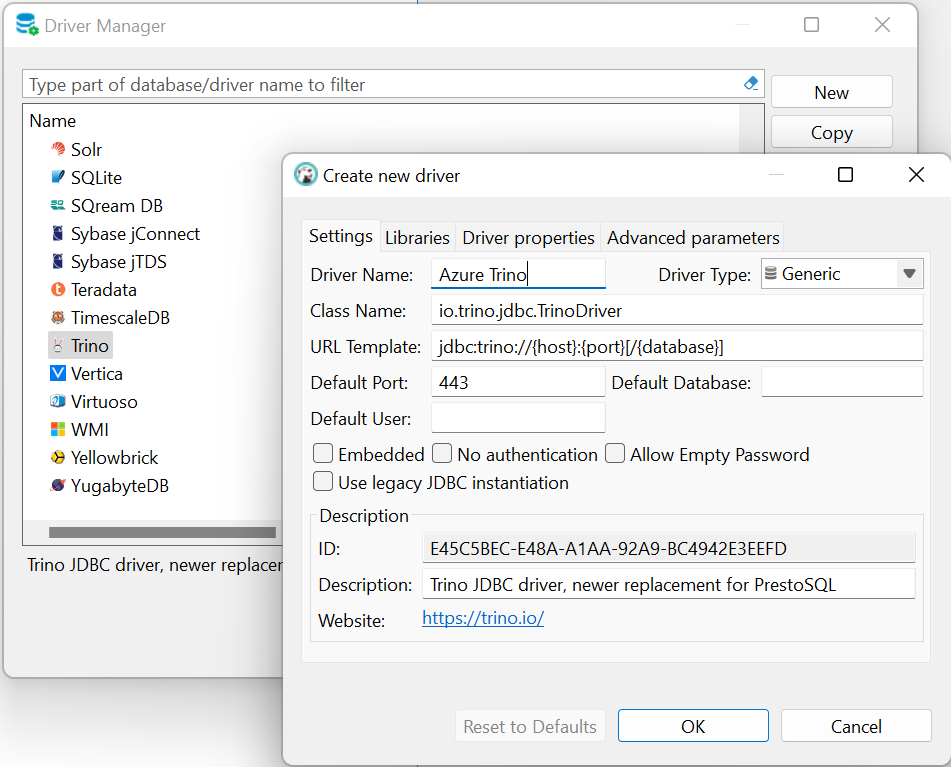
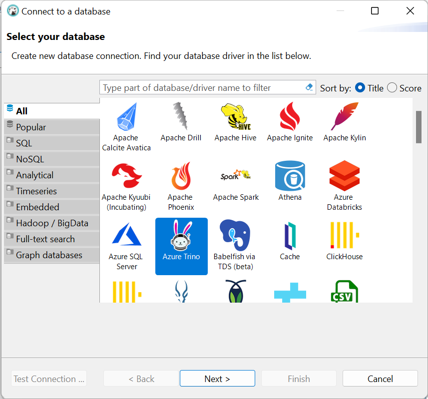
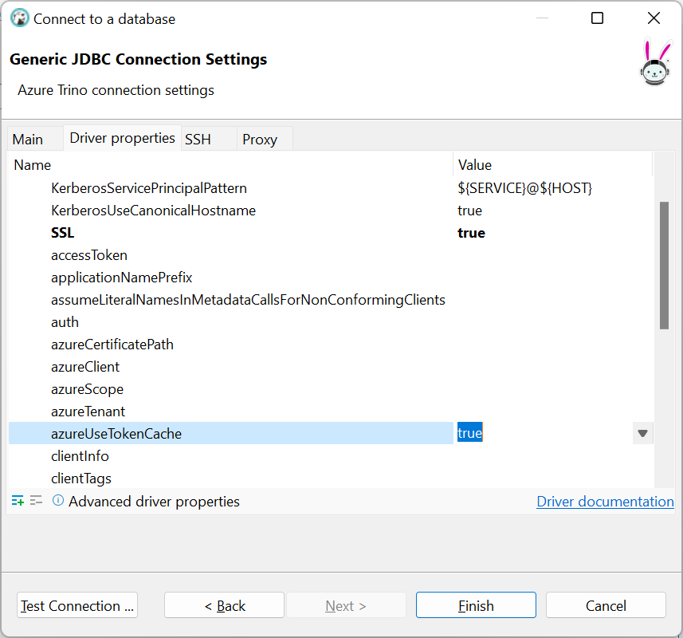
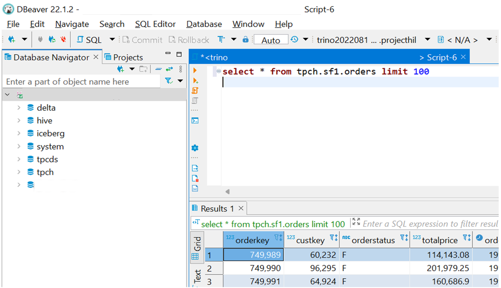

# Connect and query with DBeaver

It's possible to use JDBC driver with many available database tools. This article demonstrates how to configure one of the most popular tool **DBeaver** to connect to HDInsight on AKS Trino cluster in few simple steps.

## Prerequisites

1. [Download and install DBeaver](https://dbeaver.io/download/).
2. [Install HDInsight on AKS Trino CLI with JDBC driver](./trino-ui-cli.md#install-on-windows).


## Configure DBeaver to use HDInsight Trino JDBC driver

Open DBeaver and from the main menu, select Database -> Driver Manager. 

   > [!NOTE]
   > DBeaver comes with existing open-source Trino driver, create a copy of it and register Azure Trino JDBC driver.
   
   1. Select **Trino** driver from list and click **Copy**.
      
      * Update **Driver Name**, for example, "Azure Trino."
      * Make sure **Default Port** is 443.
        
      
  
   5. Select **Libraries** tab.
      
   7. Delete all libraries currently registered.
      
   9. Click **Add File** and select [installed](./trino-ui-cli.md#install-on-windows) Azure Trino JDBC jar file from your local disk.
       
   11. Click **Find Class** and select ```io.trino.jdbc.TrinoDriver```.
       
       
       
   15. Click OK and close Driver Manager, the driver is configured to use.

## Query and browse HDInsight Trino cluster with DBeaver

1. Connect to your Trino cluster by clicking **New Database Connection** in toolbar.
   
3. Select newly registered driver. In this example, "Azure Trino."
  
   
  
7. Click "Next." On the **Main** tab update **Host** with Trino cluster endpoint, which you can find in portal on cluster overview page.
  
   
   
11. Optionally, select **Driver properties** tab and set ```azureUseTokenCache=true```. This parameter would reduce number of authentication actions user needs to perform if interactive browser authentication is required. DBeaver initializes several connections for different tool windows in UI, each requiring authentication, and possibly user action.
   
    
   
15. Click OK, connection is ready. You can click **Test Connection** or close the window.
   
17. Expand connection in **Database Navigator** on the left to browse catalogs. Browser may open with authentication prompt.
    
19. In main menu, click **SQL Editor** -> **New SQL Script** and type any Trino query to get started.
   
    
