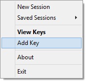
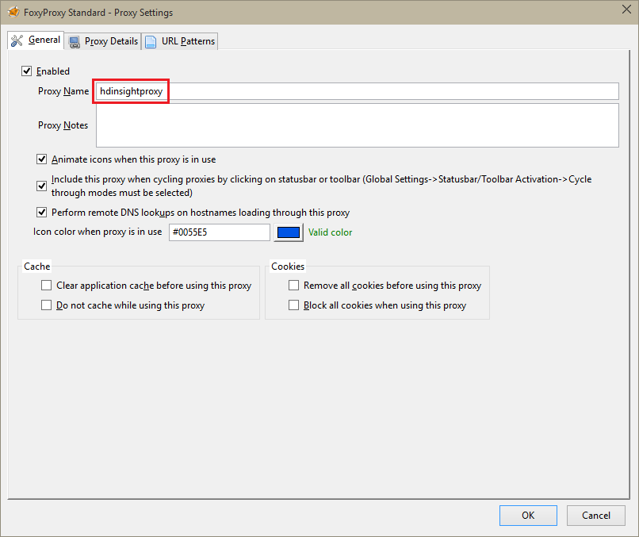

<properties
   pageTitle="Use SSH keys with Hadoop on Linux-based HDInsight from Windows | Aure"
   description="Learn how to create and use SSH keys to authenticate to Linux-based HDInsight clusters."
   services="hdinsight"
   documentationCenter=""
   authors="Blackmist"
   manager="paulettm"
   editor="cgronlun"/>

<tags
   ms.service="hdinsight"
   ms.devlang=""
   ms.topic="article"
   ms.tgt_pltfrm="na"
   ms.workload="big-data"
   ms.date="03/20/2015"
   ms.author="larryfr"/>

#Use SSH with Linux-based Hadoop on HDInsight from Windows (Preview)

Linux-based HDInsight clusters provide the option of securing SSH access using either a password or an SSH key. This document provides information on connecting to HDInsight from Windows clients using the PuTTY SSH client.

> [AZURE.NOTE] The steps in this article assume you are using a Windows client. If you are using a Linux, Unix, or OS X client, see [Use SSH with Linux-based Hadoop on HDInsight from Linux, Unix, or OS X](hdinsight-hadoop-linux-use-ssh-unix.md).

##Prerequisites

* **PuTTY** and **PuTTYGen** for Windows clients. These utilities are available from <a href="http://www.chiark.greenend.org.uk/~sgtatham/putty/download.html" target="_blank">http://www.chiark.greenend.org.uk/~sgtatham/putty/download.html</a>

* A modern web browser that supports HTML5

OR

* <a href="../xplat-cli/" target="_blank">Azure Cross-Platform Command-line Tools</a>

##What is SSH?

SSH is a utility for logging in to, and remotely executing, commands on a remote server. With Linux-based HDInsight, SSH establishes a secure connection to the cluster head node and provides a command-line that you use to type in commands. Commands are then executed directly on the server.

##Create an SSH key (optional)

When creating a Linux-based HDInsight cluster, you have the option of using a password or SSH key to authenticate to the server when using SSH. SSH keys are considered more secure, as they are certificate-based. Use the following information if you plan on using SSH keys with your cluster.

1. Open **PuTTYGen**.

2. For **Type of key to generate**, select **SSH-2 RSA**, then click **Generate**.

	

3. Move the mouse around in the area below the progress bar, until the bar fills. Moving the mouse generates random data that is used to generate the key.

	

	Once the key has been generated, the public key will be displayed.

4. For added security, you can enter a passphrase in the **Key passphrase** field, then type the same value in the **Confirm passphrase** field.

	

	> [AZURE.NOTE] We strongly recommend that you use a secure passphrase for the key. However, if you forget the passphrase, there is no way to recover it.

5. Click **Save private key** to save the key to a **.ppk** file. This key will be used to authenticate to your Linux-based HDInsight cluster.

	> [AZURE.NOTE] You should store this key in a secure location, as it can be used to access your Linux-based HDInsight cluster.

6. Click **Save public key** to save the key as a **.txt** file. This allows you to reuse the public key in the future when you create additional Linux-based HDInsight clusters.

	> [AZURE.NOTE] The public key is also displayed at the top of **PuTTYGen**. You can right-click this field, copy the value, and then paste it into a form, such as the HDInsight wizard in the Azure Management Portal.

##Create a Linux-based HDInsight cluster

When creating a Linux-based HDInsight cluster, you must provide the **public key** created previously. From Windows clients, there are two ways to create a Linux-based HDInsight cluster:

* **Azure Management Portal** - uses a web-based portal to create the cluster

* **Azure Cross-Platform Command-Line Interface (xplat-cli)** - uses command-line commands to create the cluster

Each of these methods will require the **public key**. For complete information on creating an Linux-based HDInsight cluster see <a href="./hdinsight-hadoop-provision-linux-clusters/" target="_blank">Provision Linux-based HDInsight clusters</a>.

###Azure Management Portal

When using the portal to create a Linux-based HDInsight cluster, you must enter a username and password or public key into the following form.

This creates a login for the specified user, and enables either password authentication or SSH key authentication.

###Azure Cross-Platform Command-Line Interface

You can use the <a href="../xplat-cli/" target="_brad">Azure Cross-Platform Command-Line Interface</a>, to create a new cluster using the `azure hdinsight cluzter create` command.

For more information on using this command, see <a href="../hdinsight-hadoop-provision-linux-clusters/" target="_blank">Provision Hadoop Linux clusters in HDInsight using custom options</a>

##Connect to a Linux-based HDInsight cluster

1. Open PuTTY.

	

2. If you provided an **SSH key** when you created your user account, you must perform the following step to select the **private key** to use when authenticating to the cluster.

	In **Category**, expand **Connection**, **SSH**, and select **Auth**. Finally, click **Browse** and select the **.ppk** that contains your **private key**.

	

3. In **Category**, select **Session**. From the **Basic options for your PuTTY session** screen, enter the SSH address of your HDInsight server in the **Host name (or IP address)** field. The SSH address is your cluster name, then **-ssh.azurehdinsight.net**. For example, **mycluster-ssh.azurehdinsight.net**.

	

4. To save the connection information for future use, enter a name for this connection under **Saved Sessions**, then click **Save**. The connection will be added to the list of saved sessions.

5. Click **Open** to connect to the cluster.

	> [AZURE.NOTE] If this is the first time you have connected to the cluster, you will receive a security alert. This is normal - select **Yes** to cache the server's RSA2 key to continue.

6. When prompted, enter the user that you entered when you created the cluster. If you provided a **password** for the user, you will be prompted to enter it also.

###Connect to worker nodes

The worker nodes are not directly accessible from outside the Azure datacenter, but they can be accessed from the cluster head node using SSH.

**If you provided an SSH key when you created your user account**, you must perform the following steps to use the private key when authenticating to the cluster if you want to connect to the worker nodes.

1. Install **Pageant** from <a href="http://www.chiark.greenend.org.uk/~sgtatham/putty/download.html" target="_blank">http://www.chiark.greenend.org.uk/~sgtatham/putty/download.html</a>. This utility is used to cache SSH keys for PuTTY.

2. Run **Pageant**. It will minimize to an icon in the status tray. Right-click the icon and select **Add Key**.

    

3. When the browse dialog appears, select the .ppk file that contains the key, and then select **Open**. This adds the key to Pageant, which will provide it to PuTTY when connecting to the cluster.

> [AZURE.IMPORTANT] If you used an SSH key to secure your account, you must complete the previous steps before you will be able to connect to worker nodes.

4. Open **PuTTY**.

6. If you use an SSH Key to authenticate, in the **Category** section, expand **Connection**, **SSH**, and then select **Auth**.

    In the **Authentication parameters** section, enable **Allow agent forwarding**. This allows PuTTY to automatically pass the certificate authentication through the connection to the cluster head node when connecting to worker nodes.

    

8. Connect to the cluster as documented earlier. If you use an SSH key for authentication, you do not need to select the key - the SSH key added to Pageant will be used to authenticate to the cluster.

4. After the connection has been established, use the following to retrieve a list of the nodes in your cluster. Replace ADMINPASSWORD with the password for your cluster admin account. Replace CLUSTERNAME with the name of your cluster.

        curl --user admin:ADMINPASSWORD https://CLUSTERNAME.azurehdinsight.net/api/v1/hosts

    This will return information in JSON format for the nodes in the cluster, including the `host_name`, which contains the fully qualified domain name (FQDN) for each node. The following is an example of a host_name entry returned by the curl command:

        "host_name" : "workernode0.workernode-0-e2f35e63355b4f15a31c460b6d4e1230.j1.internal.cloudapp.net"

2. Once you have a list of the worker nodes you want to connect to, use the following command from the PuTTY session to open a connection to a worker node.

        ssh USERNAME@FQDN

    Replace USERNAME with your SSH user name and FQDN with the FQDN for the wroker node. For example, `workernode0.workernode-0-e2f35e63355b4f15a31c460b6d4e1230.j1.internal.cloudapp.net`.

    > [AZURE.NOTE] If you use a **password** to authentication your SSH session, you will be prompted to enter the password again. If you use an **SSH key**, the connection should complete without any prompts.

3. Once the session has been established, the prompt for your PuTTY session will change from `username@headnode` to `username@workernode` to indicate that you are connected to the worker node. Any commands you run at this point will run on the worker node.

4. Once you have finished performing actions on the worker node, use the `exit` command to close the session to the worker node. This will return you to the `username@headnode` prompt.

##Add additional accounts

If you need to add additional accounts to your cluster, perform the following steps.

2. Generate a new **public key** and **private key** for the new user account as described previously.

1. From an SSH session to the cluster, add the new user with the following command.

		sudo adduser --disabled-password <username>

	This will create a new user account, but will disable password authentication.

2. Create the directory and files to hold the key using the following commands.

        sudo mkdir -p /home/<username>/.ssh
        sudo touch /home/<username>/.ssh/authorized_keys
        sudo nano /home/<username>/.ssh/authorized_keys

3. When the nano editor opens, copy and paste in the contents of the **public key** for the new user account. Finally, use **Ctrl-X** to save the file and exit the editor.

	

4. Use the following command to change ownership of the .ssh folder and contents to the new user account.

		sudo chown -hR <username>:<username> /home/<username>/.ssh

5. You should now be able to authenticate to the server with the new user account and **private key**.

##SSH Tunneling

SSH can also be used to tunnel local requests, such as web requests, to the HDInsight cluster. The request will then be routed to the requested resource as if it had originated on the HDInsight cluster head node.

This is most useful when accessing web-based services on the HDInsight cluster that use internal domain names for the head or worker nodes in the cluster. For example, some sections of the Ambari web page use internal domain names such as **headnode0.mycluster.d1.internal.cloudapp.net**. These names cannot be resolved from outside the cluster, however requests tunneled over SSH originate inside the cluster and will resolve correctly.

Use the following steps to create an SSH tunnel and configure your browser to use it to connect to the cluster.

1. Open PuTTY, and enter your connection information as documented in the [Connect](#connect) section.

2. In the **Category** section to the left of the dialog, expand **Connection**, **SSH**, and finally select **Tunnels**.

2. Provide the following information on the **Options controlling SSH port forwarding** form.

	* **Source port** - the port on the client that you wish to forward. For example, **9876**

	* **Destination** - the SSH address for the Linux-based HDInsight cluster. For example **mycluster-ssh.azurehdinsight.net**

	* **Dynamic** - enables dynamic SOCKS proxy routing

	

3. Finally, select **Add** to add the settings, then select **Open** to open an SSH connection.

4. When prompted, login to the server. This will establish an SSH session and enable the tunnel.

2. Configure the client program, such as Firefox, to use **localhost:9876** as a **SOCKS v5** proxy. Here's what the Firefox settings look like.

	

	> [AZURE.NOTE] Selecting **Remote DNS** will resolve DNS requests using the HDInsight cluster. If unselected, DNS will be resolved locally.

	You can verify that traffic is being routed through the tunnel by vising a site such as <a href="http://www.whatismyip.com/" target="_blank">http://www.whatismyip.com/</a> with the proxy settings enabled and disabled in Firefox. While enabled, the IP address will be for a machine in the Microsoft Azure datacenter.

###Browser extensions

While configuring the browser to use the tunnel works, you don't usually want to route all traffic over the tunnel. Browser extensions such as <a href="http://getfoxyproxy.org/" target="_blank">FoxyProxy</a>  support pattern matching for URL requests (FoxyProxy Standard or Plus only,) so that only requests for specific URLs will be sent over the tunnel.

If you have installed **FoxyProxy Standard**, use the following steps to configure it to only forward traffic for HDInsight over the tunnel.

1. Open the FoxyProxy extension in your browser. For example, in Firefox, select the FoxyProxy icon next to the address field.

	

2. Select **Add New Proxy**, the **General** tab, and then enter a proxy name of **HDInsight**.

	

3. Select the **Proxy Details tab** and populate the following fields.

	* **Host or IP Address** - localhost, since we are using an SSH tunnel on the local machine

	* **Port** - the port you used for the SSH tunnel

	* **SOCKS Proxy** - select this to enable the browser to use the tunnel as a proxy

	* **SOCKS v5** - Select this to set the required version for the proxy

	

4. Select the **URL Patterns** tab, then select **Add New Pattern**. Use the following to define the pattern, then click **OK**.

	* **Pattern Name** - **headnode** - this is just a friendly name for the pattern

	* **URL pattern** - **\*headnode\*** - this defines a pattern that matches any URL with the word **headnode** in it.

	

4. Select **Ok** to add the proxy and close the **Proxy Settings**

5. At the top of the FoxyProxy dialog, change **Select Mode** to **Use proxies based on their pre-defined patterns and priorities**, then select **Close**.

	

After following these steps, only requests for URLs that contain the string **headnode** will be routed over the SSL tunnel.

##Next steps

Now that you understand how to authenticate using an SSH key, learn how to use MapReduce with Hadoop on HDInsight.

* [Use Hive with HDInsight](hdinsight-use-hive.md)

* [Use Pig with HDInsight](hdinsight-use-pig.md)

* [Use MapReduce jobs with HDInsight](hdinsight-use-mapreduce.md)
