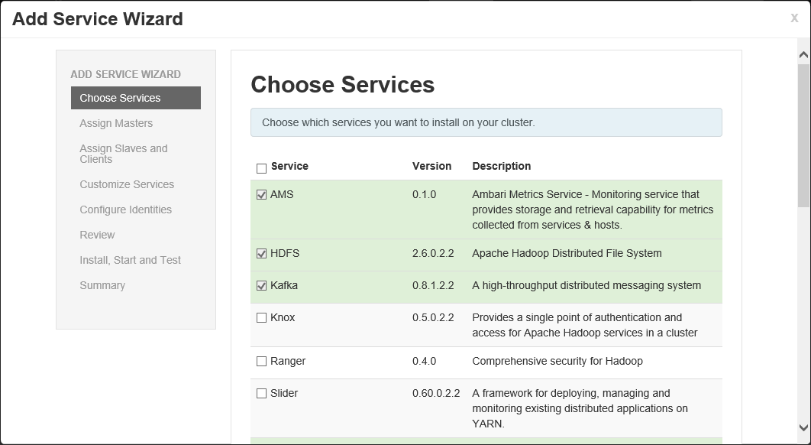

<properties
   pageTitle="Manage HDInsight clusters using Ambari | Microsoft Azure"
   description="Learn how to use Ambari to monitor and manage Linux-based HDInsight clusters."
   services="hdinsight"
   documentationCenter=""
   authors="Blackmist"
   manager="paulettm"
   editor="cgronlun"/>

<tags
   ms.service="hdinsight"
   ms.devlang="na"
   ms.topic="article"
   ms.tgt_pltfrm="na"
   ms.workload="big-data"
   ms.date="02/18/2015"
   ms.author="larryfr"/>

#Manage HDInsight clusters by using Ambari (preview)

Learn how to use Ambari to manage and monitor Linux-based Azure HDInsight clusters.

> [AZURE.NOTE] Much of the information in this article applies only to Linux-based HDInsight clusters. For Windows-based HDInsight clusters, only monitoring through the Ambari REST API is available. See [Monitor Windows-based Hadoop on HDInsight using the Ambari API](hdinsight-monitor-use-ambari-api.md).

##What is Ambari?

<a href="http://ambari.apache.org" target="_blank">Apache Ambari</a> makes Hadoop management simpler by providing an easy-to-use web UI that can be used to provision, manage, and monitor Hadoop clusters. Developers can integrate these capabilities into their applications by using the <a href="https://github.com/apache/ambari/blob/trunk/ambari-server/docs/api/v1/index.md" target="_blank">Ambari REST APIs</a>. 

Ambari is provided by default with Linux-based HDInsight clusters. Windows-based HDInsight clusters provide monitoring functionality through the Ambari REST APIs.

##SSH proxy

> [AZURE.NOTE] While Ambari for your cluster is accessible directly over the Internet, some functionality relies on accessing nodes by the internal domain name used by the cluster. Since this is an internal domain name, and not public, you will receive "server not found" errors when trying to access some features over the Internet.

To work around this problem, use a Secure Shell (SSH) tunnel to proxy web traffic to the cluster head node, which can successfully resolve the internal domain names. Use the following articles to create an SSH tunnel from a port on your local machine to the cluster:

* <a href="../hdinsight-hadoop-linux-use-ssh-unix/#tunnel" target="_blank">Use SSH with Linux-based Hadoop on HDInsight from Linux, Unix, or OS X</a> - Steps on creating an SSH tunnel by using the `ssh` command.

* <a href="../hdinsight-hadoop-linux-use-ssh-windows/#tunnel" target="_blank">Use SSH with Linux-based Hadoop on HDInsight from Windows</a> - Steps on using PuTTY to create an SSH tunnel.

##Ambari web UI

The Ambari web UI is available on each Linux-based HDInsight cluster you create at **https://&lt;clustername>.azurehdinsight.net**. You can also reach this page by using the **Ambari Web** button at the bottom of your cluster dashboard in the Azure portal.

You will be prompted to authenticate to the page twice. The first prompt is to authenticate to the HDInsight cluster, while the second is to authenticate to Ambari.

* **Cluster authentication** - Use the cluster admin user name (the default is **admin**) and password.

* **Ambari authentication** - The default for both user name and password is **admin**.

	> [AZURE.NOTE] If you have changed the password for the **admin** user, you must enter the new password.

When the page opens, note the bar at the top. This contains the following information and controls:

* **Ambari logo** - Opens the dashboard, which can be used to monitor the cluster.

* **Cluster name # ops** - Displays the number of ongoing Ambari operations. Selecting the cluster name or **# ops** will display a list of background operations.

* **# alerts** - Warnings or critical alerts, if any, for the cluster. Selecting this will display a list of alerts.

* **Dashboard** - Displays the dashboard.

* **Services** - Information and configuration settings for the services in the cluster.

* **Hosts** - Information and configuration settings for the nodes in the cluster.

* **Alerts** - A log of information, warnings, and critical alerts.

* **Admin** - Software stack/services that are installed or can be added to the cluster, service account information, and Kerberos security.

* **Admin button** - Ambari management, user settings, and logout.

###Monitoring

####Alerts

Ambari provides many alerts, which will have one of the following as the status:

* **OK**

* **Warning**

* **CRITICAL**

* **UNKNOWN**

Alerts other than **OK** will cause the **# alerts** entry at the top of the page to display the number of alerts. Selecting this entry will display the alerts and their status.

Alerts are organized into several default groups, which can be viewed from the **Alerts** page. 

You can manage the groups by using the **Actions** menu and selecting **Manage Alert Groups**. This allows you to modify existing groups, or create new groups.

You can also create alert notifications from the **Actions** menu. This allows you to create triggers that send notifications via **EMAIL** or **SNMP** when specific alert/severity combinations occur. For example, you can send an alert when any of the alerts in the **YARN Default** group is set to **Critical**.

####Cluster

The **Metrics** tab of the dashboard contains a series of widgets that make it easy to monitor the status of your cluster at a glance. Several widgets, such as **CPU Usage**, provide additional information when clicked.

The **Heatmaps** tab displays metrics as colored heatmaps, going from green to red.

For more detailed information on the nodes within the cluster, select **Hosts**, and then select the specific node you are interested in.

####Services

The **Services** sidebar on the dashboard provides quick insight into the status of the services running on the cluster. Various icons are used to indicate status or actions that should be taken, such as a yellow recycle symbol if a service needs to be recycled.

Selecting a service will display more detailed information on the service.

#####Quick links

Some services display a **Quick Links** link at the top of the page. This can be used to access service-specific web UIs, such as:

* **Job History** - MapReduce job history.

* **Resource Manager** - YARN ResourceManager UI.

* **NameNode** - Hadoop Distributed File System (HDFS) NameNode UI.

* **Oozie Web UI** - Oozie UI.

Selecting any of these links will open a new tab in your browser, which will display the selected page.

> [AZURE.NOTE] Selecting a **Quick Links** link for any service will result in a "server not found" error unless you are using a Secure Sockets Layer (SSL) tunnel to proxy web traffic to the cluster. This is because Ambari uses the internal domain name for these links.
> 
> For information on using an SSL tunnel with HDInsight, see one of the following:
> 
> * <a href="../hdinsight-hadoop-linux-use-ssh-unix/#tunnel" target="_blank">Use SSH with Linux-based Hadoop on HDInsight from Linux, Unix, or OS X</a> - Steps on creating an SSH tunnel by using the `ssh` command.
>
>* <a href="../hdinsight-hadoop-linux-use-ssh-windows/#tunnel" target="_blank">Use SSH with Linux-based Hadoop on HDInsight from Windows</a> - Steps on using PuTTY to create an SSH tunnel.

###Management

####Ambari users, groups, and permissions

Managing users, groups, and permissions should not be used during the Linux-based HDInsight preview.

####Hosts

The **Hosts** page lists all hosts in the cluster. To manage hosts, follow these steps.

> [AZURE.NOTE] Adding, decommissioning or recommissioning a host should not be used with HDInsight clusters.

1. Select the host(s) that you wish to manage.

2. Use the **Actions** menu to select the action that you wish to perform:

	* **Start all components** - Start all components on the host.

	* **Stop all components** - Stop all components on the host.

	* **Restart all components** - Stop and start all components on the host.

	* **Turn on maintenance mode** - Suppresses alerts for the host. This should be enabled if you are performing actions that will generate alerts, such as restarting a service that running services rely on.

	* **Turn off maintenance mode** - Returns the host to normal alerting.

	* **Stop** - Stops DataNode or NodeManagers on the host.

	* **Start** - Starts DataNode or NodeManagers on the host.

	* **Restart** - Stops and starts DataNode or NodeManagers on the host.

	* **Decommission** - Removes a host from the cluster.

		> [AZURE.NOTE] Do not use this action on HDInsight clusters.

	* **Recommission** - Adds a previously decommissioned host to the cluster.

		> [AZURE.NOTE] Do not use this action on HDInsight clusters.

####Services

From the **Dashboard** or **Services** page, use the **Actions** button at the bottom of the list of services to add new services, or to stop and start all services.

The following are the general steps to add a service:

1. From the **Dashboard** or **Services** page, use the **Actions** button and select **Add Service**.

2. From the **Add Service Wizard**, select the service to add, and then click **Next**.

	

3. Continue through the wizard, providing configuration information for the service. Consult the documentation on the specific service you are adding for more information on configuration requirements.

4. From the **Review** page, you can **Print** the configuration information, or **Deploy** the service to the cluster.

5. Once the service has been deployed, the **Install, Start and Test** page will display progress information as the service is installed and tested. Once the **Status** is green, select **Next**.

	

6. The **Summary** page displays a summary of the install process, as well as any possible actions you need to take; for example, restarting other services. Select **Complete** to exit the wizard.

While the **Actions** button can restart all services, often you want to start, stop, or restart a specific service. Use the following steps to perform actions on an individual service:

1. From the **Dashboard** or **Services** page, select a service.

2. From the top of the **Summary** tab, use the **Service Actions** button and select the action to take. This will restart the service on all nodes.

	

	> [AZURE.NOTE] Restarting some services while the cluster is running may generate alerts. To avoid this, you can use the **Service Actions** button to enable **Maintenance mode** for the service before performing the restart.

3. Once an action has been selected, the **# op** entry at the top of the page will increment to show that a background operation is occurring. If configured to display, the list of background operations is displayed.

	> [AZURE.NOTE] If you enabled **Maintenance mode** for the service, remember to disable it by using the **Service Actions** button once the operation has finished.

To configure a service, use the following steps:

1. From the **Dashboard** or **Services** page, select a service.

2. Select the **Configs** tab. The current configuration will be displayed. A list of previous configurations is also displayed.

	

3. Use the fields displayed to modify the configuration, and then select **Save**. Or select a previous configuration and then select **Make current** to roll back to the previous settings.

##REST API

Ambari Web relies on an underlying REST API, which you can leverage to create your own management and monitoring tools. While the API is relatively straightforward to use, there are some Azure specifics to be aware of:

* **Authentication** - The cluster administrator user name (default **admin**) and password should be used to authenticate to the service.

* **Security** - Ambari uses basic authentication, so you should always use Secure HTTP (HTTPS) when communicating with the API.

* **IP Addresses** - The address returned for hosts within a cluster are not accessible from outside the cluster, unless the cluster is a member of an Azure virtual network. Then the IP address will be accessible by other members of the virtual network, but not from outside the network.

* **Some functionality is not enabled** - Some Ambari functionality is disabled, as it is managed by the HDInsight cloud service; for example, adding or removing hosts from the cluster. Other functionality may not be fully implemented during the preview of Linux-based HDInsight.

For a complete reference of the REST API, see [Ambari API Reference V1](https://github.com/apache/ambari/blob/trunk/ambari-server/docs/api/v1/index.md).

