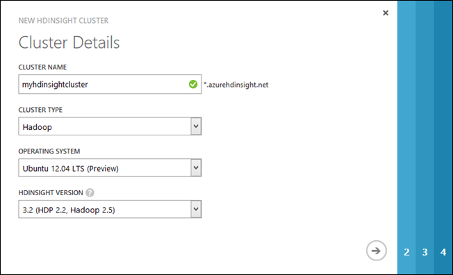
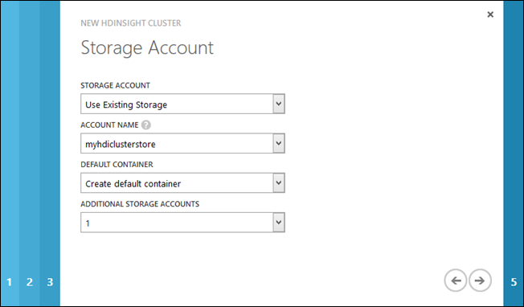
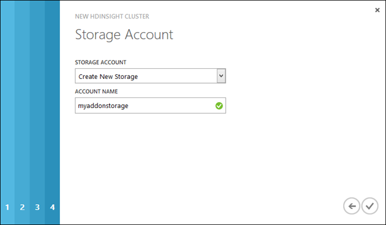

<properties 
   pageTitle="Provision Hadoop clusters on Linux in HDInsight | Azure" 
   description="Learn how to provision Hadoop clusters on Linux for HDInsight using the management portal, the command line, and the .NET SDK." 
   services="hdinsight" 
   documentationCenter="" 
   authors="nitinme" 
   manager="paulettm" 
   editor="cgronlun"/>

<tags
   ms.service="hdinsight"
   ms.devlang="na"
   ms.topic="article"
   ms.tgt_pltfrm="na"
   ms.workload="big-data" 
   ms.date="04/01/2015"
   ms.author="nitinme"/>

#Provision Hadoop Linux clusters in HDInsight using custom options (Preview)

In this article you learn about the different ways to custom-provision an Hadoop Linux cluster on Azure HDInsight - using the Azure Management Portal, PowerShell, or the command line tools, or HDInsight .NET SDK.

## What is an HDInsight cluster?

Have you ever wondered why we mention clusters, every time we talk about Hadoop or BigData? That's because Hadoop enables distributed processing of large data, spread across different nodes of a cluster. The cluster has a master/slave architecture with a master (also called head node or name node) and any number of slaves (also called data node). For more information, see <a href="http://go.microsoft.com/fwlink/?LinkId=510084" target="_blank">Apache Hadoop</a>.

![HDInsight Cluster][img-hdi-cluster]

An HDInsight cluster abstracts the Hadoop implementation details so that you don't need to worry about how to communicate with different nodes of a cluster. When you provision an HDInsight cluster, you provision Azure compute resources that contain Hadoop and related applications. For more information, see [Introduction to Hadoop in HDInsight](../hdinsight-hadoop-introduction/). The data to be churned is stored in Azure Blob storage, also called *Azure Storage - Blob* (or WASB) in the context of HDInsight. For more information, see [Use Azure Blob Storage with HDInsight](../hdinsight-use-blob-storage/).

This article provides instructions on the different ways to provision a cluster. If you are looking at a quick-start approach to provision a cluster, see [Get Started with Azure HDInsight on Linux](../hdinsight-hadoop-linux-get-started).

**Prerequisites:**

Before you begin this article, you must have the following:

- An Azure subscription. Azure is a subscription-based platform. The HDInsight PowerShell cmdlets perform the tasks with your subscription. For more information about obtaining a subscription, see <a href="http://azure.microsoft.com/pricing/purchase-options/" target="_blank">Purchase Options</a>, <a href="http://azure.microsoft.com/pricing/member-offers/" target="_blank">Member Offers</a>, or <a href="http://azure.microsoft.com/pricing/free-trial/" target="_blank">Free Trial</a>.
- SSH keys. If you want to remote into a Linux cluster using SSH with a key instead of a password. Using a key is the recommended method as it is more secure. For instructions on how to generate SSH keys refer to the following articles
	-  From a Linux computer - [Use SSH with Linux-based HDInsight (Hadoop) from Linux, Unix, or OS X](../hdinsight-hadoop-linux-use-ssh-unix).
	-  From a Windows computer - [Use SSH with Linux-based HDInsight (Hadoop) from Windows](../hdinsight-hadoop-linux-use-ssh-windows).

## Configuration options

### Clusters on Linux

HDInsight provides the option of provisioning Linux clusters on Azure. Provision a Linux cluster if you are familiar with Linux or Unix, migrating from an existing Linux-based Hadoop solution, or want easy integration with Hadoop ecosystem components built for Linux. For more information on Azure HDInsight on Linux, see [Introduction to Hadoop on HDInsight](../hdinsight-hadoop-introduction). 

### Additional storage

During configuration, you must specify an Azure Blob Storage account, and a default container. This is used as the default storage location by the cluster. Optionally, you can specify additional blobs that will also be associated with your cluster.

For more information on using secondary blob stores, see [Using Azure Blob Storage with HDInsight](../hdinsight-use-blob-storage/).

### Metastore

The Metastore contains information about Hive tables, partitions, schemas, columns, etc. This information is used by Hive to locate where data is stored on HDFS (or WASB for HDInsight.) By default, Hive uses an embedded database to store this information.

When provisioning an HDInsight cluster, you can specify a SQL Database that will contain the Metastore for Hive. This allows the metadata information to be preserved when you delete a cluster, as it is stored externally in SQL Database.

> [AZURE.NOTE] Currently, the option to use metastores is only available while provisioning HDInsight for Linux using .NET SDK. For instructions, see [Provision HDInsight clusters on Linux using .NET SDK](#sdk).

##  Options for provisioning an HDInsight Linux cluster

You can provision an HDInsight Hadoop Linux cluster from a Linux computer as well as a Windows computer. The following table provides information on the provisioning options available from the different operating systems, and links to instructions for each.

Provision Linux clusters from a computer running this OS| Using Azure Management Portal | Using Cross-platform CLI | Using .NET SDK | Using PowerShell
-----------------| ------------------------| -------------------| ---------- | ---------
Linux| Click [here](#portal) | Click [here](#cli)| Not applicable | Not applicable
Windows | Click [here](#portal) | Click [here](#cli) | Click [here](#sdk) | Click [here](#powershell)

###  Using Azure Management Portal

HDInsight clusters use an Azure Blob Storage container as the default file system. An Azure storage account located on the same data center is required before you can create a HDInsight cluster. For more information, see [Use Azure Blob Storage with HDInsight](../hdinsight-use-blob-storage/). For details on creating an Azure storage account, see [How to Create a Storage Account][azure-create-storageaccount].

> [AZURE.NOTE] Currently, only the **Southeast Asia**, **North Europe**, **East US**, and **South Central US** regions can host HDInsight Linux clusters.

**To create an HDInsight cluster using the custom create option**

1. Sign in to the [Azure Management Portal][azure-management-portal].
2. Click **+ NEW** on the bottom of the page, click **DATA SERVICES**, click **HDINSIGHT**, and then click **CUSTOM CREATE**.
3. On the **Cluster Details** page, type or choose the following values:

	

    <table border='1'>
		<tr><th>Property</th><th>Value</th></tr>
		<tr><td>Cluster name</td>
			<td>
Name the cluster. 

				<ul>
				<li>DNS name must start and end with alpha numeric, may contain dashes.</li>
				<li>The field must be a string between 3 to 63 characters.</li>
				</ul></td></tr>
		<tr><td>Cluster Type</td>
			<td>For cluster type, select <strong>Hadoop</strong>.</td></tr>
		<tr><td>Operating System</td>
			<td>Select <b>Ubuntu 12.04 LTS Preview</b> to provision HDInsight cluster on Linux. To provision a Windows cluster, see <a href="http://azure.microsoft.com/documentation/articles/hdinsight-provision-clusters/" target="_blank">Provision Hadoop clusters on Windows in HDInsight</a>.</td></tr>
		<tr><td>HDInsight version</td>
			<td>Choose the version. For HDInsight on Linux, the default is HDInsight version 3.2, which uses Hadoop 2.5.</td></tr>
		</table>

	Enter or select the values as shown in the table and then click the right arrow.

4. On the **Configure Cluster** page, enter or select the following values:

	<table border="1">
	<tr><th>Name</th><th>Value</th></tr>
	<tr><td>Data nodes</td><td>Number of data nodes you want to deploy. For testing purposes, create a single node cluster.  The cluster size limit varies for Azure subscriptions. Contact Azure billing support to increase the limit.</td></tr>
	<tr><td>Region/Virtual network</td><td>
Choose the same region as the storage account you created earlier. HDInsight clusters require that the storage account be located in the same region. Later in the configuration, you can only choose a storage account that is in the same region as you specified here.

The available regions are: <strong>Southeast Asia</strong>, <strong>North Europe</strong>, <strong>East US</strong>, and <strong>South Central US</strong> 
</td></tr>
	</table>

5. On the **Configure Cluster User** page, provide the following values:

    

    <table border='1'>
		<tr><th>Property</th><th>Value</th></tr>
		<tr><td>HTTP Password</td>
			<td>Specify the password for the default HTTP user, <i>admin</i>.</td></tr>
		<tr><td>SSH user name</td>
			<td>Specify SSH user name. You will use this username to initiate a remote SSH session on the HDInsight cluster nodes.</td></tr>
		<tr><td>SSH authentication type</td>
			<td>Specify whether you want to use a password or an SSH key to authenticate an SSH user</td></tr>
		<tr><td>SSH Password</td>
			<td>If you chose a password as authentication type, specify the SSH password to authenticate an SSH user. You will be prompted for this password when you try to initiate an SSH session on the remote Linux machine.</td></tr>
		<tr><td>SSH public key</td>
			<td>If you chose a key as authentication type, specify the SSH public key that you must have already generated. When you initiate an SSH session with a node in the Linux cluster, you will use the private key associated with this public key. 
			For instructions on how to generate an SSH key on a Linux computer, see <a href="http://azure.microsoft.com/documentation/articles/hdinsight-hadoop-linux-use-ssh-unix/" target="_blank">here</a>. For instructions on how to generate an SSH key on a Windows computer, see <a href="http://azure.microsoft.com/documentation/articles/hdinsight-hadoop-linux-use-ssh-windows/" target="_blank">here</a>.
		</td></tr>
		</table>

	> [AZURE.NOTE] We recommend using SSH public key authentication with SSH as it is more secure than password authentication.

	Click the right arrow.

6. On the **Storage Account** page, provide the following value:

    

	<table border='1'>
		<tr><th>Property</th><th>Value</th></tr>
		<tr><td>Storage Account</td>
			<td>Specify the Azure storage account that will be used as the default file system for the HDInsight cluster. You can choose one of the three options:
			<ul>
				<li>Use Existing Storage</li>
				<li>Create New Storage</li>
				<li>Use Storage From Another Subscription</li>
			</ul>
			</td></tr>
		<tr><td>Account Name</td>
			<td><ul>
				<li>If you chose to use existing storage, for <strong>Account name</strong>, select an existing storage account. The drop-down only lists the storage accounts located in the same data center where you chose to provision the cluster.</li>
				<li>If you chose <strong>Create new storage</strong> or <strong>Use storage from another subscription</strong> option, you must provide the storage account name.</li>
			</ul></td></tr>
		<tr><td>Account Key</td>
			<td>If you chose the <strong>Use Storage From Another Subscription</strong> option, specify the account key for that storage account.</td></tr>
		<tr><td>Default container</td>
			<td>
Specifies the default container on the storage account that is used as the default file system for the HDInsight cluster. If you chose <strong>Use Existing Storage</strong> for the <strong>Storage Account</strong> field, and there are no existing containers in that account, the container is created by default with a the same name as the cluster name. If a container with the name of the cluster already exists, a sequence number will be appended to the container name. For example, mycontainer1, mycontainer2, and so on. However, if the existing storage account has a container with a name different from the cluster name you specified, you can use that container as well.

            
If you chose to create a new storage or use storage from another Azure subscription, you must specify the default container name.

        </td></tr>
		<tr><td>Additional Storage Accounts</td>
			<td>HDInsight supports multiple storage accounts. There is no limit on the additional storage account that can be used by a cluster. However, if you create a cluster using the Management Portal, you have a limit of seven due to the UI constraints. Each additional storage account you specify adds an extra Storage Account page to the wizard where you can specify the account information. For example, in the screenshot above, one additional storage account is selected, and hence page 5 is added to the dialog.</td></tr>
	</table>

	Click the right arrow.

7. If you chose to configure additional storage for the cluster, on the **Storage Account** page, enter the account information for the additional storage account:

	

    Here again, you have the option to choose from existing storage, create new storage, or use storage from another Azure subscription. The procedure to provide the values is similar to the previous step.

    > [AZURE.NOTE] Once an Azure storage account is chosen for your HDInsight cluster, you can neither delete the account, nor change the account to a different account.

 	After you specified the additional storage account, click the check mark to start provisioning the cluster. 

### Using Cross-platform command line

Another option for provisioning an HDInsight cluster is the Cross-platform Command-line Interface. The command-line tool is implemented in Node.js. It can be used on any platform that supports Node.js including Windows, Mac and Linux. You can install the CLI from the following locations:

- **Node.JS SDK** - <a href="https://www.npmjs.com/package/azure-mgmt-hdinsight" target="_blank">https://www.npmjs.com/package/azure-mgmt-hdinsight</a>
- **Cross-platform CLI** - <a href="https://github.com/Azure/azure-xplat-cli/archive/hdinsight-February-18-2015.tar.gz" target="_blank">https://github.com/Azure/azure-xplat-cli/archive/hdinsight-February-18-2015.tar.gz</a>  

For a general guide on how to use the command-line interface, see [Azure command-line tool for Mac and Linux][azure-command-line-tools].

Instructions below guide you on how to install the cross-platform command line on Linux and Windows, and then how to use the command line to provision a cluster.

- [Set up Azure cross-platform command line for Linux](#clilin)
- [Set up Azure cross-platform command line for Windows](#cliwin)
- [Provision HDInsight clusters using Azure cross-platform command-line](#cliprovision)

#### Set up cross-platform command line for Linux

Perform the following procedures to set up your Linux computer to use use Azure command-line tools.

- Install cross-platform command line using NPM
- Connect to your Azure subscription

**To install the command-line interface using NPM**

1.	Open a terminal window on your Linux computer and run the following command:

		sudo npm install -g https://github.com/Azure/azure-xplat-cli/archive/hdinsight-February-18-2015.tar.gz

2.	Run the following command to verify the installation:

		azure hdinsight -h

	You can use the *-h* switch at different levels to display the help information. For example:

		azure -h
		azure hdinsight -h
		azure hdinsight cluster -h
		azure hdinsight cluster create -h

**To connect to your Azure subscription**

Before using the command-line interface, you must configure connectivity between your workstation and Azure. Your Azure subscription information is used by the command-line interface to connect to your account. This information can be obtained from Azure in a publish settings file. The publish settings file can then be imported as a persistent local config setting that the command-line interface will use for subsequent operations. You only need to import your publish settings once.

> [AZURE.NOTE] The publish settings file contains sensitive information. Microsoft recommends that you delete the file or take additional steps to encrypt the user folder that contains the file. On Windows, modify the folder properties or use BitLocker. 

1.	Open a terminal window.
2.	Run the following command to log into your azure subscription.

		azure account download

	

	The command launches the Web page to download the publish settings file from. If the Web page does not open, click the link in the terminal window to open the browser page and log in to the portal. 

3.	Download the publish settings file to the computer.
5.	From the command prompt window, run the following command to import the publish settings file:

		azure account import <path/to/the/file>

	
#### Set up cross-platform command line for Windows

Perform the following procedures to set up your Windows computer to use use Azure command-line tools.

- Install cross-platform command line (using NPM or Windows installer)
- Download and import Azure account publish settings

The command-line interface can be installed using *Node.js Package Manager (NPM)* or Windows Installer. Microsoft recommends that you install using only one of the two options.

**To install the command-line interface using NPM**

1.	Browse to **www.nodejs.org**.
2.	Click **INSTALL** and following the instructions using the default settings.
3.	Open **Command Prompt** (or *Azure Command Prompt*, or *Developer Command Prompt for VS2012*) from your workstation.
4.	Run the following command in the command prompt window.

		npm install -g https://github.com/Azure/azure-xplat-cli/archive/hdinsight-February-18-2015.tar.gz

	> [AZURE.NOTE] If you get an error saying the NPM command is not found, verify the following paths are in the PATH environment variable: <i>C:\Program Files (x86)\nodejs;C:\Users\[username]\AppData\Roaming\npm</i> or <i>C:\Program Files\nodejs;C:\Users\[username]\AppData\Roaming\npm</i>

5.	Run the following command to verify the installation:

		azure hdinsight -h

	You can use the *-h* switch at different levels to display the help information. For example:

		azure -h
		azure hdinsight -h
		azure hdinsight cluster -h
		azure hdinsight cluster create -h

**To install the command-line interface using windows installer**

1.	Browse to **http://azure.microsoft.com/downloads/**.
2.	Scroll down to the **Command line tools** section, and then click **Cross-platform Command Line Interface** and follow the Web Platform Installer wizard.

**To download and import publish settings**

Before using the command-line interface, you must configure connectivity between your workstation and Azure. Your Azure subscription information is used by the command-line interface to connect to your account. This information can be obtained from Azure in a publish settings file. The publish settings file can then be imported as a persistent local config setting that the command-line interface will use for subsequent operations. You only need to import your publish settings once.

> [AZURE.NOTE] The publish settings file contains sensitive information. Microsoft recommends that you delete the file or take additional steps to encrypt the user folder that contains the file. On Windows, modify the folder properties or use BitLocker.

1.	Open a **Command Prompt**.
2.	Run the following command to download the publish settings file.

		azure account download

	The command launches the Web page to download the publish settings file from.

3.	At the prompt to save the file, click **Save** and provide a location where the file must be saved.
5.	From the command prompt window, run the following command to import the publish settings file:

		azure account import <path/to/the/file>

	![HDI.CLIAccountDownloadImport][image-cli-account-download-import]

	
#### Provision HDInsight clusters using Azure cross-platform command-line

The following procedures are needed to provision an HDInsight cluster using Cross-platform command line:

- Create an Azure Storage account
- Provision a cluster

**To create an Azure storage account**

HDInsight uses an Azure Blob Storage container as the default file system. An Azure storage account is required before you can create an HDInsight cluster. The storage account must be located in the same data center.

- From the command prompt window, run the following command to create an Azure storage account:

		azure storage account create [options] <StorageAccountName>

	When prompted for a location, select a location where an HDInsight Linux cluster can be provisioned. The storage must be in the same location as the HDInsight cluster. Currently, only **Southeast Asia**, **North Europe**, **East US**, and **South Central US** regions can host HDInsight Linux clusters.  

For information on creating an Azure storage account using Azure Management portal, see [Create, manage, or delete a storage account][azure-create-storageaccount].

If you already have a storage account but do not know the account name and account key, you can use the following commands to retrieve the information:

	-- lists storage accounts
	azure storage account list

	-- Shows information for a storage account
	azure storage account show <StorageAccountName>

	-- Lists the keys for a storage account
	azure storage account keys list <StorageAccountName>

For details on getting the information using the management portal, see the *How to: View, copy and regenerate storage access keys* section of [Create, manage, or delete a storage account][azure-create-storageaccount].

An HDInsight cluster also requires a container within a storage account. If the storage account you provide does not already have a container, the *azure hdinsight cluster create* prompts you for a container name and creates it as well. However, if you want to create the container beforehand, you can use the following command:

	azure storage container create --account-name <StorageAccountName> --account-key <StorageAccountKey> [ContainerName]

Once you have the storage account and the blob container prepared, you are ready to create a cluster.

**To provision an HDInsight cluster**

- From the command prompt window, run the following command:

		azure hdinsight cluster create --clusterName <ClusterName> --storageAccountName "<StorageAccountName>.blob.core.windows.net" --storageAccountKey <StorageAccountKey> --storageContainer <StorageContainerName> --dataNodeCount <NumberOfNodes> --location <DataCenterLocation> --userName <HDInsightClusterUsername> --password <HDInsightClusterPassword> --osType linux --sshUserName <SSH username> --sshPassword <SSH user password>

	>[AZURE.NOTE] The values you specify for **--userName** and **--password** are for the Hadoop user. For Hadoop user, you must always specify --userName as "admin". 		

	![HDI.CLIClusterCreation][image-cli-clustercreation]

**To provision an HDInsight cluster using a configuration file**

Typically, you provision an HDInsight cluster, run the jobs, and then delete the cluster to cut down the cost. The command-line interface gives you the option to save the configurations into a file, so that you can reuse it every time you provision a cluster.

- From the command prompt window, run the following commands:

		#Create the config file
		azure hdinsight cluster config create <file>

		#Add commands to create a basic cluster. Make sure you specify --userName as "admin"
		azure hdinsight cluster config set <file> --clusterName <ClusterName> --dataNodeCount <NumberOfNodes> --location "<DataCenterLocation>" --storageAccountName "<StorageAccountName>.blob.core.windows.net" --storageAccountKey "<StorageAccountKey>" --storageContainer "<BlobContainerName>" --userName "<Username>" --password "<UserPassword>" --osType linux --sshUserName <SSH username> --sshPassword <SSH user password>

		#If requred, include commands to use additional blob storage with the cluster
		azure hdinsight cluster config storage add <file> --storageAccountName "<StorageAccountName>.blob.core.windows.net"
		       --storageAccountKey "<StorageAccountKey>"

		#Run this command to create a cluster using the config file
		azure hdinsight cluster create --config <file>

	>[AZURE.NOTE] The Azure SQL database used for the metastore must allow connectivity to other Azure services, including Azure HDInsight. On the Azure SQL database dashboard, on the right side click the server name. This is the server on which the SQL database instance is running. Once you are on the server view, click **Configure**, and then for **Azure Services**, click **Yes**, and then click **Save**.

	![HDI.CLIClusterCreationConfig][image-cli-clustercreation-config]

**To list and show cluster details**

- Use the following commands to list and show cluster details:

		azure hdinsight cluster list
		azure hdinsight cluster show <ClusterName>

	![HDI.CLIListCluster][image-cli-clusterlisting]

**To delete a cluster**

- Use the following command to delete a cluster:

		azure hdinsight cluster delete <ClusterName>

### Using Azure PowerShell
Azure PowerShell is a powerful scripting environment that you can use to control and automate the deployment and management of your workloads in Azure. This section provides instructions on how to provision an HDInsight cluster by using Azure PowerShell. For information on configuring a workstation to run HDInsight PowerShell cmdlets, see [Install and configure Azure PowerShell][powershell-install-configure]. For more information on using Azure PowerShell with HDInsight, see [Administer HDInsight using PowerShell][hdinsight-admin-powershell]. For the list of the HDInsight Windows PowerShell cmdlets, see [HDInsight cmdlet reference][hdinsight-powershell-reference].

The following procedures are needed to provision an HDInsight cluster by using Azure PowerShell:

- Create an Azure Storage account
- Create an Azure Blob container
- Create an HDInsight cluster

You can use either the Windows PowerShell console or the Windows PowerShell Integrated Scripting Environment (ISE) to run the scripts.
 
HDInsight uses an Azure Blob storage container as the default file system. An Azure Storage account and storage container are required before you can create an HDInsight cluster. The Storage account must be located in the same data center as the HDInsight cluster. Currently, only the **Southeast Asia**, **North Europe**, **East US**, and **South Central US** regions can host HDInsight Linux clusters.

**To connect to your Azure account**

		Add-AzureAccount 

You will be prompted to enter your Azure account credentials.

**To create an Azure Storage account**

		$storageAccountName = "<StorageAcccountName>"	# Provide a Storage account name
		$location = "<MicrosoftDataCenter>"				# For example, "West US"

		# Create an Azure Storage account
		New-AzureStorageAccount -StorageAccountName $storageAccountName -Location $location

If you already have a Storage account but do not know the account name and account key, you can use the following Windows PowerShell commands to retrieve the information:

		# List Storage accounts for the current subscription
		Get-AzureStorageAccount

		# List the keys for a Storage account
		Get-AzureStorageKey "<StorageAccountName>"

**To create Azure Blob storage container**

		$storageAccountName = "<StorageAccountName>"	# Provide the Storage account name
		$containerName="<ContainerName>"				# Provide a container name

		# Create a storage context object
		$storageAccountKey = Get-AzureStorageKey $storageAccountName | %{ $_.Primary }
		$destContext = New-AzureStorageContext -StorageAccountName $storageAccountName
		                                       -StorageAccountKey $storageAccountKey  

		# Create a Blob storage container
		New-AzureStorageContainer -Name $containerName -Context $destContext

Once you have the Storage account and the Blob container prepared, you are ready to create a cluster.

**To provision an HDInsight cluster**

The two most important parameters that you must set to provision Linux clusters are the ones where you specify the OS type and the SSH user details:
- Make sure you specify the **-OSType** parameter as **Linux**.
- To use SSH for remote sessions on the clusters, you can specify either SSH user password or the SSH public key. If you specify both the SSH user password and the SSH public key, the key will be ignored. If you want to use the SSH key for remote sessions, you must specify a blank SSH password when prompted for one.

		$subscriptionName = "<AzureSubscriptionName>"	  # The Azure subscription used for the HDInsight cluster to be created

		$storageAccountName = "<AzureStorageAccountName>" # HDInsight cluster requires an existing Azure Storage account to be used as the default file system

		$clusterName = "<HDInsightClusterName>"			  # The name for the HDInsight cluster to be created
		$clusterNodes = <ClusterSizeInNodes>              # The number of nodes in the HDInsight cluster
        $containerName = $clusterName					  # Azure Blob container that is used as the default file system for the HDInsight cluster
		
		
		# Get the credentials for HTTP and SSH users for the cluster
		$clusterCredentials = Get-Credential            	  # Make sure you specify the username as "admin". This is the Hadoop user name and password for the cluster. You will use this account to connect to the cluster. 
        $sshCredentials = Get-Credential				      # SSH user name for the cluster. You will use this account to start an SSH session on the remote cluster.
		$sshPublicKey = "<SSH public key>"           

		# Get the storage primary key based on the account name
		Select-AzureSubscription $subscriptionName
		$storageAccountKey = Get-AzureStorageKey $storageAccountName | %{ $_.Primary }
		
        # The location of the HDInsight cluster. It must be in the same data center as the Storage account.
        $location = Get-AzureStorageAccount -StorageAccountName $storageAccountName | %{$_.Location} 

		# Create a new HDInsight cluster
		New-AzureHDInsightCluster -Name $clusterName -Credential $clusterCredentials -Location $location -DefaultStorageAccountName "$storageAccountName.blob.core.windows.net" -DefaultStorageAccountKey $storageAccountKey -DefaultStorageContainerName $containerName  -ClusterSizeInNodes $clusterNodes -Version "3.2" -OSType Linux -SshCredential $sshCredentials -SshPublicKey $sshPublicKey

	>[AZURE.NOTE] The values you specify for **$clusterCredentials** are used to create the Hadoop user account for the cluster. You will use this account to connect to the cluster. The values you specify for the **$sshCredentials** are used to create the SSH user for the cluster. You use this account to start a remote SSH session on the cluster and run jobs. If you use the Quick Create option from the Azure portal to provision a cluster, the default Hadoop user name is "admin" and default SSH user name is "hdiuser".

	It can take several minutes before the cluster provisioning finishes.

	![HDI.CLI.Provision][image-hdi-ps-provision]

**To provision an HDInsight cluster by using custom configuration options**

While provisioning a cluster, you can use the other configuration options such as connecting to more than one Azure Blob storage container or using an Azure SQL database for Hive and Oozie metastores. This allows you to separate the lifetime of your data and metadata from the lifetime of the cluster.

The two most important parameters that you must set to provision Linux clusters are the ones where you specify the OS type and the SSH user details:
- Make sure you specify the **-OSType** parameter as **Linux**.
- To use SSH for remote sessions on the clusters, you can specify either SSH user password or the SSH public key. If you specify both the SSH user password and the SSH public key, the key will be ignored. If you want to use the SSH key for remote sessions, you must specify a blank SSH password when prompted for one.

		$subscriptionName = "<AzureSubscriptionName>"	  # The Azure subscription used for the HDInsight cluster to be created
		$clusterName = "<HDInsightClusterName>"			  # The name for the HDInsight cluster to be created
		$clusterNodes = <ClusterSizeInNodes>              # The number of nodes in the HDInsight cluster
        		
		# Get the credentials for HTTP user, SSH user, and Hive/Oozie metastore databases for the cluster
		$clusterCredentials = Get-Credential            	  # Make sure you specify the username as "admin". This is the Hadoop user name and password for the cluster. You will use this account to connect to the cluster. 
        $sshCredentials = Get-Credential				      # SSH user name for the cluster. You will use this account to start an SSH session on the remote cluster.
		$sshPublicKey = "<SSH public key>"
		$oozieCreds = Get-Credential -Message "Oozie metastore"
		$hiveCreds = Get-Credential -Message "Hive metastore"

		$storageAccountName_Default = "<DefaultFileSystemStorageAccountName>"
		$containerName_Default = $clusterName
		$storageAccountName_Add1 = "<AdditionalStorageAccountName>"

		$hiveSQLDatabaseServerName = "<SQLDatabaseServerNameForHiveMetastore>"
		$hiveSQLDatabaseName = "<SQLDatabaseDatabaseNameForHiveMetastore>"
		$oozieSQLDatabaseServerName = "<SQLDatabaseServerNameForOozieMetastore>"
		$oozieSQLDatabaseName = "<SQLDatabaseDatabaseNameForOozieMetastore>"

		# Get the Storage account keys
		Select-AzureSubscription $subscriptionName
		$storageAccountKey_Default = Get-AzureStorageKey $storageAccountName_Default | %{ $_.Primary }
		$storageAccountKey_Add1 = Get-AzureStorageKey $storageAccountName_Add1 | %{ $_.Primary }

		# The location of the HDInsight cluster. It must be in the same data center as the Storage account.
        $location = Get-AzureStorageAccount -StorageAccountName $storageAccountName_Default | %{$_.Location}

		# Create a cluster configuration file
		$config = New-AzureHDInsightClusterConfig -ClusterSizeInNodes $clusterNodes | Set-AzureHDInsightDefaultStorage -StorageAccountName "$storageAccountName_Default.blob.core.windows.net" -StorageAccountKey $storageAccountKey_Default -StorageContainerName $containerName_Default | Add-AzureHDInsightStorage -StorageAccountName "$storageAccountName_Add1.blob.core.windows.net" -StorageAccountKey $storageAccountKey_Add1 | Add-AzureHDInsightMetastore -SqlAzureServerName "$hiveSQLDatabaseServerName.database.windows.net" -DatabaseName $hiveSQLDatabaseName -Credential $hiveCreds -MetastoreType HiveMetastore | Add-AzureHDInsightMetastore -SqlAzureServerName "$oozieSQLDatabaseServerName.database.windows.net" -DatabaseName $oozieSQLDatabaseName -Credential $oozieCreds -MetastoreType OozieMetastore
		        
		# Create the cluster
		New-AzureHDInsightCluster -Name $clusterName -Config $config -Credential $clusterCredentials -Location $clusterLocation -Version "3.2" -OSType Linux -SshCredential $sshCredentials -SshPublicKey $sshPublicKey

	>[AZURE.NOTE] The Azure SQL database used for the metastore must allow connectivity to other Azure services, including Azure HDInsight. On the Azure SQL database dashboard, on the right side, click the server name. This is the server on which the SQL database instance is running. Once you are on the server view, click **Configure**, and then for **Azure Services**, click **Yes**, and then click **Save**.

	It can take several minutes before the cluster provisioning finishes.

	![HDI.CLI.Provision][image-hdi-ps-config-provision]

### Using HDInsight .NET SDK
The HDInsight .NET SDK provides .NET client libraries that makes it easier to work with HDInsight from a .NET application.

The following procedures must be performed to provision an HDInsight cluster on Linux using the SDK:

- Install HDInsight .NET SDK
- Create a self-signed certificate
- Create a console application
- Run the application

**To install HDInsight .NET SDK**

You can install latest published build of the SDK from [NuGet](http://nuget.codeplex.com/wikipage?title=Getting%20Started). The instructions will be shown in the next procedure.

**To create a self-signed certificate**

Create a self-signed certificate, install it on your workstation, and upload it to your Azure subscription. For instructions, see [Create a self-signed certificate](http://go.microsoft.com/fwlink/?LinkId=511138).

**To create a Visual Studio console application**

1. Open Visual Studio 2013.

2. From the File menu, click **New**, and then click **Project**.

3. From New Project, type or select the following values:

	<table style="border-color: #c6c6c6; border-width: 2px; border-style: solid; border-collapse: collapse;">
	<tr>
	<th style="border-color: #c6c6c6; border-width: 2px; border-style: solid; border-collapse: collapse; width:90px; padding-left:5px; padding-right:5px;">Property</th>
	<th style="border-color: #c6c6c6; border-width: 2px; border-style: solid; border-collapse: collapse; width:90px; padding-left:5px; padding-right:5px;">Value</th></tr>
	<tr>
	<td style="border-color: #c6c6c6; border-width: 2px; border-style: solid; border-collapse: collapse; padding-left:5px;">Category</td>
	<td style="border-color: #c6c6c6; border-width: 2px; border-style: solid; border-collapse: collapse; padding-left:5px; padding-right:5px;">Templates/Visual C#/Windows</td></tr>
	<tr>
	<td style="border-color: #c6c6c6; border-width: 2px; border-style: solid; border-collapse: collapse; padding-left:5px;">Template</td>
	<td style="border-color: #c6c6c6; border-width: 2px; border-style: solid; border-collapse: collapse; padding-left:5px;">Console Application</td></tr>
	<tr>
	<td style="border-color: #c6c6c6; border-width: 2px; border-style: solid; border-collapse: collapse; padding-left:5px;">Name</td>
	<td style="border-color: #c6c6c6; border-width: 2px; border-style: solid; border-collapse: collapse; padding-left:5px;">CreateHDICluster</td></tr>
	</table>

4. Click **OK** to create the project.

5. From the **Tools** menu, click **Nuget Package Manager**, and then click **Package Manager Console**.

6. Run the following commands in the console to install the packages.

		Install-Package Microsoft.WindowsAzure.Management.HDInsight

	This command adds .NET libraries and references to them to the current Visual Studio project.

7. From Solution Explorer, double-click **Program.cs** to open it.

8. Add the following using statements to the top of the file:

		using System.Security.Cryptography.X509Certificates;
		using Microsoft.WindowsAzure.Management.HDInsight;
		using Microsoft.WindowsAzure.Management.HDInsight.ClusterProvisioning;

9. In the Main() function, copy and paste the following code:

	> [AZURE.NOTE] Make sure the location you specify should be one of these: **Southeast Asia**, **North Europe**, **East US**, and **South Central US** regions can host HDInsight Linux clusters. The storage account you provide should also be in the same region.

        string thumbprint = "<CertificateThumbprint>";  
        string subscriptionid = "<AzureSubscriptionID>";
        string clustername = "<HDInsightClusterName>";
        string location = "<MicrosoftDataCenter>";
        string storageaccountname = "<AzureStorageAccountName>.blob.core.windows.net";
        string storageaccountkey = "<AzureStorageAccountKey>";
        string containername = "<HDInsightDefaultContainerName>";
        string username = "<HDInsightUsername>";		# Make sure you specify this username as "admin"
        string password = "<HDInsightUserPassword>";
        int clustersize = <NumberOfNodesInTheCluster>;
		string version = "<version>";
        string sshusername = "<ssh user name>";
        string sshpublickey = "<ssh public key>;
		
		// If required, provide details of the Hive and Oozie metastore that you want to configure. ServerName is the name of the server on which the SQL databases are provisioned. HiveStoreSqlDatabaseName and OozieStoreSqlDatabaseName are the names of databases created on the server. You can also use the same database for both Hive and Oozie metastores
		Metastore hiveMetastore = new Metastore("<ServerName>.database.windows.net", "<HiveStoreSqlDatabaseName>", "<SqlDatabaseUser>", "<SqlDatabasePassword>");
        Metastore oozieMetastore = new Metastore("<ServerName>.database.windows.net", "<OozieStoreSqlDatabaseName>", "<SqlDatabaseUser>", "<SqlDatabasePassword>");

        // Get the certificate object from certificate store using the friendly name to identify it
        X509Store store = new X509Store();
        store.Open(OpenFlags.ReadOnly);
        X509Certificate2 cert = store.Certificates.Cast<X509Certificate2>().First(item => item.Thumbprint == thumbprint);

        // Create an HDInsightClient object
        HDInsightCertificateCredential creds = new HDInsightCertificateCredential(new Guid(subscriptionid), cert);
        var client = HDInsightClient.Connect(creds);

		// Supply th cluster information
        ClusterCreateParametersV2 clusterInfo = new ClusterCreateParametersV2()
        {
            Name = clustername,
            Location = location,
            DefaultStorageAccountName = storageaccountname,
            DefaultStorageAccountKey = storageaccountkey,
            DefaultStorageContainer = containername,
            UserName = username,
            Password = password,
            ClusterSizeInNodes = clustersize
			Version = version,
            OSType = OSType.Linux,
            SshUserName = sshusername,
            SshPublicKey = sshpublickey,
			HiveMetastore = hiveMetastore,		//only if you created a hivemetastore object earlier
            OozieMetastore = oozieMetastore		//only if you created an ooziemetastore object earlier
        };

		// Configure Hive and Oozie if you opted for the metastores earlier
		clusterInfo.HiveConfiguration.ConfigurationCollection.Add(new KeyValuePair<string, string>("datanucleus.connectionPoolingType", "none"));
		clusterInfo.OozieConfiguration.ConfigurationCollection.Add(new KeyValuePair<string, string>("oozie.service.AuthorizationService.security.enabled", "false"));
        

		// Create the cluster
        Console.WriteLine("Creating the HDInsight cluster ...");

        ClusterDetails cluster = client.CreateCluster(clusterInfo);

        Console.WriteLine("Created cluster: {0}.", cluster.ConnectionUrl);
        Console.WriteLine("Press ENTER to continue.");
        Console.ReadKey();

10. Replace the variables at the beginning of the main() function.

**To run the application**

While the application is open in Visual Studio, press **F5** to run the application. A console window should open and display the status of the application. It can take several minutes to create an HDInsight cluster.

## Next steps
In this article, you have learned several ways to provision an HDInsight Hadoop cluster on Linux. To learn more, see the following articles:

- [Working with HDInsight on Linux](../hdinsight-hadoop-linux-information). Get to know the nuances of working with an HDInsight cluster on Linux.
- [Manage HDInsight clusters using Ambari](../hdinsight-hadoop-manage-ambari). Learn how to monitor and manage your Linux-based Hadoop on HDInsight cluster using Ambari Web, or the Ambari REST API. 
- [Use MapReduce with HDInsight][hdinsight-use-mapreduce]. Learn about the different ways to run MapReduce jobs on a cluster.
- [Use Hive with HDInsight][hdinsight-use-hive]. Learn about the different way of running a Hive query on a cluster.
- [Use Pig with HDInsight][hdinsight-use-pig]. Learn about the different ways of running a Pig job on a cluster.
- [Use Azure Blob storage with HDInsight](../hdinsight-use-blob-storage). Learn how HDInsight uses Azure Blob storage to store data for HDInsight clusters.
- [Upload data to HDInsight][hdinsight-upload-data]. Learn how to work with data stored in an Azure Blob storage for an HDInsight cluster.

[hdinsight-use-mapreduce]: ../hdinsight-use-mapreduce/
[hdinsight-use-hive]: ../hdinsight-use-hive/
[hdinsight-use-pig]: ../hdinsight-use-pig/
[hdinsight-upload-data]: ../hdinsight-upload-data/
[hdinsight-sdk-documentation]: http://msdn.microsoft.com/library/dn479185.aspx
[hdinsight-hbase-custom-provision]: http://azure.microsoft.com/documentation/articles/hdinsight-hbase-get-started/

[hdinsight-customize-cluster]: ../hdinsight-hadoop-customize-cluster/
[hdinsight-get-started]: ../hdinsight-get-started/
[hdinsight-admin-powershell]: ../hdinsight-administer-use-powershell/

[hdinsight-submit-jobs]: ../hdinsight-submit-hadoop-jobs-programmatically/
[hdinsight-powershell-reference]: http://msdn.microsoft.com/library/windowsazure/dn479228.aspx

[azure-management-portal]: https://manage.windowsazure.com/

[azure-command-line-tools]: ../xplat-cli/
[azure-create-storageaccount]: ../storage-create-storage-account/

[azure-purchase-options]: http://azure.microsoft.com/pricing/purchase-options/
[azure-member-offers]: http://azure.microsoft.com/pricing/member-offers/
[azure-free-trial]: http://azure.microsoft.com/pricing/free-trial/
[hdi-remote]: http://azure.microsoft.com/documentation/articles/hdinsight-administer-use-management-portal/#rdp

[Powershell-install-configure]: ../install-configure-powershell/

[image-hdi-customcreatecluster]: ./media/hdinsight-get-started/HDI.CustomCreateCluster.png
[image-hdi-customcreatecluster-clusteruser]: ./media/hdinsight-get-started/HDI.CustomCreateCluster.ClusterUser.png
[image-hdi-customcreatecluster-storageaccount]: ./media/hdinsight-get-started/HDI.CustomCreateCluster.StorageAccount.png
[image-hdi-customcreatecluster-addonstorage]: ./media/hdinsight-get-started/HDI.CustomCreateCluster.AddOnStorage.png

[image-cli-account-download-import]: ./media/hdinsight-hadoop-provision-linux-clusters/HDI.CLIAccountDownloadImport.png
[image-cli-clustercreation]: ./media/hdinsight-hadoop-provision-linux-clusters/HDI.CLIClusterCreation.png
[image-cli-clustercreation-config]: ./media/hdinsight-hadoop-provision-linux-clusters/HDI.CLIClusterCreationConfig.png
[image-cli-clusterlisting]: ./media/hdinsight-hadoop-provision-linux-clusters/HDI.CLIListClusters.png "List and show clusters"

[image-hdi-ps-provision]: ./media/hdinsight-hadoop-provision-linux-clusters/HDI.ps.provision.png
[image-hdi-ps-config-provision]: ./media/hdinsight-hadoop-provision-linux-clusters/HDI.ps.config.provision.png

[img-hdi-cluster]: ./media/hdinsight-provision-clusters/HDI.Cluster.png

  [89e2276a]: /documentation/articles/hdinsight-use-sqoop/ "Use Sqoop with HDInsight"
