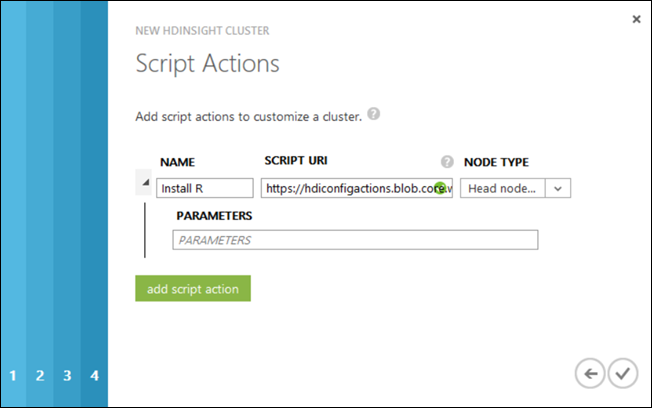

<properties linkid="customize HDInsight cluster" urlDisplayName="Use R in HDInsight to customize Hadoop clusters" pageTitle="Use R in HDInsight to customize clusters| Azure" metaKeywords="" description="Learn how to install and use R to customize Hadoop clusters." metaCanonical="" services="hdinsight" documentationCenter="" title="" authors="bradsev" solutions="" manager="paulettm" editor="cgronlun"/>

<tags ms.service="hdinsight" ms.workload="big-data" ms.tgt_pltfrm="na" ms.devlang="na" ms.topic="article" ms.date="12/19/2014" ms.author="bradsev" />

# Install and use R on HDInsight Hadoop clusters

You can install R on any type of cluster in Hadoop on HDInsight using **Script Action** cluster customization. This enables data scientists and analysts to use R to deploy the powerful MapReduce/YARN programming framework for processing large amounts of data on Hadoop clusters deployed in HDInsight.

Script action lets you run scripts to customize a cluster, only when the cluster is being created. For more information, see [Customize HDInsight cluster using script action][hdinsight-cluster-customize].

## In this article

- [What is R?](#whatIs)
- [How do I install R?](#install)
- [How do I run R scripts in HDInsight](#useR) 
- [Install R on HDInsight Hadoop clusters using PowerShell](#usingPS)
- [Install R on HDInsight Hadoop clusters using the .NET SDK](#usingSDK)
- [See also](#seeAlso)

## What is R?

The <a href="http://www.r-project.org/" target="_blank">R project</a> is an open source language and environment for statistical computing. R provides hundreds of build-in statistical functions and its own programming language that combines aspects of functional and object-oriented programming. It also provides extensive graphical capabilities. R is the preferred programming environment for most professional statisticians and scientists in a wide variety of fields. 

R scripts can be run on Hadoop clusters in HDInsight that were customized using Script Action when created to install the R environment. R is compatible with Azure Blob Storage (WASB) so that data that is stored there can be processed using R on HDInsight.  

## How do I install R?

A sample script to install R on an HDInsight cluster is available from a read-only Azure storage blob at [https://hdiconfigactions.blob.core.windows.net/rconfigactionv02/r-installer-v02.ps1](https://hdiconfigactions.blob.core.windows.net/rconfigactionv02/r-installer-v02.ps1). This section provides instructions on how to use the sample script while provisioning the cluster using the Azure Management Portal.

> [AZURE.NOTE] The sample script works only with HDInsight cluster version 3.1. For more information on HDInsight cluster versions, see [HDInsight cluster versions](http://azure.microsoft.com/en-us/documentation/articles/hdinsight-component-versioning/).

1. Start provisioning a cluster using the **CUSTOM CREATE** option, as described at [Provisioning a cluster using custom options](http://azure.microsoft.com/en-us/documentation/articles/hdinsight-provision-clusters/#portal). 
2. On the **Script Actions** page of the wizard, click **add script action** to provide details about the Script Action, as shown below:

	
	
	<table border='1'>
		<tr><th>Property</th><th>Value</th></tr>
		<tr><td>Name</td>
			<td>Specify a name for the script action. For example, <b>Install R</b>.</td></tr>
		<tr><td>Script URI</td>
			<td>Specify the URI to the script that is invoked to customize the cluster. For example, <i>https://hdiconfigactions.blob.core.windows.net/rconfigactionv02/r-installer-v02.ps1</i></td></tr>
		<tr><td>Node Type</td>
			<td>Specifies the nodes on which the customization script is run. You can choose <b>All Nodes</b>, <b>Head nodes only</b>, or <b>Worker nodes</b> only.
		<tr><td>Parameters</td>
			<td>Specify the parameters, if required by the script. The script to install R does not require any parameters so you can leave this blank.</td></tr>
	</table>	

	You can add more than one script action to install multiple components on the cluster. After you have added the scripts, click the checkmark to start provisioning the cluster.

You can also use the script to install R on HDInsight using PowerShell or the HDInsight .NET SDK. Instructions for these procedures are provided later in this topic.

## How do I run R scripts in HDInsight?
This section describes how to run an R script on the Hadoop cluster with HDInsight.

1. **Establish a remote desktop connection to the cluster**: From the Azure Management Portal, enable remote desktop for the cluster you created with R installed, and then remote into the cluster. For instructions, see <a href="http://azure.microsoft.com/en-us/documentation/articles/hdinsight-administer-use-management-portal/#rdp" target="_blank">Connect to HDInsight clusters using RDP</a>.

2. **Open the R console**: The R installation puts a link to the R console on the desktop of the headnode. Click on it to open the R console.

3. **Run the R script**: The R script can be run directly from the R console by pasting it in, selecting it, and pressing **Enter**. Here is a simple example script that generates the numbers 1 to 100 and then multiplies them by 2.

		library(rmr2)
		library(rhdfs)
		ints = to.dfs(1:100)
		calc = mapreduce(input = ints, map = function(k, v) cbind(v, 2*v))
		from.dfs(calc)

The first two line calls the RHadoop libraries installed with R. The final line prints the results to the console. The Output should look like this:

	[1,]  1 2
	[2,]  2 4
	.
	.
	.
	[98,]  98 196
	[99,]  99 198
	[100,] 100 200

## Install R on HDInsight using PowerShell

In this section we use the **<a href = "http://msdn.microsoft.com/en-us/library/dn858088.aspx" target="_blank">Add-AzureHDInsightScriptAction</a>** cmdlet to invoke scripts using Script Action to customize a cluster. Before proceeding, make sure you have installed and configured PowerShell. For information on configuring a workstation to run HDInsight Powershell cmdlets, see [Install and configure Azure PowerShell][powershell-install-configure].

Perform the following steps:

1. Open an Azure PowerShell window and declare the following variables:

		# PROVIDE VALUES FOR THESE VARIABLES
		$subscriptionName = "<SubscriptionName>"		# Name of the Azure subscription
		$clusterName = "<HDInsightClusterName>"			# The HDInsight cluster name
		$storageAccountName = "<StorageAccountName>"	# Azure storage account that hosts the default container
		$storageAccountKey = "<StorageAccountKey>"      # Key for the storage account
		$containerName = $clusterName
		$location = "<MicrosoftDataCenter>"				# The location of the HDInsight cluster. It must in the same data center as the storage account.
		$clusterNodes = <ClusterSizeInNumbers>			# The number of nodes in the HDInsight cluster.
		$version = "<HDInsightClusterVersion>"          # For example "3.1"
	
2. Specify the configuration values such as nodes in the cluster and the default storage to be used.

		# SPECIFY THE CONFIGURATION OPTIONS
		Select-AzureSubscription $subscriptionName
		$config = New-AzureHDInsightClusterConfig -ClusterSizeInNodes $clusterNodes
		$config.DefaultStorageAccount.StorageAccountName="$storageAccountName.blob.core.windows.net"
		$config.DefaultStorageAccount.StorageAccountKey=$storageAccountKey
		$config.DefaultStorageAccount.StorageContainerName=$containerName
	
3. Use **Add-AzureHDInsightScriptAction** cmdlet to invoke the sample script to install R. 

		# INVOKE THE SCRIPT USING THE SCRIPT ACTION
		$config = Add-AzureHDInsightScriptAction -Config $config -Name "Install R"  -ClusterRoleCollection HeadNode,DataNode -Uri https://hdiconfigactions.blob.core.windows.net/rconfigactionv02/r-installer-v02.ps1

	**Add-AzureHDInsightScriptAction** cmdlet takes the following parameters:

	<table style="border-color: #c6c6c6; border-width: 2px; border-style: solid; border-collapse: collapse;">
	<tr>
	<th style="border-color: #c6c6c6; border-width: 2px; border-style: solid; border-collapse: collapse; width:90px; padding-left:5px; padding-right:5px;">Parameter</th>
	<th style="border-color: #c6c6c6; border-width: 2px; border-style: solid; border-collapse: collapse; width:550px; padding-left:5px; padding-right:5px;">Definition</th></tr>
	<tr>
	<td style="border-color: #c6c6c6; border-width: 2px; border-style: solid; border-collapse: collapse; padding-left:5px;">Config</td>
	<td style="border-color: #c6c6c6; border-width: 2px; border-style: solid; border-collapse: collapse; padding-left:5px; padding-right:5px;">The configuration object to which script action information is added</td></tr>
	<tr>
	<td style="border-color: #c6c6c6; border-width: 2px; border-style: solid; border-collapse: collapse; padding-left:5px;">Name</td>
	<td style="border-color: #c6c6c6; border-width: 2px; border-style: solid; border-collapse: collapse; padding-left:5px;">Name of the script action</td></tr>
	<tr>
	<td style="border-color: #c6c6c6; border-width: 2px; border-style: solid; border-collapse: collapse; padding-left:5px;">ClusterRoleCollection</td>
	<td style="border-color: #c6c6c6; border-width: 2px; border-style: solid; border-collapse: collapse; padding-left:5px;">Specifies the nodes on which the customization script is run. The valid values are HeadNode (to install on the headnode) or DataNode (to install on all the datanodes). You can use either or both values.</td></tr>
	<tr>
	<td style="border-color: #c6c6c6; border-width: 2px; border-style: solid; border-collapse: collapse; padding-left:5px;">Parameters</td>
	<td style="border-color: #c6c6c6; border-width: 2px; border-style: solid; border-collapse: collapse; padding-left:5px;">Parameters required by the script. 
	</td></tr>
	<tr>
	<td style="border-color: #c6c6c6; border-width: 2px; border-style: solid; border-collapse: collapse; padding-left:5px;">Uri</td>
	<td style="border-color: #c6c6c6; border-width: 2px; border-style: solid; border-collapse: collapse; padding-left:5px;">Specifies the URI to the script that is executed</td></tr>
	</table>
	
4. Finally, provision the cluster customized to have R installed.  
	
		# PROVISION A CLUSTER WITH R INSTALLED
		New-AzureHDInsightCluster -Config $config -Name $clusterName -Location $location -Version $version 

When prompted, enter the credentials for the cluster. It can take several minutes before the cluster is created.

## Install R on HDInsight using the .NET SDK

The HDInsight .NET SDK provides .NET client libraries that makes it easier to work with HDInsight from a .NET application. 

The following procedures must be performed to provision an HDInsight cluster using the SDK:

- [Install the HDInsight .NET SDK](#installSDK)
- [Create a self-signed certificate](#createCert)
- [Create a .NET application in Visual Studio](#createApp)
- [Run the application](#runApp)

The following sections show how to perform these procedures.

### To install the HDInsight .NET SDK

You can install latest published build of the SDK from [NuGet](http://nuget.codeplex.com/wikipage?title=Getting%20Started). The instructions will be shown in the next procedure.

### To create a self-signed certificate

Create a self-signed certificate, install it on your workstation, and upload it to your Azure subscription. For instructions, see [Create a self-signed certificate](http://go.microsoft.com/fwlink/?LinkId=511138). 

### To create a .NET application in Visual Studio

1. Open Visual Studio 2013.

2. From the File menu, click **New**, and then click **Project**.

3. From New Project, type or select the following values:
	
	<table style="border-color: #c6c6c6; border-width: 2px; border-style: solid; border-collapse: collapse;">
	<tr>
	<th style="border-color: #c6c6c6; border-width: 2px; border-style: solid; border-collapse: collapse; width:90px; padding-left:5px; padding-right:5px;">Property</th>
	<th style="border-color: #c6c6c6; border-width: 2px; border-style: solid; border-collapse: collapse; width:90px; padding-left:5px; padding-right:5px;">Value</th></tr>
	<tr>
	<td style="border-color: #c6c6c6; border-width: 2px; border-style: solid; border-collapse: collapse; padding-left:5px;">Category</td>
	<td style="border-color: #c6c6c6; border-width: 2px; border-style: solid; border-collapse: collapse; padding-left:5px; padding-right:5px;">Templates/Visual C#/Windows</td></tr>
	<tr>
	<td style="border-color: #c6c6c6; border-width: 2px; border-style: solid; border-collapse: collapse; padding-left:5px;">Template</td>
	<td style="border-color: #c6c6c6; border-width: 2px; border-style: solid; border-collapse: collapse; padding-left:5px;">Console Application</td></tr>
	<tr>
	<td style="border-color: #c6c6c6; border-width: 2px; border-style: solid; border-collapse: collapse; padding-left:5px;">Name</td>
	<td style="border-color: #c6c6c6; border-width: 2px; border-style: solid; border-collapse: collapse; padding-left:5px;">CreateRCluster</td></tr>
	</table>

4. Click **OK** to create the project.

5. From the **Tools** menu, click **Nuget Package Manager**, and then click **Package Manager Console**.

6. Run the following commands in the console to install the package.

		Install-Package Microsoft.WindowsAzure.Management.HDInsight

	This command adds the .NET libraries and references to them from the current Visual Studio project.

7. From Solution Explorer, double-click **Program.cs** to open it.

8. Add the following using statements to the top of the file:

		using System.Security.Cryptography.X509Certificates;
		using Microsoft.WindowsAzure.Management.HDInsight;
		using Microsoft.WindowsAzure.Management.HDInsight.ClusterProvisioning;
		using Microsoft.WindowsAzure.Management.HDInsight.Framework.Logging;
	
9. In the Main() function, copy and paste the following code, and provide values for the variables :
		
        var clusterName = args[0];

        // PROVIDE VALUES FOR THE VARIABLES
        string thumbprint = "<CertificateThumbprint>";  
        string subscriptionId = "<AzureSubscriptionID>";
        string location = "<MicrosoftDataCenterLocation>";
        string storageaccountname = "<AzureStorageAccountName>.blob.core.windows.net";
        string storageaccountkey = "<AzureStorageAccountKey>";
        string username = "<HDInsightUsername>";
        string password = "<HDInsightUserPassword>";
        int clustersize = <NumberOfNodesInTheCluster>;

        // PROVIDE THE CERTIFICATE THUMBPRINT TO RETRIEVE THE CERTIFICATE FROM THE CERTIFICATE STORE 
        X509Store store = new X509Store();
        store.Open(OpenFlags.ReadOnly);
        X509Certificate2 cert = store.Certificates.Cast<X509Certificate2>().First(item => item.Thumbprint == thumbprint);

        // CREATE AN HDINSIGHT CLIENT OBJECT
        HDInsightCertificateCredential creds = new HDInsightCertificateCredential(new Guid(subscriptionId), cert);
        var client = HDInsightClient.Connect(creds);
		client.IgnoreSslErrors = true;

        // PROVIDE THE CLUSTER INFORMATION
		var clusterInfo = new ClusterCreateParameters()
        {
            Name = clusterName,
            Location = location,
            DefaultStorageAccountName = storageaccountname,
            DefaultStorageAccountKey = storageaccountkey,
            DefaultStorageContainer = clusterName,
            UserName = username,
            Password = password,
            ClusterSizeInNodes = clustersize,
            Version = "3.1"
        };        

10. Append the following code to the Main() function to use the [ScriptAction](http://msdn.microsoft.com/en-us/library/microsoft.windowsazure.management.hdinsight.clusterprovisioning.data.scriptaction.aspx) class to invoke a custom script to install R.

		// ADD THE SCRIPT ACTION TO INSTALL R

        clusterInfo.ConfigActions.Add(new ScriptAction(
            "Install R",
            new ClusterNodeType[] { ClusterNodeType.HeadNode, ClusterNodeType.DataNode },
            new Uri("https://hdiconfigactions.blob.core.windows.net/rconfigactionv02/r-installer-v02.ps1"), null
            ));

11. Finally, create the cluster.

		client.CreateCluster(clusterInfo);

11. Save changes to the application and build the solution. 

### To run the application

Open a PowerShell console, navigate to the location where you saved the project, navigate to the \bin\debug directory within the project, and then run the following command:

	.\CreateRCluster <cluster-name>

Provide a cluster name and press ENTER to provision a cluster with R installed.

## See also

- [Install and use Spark on HDInsight clusters][hdinsight-install-spark] for  instructions on how to use cluster customization to install and use Spark on HDInsight Hadoop clusters. Spark is an open-source parallel processing framework that supports in-memory processing to boost the performance of big data analytic applications.
- [Install Giraph on HDInsight clusters](../hdinsight-hadoop-giraph-install). Use cluster customization to install Giraph on HDInsight Hadoop clusters. Giraph allows you to perform graph processing using Hadoop, and can be used with Azure HDInsight.
- [Install Solr on HDInsight clusters](../hdinsight-hadoop-solr-install). Use cluster customization to install Solr on HDInsight Hadoop clusters. Solr allows you to perform search powerful search operations on data stored.

[hdinsight-provision]: ../hdinsight-provision-clusters/
[hdinsight-cluster-customize]: ../hdinsight-hadoop-customize-cluster
[hdinsight-install-spark]: ../hdinsight-hadoop-spark-install/