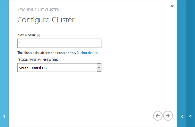
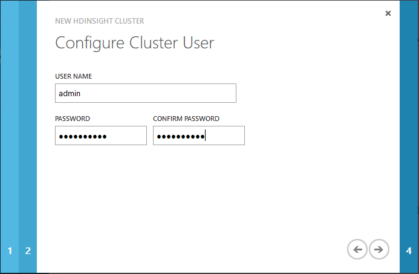
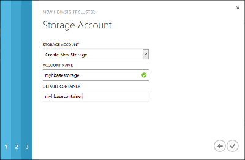

<properties 
	pageTitle="Provision HBase clusters on a Virtual Network | Microsoft Azure" 
	description="Get started using HBase in Azure HDInsight. Learn how to create HDInsight HBase clusters on Azure Virtual Network" 
	keywords=""	
	services="hdinsight,virtual-network" 
	documentationCenter="" 
	authors="mumian" 
	manager="paulettm" 
	editor="cgronlun"/>

<tags
   ms.service="hdinsight"
   ms.devlang="na"
   ms.topic="article"
   ms.tgt_pltfrm="na"
   ms.workload="big-data" 
   ms.date="04/21/2015"
   ms.author="jgao"/>

# Provision HBase clusters on Azure Virtual Network

Learn how to create Azure HDInsight HBase clusters on an [Azure Virtual Network][1]. 

With virtual network integration, HBase clusters can be deployed to the same virtual network as your applications so that applications can communicate with HBase directly. The benefits include:

- Direct connectivity of the web application to the nodes of the HBase cluster, which enables communication via HBase Java remote procedure call (RPC) APIs.
- Improved performance by not having your traffic go over multiple gateways and load-balancers.
- The ability to process sensitive information in a more secure manner without exposing a public endpoint.

##Prerequisites
Before you begin this tutorial, you must have the following:

- **An Azure subscription**. Azure is a subscription-based platform. For more information about obtaining a subscription, see [Purchase Options][azure-purchase-options], [Member Offers][azure-member-offers], or [Free Trial][azure-free-trial].

- **A workstation with Azure PowerShell installed and configured**. For instructions, see [Install and configure Azure PowerShell](install-configure-powershell.md). To execute Azure PowerShell scripts, you must run Azure PowerShell as administrator and set the execution policy to *RemoteSigned*. See [Using the Set-ExecutionPolicy cmdlet][2].

	Before running Azure PowerShell scripts, make sure you are connected to your Azure subscription by using the following cmdlet:

		Add-AzureAccount

	If you have multiple Azure subscriptions, use the following cmdlet to set the current subscription:

		Select-AzureSubscription <AzureSubscriptionName>

##Provision an HBase cluster into a virtual network 

Before provisioning an HBase cluster, you need to have an Azure virtual network.

**To create a virtual network by using the Azure portal**

1. Sign in to the [Azure portal][azure-portal].
2. Click **NEW** in the bottom-left corner, click **NETWORK SERVICES**, click **VIRTUAL NETWORK**, and then click **QUICK CREATE**.
3. Type or select the following values:

	- **Name** - The name of your virtual network.
	- **Address space** - Choose an address space for the virtual network that is large enough to provide addresses for all nodes in the cluster. Otherwise the provision will fail. For walking through this tutorial, you can pick any of the three choices. 
	- **Maximum VM count** - Choose one of the maximum virtual machine (VM) counts. This value determines the number of possible hosts (VMs) that can be created under the address space. For walking through this tutorial, **4096 [CIDR: /20]** is sufficient. 
	- **Location** - The location must be the same as the HBase cluster that you will create.
	- **DNS server** - This tutorial uses an internal Domain Name System (DNS) server provided by Azure, so you can choose **None**. More advanced networking configurations with custom DNS servers are also supported. For detailed guidance, see [Name Resolution (DNS)](http://msdn.microsoft.com/library/azure/jj156088.aspx).
4. Click **CREATE A VIRTUAL NETWORK** in the lower-right corner. The new virtual network name will appear in the list. Wait until the Status column shows **Created**.
5. In the main pane, click the virtual network you just created.
6. Click **DASHBOARD** on the top of the page.
7. Under **quick glance**, make a note of the virtual network ID. You will need it when provisioning the HBase cluster.
8. Click **CONFIGURE** on the top of the page.
9. On the bottom of the page, the default subnet name is **Subnet-1**. You can optionally rename the subnet or add a new subnet for the HBase cluster. Make a note of the subnet name; you will need it when provisioning the cluster.
10. Verify **CIDR(ADDRESS COUNT)** for the subnet that will be used for the cluster. The address count must be greater than the number of worker nodes plus seven (gateway: 2, head node: 2, Zookeeper: 3). For example, if you need a 10-node HBase cluster, the address count for the subnet must be greater than 17 (10+7). Otherwise the deployment will fail.
11. Click **Save** on the bottom of the page, if you have updated the subnet values.

**To add a DNS server virtual machine to the virtual network**

A DNS server is optional, but necessary in some cases.  The procedure has been documented in [Configure DNS between two Azure virtual networks][hdinsight-hbase-replication-dns]. Basically, you will need to perform these steps:

1. add an Azure virtual machine to the virtual network
2. set a static IP address for the virtual machine
3. add the DNS server role to the virtual machine
4. Assign the DNS server to the virtual network 

**To create an Azure Storage account and a Blob storage container to be used by the cluster**

> [AZURE.NOTE] HDInsight clusters use Azure Blob storage for storing data. For more information, see [Use Azure Blob storage with Hadoop in HDInsight](hdinsight-use-blob-storage.md). You will need a storage account and a Blob storage container. The storage account location must match the virtual network location and the cluster location.

Like other HDInsight clusters, HBase cluster requires an Azure Storage account and a Blob storage container as the default file system. The storage account location must match the virtual network location and the cluster location. For more information, see [Use Azure Blob storage with Hadoop in HDInsight][hdinsight-storage]. When you provision an HBase cluster, you have the options to create new or use existing ones. This procedure shows you how to create a storage account and a Blob storage container using the Azure portal.

1. Sign in to the [Azure portal][azure-portal].
2. Click **NEW** in the lower-left corner, point to **DATA SERVICES**, point to **STORAGE**, and then click **QUICK CREATE**.

3. Type or select the following values:

	- **URL** - The name of the Storage account.
	- **LOCATION** - The location of the Storage account. Make sure it matches the virtual network location. Affinity groups are not supported.
	- **REPLICATION** - For testing purposes, use **Locally Redundant** to reduce the cost.

4. Click **CREATE STORAGE ACCOUNT**. You will see the new Storage account in the storage list. 
5. Wait until the **STATUS** of the new Storage account changes to **Online**.
6. Click the new Storage account from the list to select it.
7. Click **MANAGE ACCESS KEYS** from the bottom of the page.
8. Make a note of the Storage account name and the primary access key (or the secondary access key; either of the keys works). You will need them later in the tutorial.
9. From the top of the page, click **CONTAINER**.
10. From the bottom of the page, click **ADD**.
11. Enter the container name. This container will be used as the default container for the HBase cluster. By default, the default container name matches the cluster name. Keep the **ACCESS** field as **Private**.  
12. Click the checkmark to create the container.

**To provision an HBase cluster by using the Azure portal**

> [AZURE.NOTE] For information on provisioning a new HBase cluster by using Azure PowerShell, see [Provision an HBase cluster using Azure PowerShell](#powershell).

1. Sign in to the [Azure portal][azure-portal].

2. Click **NEW** in the lower-left corner, point to **DATA SERVICES**, point to **HDINSIGHT**, and then click **CUSTOM CREATE**.

3. Enter a cluster name, select HBase as the cluster type, select the Windows Server 2012 operating system, select the HDInsight version, and then click the right button.

	![Provide details for the HBase cluster][img-provision-cluster-page1]

	> [AZURE.NOTE] For an HBase cluster, Windows Server is the only available OS option.

4. On the **Configure Cluster** page, enter or select the following:

	

	<table border='1'>
		<tr><th>Property</th><th>Value</th></tr>
		<tr><td>Data Nodes</td><td>Select the number of data nodes you want to deploy. For testing purposes, create a single-node cluster.  The cluster size limit varies for Azure subscriptions. Contact Azure billing support to increase the limit.</td></tr>
		<tr><td>Region/Virtual Network</td><td>
Select a region or an Azure virtual network, if you have one already created. For this tutorial, select the network that you created earlier, and then select a corresponding subnet. The default name is <b>Subnet-1</b>.
</td></tr>
		<tr><td>Head Node Size</td><td>
Select a VM size for the head node.
</td></tr>
		<tr><td>Data Node Size</td><td>
Select a VM size for the data nodes.
</td></tr>
		<tr><td>Zookeeper Size</td><td>
Select a VM size for the Zookeeper node.
</td></tr>
	</table>	

	>[AZURE.NOTE] Based on the choice of VMs, your cost might vary. HDInsight uses all standard-tier VMs for cluster nodes. For information on how VM sizes affect your prices, see <a href="http://azure.microsoft.com/pricing/details/hdinsight/" target="_blank">HDInsight Pricing</a>.	

	Click the right button.

5. Enter the Hadoop user name and password to use for this cluster, and then click the right button.

	

	<table border='1'>
		<tr><th>Property</th><th>Value</th></tr>
		<tr><td>HTTP User Name</td>
			<td>Specify the HDInsight cluster user name.</td></tr>
		<tr><td>HTTP Password/Confirm Password</td>
			<td>Specify the HDInsight cluster user password.</td></tr>
		<tr><td>Enable remote desktop for cluster</td>
			<td>Select this check box to specify a username, password, and expiry date for a remote desktop user that can remote into the cluster nodes, once it is provisioned. You can also enable remote desktop later, after the cluster is provisioned. For instructions, see <a href="hdinsight-administer-use-management-portal/#rdp" target="_blank">Connect to HDInsight clusters using RDP</a>.</td></tr>
	</table>

6. On the **Storage Account** page, provide the following values:

    

	<table border='1'>
		<tr><th>Property</th><th>Value</th></tr>
		<tr><td>Storage Account</td>
			<td>Specify the Azure Storage account that will be used as the default file system for the HDInsight cluster. You can choose one of the three options:
			<ul>
				<li><strong>Use Existing Storage</strong></li>
				<li><strong>Create New Storage</strong></li>
				<li><strong>Use Storage From Another Subscription</strong></li>
			</ul>
			</td></tr>
		<tr><td>Account Name</td>
			<td><ul>
				<li>If you chose to use existing storage, for <strong>Account Name</strong>, select an existing storage account. The drop-down lists only the Storage accounts located in the same data center where you chose to provision the cluster.</li>
				<li>If you chose the <strong>Create New Storage</strong> or <strong>Use Storage From Another Subscription</strong> option, you must provide the Storage account name.</li>
			</ul></td></tr>
		<tr><td>Account Key</td>
			<td>If you chose the <strong>Use Storage From Another Subscription</strong> option, specify the account key for that Storage account.</td></tr>
		<tr><td>Default Container</td>
			<td>
Specify the default container on the Storage account that is used as the default file system for the HDInsight cluster. If you chose <strong>Use Existing Storage</strong> for the <strong>Storage Account</strong> field, and there are no existing containers in that account, the container is created by default with the same name as the cluster name. If a container with the name of the cluster already exists, a sequence number will be appended to the container name. For example, mycontainer1, mycontainer2, and so on. However, if the existing Storage account has a container with a name different from the cluster name you specified, you can use that container as well.

            
If you chose to create a new storage or use storage from another Azure subscription, you must specify the default container name.

        </td></tr>
		<tr><td>Additional Storage Accounts</td>
			<td>If required, specify additional Storage accounts for the cluster. HDInsight supports multiple Storage accounts. There is no limit on the additional Storage accounts that can be used by a cluster. However, if you create a cluster by using the Azure portal, you have a limit of seven due to the UI constraints. Each additional Storage account you specify adds an extra <strong>Storage Account</strong> page to the wizard where you can specify the account information. For example, in the screenshot above, no additional storage account is selected, and hence an extra page is not added to the wizard.</td></tr>
	</table>

	Click the right arrow.

7. On the **Script Actions** page, select the checkmark in the lower-right corner. Do not click the **add script action** button, as this tutorial does not require a customized cluster setup.
	
	![Configure Script Action to customize an HDInsight HBase cluster][img-provision-cluster-page5] 

	> [AZURE.NOTE] This page can be used to customize the cluster during setup. For more information, see [Customize HDInsight clusters using Script Action](hdinsight-hadoop-customize-cluster.md). 
	
To begin working with your new HBase cluster, you can use the procedures found in [Get started using HBase with Hadoop in HDInsight](hdinsight-hbase-get-started.md).

##Connect to the HBase cluster provisioned in the virtual network by using HBase Java RPC APIs

1.	Provision an infrastructure as a service (IaaS) virtual machine into the same Azure virtual network and the same subnet. So both the virtual machine and the HBase cluster use the same internal DNS server to resolve host names. To do so, you must choose the **From Gallery** option, and select the virtual network instead of a data center. For instructions, see [Create a Virtual Machine Running Windows Server](virtual-machines-windows-tutorial.md). A standard Windows Server 2012 image with a small VM size is sufficient.
	
2.	When using a Java application to connect to HBase remotely, you must use the fully qualified domain name (FQDN). To determine this, you must get the connection-specific DNS suffix of the HBase cluster. To do that, use Curl to query Ambari, or use Remote Desktop to connect to the cluster.

	* **Curl** - Use the following command:

			curl -u <username>:<password> -k https://<clustername>.azurehdinsight.net/ambari/api/v1/clusters/<clustername>.azurehdinsight.net/services/hbase/components/hbrest

		In the JavaScript Object Notation (JSON) data returned, find the "host_name" entry. This will contain the FQDN for the nodes in the cluster. For example:

			...
			"host_name": "wordkernode0.<clustername>.b1.cloudapp.net
			...

		The portion of the domain name beginning with the cluster name is the DNS suffix. For example, mycluster.b1.cloudapp.net.

	* **Azure PowerShell** - Use the following Azure PowerShell script to register the **Get-ClusterDetail** function, which can be used to return the DNS suffix:

			function Get-ClusterDetail(
			    [String]
			    [Parameter( Position=0, Mandatory=$true )]
			    $ClusterDnsName,
				[String]
			    [Parameter( Position=1, Mandatory=$true )]
			    $Username,
				[String]
			    [Parameter( Position=2, Mandatory=$true )]
			    $Password,
			    [String]
			    [Parameter( Position=3, Mandatory=$true )]
			    $PropertyName
				)
			{
			<#
			    .SYNOPSIS 
			     Displays information to facilitate an HDInsight cluster-to-cluster scenario within the same virtual network.
				.Description
				 This command shows the following 4 properties of an HDInsight cluster:
				 1. ZookeeperQuorum (supports only HBase type cluster)
					Shows the value of HBase property "hbase.zookeeper.quorum".
				 2. ZookeeperClientPort (supports only HBase type cluster)
					Shows the value of HBase property "hbase.zookeeper.property.clientPort".
				 3. HBaseRestServers (supports only HBase type cluster)
					Shows a list of host FQDNs that run the HBase REST server.
				 4. FQDNSuffix (supports all cluster types)
					Shows the FQDN suffix of hosts in the cluster.
			    .EXAMPLE
			     Get-ClusterDetail -ClusterDnsName {clusterDnsName} -Username {username} -Password {password} -PropertyName ZookeeperQuorum
			     This command shows the value of HBase property "hbase.zookeeper.quorum".
			    .EXAMPLE
			     Get-ClusterDetail -ClusterDnsName {clusterDnsName} -Username {username} -Password {password} -PropertyName ZookeeperClientPort
			     This command shows the value of HBase property "hbase.zookeeper.property.clientPort".
			    .EXAMPLE
			     Get-ClusterDetail -ClusterDnsName {clusterDnsName} -Username {username} -Password {password} -PropertyName HBaseRestServers
			     This command shows a list of host FQDNs that run the HBase REST server.
			    .EXAMPLE
			     Get-ClusterDetail -ClusterDnsName {clusterDnsName} -Username {username} -Password {password} -PropertyName FQDNSuffix
			     This command shows the FQDN suffix of hosts in the cluster.
			#>
			
				$DnsSuffix = ".azurehdinsight.net"
				
				$ClusterFQDN = $ClusterDnsName + $DnsSuffix
				$webclient = new-object System.Net.WebClient
				$webclient.Credentials = new-object System.Net.NetworkCredential($Username, $Password)
			
				if($PropertyName -eq "ZookeeperQuorum")
				{
					$Url = "https://" + $ClusterFQDN + "/ambari/api/v1/clusters/" + $ClusterFQDN + "/configurations?type=hbase-site&tag=default&fields=items/properties/hbase.zookeeper.quorum"
					$Response = $webclient.DownloadString($Url)
					$JsonObject = $Response | ConvertFrom-Json
					Write-host $JsonObject.items[0].properties.'hbase.zookeeper.quorum'
				}
				if($PropertyName -eq "ZookeeperClientPort")
				{
					$Url = "https://" + $ClusterFQDN + "/ambari/api/v1/clusters/" + $ClusterFQDN + "/configurations?type=hbase-site&tag=default&fields=items/properties/hbase.zookeeper.property.clientPort"
					$Response = $webclient.DownloadString($Url)
					$JsonObject = $Response | ConvertFrom-Json
					Write-host $JsonObject.items[0].properties.'hbase.zookeeper.property.clientPort'
				}
				if($PropertyName -eq "HBaseRestServers")
				{
					$Url1 = "https://" + $ClusterFQDN + "/ambari/api/v1/clusters/" + $ClusterFQDN + "/configurations?type=hbase-site&tag=default&fields=items/properties/hbase.rest.port"
					$Response1 = $webclient.DownloadString($Url1)
					$JsonObject1 = $Response1 | ConvertFrom-Json
					$PortNumber = $JsonObject1.items[0].properties.'hbase.rest.port'
					
					$Url2 = "https://" + $ClusterFQDN + "/ambari/api/v1/clusters/" + $ClusterFQDN + "/services/hbase/components/hbrest"
					$Response2 = $webclient.DownloadString($Url2)
					$JsonObject2 = $Response2 | ConvertFrom-Json
					foreach ($host_component in $JsonObject2.host_components)
					{
						$ConnectionString = $host_component.HostRoles.host_name + ":" + $PortNumber
						Write-host $ConnectionString
					}
				}
				if($PropertyName -eq "FQDNSuffix")
				{
					$Url = "https://" + $ClusterFQDN + "/ambari/api/v1/clusters/" + $ClusterFQDN + "/services/yarn/components/resourcemanager"
					$Response = $webclient.DownloadString($Url)
					$JsonObject = $Response | ConvertFrom-Json
					$FQDN = $JsonObject.host_components[0].HostRoles.host_name
					$pos = $FQDN.IndexOf(".")
					$Suffix = $FQDN.Substring($pos + 1)
					Write-host $Suffix
				}
			}

		After running the Azure PowerShell script, use the following command to return the DNS suffix by using the **Get-ClusterDetail** function. Specify your HDInsight HBase cluster name, admin name, and admin password when using this command.

			Get-ClusterDetail -ClusterDnsName <yourclustername> -PropertyName FQDNSuffix -Username <clusteradmin> -Password <clusteradminpassword>

		This will return the DNS suffix. For example, **yourclustername.b4.internal.cloudapp.net**.

	> [AZURE.NOTE] You can also use Remote Desktop to connect to the HBase cluster (you will be connected to the head node) and run **ipconfig** from a command prompt to obtain the DNS suffix. For instructions on enabling Remote Desktop Protocol (RDP) and connecting to the cluster by using RDP, see [Manage Hadoop clusters in HDInsight using the Azure portal][hdinsight-admin-portal].
	>
	> ![hdinsight.hbase.dns.surffix][img-dns-surffix]

<!-- 
3.	Change the primary DNS suffix configuration of the virtual machine. This enables the virtual machine to automatically resolve the host name of the HBase cluster without explicit specification of the suffix. For example, the *workernode0* host name will be correctly resolved to workernode0 of the HBase cluster. 

	To make the configuration change:

	1. RDP into the virtual machine. 
	2. Open **Local Group Policy Editor**. The executable is gpedit.msc.
	3. Expand **Computer Configuration**, expand **Administrative Templates**, expand **Network**, and then click **DNS Client**. 
	- Set **Primary DNS Suffix** to the value obtained in step 2: 

		![hdinsight.hbase.primary.dns.suffix][img-primary-dns-suffix]
	4. Click **OK**. 
	5. Reboot the virtual machine.
-->

To verify that the virtual machine can communicate with the HBase cluster, use the command `ping headnode0.<dns suffix>` from the virtual machine. For example, ping headnode0.mycluster.b1.cloudapp.net.

To use this information in a Java application, you can follow the steps in [Use Maven to build Java applications that use HBase with HDInsight (Hadoop)](hdinsight-hbase-build-java-maven.md) to create an application. To have the application connect to a remote HBase server, modify the **hbase-site.xml** file in this example to use the FQDN for Zookeeper. For example:

	<property>
    	<name>hbase.zookeeper.quorum</name>
    	<value>zookeeper0.<dns suffix>,zookeeper1.<dns suffix>,zookeeper2.<dns suffix></value>
	</property>

> [AZURE.NOTE] For more information on name resolution in Azure virtual networks, including how to use your own DNS server, see [Name Resolution (DNS)](http://msdn.microsoft.com/library/azure/jj156088.aspx).

##Provision an HBase cluster by using Azure PowerShell

**To provision an HBase cluster by using Azure PowerShell**

1. Open the Azure PowerShell Integrated Scripting Environment (ISE).
2. Copy and paste the following into the script pane:

		$hbaseClusterName = "<HBaseClusterName>"
		$hadoopUserName = "<HBaseClusterUsername>"
		$hadoopUserPassword = "<HBaseClusterUserPassword>"
		$location = "<HBaseClusterLocation>"  #i.e. "West US"
		$clusterSize = <HBaseClusterSize>  
		$vnetID = "<AzureVirtualNetworkID>"
		$subNetName = "<AzureVirtualNetworkSubNetName>"
		$storageAccountName = "<AzureStorageAccountName>" # Do not use the full name here
		$storageAccountKey = "<AzureStorageAccountKey>"
		$storageContainerName = "<AzureBlobStorageContainer>"
		
		$password = ConvertTo-SecureString $hadoopUserPassword -AsPlainText -Force
		$creds = New-Object System.Management.Automation.PSCredential ($hadoopUserName, $password) 
		
		New-AzureHDInsightCluster -Name $hbaseClusterName `
		                          -ClusterType HBase `
		                          -Version 3.1 `
		                          -Location $location `
		                          -ClusterSizeInNodes $clusterSize `
		                          -Credential $creds `
		                          -VirtualNetworkId $vnetID `
		                          -SubnetName $subNetName `
		                          -DefaultStorageAccountName "$storageAccountName.blob.core.windows.net" `
		                          -DefaultStorageAccountKey $storageAccountKey `
		                          -DefaultStorageContainerName $storageContainerName

3. Click **Run Script**, or press **F5**.
4. To validate the cluster, you can either check the cluster from the Azure portal, or run the following Azure PowerShell cmdlet from the bottom pane:

	Get-AzureHDInsightCluster 

##Next steps

In this tutorial you learned how to provision an HBase cluster. To learn more, see:

- [Get started with HDInsight](hdinsight-get-started.md)
- [Configure HBase replication in HDInsight](hdinsight-hbase-geo-replication.md) 
- [Provision Hadoop clusters in HDInsight](hdinsight-provision-clusters.md) 
- [Get started using HBase with Hadoop in HDInsight](hdinsight-hbase-get-started.md)
- [Analyze Twitter sentiment with HBase in HDInsight](hdinsight-hbase-twitter-sentiment.md)
- [Virtual Network Overview][vnet-overview]

[1]: http://azure.microsoft.com/services/virtual-network/
[2]: http://technet.microsoft.com/library/ee176961.aspx
[3]: http://technet.microsoft.com/library/hh847889.aspx

[hbase-get-started]: hdinsight-hbase-get-started.md
[hbase-twitter-sentiment]: hdinsight-hbase-twitter-sentiment.md
[vnet-overview]: http://msdn.microsoft.com/library/azure/jj156007.aspx
[vm-create]: virtual-machines-windows-tutorial.md

[azure-portal]: https://manage.windowsazure.com
[azure-create-storageaccount]: storage-create-storage-account.md 
[azure-purchase-options]: http://azure.microsoft.com/pricing/purchase-options/
[azure-member-offers]: http://azure.microsoft.com/pricing/member-offers/
[azure-free-trial]: http://azure.microsoft.com/pricing/free-trial/

[hdinsight-admin-powershell]: hdinsight-administer-use-powershell.md
[hdinsight-admin-portal]: hdinsight-administer-use-management-portal.md#rdp

[hdinsight-powershell-reference]: http://msdn.microsoft.com/library/windowsazure/dn479228.aspx

[twitter-streaming-api]: https://dev.twitter.com/docs/streaming-apis
[twitter-statuses-filter]: https://dev.twitter.com/docs/api/1.1/post/statuses/filter

[powershell-install]: install-configure-powershell.md

[hdinsight-customize-cluster]: hdinsight-hadoop-customize-cluster.md
[hdinsight-provision]: hdinsight-provision-clusters.md
[hdinsight-get-started]: hdinsight-get-started.md
[hdinsight-storage-powershell]: hdinsight-use-blob-storage.md#powershell
[hdinsight-analyze-flight-delay-data]: hdinsight-analyze-flight-delay-data.md
[hdinsight-storage]: hdinsight-use-blob-storage.md
[hdinsight-use-sqoop]: hdinsight-use-sqoop.md
[hdinsight-power-query]: hdinsight-connect-excel-power-query.md
[hdinsight-hive-odbc]: hdinsight-connect-excel-hive-ODBC-driver.md
[hdinsight-hbase-replication-dns]: hdinsight-hbase-geo-replication-configure-DNS.md

[img-dns-surffix]: ./media/hdinsight-hbase-provision-vnet/DNSSuffix.png
[img-primary-dns-suffix]: ./media/hdinsight-hbase-provision-vnet/PrimaryDNSSuffix.png
[img-provision-cluster-page1]: ./media/hdinsight-hbase-provision-vnet/hbasewizard1.png "Provision details for the new HBase cluster"
[img-provision-cluster-page5]: ./media/hdinsight-hbase-provision-vnet/hbasewizard5.png "Use Script Action to customize an HBase cluster"
