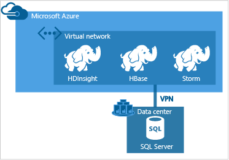
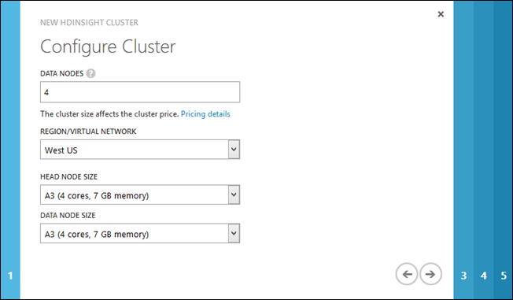
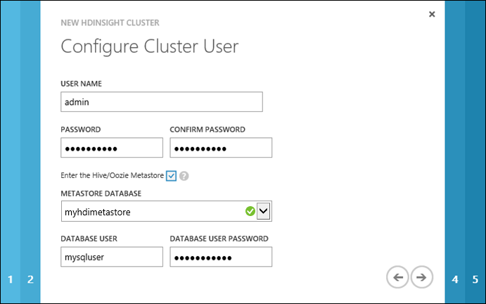
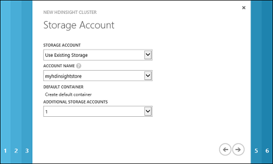
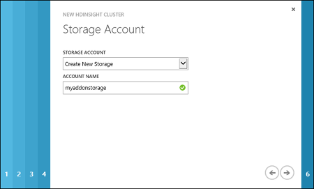
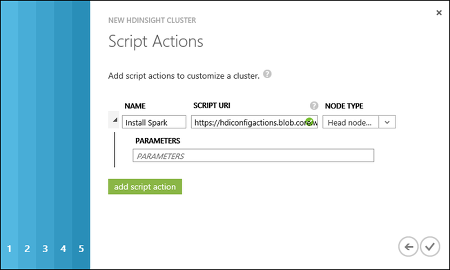

<properties 
   pageTitle="Provision Hadoop clusters in HDInsight | Azure" 
   description="Learn how to provision clusters for Azure HDInsight by using the Azure portal, Azure PowerShell, a command line, or the HDInsight .NET SDK" 
   services="hdinsight" 
   documentationCenter="" 
   authors="nitinme" 
   manager="paulettm" 
   editor="cgronlun"/>

<tags
   ms.service="hdinsight"
   ms.devlang="na"
   ms.topic="article"
   ms.tgt_pltfrm="na"
   ms.workload="big-data" 
   ms.date="04/21/2015"
   ms.author="nitinme"/>

#Provision Hadoop clusters in HDInsight by using custom options

Learn different ways to custom-provision Hadoop clusters on Azure HDInsight - by using the Azure portal, Azure PowerShell, command-line tools, or the HDInsight .NET SDK. For instructions on provisioning HBase clusters and Storm clusters, see [Provision HBase cluster in HDInsight](hdinsight-hbase-get-started.md) and [Getting started using Storm on HDInsight](hdinsight-storm-getting-started.md). See <a href="http://go.microsoft.com/fwlink/?LinkId=510237">What's the difference between Hadoop and HBase?</a> to understand why you might choose one over the other.

## What is an HDInsight cluster?

Have you ever wondered why we mention clusters every time we talk about Hadoop or big data? That's because Hadoop enables distributed processing of large data, spread across different nodes of a cluster. The cluster has a master/slave architecture with a master (also called head node or name node) and any number of slaves (also called data node). For more information, see [Apache Hadoop][apache-hadoop].

![HDInsight Cluster][img-hdi-cluster]

An HDInsight cluster abstracts the Hadoop implementation details so that you don't need to worry about how to communicate with different nodes of a cluster. When you provision an HDInsight cluster, you provision Azure compute resources that contain Hadoop and related applications. For more information, see [Introduction to Hadoop in HDInsight](hdinsight-hadoop-introduction.md). The data to be churned is stored in Azure Blob storage. For more information, see [Use Azure Blob Storage with HDInsight](hdinsight-use-blob-storage.md).

This article provides instructions on the different ways to provision a cluster. If you are looking for a quick-start approach to provisioning a cluster, see [Get Started with Azure HDInsight](hdinsight-get-started.md).

**Prerequisites:**

Before you begin the instructions in this article, you must have the following:

- An Azure subscription. Azure is a subscription-based platform. The HDInsight Windows PowerShell cmdlets perform the tasks by using your subscription. For more information about obtaining a subscription, see [Purchase Options][azure-purchase-options], [Member Offers][azure-member-offers], or [Free Trial][azure-free-trial].

##Configuration options

###Clusters on Linux

HDInsight provides the option of configuring Linux clusters on Azure. Configure a Linux cluster if you are familiar with Linux or Unix, migrating from an existing Linux-based Hadoop solution, or want easy integration with Hadoop ecosystem components built for Linux. For more information, see [Get started with Hadoop on Linux in HDInsight](hdinsight-hadoop-linux-get-started.md). 

###Additional storage

During configuration, you must specify an Azure Blob storage account and a default container. This is used as the default storage location by the cluster. Optionally, you can specify an additional Azure Storage account that will also be associated with the cluster.   

>[AZURE.NOTE] Don't share one Blob storage container for multiple clusters. This is not supported. 

For more information on using secondary Blob stores, see [Using Azure Blob Storage with HDInsight](hdinsight-use-blob-storage.md).

###Metastore

The metastore contains Hive and Oozie metadata, such as Hive tables, partitions, schemas, and columns. Using the metastore helps you to retain your Hive and Oozie metadata, so that you don't need to re-create Hive tables or Oozie jobs when you provision a new cluster. By default, Hive uses an embedded database to store this information. The embedded database can't preserve the metadata when the cluster is deleted.

### Cluster customization

You can install additional components or customize cluster configuration by using scripts during provisioning. Such scripts are invoked via **Script Action**, which is a configuration option that can be used from the Azure portal, HDInsight Windows PowerShell cmdlets, or the HDInsight .NET SDK. For more information, see [Customize HDInsight cluster using Script Action](hdinsight-hadoop-customize-cluster.md).

###Virtual networking

[Azure Virtual Network](http://azure.microsoft.com/documentation/services/virtual-network/) allows you to create a secure, persistent network containing the resources you need for your solution. A virtual network allows you to:

* Connect cloud resources together in a private network (cloud-only).

	

* Connect your cloud resources to your local data-center network (site-to-site or point-to-site) by using a virtual private network (VPN).

	Site-to-site configuration allows you to connect multiple resources from your data center to the Azure virtual network by using a hardware VPN or the Routing and Remote Access Service.

	

	Point-to-site configuration allows you to connect a specific resource to the Azure virtual network by using a software VPN.

	

For more information on Virtual Network features, benefits, and capabilities, see the [Azure Virtual Network overview](http://msdn.microsoft.com/library/azure/jj156007.aspx).

> [AZURE.NOTE] You must create the Azure virtual network before provisioning an HDInsight cluster. For more information, see [Virtual Network configuration tasks](http://msdn.microsoft.com/library/azure/jj156206.aspx).
>
> Azure HDInsight supports only location-based virtual networks and does not currently work with affinity group-based virtual networks.
>
> It is highly recommended to designate a single subnet for one cluster.

## Using the Azure portal

HDInsight clusters use an Azure Blob storage container as the default file system. An Azure Storage account located on the same data center is required before you can create an HDInsight cluster. For more information, see [Use Azure Blob Storage with HDInsight](hdinsight-use-blob-storage.md). For details on creating an Azure Storage account, see [How to Create a Storage Account](storage-create-storage-account.md).

> [AZURE.NOTE] Currently, only the **East Asia**, **Southeast Asia**, **North Europe**, **West Europe**, **East US**, **West US**, **North Central US**, and **South Central US** regions can host HDInsight clusters.

**To create an HDInsight cluster by using the Custom Create option**

1. Sign in to the [Azure portal][azure-management-portal].
2. Click **+ NEW** on the bottom of the page, click **DATA SERVICES**, click **HDINSIGHT**, and then click **CUSTOM CREATE**.
3. On the **Cluster Details** page, type or choose the following values:

	![Provide Hadoop HDInsight cluster details][image-customprovision-page1]

    <table border='1'>
		<tr><th>Property</th><th>Value</th></tr>
		<tr><td>Cluster Name</td>
			<td>
Name the cluster. 

				<ul>
				<li>The Domain Name System (DNS) name must start and end with an alphanumeric character and may contain dashes.</li>
				<li>The field must be a string from 3 to 63 characters.</li>
				</ul></td></tr>
		<tr><td>Cluster Type</td>
			<td>For cluster type, select <strong>Hadoop</strong>.</td></tr>
		<tr><td>Operating System</td>
			<td>Select <b>Windows Server 2012 R2 Data Center</b> to provision a Windows cluster. To provision a Linux cluster, see <a href="http://azure.microsoft.com/documentation/articles/hdinsight-hadoop-provision-linux-clusters/" target="_blank">Provision Hadoop Linux clusters in HDInsight</a>.</td></tr>
		<tr><td>HDInsight Version</td>
			<td>Choose the version. For Hadoop, the default is HDInsight version 3.1, which uses Hadoop 2.4.</td></tr>
		</table>

	Enter or select the values as shown in the table and then click the right arrow.

4. On the **Configure Cluster** page, enter or select the following values:

	

	<table border="1">
	<tr><th>Name</th><th>Value</th></tr>
	<tr><td>Data Nodes</td><td>Number of data nodes you want to deploy. For testing purposes, create a single-node cluster.  The cluster size limit varies for Azure subscriptions. Contact Azure billing support to increase the limit.</td></tr>
	<tr><td>Region/Virtual Network</td><td>
Choose the same region as the Storage account you created in the last procedure. HDInsight requires the Storage account to be located in the same region. Later in the configuration, you can choose only a Storage account that is in the same region that you specified here.

The available regions are: <strong>East Asia</strong>, <strong>Southeast Asia</strong>, <strong>North Europe</strong>, <strong>West Europe</strong>, <strong>East US</strong>, <strong>West US</strong>, <strong>North Central US</strong>, <strong>South Central US</strong>. If you have created an Azure virtual network, you can select the network that the HDInsight cluster will be configured to use.

For more information on creating an Azure virtual network, see <a href="http://msdn.microsoft.com/library/azure/jj156206.aspx">Virtual Network configuration tasks</a>.
</td></tr>
	<tr><td>Head Node Size</td><td>
Select a virtual machine (VM) size for the head node.
</td></tr>
	<tr><td>Data Node Size</td><td>
Select a VM size for the data nodes.
</td></tr>
	</table>

	>[AZURE.NOTE] Based on the choice of VMs, your cost might vary. HDInsight uses all standard-tier VMs for cluster nodes. For information on how VM sizes affect your prices, see <a href="http://azure.microsoft.com/pricing/details/hdinsight/" target="_blank">HDInsight Pricing</a>.	

5. On the **Configure Cluster User** page, provide the following values:

    

    <table border='1'>
		<tr><th>Property</th><th>Value</th></tr>
		<tr><td>HTTP User Name</td>
			<td>Specify the HDInsight cluster user name.</td></tr>
		<tr><td>HTTP Password/Confirm Password</td>
			<td>Specify the HDInsight cluster user password.</td></tr>
		<tr><td>Enable remote desktop for cluster</td>
			<td>Select this check box to specify a username, password, and expiry date for a remote desktop user that can remote into the cluster nodes, once it is provisioned. You can also enable remote desktop later, after the cluster is provisioned. For instructions, see <a href="hdinsight-administer-use-management-portal/#rdp" target="_blank">Connect to HDInsight clusters using RDP</a>.</td></tr>
		<tr><td>Enter the Hive/Oozie Metastore</td>
			<td>Select this check box to specify a SQL database on the same data center as the cluster, to be used as the Hive/Oozie metastore. If you select this checkbox, you must spcecify details about the Azure SQL database in the subsequent pages of the wizard. This is useful if you want to retain the metadata about Hive/Oozie jobs even after a cluster has been deleted.</td></tr>
		</td></tr>		
	</table>

	Click the right arrow.

6. On the **Configure Hive/Oozie Metastore** page, provide the following values:

    

	Specify an Azure SQL database that will be used as the Hive/Oozie metastore. You can specify the same database for both Hive and Oozie metastores. This SQL database must be in the same data center as the HDInsight cluster. The list box lists only the SQL databases in the same data center that you specified on the <strong>Cluster Details</strong> page. Also specify the username and password to connect to the Azure SQL database you selected.

    >[AZURE.NOTE] The Azure SQL database used for the metastore must allow connectivity to other Azure services, including Azure HDInsight. On the Azure SQL database dashboard, on the right side, click the server name. This is the server on which the SQL database instance is running. Once you are on the server view, click **Configure**, and then for **Azure Services**, click **Yes**, and then click **Save**.

    Click the right arrow.

7. On the **Storage Account** page, provide the following values:

    

	<table border='1'>
		<tr><th>Property</th><th>Value</th></tr>
		<tr><td>Storage Account</td>
			<td>Specify the Azure Storage account that will be used as the default file system for the HDInsight cluster. You can choose one of the three options:
			<ul>
				<li><strong>Use Existing Storage</strong></li>
				<li><strong>Create New Storage</strong></li>
				<li><strong>Use Storage from Another Subscription</strong></li>
			</ul>
			</td></tr>
		<tr><td>Account Name</td>
			<td><ul>
				<li>If you chose to use existing storage, for <strong>Account Name</strong>, select an existing Storage account. The drop-down lists only the Storage accounts located in the same data center where you chose to provision the cluster.</li>
				<li>If you chose the <strong>Create New Storage</strong> or <strong>Use Storage from Another Subscription</strong> option, you must provide the Storage account name.</li>
			</ul></td></tr>
		<tr><td>Account Key</td>
			<td>If you chose the <strong>Use Storage from Another Subscription</strong> option, specify the account key for that Storage account.</td></tr>
		<tr><td>Default Container</td>
			<td>
Specify the default container on the Storage account that is used as the default file system for the HDInsight cluster. If you chose <strong>Use Existing Storage</strong> for the <strong>Storage Account</strong> field, and there are no existing containers in that account, the container is created by default with the same name as the cluster name. If a container with the name of the cluster already exists, a sequence number will be appended to the container name. For example, mycontainer1, mycontainer2, and so on. However, if the existing Storage account has a container with a name different from the cluster name you specified, you can use that container as well.

            
If you chose to create new storage or use storage from another Azure subscription, you must specify the default container name.

        </td></tr>
		<tr><td>Additional Storage Accounts</td>
			<td>HDInsight supports multiple Storage accounts. There is no limit on the additional Storage accounts that can be used by a cluster. However, if you create a cluster by using the Azure portal, you have a limit of seven due to the UI constraints. Each additional Storage account you specify adds an extra **Storage Account** page to the wizard where you can specify the account information. For example, in the screenshot above, one additional Storage account is selected, and hence page 5 is added to the dialog.</td></tr>
	</table>

	Click the right arrow.

7. If you chose to configure additional storage for the cluster, on the **Storage Account** page, enter the account information for the additional Storage account:

	

    Here again, you have the option to choose from existing storage, create new storage, or use storage from another Azure subscription. The procedure to provide the values is similar to the previous step.

    > [AZURE.NOTE] Once an Azure Storage account is chosen for your HDInsight cluster, you can neither delete the account nor change the account to a different account.

8. On the **Script Actions** page, click **add script action** to provide details about the custom script that you want to run to customize a cluster, as the cluster is being created. For more information, see [Customize HDInsight clusters using Script Action](hdinsight-hadoop-customize-cluster.md). 
	
	

	<table border='1'>
		<tr><th>Property</th><th>Value</th></tr>
		<tr><td>Name</td>
			<td>Specify a name for the script action.</td></tr>
		<tr><td>Script URI</td>
			<td>Specify the Uniform Resource Identifier (URI) to the script that is invoked to customize the cluster.</td></tr>
		<tr><td>Node Type</td>
			<td>Specify the nodes on which the customization script is run. You can choose <b>All Nodes</b>, <b>Head nodes only</b>, or <b>Data nodes only</b>.
		<tr><td>Parameters</td>
			<td>Specify the parameters, if required by the script.</td></tr>
	</table>

	You can add more than one script action to install multiple components on the cluster. After you have added the scripts, click the check mark to start provisioning the cluster. 

## Using Azure PowerShell
Azure PowerShell is a powerful scripting environment that you can use to control and automate the deployment and management of your workloads in Azure. This section provides instructions on how to provision an HDInsight cluster by using Azure PowerShell. For information on configuring a workstation to run HDInsight Windows PowerShell cmdlets, see [Install and configure Azure PowerShell](install-configure-powershell.md). For more information on using Azure PowerShell with HDInsight, see [Administer HDInsight using PowerShell](hdinsight-administer-use-powershell.md). For the list of the HDInsight Windows PowerShell cmdlets, see [HDInsight cmdlet reference][hdinsight-powershell-reference].

> [AZURE.NOTE] While the scripts in this section can be used to configure an HDInsight cluster on an Azure virtual network, they will not create an Azure virtual network. For information on creating an Azure virtual network, see [Virtual Network configuration tasks](http://msdn.microsoft.com/library/azure/jj156206.aspx).

The following procedures are needed to provision an HDInsight cluster by using Azure PowerShell:

- Create an Azure Storage account
- Create an Azure Blob container
- Create an HDInsight cluster

You can use either the Windows PowerShell console or the Windows PowerShell Integrated Scripting Environment (ISE) to run the scripts.
 
HDInsight uses an Azure Blob storage container as the default file system. An Azure Storage account and storage container are required before you can create an HDInsight cluster. The Storage account must be located in the same data center as the HDInsight cluster.

**To connect to your Azure account**

		Add-AzureAccount 

You will be prompted to enter your Azure account credentials.

**To create an Azure Storage account**

		$storageAccountName = "<StorageAcccountName>"	# Provide a Storage account name
		$location = "<MicrosoftDataCenter>"				# For example, "West US"

		# Create an Azure Storage account
		New-AzureStorageAccount -StorageAccountName $storageAccountName -Location $location

If you already have a Storage account but do not know the account name and account key, you can use the following Windows PowerShell commands to retrieve the information:

		# List Storage accounts for the current subscription
		Get-AzureStorageAccount

		# List the keys for a Storage account
		Get-AzureStorageKey "<StorageAccountName>"

**To create Azure Blob storage container**

		$storageAccountName = "<StorageAccountName>"	# Provide the Storage account name
		$containerName="<ContainerName>"				# Provide a container name

		# Create a storage context object
		$storageAccountKey = Get-AzureStorageKey $storageAccountName | %{ $_.Primary }
		$destContext = New-AzureStorageContext -StorageAccountName $storageAccountName
		                                       -StorageAccountKey $storageAccountKey  

		# Create a Blob storage container
		New-AzureStorageContainer -Name $containerName -Context $destContext

Once you have the Storage account and the Blob container prepared, you are ready to create a cluster.

**To provision an HDInsight cluster**

> [AZURE.NOTE] The Azure PowerShell cmdlets are the only recommended way to change configuration variables in an HDInsight cluster. Changes made to Hadoop configuration files while connected to the cluster via Remote Desktop may be overwritten in the event of cluster patching. Configuration values set via Azure PowerShell will be preserved if the cluster is patched.

- Run the following commands from an Azure PowerShell console window:

		$subscriptionName = "<AzureSubscriptionName>"	  # The Azure subscription used for the HDInsight cluster to be created

		$storageAccountName = "<AzureStorageAccountName>" # HDInsight cluster requires an existing Azure Storage account to be used as the default file system

		$clusterName = "<HDInsightClusterName>"			  # The name for the HDInsight cluster to be created
		$clusterNodes = <ClusterSizeInNodes>              # The number of nodes in the HDInsight cluster
        $hadoopUserName = "<HadoopUserName>"              # User name for the Hadoop user. You will use this account to connect to the cluster and run jobs.
        $hadoopUserPassword = "<HadoopUserPassword>"    

        $secPassword = ConvertTo-SecureString $hadoopUserPassword -AsPlainText -Force
        $credential = New-Object System.Management.Automation.PSCredential($hadoopUserName,$secPassword)            

		# Get the storage primary key based on the account name
		Select-AzureSubscription $subscriptionName
		$storageAccountKey = Get-AzureStorageKey $storageAccountName | %{ $_.Primary }
		$containerName = $clusterName				# Azure Blob container that is used as the default file system for the HDInsight cluster

        # The location of the HDInsight cluster. It must be in the same data center as the Storage account.
        $location = Get-AzureStorageAccount -StorageAccountName $storageAccountName | %{$_.Location} 

		# Create a new HDInsight cluster
		New-AzureHDInsightCluster -Name $clusterName -Credential $credential -Location $location -DefaultStorageAccountName "$storageAccountName.blob.core.windows.net" -DefaultStorageAccountKey $storageAccountKey -DefaultStorageContainerName $containerName  -ClusterSizeInNodes $clusterNodes -ClusterType Hadoop

	>[AZURE.NOTE] The $hadoopUserName and $hadoopUserPassword commands are used to create the Hadoop user account for the cluster. You will use this account to connect to the cluster and run jobs. If you use the Quick Create option from the Azure portal to provision a cluster, the default Hadoop user name is "admin". Don't confuse this account with the Remote Desktop Protocol (RDP) user account. The RDP user account has to be different from the Hadoop user account. For more information, see [Manage Hadoop clusters in HDInsight using the Azure Management Portal][hdinsight-admin-portal].

	It can take several minutes before the cluster provisioning finishes.

	![HDI.CLI.Provision][image-hdi-ps-provision]

**To provision an HDInsight cluster by using custom configuration options**

While provisioning a cluster, you can use the other configuration options such as connecting to more than one Azure Blob storage container, using a virtual network, or using an Azure SQL database for Hive and Oozie metastores. This allows you to separate the lifetime of your data and metadata from the lifetime of the cluster.

> [AZURE.NOTE] The Windows PowerShell cmdlets are the only recommended way to change configuration variables in an HDInsight cluster. Changes made to Hadoop configuration files while connected to the cluster via Remote Desktop may be overwritten in the event of cluster patching. Configuration values set via Azure PowerShell will be preserved if the cluster is patched.

- Run the following commands from a Windows PowerShell window:

		$subscriptionName = "<SubscriptionName>"
		$clusterName = "<ClusterName>"
		$location = "<MicrosoftDataCenter>"
		$clusterNodes = <ClusterSizeInNodes>

		$storageAccountName_Default = "<DefaultFileSystemStorageAccountName>"
		$containerName_Default = "<DefaultFileSystemContainerName>"

		$storageAccountName_Add1 = "<AdditionalStorageAccountName>"

		$hiveSQLDatabaseServerName = "<SQLDatabaseServerNameForHiveMetastore>"
		$hiveSQLDatabaseName = "<SQLDatabaseDatabaseNameForHiveMetastore>"
		$oozieSQLDatabaseServerName = "<SQLDatabaseServerNameForOozieMetastore>"
		$oozieSQLDatabaseName = "<SQLDatabaseDatabaseNameForOozieMetastore>"

		# Get the virtual network ID and subnet name
		$vnetID = "<AzureVirtualNetworkID>"
		$subNetName = "<AzureVirtualNetworkSubNetName>"

		# Get the Storage account keys
		Select-AzureSubscription $subscriptionName
		$storageAccountKey_Default = Get-AzureStorageKey $storageAccountName_Default | %{ $_.Primary }
		$storageAccountKey_Add1 = Get-AzureStorageKey $storageAccountName_Add1 | %{ $_.Primary }

		$oozieCreds = Get-Credential -Message "Oozie metastore"
		$hiveCreds = Get-Credential -Message "Hive metastore"

		# Create a Blob storage container
		$dest1Context = New-AzureStorageContext -StorageAccountName $storageAccountName_Default -StorageAccountKey $storageAccountKey_Default  
		New-AzureStorageContainer -Name $containerName_Default -Context $dest1Context

		# Create a new HDInsight cluster
		$config = New-AzureHDInsightClusterConfig -ClusterSizeInNodes $clusterNodes |
		    Set-AzureHDInsightDefaultStorage -StorageAccountName "$storageAccountName_Default.blob.core.windows.net" -StorageAccountKey $storageAccountKey_Default -StorageContainerName $containerName_Default |
		    Add-AzureHDInsightStorage -StorageAccountName "$storageAccountName_Add1.blob.core.windows.net" -StorageAccountKey $storageAccountKey_Add1 |
		    Add-AzureHDInsightMetastore -SqlAzureServerName "$hiveSQLDatabaseServerName.database.windows.net" -DatabaseName $hiveSQLDatabaseName -Credential $hiveCreds -MetastoreType HiveMetastore |
		    Add-AzureHDInsightMetastore -SqlAzureServerName "$oozieSQLDatabaseServerName.database.windows.net" -DatabaseName $oozieSQLDatabaseName -Credential $oozieCreds -MetastoreType OozieMetastore |
		        New-AzureHDInsightCluster -Name $clusterName -Location $location -VirtualNetworkId $vnetID -SubnetName $subNetName

	>[AZURE.NOTE] The Azure SQL database used for the metastore must allow connectivity to other Azure services, including Azure HDInsight. On the Azure SQL database dashboard, on the right side, click the server name. This is the server on which the SQL database instance is running. Once you are on the server view, click **Configure**, and then for **Azure Services**, click **Yes**, and then click **Save**.

**To list HDInsight clusters**

- Run the following command from an Azure PowerShell console window to list the HDInsight cluster and verify that the cluster was successfully provisioned:

		Get-AzureHDInsightCluster -Name <ClusterName>

## Using a cross-platform command line

> [AZURE.NOTE] As of 8/29/2014, the cross-platform command-line interface (CLI) cannot be used to associate a cluster with an Azure virtual network.

Another option for provisioning an HDInsight cluster is the cross-platform command-line interface. The command-line tool is implemented in Node.js. It can be used on any platform that supports Node.js, including Windows, Mac and Linux. You can install the CLI from the following locations:

- **Node.js SDK** - <a href="https://www.npmjs.com/package/azure-mgmt-hdinsight" target="_blank">https://www.npmjs.com/package/azure-mgmt-hdinsight</a>
- **Cross-platform CLI** - <a href="https://github.com/Azure/azure-xplat-cli/archive/hdinsight-February-18-2015.tar.gz" target="_blank">https://github.com/Azure/azure-xplat-cli/archive/hdinsight-February-18-2015.tar.gz</a>  

For a general guide on how to use the command-line interface, see [Azure CLI for Mac, Linux and Windows](xplat-cli.md).

Instructions below guide you on how to install the cross-platform command line on Linux and Windows, and then how to use the command line to provision a cluster.

- [Set up the Azure CLI for Linux](#clilin)
- [Set up the Azure CLI for Windows](#cliwin)
- [Provision HDInsight clusters by using the Azure CLI](#cliprovision)

#### Set up a cross-platform command line for Linux

Perform the following procedures to set up your Linux computer to use Azure command-line tools:

- Install a cross-platform command line by using Node.js Package Manager (NPM)
- Connect to your Azure subscription

**To install the command-line interface by using NPM**

1.	Open a terminal window on your Linux computer and run the following command:

		sudo npm install -g https://github.com/Azure/azure-xplat-cli/archive/hdinsight-February-18-2015.tar.gz

2.	Run the following command to verify the installation:

		azure hdinsight -h

	You can use the *-h* switch at different levels to display the help information. For example:

		azure -h
		azure hdinsight -h
		azure hdinsight cluster -h
		azure hdinsight cluster create -h

**To connect to your Azure subscription**

Before using the command-line interface, you must configure connectivity between your workstation and Azure. Your Azure subscription information is used by the command-line interface to connect to your account. This information can be obtained from Azure in a publish settings file. The publish settings file can then be imported as a persistent local config setting that the command-line interface will use for subsequent operations. You need to import your publish settings only once.

> [AZURE.NOTE] The publish settings file contains sensitive information. Microsoft recommends that you delete the file or take additional steps to encrypt the user folder that contains the file. On Windows, modify the folder properties or use BitLocker Drive Encryption. 

1.	Open a terminal window.
2.	Run the following command to log in to your Azure subscription:

		azure account download

	

	The command launches the webpage to download the publish settings file from. If the webpage does not open, click the link in the terminal window to open the browser page and log in to the portal. 

3.	Download the publish settings file to the computer.
5.	From the command prompt window, run the following command to import the publish settings file:

		azure account import <path/to/the/file>

#### Set up a cross-platform command line for Windows

Perform the following procedures to set up your Windows-based computer to use Azure command-line tools:

- Install a cross-platform command line (by using NPM or Windows Installer)
- Download and import Azure account publish settings

The command-line interface can be installed via NPM or Windows Installer. Microsoft recommends that you install by using only one of the two options.

**To install the command-line interface by using NPM**

1.	Browse to **www.nodejs.org**.
2.	Click **INSTALL** and follow the instructions, using the default settings.
3.	Open **Command Prompt** (or *Azure Command Prompt*, or *Developer Command Prompt for VS2012*) from your workstation.
4.	Run the following command in the command prompt window:

		npm install -g https://github.com/Azure/azure-xplat-cli/archive/hdinsight-February-18-2015.tar.gz

	> [AZURE.NOTE] If you get an error saying the NPM command is not found, verify that the following paths are in the PATH environment variable: <i>C:\Program Files (x86)\nodejs;C:\Users\[username]\AppData\Roaming\npm</i> or <i>C:\Program Files\nodejs;C:\Users\[username]\AppData\Roaming\npm</i>

5.	Run the following command to verify the installation:

		azure hdinsight -h

	You can use the *-h* switch at different levels to display the help information. For example:

		azure -h
		azure hdinsight -h
		azure hdinsight cluster -h
		azure hdinsight cluster create -h

**To install the command-line interface by using Windows Installer**

1.	Browse to **http://azure.microsoft.com/downloads/**.
2.	Scroll down to the **Command line tools** section, and then click **Cross-platform Command Line Interface** and follow the Web Platform Installer wizard.

**To download and import publish settings**

Before using the command-line interface, you must configure connectivity between your workstation and Azure. Your Azure subscription information is used by the command-line interface to connect to your account. This information can be obtained from Azure in a publish settings file. The publish settings file can then be imported as a persistent local config setting that the command-line interface will use for subsequent operations. You need to import your publish settings only once.

> [AZURE.NOTE] The publish settings file contains sensitive information. Microsoft recommends that you delete the file or take additional steps to encrypt the user folder that contains the file. On Windows, modify the folder properties or use BitLocker.

1.	Open a **Command Prompt**.
2.	Run the following command to download the publish settings file:

		azure account download

	![HDI.CLIAccountDownloadImport][image-cli-account-download-import]

	The command launches the webpage to download the publish settings file from.

3.	At the prompt to save the file, click **Save** and provide a location where the file must be saved.
5.	From the command prompt window, run the following command to import the publish settings file:

		azure account import <path/to/the/file>

#### Provision HDInsight clusters by using an Azure CLI

The following procedures are needed to provision an HDInsight cluster by using the Azure CLI:

- Create an Azure Storage account
- Provision a cluster

**To create an Azure Storage account**

HDInsight uses an Azure Blob storage container as the default file system. An Azure Storage account is required before you can create an HDInsight cluster. The Storage account must be located in the same data center.

- From the command prompt window, run the following command to create an Azure Storage account:

		azure storage account create [options] <StorageAccountName>

	When prompted for a location, select a location where an HDInsight cluster can be provisioned. The storage must be in the same location as the HDInsight cluster. Currently, only the **East Asia**, **Southeast Asia**, **North Europe**, **West Europe**, **East US**, **West US**, **North Central US**, and **South Central US** regions can host HDInsight clusters.  

For information on creating an Azure Storage account by using the Azure portal, see [Create, manage, or delete a storage account](storage-create-storage-account.md).

If you already have a Storage account but do not know the account name and account key, you can use the following commands to retrieve the information:

	-- Lists Storage accounts
	azure storage account list

	-- Shows information for a Storage account
	azure storage account show <StorageAccountName>

	-- Lists the keys for a Storage account
	azure storage account keys list <StorageAccountName>

For details on getting the information by using the Azure portal, see the *How to: View, copy and regenerate storage access keys* section of [Create, manage, or delete a storage account](storage-create-storage-account.md).

An HDInsight cluster also requires a container within a Storage account. If the Storage account you provide does not already have a container, the *azure hdinsight cluster create* command prompts you for a container name and creates it as well. However, if you want to create the container beforehand, you can use the following command:

	azure storage container create --account-name <StorageAccountName> --account-key <StorageAccountKey> [ContainerName]

Once you have the Storage account and the Blob container prepared, you are ready to create a cluster.

**To provision an HDInsight cluster**

- From the command prompt window, run the following command:

		azure hdinsight cluster create --clusterName <ClusterName> --storageAccountName "<StorageAccountName>.blob.core.windows.net" --storageAccountKey <storageAccountKey> --storageContainer <StorageContainerName> --dataNodeCount <NumberOfNodes> --location <DataCenterLocation> --userName <HDInsightClusterUsername> --password <HDInsightClusterPassword> --osType windows

	![HDI.CLIClusterCreation][image-cli-clustercreation]

**To provision an HDInsight cluster by using a configuration file**

Typically, you provision an HDInsight cluster, run the jobs, and then delete the cluster to cut down the cost. The command-line interface gives you the option to save the configurations into a file, so that you can reuse it every time you provision a cluster.

- From the command prompt window, run the following commands:

		#Create the config file
		azure hdinsight cluster config create <file>

		#Add commands to create a basic cluster
		azure hdinsight cluster config set <file> --clusterName <ClusterName> --dataNodeCount <NumberOfNodes> --location "<DataCenterLocation>" --storageAccountName "<StorageAccountName>.blob.core.windows.net" --storageAccountKey "<StorageAccountKey>" --storageContainer "<BlobContainerName>" --userName "<Username>" --password "<UserPassword>" --osType windows

		#If required, include commands to use additional Blob storage with the cluster
		azure hdinsight cluster config storage add <file> --storageAccountName "<StorageAccountName>.blob.core.windows.net"
		       --storageAccountKey "<StorageAccountKey>"

		#If required, include commands to use a SQL database as a Hive metastore
		azure hdinsight cluster config metastore set <file> --type "hive" --server "<SQLDatabaseName>.database.windows.net"
		       --database "<HiveDatabaseName>" --user "<Username>" --metastorePassword "<UserPassword>"

		#If required, include commands to use a SQL database as an Oozie metastore
		azure hdinsight cluster config metastore set <file> --type "oozie" --server "<SQLDatabaseName>.database.windows.net"
		       --database "<OozieDatabaseName>" --user "<SQLUsername>" --metastorePassword "<SQLPassword>"

		#Run this command to create a cluster by using the config file
		azure hdinsight cluster create --config <file>

	>[AZURE.NOTE] The Azure SQL database used for the metastore must allow connectivity to other Azure services, including Azure HDInsight. On the Azure SQL database dashboard, on the right side, click the server name. This is the server on which the SQL database instance is running. Once you are on the server view, click **Configure**, and then for **Azure Services**, click **Yes**, and then click **Save**.

	![HDI.CLIClusterCreationConfig][image-cli-clustercreation-config]

**To list and show cluster details**

- Use the following commands to list and show cluster details:

		azure hdinsight cluster list
		azure hdinsight cluster show <ClusterName>

	![HDI.CLIListCluster][image-cli-clusterlisting]

**To delete a cluster**

- Use the following command to delete a cluster:

		azure hdinsight cluster delete <ClusterName>

## Using the HDInsight .NET SDK
The HDInsight .NET SDK provides .NET client libraries that make it easier to work with HDInsight from a .NET Framework application.

The following procedures must be performed to provision an HDInsight cluster by using the SDK:

- Install the HDInsight .NET SDK
- Create a self-signed certificate
- Create a console application
- Run the application

**To install the HDInsight .NET SDK**

You can install the latest published build of the SDK from [NuGet](http://nuget.codeplex.com/wikipage?title=Getting%20Started). The instructions will be shown in the next procedure.

**To create a self-signed certificate**

Create a self-signed certificate, install it on your workstation, and upload it to your Azure subscription. For instructions, see [Create a self-signed certificate](http://go.microsoft.com/fwlink/?LinkId=511138).

**To create a Visual Studio console application**

1. Open Visual Studio 2013.

2. From the **File** menu, click **New**, and then click **Project**.

3. From **New Project**, type or select the following values:

	<table style="border-color: #c6c6c6; border-width: 2px; border-style: solid; border-collapse: collapse;">
	<tr>
	<th style="border-color: #c6c6c6; border-width: 2px; border-style: solid; border-collapse: collapse; width:90px; padding-left:5px; padding-right:5px;">Property</th>
	<th style="border-color: #c6c6c6; border-width: 2px; border-style: solid; border-collapse: collapse; width:90px; padding-left:5px; padding-right:5px;">Value</th></tr>
	<tr>
	<td style="border-color: #c6c6c6; border-width: 2px; border-style: solid; border-collapse: collapse; padding-left:5px;">Category</td>
	<td style="border-color: #c6c6c6; border-width: 2px; border-style: solid; border-collapse: collapse; padding-left:5px; padding-right:5px;">Templates/Visual C#/Windows</td></tr>
	<tr>
	<td style="border-color: #c6c6c6; border-width: 2px; border-style: solid; border-collapse: collapse; padding-left:5px;">Template</td>
	<td style="border-color: #c6c6c6; border-width: 2px; border-style: solid; border-collapse: collapse; padding-left:5px;">Console Application</td></tr>
	<tr>
	<td style="border-color: #c6c6c6; border-width: 2px; border-style: solid; border-collapse: collapse; padding-left:5px;">Name</td>
	<td style="border-color: #c6c6c6; border-width: 2px; border-style: solid; border-collapse: collapse; padding-left:5px;">CreateHDICluster</td></tr>
	</table>

4. Click **OK** to create the project.

5. From the **Tools** menu, click **Nuget Package Manager**, and then click **Package Manager Console**.

6. Run the following command in the console to install the packages:

		Install-Package Microsoft.WindowsAzure.Management.HDInsight

	This command adds .NET libraries and references to them to the current Visual Studio project.

7. From Solution Explorer, double-click **Program.cs** to open it.

8. Add the following using statements to the top of the file:

		using System.Security.Cryptography.X509Certificates;
		using Microsoft.WindowsAzure.Management.HDInsight;
		using Microsoft.WindowsAzure.Management.HDInsight.ClusterProvisioning;

9. In the Main() function, copy and paste the following code:

        string certfriendlyname = "<CertificateFriendlyName>";     // Friendly name for the certificate you created earlier  
        string subscriptionid = "<AzureSubscriptionID>";
        string clustername = "<HDInsightClusterName>";
        string location = "<MicrosoftDataCenter>";
        string storageaccountname = "<AzureStorageAccountName>.blob.core.windows.net";
        string storageaccountkey = "<AzureStorageAccountKey>";
        string containername = "<HDInsightDefaultContainerName>";
        string username = "<HDInsightUsername>";
        string password = "<HDInsightUserPassword>";
        int clustersize = <NumberOfNodesInTheCluster>;

        // Get the certificate object from certificate store by using the friendly name to identify it
        X509Store store = new X509Store();
        store.Open(OpenFlags.ReadOnly);
        X509Certificate2 cert = store.Certificates.Cast<X509Certificate2>().First(item => item.FriendlyName == certfriendlyname);

        // Create the Storage account if it doesn't exist

        // Create the container if it doesn't exist.

		// Create an HDInsightClient object
        HDInsightCertificateCredential creds = new HDInsightCertificateCredential(new Guid(subscriptionid), cert);
        var client = HDInsightClient.Connect(creds);

		// Supply the cluster information
        ClusterCreateParameters clusterInfo = new ClusterCreateParameters()
        {
            Name = clustername,
            Location = location,
            DefaultStorageAccountName = storageaccountname,
            DefaultStorageAccountKey = storageaccountkey,
            DefaultStorageContainer = containername,
            UserName = username,
            Password = password,
            ClusterSizeInNodes = clustersize
        };

		// Create the cluster
        Console.WriteLine("Creating the HDInsight cluster ...");

        ClusterDetails cluster = client.CreateCluster(clusterInfo);

        Console.WriteLine("Created cluster: {0}.", cluster.ConnectionUrl);
        Console.WriteLine("Press ENTER to continue.");
        Console.ReadKey();

10. Replace the variables at the beginning of the Main() function.

**To run the application**

While the application is open in Visual Studio, press **F5** to run the application. A console window should open and display the status of the application. It can take several minutes to create an HDInsight cluster.

## Next steps
In this article, you have learned several ways to provision an HDInsight cluster. To learn more, see the following articles:

* [Get started with Azure HDInsight](hdinsight-get-started.md) - Learn how to start working with your HDInsight cluster
* [Use Sqoop with HDInsight](hdinsight-use-sqoop.md) - Learn how to copy data between HDInsight and SQL Database or SQL Server
* [Administer HDInsight using PowerShell](hdinsight-administer-use-powershell.md) - Learn how to work with HDInsight by using Azure PowerShell
* [Submit Hadoop jobs programmatically](hdinsight-submit-hadoop-jobs-programmatically.md) - Learn how to programmatically submit jobs to HDInsight
* [Azure HDInsight SDK documentation][hdinsight-sdk-documentation] - Discover the HDInsight SDK

[hdinsight-sdk-documentation]: http://msdn.microsoft.com/library/dn479185.aspx
[hdinsight-hbase-custom-provision]: http://azure.microsoft.com/documentation/articles/hdinsight-hbase-get-started/

[hdinsight-customize-cluster]: hdinsight-hadoop-customize-cluster.md
[hdinsight-get-started]: hdinsight-get-started.md
[hdinsight-storage]: hdinsight-use-blob-storage.md
[hdinsight-admin-powershell]: hdinsight-administer-use-powershell.md
[hdinsight-admin-portal]: hdinsight-administer-use-management-portal.md
[hadoop-hdinsight-intro]: hdinsight-hadoop-introduction.md
[hdinsight-submit-jobs]: hdinsight-submit-hadoop-jobs-programmatically.md
[hdinsight-powershell-reference]: http://msdn.microsoft.com/library/windowsazure/dn479228.aspx
[hdinsight-storm-get-started]: hdinsight-storm-getting-started.md

[azure-management-portal]: https://manage.windowsazure.com/

[azure-command-line-tools]: xplat-cli.md

[azure-create-storageaccount]: storage-create-storage-account.md

[apache-hadoop]: http://go.microsoft.com/fwlink/?LinkId=510084
[azure-purchase-options]: http://azure.microsoft.com/pricing/purchase-options/
[azure-member-offers]: http://azure.microsoft.com/pricing/member-offers/
[azure-free-trial]: http://azure.microsoft.com/pricing/free-trial/
[hdi-remote]: http://azure.microsoft.com/documentation/articles/hdinsight-administer-use-management-portal/#rdp

[Powershell-install-configure]: install-configure-powershell.md

[image-hdi-customcreatecluster]: ./media/hdinsight-get-started/HDI.CustomCreateCluster.png
[image-hdi-customcreatecluster-clusteruser]: ./media/hdinsight-get-started/HDI.CustomCreateCluster.ClusterUser.png
[image-hdi-customcreatecluster-storageaccount]: ./media/hdinsight-get-started/HDI.CustomCreateCluster.StorageAccount.png
[image-hdi-customcreatecluster-addonstorage]: ./media/hdinsight-get-started/HDI.CustomCreateCluster.AddOnStorage.png

[image-customprovision-page1]: ./media/hdinsight-provision-clusters/HDI.CustomProvision.Page1.png "Provide Hadoop HDInsight cluster details"
[image-customprovision-page3]: ./media/hdinsight-provision-clusters/HDI.CustomProvision.Page3.png "Provide Hadoop HDInsight cluster users"
[image-customprovision-page4]: ./media/hdinsight-provision-clusters/HDI.CustomProvision.Page4.png "Provide storage account details for Hadoop HDInsight cluster"
[image-customprovision-page5]: ./media/hdinsight-provision-clusters/HDI.CustomProvision.Page5.png "Provide additional storage account details for Hadoop HDInsight cluster"
[image-customprovision-page6]: ./media/hdinsight-provision-clusters/HDI.CustomProvision.Page6.png "Configure Script Action to customize an HDInsight cluster"

[image-cli-account-download-import]: ./media/hdinsight-provision-clusters/HDI.CLIAccountDownloadImport.png
[image-cli-clustercreation]: ./media/hdinsight-provision-clusters/HDI.CLIClusterCreation.png
[image-cli-clustercreation-config]: ./media/hdinsight-provision-clusters/HDI.CLIClusterCreationConfig.png
[image-cli-clusterlisting]: ./media/hdinsight-provision-clusters/HDI.CLIListClusters.png "List and show clusters"

[image-hdi-ps-provision]: ./media/hdinsight-provision-clusters/HDI.ps.provision.png

[img-hdi-cluster]: ./media/hdinsight-provision-clusters/HDI.Cluster.png

  [89e2276a]: hdinsight-use-sqoop.md "Use Sqoop with HDInsight"
