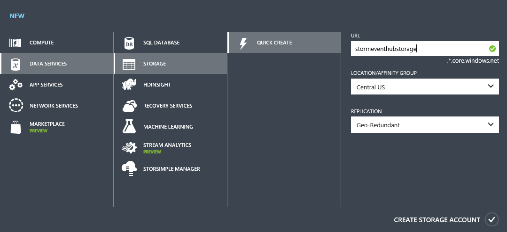
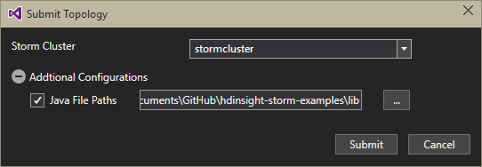
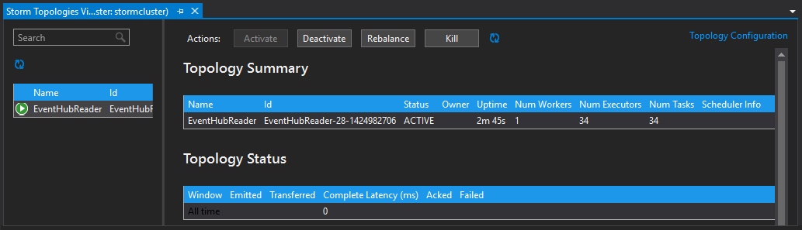

<properties
   pageTitle="Process events from Event Hub with Storm on HDInsight | Azure"
   description="Learn how to process Event Hub data with a C# Storm topology created in Visual Studio using the HDInsight Tools for Visual Studio."
   services="hdinsight"
   documentationCenter=""
   authors="Blackmist"
   manager="paulettm"
   editor="cgronlun"/>

<tags
   ms.service="hdinsight"
   ms.devlang="dotnet"
   ms.topic="article"
   ms.tgt_pltfrm="na"
   ms.workload="big-data"
   ms.date="03/03/2015"
   ms.author="larryfr"/>

#Process events from Azure Event Hub with Storm on HDInsight (C#)

Azure Event Hub allows you to process massive amounts of data from websites, apps, and devices. The Event Hub Spout makes it easy to use Apache Storm on HDInsight to analyze this data in real-time. You can also write data to Event Hub from Storm using the Event Hub Bolt.

In this document, you will learn how to use the HDInsight Tools for Visual Studio and the Event Hub Spout and Bolt to create two hybrid C#/Java topologies:

* **EventHubWriter** - randomly generates data and writes it to Event Hub

* **EventHubReader** - reads data from Event Hub and stores it in Azure Table Storage

##Prerequisites

* An <a href="../hdinsight-storm-getting-started/" target="_blank">Apache Storm on HDInsight cluster</a>

* An <a href="../service-bus-event-hubs-csharp-ephcs-getstarted/" target="_blank">Azure Event Hub</a>

* The <a href="http://azure.microsoft.com/downloads/" target="_blank">Azure .NET SDK</a>

* The <a href="../hdinsight-hadoop-visual-studio-tools-get-started/" target="_blank">HDInsight Tools for Visual Studio</a> - the 2/17/2015 version or newer

##Completed project

You can download a complete version of the project created in this article at [https://github.com/Blackmist/eventhub-storm-hybrid](https://github.com/Blackmist/eventhub-storm-hybrid); however, you will still need to provide configuration settings by following the steps in this document.

> [AZURE.NOTE] When using the completed project, you must use the **NuGet Package Manager** to restore packages required by this solution.

##Event Hub spout and bolt

The Event Hub spout and bolt are Java components that allow you to easily work with Event Hub from Apache Storm. While these components are written in Java, the HDInsight Tools for Visual Studio allow you to create hybrid topologies that mix C# and Java components.

The spout and bolt are distributed as a single Java archive (.jar) file named **eventhubs-storm-spout-0.9-jar-with-dependencies.jar**.

###Download the Jar

The most recent version of the **eventhubs-storm-spout-0.9-jar-with-dependencies.jar** file is included in the <a href="https://github.com/hdinsight/hdinsight-storm-examples" target="_blank">https://github.com/hdinsight/hdinsight-storm-examples</a> project under the **lib** folder. To download the file, use one of the following methods.

> [AZURE.NOTE] The spout and bolt have been submitted for inclusion in the Apache Storm project. For more information, see the <a href="https://github.com/apache/storm/pull/336/files">pull request</a>.

* **Download a ZIP file** - From the <a href="https://github.com/hdinsight/hdinsight-storm-examples" target="_blank">https://github.com/hdinsight/hdinsight-storm-examples</a> site, select the **Download ZIP** button to download a .zip file containing the project.

	

	Once downloaded, you can extract the archive and the file will be in the **lib** directory.

* **Clone the project** - If you have <a href="http://git-scm.com/" target="_blank">Git</a> installed, use the following command to clone the repository locally, then find the file in the **lib** directory.

		git clone https://github.com/hdinsight/hdinsight-storm-examples

##Configure Event Hub

Event Hub is the data source for this example. Use the following steps to create a new Event Hub.

1. From the [Azure Portal](https://manage.windowsazure.com), select **NEW | Service Bus | Event Hub | Custom Create**.

2. On the **Add a new Event Hub** dialog, enter an **Event Hub Name**, select the **Region** to create the hub in, and either create a new namespace or select an existing one. Finally, click the **Arrow**.

	

	> [AZURE.NOTE] You should select the same **Location** as your Storm on HDInsight server to reduce latency and costs.

2. On the **Configure Event Hub** dialog, enter the **Partition count** and **Message Retention** values. For this example, use a partition count of 10 and a message retention of 1. Note the partition count, as you will need this value later.

	

3. Once the event hub has been created, select the namespace, then select **Event Hubs**. Finally, select the event hub you created earlier.

4. Select **Configure**, then create two new access policies using the following information.

	<table>
	<tr><th>Name</th><th>Permissions</th></tr>
	<tr><td>writer</td><td>Send</td></tr>
	<tr><td>reader</td><td>Listen</td></tr>
	</table>

	After creating permissions, select the **Save** icon at the bottom of the page. This creates the shared access policies that will be used to send (writer,) and listen (reader) to this Event Hub.

	

5. After saving the policies, use the **Shared access key generator** at the bottom of the page to retrieve the key for both the **writer** and **reader** policies. Save these as they will be used later.

##Configure Table Storage

Table storage will be used to hold values read from Event Hub, as you can easily view Table Storage from inside Visual Studio through **Server Explorer**. Use the following steps to create new Table storage.

1. From the [Azure Portal](https://manage.windowsazure.com), select **NEW | Data Services | Storage | Quick Create**.

	

2. Enter a **Name** for the Storage Account, select a **Location**, and then select the **checkmark** to create the Storage Account.

	> [AZURE.NOTE] You should select the same **Location** as your Event Hub and Storm on HDInsight server to reduce latency and costs.

3. Once the new Storage Account is provisioned, select the account and then use the **Manage Access Keys** link at the bottom of the page to retrieve the **Storage Account Name** and **Primary Access Key**. Save this information as it will be used later.

	

##Create the EventHubWriter

In this section, you will create a topology that writes data to Event Hub using the Event Hub Bolt.

1. If you have not already installed the latest version of the HDInsight Tools for Visual Studio, see <a href="../hdinsight-hadoop-visual-studio-tools-get-started/" target="_blank">Get started using HDInsight Tools for Visual Studio</a>.

2. Open Visual Studio, select **File**, **New**, and then **Project**.

3. From the **New Project** dialog, expand **Installed**, **Templates**, and select **HDInsight**. From the list of templates, select **Storm Application**. At the bottom of the dialog, enter **EventHubWriter** as the name of the application.

	

4. Once the project has been created, you should have the following files:

	* **Program.cs** - this defines the topology for your project. Note that a default topology consisting of one spout and one bolt is created by default

	* **Spout.cs** - an example spout

	* **Bolt.cs** - an example bolt. This will be deleted as you will use the Event Hub Bolt to write to Event Hub

###Configuration

1. In **Solution Explorer**, right-click **EventHubWriter** and then select **Properties**.

2. In the project properties, select **Settings** and then select **This project does not contain a default settings file. Click here to create one.**

3. Enter the following settings. Use the information for the Event Hub you created earlier in the **Value** column.

	<table>
	<tr><th style="text-align:left">Name</th><th style="text-align:left">Type</th><th style="text-align:left">Scope</th></tr>
	<tr><td style="text-align:left">EventHubPolicyName</td><td style="text-align:left">string</td><td style="text-align:left">Application</td></tr>
	<tr><td style="text-align:left">EventHubPolicyKey</td><td style="text-align:left">string</td><td style="text-align:left">Application</td></tr>
	<tr><td style="text-align:left">EventHubNamespace</td><td style="text-align:left">string</td><td style="text-align:left">Application</td></tr>
	<tr><td style="text-align:left">EventHubName</td><td style="text-align:left">string</td><td style="text-align:left">Application</td></tr>
	<tr><td style="text-align:left">EventHubPartitionCount</td><td style="text-align:left">int</td><td style="text-align:left">Application</td></tr>
	</table>

4. Save and close the properties page.

###Define the topology

1. In **Solution Explorer**, right-click **Bolt.cs** and select **Delete**. Since you are using the Java Event Hub bolt, you do not need this file.

2. Open the **Program.cs** file and add the following immediately after the `TopologyBuilder topologyBuilder = new TopologyBuilder("EventHubWriter");` line.

		int partitionCount = Properties.Settings.Default.EventHubPartitionCount;
		List<string> javaDeserializerInfo =
            new List<string>() { "microsoft.scp.storm.multilang.CustomizedInteropJSONDeserializer", "java.lang.String" };

	The first line reads the partition count from the properties defined earlier. The second line defines a deserializer that is used to deseralize JSON data produced by the spout, into a `java.lang.String` so that Java components can consume the data.

4. Find the following code.

		topologyBuilder.SetSpout(
            "Spout",
            Spout.Get,
            new Dictionary<string, List<string>>()
            {
                {Constants.DEFAULT_STREAM_ID, new List<string>(){"count"}}
            },
            1);

	Replace it with the following.

		topologyBuilder.SetSpout(
            "Spout",
            Spout.Get,
            new Dictionary<string, List<string>>()
            {
                {Constants.DEFAULT_STREAM_ID, new List<string>(){"Event"}}
            },
            partitionCount).
            DeclareCustomizedJavaDeserializer(javaDeserializerInfo);

	This creates a spout and uses the Event Hub partition count as the parallelism hint for this component. This should create an instance of the spout for each partition.

	This also associates the deserializer created previously with the output stream from this component. This allows the downstream EventHubSpout component to consume the data produced from the C# spout.

5. Immediately after the previous code, add the following.

		JavaComponentConstructor constructor =
            JavaComponentConstructor.CreateFromClojureExpr(
            String.Format(@"(com.microsoft.eventhubs.bolt.EventHubBolt. (com.microsoft.eventhubs.bolt.EventHubBoltConfig. " +
            @"""{0}"" ""{1}"" ""{2}"" ""{3}"" ""{4}"" {5}))",
            Properties.Settings.Default.EventHubPolicyName,
            Properties.Settings.Default.EventHubPolicyKey,
            Properties.Settings.Default.EventHubNamespace,
            "servicebus.windows.net", //suffix for servicebus fqdn
            Properties.Settings.Default.EventHubName,
			"true"));

	This creates a new constructor for the Java bolt, which is used at runtime to configure a new instance of the bolt. In this case, you are using the <a href="http://storm.apache.org/documentation/Clojure-DSL.html" target="_blank">Apache Storm Clojure DSL</a> to configure the spout with the Event Hub configuration information you added previously. More specifically, this code is used by HDInsight at runtime to do the following:

	* Create a new instance of **com.microsoft.eventhubs.bolt.EventHubBoltConfig** using the Event Hub information you provide.
	* Create a new instance of **com.microsoft.eventhubs.bolt.EventHubBolt**, passing in the **EventHubBoltConfig** instance.

6. Find the following code.

		topologyBuilder.SetBolt(
            "Bolt",
            Bolt.Get,
            new Dictionary<string, List<string>>(),
            1).shuffleGrouping("Spout");

	Replace it with the following.

		topologyBuilder.SetJavaBolt(
            "EventHubBolt",
            constructor,
            partitionCount).
            shuffleGrouping("Spout");

	This instructs the topology to use the **JavaComponentConstructor** from the previous step as the bolt. The component can be referred to in this topology by the friendly name of "EventHubBolt". The parallelism hint is set to the number of partitions for the Event Hub, and it subscribes to data produced by the spout ("Spout").

At this point, you are done with the **Program.cs**. The topology has been defined, but now you must modify **Spout.cs** so that it produces data in a format that the Event Hub Bolt can use.

###Modify the spout

The Event Hub Bolt expects a single string value, which it will route to Event Hub. In the following example, you will modify the default **Spout.cs** file to produce a JSON string.

1. In **Solution Explorer**, right-click the **EventHubWriter** project and select **Manage Nuget Packages**. Search for the **Json.Net** package, then add that to the solution. This will allow us to easily create JSON data that will be sent to Event Hub using the Bolt.

1. Open **Spout.cs** and add the following at the top of the file.

		using Newtonsoft.Json;
		using Newtonsoft.Json.Linq;

	This will allow us to more easily work with JSON data.

3. Find the following code.

		Dictionary<string, List<Type>> outputSchema = new Dictionary<string, List<Type>>();
        outputSchema.Add("default", new List<Type>() { typeof(int) });
        this.ctx.DeclareComponentSchema(new ComponentStreamSchema(null, outputSchema));

	Replace it with the following.

		Dictionary<string, List<Type>> outputSchema = new Dictionary<string, List<Type>>();
        outputSchema.Add("default", new List<Type>() { typeof(string) });
        this.ctx.DeclareComponentSchema(new ComponentStreamSchema(null, outputSchema));
        this.ctx.DeclareCustomizedSerializer(new CustomizedInteropJSONSerializer());

	This changes the definition of the data created by the spout to use **string** data, and the **CustomizedInteropJSONSerializer** declared eariler in the topology (in program.cs).

2. Replace the **NextTuple** method with the following.

		public void NextTuple(Dictionary<string, Object> parms)
        {
            JObject eventData = new JObject();
            eventData.Add("deviceId", r.Next(10));
            eventData.Add("deviceValue", r.Next());
            ctx.Emit(new Values(eventData.ToString(Formatting.None)));
        }

	This will randomly generate a device ID, a value, and then use Json.net to emit a JSON object using these values.

3. Save the **Spout.cs** file.

At this point, you have a basic topology that will generate random data and store it into Event Hub using the Event Hub Bolt. Next, you will create the reader.

##Create the EventHubReader

In this section, you will create a topology that reads data from Event Hub using the Event Hub Spout

2. Open Visual Studio, select **File**, **New**, and then **Project**.

3. From the **New Project** dialog, expand **Installed**, **Templates**, and select **HDInsight**. From the list of templates, select **Storm Application**. At the bottom of the dialog, enter **EventHubReader** as the name of the application.

###Configuration

1. In **Solution Explorer**, right-click **EventHubReader** and then select **Properties**.

2. In the project properties, select **Settings** and then select **This project does not contain a default settings file. Click here to create one.**

3. Enter the following settings. Use the information for the Event Hub and Storage Account you created earlier in the **Value** column.

	<table>
	<tr><th style="text-align:left">Name</th><th style="text-align:left">Type</th><th style="text-align:left">Scope</th></tr>
	<tr><th style="text-align:left">EventHubPolicyName</th><th style="text-align:left">string</th><th style="text-align:left">Application</th></tr>
	<tr><th style="text-align:left">EventHubPolicyKey</th><th style="text-align:left">string</th><th style="text-align:left">Application</th></tr>
	<tr><th style="text-align:left">EventHubNamespace</th><th style="text-align:left">string</th><th style="text-align:left">Application</th></tr>
	<tr><th style="text-align:left">EventHubName</th><th style="text-align:left">string</th><th style="text-align:left">Application</th></tr>
	<tr><th style="text-align:left">EventHubPartitionCount</th><th style="text-align:left">int</th><th style="text-align:left">Application</th></tr>
	<tr><th style="text-align:left">StorageConnection</th><th style="text-align:left">(Connection String)</th><th style="text-align:left">Application</th></tr>
	<tr><th style="text-align:left">TableName</th><th style="text-align:left">string</th><th style="text-align:left">Application</th></tr>
	</table>

	For **TableName**, enter the name of the table that you wish events to be stored in.

  For **StorageConnection**, enter a value of `DefaultEndpointsProtocol=https;AccountName=myAccount;AccountKey=myKey;`. Replace **myAccount** and **myKey** with the storage account name and key obtained earlier.

	These values will be used by the topology to communicate with Event Hub and Table Storage.

4. Save and close the properties page.

###Define the topology

1. In **Solution Explorer**, right-click **Spout.cs** and select **Delete**. Since you are using the Java Event Hub spout, you do not need this file.

2. Open the **Program.cs** file and add the following immediately after the `TopologyBuilder topologyBuilder = new TopologyBuilder("EventHubReader");` line.

		int partitionCount = Properties.Settings.Default.EventHubPartitionCount;
		JavaComponentConstructor constructor = JavaComponentConstructor.CreateFromClojureExpr(
            String.Format(@"(com.microsoft.eventhubs.spout.EventHubSpout. (com.microsoft.eventhubs.spout.EventHubSpoutConfig. " +
                @"""{0}"" ""{1}"" ""{2}"" ""{3}"" {4} ""{5}""))",
                Properties.Settings.Default.EventHubPolicyName,
                Properties.Settings.Default.EventHubPolicyKey,
                Properties.Settings.Default.EventHubNamespace,
                Properties.Settings.Default.EventHubName,
                partitionCount,
                "")); //Last value is the zookeeper connection string - leave empty

	The partition count is read in and assigned to a local variable since it will be used multiple times.

	The `JavaComponentConstructor` defines how the Java spout will be constructed at runtime. In this case, you are using the <a href="http://storm.apache.org/documentation/Clojure-DSL.html" target="_blank">Apache Storm Clojure DSL</a> to configure the spout with the Event Hub configuration information you added previously. More specifically, this code is used by HDInsight at runtime to do the following:

	* Create a new instance of **com.microsoft.eventhubs.spout.EventHubSpoutConfig** using the Event Hub information you provide.

	* Create a new instance of **com.microsoft.eventhubs.spout.EventHubSpout**, passing in the **EventHubSpoutConfig** instance.

5. Find the following code.

		topologyBuilder.SetSpout(
            "Spout",
            Spout.Get,
            new Dictionary<string, List<string>>()
            {
                {Constants.DEFAULT_STREAM_ID, new List<string>(){"count"}}
            },
            1);

	Replace it with the following.

        topologyBuilder.SetJavaSpout(
            "EventHubSpout",
            constructor,
            partitionCount);

	This instructs the topology to use the **JavaComponentConstructor** from the previous step as the spout, and to give it a name of "EventHubSpout". This also sets the parallelisim hint for this component to the number of partitions in Event Hub.

2. Add the following immediately after the previous code.

         List<string> javaSerializerInfo = new List<string>() { "microsoft.scp.storm.multilang.CustomizedInteropJSONSerializer" };

	This creates a custom serializer, which will be used to serialize information produced by the Java components (such as the EventHubSpout) into a JSON format that downstream C# components can use.

3. Find the following code.

		topologyBuilder.SetBolt(
            "Bolt",
            Bolt.Get,
            new Dictionary<string, List<string>>(),
            1).shuffleGrouping("Spout");

	And replace it with the following.

		topologyBuilder.SetBolt(
            "Bolt",
            Bolt.Get,
            new Dictionary<string, List<string>>(),
            partitionCount,
            true).
            DeclareCustomizedJavaSerializer(javaSerializerInfo).
            shuffleGrouping("EventHubSpout");

	This code instructs the topology to use a bolt (defined in Bolt.cs). The custom serializer defined earlier is used here so that this bolt can consume data produced by upstream Java components. In this case, the EventHubSpout.

    > [AZURE.IMPORTANT] The last parameter for SetBolt, (with a value of `true`,) enables ACK functionality for this bolt. This is required, as the EventHubSpout component expects an ACK for data that it emits. If ACKs are not returned by downstream components, the spout will stop receiving after processing around 1000 messages.

At this point, you are done with the **Program.cs**. The topology has been defined, but now you must create a helper class to write data to Table Storage, then you must modify **Bolt.cs** so that it can understand the data produced by the spout.

###Create a helper class

When writing data to Table Storage, you must create a class that describes the data that will be written.

1. In **Solution Explorer**, right-click the **EventHubReader** project and select **Add**, **New Class**. Name the new class **Devices.cs**.

2. Open **Devices.cs** and replace the default code with the following.

		using System;
		using System.Collections.Generic;
		using System.Linq;
		using System.Text;
		using System.Threading.Tasks;
		using Microsoft.WindowsAzure.Storage.Table;

		namespace EventHubReader
		{
		    class Device : TableEntity
		    {
		        public int value { get; set; }

		        public Device() { }
		        public Device(int id)
		        {
		            this.PartitionKey = id.ToString();
		            this.RowKey = System.Guid.NewGuid().ToString();
		        }
		    }
		}

	This will create entities in Table Storage that consist of a Partition key (which will be set to the device ID read from Event Hub,) a unique Row key, and a value that is read from Event Hub. Each entity will also have a Timestamp, which will be created automatically when the entity is inserted in the table.

###Modify the bolt

1. In **Solution Explorer**, right-click the **EventHubReader** project and select **Manage Nuget Packages**. Search for the **Json.Net** package, then add that to the solution. This will allow us to easily process the JSON data received from the spout. Also add the **Windows Azure Storage** package, which will allow us to write to table storage.

1. Open **Bolt.cs** and add the following at the top of the file.

		using Newtonsoft.Json.Linq;
		using Microsoft.WindowsAzure.Storage;
		using Microsoft.WindowsAzure.Storage.Table;

	This will allow us to more easily work with JSON data from the bolt and write data to Table Storage.

2. Find the `private int count;` statement and replace it with the following.

        private CloudTable table;

	This will be used when connecting to the table.

4. Find the following code.

		Dictionary<string, List<Type>> inputSchema = new Dictionary<string, List<Type>>();
        inputSchema.Add("default", new List<Type>() { typeof(int) });
        this.ctx.DeclareComponentSchema(new ComponentStreamSchema(inputSchema, null));

	Replace it with the following.

		Dictionary<string, List<Type>> inputSchema = new Dictionary<string, List<Type>>();
        inputSchema.Add("default", new List<Type>() { typeof(string) });
        this.ctx.DeclareComponentSchema(new ComponentStreamSchema(inputSchema, null));
        this.ctx.DeclareCustomizedDeserializer(new CustomizedInteropJSONDeserializer());

	This instructs the bolt that it will be receiving a **string** value instead of an **int**, and that the data should be deserialized using the **CustomizedInteropJSONDeserialzer** that was declared in the topology earlier (in the program.cs file).

3. Immediately after the previous code, add the following.

		CloudStorageAccount storageAccount = CloudStorageAccount.Parse(Properties.Settings.Default.StorageConnection);
        CloudTableClient tableClient = storageAccount.CreateCloudTableClient();
        table = tableClient.GetTableReference(Properties.Settings.Default.TableName);
        table.CreateIfNotExists();

	This will connect to the **events** table using the connection string configured previously. If it does not exist, it will be created.

2. Find the **Execute** method and replace it with the following.

		public void Execute(SCPTuple tuple)
        {
            Context.Logger.Info("Processing events");
            string eventValue = (string)tuple.GetValue(0);
            if (eventValue != null)
            {
                JObject eventData = JObject.Parse(eventValue);

                Device device = new Device((int)eventData["deviceId"]);
                device.value = (int)eventData["deviceValue"];

                TableOperation insertOperation = TableOperation.Insert(device);

                table.Execute(insertOperation);
                this.ctx.Ack(tuple);
            }
        }

	This uses Json.net to parse the JSON data from the spout, and then picks out the **deviceId** and **deviceValue** fields. A new **Device** object is then created, using the **deviceId** during initialization to set the Partition key for the table. The value is then set to **deviceValue**, and finally the entity is inserted into the table.

    After the entity is inserted into the table, `Ack()` is called for the tuple, to inform the spout that we have successfully processed the data.

    > [AZURE.IMPORTANT] The EventHubSpout component expects an ACK for each tuple from downstream components such as this bolt. If ACKS are not received, the EventHubSpout will assume processing for the tuple has failed.

At this point, you have a complete topology that will read data from Event Hub, and store it in Table Storage in a table named **events**.

##Deploy the topologies

1. Open the **EventHubReader** solution. From **Solution Explorer**, right-click on the **EventHubReader** project and select **Submit to Storm on HDInsight**.

	

2. In the **Submit Topology** dialog, select your **Storm Cluster**. Expand **Additional Configurations**, select **Java File Paths**, select **...** and select the directory that contains the **eventhubs-storm-spout-0.9-jar-with-dependencies.jar** you downloaded earlier. Finally, select **Submit**.

	

3. Once the topology has been submitted, the **Storm Topologies Viewer** will appear. Select the **EventHubReader** topology from the left of the dialog to view statistics for the topology. Currently, nothing should be happening as no events have been written to Event Hub yet.

	

4. Open the **EventHubWriter** solution. From **Solution Explorer**, right-click on the **EventHubWriter** project and select **Submit to Storm on HDInsight**.

2. In the **Submit Topology** dialog, select your **Storm Cluster**. Expand **Additional Configurations**, select **Java File Paths**, select **...** and select the directory that contains the **eventhubs-storm-spout-0.9-jar-with-dependencies.jar** you downloaded earlier. Finally, select **Submit**.

5. Once the topology has been submitted, refresh the topology list in the **Storm Topologies Viewer** to verify that both are running on the cluster.

6. Once both are running, select **Server Explorer**, then expand **Azure**, **Storage**, and finally expand the Storage Account you created earlier. Under the Storage Account, expand **Tables**. Finally, double click the **events** table to open the table. You should see data that has been stored in the table from the **EventHubReader** topology.

	* The events are being generated by the **EventHubWriter** topology, which writes them to Event Hub.

	* The **EventHubReader** then reads the events from Event Hub and stores them into Table Storage, into the **events** table.

##Stop the topologies

To stop the topologies, select each topology in the **Storm Topology Viewer**, then select **Kill**.

##Summary

In this document, you have learned how to use the Java Event Hub Spout and Bolt from a C# topology to work with data in Azure Event Hub. To learn more about creating C# topologies, see the following.

* [Develop C# topologies for Apache Storm on HDInsight using Visual Studio](hdinsight-storm-develop-csharp-visual-studio-topology.md)

* [HDInsight Storm Examples](https://github.com/hdinsight/hdinsight-storm-examples)
