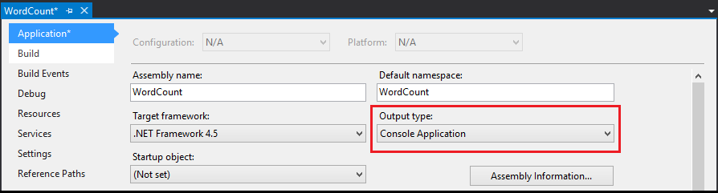

<properties
   pageTitle="Develop C# topologies for Apache Storm on HDInsight using Visual Studio | Azure"
   description="Learn how to create Storm topologies in C# by creating a simple word count topology in Visual Studio using the HDInsight Tools for Visual Studio."
   services="hdinsight"
   documentationCenter=""
   authors="Blackmist"
   manager="paulettm"
   editor="cgronlun"/>

<tags
   ms.service="hdinsight"
   ms.devlang="java"
   ms.topic="article"
   ms.tgt_pltfrm="na"
   ms.workload="big-data"
   ms.date="04/28/2015"
   ms.author="larryfr"/>

# Develop C# topologies for Apache Storm on HDInsight using Visual Studio

Learn how to create a C# Storm topology by using the HDInsight tools for Visual Studio. This tutorial walks through the process of creating a new Storm project in Visual Studio, testing it locally, and deploying it to an Apache Storm on HDInsight cluster.

You will also learn how to create hybrid topologies that use C# and Java components.

##Prerequisites

* One of the following versions of Visual Studio

	* Visual Studio 2012 with <a href="http://www.microsoft.com/download/details.aspx?id=39305" target="_blank">Update 4</a>

	* Visual Studio 2013 with <a href="http://www.microsoft.com/download/details.aspx?id=44921" target="_blank">Update 4</a> or <a href="http://go.microsoft.com/fwlink/?LinkId=517284" target="_blank">Visual Studio 2013 Community</a>

	* <a href="http://visualstudio.com/downloads/visual-studio-2015-ctp-vs" target="_blank">Visual Studio 2015 CTP6</a>

* Azure SDK 2.5.1 or later

* HDInsight Tools for Visual Studio: See <a href="../hdinsight-hadoop-visual-studio-tools-get-started/" target="_blank">Get started using HDInsight Tools for Visual Studio</a> to install and configure the HDInsight tools for Visual Studio.

* Apache Storm on HDInsight cluster: See <a href="../hdinsight-storm-getting-started/" target="_blank">Getting started with Apache Storm on HDInsight</a> for steps to create a cluster.

	> [AZURE.NOTE] Currently, the HDInsight Tools for Visual Studio only support Storm on HDInsight versions 3.2 clusters.

##Create a C# topology

1. If you have not already installed the latest version of the HDInsight Tools for Visual Studio, see <a href="../hdinsight-hadoop-visual-studio-tools-get-started/" target="_blank">Get started using HDInsight Tools for Visual Studio</a>.

2. Open Visual Studio, select **File** > **New**, and then **Project**.

3. From the **New Project** screen, expand **Installed** > **Templates**, and select **HDInsight**. From the list of templates, select **Storm Application**. At the bottom of the screen, enter **WordCount** as the name of the application.

	

4. After the project has been created, you should have the following files:

	* **Program.cs**: This defines the topology for your project. Note that a default topology that consists of one spout and one bolt is created by default.

	* **Spout.cs**: An example spout that emits random numbers.

	* **Bolt.cs**: An example bolt that keeps a count of numbers emitted by the spout.

	As part of project creation, the latest <a href="https://www.nuget.org/packages/Microsoft.SCP.Net.SDK/" target="_blank">SCP.NET packages</a> will be downloaded from NuGet.

In the next sections, you will modify this project into a basic WordCount application.

###Implement the spout

5. Open **Spout.cs**. Spouts are used to read data in a topology from an external source. The main components for a spout are:

	* **NextTuple**: Called by Storm when the spout is allowed to emit new tuples.

	* **Ack** (transactional topology only): Handles acknowledgements initiated by other components in the topology for tuples sent from this spout. Acknowledging a tuple lets the spout know that it was processed successfully by downstream components.

	* **Fail** (transactional topology only): Handles tuples that are fail-processing other components in the topology. This provides the opportunity to re-emit the tuple so that it can be processed again.

6. Replace the contents of the **Spout** class with the following. This creates a spout that randomly emits a sentence into the topology.

		private Context ctx;
        private Random r = new Random();
        string[] sentences = new string[] {
            "the cow jumped over the moon",
            "an apple a day keeps the doctor away",
            "four score and seven years ago",
            "snow white and the seven dwarfs",
            "i am at two with nature"
        };

        public Spout(Context ctx)
        {
			// Set the instance context
            this.ctx = ctx;

            Context.Logger.Info("Generator constructor called");

            // Declare Output schema
            Dictionary<string, List<Type>> outputSchema = new Dictionary<string, List<Type>>();
            // The schema for the default output stream is
            // a tuple that contains a string field
            outputSchema.Add("default", new List<Type>() { typeof(string) });
            this.ctx.DeclareComponentSchema(new ComponentStreamSchema(null, outputSchema));
        }

		// Get an instance of the spout
        public static Spout Get(Context ctx, Dictionary<string, Object> parms)
        {
            return new Spout(ctx);
        }

        public void NextTuple(Dictionary<string, Object> parms)
        {
            Context.Logger.Info("NextTuple enter");
            // The sentence to be emitted
            string sentence;

            // Get a random sentence
            sentence = sentences[r.Next(0, sentences.Length - 1)];
            Context.Logger.Info("Emit: {0}", sentence);
            // Emit it
            this.ctx.Emit(new Values(sentence));

            Context.Logger.Info("NextTuple exit");
        }

        public void Ack(long seqId, Dictionary<string, Object> parms)
        {
			// Only used for transactional topologies
        }

        public void Fail(long seqId, Dictionary<string, Object> parms)
        {
			// Only used for transactional topologies
        }

	Take a moment to read through the comments to understand what this code does.

###Implement the bolts

1. Delete the existing **Bolt.cs** file from the project.

2. In **Solution Explorer**, right-click the project and select **Add** > **New item**. From the list, select **Storm Bolt**, and enter **Splitter.cs** as the name. Repeat this to create a second bolt named **Counter.cs**.

	* **Splitter.cs**: Implements a bolt that splits sentences into individual words and emits a new stream of words.

	* **Counter.cs**: Implements a bolt that counts each word and emits a new stream of words and the count for each word.

	> [AZURE.NOTE] These bolts simply read and write to streams, but you can also use a bolt to communicate with sources such as a database or service.

6. Open **Splitter.cs**. Note that it has only one method by default: **Execute**. This is called when the bolt receives a tuple for processing. Here, you can read and process incoming tuples, and emit outbound tuples.

4. Replace the contents of the **Splitter** class with the following code:

		private Context ctx;

        // Constructor
        public Splitter(Context ctx)
        {
            Context.Logger.Info("Splitter constructor called");
            this.ctx = ctx;

            // Declare Input and Output schemas
            Dictionary<string, List<Type>> inputSchema = new Dictionary<string, List<Type>>();
            // Input contains a tuple with a string field (the sentence)
            inputSchema.Add("default", new List<Type>() { typeof(string) });
            Dictionary<string, List<Type>> outputSchema = new Dictionary<string, List<Type>>();
            // Outbound contains a tuple with a string field (the word)
            outputSchema.Add("default", new List<Type>() { typeof(string) });
            this.ctx.DeclareComponentSchema(new ComponentStreamSchema(inputSchema, outputSchema));
        }

        // Get a new instance of the bolt
        public static Splitter Get(Context ctx, Dictionary<string, Object> parms)
        {
            return new Splitter(ctx);
        }

        // Called when a new tuple is available
        public void Execute(SCPTuple tuple)
        {
            Context.Logger.Info("Execute enter");

            // Get the sentence from the tuple
            string sentence = tuple.GetString(0);
            // Split at space characters
            foreach (string word in sentence.Split(' '))
            {
                Context.Logger.Info("Emit: {0}", word);
                //Emit each word
                this.ctx.Emit(new Values(word));
            }

            Context.Logger.Info("Execute exit");
        }

	Take a moment to read through the comments to understand what this code does.

6. Open **Counter.cs** and replace the class contents with the following:

		private Context ctx;

        // Dictionary for holding words and counts
        private Dictionary<string, int> counts = new Dictionary<string, int>();

        // Constructor
        public Counter(Context ctx)
        {
            Context.Logger.Info("Counter constructor called");
            // Set instance context
            this.ctx = ctx;

            // Declare Input and Output schemas
            Dictionary<string, List<Type>> inputSchema = new Dictionary<string, List<Type>>();
            // A tuple containing a string field - the word
            inputSchema.Add("default", new List<Type>() { typeof(string) });

            Dictionary<string, List<Type>> outputSchema = new Dictionary<string, List<Type>>();
            // A tuple containing a string and integer field - the word and the word count
            outputSchema.Add("default", new List<Type>() { typeof(string), typeof(int) });
            this.ctx.DeclareComponentSchema(new ComponentStreamSchema(inputSchema, outputSchema));
        }

        // Get a new instance
        public static Counter Get(Context ctx, Dictionary<string, Object> parms)
        {
            return new Counter(ctx);
        }

        // Called when a new tuple is available
        public void Execute(SCPTuple tuple)
        {
            Context.Logger.Info("Execute enter");

            // Get the word from the tuple
            string word = tuple.GetString(0);
            // Do we already have an entry for the word in the dictionary?
            // If no, create one with a count of 0
            int count = counts.ContainsKey(word) ? counts[word] : 0;
            // Increment the count
            count++;
            // Update the count in the dictionary
            counts[word] = count;

            Context.Logger.Info("Emit: {0}, count: {1}", word, count);
            // Emit the word and count information
            this.ctx.Emit(Constants.DEFAULT_STREAM_ID, new List<SCPTuple> { tuple }, new Values(word, count));

            Context.Logger.Info("Execute exit");
        }

	Take a moment to read through the comments to understand what this code does.

###Define the topology

Spouts and bolts are arranged in a graph, which defines how the data flows between components. For this topology, the graph is as follows:

Sentences are emitted from the spout, which are distributed to instances of the Splitter bolt. The Splitter bolt breaks the sentences into words, which are distributed to the Counter bolt.

Because word count is held locally in the Counter instance, we want to make sure that specific words flow to the same Counter bolt instance, so we have only one instance keeping track of a specific word. But for the Splitter bolt, it really doesn't matter which bolt receives which sentence, so we simply want to load balance sentences across those instances.

Open **Program.cs**. The important method is **ITopologyBuilder**, which is used to define the topology that is submitted to Storm. Replace the contents of **ITopologyBuilder** with the following code to implement the topology described previously:

		// Create a new topology named 'WordCount'
        TopologyBuilder topologyBuilder = new TopologyBuilder("WordCount");

        // Add the spout to the topology.
        // Name the component 'sentences'
        // Name the field that is emitted as 'sentence'
        topologyBuilder.SetSpout(
            "sentences",
            Spout.Get,
            new Dictionary<string, List<string>>()
            {
                {Constants.DEFAULT_STREAM_ID, new List<string>(){"sentence"}}
            },
            1);
        // Add the splitter bolt to the topology.
        // Name the component 'splitter'
        // Name the field that is emitted 'word'
        // Use suffleGrouping to distribute incoming tuples
        //   from the 'sentences' spout across instances
        //   of the splitter
        topologyBuilder.SetBolt(
            "splitter",
            Splitter.Get,
            new Dictionary<string, List<string>>()
            {
                {Constants.DEFAULT_STREAM_ID, new List<string>(){"word"}}
            },
            1).shuffleGrouping("sentences");

        // Add the counter bolt to the topology.
        // Name the component 'counter'
        // Name the fields that are emitted 'word' and 'count'
        // Use fieldsGrouping to ensure that tuples are routed
        //   to counter instances based on the contents of field
        //   position 0 (the word). This could also have been
        //   List<string>(){"word"}.
        //   This ensures that the word 'jumped', for example, will always
        //   go to the same instance
        topologyBuilder.SetBolt(
            "counter",
            Counter.Get,
            new Dictionary<string, List<string>>()
            {
                {Constants.DEFAULT_STREAM_ID, new List<string>(){"word", "count"}}
            },
            1).fieldsGrouping("splitter", new List<int>() { 0 });

        // Add topology config
        topologyBuilder.SetTopologyConfig(new Dictionary<string, string>()
        {
            {"topology.kryo.register","[\"[B\"]"}
        });

        return topologyBuilder;

Take a moment to read through the comments to understand what this code does.

##Submit the topology

1. In **Solution Explorer**, right-click the project, and select **Submit to Storm on HDInsight**.

	> [AZURE.NOTE] If prompted, enter the login credentials for your Azure subscription. If you have more than one subscription, log in to the one that contains your Storm on HDInsight cluster.

2. Select your Storm on HDInsight cluster from the **Storm Cluster** drop-down list, and then select **Submit**. You can monitor if the submission is successful by using the **Output** window.

3. When the topology has been successfully submitted, the **Storm Topologies** for the cluster should appear. Select the **WordCount** topology from the list to view information about the running topology.

	> [AZURE.NOTE] You can also view **Storm Topologies** from **Server Explorer**: Expand **Azure** > **HDInsight**, right-click a Storm on HDInsight cluster, and then select **View Storm Topologies**.

	Use the links for the spouts or bolts to view information about these components. A new window will be opened for each item selected.

4. From the **Topology Summary** view, click **Kill** to stop the topology.

	> [AZURE.NOTE] Storm topologies continue to run until they are deactivated, or the cluster is deleted.

##Transactional topology

The previous topology is non-transactional. The components within the topology do not implement any functionality for replaying messages if processing fails by a component in the topology. For an example transactional topology, create a new project and select **Storm Sample** as the project type.

Transactional topologies implement the following to support replay of data:

* **Metadata caching**: The spout must store metadata about the data emitted so that the data can be retrieved and emitted again if a failure occurs. Because the data emitted by the sample is small, the raw data for each tuple is stored in a dictionary for replay.

* **Ack**: Each bolt in the topology can call `this.ctx.Ack(tuple)` to ack that it has successfully processed a tuple. When all bolts have acked the tuple, the `Ack` method of the spout is invoked. This allows the spout to remove cached data for replay because the data was completely processed.

* **Fail**: Each bolt can call `this.ctx.Fail(tuple)` to indicate that processing has failed for a tuple. The failure propagates to the `Fail` method of the spout, where the tuple can be replayed by using cached metadata.

* **Sequence ID**: When emitting a tuple, a sequence ID can be specified. This should be a value that identifies the tuple for replay (Ack and Fail) processing. For example, the spout in the **Storm Sample** project uses the following when emitting data:

		this.ctx.Emit(Constants.DEFAULT_STREAM_ID, new Values(sentence), lastSeqId);

	This emits a new tuple that contains a sentence to the default stream, with the sequence ID value contained in **lastSeqId**. For this example, **lastSeqId** is simply incremented for every tuple emitted.

As demonstrated in the **Storm Sample** project, whether a component is transactional can be set at run time, based on configuration.

##Hybrid topology

HDInsight tools for Visual Studio can also be used to create hybrid topologies, where some components are C# and others are Java.

For an example hybrid topology, create a new project, and select **Storm Hybrid Sample**. This creates a fully commented sample that contains several topologies that demonstrate the following:

* **Java spout** and **C# bolt**: Defined in **HybridTopology_javaSpout_csharpBolt**

	* A transactional version is defined in **HybridTopologyTx_javaSpout_csharpBolt**

* **C# spout** and **Java bolt**: Defined in **HybridTopology_csharpSpout_javaBolt**

	* A transactional version is defined in **HybridTopologyTx_csharpSpout_javaBolt**

		> [AZURE.NOTE] This version also demonstrates how to use Clojure code from a text file as a Java component.

To switch between the topology that is used when the project is submitted, simply move the `[Active(true)]` statement to the topology you want to use before submitting it to the cluster.

> [AZURE.NOTE] All the Java files that are required are provided as part of this project in the **JavaDependency** folder.

Consider the following when creating and submitting a hybrid topology:

* **JavaComponentConstructor** must be used to create a new instance of the Java class for a spout or bolt.

* **microsoft.scp.storm.multilang.CustomizedInteropJSONSerializer** should be used to serialize data in to or out of Java components from Java objects to JSON.

* When submitting the topology to the server, you must use the **Additional configurations** option to specify the **Java File paths**. The path specified should be the directory that contains the JAR files that contain your Java classes.

##Troubleshooting

###Test a topology locally

Although it is easy to deploy a topology to a cluster, in some cases, you may need to test a topology locally. Use the following steps to run and test the example topology in this tutorial locally in your development environment.

1. In **Solution Explorer**, right-click the project, and select **Properties**. In the project properties, change the **Output type** to **Console Application**.

	

	> [AZURE.NOTE] Remember to change the **Output type** back to **Class Library** before you deploy the topology to a cluster.

2. In **Solution Explorer**, right-click the project, then select **Add** > **New Item**. Select **Class** and enter **LocalTest.cs** as the class name. Finally, click **Add**.

3. Open **LocalTest.cs** and add the following **using** statement at the top:

		using Microsoft.SCP;

3. Use the following as the contents of the **LocalTest** class:

		// Drives the topology components
		public void RunTestCase()
		{
		    // An empty dictionary for use when creating components
		    Dictionary<string, Object> emptyDictionary = new Dictionary<string, object>();

		    #region Test the spout
		    {
		        Console.WriteLine("Starting spout");
		        // LocalContext is a local-mode context that can be used to initialize
		        // components in the development environment.
		        LocalContext spoutCtx = LocalContext.Get();
		        // Get a new instance of the spout, using the local context
		        Spout sentences = Spout.Get(spoutCtx, emptyDictionary);

		        // Emit 10 tuples
		        for (int i = 0; i < 10; i++)
		        {
		            sentences.NextTuple(emptyDictionary);
		        }
		        // Use LocalContext to persist the data stream to file
		        spoutCtx.WriteMsgQueueToFile("sentences.txt");
		        Console.WriteLine("Spout finished");
		    }
		    #endregion

		    #region Test the splitter bolt
		    {
		        Console.WriteLine("Starting splitter bolt");
		        // LocalContext is a local-mode context that can be used to initialize
		        // components in the development environment.
		        LocalContext splitterCtx = LocalContext.Get();
		        // Get a new instance of the bolt
		        Splitter splitter = Splitter.Get(splitterCtx, emptyDictionary);

		        // Set the data stream to the data created by the spout
		        splitterCtx.ReadFromFileToMsgQueue("sentences.txt");
		        // Get a batch of tuples from the stream
		        List<SCPTuple> batch = splitterCtx.RecvFromMsgQueue();
		        // Process each tuple in the batch
		        foreach (SCPTuple tuple in batch)
		        {
		            splitter.Execute(tuple);
		        }
		        // Use LocalContext to persist the data stream to file
		        splitterCtx.WriteMsgQueueToFile("splitter.txt");
		        Console.WriteLine("Splitter bolt finished");
		    }
		    #endregion

		    #region Test the counter bolt
		    {
		        Console.WriteLine("Starting counter bolt");
		        // LocalContext is a local-mode context that can be used to initialize
		        // components in the development environment.
		        LocalContext counterCtx = LocalContext.Get();
		        // Get a new instance of the bolt
		        Counter counter = Counter.Get(counterCtx, emptyDictionary);

		        // Set the data stream to the data created by splitter bolt
		        counterCtx.ReadFromFileToMsgQueue("splitter.txt");
		        // Get a batch of tuples from the stream
		        List<SCPTuple> batch = counterCtx.RecvFromMsgQueue();
		        // Process each tuple in the batch
		        foreach (SCPTuple tuple in batch)
		        {
		            counter.Execute(tuple);
		        }
		        // Use LocalContext to persist the data stream to file
		        counterCtx.WriteMsgQueueToFile("counter.txt");
		        Console.WriteLine("Counter bolt finished");
		    }
		    #endregion
		}

	Take a moment to read through the code comments. This code uses **LocalContext** to run the components in the development environment, and it persists the data stream between components to text files on the local drive.

2. Open **Program.cs** and add the following to the **Main** method:

        Console.WriteLine("Starting tests");
        System.Environment.SetEnvironmentVariable("microsoft.scp.logPrefix", "WordCount-LocalTest");
        // Initialize the runtime
        SCPRuntime.Initialize();

        //If we are not running under the local context, throw an error
        if (Context.pluginType != SCPPluginType.SCP_NET_LOCAL)
        {
            throw new Exception(string.Format("unexpected pluginType: {0}", Context.pluginType));
        }
		// Create test instance
        LocalTest tests = new LocalTest();
		// Run tests
        tests.RunTestCase();
        Console.WriteLine("Tests finished");
        Console.ReadKey();

3. Save the changes, then click **F5** or select **Debug** > **Start Debugging** to start the project. A console window should appear, and log status as the tests progress. When **Tests finished** appears, press any key to close the window.

4. Use **Windows Explorer** to locate the directory that contains your project, for example, **C:\Users\<your_user_name>\Documents\Visual Studio 2013\Projects\WordCount\WordCount**. In this directory, open **Bin**, and then click **Debug**. You should see the text files that were produced when the tests ran: sentences.txt, counter.txt, and splitter.txt. Open each text file and inspect the data.

	> [AZURE.NOTE] String data is persisted as an array of decimal values in these files. For example, [[97,103,111]] in the **splitter.txt** file is the word 'and'.

Although testing a basic word count application locally is pretty trivial, the real value comes when you have a complex topology that communicates with external data sources or performs complex data analysis. When you are working on such a project, you may need to set breakpoints and step through the code in your components to isolate issues.

> [AZURE.NOTE] Be sure to set the **Project type** back to **Class Library** before deploying to a Storm on HDInsight cluster.

###Log information

You can easily log information from your topology components by using `Context.Logger`. For example, the following will create an informational log entry:

	Context.Logger.Info("Component started");

Logged information can be viewed from the **Hadoop Service Log**, which is found in **Server Explorer**. Expand the entry for your Storm on HDInsight cluster, then expand **Hadoop Service Log**. Finally, select the log file to view.

> [AZURE.NOTE] The logs are stored in the Azure Storage account that is used by your cluster. If this is a different subscription than the one you are logged in to with Visual Studio, you need to log in to the subscription that contains the storage account to view this information.

###View error information

To view errors that have occurred in a running topology, use the following steps:

1. From **Server Explorer**, right-click the Storm on HDInsight cluster, and select **View Storm topologies**.

2. For the **Spout** and **Bolts**, the **Last Error** column will have information on the last error that has occurred.

2. Select the **Spout Id** or **Bolt Id** for the component that has an error listed. On the details page that is displayed, additional error information will be listed in the **Errors** section at the bottom of the page.

3. To obtain more information, select a **Port** from the **Executors** section of the page to see the Storm worker log for the last few minutes.

##Next steps

Now that you have learned how to develop and deploy Storm topologies from the HDInsight tools for Visual Studio, learn how to [Process events from Azure Event Hub with Storm on HDInsight](hdinsight-storm-develop-csharp-event-hub-topology.md).

For an example of a C# topology that splits stream data into multiple streams, see [C# Storm example](https://github.com/Blackmist/csharp-storm-example).

To discover more information about creating C# topologies, visit [SCP.NET GettingStarted.md](https://github.com/hdinsight/hdinsight-storm-examples/blob/master/SCPNet-GettingStarted.md).

For more ways to work with HDInsight and more Storm on HDinsight samples, see the following:

**Apache Storm on HDInsight**

* [Deploy and monitor topologies with Apache Storm on HDInsight](hdinsight-storm-deploy-monitor-topology.md)

* [Example topologies for Storm on HDInsight](hdinsight-storm-example-topology.md)

**Apache Hadoop on HDInsight**

* [Use Hive with Hadoop on HDInsight](hdinsight-use-hive.md)

* [Use Pig with Hadoop on HDInsight](hdinsight-use-pig.md)

* [Use MapReduce with Hadoop on HDInsight](hdinsight-use-mapreduce.md)

**Apache HBase on HDInsight**

* [Getting started with HBase on HDInsight](hdinsight-hbase-get-started.md)
