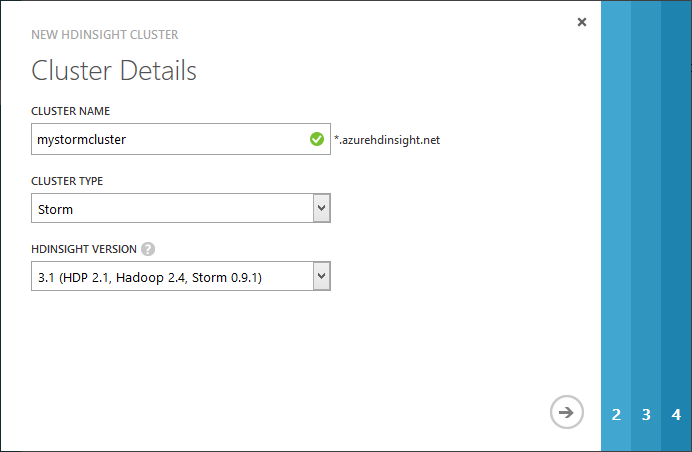
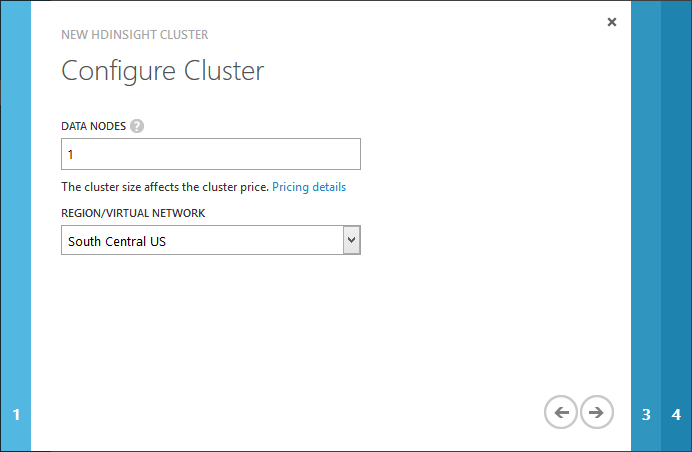
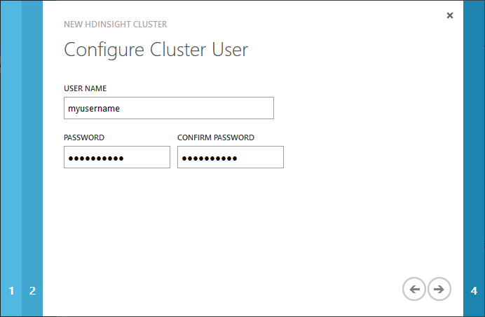
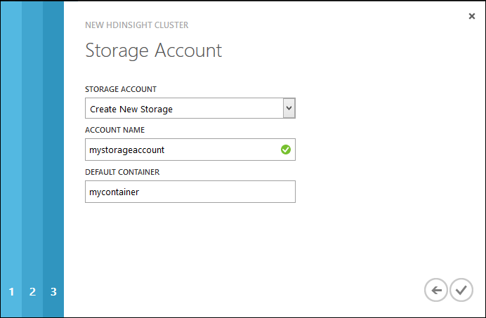
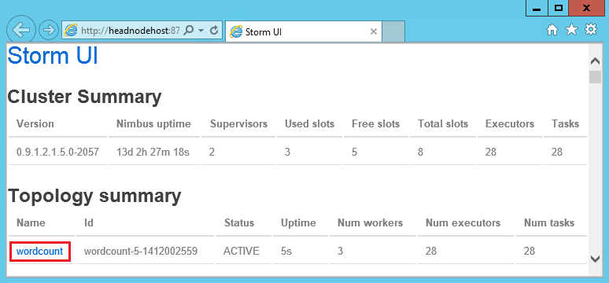
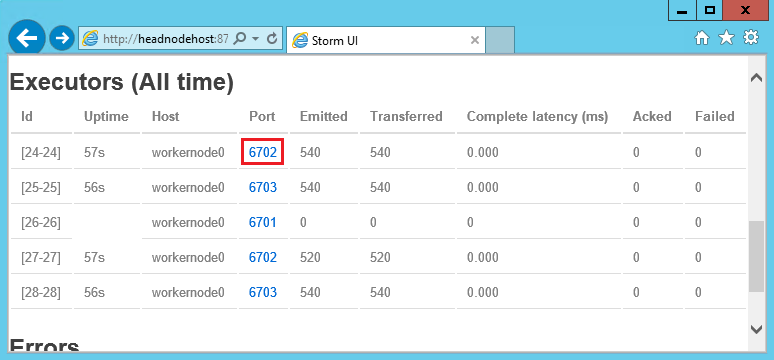

<properties title="Getting started using Storm with Hadoop in HDInsight" pageTitle="Getting started using Apache Storm with Microsoft Azure HDInsight (Hadoop)" description="Learn how to use  Apache Storm to process data in realtime with HDInsight (Hadoop)" metaKeywords="Azure hdinsight storm, Azure hdinsight realtime, azure hadoop storm, azure hadoop realtime, azure hadoop real-time, azure hdinsight real-time" services="hdinsight" solutions="" documentationCenter="big-data" authors="larryfr" videoId="" scriptId="" />

<tags ms.service="hdinsight" ms.workload="big-data" ms.tgt_pltfrm="na" ms.devlang="na" ms.topic="article" ms.date="09/30/2014" ms.author="larryfr" />

#Getting started using Storm with HDInsight (Hadoop)

Apache Storm is a scalable, fault-tolerant, distributed, real-time computation system for processing streams of data. With Azure HDInsight, you can create a cloud-based Hadoop cluster that performs real-time data analysis with Storm.

##In this tutorial, you will learn...

* [How to provision an HDInsight Storm cluster](#provision)

* [How to connect to the cluster](#connect)

* [How to run a Storm topology](#run)

* [How to monitor a Storm topology](#monitor)

* [How to stop a Storm topology](#stop)

* [Next steps](#next)

##Before you begin

You must have the following to successfully complete this tutorial.

* An Azure Subscription

* Windows Azure PowerShell

* If you are not familiar with Apache Storm, you should first read the [HDInsight Storm Overview](/en-us/documentation/articles/hdinsight-storm-overview) article.

##Provision a Storm cluster on the Azure portal

[WACOM.INCLUDE [provisioningnote](../includes/hdinsight-provisioning.md)]

1. Sign in to the [Azure Management Portal][azureportal]

2. Click **HDInsight** on the left, and then **+NEW** in the lower left corner of the page.

3. Click on the HDInsight icon in the second column, and then select **Custom**.

4. On the **Cluster Details** page, enter the name of the new cluster, and select **Storm** for the **Cluster Type**. Select the arrow to continue.

	

5. Enter the number of **Data Nodes** to use for this cluster, and the **Region/Virtual Network** that this cluster will be created in. Select the arrow to continue.

	> [WACOM.NOTE] To minimize the cost for the cluster used for this article, reduce the **Cluster Size** to 1, and delete the cluster after you have finished using it.

	

6. Enter the administrator **User Name** and **Password**, then select the arrow to continue.

	

4. For **Storage Account**, select **Create New Storage** or select an existing storage account. Select or enter the **Account Name** and **Default container** to use. Click on the check icon on the lower left to create the Storm cluster.

	

##Using HDInsight Storm

For the preview release of HDInsight Storm, you must connect to the cluster using Remote Desktop to work with Storm. Use the following steps to connect to the HDInsight cluster and use the Storm command.

###Connect to the cluster

1. Enable remote desktop connectivity to your HDInsight cluster using the [Azure Management Portal][management]. In the portal, select your HDInsight cluster, and then select __Enable Remote__ at the bottom of the __Configuration__ page.

    

    When prompted, enter a user name and password to use for remote sessions. You must also select an expiration date for remote access.

	

2. Once remote access is enabled, select __Connect__ to begin the connection. This will download an __.rdp__ file, which can be used to start a Remote Desktop session.

    

	> [WACOM.NOTE] You may receive several prompts to trust certificates while connecting to the remote machine.

3. After connecting, use the __Hadoop Command Line__ icon on the desktop to open the Hadoop Command Line.

	

3. From the Hadoop Command Line, use the following command to change directories to the directory containing the Storm command.

	cd %storm_home%\bin

4. To see a list of commands available, enter `storm` without any parameters.

The HDInsight cluster comes with several example Storm topologies. The sample **WordcountTopology** is used in the following steps. For more information on the examples provided with HDInsight Storm, see [Next Steps](#next).

###To run a Storm topology

To run the **WordCountTopology**, use the following commands.

	storm jar ..\contrib\storm-starter\storm-starter-<version>-jar-with-dependencies.jar storm.starter.WordCountTopology wordcount

This tells Storm that we want to run the **wordcount** topology from the **storm.starter.WordCountTopology** class, which is contained in the **storm-starter-&lt;version>-jar-with-dependencies.jar** file. This file is located in the contrib folder under the %storm_home% directory, along with the other Storm examples.

> [WACOM.NOTE] The version of the JAR file containing the examples may change periodically. Specify the version of the file provided with your cluster when running this command.

Note that nothing is returned when you enter the command. **A Storm topology, once started, runs until you stop it.** The WordCountTopology will generate random sentences, and keep a count of how many times it encounters each word, until you stop it.

###To monitor the status of a Storm topology

The WordCountTopology sample doesn't write output to a directory, but we can use the Storm UI web pages to view the status of the topology, as well as the output.

1. Using Remote Desktop, connect to your HDInsight cluster.

2. Open the **Storm UI** link from the desktop. This will display the Storm UI web page.  Under **Topology summary**, select the **wordcount** entry.

	

	This will display statistics for the topology, including the components that make up the topology, the **spouts** and **bolts**.

5. Select the **spout** link from the page, and then select the **Port** number for one of the entries in the **Executors (All time)** list that has a number larger than 0 in the **Emitted** and **Transferred** columns.

	

	

	> [WACOM.NOTE] Depending on the number of nodes in your cluster, and the topology you are running, it may take several minutes before the topology begins processing. Refresh the page periodically until the **Emitted** and **Transferred** values start increasing.

6. You should see a page containing information similar to the following.

		2014-09-24 14:16:22 b.s.d.task [INFO] Emitting: spout default [snow white and the seven dwarfs] 
		2014-09-24 14:16:22 b.s.d.executor [INFO] Processing received message source: split:17, stream: default, id: {}, [and] 
		2014-09-24 14:16:22 b.s.d.task [INFO] Emitting: count default [and, 16774] 
		2014-09-24 14:16:22 b.s.d.executor [INFO] Processing received message source: split:20, stream: default, id: {}, [and] 
		2014-09-24 14:16:22 b.s.d.task [INFO] Emitting: count default [and, 16775] 
		2014-09-24 14:16:22 b.s.d.executor [INFO] Processing received message source: split:17, stream: default, id: {}, [dwarfs] 
		2014-09-24 14:16:22 b.s.d.task [INFO] Emitting: count default [dwarfs, 8359] 
		2014-09-24 14:16:22 b.s.d.executor [INFO] Processing received message source: split:20, stream: default, id: {}, [dwarfs] 
		2014-09-24 14:16:22 b.s.d.task [INFO] Emitting: count default [dwarfs, 8360] 
		2014-09-24 14:16:22 b.s.d.task [INFO] Emitting: spout default [i am at two with nature] 
		2014-09-24 14:16:22 b.s.d.executor [INFO] Processing received message source: split:23, stream: default, id: {}, [two] 
		2014-09-24 14:16:22 b.s.d.task [INFO] Emitting: count default [two, 8236] 
		2014-09-24 14:16:22 b.s.d.executor [INFO] Processing received message source: split:22, stream: default, id: {}, [a] 
		2014-09-24 14:16:22 b.s.d.task [INFO] Emitting: count default [a, 8280] 
		2014-09-24 14:16:22 b.s.d.executor [INFO] Processing received message source: split:19, stream: default, id: {}, [and] 
		2014-09-24 14:16:22 b.s.d.task [INFO] Emitting: count default [and, 16776] 

	From this snippet, you can see that the spout emitted 'snow white and the seven dwarfs', which was split into individual words. Also, a count is being kept for how many times each word has been processed by the topology since it was started. For example, the word 'dwarfs' had been emitted 8360 times by the spout when the above output was viewed.

###To stop a Storm topology

The **WordCountTopology** will keep running until you stop it. To stop it, use the following command.

	storm kill wordcount

If you view the Storm UI web page immediately after this command, you will notice that the status for **wordcount** in the **Topology summary** has changed to KILLED. After a few seconds, the topology will no longer be listed in the **Topology summary** section.

##Next steps

* **Sample files** - The HDInsight Storm cluster provides several examples in the **%storm_home%\contrib** directory. Each example should contain the following.

	* The source code - for example, storm-starter-0.9.1.2.1.5.0-2057-sources.jar

	* The Java docs - for example, storm-starter-0.9.1.2.1.5.0-2057-javadoc.jar

	* The example - for example, storm-starter-0.9.1.2.1.5.0-2057-jar-with-dependencies.jar

	Use the 'jar' command to extract the source code or Java docs. For example, 'jar -xvf storm-starter-0.9.1.2.1.5.0.2057-javadoc.jar'.

	> [WACOM.NOTE] Java docs consist of web pages. Once extracted, use a browser to view the **index.html** file.

* [Analyzing sensor data with Storm and HDInsight](/en-us/documentation/articles/hdinsight-storm-sensor-data-analysis)

* [Develop streaming data processing applications with SCP.NET and C# on Storm in HDInsight](/en-us/documentation/articles/hdinsight-hadoop-storm-scpdotnet-csharp-develop-streaming-data-processing-application)

[apachestorm]: https://storm.incubator.apache.org
[stormdocs]: http://storm.incubator.apache.org/documentation/Documentation.html
[stormstarter]: https://github.com/apache/storm/tree/master/examples/storm-starter
[stormjavadocs]: https://storm.incubator.apache.org/apidocs/
[azureportal]: https://manage.windowsazure.com/
