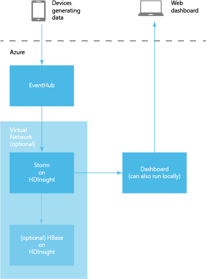

<properties
   pageTitle="Analyze sensor data with Apache Storm and HBase | Microsoft Azure"
   description="Learn how to use Apache Storm and HBase on HDInsight to process sensor data from Azure Event Hub and visualize it with D3.js. Also, connect to Storm with a virtual network."
   services="hdinsight"
   documentationCenter=""
   authors="Blackmist"
   manager="paulettm"
   editor="cgronlun"/>

<tags
   ms.service="hdinsight"
   ms.devlang="java"
   ms.topic="article"
   ms.tgt_pltfrm="na"
   ms.workload="big-data"
   ms.date="04/28/2015"
   ms.author="larryfr"/>

# Analyze sensor data with Apache Storm, Event Hub, and HBase in HDInsight (Hadoop)

Learn how to use Apache Storm on HDInsight to process sensor data from Azure Event Hub, and visualize it by using D3.js. This document also describes how to use an Azure virtual network to connect Storm on HDInsight with HBase on HDInsight, and store data from the topology into HBase.

## Prerequisites

* An Azure subscription

* An [Apache Storm on HDInsight cluster](hdinsight-storm-getting-started.md)

* [Node.js](http://nodejs.org/): Used for the web dashboard and to send sensor data to Event Hub.

* [Java and the JDK 1.7](http://www.oracle.com/technetwork/java/javase/downloads/index.html)

* [Maven](http://maven.apache.org/what-is-maven.html)

* [Git](http://git-scm.com/)

> [AZURE.NOTE] Java, the JDK, Maven, and Git are also available through the [Chocolatey NuGet](http://chocolatey.org/) package manager.

## Architecture

This example consists of the following components:

* **Azure Event Hub**: Provides data that is collected from sensors. For this example, an application is provided that generates fake data.

* **Storm on HDInsight**: Provides real-time processing of data from Event Hub.

* **HBase on HDInsight** (optional): Provides a persistent NoSQL data store.

* **Azure Virtual Network service** (optional, required if using HBase): Enables secure communications between the Storm on HDInsight and HBase on HDInsight clusters.

* **Dashboard website**: An example dashboard that charts data in real time.

	* The website is implemented in Node.js, so it can run on any client operating system for testing, or it can be deployed to Azure Websites.

	* [Socket.io](http://socket.io/) is used for real-time communication between the Storm topology and the website.

		> [AZURE.NOTE] This is an implementation detail. You can use any communications framework, such as raw WebSockets or SignalR.

	* [D3.js](http://d3js.org/) is used to graph the data that is sent to the website.

The topology reads data from Event Hub by using the **com.microsoft.eventhubs.spout.EventHubSpout** class, which is provided in the Storm on HDInsight cluster. Communication with the website is accomplished by using [socket.io-client.java](https://github.com/nkzawa/socket.io-client.java).

Optionally, communication with HBase is accomplished by using the [org.apache.storm.hbase.bolt.HBaseBolt](https://storm.apache.org/javadoc/apidocs/org/apache/storm/hbase/bolt/class-use/HBaseBolt.html) class, which is provided as part of Storm.

The following is a diagram of the topology.

> [AZURE.NOTE] This is a very simplified view of the topology. At run time, an instance of each component is created for each partition for the Event Hub that is being read. These instances are distributed across the nodes in the cluster, and data is routed between them as follows:
>
> * Data from the spout to the parser is load balanced.
> * Data from the parser to the Dashboard and HBase (if used) is grouped by Device ID, so that messages from the same device always flow to the same component.

### Components

* **EventHub Spout**: The spout is provided as part of the [HDInsight Storm Examples](https://github.com/hdinsight/hdinsight-storm-examples) on GitHub.

* **ParserBolt.java**: The data that is emitted by the spout is raw JSON, and occasionally more than one event is emitted at a time. This bolt demonstrates how to read the data emitted by the spout, and emit it to a new stream as a tuple that contains multiple fields.

* **DashboardBolt.java**: This demonstrates how to use the Socket.io client library for Java to send data in real time to the web dashboard.

## Prepare your environment

Before you use this example, you must create an Azure Event Hub, which the Storm topology reads. You must also create a Storm on HDInsight topology because the component used to read data from Event Hub is only available in the cluster.

> [AZURE.NOTE] Eventually the Event Hub spout will be available from Maven.

### Configure Event Hub

Event Hub is the data source for this example. Use the following steps to create a new Event Hub.

1. From the [Azure portal](https://manage.windowsazure.com), select **NEW | Service Bus | Event Hub | Custom Create**.

2. In the **Add a new Event Hub** dialog box, enter an **Event Hub Name**, select the **Region** to create the hub in, and then create a new namespace or select an existing one. Finally, click the arrow to continue.

2. In the **Configure Event Hub** dialog box, enter the **Partition count** and **Message Retention** values. For this example, use a partition count of 10 and a message retention of 1.

3. When the event hub has been created, select the namespace, then select **Event Hubs**. Finally, select the event hub that you created earlier.

4. Select **Configure**, then create two new access policies by using the following information.

	<table>
	<tr><th>Name</th><th>Permissions</th></tr>
	<tr><td>Devices</td><td>Send</td></tr>
	<tr><td>Storm</td><td>Listen</td></tr>
	</table>

	After creating permissions, select the **Save** icon at the bottom of the page. This creates the shared access policies that will be used to send messages to and read messages from this hub.

5. After saving the policies, use the **Shared access key generator** at the bottom of the page to retrieve the key for the **devices** and **storm** policies. Save these because you will use them later.

### Create the Storm on HDInsight cluster

1. Sign in to the [Azure portal](https://manage.windowsazure.com/).

2. Click **HDInsight** in the left pane, and then click **+NEW** in the lower-left corner of the page.

3. Click the HDInsight icon in the second column, and then select **Custom**.

4. On the **Cluster Details** page, enter the name of the new cluster, and select **Storm** for the **Cluster Type**. Click the arrow to continue.

5. Enter 1 for the number of **Data Nodes** to use for this cluster.

	> [AZURE.NOTE] To minimize the cost for the cluster used for this article, reduce the **Cluster Size** to 1, and delete the cluster after you have finished using it.

6. Enter the administrator **User Name** and **Password**, and then click the arrow to continue.

4. For **Storage Account**, select **Create New Storage** or select an existing storage account. Select or enter the **Account Name** and **Default container** to use. Select the check mark icon in the lower-left corner to create the Storm cluster.

## Download and install the EventHubSpout

1. Download the [HDInsight Storm Examples project](https://github.com/hdinsight/hdinsight-storm-examples/). Once downloaded, find the **lib/eventhubs/eventhubs-storm-spout-0.9-jar-with-dependencies.jar** file.

2. From the command prompt, use the following command to install the **eventhubs-storm-spout-0.9-jar-with-dependencies.jar** file into the local Maven store. This will allow you to easily add it as a reference in the Storm project in a later step.

		mvn install:install-file -Dfile=target/eventhubs-storm-spout-0.9-jar-with-dependencies.jar -DgroupId=com.microsoft.eventhubs -DartifactId=eventhubs-storm-spout -Dversion=0.9 -Dpackaging=jar

## Download and configure the project

Use the following to download the project from GitHub.

	git clone https://github.com/Blackmist/hdinsight-eventhub-example

After the command completes, you will have the following directory structure:

	hdinsight-eventhub-example/
		TemperatureMonitor/ - this is the Java topology
			conf/
				Config.properties
				hbase-site.xml
			src/
			test/
			dashboard/ - this is the node.js web dashboard
			SendEvents/ - utilities to send fake sensor data

> [AZURE.NOTE] This document does not go in to full details of the code included in this sample; however, the code is fully commented.

Open the **Config.properties** file and add the information you previously used when creating the Event Hub. Save the file after you add this information.

	eventhubspout.username = storm

	eventhubspout.password = <the key of the 'storm' policy>

	eventhubspout.namespace = <the event hub namespace>

	eventhubspout.entitypath = <the event hub name>

	eventhubspout.partitions.count = <the number of partitions for the event hub>

	## if not provided, will use storm's zookeeper settings
	## zookeeper.connectionstring=localhost:2181

	eventhubspout.checkpoint.interval = 10

	eventhub.receiver.credits = 1024

## Compile and test locally

Before testing, you must start the dashboard to view the output of the topology and generate data to store in Event Hub.

### Start the web application

1. Open a new command prompt or terminal, and change directories to the **hdinsight-eventhub-example/dashboard**, then use the following command to install the dependencies needed by the web application:

		npm install

2. Use the following command to start the web application:

		node server.js

	You should see a message similar to the following:

		Server listening at port 3000

2. Open a web browser and enter **http://localhost:3000/** as the address. You should see a page similar to the following:

	

	Leave this command prompt or terminal open. After testing, use Ctrl-C to stop the web server.

### Start generating data

> [AZURE.NOTE] The steps in this section use Node.js so that they can be run on any platform. For other language examples, see the **SendEvents** directory.

1. Open a new command prompt or terminal, and change directories to **hdinsight-eventhub-example/SendEvents/nodejs**, then use the following command to install the dependencies needed by the application:

		npm install

2. Open the **app.js** file in a text editor and add the Event Hub information you obtained earlier:

		// ServiceBus Namespace
		var namespace = 'servicebusnamespace';
		// Event Hub Name
		var hubname ='eventhubname';
		// Shared access Policy name and key (from Event Hub configuration)
		var my_key_name = 'devices';
		var my_key = 'key';

2. Use the following command to insert new entries in Event Hub:

		node app.js

	You should see several lines of output that contain the data sent to Event Hub. These will appear similar to the following:

		{"TimeStamp":"2015-02-10T14:43.05.00320Z","DeviceId":0,"Temperature":7}
		{"TimeStamp":"2015-02-10T14:43.05.00320Z","DeviceId":1,"Temperature":39}
		{"TimeStamp":"2015-02-10T14:43.05.00320Z","DeviceId":2,"Temperature":86}
		{"TimeStamp":"2015-02-10T14:43.05.00320Z","DeviceId":3,"Temperature":29}
		{"TimeStamp":"2015-02-10T14:43.05.00320Z","DeviceId":4,"Temperature":30}
		{"TimeStamp":"2015-02-10T14:43.05.00320Z","DeviceId":5,"Temperature":5}
		{"TimeStamp":"2015-02-10T14:43.05.00320Z","DeviceId":6,"Temperature":24}
		{"TimeStamp":"2015-02-10T14:43.05.00320Z","DeviceId":7,"Temperature":40}
		{"TimeStamp":"2015-02-10T14:43.05.00320Z","DeviceId":8,"Temperature":43}
		{"TimeStamp":"2015-02-10T14:43.05.00320Z","DeviceId":9,"Temperature":84}

### Start the topology

2. Start the topology locally by using the following command:

	mvn compile exec:java -Dstorm.topology=com.microsoft.examples.Temperature

	This will start the topology, read files from Event Hub, and send them to the dashboard running in Azure Websites. You should see lines appear in the web dashboard, similar to the following:

	

3. While the dashboard is running, use the `node app.js` command from the previous steps to send new data to the dashboard. Because the temperature values are randomly generated, the graph should update to show the new values.

3. After verifying that this works, stop the topology by typing Ctrl+C. To stop the SendEvent app, select the window and press any key. You can use Ctrl+C to stop the web server also.

## Package and deploy the topology to HDInsight

In your development environment, use the following steps to run the Temperature topology on your HDInsight Storm cluster.

### Publish the website dashboard

1. To deploy the dashboard to an Azure Website, follow the steps in [Build and deploy a Node.js website to Azure](web-sites-nodejs-develop-deploy-mac.md). Note the URL of the website, which will be similar to **mywebsite.azurewebsites.net**.

2. When the website is created, go to the site in the Azure portal and select the **Configure** tab. Enable **Web Sockets**, and then click **Save** at the bottom of the page.

2. Open **hdinsight-eventhub-example\TemperatureMonitor\src\main\java\com\microsoft\examples\bolts\DashboardBolt.java** and change the following line to point to the URL of the published dashboard:

		socket = IO.socket("http://mywebsite.azurewebsites.net");

3. Save the **DashboardBolt.java** file.

### Package and deploy the topology

1. Use the following command to create a JAR package from your project:

		mvn package

	This will create a file named **TemperatureMonitor-1.0-SNAPSHOT.jar** in the **target** directory of your project.

2. Follow the steps in [Deploy and manage Storm topologies](hdinsight-storm-deploy-monitor-topology.md) to upload and start the topology on your Storm on HDInsight cluster by using the **Storm Dashboard**.

3. After the topology has started, open a browser to the website you published on Azure, then use the `node app.js` command to send data to Event Hub. You should see the web dashboard update to display the information.

	

## Optional: Use HBase

To use Storm and HBase together, you must create an Azure virtual network and then create a Storm and HBase cluster within the network.

### Create an Azure virtual network (optional)

If you plan to use HBase with this example, you must create an Azure virtual network that will contain a Storm on HDInsight cluster and an HBase on HDInsight cluster.

1. Sign in to the [Azure portal](https://manage.windowsazure.com).

2. On the bottom of the page, click **+NEW** > **Network Services** > **Virtual Network** > **Quick Create**.

3. Type or select the following values:

	- **Name**: The name of your virtual network.

	- **Address space**: Choose an address space for the virtual network that is large enough to provide addresses for all nodes in the cluster. Otherwise, the provision will fail.

	- **Maximum VM count**: Choose one of the maximum virtual machine counts.

	- **Location**: The location must be the same as the HBase cluster that you will create.

	- **DNS server**: This article uses the internal DNS server provided by Azure; therefore, you can choose **None**. More advanced networking configurations with custom DNS servers are also supported. For the detailed guidance, see [Name Resolution (DNS)](http://msdn.microsoft.com/library/azure/jj156088.aspx).

4. Click **Create a Virtual Network**. The new virtual network name will appear in the list. Wait until the Status column shows **Created**.

5. In the main pane, click the virtual network you just created.

6. On the top of the page, click **DASHBOARD**.

7. Under **quick glance**, make a note of **VIRTUAL NETWORK ID**. You will need it when provisioning the Storm and HBase clusters.

8. At the top of the page, click **CONFIGURE**.

9. At the bottom of the page, the default subnet name is **Subnet-1**. Use the **add subnet** button to add **Subnet-2**. These subnets will house the Storm and HBase clusters.

	> [AZURE.NOTE] In this article, we will be using clusters with only one node. If you are creating multinode clusters, you must verify the **CIDR(ADDRESS COUNT)** for the subnet that will be used for the cluster. The address count must be greater than the number of worker nodes plus seven (Gateway: 2, Headnode: 2, Zookeeper: 3). For example, if you need a 10 node HBase cluster, the address count for the subnet must be greater than 17 (10+7). Otherwise, the deployment will fail.
	>
	> It is highly recommended to designate a single subnet for one cluster.

11. Click **Save** at the bottom of the page.

### Create a Storm and HBase cluster on the virtual network

1. Sign in to the [Azure Portal](https://manage.windowsazure.com/).

2. Click **HDInsight** in the left pane, and then click **+NEW** in the lower-left corner of the page.

3. Click the HDInsight icon in the second column, and then select **Custom**.

4. On the **Cluster Details** page, enter the name of the new cluster, and select **Storm** for the **Cluster Type**. Click the arrow to continue.

5. Enter 1 for the number of **Data Nodes** to use for this cluster. For **Region/Virtual Network**, select the Azure virtual network that you created earlier. For **Virtual Network Subnets**, select **Subnet-1**.

	> [AZURE.NOTE] To minimize the cost for the cluster used for this article, reduce the **Cluster Size** to 1, and delete the cluster after you have finished using it.

6. Enter the administrator **User Name** and **Password**, then click the arrow to continue.

4. For **Storage Account**, select **Create New Storage** or select an existing storage account. Select or enter the **Account Name** and **Default container** to use. Select the check mark icon in the lower-left corner to create the Storm cluster.

5. Repeat these steps to create a new **HBase** cluster. The following are the key differences:

	* **Cluster Type**: Select **HBase**

	* **Virtual Network Subnets**: Select **Subnet-2**

	* **Storage Account**: You should use a different container than the one used for the Storm cluster.

### Discover the HBase DNS suffix

To write to HBase from the Storm cluster, you must use the fully qualified domain name (FQDN) for the HBase cluster. Use the following command to discover this information:

	curl -u <username>:<password> -k https://<clustername>.azurehdinsight.net/ambari/api/v1/clusters/<clustername>.azurehdinsight.net/services/hbase/components/hbrest

In the JSON data returned, find the **"host_name"** entry. This will contain the FQDN for the nodes in the cluster, for example:

	...
	"host_name": "wordkernode0.<clustername>.b1.cloudapp.net
	...

The portion of the domain name beginning with the cluster name is the DNS suffix, for example, **mycluster.b1.cloudapp.net**.

### Enable the HBase bolt

1. Open **hdinsight-eventhub-example\TemperatureMonitor\conf\hbase-site.xml** and replace the `suffix` entries in the following line with the DNS suffix obtained previously for the HBase cluster. Save the file after you make these changes.

		<value>zookeeper0.suffix,zookeeper1.suffix,zookeeper2.suffix</value>

	This will be used by the HBase bolt to communicate with the HBase cluster.

1. Open **hdinsight-eventhub-example\TemperatureMonitor\src\main\java\com\microsoft\examples\bolts\** in a text editor, and uncomment the following lines by removing the `//` from the beginning. Save the file after you make this change.

		topologyBuilder.setBolt("HBase", new HBaseBolt("SensorData", mapper).withConfigKey("hbase.conf"), spoutConfig.getPartitionCount())
    	  .fieldsGrouping("Parser", "hbasestream", new Fields("deviceid")).setNumTasks(spoutConfig.getPartitionCount());

	This enables the HBase bolt.

	> [AZURE.NOTE] You should only enable the HBase bolt when you are deploying to the Storm cluster, not when you are testing locally.

### HBase and Storm data

Before running the topology, you must prepare HBase to accept the data.

1. Use Remote Desktop to connect to the HBase cluster.

2. From the desktop, start the HDInsight command-line and enter the following commands:

    cd %HBASE_HOME%
    bin\hbase shell

3. From the HBase shell, enter the following command to create a table to store the sensor data:

    create 'SensorData', 'cf'

4. Verify that the table contains no data by entering the following command:

    scan 'SensorData'

When you have started the topology on the Storm cluster and processed data, you can use the `scan 'SensorData'` command again to verify that data was inserted into HBase.

## Next steps

You have now learned how to use Storm to read data from Event Hub and display information from Storm on an external dashboard by using SignalR and D3.js. If you used the optional steps, you also learned how to configure HDInsight in a virtual network and how to communicate between a Storm topology and HBase by using the HBase bolt.

* For more examples of Storm topologies with HDinsight, see:

    * [Example topologies for Storm on HDInsight](hdinsight-storm-example-topology.md)

* For more information about Apache Storm, see the  [Apache Storm](https://storm.incubator.apache.org/) site.

* For more information about HBase on HDInsight, see the [HBase with HDInsight Overview](hdinsight-hbase-overview.md).

* For more information about Socket.io, see the [socket.io](http://socket.io/) site.

* For more information about D3.js, see [D3.js - Data Driven Documents](http://d3js.org/).

* For information about creating topologies in Java, see [Develop Java topologies for Apache Storm on HDInsight](hdinsight-storm-develop-java-topology.md).

* For information about creating topologies in .NET, see [Develop C# topologies for Apache Storm on HDInsight using Visual Studio](hdinsight-storm-develop-csharp-visual-studio-topology.md).

[azure-portal]: https://manage.windowsazure.com/
