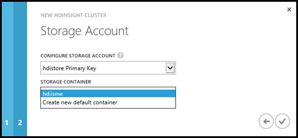

<properties linkid="manage-services-hdinsight-howto-blob-store" urlDisplayName="Blob Storage with HDInsight" pageTitle="Use Blob storage with HDInsight | Windows Azure" metaKeywords="" description="Learn how HDInsight uses Blob storage as the underlying data store for HDFS and how you can query data from the store." metaCanonical="" services="storage,hdinsight" documentationCenter="" title="Use Windows Azure Blob storage with HDInsight" authors=""  solutions="" writer="sburgess" manager="paulettm" editor="mollybos"  />

#Use Windows Azure Blob storage with HDInsight

Windows Azure HDInsight supports both Hadoop Distributed Files System (HDFS) and Windows Azure Blob storage for storing data. Blob storage is a robust, general purpose Windows Azure storage solution. Blob storage provides a full-featured HDFS interface for a seamless experience by enabling the full set of components in the Hadoop ecosystem to operate (by default) directly on the data. Blob storage is not just a low-cost solution; storing data in Blob storage enables the HDInsight clusters used for computation to be safely deleted without losing user data. 

??
<b>Note</b>??

Most HDFS commands such as <b>ls</b>, <b>copyFromLocal</b>, <b>mkdir</b>, and so on, still work as expected. Only the commands that are specific to the native HDFS implementation (which is referred to as DFS) such as <b>fschk</b> and <b>dfsadmin</b> will show different behavior on Windows Azure Blob storage.
??

For information on provisioning an HDInsight cluster, see [Get Started with Windows Azure HDInsight][hdinsight-getting-started].

##In this article

* [HDInsight storage architecture](#architecture)
* [Benefits of Windows Azure Blob storage](#benefits)
* [Prepare a container for Blob storage](#preparingblobstorage)
* [Address files in Blob storage](#addressing)
* [Next steps](#nextsteps)

##HDInsight storage architecture
The following diagram provides an abstract view of the HDInsight storage architecture:

  
HDInsight provides access to the distributed file system that is locally attached to the compute nodes. This file system can be accessed using the fully qualified URI. For example: 

	hdfs://<namenodehost>/<path>

In addition, HDInsight provides the ability to access data stored in Blob storage. The syntax to access Blob storage is:

	WASB

Hadoop supports a notion of default file system. The default file system implies a default scheme and authority; it can also be used to resolve relative paths. During the HDInsight provision process, user must specify a Blob storage container used as the default file system. 

Other than the Blob storage container designated as the default file system, you can also access containers that reside in the same Windows Azure storage account or different Windows Azure storage accounts located on the same data center as the HDInsight cluster:

* **Container in the same storage account:** Because the account name and key are stored in the *core-site.xml*, you have full access to the files in the container.
* **Container in a different storage account with the *public container* or the *public blob* access level:** You have read-only permission to the files in the container.

	
??
	<b>Note</b>??
	
Public container allows you to get a list of all blobs available in that container and get container metadata. Public blob allows  you to access the blobs only if you know the exact URL. For more information, see <a href="http://msdn.microsoft.com/en-us/library/windowsazure/dd179354.aspx">Restrict access to containers and blobs</a>.
??
	

* **Container in a different storage account with the *private* access levels:** you must add those containers during the provision process.

Blob storage containers store data as key/value pairs, and there is no directory hierarchy. However the "/" character can be used within the key name to make it appear as if a file is stored within a directory structure. For example, a blob's key may be *input/log1.txt*. No actual *input* directory exists, but due to the presence of the "/" character in the key name, it has the appearance of a file path.

##Benefits of Windows Azure Blob storage
The implied performance cost of not having compute and storage co-located is mitigated by the way the compute clusters are provisioned close to the storage account resources inside the Windows Azure data center, where the high speed network makes it very efficient for the compute nodes to access the data inside Blob storage.

There are several benefits associated with storing the data in Blob storage instead of HDFS:

* **Data reuse and sharing:** The data in HDFS is located inside the compute cluster. Only the applications that have access to the compute cluster can use the data using HDFS API. The data in Blob storage can be accessed either through the HDFS APIs or through the [Blob Storage REST APIs](http://msdn.microsoft.com/en-us/library/windowsazure/dd135733.aspx). Thus, a larger set of applications (including other HDInsight clusters) and tools can be used to produce and consume the data.
* **Data archiving:** Storing data in Blob storage enables the HDInsight clusters used for computation to be safely deleted without losing user data. 
* **Data storage cost:** Storing data in DFS for the long term is more costly than storing the data in Blob storage, since the cost of a compute cluster is higher than the cost of a Blob storage container. In addition, because the data does not have to be reloaded for every compute cluster generation, you are saving data loading costs as well.
* **Elastic scale-out:** While HDFS provides you with a scaled-out file system, the scale is determined by the number of nodes that you provision for your cluster. Changing the scale can become a more complicated process than relying on the Blob storage's elastic scaling capabilities that you get automatically.
* **Geo-replication:** Your Blob storage containers can be geo-replicated through the Azure Portal. While this gives you geographic recovery and data redundancy, a fail-over to the geo-replicated location will severely impact your performance and may incur additional costs. So our recommendation is to choose the geo-replication wisely and only if the value of the data is worth the additional cost.

Certain MapReduce jobs and packages may create intermediate results that you don't really want to store in the Blob storage container. In that case, you can still elect to store the data in the local HDFS. In fact, HDInsight uses DFS for several of these intermediate results in Hive jobs and other processes. 

##Prepare a container for Blob storage
To use blobs, you first create a [Windows Azure storage account](/en-us/manage/services/storage/how-to-create-a-storage-account/). As part of this, you specify a Windows Azure data center that will store the objects you create using this account. This data center must also used to host the HDInsight cluster. Wherever it lives, each blob you create belongs to some container in your storage account. This container may be an artitary Blob storage container created outside of HDInsight, or it may be a container that is created for an HDInsight cluster. 

###Provision the container used as the default file system

When provisioning an HDInsight cluster from Windows Azure Management Portal, there are two options: *quick create* and *custom create*. Using either of the options, a Windows Azure Storage account must be created beforehand.  For instructions, see [How to Create a Storage Account]( /en-us/manage/services/storage/how-to-create-a-storage-account/). 

Using the quick create option, you can choose an existing storage account. The provision process creates a new container with the same name as the HDInsight cluster name. This container is used as the default file system.

 
Using the custom create, you can either choose an existing Blob storage container or create a new container to be provisioned as the default file system. The new container has the same name as the HDInsight cluster name.

###Use APIs to create containers

Creating an HDInsight default file system can be done by creating a new Blob storage container through the commonly-used APIs in a storage account for which core-site.xml contains the storage key. In addition, you can also create a new container by referring to it in an HDFS command from Hadoop command line. For example:

	hadoop fs -mkdir wasbs://<newcontainer>@<accountname>.blob.core.windows.net/<newdirectory>

The example command will not only create the new directory *newdirectory* but, if it doesn't exist, will also create a new container called *newcontainer*.

##Address files in Blob storage

The URI scheme for accessing files in Blob storage is: 

	WASB

The URI scheme provides both unencrypted access with the *WASB:* prefix, and SSL encrypted access with *WASBS*. We recommend using *WASBS* wherever possible, even when accessing data that lives inside the same Windows Azure data center.
	
The &lt;container&gt; identifies the name of the Blob storage container. If no container name is specified but the domain is, then it refers to the [root container](http://msdn.microsoft.com/en-us/library/windowsazure/ee395424.aspx) of the domain's storage account. Note that root containers are read-only.
	
The &lt;accountname&gt; identifies the storage account name. A fully qualified domain name (FQDN) is required.
	
If neither the container nor the accountname has been specified, then the default file system is used.
	
The &lt;path&gt; is the file or directory HDFS path name. Since Blob storage containers are just a key-value store, there is no true hierarchical file system. A "/" inside a blob key is interpreted as a directory separator. Thus, if a blob key is *input/log1.txt*, then it is the file *log1.txt* inside the directory *input*.

For example:

	wasbs://dailylogs@myaccount.blob.core.windows.net/input/log1.txt
	
refers to the *file log1.txt* in the directory *input* on the Blob storage container *dailylogs* at the location *myaccount.blob.core.windows.net* using SSL.
	
	wasbs://myaccount.blob.core.windows.net/result.txt
	
refers to the file *result.txt* on the read-only WASB file system in the root container at the location *myaccount.blob.core.windows.net* that gets accessed through SSL. Note that *wasb://myaccount.blob.core.windows.net/output/result.txt* results in an exception, because Blob storage does not allow "/" inside path names in the root container to avoid ambiguities between paths and folder names. 
	
	wasb:///output/result.txt 
	
refers to the file *result.txt* in the output directory on the default file system.

Because HDInsight uses a Blob storage container as the default file system, you can refer to files and directories inside the default file system using relative or absolute paths. For example, the following statement lists all top-level directories and files of the default file system from Hadoop command line:

	hadoop fs -ls /output/result.txt

##Next steps

In this article, you learned how to use Blob storage with HDInsight and that Blob storage is a fundamental component of HDInsight. This allows you to build scalable, long-term archiving data acquisition solutions with Windows Azure Blob storage and use HDInsight to unlock the information inside the stored data.

To learn more, see the following articles:

* [Get Started with Windows Azure HDInsight][hdinsight-getting-started]
* [Upload data to HDInsight][hdinsight-upload-data]
* [Use Hive with HDInsight][hdinsight-hive]
* [Use Pig with HDInsight][hdinsight-pig]

[hdinsight-getting-started]: /en-us/manage/services/hdinsight/get-started-hdinsight/
[hdinsight-upload-data]: /en-us/manage/services/hdinsight/howto-upload-data-to-hdinsight/

[hdinsight-hive]: /en-us/manage/services/hdinsight/using-hive-with-hdinsight/
[hdinsight-pig]: /en-us/manage/services/hdinsight/using-pig-with-hdinsight/
